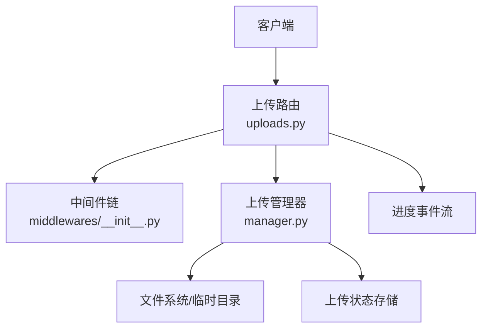
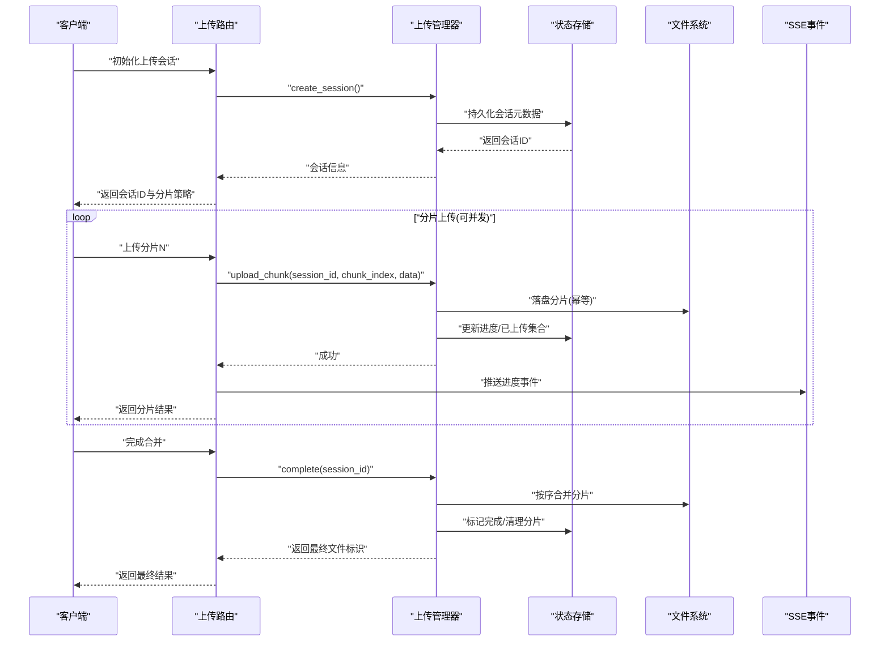
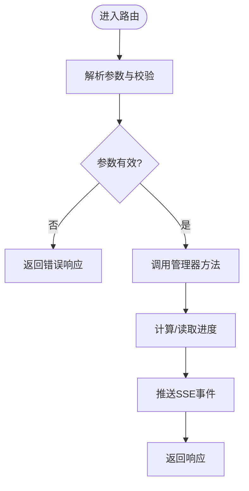
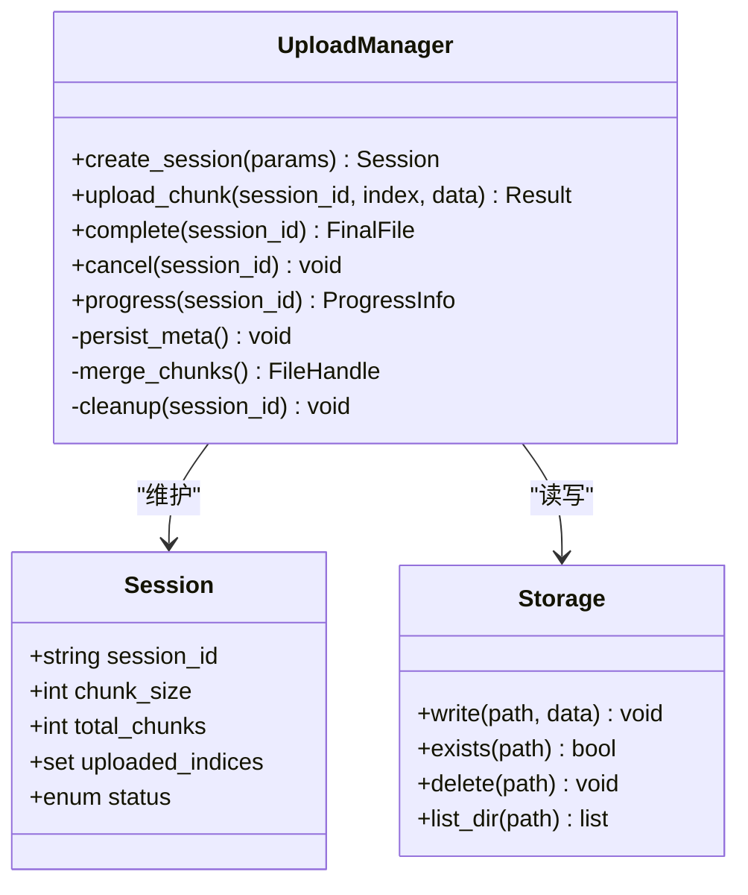
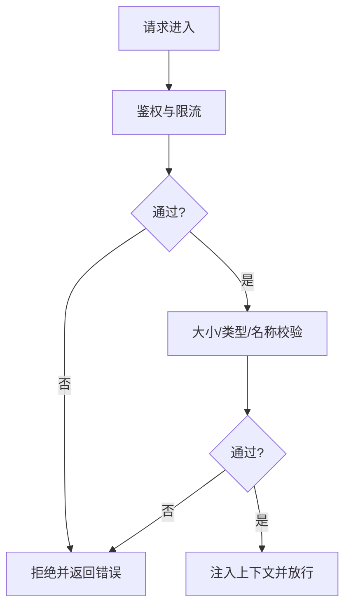
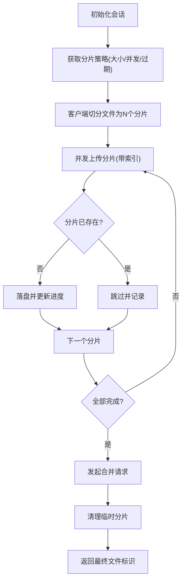
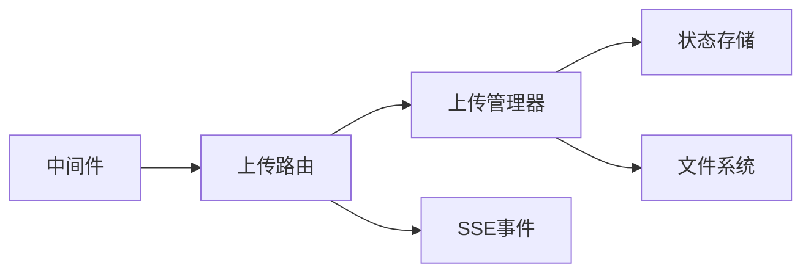

# 文件上传机制

<cite>
**本文引用的文件**   
- [backend/app/gateway/routers/uploads.py](file://backend/app/gateway/routers/uploads.py)
- [backend/packages/harness/deerflow/uploads/manager.py](file://backend/packages/harness/deerflow/uploads/manager.py)
- [backend/docs/FILE_UPLOAD.md](file://backend/docs/FILE_UPLOAD.md)
- [backend/tests/test_uploads_router.py](file://backend/tests/test_uploads_router.py)
- [backend/tests/test_uploads_manager.py](file://backend/tests/test_uploads_manager.py)
- [backend/tests/test_uploads_middleware_core_logic.py](file://backend/tests/test_uploads_middleware_core_logic.py)
- [backend/app/gateway/middlewares/__init__.py](file://backend/app/gateway/middlewares/__init__.py)
</cite>

## 目录
1. [简介](#简介)
2. [项目结构](#项目结构)
3. [核心组件](#核心组件)
4. [架构总览](#架构总览)
5. [详细组件分析](#详细组件分析)
6. [依赖关系分析](#依赖关系分析)
7. [性能考虑](#性能考虑)
8. [故障排查指南](#故障排查指南)
9. [结论](#结论)
10. [附录](#附录)

## 简介
本文件面向DeerFlow后端“文件上传”能力，系统性梳理分片上传、并发处理、断点续传、中间件流程、大文件优化策略、状态管理与错误恢复，并给出API使用示例与最佳实践、性能调优与安全加固建议。文档内容基于仓库中路由、管理器、测试与文档源文件进行归纳与提炼，确保读者既能快速上手，也能深入理解实现细节。

## 项目结构
与上传相关的代码主要分布在网关路由层与上传管理器：
- 网关路由层：负责HTTP接口定义、请求拦截、参数校验、进度事件推送等
- 上传管理器：负责分片生命周期管理（创建、合并、清理）、持久化状态、并发控制与断点续传逻辑
- 测试套件：覆盖路由、管理器与中间件核心逻辑，便于验证行为与回归
- 文档：提供用户视角的上传说明与配置要点

图表来源
- [backend/app/gateway/routers/uploads.py](file://backend/app/gateway/routers/uploads.py)
- [backend/packages/harness/deerflow/uploads/manager.py](file://backend/packages/harness/deerflow/uploads/manager.py)
- [backend/app/gateway/middlewares/__init__.py](file://backend/app/gateway/middlewares/__init__.py)

章节来源
- [backend/app/gateway/routers/uploads.py](file://backend/app/gateway/routers/uploads.py)
- [backend/packages/harness/deerflow/uploads/manager.py](file://backend/packages/harness/deerflow/uploads/manager.py)
- [backend/app/gateway/middlewares/__init__.py](file://backend/app/gateway/middlewares/__init__.py)

## 核心组件
- 上传路由（uploads.py）
  - 暴露分片上传相关REST接口：初始化上传会话、上传分片、查询进度、完成合并、取消/清理
  - 负责请求拦截、参数校验、SSE进度事件推送
- 上传管理器（manager.py）
  - 维护上传会话与分片元数据
  - 支持分片大小配置、并发写入、断点续传（幂等分片写入）
  - 负责最终合并、临时文件清理与异常恢复
- 中间件（middlewares/__init__.py）
  - 在路由前对上传请求进行统一拦截与预处理（鉴权、限流、大小限制、格式白名单等）
- 测试套件
  - test_uploads_router.py：验证路由行为与边界条件
  - test_uploads_manager.py：验证分片管理、合并、清理与并发
  - test_uploads_middleware_core_logic.py：验证中间件拦截与校验逻辑

章节来源
- [backend/app/gateway/routers/uploads.py](file://backend/app/gateway/routers/uploads.py)
- [backend/packages/harness/deerflow/uploads/manager.py](file://backend/packages/harness/deerflow/uploads/manager.py)
- [backend/app/gateway/middlewares/__init__.py](file://backend/app/gateway/middlewares/__init__.py)
- [backend/tests/test_uploads_router.py](file://backend/tests/test_uploads_router.py)
- [backend/tests/test_uploads_manager.py](file://backend/tests/test_uploads_manager.py)
- [backend/tests/test_uploads_middleware_core_logic.py](file://backend/tests/test_uploads_middleware_core_logic.py)

## 架构总览
上传整体采用“路由+管理器”的分层设计：路由专注协议与交互，管理器专注业务与持久化；通过中间件保障安全与一致性；通过SSE向客户端推送进度。

图表来源
- [backend/app/gateway/routers/uploads.py](file://backend/app/gateway/routers/uploads.py)
- [backend/packages/harness/deerflow/uploads/manager.py](file://backend/packages/harness/deerflow/uploads/manager.py)

## 详细组件分析

### 上传路由（uploads.py）
职责
- 定义上传相关REST端点：初始化、分片上传、进度查询、完成合并、取消/清理
- 解析请求体与路径参数，执行基础校验（如会话ID有效性、分片索引范围）
- 调用上传管理器执行业务逻辑
- 通过SSE向客户端推送进度事件，支持前端实时反馈

关键流程
- 初始化会话：生成唯一会话ID，记录分片大小、最大并发、过期时间等策略
- 分片上传：接收分片数据与索引，交由管理器落盘并更新进度
- 完成合并：校验所有分片完整性后触发合并，清理临时分片
- 进度查询：返回当前会话的已上传分片集合与百分比
- 取消/清理：中断未完成的上传，释放资源

图表来源
- [backend/app/gateway/routers/uploads.py](file://backend/app/gateway/routers/uploads.py)

章节来源
- [backend/app/gateway/routers/uploads.py](file://backend/app/gateway/routers/uploads.py)
- [backend/tests/test_uploads_router.py](file://backend/tests/test_uploads_router.py)

### 上传管理器（manager.py）
职责
- 维护上传会话与分片元数据（分片大小、总数、已上传集合、状态）
- 实现分片落盘、幂等写入、并发控制与断点续传
- 负责最终合并、临时文件清理与异常恢复
- 提供进度查询与统计

数据结构与复杂度
- 会话元数据：O(1)访问，已上传集合通常为哈希结构，插入/查询均摊O(1)
- 分片落盘：顺序I/O，合并阶段为线性扫描，总体O(N)
- 并发控制：基于锁或队列，避免重复写入与竞态

断点续传与幂等
- 以“会话ID + 分片索引”作为幂等键，重复上传同一分片不会造成重复数据
- 失败重试时，客户端可携带上次索引继续上传，服务端跳过已存在分片

图表来源
- [backend/packages/harness/deerflow/uploads/manager.py](file://backend/packages/harness/deerflow/uploads/manager.py)

章节来源
- [backend/packages/harness/deerflow/uploads/manager.py](file://backend/packages/harness/deerflow/uploads/manager.py)
- [backend/tests/test_uploads_manager.py](file://backend/tests/test_uploads_manager.py)

### 中间件（middlewares/__init__.py）
职责
- 在路由前对上传请求进行统一拦截与预处理
- 常见检查项：鉴权、IP/频率限制、请求体大小上限、MIME类型白名单、文件名清洗
- 将上下文信息注入到后续路由与管理器调用中

工作流程
- 拦截请求 -> 校验参数/权限 -> 设置上下文 -> 放行至路由
- 异常捕获与标准化错误响应
- 可选：记录审计日志与指标

图表来源
- [backend/app/gateway/middlewares/__init__.py](file://backend/app/gateway/middlewares/__init__.py)

章节来源
- [backend/app/gateway/middlewares/__init__.py](file://backend/app/gateway/middlewares/__init__.py)
- [backend/tests/test_uploads_middleware_core_logic.py](file://backend/tests/test_uploads_middleware_core_logic.py)

### 分片上传实现原理
- 分片大小配置
  - 由初始化会话接口返回，通常受服务器配置与网络环境影响
  - 过大导致内存峰值高、失败重传代价大；过小增加请求开销与合并成本
- 并发上传处理
  - 客户端可按并发度并行发送分片，服务端通过幂等写入保证正确性
  - 服务端侧可通过并发写锁或队列限制磁盘并发，避免IO瓶颈
- 断点续传
  - 客户端记录已上传分片索引，失败后可从任意分片继续
  - 服务端以“会话ID+索引”去重，避免重复写入

图表来源
- [backend/app/gateway/routers/uploads.py](file://backend/app/gateway/routers/uploads.py)
- [backend/packages/harness/deerflow/uploads/manager.py](file://backend/packages/harness/deerflow/uploads/manager.py)

章节来源
- [backend/app/gateway/routers/uploads.py](file://backend/app/gateway/routers/uploads.py)
- [backend/packages/harness/deerflow/uploads/manager.py](file://backend/packages/harness/deerflow/uploads/manager.py)

### 大文件处理的优化策略
- 内存管理
  - 分片流式写入，避免一次性加载整个文件到内存
  - 合并阶段按序读取分片并流式输出，降低峰值内存占用
- 流式处理
  - 上传与合并均采用流式I/O，减少缓冲拷贝
- 临时文件清理
  - 合并完成后立即删除分片文件
  - 会话过期或取消时，后台任务清理残留分片，防止磁盘泄漏

章节来源
- [backend/packages/harness/deerflow/uploads/manager.py](file://backend/packages/harness/deerflow/uploads/manager.py)

### 上传状态管理与错误恢复
- 状态模型
  - 会话状态：待上传、进行中、已完成、已取消、已过期
  - 分片集合：已上传索引集合，用于进度计算与断点续传
- 错误恢复
  - 网络抖动：客户端重试单个分片，服务端幂等处理
  - 服务重启：从状态存储恢复会话与分片集合，继续上传
  - 合并失败：保留分片，允许再次触发合并

章节来源
- [backend/packages/harness/deerflow/uploads/manager.py](file://backend/packages/harness/deerflow/uploads/manager.py)
- [backend/tests/test_uploads_manager.py](file://backend/tests/test_uploads_manager.py)

### 上传API使用示例与最佳实践
- 典型流程
  - 初始化会话：获取会话ID与分片策略
  - 分片上传：按并发度上传各分片，携带会话ID与分片索引
  - 进度查询：轮询或监听SSE事件获取进度
  - 完成合并：确认全部分片上传后触发合并
  - 清理/取消：不再需要时主动取消并释放资源
- 最佳实践
  - 合理设置分片大小（结合带宽与延迟）
  - 控制并发度，避免打满磁盘IO
  - 记录已上传索引，支持断点续传
  - 对超大文件启用后台合并与异步清理
  - 设置合理的会话过期时间与清理策略

章节来源
- [backend/app/gateway/routers/uploads.py](file://backend/app/gateway/routers/uploads.py)
- [backend/docs/FILE_UPLOAD.md](file://backend/docs/FILE_UPLOAD.md)

## 依赖关系分析
- 路由与管理器解耦：路由仅负责协议与交互，管理器封装业务与持久化
- 中间件前置校验：提升安全性与稳定性
- 测试驱动：路由、管理器与中间件均有对应测试，保障行为稳定

图表来源
- [backend/app/gateway/routers/uploads.py](file://backend/app/gateway/routers/uploads.py)
- [backend/packages/harness/deerflow/uploads/manager.py](file://backend/packages/harness/deerflow/uploads/manager.py)
- [backend/app/gateway/middlewares/__init__.py](file://backend/app/gateway/middlewares/__init__.py)

章节来源
- [backend/app/gateway/routers/uploads.py](file://backend/app/gateway/routers/uploads.py)
- [backend/packages/harness/deerflow/uploads/manager.py](file://backend/packages/harness/deerflow/uploads/manager.py)
- [backend/app/gateway/middlewares/__init__.py](file://backend/app/gateway/middlewares/__init__.py)

## 性能考虑
- 分片大小
  - 建议在1MB~10MB之间根据网络状况调整，平衡吞吐与重试成本
- 并发度
  - 根据磁盘IO与CPU核数设置并发上限，避免争用
- I/O路径
  - 使用独立临时目录，避免与业务数据混放
  - 合并阶段顺序读取，减少随机IO
- 缓存与复用
  - 会话元数据可短期缓存，减少频繁持久化
- 监控与指标
  - 记录上传耗时、成功率、分片大小分布、合并耗时等

[本节为通用指导，不直接分析具体文件]

## 故障排查指南
- 常见问题
  - 分片丢失：检查已上传索引集合与分片文件是否存在
  - 合并失败：查看分片顺序与完整性，确认无损坏
  - 进度不更新：检查SSE通道与会话状态同步
  - 磁盘空间不足：清理过期会话与临时分片
- 定位手段
  - 查看会话状态与分片集合
  - 核对中间件拦截日志与错误码
  - 复现断点续传场景，验证幂等写入

章节来源
- [backend/tests/test_uploads_router.py](file://backend/tests/test_uploads_router.py)
- [backend/tests/test_uploads_manager.py](file://backend/tests/test_uploads_manager.py)
- [backend/tests/test_uploads_middleware_core_logic.py](file://backend/tests/test_uploads_middleware_core_logic.py)

## 结论
DeerFlow的文件上传机制通过“路由+管理器+中间件”的分层设计，实现了可扩展的分片上传、并发处理与断点续传能力。配合流式I/O与完善的清理策略，能够高效、稳定地处理大文件上传场景。建议在生产环境中结合网络与硬件特性调优分片大小与并发度，并完善监控与告警，以获得更佳的体验与可靠性。

[本节为总结性内容，不直接分析具体文件]

## 附录
- 参考文档
  - [backend/docs/FILE_UPLOAD.md](file://backend/docs/FILE_UPLOAD.md)
- 测试用例
  - [backend/tests/test_uploads_router.py](file://backend/tests/test_uploads_router.py)
  - [backend/tests/test_uploads_manager.py](file://backend/tests/test_uploads_manager.py)
  - [backend/tests/test_uploads_middleware_core_logic.py](file://backend/tests/test_uploads_middleware_core_logic.py)