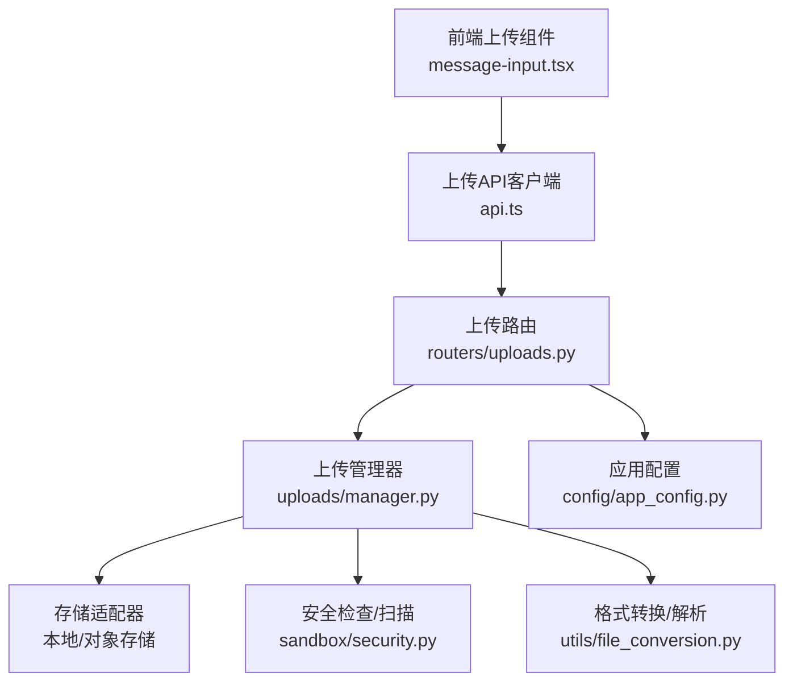
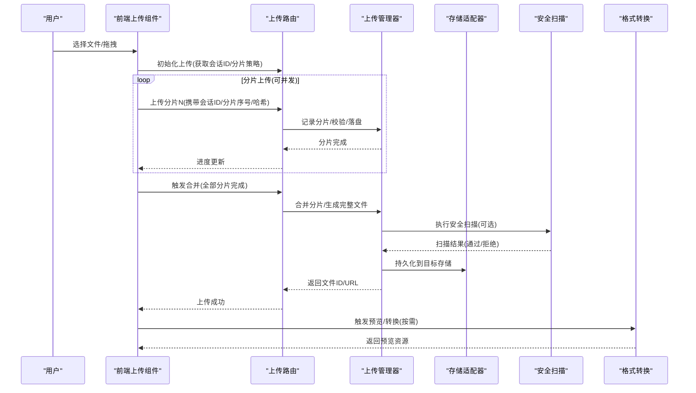
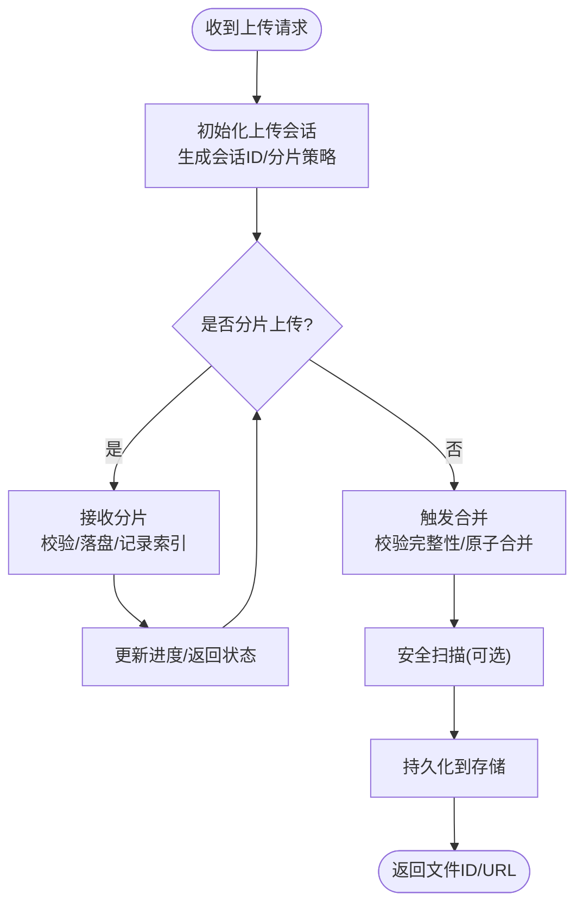
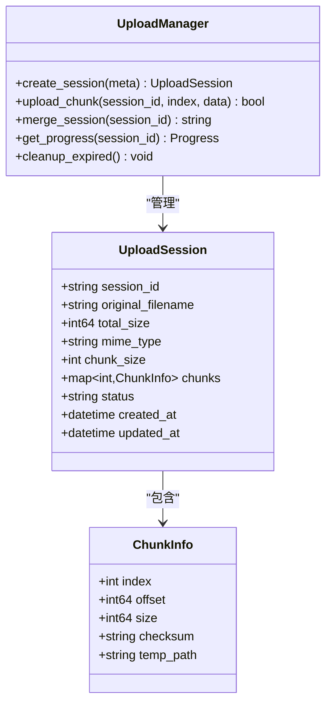
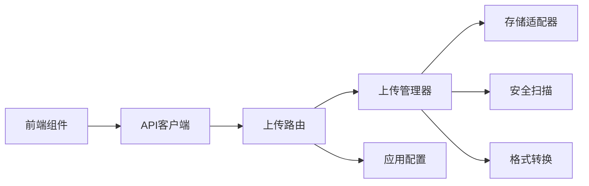

# 文件处理

<cite>
**本文引用的文件**   
- [backend/app/gateway/routers/uploads.py](file://backend/app/gateway/routers/uploads.py)
- [backend/packages/harness/deerflow/uploads/manager.py](file://backend/packages/harness/deerflow/uploads/manager.py)
- [backend/docs/FILE_UPLOAD.md](file://backend/docs/FILE_UPLOAD.md)
- [backend/tests/test_uploads_router.py](file://backend/tests/test_uploads_router.py)
- [backend/tests/test_uploads_manager.py](file://backend/tests/test_uploads_manager.py)
- [backend/tests/test_file_conversion.py](file://backend/tests/test_file_conversion.py)
- [backend/packages/harness/deerflow/utils/file_conversion.py](file://backend/packages/harness/deerflow/utils/file_conversion.py)
- [backend/packages/harness/deerflow/sandbox/security.py](file://backend/packages/harness/deerflow/sandbox/security.py)
- [backend/packages/harness/deerflow/config/app_config.py](file://backend/packages/harness/deerflow/config/app_config.py)
- [frontend/src/core/uploads/index.ts](file://frontend/src/core/uploads/index.ts)
- [frontend/src/core/uploads/api.ts](file://frontend/src/core/uploads/api.ts)
- [frontend/src/components/workspace/chats/message-input.tsx](file://frontend/src/components/workspace/chats/message-input.tsx)
</cite>

## 目录
1. [简介](#简介)
2. [项目结构](#项目结构)
3. [核心组件](#核心组件)
4. [架构总览](#架构总览)
5. [详细组件分析](#详细组件分析)
6. [依赖关系分析](#依赖关系分析)
7. [性能与内存优化](#性能与内存优化)
8. [故障排查指南](#故障排查指南)
9. [结论](#结论)
10. [附录](#附录)

## 简介
本文件面向DeerFlow的文件处理系统，聚焦于上传、校验、存储、安全扫描、下载与预览、以及大文件处理的实现与最佳实践。文档覆盖分片上传、断点续传、并发处理、格式支持、大小限制与类型验证、本地与对象存储策略、病毒扫描与安全流程、错误处理与异常恢复等主题，帮助读者快速理解并正确使用该子系统。

## 项目结构
后端围绕网关路由与上传管理器组织：
- 网关层提供HTTP接口，负责参数校验、流式接收、进度上报与响应封装。
- 上传管理层负责分片合并、断点续传、元数据持久化、存储适配（本地或对象存储）、并发控制与清理。
- 工具层提供文件格式转换、内容解析与安全扫描能力。
- 前端提供上传组件、进度条、重试与取消逻辑，并与后端API交互。

图表来源
- [backend/app/gateway/routers/uploads.py](file://backend/app/gateway/routers/uploads.py)
- [backend/packages/harness/deerflow/uploads/manager.py](file://backend/packages/harness/deerflow/uploads/manager.py)
- [backend/packages/harness/deerflow/sandbox/security.py](file://backend/packages/harness/deerflow/sandbox/security.py)
- [backend/packages/harness/deerflow/utils/file_conversion.py](file://backend/packages/harness/deerflow/utils/file_conversion.py)
- [backend/packages/harness/deerflow/config/app_config.py](file://backend/packages/harness/deerflow/config/app_config.py)
- [frontend/src/core/uploads/api.ts](file://frontend/src/core/uploads/api.ts)
- [frontend/src/components/workspace/chats/message-input.tsx](file://frontend/src/components/workspace/chats/message-input.tsx)

章节来源
- [backend/docs/FILE_UPLOAD.md](file://backend/docs/FILE_UPLOAD.md)

## 核心组件
- 上传路由（Gateway）
  - 职责：接收上传请求、校验参数与大小、创建上传会话、管理分片上传与合并、返回任务ID与进度。
  - 关键点：支持分片上传、断点续传、并发上传、进度回调、错误码统一。
- 上传管理器（Upload Manager）
  - 职责：维护上传会话状态、分片索引与完整性校验、并发写入、合并策略、存储落盘、清理临时文件。
  - 关键点：幂等性设计、原子合并、失败重试、资源回收。
- 安全与扫描
  - 职责：对上传内容进行类型白名单校验、大小限制、可选的病毒扫描与恶意内容检测。
  - 关键点：可插拔扫描器、异步扫描、结果缓存。
- 格式转换与解析
  - 职责：将多种文档/媒体转换为下游可用的中间格式（如文本提取、图片缩略图、音视频转码）。
  - 关键点：流式处理、超时控制、资源释放。
- 前端上传组件
  - 职责：选择文件、分片切分、并发上传、断点续传、进度展示、错误重试与取消。
  - 关键点：浏览器兼容性、网络抖动处理、用户反馈。

章节来源
- [backend/app/gateway/routers/uploads.py](file://backend/app/gateway/routers/uploads.py)
- [backend/packages/harness/deerflow/uploads/manager.py](file://backend/packages/harness/deerflow/uploads/manager.py)
- [backend/packages/harness/deerflow/sandbox/security.py](file://backend/packages/harness/deerflow/sandbox/security.py)
- [backend/packages/harness/deerflow/utils/file_conversion.py](file://backend/packages/harness/deerflow/utils/file_conversion.py)
- [frontend/src/core/uploads/api.ts](file://frontend/src/core/uploads/api.ts)
- [frontend/src/components/workspace/chats/message-input.tsx](file://frontend/src/components/workspace/chats/message-input.tsx)

## 架构总览
整体采用“网关+服务”的分层架构，上传路径从前端到后端再到存储与安全扫描，形成清晰的职责边界。

图表来源
- [backend/app/gateway/routers/uploads.py](file://backend/app/gateway/routers/uploads.py)
- [backend/packages/harness/deerflow/uploads/manager.py](file://backend/packages/harness/deerflow/uploads/manager.py)
- [backend/packages/harness/deerflow/sandbox/security.py](file://backend/packages/harness/deerflow/sandbox/security.py)
- [backend/packages/harness/deerflow/utils/file_conversion.py](file://backend/packages/harness/deerflow/utils/file_conversion.py)

## 详细组件分析

### 上传路由（Gateway）
- 功能要点
  - 初始化上传：分配会话ID、计算分片大小、返回上传策略。
  - 分片上传：按会话ID与分片序号写入临时目录，记录索引与校验和。
  - 合并上传：校验所有分片存在且顺序正确后，原子合并为完整文件。
  - 进度查询：基于会话ID聚合已上传分片数量与大小。
  - 错误处理：统一错误码、幂等重试、资源清理。
- 关键流程
  - 初始化 -> 分片上传 -> 合并 -> 安全扫描 -> 存储持久化 -> 返回结果。

图表来源
- [backend/app/gateway/routers/uploads.py](file://backend/app/gateway/routers/uploads.py)

章节来源
- [backend/app/gateway/routers/uploads.py](file://backend/app/gateway/routers/uploads.py)
- [backend/tests/test_uploads_router.py](file://backend/tests/test_uploads_router.py)

### 上传管理器（Upload Manager）
- 功能要点
  - 会话管理：维护会话生命周期、分片索引、校验信息、状态机。
  - 并发控制：限制并发写入数、避免IO热点、保证顺序一致性。
  - 断点续传：基于会话ID与分片序号去重，支持中断后继续。
  - 合并策略：按序拼接分片、生成最终文件、清理临时数据。
  - 存储适配：抽象本地与对象存储接口，统一读写语义。
- 数据结构
  - 会话：包含会话ID、原始文件名、大小、MIME类型、分片策略、状态、时间戳。
  - 分片：包含分片序号、偏移、大小、校验和、临时路径。
- 复杂度
  - 分片写入：O(1)追加；合并：O(N)顺序读取；校验：O(N)。
  - 空间：临时目录占用等于文件大小；合并完成后释放。

图表来源
- [backend/packages/harness/deerflow/uploads/manager.py](file://backend/packages/harness/deerflow/uploads/manager.py)

章节来源
- [backend/packages/harness/deerflow/uploads/manager.py](file://backend/packages/harness/deerflow/uploads/manager.py)
- [backend/tests/test_uploads_manager.py](file://backend/tests/test_uploads_manager.py)

### 安全与扫描
- 功能要点
  - 类型白名单：根据扩展名与MIME类型进行双重校验。
  - 大小限制：在网关层与存储层双重拦截，防止超大文件。
  - 病毒扫描：可选接入外部扫描器，异步执行，结果回写会话状态。
  - 恶意内容检测：基于规则或模型对文本/媒体进行风险识别。
- 集成方式
  - 扫描器作为插件注入，支持同步/异步模式。
  - 扫描失败时按策略降级（拒绝/放行并标记）。

章节来源
- [backend/packages/harness/deerflow/sandbox/security.py](file://backend/packages/harness/deerflow/sandbox/security.py)
- [backend/docs/FILE_UPLOAD.md](file://backend/docs/FILE_UPLOAD.md)

### 格式转换与解析
- 支持类型
  - 文本：TXT、MD、CSV、JSON、XML等，提取纯文本与结构化字段。
  - 图片：JPG、PNG、GIF、WEBP等，生成缩略图与元数据。
  - 音频：MP3、WAV、OGG等，提取时长、采样率、转码为通用格式。
  - 视频：MP4、MKV、MOV等，抽取帧、生成封面、转码。
  - 文档：PDF、DOCX、PPTX、XLSX等，OCR与内容解析。
- 处理策略
  - 流式读取与分段处理，避免一次性加载大文件。
  - 超时与资源释放，防止泄漏。
  - 输出标准化中间格式，供下游消费。

章节来源
- [backend/packages/harness/deerflow/utils/file_conversion.py](file://backend/packages/harness/deerflow/utils/file_conversion.py)
- [backend/tests/test_file_conversion.py](file://backend/tests/test_file_conversion.py)

### 前端上传组件
- 功能要点
  - 文件选择与拖拽、分片切分、并发上传、断点续传、进度展示。
  - 错误重试与取消、网络抖动自适应、用户提示。
- 与后端交互
  - 调用初始化接口获取会话与策略。
  - 循环上传分片，携带会话ID与分片序号。
  - 合并完成后轮询进度或直接等待结果。

章节来源
- [frontend/src/core/uploads/api.ts](file://frontend/src/core/uploads/api.ts)
- [frontend/src/components/workspace/chats/message-input.tsx](file://frontend/src/components/workspace/chats/message-input.tsx)

## 依赖关系分析
- 模块耦合
  - 路由依赖管理器与配置，解耦存储与安全。
  - 管理器依赖存储适配器与安全扫描器，保持低耦合。
  - 前端依赖API客户端，屏蔽底层细节。
- 外部依赖
  - 对象存储SDK（如S3/OSS），本地文件系统。
  - 安全扫描引擎（如ClamAV或自定义服务）。
  - 媒体处理库（如FFmpeg、图像处理库）。

图表来源
- [backend/app/gateway/routers/uploads.py](file://backend/app/gateway/routers/uploads.py)
- [backend/packages/harness/deerflow/uploads/manager.py](file://backend/packages/harness/deerflow/uploads/manager.py)
- [backend/packages/harness/deerflow/config/app_config.py](file://backend/packages/harness/deerflow/config/app_config.py)
- [frontend/src/core/uploads/api.ts](file://frontend/src/core/uploads/api.ts)

章节来源
- [backend/packages/harness/deerflow/config/app_config.py](file://backend/packages/harness/deerflow/config/app_config.py)

## 性能与内存优化
- 分片大小调优
  - 建议默认分片大小：1MB~10MB，依据网络带宽与服务器内存调整。
  - 大文件场景提高分片数以降低单次传输失败影响。
- 并发控制
  - 限制并发上传数，避免IO与CPU争用。
  - 使用队列与信号量控制写入速率。
- 流式处理
  - 读取与写入均采用流式，避免整文件加载到内存。
  - 合并阶段顺序读取分片，减少随机IO。
- 存储优化
  - 本地存储：使用高效文件系统，定期清理过期会话。
  - 对象存储：启用分片直传与服务端合并（若支持）。
- 缓存与复用
  - 会话状态缓存（内存/Redis），加速进度查询。
  - 扫描结果缓存，避免重复扫描。

[本节为通用指导，不直接分析具体文件]

## 故障排查指南
- 常见问题
  - 上传失败：检查会话ID有效性、分片序号连续性、校验和不匹配。
  - 合并失败：确认所有分片存在、顺序正确、无损坏。
  - 扫描拒绝：查看扫描日志、白名单配置、恶意内容检测结果。
  - 内存溢出：增大分片大小上限、限制并发、启用流式处理。
- 定位方法
  - 查看会话状态与分片索引，核对临时目录文件。
  - 检查网关日志与管理器日志，关注错误码与堆栈。
  - 使用进度接口追踪上传过程，定位卡住的分片。
- 恢复策略
  - 自动重试：针对网络抖动与瞬时错误。
  - 断点续传：基于会话ID与分片序号恢复。
  - 资源清理：定时任务清理过期会话与临时文件。

章节来源
- [backend/tests/test_uploads_router.py](file://backend/tests/test_uploads_router.py)
- [backend/tests/test_uploads_manager.py](file://backend/tests/test_uploads_manager.py)

## 结论
DeerFlow的文件处理系统以分片上传为核心，结合断点续传、并发控制、安全扫描与格式转换，提供了稳定高效的端到端解决方案。通过清晰的分层设计与可扩展的插件机制，系统能够灵活适配不同存储与安全需求，并在大文件场景下保持良好的性能与稳定性。

## 附录
- 配置项参考
  - 最大文件大小、分片大小、并发数、扫描开关、存储路径等。
- 示例流程
  - 初始化 -> 分片上传 -> 合并 -> 扫描 -> 存储 -> 预览。

章节来源
- [backend/docs/FILE_UPLOAD.md](file://backend/docs/FILE_UPLOAD.md)