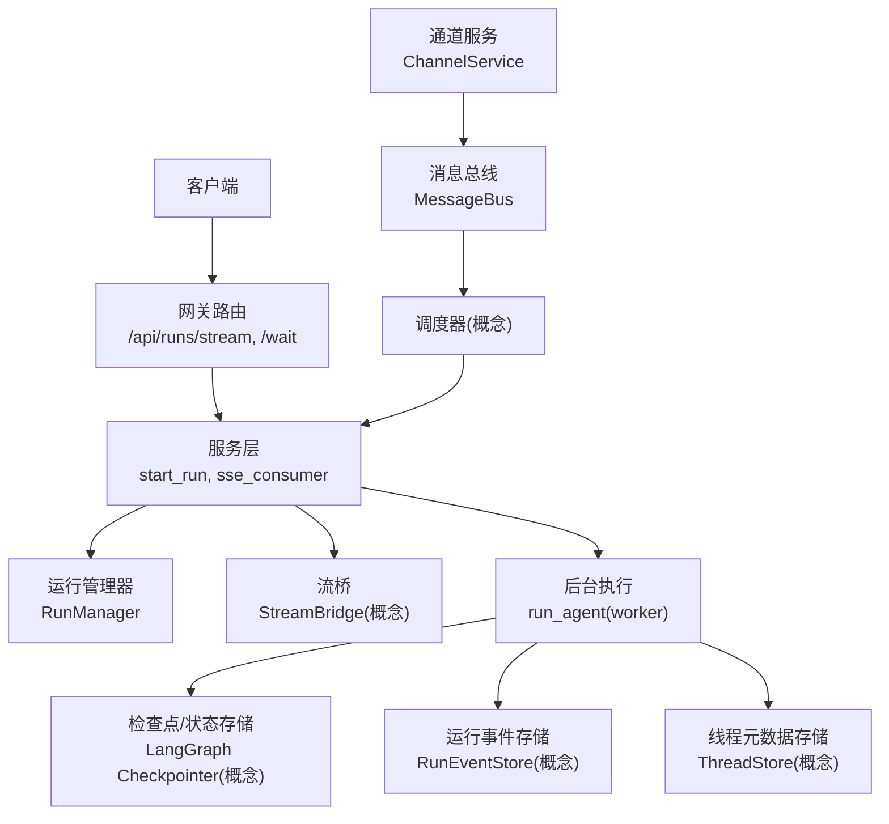
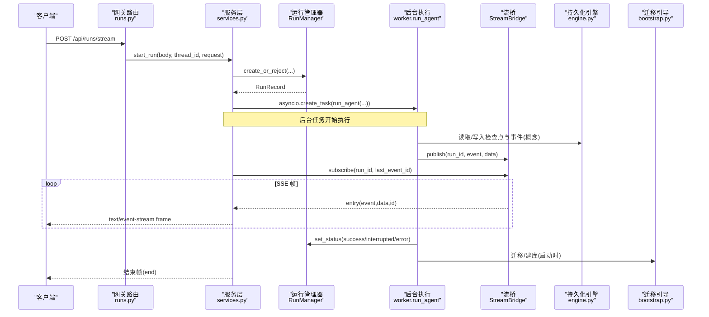
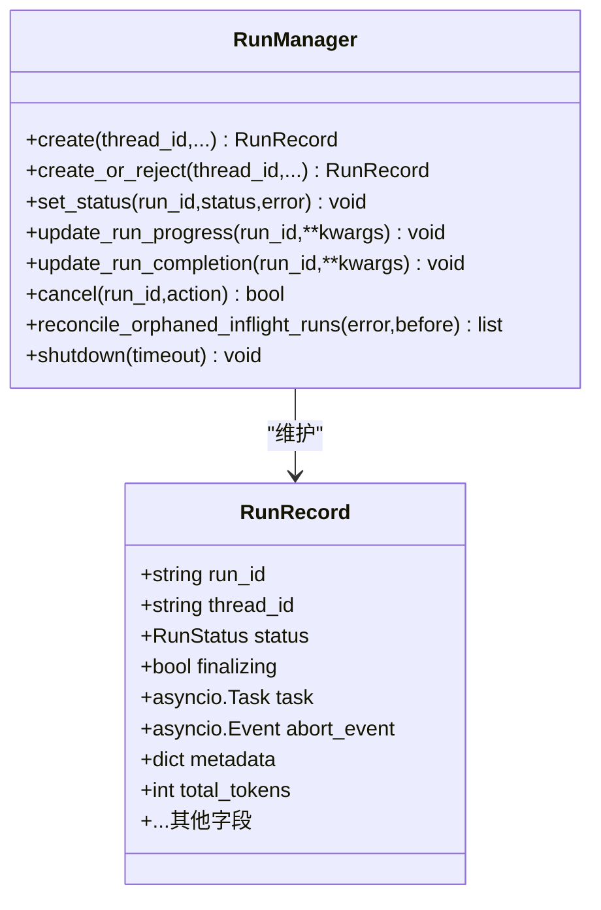
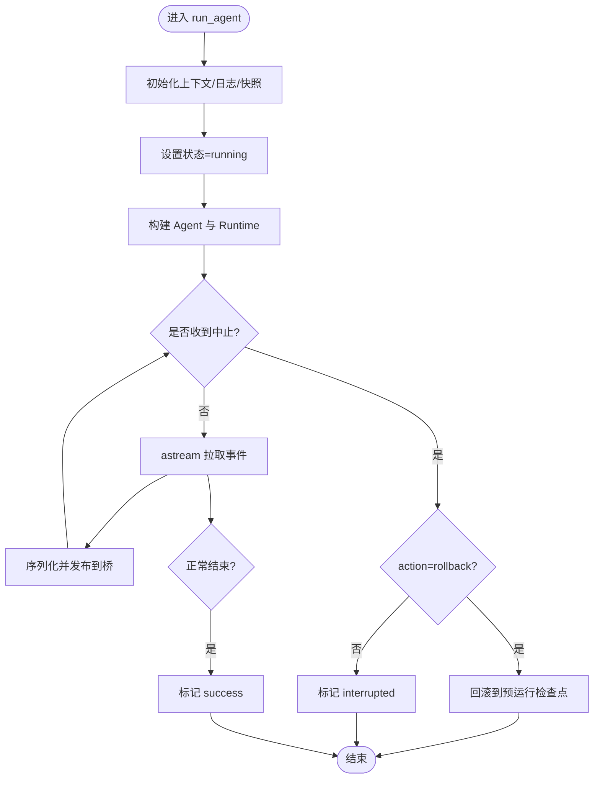
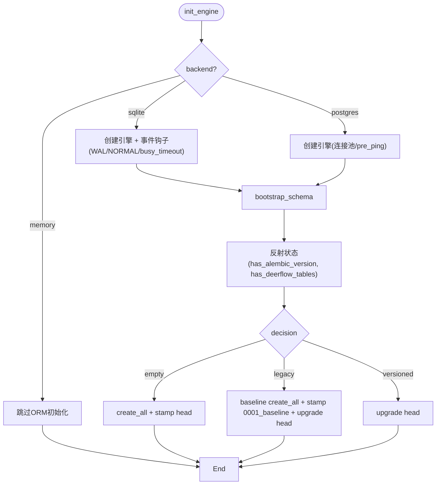
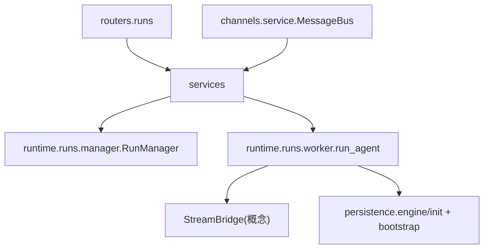

# 数据流设计

<cite>
**本文引用的文件**   
- [backend/app/gateway/routers/runs.py](file://backend/app/gateway/routers/runs.py)
- [backend/app/gateway/services.py](file://backend/app/gateway/services.py)
- [backend/packages/harness/deerflow/runtime/runs/manager.py](file://backend/packages/harness/deerflow/runtime/runs/manager.py)
- [backend/packages/harness/deerflow/runtime/runs/worker.py](file://backend/packages/harness/deerflow/runtime/runs/worker.py)
- [backend/packages/harness/deerflow/persistence/engine.py](file://backend/packages/harness/deerflow/persistence/engine.py)
- [backend/packages/harness/deerflow/persistence/bootstrap.py](file://backend/packages/harness/deerflow/persistence/bootstrap.py)
- [backend/app/channels/message_bus.py](file://backend/app/channels/message_bus.py)
- [backend/app/channels/service.py](file://backend/app/channels/service.py)
</cite>

## 目录
1. [简介](#简介)
2. [项目结构](#项目结构)
3. [核心组件](#核心组件)
4. [架构总览](#架构总览)
5. [详细组件分析](#详细组件分析)
6. [依赖关系分析](#依赖关系分析)
7. [性能考量](#性能考量)
8. [故障排查指南](#故障排查指南)
9. [结论](#结论)

## 简介
本文件面向 DeerFlow 的数据流设计，聚焦从用户请求到代理执行、再到结果返回的完整链路；阐述事件驱动与基于 LangGraph 的事件处理及状态转换机制；说明实时流式传输（SSE）与消息队列集成；详述数据持久化策略（内存、数据库、缓存）以及数据一致性与事务处理方案。文档以代码级事实为依据，辅以可视化图示，帮助读者快速理解系统如何组织数据在网关、运行期、通道与持久层之间的流转。

## 项目结构
围绕数据流的关键路径涉及以下模块：
- 网关路由与服务层：接收 HTTP 请求，创建 Run，编排 SSE 消费与等待完成。
- 运行期管理：RunManager 维护运行记录与并发控制；Worker 负责后台执行 Agent 图并推送事件。
- 持久化引擎与迁移：初始化 SQLAlchemy 异步引擎、自动建库与 Alembic 迁移。
- 通道与消息总线：IM 渠道通过 MessageBus 将入站消息投递给调度器，出站消息回调回渠道。



图表来源
- [backend/app/gateway/routers/runs.py:35-90](file://backend/app/gateway/routers/runs.py#L35-L90)
- [backend/app/gateway/services.py:514-670](file://backend/app/gateway/services.py#L514-L670)
- [backend/packages/harness/deerflow/runtime/runs/manager.py:358-401](file://backend/packages/harness/deerflow/runtime/runs/manager.py#L358-L401)
- [backend/packages/harness/deerflow/runtime/runs/worker.py:207-330](file://backend/packages/harness/deerflow/runtime/runs/worker.py#L207-L330)
- [backend/app/channels/message_bus.py:134-191](file://backend/app/channels/message_bus.py#L134-L191)
- [backend/app/channels/service.py:87-144](file://backend/app/channels/service.py#L87-L144)

章节来源
- [backend/app/gateway/routers/runs.py:1-144](file://backend/app/gateway/routers/runs.py#L1-L144)
- [backend/app/gateway/services.py:1-824](file://backend/app/gateway/services.py#L1-L824)
- [backend/packages/harness/deerflow/runtime/runs/manager.py:1-864](file://backend/packages/harness/deerflow/runtime/runs/manager.py#L1-L864)
- [backend/packages/harness/deerflow/runtime/runs/worker.py:1-800](file://backend/packages/harness/deerflow/runtime/runs/worker.py#L1-L800)
- [backend/packages/harness/deerflow/persistence/engine.py:1-206](file://backend/packages/harness/deerflow/persistence/engine.py#L1-L206)
- [backend/packages/harness/deerflow/persistence/bootstrap.py:1-453](file://backend/packages/harness/deerflow/persistence/bootstrap.py#L1-L453)
- [backend/app/channels/message_bus.py:1-191](file://backend/app/channels/message_bus.py#L1-L191)
- [backend/app/channels/service.py:1-428](file://backend/app/channels/service.py#L1-L428)

## 核心组件
- 网关路由
  - 提供无状态运行端点：/api/runs/stream（SSE）、/api/runs/wait（阻塞等待）。
  - 解析 thread_id，调用服务层创建运行并返回流或最终状态。
- 服务层
  - start_run：校验上下文、合并配置、创建 RunRecord、启动后台任务。
  - sse_consumer：订阅 StreamBridge 事件，按 SSE 帧格式输出，处理心跳与断开语义。
  - wait_for_run_completion：复用同一桥接，支持心跳唤醒与断开取消。
- 运行管理器
  - RunManager：内存注册表 + 可选持久化后端；原子创建/拒绝策略；状态更新与重试；清理与关闭。
- 后台执行器
  - run_agent：构建运行时上下文、注入 LangGraph Runtime、选择流模式、循环拉取事件并通过桥发布；异常与终止分支处理；收尾阶段持久化与标题同步。
- 持久化引擎
  - init_engine：根据 backend 初始化异步引擎与 session factory；SQLite WAL 优化；Postgres 连接池；自动建库与迁移。
  - bootstrap_schema：三分支（空/遗留/已版本化）+ 跨进程锁（PG advisory lock / SQLite 本地锁 + busy_timeout）。
- 通道与消息总线
  - MessageBus：入站队列 + 出站监听器集合；解耦渠道与调度器。
  - ChannelService：生命周期管理、动态启停、配置热加载。

章节来源
- [backend/app/gateway/routers/runs.py:35-90](file://backend/app/gateway/routers/runs.py#L35-L90)
- [backend/app/gateway/services.py:514-670](file://backend/app/gateway/services.py#L514-L670)
- [backend/packages/harness/deerflow/runtime/runs/manager.py:358-401](file://backend/packages/harness/deerflow/runtime/runs/manager.py#L358-L401)
- [backend/packages/harness/deerflow/runtime/runs/worker.py:207-330](file://backend/packages/harness/deerflow/runtime/runs/worker.py#L207-L330)
- [backend/packages/harness/deerflow/persistence/engine.py:58-171](file://backend/packages/harness/deerflow/persistence/engine.py#L58-L171)
- [backend/packages/harness/deerflow/persistence/bootstrap.py:399-453](file://backend/packages/harness/deerflow/persistence/bootstrap.py#L399-L453)
- [backend/app/channels/message_bus.py:134-191](file://backend/app/channels/message_bus.py#L134-L191)
- [backend/app/channels/service.py:87-144](file://backend/app/channels/service.py#L87-L144)

## 架构总览
下图展示一次“无状态运行”的端到端数据流：HTTP 请求进入网关，服务层创建运行并启动后台任务；后台任务通过 LangGraph 的 astream 获取事件，经 StreamBridge 转发至 SSE 消费者；完成后持久化状态与元信息。



图表来源
- [backend/app/gateway/routers/runs.py:35-90](file://backend/app/gateway/routers/runs.py#L35-L90)
- [backend/app/gateway/services.py:514-670](file://backend/app/gateway/services.py#L514-L670)
- [backend/packages/harness/deerflow/runtime/runs/manager.py:604-694](file://backend/packages/harness/deerflow/runtime/runs/manager.py#L604-L694)
- [backend/packages/harness/deerflow/runtime/runs/worker.py:446-530](file://backend/packages/harness/deerflow/runtime/runs/worker.py#L446-L530)
- [backend/packages/harness/deerflow/persistence/engine.py:58-171](file://backend/packages/harness/deerflow/persistence/engine.py#L58-L171)
- [backend/packages/harness/deerflow/persistence/bootstrap.py:399-453](file://backend/packages/harness/deerflow/persistence/bootstrap.py#L399-L453)

## 详细组件分析

### 组件A：运行生命周期与并发控制（RunManager）
- 职责
  - 内存注册表 + 可选持久化后端；为每个 run 维护状态、指标与中止信号。
  - 提供原子创建/拒绝策略（reject/interrupt/rollback），避免同一线程上的并发冲突。
  - 提供状态变更、进度更新、完成数据持久化、孤儿运行恢复与优雅关闭。
- 关键流程
  - create_or_reject：持有锁内完成“存在性检查 + 插入 + 持久化”，必要时中断旧运行。
  - set_status/update_run_progress/update_run_completion：带幂等与重试的持久化封装。
  - reconcile_orphaned_inflight_runs：重启后标记无本地任务的活跃行为错误。
  - shutdown：在超时内尝试让进行中的运行自行完成，否则标记中断。



图表来源
- [backend/packages/harness/deerflow/runtime/runs/manager.py:110-133](file://backend/packages/harness/deerflow/runtime/runs/manager.py#L110-L133)
- [backend/packages/harness/deerflow/runtime/runs/manager.py:358-401](file://backend/packages/harness/deerflow/runtime/runs/manager.py#L358-L401)
- [backend/packages/harness/deerflow/runtime/runs/manager.py:604-694](file://backend/packages/harness/deerflow/runtime/runs/manager.py#L604-L694)
- [backend/packages/harness/deerflow/runtime/runs/manager.py:696-748](file://backend/packages/harness/deerflow/runtime/runs/manager.py#L696-L748)
- [backend/packages/harness/deerflow/runtime/runs/manager.py:765-800](file://backend/packages/harness/deerflow/runtime/runs/manager.py#L765-L800)

章节来源
- [backend/packages/harness/deerflow/runtime/runs/manager.py:1-864](file://backend/packages/harness/deerflow/runtime/runs/manager.py#L1-L864)

### 组件B：后台执行与事件分发（worker.run_agent）
- 职责
  - 构建 RunnableConfig 与 Runtime.context，注入 LangGraph Runtime。
  - 选择流模式（values/updates/messages/custom 等），循环拉取事件并序列化后通过桥发布。
  - 处理目标达成与继续（goal continuation）、LLM 错误回退、取消与回滚、工作区快照与变更记录。
  - 收尾阶段：刷新日志、持久化完成数据、同步标题与线程状态、发布 end 事件并清理桥资源。
- 关键流程
  - 设置运行状态为 running，捕获预运行检查点与工作区快照。
  - 单模式或多模式 astream 分支，统一映射到 SSE 事件类型。
  - 异常/取消分支：根据 action 决定 interrupted 或 error，必要时回滚到预运行检查点。
  - finally：批量持久化子代理步骤事件、记录工作区变更、刷新 journal、更新线程元数据。



图表来源
- [backend/packages/harness/deerflow/runtime/runs/worker.py:207-330](file://backend/packages/harness/deerflow/runtime/runs/worker.py#L207-L330)
- [backend/packages/harness/deerflow/runtime/runs/worker.py:446-530](file://backend/packages/harness/deerflow/runtime/runs/worker.py#L446-L530)
- [backend/packages/harness/deerflow/runtime/runs/worker.py:562-633](file://backend/packages/harness/deerflow/runtime/runs/worker.py#L562-L633)

章节来源
- [backend/packages/harness/deerflow/runtime/runs/worker.py:1-800](file://backend/packages/harness/deerflow/runtime/runs/worker.py#L1-L800)

### 组件C：SSE 流式传输与断开语义
- 职责
  - sse_consumer：订阅桥事件，格式化 SSE 帧，处理心跳与终端状态探测，支持 Last-Event-ID 断点续传。
  - wait_for_run_completion：复用桥，轮询断开状态，保证 on_disconnect 语义一致。
- 关键点
  - 心跳：发送 ": heartbeat\n\n" 保持长连接存活。
  - 终端检测：若运行已结束且桥无保留流，直接返回 end。
  - 断开处理：on_disconnect=cancel 时触发 cancel；continue 则丢弃后续事件。

```mermaid
sequenceDiagram
participant G as "网关路由"
participant S as "服务层"
participant B as "流桥"
participant W as "后台执行"
G->>S : 创建运行并返回 StreamingResponse
S->>B : subscribe(run_id, last_event_id)
loop 事件循环
B-->>S : entry(event,data,id)
alt 心跳
S-->>G : " : heartbeat\\n\\n"
else 普通事件
S-->>G : "event : ...\ndata : ...\\n\\n"
end
opt 终端运行且无流
S-->>G : "event : end"
break
end
opt 客户端断开
S-->>G : 关闭响应
S->>W : 根据 on_disconnect 决定是否取消
end
end
```

图表来源
- [backend/app/gateway/services.py:727-800](file://backend/app/gateway/services.py#L727-L800)
- [backend/app/gateway/routers/runs.py:35-90](file://backend/app/gateway/routers/runs.py#L35-L90)

章节来源
- [backend/app/gateway/services.py:64-100](file://backend/app/gateway/services.py#L64-L100)
- [backend/app/gateway/services.py:727-800](file://backend/app/gateway/services.py#L727-L800)
- [backend/app/gateway/routers/runs.py:35-90](file://backend/app/gateway/routers/runs.py#L35-L90)

### 组件D：消息总线与通道集成
- 职责
  - MessageBus：入站消息队列 + 出站监听器列表，解耦渠道与调度器。
  - ChannelService：按配置启用/停止各渠道，管理会话与连接仓库，支持热重载。
- 数据流
  - 渠道 → publish_inbound → 调度器 → 服务层 → 运行 → 出站消息 → publish_outbound → 渠道回调。


图表来源
- [backend/app/channels/message_bus.py:134-191](file://backend/app/channels/message_bus.py#L134-L191)
- [backend/app/channels/service.py:87-144](file://backend/app/channels/service.py#L87-L144)

章节来源
- [backend/app/channels/message_bus.py:1-191](file://backend/app/channels/message_bus.py#L1-191)
- [backend/app/channels/service.py:1-428](file://backend/app/channels/service.py#L1-L428)

### 组件E：持久化与迁移
- 引擎初始化
  - memory/sqlite/postgres 三种后端；memory 不初始化 ORM；sqlite 开启 WAL、NORMAL 同步、外键与较长 busy_timeout；postgres 使用连接池与 pre_ping。
  - 自动创建数据库（Postgres）并在失败时重建引擎重试。
- 迁移引导
  - 反射数据库状态，三分支决策：empty/legacy/versioned。
  - Postgres 使用 advisory lock 实现跨进程串行；SQLite 使用进程内锁 + busy_timeout 最佳努力。
  - 仅对基线表做 backfill，避免与后续 revision 的 create_table 冲突。



图表来源
- [backend/packages/harness/deerflow/persistence/engine.py:58-171](file://backend/packages/harness/deerflow/persistence/engine.py#L58-L171)
- [backend/packages/harness/deerflow/persistence/bootstrap.py:399-453](file://backend/packages/harness/deerflow/persistence/bootstrap.py#L399-L453)

章节来源
- [backend/packages/harness/deerflow/persistence/engine.py:1-206](file://backend/packages/harness/deerflow/persistence/engine.py#L1-L206)
- [backend/packages/harness/deerflow/persistence/bootstrap.py:1-453](file://backend/packages/harness/deerflow/persistence/bootstrap.py#L1-L453)

## 依赖关系分析
- 耦合与内聚
  - 网关路由薄封装，主要委托服务层；服务层聚合 RunManager、StreamBridge、Checkpointer、EventStore、ThreadStore 等依赖。
  - Worker 强依赖 LangGraph 的 astream 与 Runtime 上下文；通过桥与外部解耦。
  - RunManager 与持久化后端松耦合，通过接口抽象与重试策略提升健壮性。
- 外部依赖
  - LangGraph：事件流、检查点、Runtime 上下文。
  - SQLAlchemy/Alembic：异步引擎、迁移与跨进程锁。
  - 消息总线：内部异步队列与回调。



图表来源
- [backend/app/gateway/routers/runs.py:35-90](file://backend/app/gateway/routers/runs.py#L35-L90)
- [backend/app/gateway/services.py:514-670](file://backend/app/gateway/services.py#L514-L670)
- [backend/packages/harness/deerflow/runtime/runs/manager.py:358-401](file://backend/packages/harness/deerflow/runtime/runs/manager.py#L358-L401)
- [backend/packages/harness/deerflow/runtime/runs/worker.py:207-330](file://backend/packages/harness/deerflow/runtime/runs/worker.py#L207-L330)
- [backend/packages/harness/deerflow/persistence/engine.py:58-171](file://backend/packages/harness/deerflow/persistence/engine.py#L58-L171)
- [backend/app/channels/message_bus.py:134-191](file://backend/app/channels/message_bus.py#L134-L191)

章节来源
- [backend/app/gateway/routers/runs.py:1-144](file://backend/app/gateway/routers/runs.py#L1-L144)
- [backend/app/gateway/services.py:1-824](file://backend/app/gateway/services.py#L1-L824)
- [backend/packages/harness/deerflow/runtime/runs/manager.py:1-864](file://backend/packages/harness/deerflow/runtime/runs/manager.py#L1-L864)
- [backend/packages/harness/deerflow/runtime/runs/worker.py:1-800](file://backend/packages/harness/deerflow/runtime/runs/worker.py#L1-L800)
- [backend/packages/harness/deerflow/persistence/engine.py:1-206](file://backend/packages/harness/deerflow/persistence/engine.py#L1-L206)
- [backend/packages/harness/deerflow/persistence/bootstrap.py:1-453](file://backend/packages/harness/deerflow/persistence/bootstrap.py#L1-L453)
- [backend/app/channels/message_bus.py:1-191](file://backend/app/channels/message_bus.py#L1-191)

## 性能考量
- 流式传输
  - SSE 心跳维持长连接；终端运行且无保留流时立即返回 end，减少无效等待。
  - 多模式 astream 去重与顺序保留，避免重复事件。
- 持久化
  - SQLite WAL + NORMAL 同步 + 扩展 busy_timeout，提高并发读写能力。
  - RunManager 短操作重试与指数退避，缓解瞬时锁竞争。
  - 子代理步骤事件缓冲批量写入，降低高频写锁开销。
- 资源释放
  - 运行结束时延迟清理桥资源，避免热点路径阻塞。
  - 关闭阶段限时长等待运行完成，防止无限挂起。

[本节为通用指导，无需特定文件引用]

## 故障排查指南
- 常见问题定位
  - 运行未结束：检查 SSE 是否收到 end 帧；确认 on_disconnect 策略与客户端断开处理。
  - 状态不一致：查看 RunManager 的状态更新与持久化重试日志；确认是否有孤儿运行被恢复为错误。
  - 迁移失败：检查 bootstrap 分支与锁获取情况；Postgres 需确保 advisory lock 可用；SQLite 关注 busy_timeout 与文件锁。
  - 模型名不一致：确认 worker 中有效模型名回填逻辑与 allowlist校验。
- 建议日志关键字
  - “bootstrap: acquired postgres advisory lock”、“Failed to persist run”、“Run X -> Y”、“end”、“heartbeat”。

章节来源
- [backend/packages/harness/deerflow/runtime/runs/manager.py:181-225](file://backend/packages/harness/deerflow/runtime/runs/manager.py#L181-L225)
- [backend/packages/harness/deerflow/runtime/runs/manager.py:696-748](file://backend/packages/harness/deerflow/runtime/runs/manager.py#L696-L748)
- [backend/packages/harness/deerflow/persistence/bootstrap.py:318-391](file://backend/packages/harness/deerflow/persistence/bootstrap.py#L318-L391)
- [backend/app/gateway/services.py:727-800](file://backend/app/gateway/services.py#L727-L800)

## 结论
DeerFlow 的数据流以网关为入口、服务层为编排中心、后台执行器为核心、持久化为保障、消息总线为扩展点，形成高内聚低耦合的事件驱动架构。通过 SSE 实现实时反馈，结合 LangGraph 的事件与状态机制，系统在可靠性、可观测性与可扩展性方面具备良好基础。持久化层采用灵活的 engine 与稳健的迁移策略，兼顾单机与分布式部署需求。建议在大规模场景下优先使用 Postgres，并结合批量化写入与合理的超时/重试策略进一步优化吞吐与稳定性。