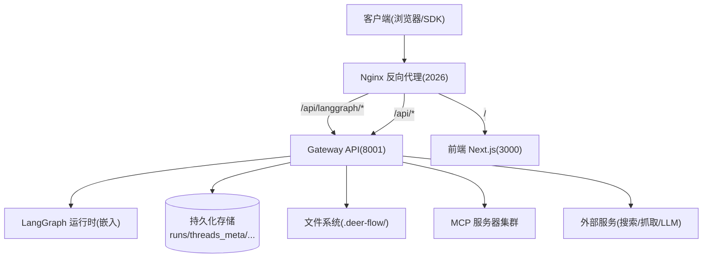
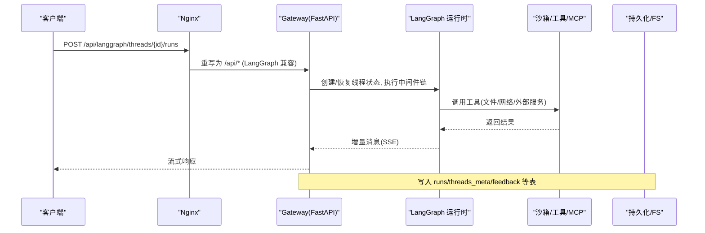
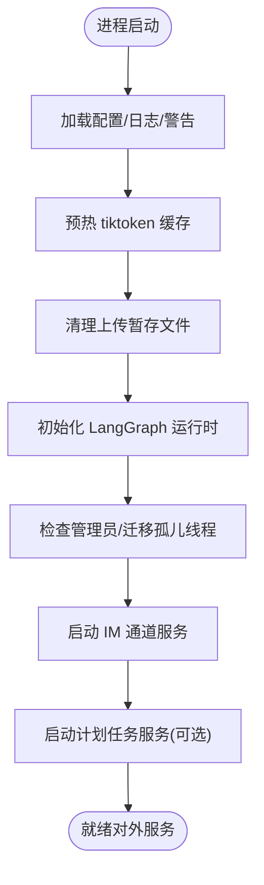
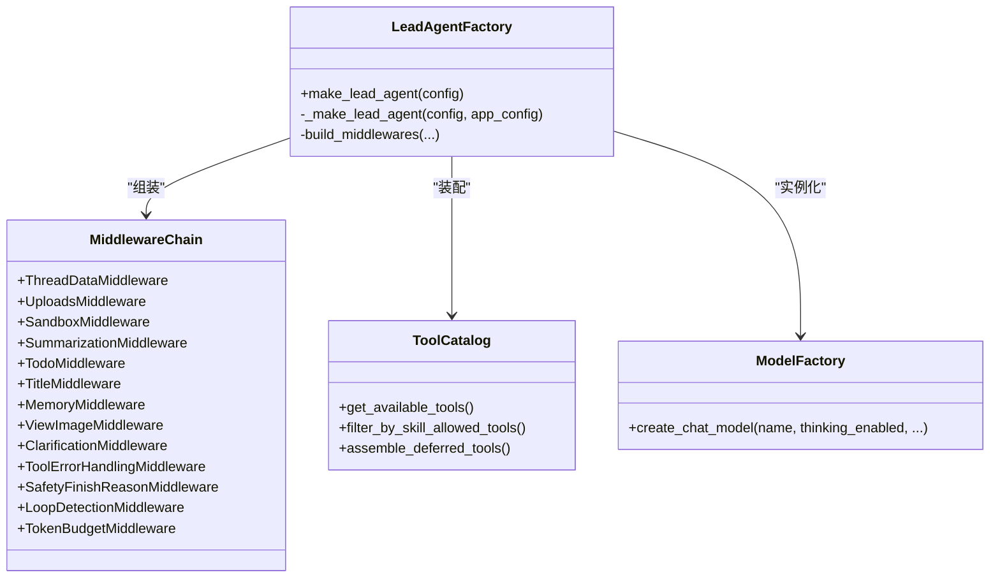
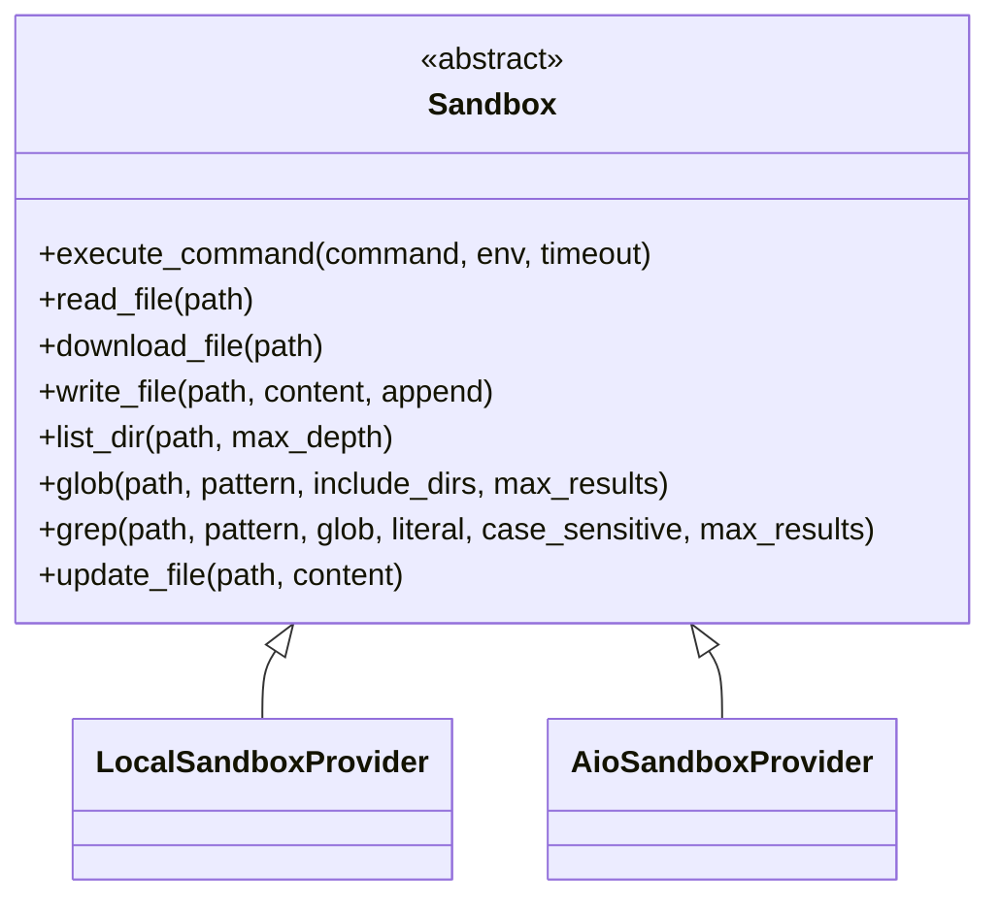
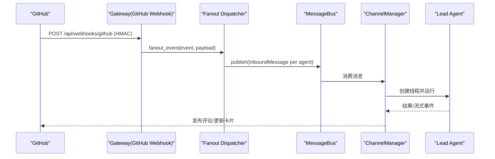
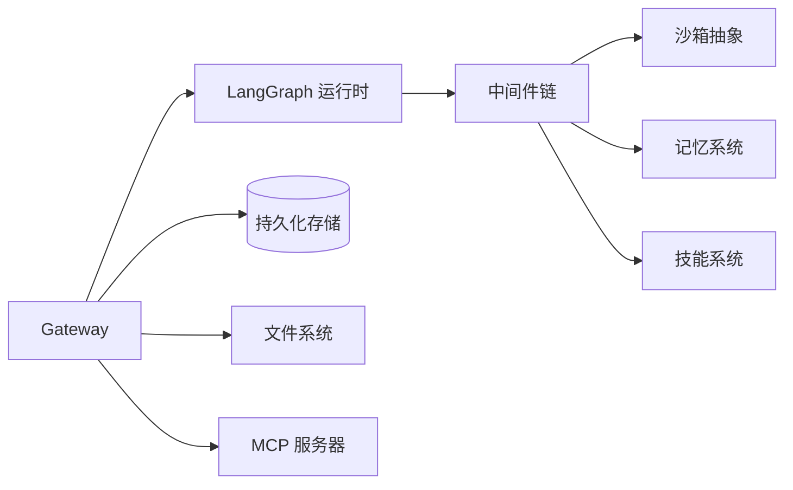

# 架构设计

<cite>
**本文引用的文件**   
- [backend/README.md](file://backend/README.md)
- [backend/docs/ARCHITECTURE.md](file://backend/docs/ARCHITECTURE.md)
- [backend/app/gateway/app.py](file://backend/app/gateway/app.py)
- [backend/packages/harness/deerflow/agents/lead_agent/agent.py](file://backend/packages/harness/deerflow/agents/lead_agent/agent.py)
- [backend/packages/harness/deerflow/agents/middlewares/tool_error_handling_middleware.py](file://backend/packages/harness/deerflow/agents/middlewares/tool_error_handling_middleware.py)
- [backend/packages/harness/deerflow/sandbox/sandbox.py](file://backend/packages/harness/deerflow/sandbox/sandbox.py)
- [backend/packages/harness/deerflow/runtime/runs/__init__.py](file://backend/packages/harness/deerflow/runtime/runs/__init__.py)
- [backend/app/gateway/github/dispatcher.py](file://backend/app/gateway/github/dispatcher.py)
</cite>

## 目录
1. [引言](#引言)
2. [项目结构](#项目结构)
3. [核心组件](#核心组件)
4. [架构总览](#架构总览)
5. [详细组件分析](#详细组件分析)
6. [依赖关系分析](#依赖关系分析)
7. [性能与可扩展性](#性能与可扩展性)
8. [安全架构](#安全架构)
9. [故障排查指南](#故障排查指南)
10. [结论](#结论)
11. [附录：部署拓扑与基础设施](#附录部署拓扑与基础设施)

## 引言
本文件为 DeerFlow 的架构设计文档，面向希望理解系统整体设计与实现细节的读者。内容覆盖网关层、代理运行时、记忆系统、技能管理、沙箱隔离、微服务风格模块化、基于 LangGraph 的状态机编排、数据流与安全机制，并提供系统上下文图与组件分解图，帮助快速建立全局认知并指导后续扩展与运维。

## 项目结构
DeerFlow 后端采用“网关 + 嵌入式代理运行时”的微服务风格组织方式：
- Nginx 作为统一入口，将 /api/langgraph/* 重写至 Gateway 的 LangGraph 兼容 API，其余 /api/* 路由到 Gateway REST 接口，静态资源指向前端。
- Gateway（FastAPI）承载认证、鉴权、路由、LangGraph 运行时集成、IM 通道、计划任务等能力。
- 代理运行时以 LangGraph 状态机为核心，通过中间件链完成线程隔离、上传注入、沙箱生命周期、摘要压缩、标题生成、记忆抽取、图像注入、澄清拦截等横切关注点。
- 工具生态包含内置工具、配置化工具、MCP 工具与技能注入的系统提示。
- 沙箱提供抽象接口与本地/异步两种提供者，支持虚拟路径映射与并发写保护。
- 记忆系统对对话进行结构化抽取与缓存，按用户维度隔离。
- 技能系统支持公共与自定义技能，按需激活并注入系统提示。

图表来源
- [backend/README.md:9-36](file://backend/README.md#L9-L36)
- [backend/docs/ARCHITECTURE.md:7-49](file://backend/docs/ARCHITECTURE.md#L7-L49)

章节来源
- [backend/README.md:220-265](file://backend/README.md#L220-L265)
- [backend/docs/ARCHITECTURE.md:51-95](file://backend/docs/ARCHITECTURE.md#L51-L95)

## 核心组件
- 网关层
  - FastAPI 应用，挂载多组路由：模型、MCP、技能、记忆、上传、制品、线程清理、计划任务、Agent、建议、频道、认证、反馈、Runs 生命周期等。
  - 中间件：认证、CSRF、CORS、请求追踪；启动时初始化日志、LangGraph 运行时、IM 通道、计划任务服务。
- 代理运行时
  - 基于 LangGraph 的 Lead Agent 工厂，动态选择模型、组装工具集、构建中间件链、注入系统提示。
  - 中间件链负责线程数据、上传注入、沙箱获取、摘要压缩、待办跟踪、标题生成、记忆队列、图像注入、澄清拦截、错误处理、安全终止原因过滤、循环检测、令牌预算等。
- 记忆系统
  - 自动抽取用户上下文、事实与偏好，结构化存储，延迟合并更新，注入系统提示。
- 技能管理
  - 扫描 public/custom 目录下的 SKILL.md，支持按需激活、描述工具、权限策略与容器路径映射。
- 沙箱系统
  - 抽象接口定义执行命令、文件读写、遍历、搜索、二进制更新等；提供本地与异步提供者；虚拟路径映射与并发写保护。
- 子代理系统
  - 后台线程池并行执行，限制并发数与超时，返回结果并通过 SSE 事件回传。
- IM 通道
  - 飞书、Slack、Telegram 等，支持卡片就地更新与流式推送。

章节来源
- [backend/app/gateway/app.py:291-496](file://backend/app/gateway/app.py#L291-L496)
- [backend/packages/harness/deerflow/agents/lead_agent/agent.py:430-627](file://backend/packages/harness/deerflow/agents/lead_agent/agent.py#L430-L627)
- [backend/packages/harness/deerflow/agents/middlewares/tool_error_handling_middleware.py:149-223](file://backend/packages/harness/deerflow/agents/middlewares/tool_error_handling_middleware.py#L149-L223)
- [backend/README.md:41-134](file://backend/README.md#L41-L134)

## 架构总览
DeerFlow 采用“网关 + 嵌入式运行时”的轻量微服务形态，避免额外运行 LangGraph Server，通过 Nginx 重写路径保持与 LangGraph SDK 的兼容性。

图表来源
- [backend/docs/ARCHITECTURE.md:344-380](file://backend/docs/ARCHITECTURE.md#L344-L380)
- [backend/app/gateway/app.py:463-486](file://backend/app/gateway/app.py#L463-L486)

## 详细组件分析

### 网关层（Gateway）
- 职责
  - 应用生命周期：加载配置、预热 tiktoken、清理上传暂存、初始化 LangGraph 运行时、启动 IM 通道与计划任务服务。
  - 路由注册：模型、MCP、记忆、技能、上传、制品、线程清理、计划任务、Agent、建议、频道、认证、反馈、Runs 生命周期、GitHub Webhook。
  - 安全中间件：认证、CSRF、CORS、追踪。
- 关键流程
  - 首次引导：检测管理员账户，迁移无主线程到管理员。
  - 健康检查：/health 返回服务状态。
  - GitHub Webhook：仅在配置密钥或开发白名单开启时挂载，防伪造。

图表来源
- [backend/app/gateway/app.py:168-288](file://backend/app/gateway/app.py#L168-L288)
- [backend/app/gateway/app.py:487-496](file://backend/app/gateway/app.py#L487-L496)
- [backend/app/gateway/app.py:469-486](file://backend/app/gateway/app.py#L469-L486)

章节来源
- [backend/app/gateway/app.py:291-496](file://backend/app/gateway/app.py#L291-L496)

### 代理运行时（Lead Agent 与中间件链）
- 职责
  - 动态模型解析与能力探测（思考/视觉）。
  - 工具装配：内置、配置、MCP、技能策略过滤、延迟发现。
  - 中间件链：线程数据、上传注入、沙箱、摘要、待办、标题、记忆、图像、澄清、错误处理、安全终止、循环检测、令牌预算、消息聚合等。
- 关键决策
  - 追踪回调在图根节点附加，避免重复 span 与属性丢失。
  - 非交互模式禁用交互式工具（如 ask_clarification）。
  - Webhook 渠道禁用 update_agent 工具，防止外部评论者修改 Agent 配置。

图表来源
- [backend/packages/harness/deerflow/agents/lead_agent/agent.py:430-627](file://backend/packages/harness/deerflow/agents/lead_agent/agent.py#L430-L627)
- [backend/packages/harness/deerflow/agents/middlewares/tool_error_handling_middleware.py:149-223](file://backend/packages/harness/deerflow/agents/middlewares/tool_error_handling_middleware.py#L149-L223)

章节来源
- [backend/packages/harness/deerflow/agents/lead_agent/agent.py:430-627](file://backend/packages/harness/deerflow/agents/lead_agent/agent.py#L430-L627)
- [backend/packages/harness/deerflow/agents/middlewares/tool_error_handling_middleware.py:149-223](file://backend/packages/harness/deerflow/agents/middlewares/tool_error_handling_middleware.py#L149-L223)

### 沙箱系统
- 抽象接口
  - 执行命令、读取/下载/写入/更新文件、目录遍历、glob/grep 搜索。
  - 环境变量键名校验，防御未来 shell 拼接场景的命令注入。
- 提供者
  - 本地提供者：直接执行（开发用）。
  - 异步提供者：Docker/远程容器（生产推荐），具备健康检查、热池与生命周期钩子。
- 虚拟路径
  - /mnt/user-data/workspace/uploads/outputs 映射到线程级物理目录。
  - /mnt/skills 映射到 skills 容器目录。
- 并发写保护
  - str_replace 按 (sandbox.id, path) 序列化读改写，保证并发安全。

图表来源
- [backend/packages/harness/deerflow/sandbox/sandbox.py:44-176](file://backend/packages/harness/deerflow/sandbox/sandbox.py#L44-L176)

章节来源
- [backend/README.md:67-78](file://backend/README.md#L67-L78)
- [backend/packages/harness/deerflow/sandbox/sandbox.py:44-176](file://backend/packages/harness/deerflow/sandbox/sandbox.py#L44-L176)

### 记忆系统
- 自动抽取：对用户上下文、历史与高置信度事实进行结构化提取。
- 延迟合并：批量更新减少 LLM 调用。
- 注入策略：Top 事实与上下文注入系统提示。
- 存储：JSON 文件 + mtime 失效；支持字符计数与 tiktoken 预热。

章节来源
- [backend/README.md:88-96](file://backend/README.md#L88-L96)
- [backend/app/gateway/app.py:191-214](file://backend/app/gateway/app.py#L191-L214)

### 技能管理
- 目录结构：public（提交）与 custom（忽略），递归发现 SKILL.md。
- 按需激活：用户显式 /skill-name 优先于模型相关性猜测。
- 策略控制：allowed-tools 过滤工具集合，结合 describe_skill 工具暴露能力。
- 容器路径：skills 目录映射到容器内路径，便于沙箱访问。

章节来源
- [backend/docs/ARCHITECTURE.md:305-342](file://backend/docs/ARCHITECTURE.md#L305-L342)
- [backend/packages/harness/deerflow/agents/lead_agent/agent.py:521-546](file://backend/packages/harness/deerflow/agents/lead_agent/agent.py#L521-L546)

### 子代理系统
- 内置代理：通用型与 bash 专用（仅当可用时暴露）。
- 并发控制：每轮最多 3 个，超时 15 分钟。
- 执行模型：后台线程池 + 状态跟踪 + SSE 事件。

章节来源
- [backend/README.md:79-86](file://backend/README.md#L79-L86)

### IM 通道与 GitHub 分发器
- 通道：飞书、Slack、Telegram；飞书使用就地卡片更新与流式推送。
- GitHub 分发器：验证 HMAC，过滤自触发事件，匹配绑定与触发器，发布 InboundMessage 到总线，由 ChannelManager 创建线程并运行 Lead Agent，最终回复评论。

图表来源
- [backend/app/gateway/github/dispatcher.py:103-218](file://backend/app/gateway/github/dispatcher.py#L103-L218)
- [backend/app/gateway/app.py:469-486](file://backend/app/gateway/app.py#L469-L486)

章节来源
- [backend/README.md:128-133](file://backend/README.md#L128-L133)
- [backend/app/gateway/github/dispatcher.py:1-218](file://backend/app/gateway/github/dispatcher.py#L1-L218)

## 依赖关系分析
- 组件耦合
  - Gateway 与 LangGraph 运行时松耦合，通过依赖注入与 lifespan 初始化。
  - 中间件链可插拔，按顺序组合，新增横切关注点只需追加。
  - 沙箱抽象解耦具体实现，支持本地与异步提供者替换。
- 外部依赖
  - LLM 提供商（OpenAI/Anthropic/DeepSeek 等）、MCP 服务器、Web 搜索/抓取工具、持久化存储（SQL/SQLite）。
- 潜在循环
  - 测试保障导入无环：Gateway 与 subagent 包导出惰性可导入。

图表来源
- [backend/docs/ARCHITECTURE.md:96-127](file://backend/docs/ARCHITECTURE.md#L96-L127)
- [backend/tests/test_gateway_imports.py:11-39](file://backend/tests/test_gateway_imports.py#L11-L39)

章节来源
- [backend/tests/test_gateway_imports.py:11-39](file://backend/tests/test_gateway_imports.py#L11-L39)

## 性能与可扩展性
- 性能优化
  - SSE 流式响应降低首 Token 时间。
  - MCP 工具缓存与 mtime 失效，配置与技能启动时解析并缓存。
  - 摘要中间件在接近 token 限制时压缩上下文，保留近期消息。
  - tiktoken 预热避免首次阻塞。
- 可扩展性
  - 中间件链与工具生态可插拔扩展。
  - 沙箱提供者可替换（本地/容器）。
  - 子代理并发与超时可调。
- 容错设计
  - 工具异常转换为 ToolMessage，使运行继续。
  - 安全终止原因过滤避免坏调用传播。
  - 循环检测与令牌预算保护运行稳定性。

章节来源
- [backend/docs/ARCHITECTURE.md:466-485](file://backend/docs/ARCHITECTURE.md#L466-L485)
- [backend/packages/harness/deerflow/agents/middlewares/tool_error_handling_middleware.py:149-223](file://backend/packages/harness/deerflow/agents/middlewares/tool_error_handling_middleware.py#L149-L223)
- [backend/packages/harness/deerflow/agents/lead_agent/agent.py:378-405](file://backend/packages/harness/deerflow/agents/lead_agent/agent.py#L378-L405)

## 安全架构
- 沙箱隔离
  - 抽象层强制环境变量键名校验，防御未来 shell 拼接导致的命令注入。
  - 虚拟路径映射与路径遍历防护。
- 认证与授权
  - 认证中间件拒绝未认证请求（fail-closed）。
  - CSRF 双提交 Cookie 保护状态变更。
  - CORS 同源默认，跨域需显式白名单。
  - GitHub Webhook 仅启用 HMAC 验证或开发白名单，否则 404。
- 权限控制
  - Webhook 渠道禁用 update_agent 工具，防止外部评论者修改 Agent 配置。
  - 工具策略按技能 allowed-tools 过滤。
- 审计与追踪
  - 沙箱审计中间件与请求追踪中间件记录操作与关联 ID。

章节来源
- [backend/packages/harness/deerflow/sandbox/sandbox.py:17-42](file://backend/packages/harness/deerflow/sandbox/sandbox.py#L17-L42)
- [backend/app/gateway/app.py:384-410](file://backend/app/gateway/app.py#L384-L410)
- [backend/app/gateway/app.py:469-486](file://backend/app/gateway/app.py#L469-L486)
- [backend/packages/harness/deerflow/agents/lead_agent/agent.py:580-594](file://backend/packages/harness/deerflow/agents/lead_agent/agent.py#L580-L594)

## 故障排查指南
- 常见问题定位
  - 配置加载失败：查看启动日志与 warn_if_auth_disabled_enabled 输出。
  - 认证/CSRF/CORS 问题：确认中间件与白名单配置。
  - GitHub Webhook 不生效：检查密钥或开发白名单是否启用。
  - 沙箱执行异常：检查虚拟路径映射、权限与并发写保护。
  - 工具异常导致中断：查看 ToolErrorHandlingMiddleware 转换后的 ToolMessage。
- 诊断手段
  - 使用 /health 健康检查。
  - 启用 LangSmith/Langfuse 追踪，观察图根节点与子 span。
  - 查看 runs/threads_meta/feedback 等表记录。

章节来源
- [backend/app/gateway/app.py:168-288](file://backend/app/gateway/app.py#L168-L288)
- [backend/packages/harness/deerflow/agents/middlewares/tool_error_handling_middleware.py:51-108](file://backend/packages/harness/deerflow/agents/middlewares/tool_error_handling_middleware.py#L51-L108)

## 结论
DeerFlow 以网关 + 嵌入式 LangGraph 运行时为核心，通过中间件链与工具生态实现灵活的代理编排，配合沙箱隔离、记忆系统与技能管理形成完整的 AI 超代理平台。其微服务风格的模块化设计保证了松耦合与可扩展性，同时通过安全与容错机制提升稳定性与安全性。

## 附录：部署拓扑与基础设施
- 部署拓扑
  - Nginx 统一入口，转发 /api/langgraph/* 与 /api/*，静态资源指向前端。
  - Gateway 单进程或多进程（取决于 uvicorn 配置），共享配置与持久化存储。
  - 沙箱提供者可选择本地或容器化（推荐生产环境）。
- 基础设施需求
  - Python 3.12+、uv 包管理器。
  - LLM 提供商 API Key。
  - 可选：LangSmith/Langfuse 观测平台。
  - 持久化存储：Postgres/SQLite（Alembic 自动迁移）。
  - 可选：MCP 服务器（stdio/SSE/HTTP）。

章节来源
- [backend/README.md:136-217](file://backend/README.md#L136-L217)
- [backend/README.md:445-477](file://backend/README.md#L445-L477)
- [backend/docs/ARCHITECTURE.md:7-49](file://backend/docs/ARCHITECTURE.md#L7-L49)