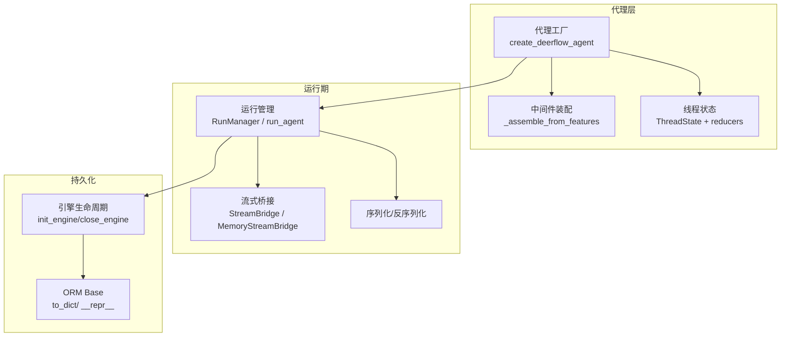
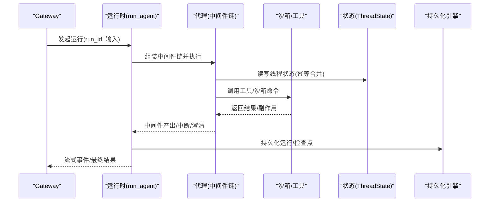
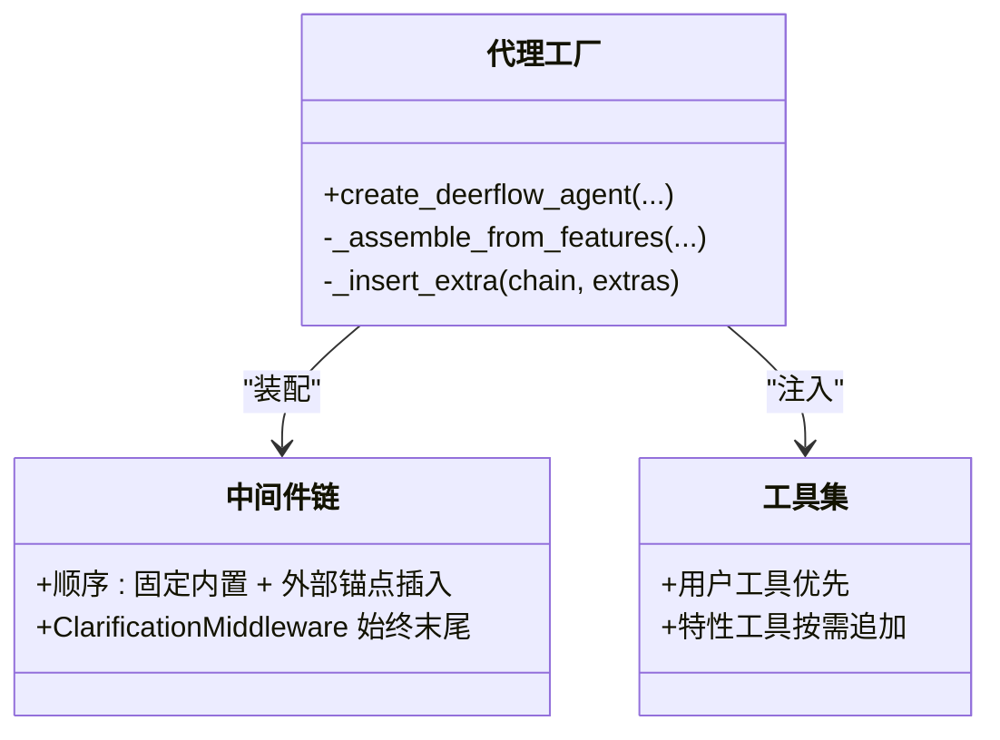
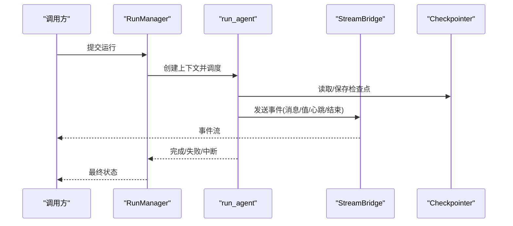
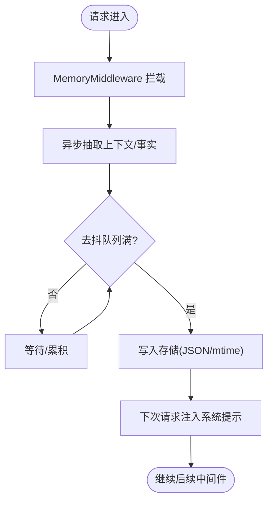
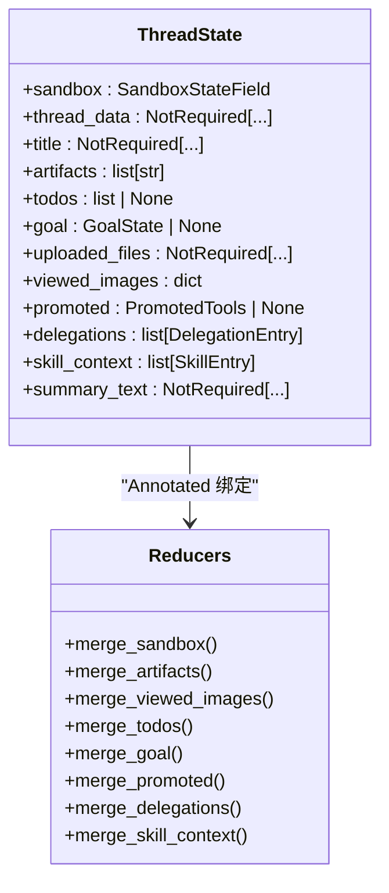
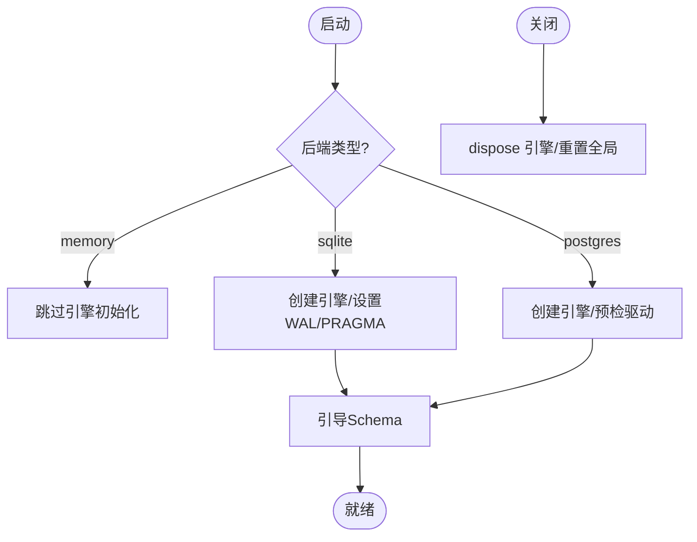
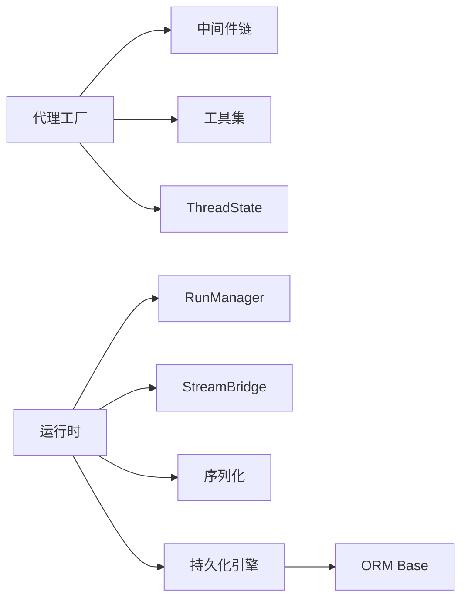

# 核心组件设计

<cite>
**本文引用的文件**   
- [backend/README.md](file://backend/README.md)
- [agents/factory.py](file://backend/packages/harness/deerflow/agents/factory.py)
- [agents/thread_state.py](file://backend/packages/harness/deerflow/agents/thread_state.py)
- [runtime/__init__.py](file://backend/packages/harness/deerflow/runtime/__init__.py)
- [runtime/runs/__init__.py](file://backend/packages/harness/deerflow/runtime/runs/__init__.py)
- [persistence/base.py](file://backend/packages/harness/deerflow/persistence/base.py)
- [persistence/engine.py](file://backend/packages/harness/deerflow/persistence/engine.py)
</cite>

## 目录
1. [引言](#引言)
2. [项目结构](#项目结构)
3. [核心组件](#核心组件)
4. [架构总览](#架构总览)
5. [详细组件分析](#详细组件分析)
6. [依赖关系分析](#依赖关系分析)
7. [性能考量](#性能考量)
8. [故障排查指南](#故障排查指南)
9. [结论](#结论)
10. [附录](#附录)

## 引言
本设计文档聚焦 DeerFlow 后端的核心组件与运行期机制，围绕以下目标展开：
- 代理工厂、运行时管理、记忆系统等关键模块的设计模式与实现细节
- 组件间依赖关系与通信机制（接口定义、数据传递、错误处理）
- 中间件管道的设计理念与拦截器模式的横切关注点落地
- 状态管理机制（线程状态、运行状态、持久化策略）
- 生命周期管理与资源清理的最佳实践

## 项目结构
DeerFlow 后端采用分层与模块化组织方式：
- agents：代理构建、中间件链、线程状态与目标状态
- runtime：运行期管理（RunManager、StreamBridge、序列化、检查点上下文等）
- persistence：SQLAlchemy ORM 基础、引擎生命周期与迁移引导
- gateway/channels/sandbox/tools 等由上层应用集成

图表来源
- [agents/factory.py:61-147](file://backend/packages/harness/deerflow/agents/factory.py#L61-L147)
- [agents/factory.py:155-308](file://backend/packages/harness/deerflow/agents/factory.py#L155-L308)
- [agents/thread_state.py:223-236](file://backend/packages/harness/deerflow/agents/thread_state.py#L223-L236)
- [runtime/__init__.py:1-53](file://backend/packages/harness/deerflow/runtime/__init__.py#L1-L53)
- [persistence/base.py:29-56](file://backend/packages/harness/deerflow/persistence/base.py#L29-L56)
- [persistence/engine.py:58-171](file://backend/packages/harness/deerflow/persistence/engine.py#L58-L171)

章节来源
- [backend/README.md:39-134](file://backend/README.md#L39-L134)

## 核心组件
- 代理工厂：以纯参数形式创建 LangGraph 代理，支持特性驱动的中间件装配与工具注入，提供“完全接管”和“特性声明”两种装配路径。
- 运行时管理：封装 Run 生命周期、流式事件桥接、序列化能力，对外暴露统一的运行入口。
- 记忆系统：通过中间件在请求链路中异步提取并更新用户上下文与事实，结合配置进行去抖与阈值控制。
- 状态管理：基于 TypedDict + Annotated reducer 的 ThreadState，保证并发写入一致性与幂等合并。
- 持久化：统一 SQLAlchemy 异步引擎生命周期、自动建库/迁移引导、JSON 序列化适配。

章节来源
- [agents/factory.py:61-147](file://backend/packages/harness/deerflow/agents/factory.py#L61-L147)
- [agents/factory.py:155-308](file://backend/packages/harness/deerflow/agents/factory.py#L155-L308)
- [runtime/__init__.py:1-53](file://backend/packages/harness/deerflow/runtime/__init__.py#L1-L53)
- [agents/thread_state.py:223-236](file://backend/packages/harness/deerflow/agents/thread_state.py#L223-L236)
- [persistence/engine.py:58-171](file://backend/packages/harness/deerflow/persistence/engine.py#L58-L171)

## 架构总览
从 Gateway 到 Agent 的运行路径如下：Gateway 路由进入后，调用运行期 API 启动 run_agent；run_agent 负责编排中间件链、执行图节点、维护运行状态并通过 StreamBridge 推送事件；Agent 内部通过代理工厂装配中间件与工具，使用 ThreadState 承载线程级上下文；持久化层在启动时初始化引擎并完成 schema 引导。

图表来源
- [runtime/runs/__init__.py:1-17](file://backend/packages/harness/deerflow/runtime/runs/__init__.py#L1-L17)
- [agents/factory.py:155-308](file://backend/packages/harness/deerflow/agents/factory.py#L155-L308)
- [agents/thread_state.py:223-236](file://backend/packages/harness/deerflow/agents/thread_state.py#L223-L236)
- [persistence/engine.py:58-171](file://backend/packages/harness/deerflow/persistence/engine.py#L58-L171)

## 详细组件分析

### 代理工厂与中间件管道
- 设计要点
  - 纯参数工厂：create_deerflow_agent 接受模型、工具、系统提示、中间件列表或特性开关，避免全局单例与配置文件耦合。
  - 双装配模式：
    - 完全接管：直接传入 middleware 列表，跳过特性装配。
    - 特性驱动：根据 RuntimeFeatures 与 plan_mode 动态拼装中间件链，并追加额外工具。
  - 中间件顺序与锚点插入：内置链固定顺序，extra_middleware 通过 @Next/@Prev 锚点安全插入，且保证 ClarificationMiddleware 始终位于末尾。
  - 工具去重：按名称去重，用户自定义工具优先。
- 中间件清单（示例）
  - 线程数据隔离、上传注入、沙箱环境、摘要压缩、待办跟踪、标题生成、记忆提取、图像查看、子代理限制、循环检测、Token 预算、澄清拦截等。
- 错误处理
  - 冲突参数校验（middleware 与 features/extra_middleware 互斥）。
  - extra_middleware 类型校验与锚点冲突/循环依赖检测。
  - 某些特性需要自定义中间件实例（如 guardrail、summarization），否则抛出明确错误。

图表来源
- [agents/factory.py:61-147](file://backend/packages/harness/deerflow/agents/factory.py#L61-L147)
- [agents/factory.py:155-308](file://backend/packages/harness/deerflow/agents/factory.py#L155-L308)
- [agents/factory.py:316-390](file://backend/packages/harness/deerflow/agents/factory.py#L316-L390)

章节来源
- [agents/factory.py:61-147](file://backend/packages/harness/deerflow/agents/factory.py#L61-L147)
- [agents/factory.py:155-308](file://backend/packages/harness/deerflow/agents/factory.py#L155-L308)
- [agents/factory.py:316-390](file://backend/packages/harness/deerflow/agents/factory.py#L316-L390)

### 运行时管理（Run 生命周期与流式桥接）
- 设计要点
  - 统一入口：run_agent 作为运行期入口，封装 RunContext、RunManager、RunRecord、RunStatus 等概念。
  - 流式事件：通过 StreamBridge/MemoryStreamBridge 将运行事件推送到上游（SSE/内存通道）。
  - 序列化：提供消息元组、LangChain 对象、通道值等的序列化能力，便于跨进程/网络传输。
  - 检查点上下文：checkpointer_context/get_checkpointer 等用于会话级检查点存取。
- 错误与异常
  - ConflictError、UnsupportedStrategyError 等用于表达运行期冲突与不支持的策略。
  - DisconnectMode 控制断连场景下的行为。

图表来源
- [runtime/__init__.py:1-53](file://backend/packages/harness/deerflow/runtime/__init__.py#L1-L53)
- [runtime/runs/__init__.py:1-17](file://backend/packages/harness/deerflow/runtime/runs/__init__.py#L1-L17)

章节来源
- [runtime/__init__.py:1-53](file://backend/packages/harness/deerflow/runtime/__init__.py#L1-L53)
- [runtime/runs/__init__.py:1-17](file://backend/packages/harness/deerflow/runtime/runs/__init__.py#L1-L17)

### 记忆系统（中间件驱动）
- 设计理念
  - 作为中间件嵌入代理执行链，在请求处理过程中异步收集对话上下文，提取用户偏好、事实与历史，并以去抖策略批量更新存储。
  - 通过配置项控制是否启用、存储位置、去抖等待时间、事实上限等。
- 数据流
  - 中间件读取当前消息/上下文 → 触发 LLM 抽取 → 写入 JSON 文件（mtime 失效）→ 下次请求注入系统提示。
- 错误处理
  - 抽取失败降级为不更新记忆；IO 异常记录日志并继续运行。

章节来源
- [backend/README.md:88-96](file://backend/README.md#L88-L96)

### 状态管理（ThreadState 与 Reducers）
- 设计要点
  - 基于 TypedDict + Annotated[reducer] 的状态字段，确保并发写入时的幂等合并与一致性。
  - 关键字段与归约器：
    - sandbox：id 冲突检测，防止同一线程出现不同沙箱 id。
    - artifacts：合并去重并保持顺序。
    - viewed_images：空字典清空语义，键覆盖合并。
    - todos：保留最近一次非 None 值。
    - goal：新值覆盖。
    - promoted：按 catalog_hash 作用域合并，防漂移。
    - delegations：终端状态不可被非终端覆盖，保持首次创建时间，限制条目数。
    - skill_context：规范化旧负载、按 path 去重、保留最近 N 条。
- 复杂度
  - 多数 reducer 为 O(n) 线性扫描/哈希合并，适合高频小量更新。

图表来源
- [agents/thread_state.py:223-236](file://backend/packages/harness/deerflow/agents/thread_state.py#L223-L236)
- [agents/thread_state.py:25-44](file://backend/packages/harness/deerflow/agents/thread_state.py#L25-L44)
- [agents/thread_state.py:49-74](file://backend/packages/harness/deerflow/agents/thread_state.py#L49-L74)
- [agents/thread_state.py:76-94](file://backend/packages/harness/deerflow/agents/thread_state.py#L76-L94)
- [agents/thread_state.py:101-119](file://backend/packages/harness/deerflow/agents/thread_state.py#L101-L119)
- [agents/thread_state.py:137-164](file://backend/packages/harness/deerflow/agents/thread_state.py#L137-L164)
- [agents/thread_state.py:189-221](file://backend/packages/harness/deerflow/agents/thread_state.py#L189-L221)

章节来源
- [agents/thread_state.py:25-44](file://backend/packages/harness/deerflow/agents/thread_state.py#L25-L44)
- [agents/thread_state.py:49-74](file://backend/packages/harness/deerflow/agents/thread_state.py#L49-L74)
- [agents/thread_state.py:76-94](file://backend/packages/harness/deerflow/agents/thread_state.py#L76-L94)
- [agents/thread_state.py:101-119](file://backend/packages/harness/deerflow/agents/thread_state.py#L101-L119)
- [agents/thread_state.py:137-164](file://backend/packages/harness/deerflow/agents/thread_state.py#L137-L164)
- [agents/thread_state.py:189-221](file://backend/packages/harness/deerflow/agents/thread_state.py#L189-L221)
- [agents/thread_state.py:223-236](file://backend/packages/harness/deerflow/agents/thread_state.py#L223-L236)

### 持久化与引擎生命周期
- 设计要点
  - 引擎初始化：支持 memory/sqlite/postgres 三种后端；Postgres 缺失驱动时给出安装指引；SQLite 开启 WAL、同步策略与 busy_timeout。
  - 自动建库：当 Postgres 数据库不存在时尝试自动创建并重建引擎重试。
  - Schema 引导：空库/遗留库/已管理库三态处理，跨进程安全（Postgres 咨询锁，SQLite 进程内锁+busy_timeout）。
  - 关闭流程：优雅释放连接池，重置全局引用。
- ORM 基类
  - Base 提供 to_dict 与 __repr__，通过缓存列映射提升性能。

图表来源
- [persistence/engine.py:58-171](file://backend/packages/harness/deerflow/persistence/engine.py#L58-L171)
- [persistence/base.py:29-56](file://backend/packages/harness/deerflow/persistence/base.py#L29-L56)

章节来源
- [persistence/engine.py:58-171](file://backend/packages/harness/deerflow/persistence/engine.py#L58-L171)
- [persistence/base.py:29-56](file://backend/packages/harness/deerflow/persistence/base.py#L29-L56)

## 依赖关系分析
- 组件耦合
  - 代理工厂依赖中间件与工具注册表，运行时依赖 RunManager/StreamBridge/序列化模块。
  - 运行时依赖持久化引擎（检查点/运行记录），但通过上下文/工厂解耦具体实现。
  - 状态管理独立于 I/O，仅通过 reducer 保证一致性。
- 外部依赖
  - LangGraph/LangChain 作为代理与工具框架。
  - SQLAlchemy 异步引擎与 alembic 迁移。
  - 可选 Redis 流桥接（按需导入，避免冷启动开销）。

图表来源
- [agents/factory.py:61-147](file://backend/packages/harness/deerflow/agents/factory.py#L61-L147)
- [runtime/__init__.py:1-53](file://backend/packages/harness/deerflow/runtime/__init__.py#L1-L53)
- [persistence/base.py:29-56](file://backend/packages/harness/deerflow/persistence/base.py#L29-L56)
- [persistence/engine.py:58-171](file://backend/packages/harness/deerflow/persistence/engine.py#L58-L171)

章节来源
- [agents/factory.py:61-147](file://backend/packages/harness/deerflow/agents/factory.py#L61-L147)
- [runtime/__init__.py:1-53](file://backend/packages/harness/deerflow/runtime/__init__.py#L1-L53)
- [persistence/base.py:29-56](file://backend/packages/harness/deerflow/persistence/base.py#L29-L56)
- [persistence/engine.py:58-171](file://backend/packages/harness/deerflow/persistence/engine.py#L58-L171)

## 性能考量
- 中间件链
  - 惰性初始化：部分中间件（如沙箱、线程数据）支持 lazy_init，减少冷启动开销。
  - 锚点插入算法：对 extra_middleware 进行多轮解析，避免重复查找，保证 ClarificationMiddleware 始终在末尾。
- 状态合并
  - 使用哈希表与有序去重，控制最大条目数，避免无界增长。
- 持久化
  - SQLite WAL 模式与 PRAGMA 优化，提高并发读写性能；Postgres 连接池与 pre_ping 保障稳定性。
  - 列映射缓存降低 to_dict/__repr__ 反射成本。

## 故障排查指南
- 代理装配
  - 若同时指定 middleware 与 features/extra_middleware，会抛出参数冲突错误。
  - extra_middleware 类型不符或锚点冲突/循环依赖，需修正装饰器或使用交叉锚定。
- 运行时
  - ConflictError/UnsupportedStrategyError 指示运行策略冲突或不支持，检查运行参数与策略选择。
  - DisconnectMode 影响断连后的恢复行为，确认是否需要重新拉取事件。
- 持久化
  - Postgres 缺少 asyncpg 驱动时会给出安装提示；数据库不存在时会自动创建并重试。
  - SQLite 并发写阻塞可通过 WAL 与 busy_timeout 缓解；若仍失败，检查磁盘权限与并发度。

章节来源
- [agents/factory.py:110-118](file://backend/packages/harness/deerflow/agents/factory.py#L110-L118)
- [agents/factory.py:316-390](file://backend/packages/harness/deerflow/agents/factory.py#L316-L390)
- [runtime/runs/__init__.py:1-17](file://backend/packages/harness/deerflow/runtime/runs/__init__.py#L1-L17)
- [persistence/engine.py:81-94](file://backend/packages/harness/deerflow/persistence/engine.py#L81-L94)
- [persistence/engine.py:160-169](file://backend/packages/harness/deerflow/persistence/engine.py#L160-L169)

## 结论
DeerFlow 的核心组件以“可组合、可观测、可持久化”为目标：
- 代理工厂通过特性驱动与锚点插入，灵活装配中间件与工具，兼顾易用性与扩展性。
- 运行时管理统一了运行生命周期、流式事件与序列化，屏蔽底层差异。
- 状态管理以 reducer 为核心，确保并发一致性与幂等合并。
- 持久化层提供健壮的引擎生命周期与迁移引导，适配多种后端。
建议在生产环境中：
- 合理配置中间件顺序与去抖策略，避免过度 LLM 调用。
- 使用 WAL 与连接池优化持久化性能。
- 严格校验 extra_middleware 锚点，避免循环依赖。

## 附录
- 术语
  - 中间件：拦截器，用于横切关注点（鉴权、审计、限流、记忆等）。
  - 运行：一次完整的代理执行过程，包含事件流与状态变更。
  - 检查点：运行状态的快照，支持恢复与回放。
- 最佳实践
  - 使用 create_deerflow_agent 的纯参数接口，避免全局状态。
  - 通过 RuntimeFeatures 声明式启用功能，必要时以自定义中间件替换默认实现。
  - 在中间件中尽量使用幂等操作，配合 ThreadState 的 reducer 保证一致性。
  - 在关闭阶段调用 close_engine 释放资源，避免连接泄漏。