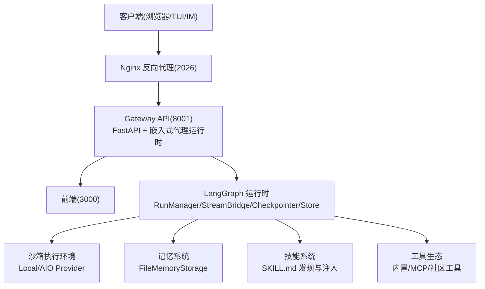
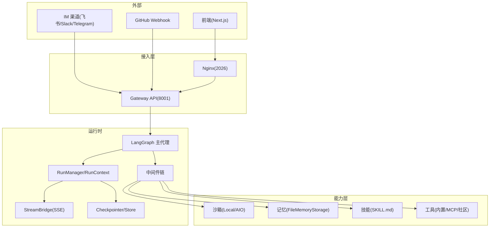
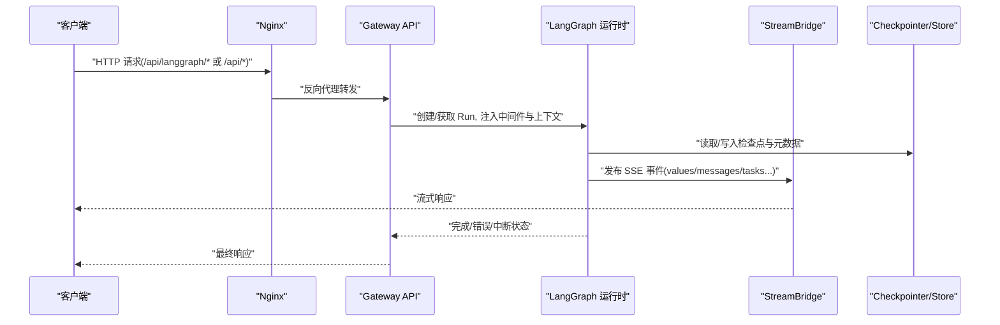
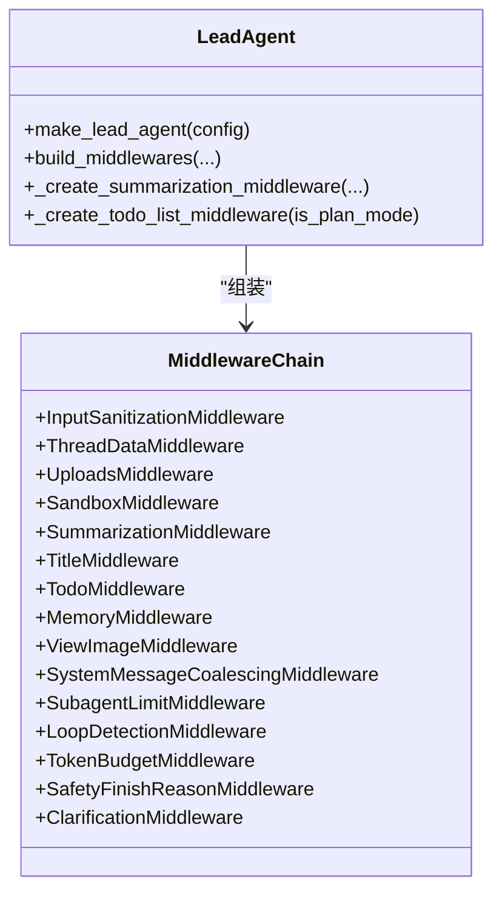
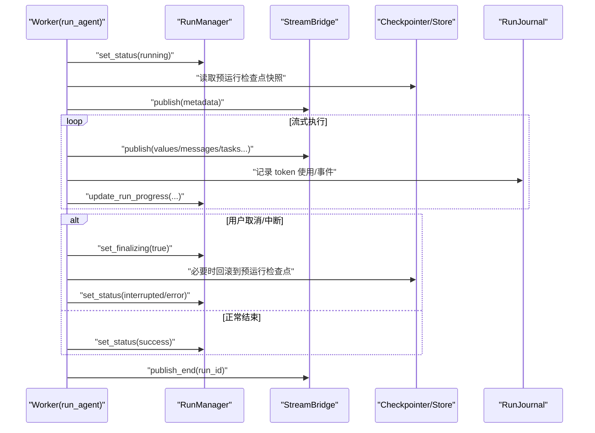
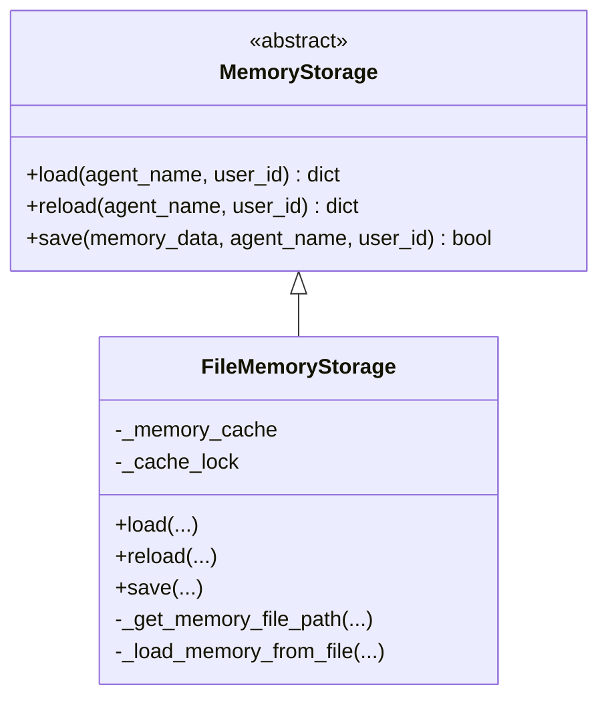
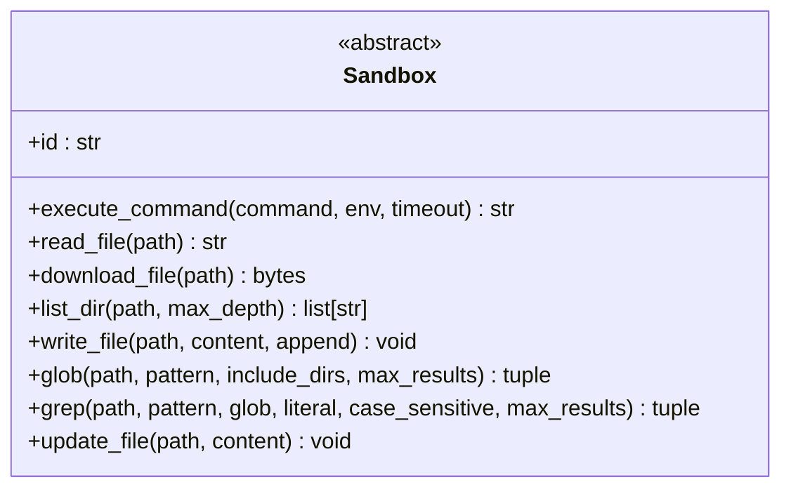
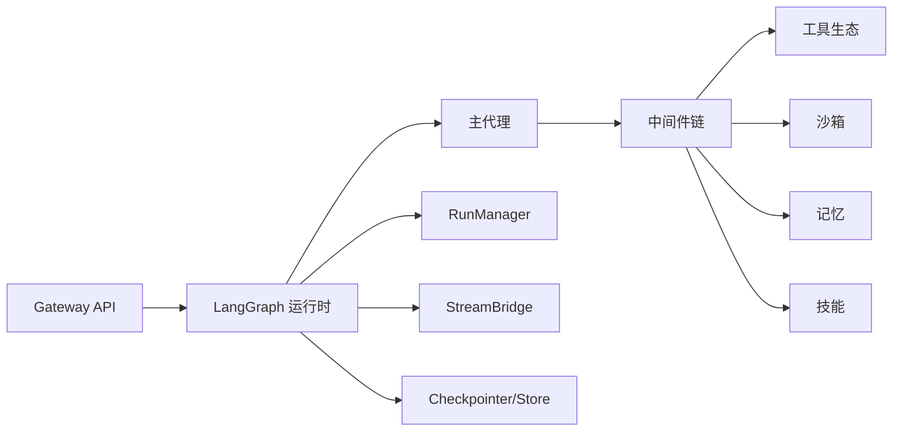

# 系统架构概览

<cite>
**本文引用的文件**   
- [backend/README.md](file://backend/README.md)
- [backend/docs/ARCHITECTURE.md](file://backend/docs/ARCHITECTURE.md)
- [backend/app/gateway/app.py](file://backend/app/gateway/app.py)
- [backend/packages/harness/deerflow/runtime/__init__.py](file://backend/packages/harness/deerflow/runtime/__init__.py)
- [backend/packages/harness/deerflow/runtime/runs/manager.py](file://backend/packages/harness/deerflow/runtime/runs/manager.py)
- [backend/packages/harness/deerflow/runtime/runs/worker.py](file://backend/packages/harness/deerflow/runtime/runs/worker.py)
- [backend/packages/harness/deerflow/sandbox/sandbox.py](file://backend/packages/harness/deerflow/sandbox/sandbox.py)
- [backend/packages/harness/deerflow/agents/memory/storage.py](file://backend/packages/harness/deerflow/agents/memory/storage.py)
- [backend/packages/harness/deerflow/agents/lead_agent/agent.py](file://backend/packages/harness/deerflow/agents/lead_agent/agent.py)
</cite>

## 目录
1. [简介](#简介)
2. [项目结构](#项目结构)
3. [核心组件](#核心组件)
4. [架构总览](#架构总览)
5. [详细组件分析](#详细组件分析)
6. [依赖关系分析](#依赖关系分析)
7. [性能与可扩展性](#性能与可扩展性)
8. [故障排查指南](#故障排查指南)
9. [结论](#结论)

## 简介
本文件为 DeerFlow 的系统架构概览，面向希望快速理解整体设计、层次职责与数据流向的读者。内容覆盖网关层、代理运行时、记忆系统、技能管理、沙箱执行、子代理编排等关键模块；并基于 LangGraph 的状态机与中间件链解释复杂代理编排的实现方式。同时给出系统上下文图与组件分解图，说明前端应用、API 网关、代理运行时、数据存储之间的交互关系，并对可扩展性、性能优化与容错设计进行权衡分析。

## 项目结构
DeerFlow 采用“网关 + 嵌入式代理运行时”的微服务风格模块化设计：
- 前端（Next.js）通过 Nginx 统一入口访问后端
- API 网关（FastAPI）提供 REST 与 LangGraph 兼容的运行期接口
- 代理运行时嵌入在网关中，基于 LangGraph 构建主代理与中间件链
- 持久化与检查点由 Checkpointer/Store 提供
- 沙箱执行环境隔离代码运行
- 记忆系统与技能系统作为可插拔能力注入到代理上下文中

图表来源
- [backend/README.md:9-35](file://backend/README.md#L9-L35)
- [backend/docs/ARCHITECTURE.md:7-49](file://backend/docs/ARCHITECTURE.md#L7-L49)

章节来源
- [backend/README.md:220-265](file://backend/README.md#L220-L265)
- [backend/docs/ARCHITECTURE.md:51-95](file://backend/docs/ARCHITECTURE.md#L51-L95)

## 核心组件
- 网关层（Gateway API）
  - 负责路由、认证、CSRF/CORS、追踪中间件、健康检查与各类业务路由挂载
  - 暴露模型、MCP、技能、上传、制品、线程清理、计划任务、反馈、频道连接等接口
- 代理运行时（Embedded Agent Runtime）
  - 基于 LangGraph 的主代理工厂与中间件链
  - 运行期管理：RunManager、RunContext、StreamBridge、Checkpointer/Store
- 记忆系统（Memory System）
  - 用户上下文、历史与事实抽取与存储，支持按用户/代理维度缓存与 mtime 失效
- 技能系统（Skills System）
  - 从 public/custom 目录递归发现 SKILL.md，动态注入系统提示与工具策略
- 沙箱系统（Sandbox System）
  - 抽象接口与多实现（本地/远程），虚拟路径映射与并发安全写入
- 工具生态（Tools）
  - 内置工具、配置工具、MCP 工具与社区工具的聚合与延迟加载

章节来源
- [backend/app/gateway/app.py:291-496](file://backend/app/gateway/app.py#L291-L496)
- [backend/packages/harness/deerflow/runtime/__init__.py:1-53](file://backend/packages/harness/deerflow/runtime/__init__.py#L1-L53)
- [backend/packages/harness/deerflow/agents/memory/storage.py:43-190](file://backend/packages/harness/deerflow/agents/memory/storage.py#L43-L190)
- [backend/packages/harness/deerflow/sandbox/sandbox.py:44-176](file://backend/packages/harness/deerflow/sandbox/sandbox.py#L44-L176)
- [backend/README.md:98-133](file://backend/README.md#L98-L133)

## 架构总览
下图展示系统上下文与关键组件交互：前端通过 Nginx 进入网关，网关将 LangGraph 兼容请求转发至嵌入式运行时；运行时驱动主代理与中间件链，调用工具与沙箱，并通过 Checkpointer/Store 持久化状态；记忆与技能系统在运行时被注入到代理上下文中。

图表来源
- [backend/README.md:9-35](file://backend/README.md#L9-L35)
- [backend/docs/ARCHITECTURE.md:7-49](file://backend/docs/ARCHITECTURE.md#L7-L49)
- [backend/app/gateway/app.py:291-496](file://backend/app/gateway/app.py#L291-L496)
- [backend/packages/harness/deerflow/runtime/__init__.py:1-53](file://backend/packages/harness/deerflow/runtime/__init__.py#L1-L53)

## 详细组件分析

### 网关层（Gateway API）
- 职责
  - 应用生命周期管理（配置加载、日志、langgraph_runtime 初始化、IM 通道服务、定时任务）
  - 中间件装配（认证、CSRF、CORS、追踪）
  - 路由挂载（models/mcp/memory/skills/artifacts/uploads/threads/scheduled-tasks/agents/suggestions/channels/auth/feedback/runs 等）
  - 健康检查端点
- 关键流程
  - lifespan 钩子完成启动准备与资源关闭保护
  - create_app 组装 FastAPI 实例与中间件、路由
  - 条件挂载 GitHub Webhook 路由以增强安全性

图表来源
- [backend/app/gateway/app.py:168-288](file://backend/app/gateway/app.py#L168-L288)
- [backend/app/gateway/app.py:291-496](file://backend/app/gateway/app.py#L291-L496)
- [backend/packages/harness/deerflow/runtime/__init__.py:1-53](file://backend/packages/harness/deerflow/runtime/__init__.py#L1-L53)

章节来源
- [backend/app/gateway/app.py:168-288](file://backend/app/gateway/app.py#L168-L288)
- [backend/app/gateway/app.py:291-496](file://backend/app/gateway/app.py#L291-L496)

### 代理运行时（LangGraph 主代理与中间件链）
- 主代理工厂
  - 解析运行时配置（模型选择、思考模式、计划模式、子代理并发限制等）
  - 构建工具集（内置/配置/MCP/社区），并按技能策略过滤
  - 组装中间件链（输入清洗、线程数据、上传、沙箱、摘要、标题、待办、内存、图像、循环检测、令牌预算、安全终止、澄清等）
  - 注入追踪回调与系统提示模板
- 中间件链顺序与职责
  - 外层包装：输入清洗、输出预算控制
  - 线程钩子：线程数据、上传、沙箱
  - 尾部处理：悬挂工具调用修复、LLM 错误处理、护栏、沙箱审计、读前写、工具错误处理、消息合并、子代理限制、循环检测、令牌预算、安全终止、澄清（必须最后）

图表来源
- [backend/packages/harness/deerflow/agents/lead_agent/agent.py:269-405](file://backend/packages/harness/deerflow/agents/lead_agent/agent.py#L269-L405)
- [backend/packages/harness/deerflow/agents/lead_agent/agent.py:430-627](file://backend/packages/harness/deerflow/agents/lead_agent/agent.py#L430-L627)

章节来源
- [backend/packages/harness/deerflow/agents/lead_agent/agent.py:269-405](file://backend/packages/harness/deerflow/agents/lead_agent/agent.py#L269-L405)
- [backend/packages/harness/deerflow/agents/lead_agent/agent.py:430-627](file://backend/packages/harness/deerflow/agents/lead_agent/agent.py#L430-L627)

### 运行期管理与流式执行（RunManager/Worker）
- RunManager
  - 维护运行记录（内存索引 + 可选持久化 Store）
  - 原子创建/拒绝/中断/回滚策略，线程级并发控制
  - 持久化重试策略（针对 SQLite 压力）
  - 孤儿运行恢复与关闭时优雅收尾
- Worker(run_agent)
  - 后台 Task 执行 LangGraph 图，按模式流式推送事件
  - 目标评估与隐藏续转（goal continuation）
  - 工作区快照与变更记录、子代理步骤事件批量持久化
  - 异常与取消路径下的状态同步与标题生成

图表来源
- [backend/packages/harness/deerflow/runtime/runs/manager.py:358-401](file://backend/packages/harness/deerflow/runtime/runs/manager.py#L358-L401)
- [backend/packages/harness/deerflow/runtime/runs/manager.py:604-694](file://backend/packages/harness/deerflow/runtime/runs/manager.py#L604-L694)
- [backend/packages/harness/deerflow/runtime/runs/worker.py:207-633](file://backend/packages/harness/deerflow/runtime/runs/worker.py#L207-L633)

章节来源
- [backend/packages/harness/deerflow/runtime/runs/manager.py:110-200](file://backend/packages/harness/deerflow/runtime/runs/manager.py#L110-L200)
- [backend/packages/harness/deerflow/runtime/runs/worker.py:207-633](file://backend/packages/harness/deerflow/runtime/runs/worker.py#L207-L633)

### 记忆系统（Memory Storage）
- 抽象接口与默认实现
  - FileMemoryStorage：按用户/代理维度组织文件，mtime 缓存失效，原子替换写入
- 特性
  - 结构化字段：工作/个人/当前关注、历史、事实列表
  - 线程/代理隔离与路径校验
  - 可配置存储类（反射加载），失败回退到文件实现

图表来源
- [backend/packages/harness/deerflow/agents/memory/storage.py:43-190](file://backend/packages/harness/deerflow/agents/memory/storage.py#L43-L190)

章节来源
- [backend/packages/harness/deerflow/agents/memory/storage.py:43-190](file://backend/packages/harness/deerflow/agents/memory/storage.py#L43-L190)

### 沙箱系统（Sandbox）
- 抽象接口
  - execute_command/read_file/download_file/list_dir/write_file/glob/grep/update_file
- 安全与并发
  - 环境变量键名校验（POSIX 规则）
  - 下载与写入的路径遍历防护
  - 并发安全的文件更新（str_replace 序列化读写）

图表来源
- [backend/packages/harness/deerflow/sandbox/sandbox.py:44-176](file://backend/packages/harness/deerflow/sandbox/sandbox.py#L44-L176)

章节来源
- [backend/packages/harness/deerflow/sandbox/sandbox.py:44-176](file://backend/packages/harness/deerflow/sandbox/sandbox.py#L44-L176)

### 技能系统（Skills）
- 发现与注入
  - 从 public/custom 目录递归扫描 SKILL.md
  - 根据策略过滤工具集，按需描述与延迟加载
- 与中间件协作
  - SkillActivationMiddleware 在运行时激活指定技能
  - DurableContextMiddleware 捕获已完成任务与技能文件，注入持久上下文

章节来源
- [backend/README.md:98-133](file://backend/README.md#L98-L133)
- [backend/packages/harness/deerflow/agents/lead_agent/agent.py:310-327](file://backend/packages/harness/deerflow/agents/lead_agent/agent.py#L310-L327)

## 依赖关系分析
- 组件耦合
  - 网关对运行时仅通过依赖注入与上下文传递，松耦合
  - 运行时对 Checkpointer/Store 抽象，便于替换后端
  - 中间件链通过有序组合实现横切关注点，低侵入
- 直接/间接依赖
  - Gateway → LangGraph 运行时 → 主代理 → 中间件链 → 工具/沙箱/记忆/技能
  - RunManager 与 Worker 通过 RunRecord/RunStatus 契约协作
- 外部集成
  - MCP 服务器（stdio/SSE/HTTP）
  - LLM 提供商（OpenAI/Anthropic/DeepSeek 等）
  - 持久化（SQLite/Postgres 等，通过 Checkpointer/Store）

图表来源
- [backend/app/gateway/app.py:291-496](file://backend/app/gateway/app.py#L291-L496)
- [backend/packages/harness/deerflow/runtime/__init__.py:1-53](file://backend/packages/harness/deerflow/runtime/__init__.py#L1-L53)
- [backend/packages/harness/deerflow/agents/lead_agent/agent.py:269-405](file://backend/packages/harness/deerflow/agents/lead_agent/agent.py#L269-L405)

章节来源
- [backend/app/gateway/app.py:291-496](file://backend/app/gateway/app.py#L291-L496)
- [backend/packages/harness/deerflow/runtime/__init__.py:1-53](file://backend/packages/harness/deerflow/runtime/__init__.py#L1-L53)

## 性能与可扩展性
- 可扩展性
  - 微服务风格的模块化：网关、运行时、记忆、技能、沙箱、工具均通过接口与配置解耦，易于替换与扩展
  - 中间件链可按需启用/禁用，避免不必要的开销
- 性能优化
  - 流式响应（SSE）降低首 Token 时间
  - 记忆系统 mtime 缓存减少重复 I/O
  - 子代理步骤事件批量持久化降低锁竞争
  - tiktoken 预热避免首次请求阻塞
- 容错设计
  - RunManager 对持久化操作的重试策略与幂等性保障
  - 孤儿运行恢复与关闭时的优雅收尾，防止僵尸运行
  - 安全终止与循环检测防止无限循环与资源耗尽
  - 沙箱环境变量与路径校验提升安全性

[本节为通用指导，不直接分析具体文件]

## 故障排查指南
- 常见问题定位
  - 运行状态异常：查看 RunManager 的状态转换与持久化日志，确认是否触发重试或回滚
  - 流式中断：检查 StreamBridge 的事件发布与客户端断开模式
  - 记忆写入失败：确认 FileMemoryStorage 的文件权限与路径合法性
  - 沙箱执行超时/错误：核对命令超时与环境变量键名是否符合 POSIX 规则
- 建议步骤
  - 开启追踪（LangSmith/Langfuse）观察节点与 LLM 调用链路
  - 使用健康检查端点验证网关可用性
  - 检查 Nginx 路由与 CORS/CSRF 配置是否匹配部署拓扑

章节来源
- [backend/packages/harness/deerflow/runtime/runs/manager.py:181-224](file://backend/packages/harness/deerflow/runtime/runs/manager.py#L181-L224)
- [backend/packages/harness/deerflow/runtime/runs/worker.py:528-633](file://backend/packages/harness/deerflow/runtime/runs/worker.py#L528-L633)
- [backend/packages/harness/deerflow/agents/memory/storage.py:160-190](file://backend/packages/harness/deerflow/agents/memory/storage.py#L160-L190)
- [backend/packages/harness/deerflow/sandbox/sandbox.py:17-42](file://backend/packages/harness/deerflow/sandbox/sandbox.py#L17-L42)

## 结论
DeerFlow 以网关 + 嵌入式代理运行时的架构实现了高内聚、低耦合的模块化设计。基于 LangGraph 的状态机与中间件链，系统能够灵活编排复杂的代理逻辑，并通过沙箱、记忆、技能与工具生态提供丰富的执行能力。结合流式响应、批量化持久化与健壮的错误恢复机制，系统在可扩展性、性能与容错方面取得了良好平衡。未来可在更多持久化后端、分布式调度与观测性方面继续演进。