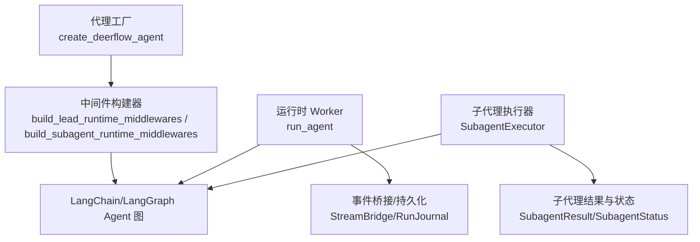
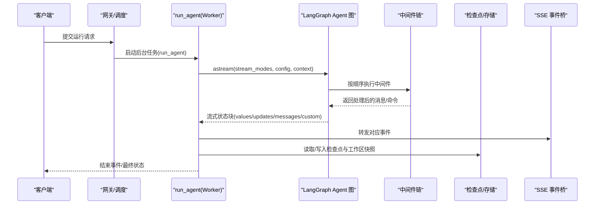
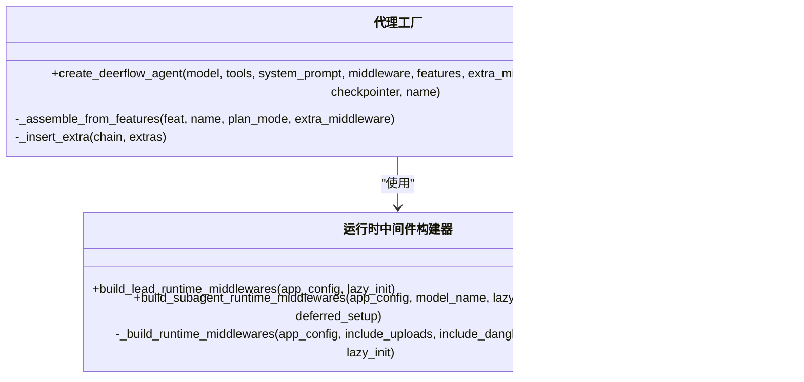
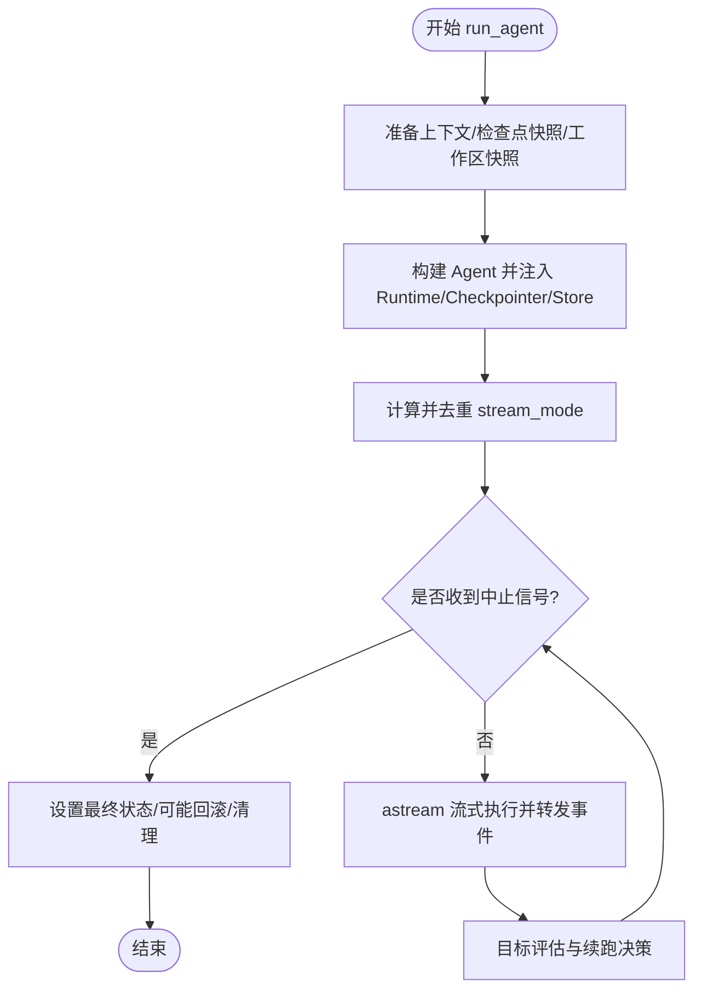
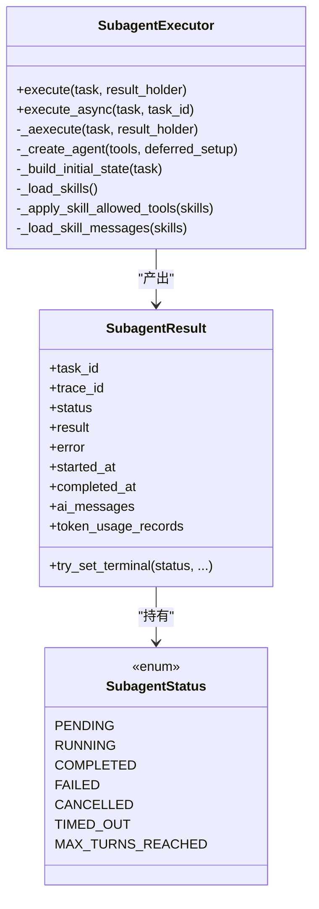
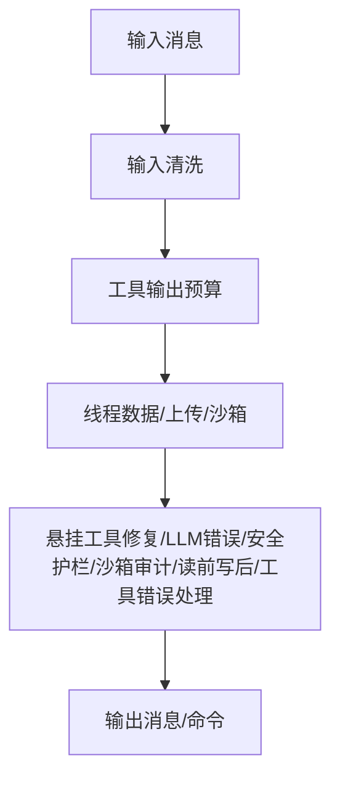
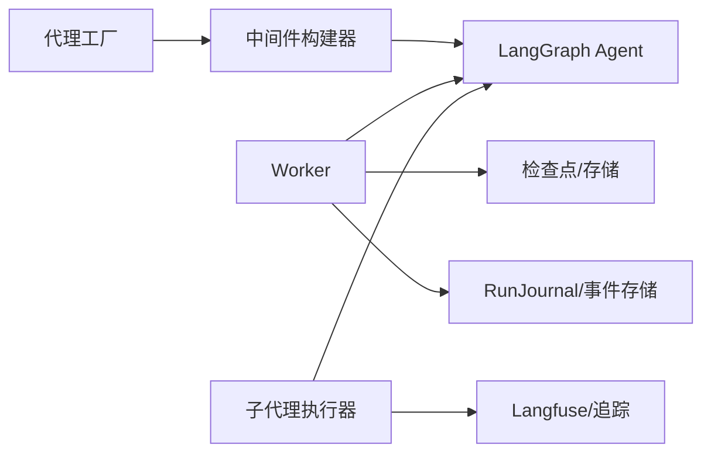

# 代理编排系统

<cite>
**本文引用的文件**   
- [factory.py](file://backend/packages/harness/deerflow/agents/factory.py)
- [tool_error_handling_middleware.py](file://backend/packages/harness/deerflow/agents/middlewares/tool_error_handling_middleware.py)
- [executor.py](file://backend/packages/harness/deerflow/subagents/executor.py)
- [worker.py](file://backend/packages/harness/deerflow/runtime/runs/worker.py)
- [__init__.py](file://backend/packages/harness/deerflow/runtime/runs/__init__.py)
</cite>

## 目录
1. [简介](#简介)
2. [项目结构](#项目结构)
3. [核心组件](#核心组件)
4. [架构总览](#架构总览)
5. [详细组件分析](#详细组件分析)
6. [依赖关系分析](#依赖关系分析)
7. [性能考量](#性能考量)
8. [故障排查指南](#故障排查指南)
9. [结论](#结论)
10. [附录](#附录)

## 简介
本文件面向 DeerFlow 的“代理编排系统”，聚焦以下目标：
- 主代理协调机制：工厂模式、中间件管道、状态管理与生命周期控制。
- 子代理管理系统：创建、并行策略、结果聚合与错误处理。
- 中间件系统扩展性：内置能力（沙箱、记忆、工具调用、循环检测等）与自定义开发指南。
- 与 LangGraph 的集成方式与最佳实践。
- 提供具体代码示例路径，展示如何创建自定义代理、配置中间件链与管理代理状态。

## 项目结构
围绕代理编排的关键模块分布如下：
- 代理工厂与特性装配：负责以纯参数方式组装 Agent 及其中间件链。
- 运行时执行器：后台运行 Agent 图，管理流式输出、检查点、目标评估与回滚。
- 子代理执行引擎：封装子代理的创建、执行、取消、超时与结果收集。
- 中间件构建器：为“主代理”和“子代理”分别构建共享中间件链。

图示来源
- [factory.py:61-147](file://backend/packages/harness/deerflow/agents/factory.py#L61-L147)
- [tool_error_handling_middleware.py:149-223](file://backend/packages/harness/deerflow/agents/middlewares/tool_error_handling_middleware.py#L149-L223)
- [worker.py:207-433](file://backend/packages/harness/deerflow/runtime/runs/worker.py#L207-L433)
- [executor.py:327-434](file://backend/packages/harness/deerflow/subagents/executor.py#L327-L434)

章节来源
- [factory.py:61-147](file://backend/packages/harness/deerflow/agents/factory.py#L61-L147)
- [tool_error_handling_middleware.py:149-223](file://backend/packages/harness/deerflow/agents/middlewares/tool_error_handling_middleware.py#L149-L223)
- [worker.py:207-433](file://backend/packages/harness/deerflow/runtime/runs/worker.py#L207-L433)
- [executor.py:327-434](file://backend/packages/harness/deerflow/subagents/executor.py#L327-L434)

## 核心组件
- 代理工厂 create_deerflow_agent
  - 接受模型、工具、中间件、特性开关、计划模式、状态类型、检查点等纯参数。
  - 支持两种装配模式：完全接管（直接传入 middleware）或基于特性的自动装配（features + extra_middleware）。
  - 自动注入额外工具（如任务工具、澄清工具），并去重保证用户工具优先。
- 中间件构建器
  - 为主代理与子代理分别提供共享中间件链构建函数，统一输入清洗、线程数据、沙箱、错误处理、安全护栏、读前写后、工具输出预算等。
  - 子代理链额外包含视图图像、延迟工具过滤、循环检测与安全终止原因处理。
- 运行时 Worker run_agent
  - 在后台 Task 中驱动 Agent 图 astream，映射多种 stream_mode 到 SSE 事件。
  - 维护 RunContext、检查点快照、工作区快照、目标评估与回滚、标题同步、完成回调等。
- 子代理执行器 SubagentExecutor
  - 封装子代理的创建、初始状态构建、技能加载、工具策略过滤、延迟工具装配、流式执行、结果提取、取消与超时、隔离事件循环等。

章节来源
- [factory.py:61-147](file://backend/packages/harness/deerflow/agents/factory.py#L61-L147)
- [tool_error_handling_middleware.py:149-223](file://backend/packages/harness/deerflow/agents/middlewares/tool_error_handling_middleware.py#L149-L223)
- [worker.py:207-433](file://backend/packages/harness/deerflow/runtime/runs/worker.py#L207-L433)
- [executor.py:327-434](file://backend/packages/harness/deerflow/subagents/executor.py#L327-L434)

## 架构总览
DeerFlow 将“代理编排”拆分为三层：
- 装配层：通过工厂与特性开关生成 Agent 与中间件链。
- 执行层：Worker 驱动 LangGraph 图的流式执行，管理状态、检查点与事件。
- 子代理层：独立执行单元，具备自身中间件链、资源隔离与结果聚合。

图示来源
- [worker.py:207-433](file://backend/packages/harness/deerflow/runtime/runs/worker.py#L207-L433)
- [tool_error_handling_middleware.py:149-223](file://backend/packages/harness/deerflow/agents/middlewares/tool_error_handling_middleware.py#L149-L223)

## 详细组件分析

### 代理工厂与中间件装配
- 工厂入口 create_deerflow_agent
  - 校验互斥参数：middleware 与 features/extra_middleware 不可同时使用。
  - 当未指定 middleware 时，根据 RuntimeFeatures 自动装配中间件链与额外工具。
  - 最后调用 langchain.agents.create_agent 组装 Agent。
- 特性驱动的中间件装配 _assemble_from_features
  - 固定顺序：沙箱基础设施 → 悬挂工具调用修复 → 安全护栏 → 工具错误处理 → 摘要 → Todo(可选) → 自动标题 → 记忆 → 视觉 → 子代理限制 → 循环检测 → Token 预算 → 澄清（始终最后）。
  - 支持 extra_middleware 通过 @Next/@Prev 锚点插入，并提供冲突与循环检测。
  - 保证 ClarificationMiddleware 始终位于末尾。

图示来源
- [factory.py:61-147](file://backend/packages/harness/deerflow/agents/factory.py#L61-L147)
- [factory.py:155-308](file://backend/packages/harness/deerflow/agents/factory.py#L155-L308)
- [factory.py:316-390](file://backend/packages/harness/deerflow/agents/factory.py#L316-L390)
- [tool_error_handling_middleware.py:149-223](file://backend/packages/harness/deerflow/agents/middlewares/tool_error_handling_middleware.py#L149-L223)
- [tool_error_handling_middleware.py:226-305](file://backend/packages/harness/deerflow/agents/middlewares/tool_error_handling_middleware.py#L226-L305)

章节来源
- [factory.py:61-147](file://backend/packages/harness/deerflow/agents/factory.py#L61-L147)
- [factory.py:155-308](file://backend/packages/harness/deerflow/agents/factory.py#L155-L308)
- [factory.py:316-390](file://backend/packages/harness/deerflow/agents/factory.py#L316-L390)
- [tool_error_handling_middleware.py:149-223](file://backend/packages/harness/deerflow/agents/middlewares/tool_error_handling_middleware.py#L149-L223)
- [tool_error_handling_middleware.py:226-305](file://backend/packages/harness/deerflow/agents/middlewares/tool_error_handling_middleware.py#L226-L305)

### 运行时执行器（Worker）
- run_agent 职责
  - 准备运行上下文（thread_id、run_id、app_config、trace_id）、安装 LangGraph Runtime。
  - 解析并去重 stream_mode，映射到 LangGraph 支持的 values/updates/checkpoints/tasks/debug/messages/custom。
  - 单模式或多模式流式执行，将 chunk 序列化并通过 StreamBridge 发布。
  - 目标评估与继续：在首轮完成后，依据 goal 状态决定是否进行隐藏续跑。
  - 异常与中断：支持用户中止、回滚至预运行检查点、记录工作区变更、刷新日志与完成数据。
- 关键辅助
  - _SubagentEventBuffer：批量持久化子代理步骤事件，避免高频 put() 锁竞争。
  - _extract_llm_error_fallback_message：从流式状态中提取 LLM 失败回退信息。
  - _ensure_interrupted_title：为被中断的首轮运行生成并持久化标题。

图示来源
- [worker.py:207-433](file://backend/packages/harness/deerflow/runtime/runs/worker.py#L207-L433)
- [worker.py:446-498](file://backend/packages/harness/deerflow/runtime/runs/worker.py#L446-L498)
- [worker.py:549-633](file://backend/packages/harness/deerflow/runtime/runs/worker.py#L549-L633)
- [worker.py:1130-1209](file://backend/packages/harness/deerflow/runtime/runs/worker.py#L1130-L1209)

章节来源
- [worker.py:207-433](file://backend/packages/harness/deerflow/runtime/runs/worker.py#L207-L433)
- [worker.py:446-498](file://backend/packages/harness/deerflow/runtime/runs/worker.py#L446-L498)
- [worker.py:549-633](file://backend/packages/harness/deerflow/runtime/runs/worker.py#L549-L633)
- [worker.py:1130-1209](file://backend/packages/harness/deerflow/runtime/runs/worker.py#L1130-L1209)

### 子代理执行引擎
- SubagentExecutor 核心流程
  - 初始化：解析模型名、过滤工具、传播用户身份与审计元数据。
  - 初始状态构建：加载技能、应用工具策略、装配延迟工具、合并 SystemMessage 与 HumanMessage。
  - 执行：astream 流式迭代，捕获 AI 消息增量，收集 token 用量，注入追踪回调与 Langfuse 元数据。
  - 结果提取：从最终状态抽取最后一条 AI 消息文本；若达到 max_turns，则标记 MAX_TURNS_REACHED 并保留部分结果。
  - 并发与隔离：在已有事件循环时使用持久化隔离 loop，避免重复创建/关闭异步资源；支持 execute_async 后台任务与取消。
- 状态与结果
  - SubagentStatus：pending/running/completed/failed/cancelled/timed_out/max_turns_reached。
  - SubagentResult：包含 task_id、trace_id、status、result/error、时间戳、AI 消息列表、token 用量记录、取消事件等。

图示来源
- [executor.py:327-434](file://backend/packages/harness/deerflow/subagents/executor.py#L327-L434)
- [executor.py:498-560](file://backend/packages/harness/deerflow/subagents/executor.py#L498-L560)
- [executor.py:562-746](file://backend/packages/harness/deerflow/subagents/executor.py#L562-L746)
- [executor.py:784-826](file://backend/packages/harness/deerflow/subagents/executor.py#L784-L826)
- [executor.py:828-889](file://backend/packages/harness/deerflow/subagents/executor.py#L828-L889)
- [executor.py:892-966](file://backend/packages/harness/deerflow/subagents/executor.py#L892-L966)

章节来源
- [executor.py:327-434](file://backend/packages/harness/deerflow/subagents/executor.py#L327-L434)
- [executor.py:498-560](file://backend/packages/harness/deerflow/subagents/executor.py#L498-L560)
- [executor.py:562-746](file://backend/packages/harness/deerflow/subagents/executor.py#L562-L746)
- [executor.py:784-826](file://backend/packages/harness/deerflow/subagents/executor.py#L784-L826)
- [executor.py:828-889](file://backend/packages/harness/deerflow/subagents/executor.py#L828-L889)
- [executor.py:892-966](file://backend/packages/harness/deerflow/subagents/executor.py#L892-L966)

### 中间件系统与扩展性
- 共享中间件链（主/子代理共用）
  - 外层包装：输入清洗、工具输出预算。
  - 线程钩子：线程数据、上传、沙箱。
  - 尾部处理：悬挂工具调用修复、LLM 错误处理、安全护栏（可配置）、沙箱审计、读前写后、工具错误处理。
- 子代理专属增强
  - 视觉支持：根据模型能力附加 ViewImageMiddleware。
  - 延迟工具过滤：对 MCP 工具的 schema 延迟暴露，避免绑定过大。
  - 循环检测与安全终止原因：防止工具循环与截断工具调用导致的错误传播。
- 自定义中间件开发指南
  - 继承 AgentMiddleware，实现 before_model/wrap_model_call/after_model 等钩子。
  - 通过 factory._insert_extra 的 @Next/@Prev 锚点插入到既定位置，确保 ClarificationMiddleware 始终在最后。
  - 注意副作用与幂等性，避免阻塞长耗时操作；必要时使用懒初始化。

图示来源
- [tool_error_handling_middleware.py:149-223](file://backend/packages/harness/deerflow/agents/middlewares/tool_error_handling_middleware.py#L149-L223)
- [tool_error_handling_middleware.py:226-305](file://backend/packages/harness/deerflow/agents/middlewares/tool_error_handling_middleware.py#L226-L305)
- [factory.py:155-308](file://backend/packages/harness/deerflow/agents/factory.py#L155-L308)
- [factory.py:316-390](file://backend/packages/harness/deerflow/agents/factory.py#L316-L390)

章节来源
- [tool_error_handling_middleware.py:149-223](file://backend/packages/harness/deerflow/agents/middlewares/tool_error_handling_middleware.py#L149-L223)
- [tool_error_handling_middleware.py:226-305](file://backend/packages/harness/deerflow/agents/middlewares/tool_error_handling_middleware.py#L226-L305)
- [factory.py:155-308](file://backend/packages/harness/deerflow/agents/factory.py#L155-L308)
- [factory.py:316-390](file://backend/packages/harness/deerflow/agents/factory.py#L316-L390)

### 与 LangGraph 的集成与最佳实践
- 集成要点
  - 使用 create_agent 装配中间件链与状态类型；Worker 侧通过 astream 多模式流式执行。
  - 通过 RunnableConfig 注入 callbacks/tags/configurable/context，配合 Langfuse 与 RunJournal 进行追踪与审计。
  - 使用 checkpointer/store 实现状态持久化与跨轮次恢复。
- 最佳实践
  - 明确 stream_mode 需求，避免不必要的 events 模式（网关不支持）。
  - 合理设置 recursion_limit 与 max_turns，结合循环检测与安全终止原因中间件。
  - 使用 RunContext 传递 thread_id/run_id/app_config，便于中间件与工具访问运行时上下文。
  - 对子代理采用隔离事件循环与超时/取消策略，避免资源泄漏与死锁。

章节来源
- [worker.py:207-433](file://backend/packages/harness/deerflow/runtime/runs/worker.py#L207-L433)
- [executor.py:562-746](file://backend/packages/harness/deerflow/subagents/executor.py#L562-L746)

## 依赖关系分析
- 组件耦合
  - 工厂与中间件构建器松耦合：通过特性开关与锚点插入解耦装配逻辑。
  - Worker 与 Agent 图通过 astream 接口交互，屏蔽内部节点细节。
  - 子代理执行器复用中间件构建器，保持主/子一致的安全与治理能力。
- 外部依赖
  - LangChain/LangGraph：Agent 创建、中间件协议、图执行与检查点。
  - Langfuse：追踪元数据注入与链路关联。
  - 存储后端：检查点与事件存储（Postgres/Sqlite 等）。

图示来源
- [factory.py:61-147](file://backend/packages/harness/deerflow/agents/factory.py#L61-L147)
- [tool_error_handling_middleware.py:149-223](file://backend/packages/harness/deerflow/agents/middlewares/tool_error_handling_middleware.py#L149-L223)
- [worker.py:207-433](file://backend/packages/harness/deerflow/runtime/runs/worker.py#L207-L433)
- [executor.py:327-434](file://backend/packages/harness/deerflow/subagents/executor.py#L327-L434)

章节来源
- [factory.py:61-147](file://backend/packages/harness/deerflow/agents/factory.py#L61-L147)
- [tool_error_handling_middleware.py:149-223](file://backend/packages/harness/deerflow/agents/middlewares/tool_error_handling_middleware.py#L149-L223)
- [worker.py:207-433](file://backend/packages/harness/deerflow/runtime/runs/worker.py#L207-L433)
- [executor.py:327-434](file://backend/packages/harness/deerflow/subagents/executor.py#L327-L434)

## 性能考量
- 流式模式选择：优先使用 values/updates/messages/custom，避免 events 模式带来的额外开销。
- 子代理事件批处理：_SubagentEventBuffer 降低高频 put() 锁竞争，提升吞吐。
- 消息去重与增量捕获：子代理侧使用 seen_message_ids 与 processed_message_count 减少 O(n^2) 扫描。
- 隔离事件循环：避免频繁创建/关闭异步资源，提高复用率与稳定性。
- 递归限制与循环检测：结合 max_turns 与 LoopDetectionMiddleware 防止上下文膨胀与 Token 浪费。

[本节为通用指导，不直接分析具体文件]

## 故障排查指南
- LLM 提供者失败回退
  - Worker 会扫描流式状态中的 deerflow_error_fallback 标记，提取错误详情并设置 RunStatus.error。
- 子代理超时与取消
  - execute_async 支持超时设置；request_cancel_background_task 通过 cancel_event 协作式停止。
- 最大轮次耗尽
  - GraphRecursionError 被捕获并转换为 MAX_TURNS_REACHED，保留部分结果供上层决策。
- 检查点回滚
  - 用户中止或异常时可回滚至预运行检查点，恢复线程状态。
- 标题生成失败
  - 中断的首轮运行会在 finally 中尝试生成并持久化标题，失败不影响主流程。

章节来源
- [worker.py:1224-1331](file://backend/packages/harness/deerflow/runtime/runs/worker.py#L1224-L1331)
- [executor.py:748-826](file://backend/packages/harness/deerflow/subagents/executor.py#L748-L826)
- [executor.py:828-889](file://backend/packages/harness/deerflow/subagents/executor.py#L828-L889)
- [worker.py:953-1048](file://backend/packages/harness/deerflow/runtime/runs/worker.py#L953-L1048)
- [worker.py:1130-1209](file://backend/packages/harness/deerflow/runtime/runs/worker.py#L1130-L1209)

## 结论
DeerFlow 的代理编排系统通过清晰的装配层、稳健的执行层与可扩展的中间件体系，实现了主/子代理的统一治理与高效执行。借助 LangGraph 的流式能力与检查点机制，系统在可靠性、可观测性与可维护性方面提供了坚实基础。子代理执行引擎进一步增强了并发与隔离能力，满足复杂任务的分解与聚合需求。

[本节为总结，不直接分析具体文件]

## 附录
- 创建自定义代理（示例路径）
  - 使用工厂：参考 [factory.py:61-147](file://backend/packages/harness/deerflow/agents/factory.py#L61-L147)
  - 基于特性装配：参考 [factory.py:155-308](file://backend/packages/harness/deerflow/agents/factory.py#L155-L308)
  - 插入自定义中间件：参考 [factory.py:316-390](file://backend/packages/harness/deerflow/agents/factory.py#L316-L390)
- 配置中间件链（示例路径）
  - 主代理链：参考 [tool_error_handling_middleware.py:226-233](file://backend/packages/harness/deerflow/agents/middlewares/tool_error_handling_middleware.py#L226-L233)
  - 子代理链：参考 [tool_error_handling_middleware.py:236-305](file://backend/packages/harness/deerflow/agents/middlewares/tool_error_handling_middleware.py#L236-L305)
- 管理代理状态（示例路径）
  - Worker 状态与检查点：参考 [worker.py:207-433](file://backend/packages/harness/deerflow/runtime/runs/worker.py#L207-L433)
  - 子代理结果与状态：参考 [executor.py:327-434](file://backend/packages/harness/deerflow/subagents/executor.py#L327-L434)
- 与 LangGraph 集成（示例路径）
  - 运行入口与导出：参考 [__init__.py:1-16](file://backend/packages/harness/deerflow/runtime/runs/__init__.py#L1-L16)
  - 流式执行与事件映射：参考 [worker.py:404-433](file://backend/packages/harness/deerflow/runtime/runs/worker.py#L404-L433)