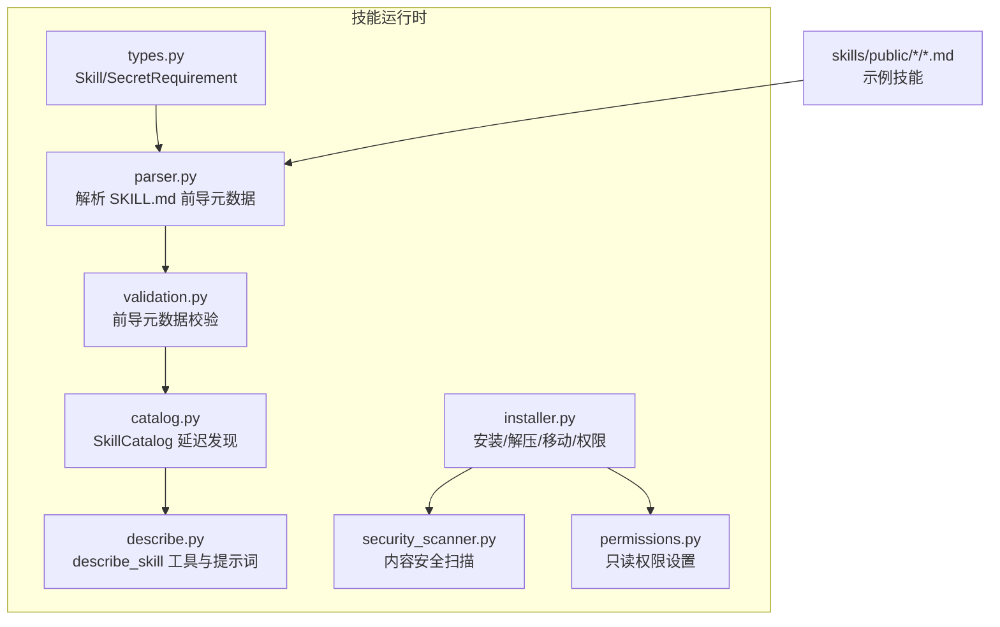
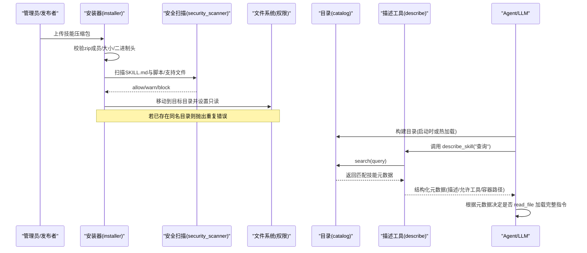
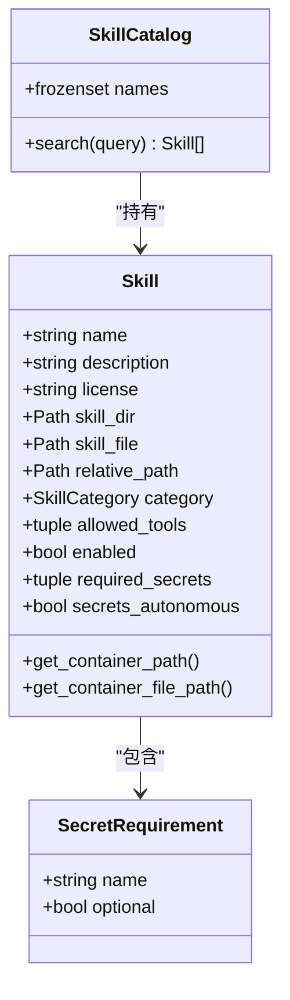
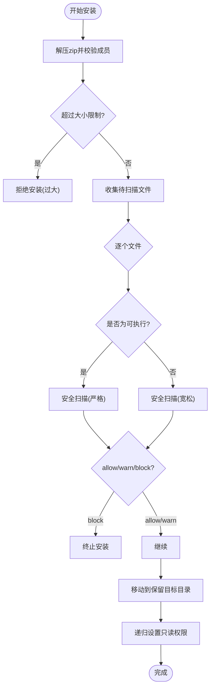
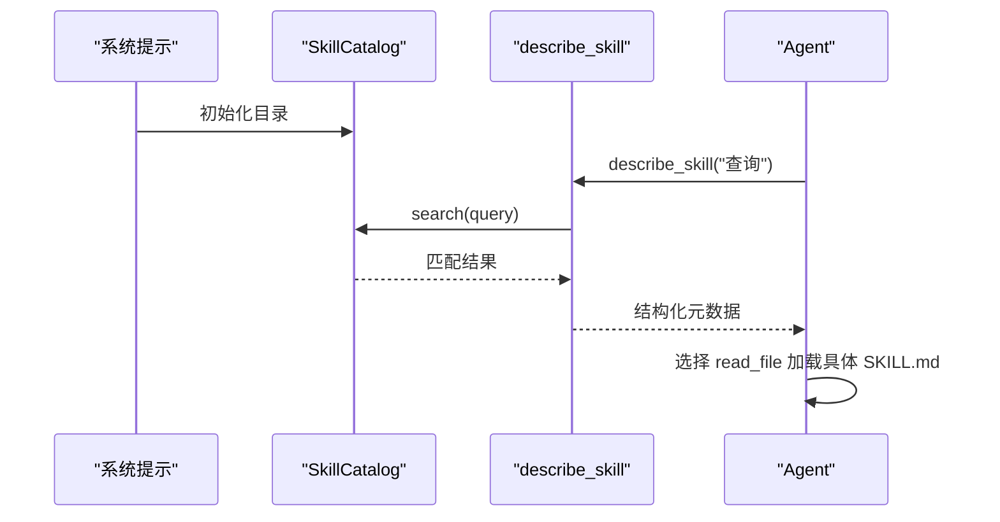
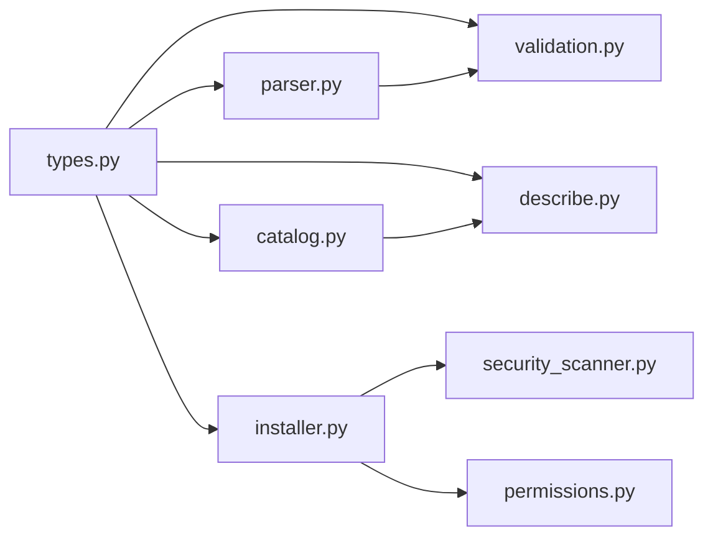

# 技能生态系统

<cite>
**本文引用的文件**   
- [backend/packages/harness/deerflow/skills/__init__.py](file://backend/packages/harness/deerflow/skills/__init__.py)
- [backend/packages/harness/deerflow/skills/types.py](file://backend/packages/harness/deerflow/skills/types.py)
- [backend/packages/harness/deerflow/skills/parser.py](file://backend/packages/harness/deerflow/skills/parser.py)
- [backend/packages/harness/deerflow/skills/validation.py](file://backend/packages/harness/deerflow/skills/validation.py)
- [backend/packages/harness/deerflow/skills/catalog.py](file://backend/packages/harness/deerflow/skills/catalog.py)
- [backend/packages/harness/deerflow/skills/describe.py](file://backend/packages/harness/deerflow/skills/describe.py)
- [backend/packages/harness/deerflow/skills/installer.py](file://backend/packages/harness/deerflow/skills/installer.py)
- [backend/packages/harness/deerflow/skills/security_scanner.py](file://backend/packages/harness/deerflow/skills/security_scanner.py)
- [backend/packages/harness/deerflow/skills/permissions.py](file://backend/packages/harness/deerflow/skills/permissions.py)
- [backend/tests/test_skill_catalog.py](file://backend/tests/test_skill_catalog.py)
- [skills/public/code-documentation/SKILL.md](file://skills/public/code-documentation/SKILL.md)
</cite>

## 目录
1. [简介](#简介)
2. [项目结构](#项目结构)
3. [核心组件](#核心组件)
4. [架构总览](#架构总览)
5. [详细组件分析](#详细组件分析)
6. [依赖分析](#依赖分析)
7. [性能考虑](#性能考虑)
8. [故障排查指南](#故障排查指南)
9. [结论](#结论)
10. [附录：开发教程与最佳实践](#附录开发教程与最佳实践)

## 简介
本文件系统性阐述 DeerFlow 的技能生态系统，覆盖以下关键主题：
- 技能定义规范：SKILL.md 文件格式、元数据字段、依赖声明与执行环境要求
- 技能注册与发现机制：动态加载流程、版本管理策略、依赖解析算法与冲突处理
- 权限控制与安全：访问控制、安全扫描、沙箱隔离与资源限制
- 技能市场生态：发布流程、社区贡献指南、质量评估标准与分发机制
- 完整开发教程：从基础模板到高级特性的实现示例

## 项目结构
技能相关代码集中在后端包 deerflow.skills 中，提供类型定义、解析、校验、目录索引、描述工具、安装器、安全扫描与权限控制等能力。公共技能以 SKILL.md 形式存放在 skills/public 下，供系统内置使用。

图示来源
- [backend/packages/harness/deerflow/skills/types.py:1-93](file://backend/packages/harness/deerflow/skills/types.py#L1-L93)
- [backend/packages/harness/deerflow/skills/parser.py:122-208](file://backend/packages/harness/deerflow/skills/parser.py#L122-L208)
- [backend/packages/harness/deerflow/skills/validation.py:1-94](file://backend/packages/harness/deerflow/skills/validation.py#L1-L94)
- [backend/packages/harness/deerflow/skills/catalog.py:1-103](file://backend/packages/harness/deerflow/skills/catalog.py#L1-L103)
- [backend/packages/harness/deerflow/skills/describe.py:1-181](file://backend/packages/harness/deerflow/skills/describe.py#L1-L181)
- [backend/packages/harness/deerflow/skills/installer.py:1-260](file://backend/packages/harness/deerflow/skills/installer.py#L1-L260)
- [backend/packages/harness/deerflow/skills/security_scanner.py:1-110](file://backend/packages/harness/deerflow/skills/security_scanner.py#L1-L110)
- [backend/packages/harness/deerflow/skills/permissions.py:1-35](file://backend/packages/harness/deerflow/skills/permissions.py#L1-L35)
- [skills/public/code-documentation/SKILL.md:1-40](file://skills/public/code-documentation/SKILL.md#L1-L40)

章节来源
- [backend/packages/harness/deerflow/skills/__init__.py:1-24](file://backend/packages/harness/deerflow/skills/__init__.py#L1-L24)
- [backend/packages/harness/deerflow/skills/types.py:1-93](file://backend/packages/harness/deerflow/skills/types.py#L1-L93)
- [backend/packages/harness/deerflow/skills/parser.py:122-208](file://backend/packages/harness/deerflow/skills/parser.py#L122-L208)
- [backend/packages/harness/deerflow/skills/validation.py:1-94](file://backend/packages/harness/deerflow/skills/validation.py#L1-L94)
- [backend/packages/harness/deerflow/skills/catalog.py:1-103](file://backend/packages/harness/deerflow/skills/catalog.py#L1-L103)
- [backend/packages/harness/deerflow/skills/describe.py:1-181](file://backend/packages/harness/deerflow/skills/describe.py#L1-L181)
- [backend/packages/harness/deerflow/skills/installer.py:1-260](file://backend/packages/harness/deerflow/skills/installer.py#L1-L260)
- [backend/packages/harness/deerflow/skills/security_scanner.py:1-110](file://backend/packages/harness/deerflow/skills/security_scanner.py#L1-L110)
- [backend/packages/harness/deerflow/skills/permissions.py:1-35](file://backend/packages/harness/deerflow/skills/permissions.py#L1-L35)
- [skills/public/code-documentation/SKILL.md:1-40](file://skills/public/code-documentation/SKILL.md#L1-L40)

## 核心组件
- 类型与枚举
  - Skill：技能的不可变数据模型，包含名称、描述、许可、路径、分类、允许的工具集合、启用状态、所需密钥及“自主绑定”策略等。
  - SecretRequirement：声明技能运行所需的请求级密钥（环境变量名）。
  - SkillCategory：public/custom/legacy 三类来源，决定可编辑性与挂载路径。
- 解析与校验
  - parser.parse_skill_file：读取 SKILL.md 的 YAML 前导元数据，提取 name/description/license/allowed-tools/required-secrets/secrets-autonomous 等字段并构造 Skill。
  - validation._validate_skill_frontmatter：对前导元数据进行白名单键检查、必填项校验、命名规范与长度限制等。
- 目录与发现
  - catalog.SkillCatalog：不可变目录，支持 select:+ 前缀/自由文本正则匹配，返回最多 MAX_RESULTS 个结果，用于延迟发现。
  - describe.build_describe_skill_tool：构建 describe_skill 工具，将 SkillCatalog 暴露给 LLM，使其按需检索技能元数据。
  - describe.get_skill_index_prompt_section：生成 <skill_index> 片段，仅列出名称，避免系统提示膨胀。
- 安装与安全
  - installer.safe_extract_skill_archive：解压 zip，拒绝绝对路径/目录穿越/符号链接/二进制头，限制解压大小。
  - installer._scan_skill_archive_contents_or_raise：遍历可扫描文件，调用 security_scanner 进行内容审查。
  - security_scanner.scan_skill_content：基于配置模型对内容进行 allow/warn/block 决策；失败时保守回退为 block。
  - permissions.make_skill_tree_sandbox_readable：递归移除组/其他写权限，确保沙箱内只读。
- 导出接口
  - __init__.py 统一导出 Skill、SkillCatalog、描述工具、校验函数、存储接口与异常类型。

章节来源
- [backend/packages/harness/deerflow/skills/types.py:1-93](file://backend/packages/harness/deerflow/skills/types.py#L1-L93)
- [backend/packages/harness/deerflow/skills/parser.py:122-208](file://backend/packages/harness/deerflow/skills/parser.py#L122-L208)
- [backend/packages/harness/deerflow/skills/validation.py:1-94](file://backend/packages/harness/deerflow/skills/validation.py#L1-L94)
- [backend/packages/harness/deerflow/skills/catalog.py:1-103](file://backend/packages/harness/deerflow/skills/catalog.py#L1-L103)
- [backend/packages/harness/deerflow/skills/describe.py:1-181](file://backend/packages/harness/deerflow/skills/describe.py#L1-L181)
- [backend/packages/harness/deerflow/skills/installer.py:1-260](file://backend/packages/harness/deerflow/skills/installer.py#L1-L260)
- [backend/packages/harness/deerflow/skills/security_scanner.py:1-110](file://backend/packages/harness/deerflow/skills/security_scanner.py#L1-L110)
- [backend/packages/harness/deerflow/skills/permissions.py:1-35](file://backend/packages/harness/deerflow/skills/permissions.py#L1-L35)
- [backend/packages/harness/deerflow/skills/__init__.py:1-24](file://backend/packages/harness/deerflow/skills/__init__.py#L1-L24)

## 架构总览
下图展示了从“安装/更新”到“运行时发现与调用”的端到端流程。

图示来源
- [backend/packages/harness/deerflow/skills/installer.py:101-260](file://backend/packages/harness/deerflow/skills/installer.py#L101-L260)
- [backend/packages/harness/deerflow/skills/security_scanner.py:70-110](file://backend/packages/harness/deerflow/skills/security_scanner.py#L70-L110)
- [backend/packages/harness/deerflow/skills/permissions.py:18-35](file://backend/packages/harness/deerflow/skills/permissions.py#L18-L35)
- [backend/packages/harness/deerflow/skills/catalog.py:59-103](file://backend/packages/harness/deerflow/skills/catalog.py#L59-L103)
- [backend/packages/harness/deerflow/skills/describe.py:50-124](file://backend/packages/harness/deerflow/skills/describe.py#L50-L124)

## 详细组件分析

### 技能定义规范（SKILL.md）
- 文件位置与识别
  - 每个技能目录必须包含名为 SKILL.md 的文件，作为入口与元数据载体。
- 前导元数据（YAML front-matter）
  - 必需字段：name、description
  - 可选字段：license、allowed-tools、metadata、compatibility、version、author
  - 安全扩展字段（由解析器支持）：required-secrets、secrets-autonomous
- allowed-tools
  - 列表形式的字符串，表示该技能允许使用的工具名集合；为空表示允许全部。
- required-secrets
  - 支持字符串或映射{name, optional}，声明运行期注入的环境变量名；无效条目会被忽略并告警。
- secrets-autonomous
  - 布尔值，默认 true；控制是否在“自主上下文加载”时绑定声明的密钥，还是仅在显式 /slash 激活时绑定。
- 命名与描述约束
  - name 需符合小写+连字符规范，长度不超过 64；description 不含尖括号且长度不超过 1024。
- 示例参考
  - 公共技能 code-documentation 的 SKILL.md 展示了标准结构与说明。

章节来源
- [backend/packages/harness/deerflow/skills/parser.py:122-208](file://backend/packages/harness/deerflow/skills/parser.py#L122-L208)
- [backend/packages/harness/deerflow/skills/validation.py:14-94](file://backend/packages/harness/deerflow/skills/validation.py#L14-L94)
- [skills/public/code-documentation/SKILL.md:1-40](file://skills/public/code-documentation/SKILL.md#L1-L40)

### 技能注册与发现机制
- 动态加载流程
  - 安装阶段：解压→安全扫描→落盘→权限收敛→重命名/移动至保留目标；若目标已存在则抛出重复安装异常。
  - 运行时：构建 SkillCatalog，向 Agent 暴露 describe_skill 工具，并在系统提示中注入 <skill_index> 名称列表。
- 版本管理与冲突处理
  - 当前未实现语义化版本比较；通过“按名称唯一”的策略解决冲突：同名技能安装会失败，需先卸载或覆盖。
  - 建议：在 SKILL.md 的 version 字段记录版本信息，配合外部编排系统进行升级与回滚。
- 依赖解析算法
  - 无显式依赖图；allowed-tools 作为“能力声明”，由 describe_skill 返回后由 Agent 自行判断是否满足任务需求。
  - 如需强依赖，可在 SKILL.md 正文中声明，并由上层编排逻辑强制校验。
- 搜索与排序
  - 支持 select:exact-names、+required prefix + ranking、自由文本正则匹配；名称命中权重高于仅描述命中。

图示来源
- [backend/packages/harness/deerflow/skills/types.py:25-93](file://backend/packages/harness/deerflow/skills/types.py#L25-L93)
- [backend/packages/harness/deerflow/skills/catalog.py:41-103](file://backend/packages/harness/deerflow/skills/catalog.py#L41-L103)

章节来源
- [backend/packages/harness/deerflow/skills/installer.py:186-260](file://backend/packages/harness/deerflow/skills/installer.py#L186-L260)
- [backend/packages/harness/deerflow/skills/catalog.py:59-103](file://backend/packages/harness/deerflow/skills/catalog.py#L59-L103)
- [backend/packages/harness/deerflow/skills/describe.py:101-181](file://backend/packages/harness/deerflow/skills/describe.py#L101-L181)
- [backend/tests/test_skill_catalog.py:1-63](file://backend/tests/test_skill_catalog.py#L1-L63)

### 权限控制与安全
- 访问控制
  - 通过 SkillCategory 区分 public/custom/legacy，结合前端展示与后端路由控制编辑/删除能力。
- 安全扫描机制
  - 安装时对 SKILL.md 与脚本/支持文件进行内容扫描；可执行文件需 allow 才能放行；失败或不可解析时保守 block。
- 沙箱隔离与资源限制
  - 解压阶段拒绝绝对路径、目录穿越、符号链接与二进制头，限制最大解压体积。
  - 落盘后递归移除组/其他写权限，使沙箱内只读。
- 密钥与环境变量
  - required-secrets 声明环境变量名；secrets-autonomous 控制绑定时机，降低注入面。

图示来源
- [backend/packages/harness/deerflow/skills/installer.py:101-260](file://backend/packages/harness/deerflow/skills/installer.py#L101-L260)
- [backend/packages/harness/deerflow/skills/security_scanner.py:70-110](file://backend/packages/harness/deerflow/skills/security_scanner.py#L70-L110)
- [backend/packages/harness/deerflow/skills/permissions.py:18-35](file://backend/packages/harness/deerflow/skills/permissions.py#L18-L35)

章节来源
- [backend/packages/harness/deerflow/skills/installer.py:48-148](file://backend/packages/harness/deerflow/skills/installer.py#L48-L148)
- [backend/packages/harness/deerflow/skills/security_scanner.py:1-110](file://backend/packages/harness/deerflow/skills/security_scanner.py#L1-L110)
- [backend/packages/harness/deerflow/skills/permissions.py:1-35](file://backend/packages/harness/deerflow/skills/permissions.py#L1-L35)

### 技能市场生态
- 发布流程
  - 打包为 zip（包含 SKILL.md 与 scripts/references/templates 等），提交到内部仓库或制品库；CI 触发安装与扫描。
- 社区贡献指南
  - 遵循命名与描述规范；尽量提供 scripts 与 references 以提升可执行性与可复用性；明确 allowed-tools 与 required-secrets。
- 质量评估标准
  - 建议引入自动化评测集与基准对比（如 skill-creator 中的评估与分析流程），关注通过率、耗时、token 消耗与稳定性。
- 分发机制
  - 通过 Gateway/Client 调用安装器进行集中安装；按用户域隔离存储（custom/legacy），公共技能以只读方式挂载。

章节来源
- [backend/packages/harness/deerflow/skills/installer.py:1-260](file://backend/packages/harness/deerflow/skills/installer.py#L1-L260)
- [skills/public/skill-creator/agents/analyzer.md:49-89](file://skills/public/skill-creator/agents/analyzer.md#L49-L89)

### 运行时集成与提示工程
- 延迟发现
  - 系统提示仅包含 <skill_index> 名称列表，减少上下文占用；Agent 通过 describe_skill 按需获取元数据。
- 元数据渲染
  - describe_skill 返回描述、允许工具与容器内文件路径，便于 Agent 进一步 read_file 加载完整指令。
- 上下文标记
  - 当 Agent 读取 SKILL.md 时，中间件会将来源与上下文信息附加到消息中，便于审计与回溯。

图示来源
- [backend/packages/harness/deerflow/skills/describe.py:50-124](file://backend/packages/harness/deerflow/skills/describe.py#L50-L124)
- [backend/packages/harness/deerflow/skills/catalog.py:59-103](file://backend/packages/harness/deerflow/skills/catalog.py#L59-L103)

章节来源
- [backend/packages/harness/deerflow/skills/describe.py:143-181](file://backend/packages/harness/deerflow/skills/describe.py#L143-L181)

## 依赖分析
- 模块耦合
  - types 被 parser/validation/catalog/describe/installer 共同依赖，形成稳定契约。
  - installer 依赖 security_scanner 与 permissions，职责清晰、边界明确。
  - describe 依赖 catalog，不直接读写磁盘，保持纯函数风格。
- 外部依赖
  - 安全扫描依赖配置的 moderation_model_name 与 create_chat_model；失败时保守回退为 block。
- 潜在循环依赖
  - 当前未发现循环导入；各模块单向依赖，利于测试与维护。

图示来源
- [backend/packages/harness/deerflow/skills/types.py:1-93](file://backend/packages/harness/deerflow/skills/types.py#L1-L93)
- [backend/packages/harness/deerflow/skills/parser.py:122-208](file://backend/packages/harness/deerflow/skills/parser.py#L122-L208)
- [backend/packages/harness/deerflow/skills/validation.py:1-94](file://backend/packages/harness/deerflow/skills/validation.py#L1-L94)
- [backend/packages/harness/deerflow/skills/catalog.py:1-103](file://backend/packages/harness/deerflow/skills/catalog.py#L1-L103)
- [backend/packages/harness/deerflow/skills/describe.py:1-181](file://backend/packages/harness/deerflow/skills/describe.py#L1-L181)
- [backend/packages/harness/deerflow/skills/installer.py:1-260](file://backend/packages/harness/deerflow/skills/installer.py#L1-L260)
- [backend/packages/harness/deerflow/skills/security_scanner.py:1-110](file://backend/packages/harness/deerflow/skills/security_scanner.py#L1-L110)
- [backend/packages/harness/deerflow/skills/permissions.py:1-35](file://backend/packages/harness/deerflow/skills/permissions.py#L1-L35)

章节来源
- [backend/packages/harness/deerflow/skills/__init__.py:1-24](file://backend/packages/harness/deerflow/skills/__init__.py#L1-L24)

## 性能考虑
- 延迟发现
  - 通过 <skill_index> 与 describe_skill 避免一次性加载所有技能详情，显著降低系统提示长度与缓存压力。
- 搜索优化
  - 名称优先匹配与正则降级为字面量匹配，保证鲁棒性与性能。
- 安装与扫描
  - 解压过程流式读取并限制总大小；扫描采用异步与线程池混合，避免阻塞事件循环。
- 权限收敛
  - 安装完成后一次性 chmod，减少后续 IO 开销。

[本节为通用指导，无需特定文件引用]

## 故障排查指南
- 安装失败
  - 重复安装：目标目录已存在，抛出重复安装异常。解决方案：先卸载或覆盖。
  - 安全扫描 block：检查 SKILL.md 与脚本内容是否存在注入或越权风险；必要时调整 allowed-tools 与 required-secrets。
  - 压缩包过大或包含二进制头：清理无用文件或拆分技能包。
- 运行时问题
  - describe_skill 无结果：确认 query 语法与技能名称；检查 catalog 是否正确初始化。
  - 密钥未注入：核对 required-secrets 与 secrets-autonomous 配置；确认运行时上下文是否携带对应密钥。
- 日志与定位
  - 解析错误：parser 会输出友好提示（含行号与建议）；validation 会指出非法键或缺失必填项。
  - 安全扫描失败：scanner 会在模型不可用时保守 block，需人工复核。

章节来源
- [backend/packages/harness/deerflow/skills/installer.py:186-260](file://backend/packages/harness/deerflow/skills/installer.py#L186-L260)
- [backend/packages/harness/deerflow/skills/security_scanner.py:70-110](file://backend/packages/harness/deerflow/skills/security_scanner.py#L70-L110)
- [backend/packages/harness/deerflow/skills/parser.py:15-43](file://backend/packages/harness/deerflow/skills/parser.py#L15-L43)
- [backend/packages/harness/deerflow/skills/validation.py:50-94](file://backend/packages/harness/deerflow/skills/validation.py#L50-L94)

## 结论
DeerFlow 的技能生态以“轻量定义、延迟发现、严格安全、最小权限”为核心原则，通过 SKILL.md 前导元数据与 describe_skill 工具实现高效、可扩展的技能体系。安装器与安全扫描保障供应链安全，权限收敛确保沙箱隔离。建议在版本管理与依赖声明方面进一步完善，以支撑更复杂的组合与升级场景。

[本节为总结性内容，无需特定文件引用]

## 附录：开发教程与最佳实践
- 从零创建技能
  - 新建目录与 SKILL.md，填写 name/description 与可选字段；在正文中编写步骤与示例。
  - 如有脚本，放入 scripts/；参考资料放入 references/；模板放入 templates/。
- 声明依赖与权限
  - allowed-tools：精确声明所需工具，避免过度授权。
  - required-secrets：仅声明必要环境变量；必要时将 optional 设为 true。
  - secrets-autonomous：谨慎设置为 false，以降低自动上下文下的注入面。
- 本地验证
  - 使用 validation 与 parser 进行自检；在沙箱中试运行脚本与模板。
- 发布与分发
  - 打包 zip，提交 CI 进行扫描与安装；在公共仓库维护版本与变更日志。
- 质量评估
  - 参考 skill-creator 的评估与分析流程，建立回归用例与基准指标。

章节来源
- [skills/public/code-documentation/SKILL.md:1-40](file://skills/public/code-documentation/SKILL.md#L1-L40)
- [backend/packages/harness/deerflow/skills/validation.py:14-94](file://backend/packages/harness/deerflow/skills/validation.py#L14-L94)
- [backend/packages/harness/deerflow/skills/parser.py:122-208](file://backend/packages/harness/deerflow/skills/parser.py#L122-L208)
- [skills/public/skill-creator/agents/analyzer.md:49-89](file://skills/public/skill-creator/agents/analyzer.md#L49-L89)