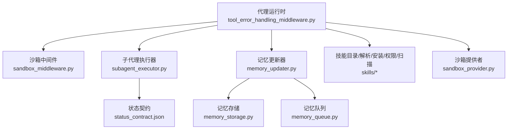
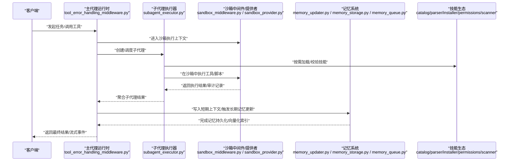
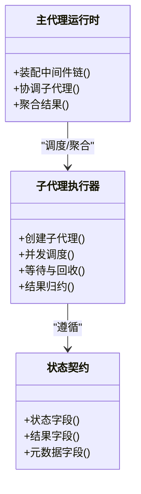
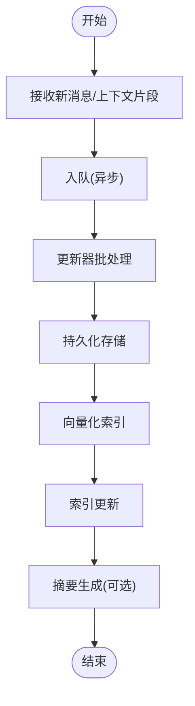
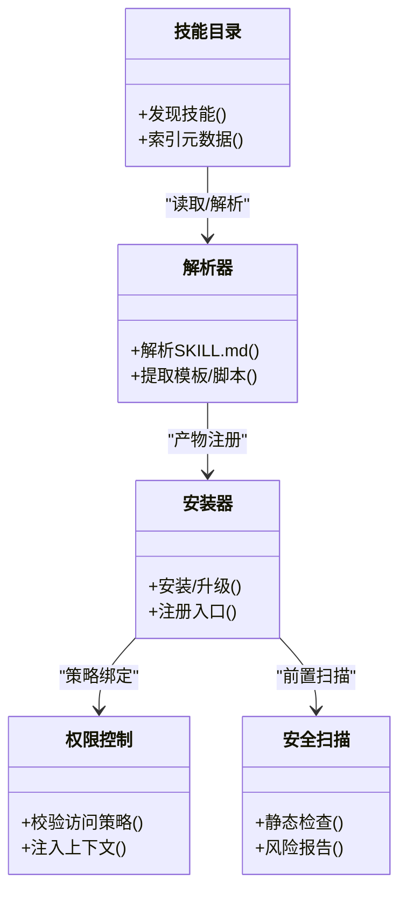
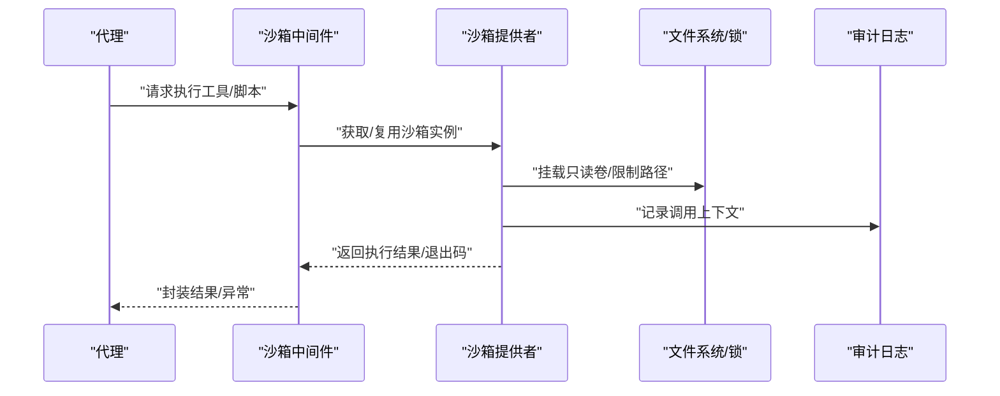
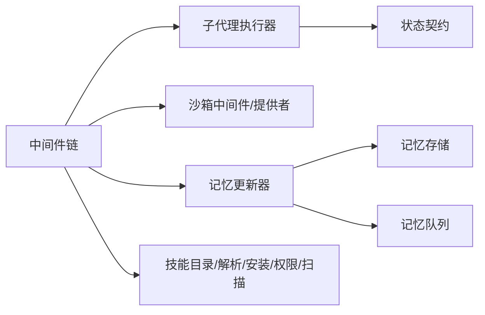

# 核心功能模块

<cite>
**本文引用的文件**   
- [tool_error_handling_middleware.py](file://backend/packages/harness/deerflow/agents/middlewares/tool_error_handling_middleware.py)
- [sandbox_middleware.py](file://backend/packages/harness/deerflow/sandbox/middleware.py)
- [sandbox_provider.py](file://backend/packages/harness/deerflow/sandbox/sandbox_provider.py)
- [security_scanner.py](file://backend/packages/harness/deerflow/skills/security_scanner.py)
- [permissions.py](file://backend/packages/harness/deerflow/skills/permissions.py)
- [installer.py](file://backend/packages/harness/deerflow/skills/installer.py)
- [catalog.py](file://backend/packages/harness/deerflow/skills/catalog.py)
- [parser.py](file://backend/packages/harness/deerflow/skills/parser.py)
- [validation.py](file://backend/packages/harness/deerflow/skills/validation.py)
- [types.py](file://backend/packages/harness/deerflow/skills/types.py)
- [memory_updater.py](file://backend/packages/harness/deerflow/persistence/memory_updater.py)
- [memory_storage.py](file://backend/packages/harness/deerflow/persistence/memory_storage.py)
- [memory_queue.py](file://backend/packages/harness/deerflow/persistence/memory_queue.py)
- [run_manager.py](file://backend/packages/harness/deerflow/runtime/run_manager.py)
- [subagent_executor.py](file://backend/packages/harness/deerflow/subagents/executor.py)
- [status_contract.json](file://contracts/subagent_status_contract.json)
</cite>

## 目录
1. [简介](#简介)
2. [项目结构](#项目结构)
3. [核心组件](#核心组件)
4. [架构总览](#架构总览)
5. [详细组件分析](#详细组件分析)
6. [依赖关系分析](#依赖关系分析)
7. [性能考量](#性能考量)
8. [故障排查指南](#故障排查指南)
9. [结论](#结论)
10. [附录](#附录)

## 简介
本文件聚焦 DeerFlow 的核心功能模块，围绕以下主题展开：
- 代理编排系统：主代理协调机制、子代理生命周期管理、并行执行策略与结果聚合算法。
- 记忆系统：短期上下文管理、长期记忆持久化、向量搜索集成与摘要生成机制。
- 技能生态系统：技能定义规范、动态加载机制、权限控制与版本管理。
- 安全沙箱执行环境：容器隔离、资源限制、审计日志与文件操作安全。
并提供各模块间的集成方式与配置选项说明，帮助读者快速理解并正确使用这些能力。

## 项目结构
DeerFlow 后端核心位于 backend/packages/harness/deerflow 下，关键目录包括：
- agents：中间件与运行时装配（含工具错误处理、沙箱中间件等）
- sandbox：沙箱执行环境与提供者抽象
- skills：技能生态（解析、安装、权限、扫描、目录索引等）
- persistence：记忆系统与持久化（更新器、存储、队列等）
- runtime：运行期管理与任务调度
- subagents：子代理执行与状态契约

图表来源
- [tool_error_handling_middleware.py:178-223](file://backend/packages/harness/deerflow/agents/middlewares/tool_error_handling_middleware.py#L178-L223)
- [sandbox_middleware.py](file://backend/packages/harness/deerflow/sandbox/middleware.py)
- [subagent_executor.py](file://backend/packages/harness/deerflow/subagents/executor.py)
- [status_contract.json](file://contracts/subagent_status_contract.json)
- [memory_updater.py](file://backend/packages/harness/deerflow/persistence/memory_updater.py)
- [memory_storage.py](file://backend/packages/harness/deerflow/persistence/memory_storage.py)
- [memory_queue.py](file://backend/packages/harness/deerflow/persistence/memory_queue.py)
- [sandbox_provider.py](file://backend/packages/harness/deerflow/sandbox/sandbox_provider.py)
- [catalog.py](file://backend/packages/harness/deerflow/skills/catalog.py)
- [parser.py](file://backend/packages/harness/deerflow/skills/parser.py)
- [installer.py](file://backend/packages/harness/deerflow/skills/installer.py)
- [permissions.py](file://backend/packages/harness/deerflow/skills/permissions.py)
- [security_scanner.py](file://backend/packages/harness/deerflow/skills/security_scanner.py)

章节来源
- [tool_error_handling_middleware.py:178-223](file://backend/packages/harness/deerflow/agents/middlewares/tool_error_handling_middleware.py#L178-L223)

## 核心组件
- 代理编排与中间件链：负责组装主/子代理的运行时中间件，统一接入上传、沙箱、审计、防护、循环检测与安全终止等能力。
- 子代理执行器：负责子代理的创建、生命周期管理、并发执行与结果聚合，遵循统一的状态契约。
- 记忆系统：包含短期上下文、长期记忆存储、异步队列与更新器，支持向量化检索与摘要生成。
- 技能生态：提供 SKILL.md 解析、目录索引、安装与权限校验、安全扫描与策略控制。
- 安全沙箱：通过中间件与提供者抽象实现容器隔离、资源限制、审计日志与文件操作安全。

章节来源
- [tool_error_handling_middleware.py:178-223](file://backend/packages/harness/deerflow/agents/middlewares/tool_error_handling_middleware.py#L178-L223)
- [subagent_executor.py](file://backend/packages/harness/deerflow/subagents/executor.py)
- [memory_updater.py](file://backend/packages/harness/deerflow/persistence/memory_updater.py)
- [memory_storage.py](file://backend/packages/harness/deerflow/persistence/memory_storage.py)
- [memory_queue.py](file://backend/packages/harness/deerflow/persistence/memory_queue.py)
- [catalog.py](file://backend/packages/harness/deerflow/skills/catalog.py)
- [parser.py](file://backend/packages/harness/deerflow/skills/parser.py)
- [installer.py](file://backend/packages/harness/deerflow/skills/installer.py)
- [permissions.py](file://backend/packages/harness/deerflow/skills/permissions.py)
- [security_scanner.py](file://backend/packages/harness/deerflow/skills/security_scanner.py)
- [sandbox_middleware.py](file://backend/packages/harness/deerflow/sandbox/middleware.py)
- [sandbox_provider.py](file://backend/packages/harness/deerflow/sandbox/sandbox_provider.py)

## 架构总览
下图展示了从请求进入主代理到子代理执行、记忆更新与沙箱执行的端到端流程。

图表来源
- [tool_error_handling_middleware.py:178-223](file://backend/packages/harness/deerflow/agents/middlewares/tool_error_handling_middleware.py#L178-L223)
- [subagent_executor.py](file://backend/packages/harness/deerflow/subagents/executor.py)
- [sandbox_middleware.py](file://backend/packages/harness/deerflow/sandbox/middleware.py)
- [sandbox_provider.py](file://backend/packages/harness/deerflow/sandbox/sandbox_provider.py)
- [memory_updater.py](file://backend/packages/harness/deerflow/persistence/memory_updater.py)
- [memory_storage.py](file://backend/packages/harness/deerflow/persistence/memory_storage.py)
- [memory_queue.py](file://backend/packages/harness/deerflow/persistence/memory_queue.py)
- [catalog.py](file://backend/packages/harness/deerflow/skills/catalog.py)
- [parser.py](file://backend/packages/harness/deerflow/skills/parser.py)
- [installer.py](file://backend/packages/harness/deerflow/skills/installer.py)
- [permissions.py](file://backend/packages/harness/deerflow/skills/permissions.py)
- [security_scanner.py](file://backend/packages/harness/deerflow/skills/security_scanner.py)

## 详细组件分析

### 代理编排系统
- 主代理协调机制
  - 通过统一的中间件构建函数装配运行时链路，包含上传、沙箱、审计、防护、循环检测与安全终止等层。
  - 主代理与子代理共享基础中间件，但子代理额外启用延迟工具过滤、循环检测与安全终止等保护。
- 子代理生命周期管理
  - 由执行器负责创建、调度与回收，遵循统一的状态契约以对外暴露一致的结果格式。
- 并行执行策略
  - 执行器内部对多个子代理进行并发调度，结合超时与熔断策略避免资源耗尽。
- 结果聚合算法
  - 将各子代理输出按契约规范化后合并为主代理可消费的结构化结果，必要时进行去重与冲突消解。

图表来源
- [tool_error_handling_middleware.py:226-305](file://backend/packages/harness/deerflow/agents/middlewares/tool_error_handling_middleware.py#L226-L305)
- [subagent_executor.py](file://backend/packages/harness/deerflow/subagents/executor.py)
- [status_contract.json](file://contracts/subagent_status_contract.json)

章节来源
- [tool_error_handling_middleware.py:226-305](file://backend/packages/harness/deerflow/agents/middlewares/tool_error_handling_middleware.py#L226-L305)
- [subagent_executor.py](file://backend/packages/harness/deerflow/subagents/executor.py)
- [status_contract.json](file://contracts/subagent_status_contract.json)

### 记忆系统
- 短期上下文管理
  - 通过内存队列与更新器维护会话级上下文，支持增量写入与滑动窗口裁剪。
- 长期记忆持久化
  - 持久化存储层负责结构化保存与检索；更新器负责批处理与一致性。
- 向量搜索集成
  - 在持久化层之上提供向量化索引与相似度检索接口，用于语义召回。
- 摘要生成机制
  - 基于历史消息与上下文片段生成摘要，降低后续推理成本并提升相关性。

图表来源
- [memory_queue.py](file://backend/packages/harness/deerflow/persistence/memory_queue.py)
- [memory_updater.py](file://backend/packages/harness/deerflow/persistence/memory_updater.py)
- [memory_storage.py](file://backend/packages/harness/deerflow/persistence/memory_storage.py)

章节来源
- [memory_queue.py](file://backend/packages/harness/deerflow/persistence/memory_queue.py)
- [memory_updater.py](file://backend/packages/harness/deerflow/persistence/memory_updater.py)
- [memory_storage.py](file://backend/packages/harness/deerflow/persistence/memory_storage.py)

### 技能生态系统
- 技能定义规范
  - 使用 SKILL.md 描述技能元信息、输入输出、模板与参考文档。
- 动态加载机制
  - 目录索引与解析器负责发现与解析技能，安装器负责部署与注册。
- 权限控制
  - 权限模型与策略决定技能可调用的工具与环境能力。
- 版本管理
  - 通过安装器与目录索引维护版本信息与依赖关系。
- 安全扫描
  - 对技能脚本与模板进行静态安全检查，阻断高风险行为。

图表来源
- [catalog.py](file://backend/packages/harness/deerflow/skills/catalog.py)
- [parser.py](file://backend/packages/harness/deerflow/skills/parser.py)
- [installer.py](file://backend/packages/harness/deerflow/skills/installer.py)
- [permissions.py](file://backend/packages/harness/deerflow/skills/permissions.py)
- [security_scanner.py](file://backend/packages/harness/deerflow/skills/security_scanner.py)
- [types.py](file://backend/packages/harness/deerflow/skills/types.py)
- [validation.py](file://backend/packages/harness/deerflow/skills/validation.py)

章节来源
- [catalog.py](file://backend/packages/harness/deerflow/skills/catalog.py)
- [parser.py](file://backend/packages/harness/deerflow/skills/parser.py)
- [installer.py](file://backend/packages/harness/deerflow/skills/installer.py)
- [permissions.py](file://backend/packages/harness/deerflow/skills/permissions.py)
- [security_scanner.py](file://backend/packages/harness/deerflow/skills/security_scanner.py)
- [types.py](file://backend/packages/harness/deerflow/skills/types.py)
- [validation.py](file://backend/packages/harness/deerflow/skills/validation.py)

### 安全沙箱执行环境
- 容器隔离
  - 通过沙箱提供者抽象在不同后端（本地/远程）上启动隔离的执行环境。
- 资源限制
  - 在中间件层统一注入资源配额与超时控制，防止资源滥用。
- 审计日志
  - 所有工具调用与文件操作均被审计，便于追踪与回溯。
- 文件操作安全
  - 路径白名单、读写锁与大小限制保障文件系统安全。

图表来源
- [sandbox_middleware.py](file://backend/packages/harness/deerflow/sandbox/middleware.py)
- [sandbox_provider.py](file://backend/packages/harness/deerflow/sandbox/sandbox_provider.py)

章节来源
- [sandbox_middleware.py](file://backend/packages/harness/deerflow/sandbox/middleware.py)
- [sandbox_provider.py](file://backend/packages/harness/deerflow/sandbox/sandbox_provider.py)

## 依赖关系分析
- 中间件层依赖配置与外部服务（如防护、审计、沙箱）。
- 子代理执行器依赖状态契约与中间件链提供的能力。
- 记忆系统依赖持久化与队列，更新器作为协调者串联两者。
- 技能生态各组件之间形成“发现→解析→安装→权限→扫描”的流水线。

图表来源
- [tool_error_handling_middleware.py:178-223](file://backend/packages/harness/deerflow/agents/middlewares/tool_error_handling_middleware.py#L178-L223)
- [subagent_executor.py](file://backend/packages/harness/deerflow/subagents/executor.py)
- [status_contract.json](file://contracts/subagent_status_contract.json)
- [memory_updater.py](file://backend/packages/harness/deerflow/persistence/memory_updater.py)
- [memory_storage.py](file://backend/packages/harness/deerflow/persistence/memory_storage.py)
- [memory_queue.py](file://backend/packages/harness/deerflow/persistence/memory_queue.py)
- [sandbox_middleware.py](file://backend/packages/harness/deerflow/sandbox/middleware.py)
- [sandbox_provider.py](file://backend/packages/harness/deerflow/sandbox/sandbox_provider.py)
- [catalog.py](file://backend/packages/harness/deerflow/skills/catalog.py)
- [parser.py](file://backend/packages/harness/deerflow/skills/parser.py)
- [installer.py](file://backend/packages/harness/deerflow/skills/installer.py)
- [permissions.py](file://backend/packages/harness/deerflow/skills/permissions.py)
- [security_scanner.py](file://backend/packages/harness/deerflow/skills/security_scanner.py)

章节来源
- [tool_error_handling_middleware.py:178-223](file://backend/packages/harness/deerflow/agents/middlewares/tool_error_handling_middleware.py#L178-L223)

## 性能考量
- 中间件链应尽可能惰性初始化，减少冷启动开销。
- 子代理并发度需根据资源上限与下游服务容量调优，避免过载。
- 记忆更新采用异步队列与批处理，降低同步阻塞。
- 沙箱提供者应支持实例复用与连接池，缩短启动时延。
- 技能扫描与解析应在安装阶段完成，运行时仅做轻量校验。

## 故障排查指南
- 工具错误处理
  - 关注中间件链中的工具错误处理与安全终止逻辑，定位失败环节与恢复提示。
- 沙箱执行问题
  - 检查沙箱中间件与提供者日志，确认容器启动、挂载与权限是否正确。
- 记忆系统异常
  - 查看队列堆积与更新器批处理日志，确认持久化写入是否成功。
- 技能加载失败
  - 核对 SKILL.md 解析结果、权限策略与安全扫描报告，修复不合规项。

章节来源
- [tool_error_handling_middleware.py:178-223](file://backend/packages/harness/deerflow/agents/middlewares/tool_error_handling_middleware.py#L178-L223)
- [sandbox_middleware.py](file://backend/packages/harness/deerflow/sandbox/middleware.py)
- [sandbox_provider.py](file://backend/packages/harness/deerflow/sandbox/sandbox_provider.py)
- [memory_updater.py](file://backend/packages/harness/deerflow/persistence/memory_updater.py)
- [memory_queue.py](file://backend/packages/harness/deerflow/persistence/memory_queue.py)
- [security_scanner.py](file://backend/packages/harness/deerflow/skills/security_scanner.py)

## 结论
DeerFlow 的核心模块以中间件为纽带，将代理编排、子代理执行、记忆系统与技能生态有机整合，并通过沙箱提供安全的执行环境。通过合理的并发策略、异步更新与严格的安全控制，系统在可扩展性与安全性之间取得平衡。建议在生产环境中结合监控与审计日志持续优化参数与策略。

## 附录
- 配置与集成要点
  - 主/子代理中间件链可通过构建函数按需开启或关闭特定能力。
  - 记忆系统默认异步更新，可按需调整批大小与刷新频率。
  - 技能安装前必须通过安全扫描与权限校验，确保最小权限原则。
  - 沙箱提供者可根据部署环境选择本地或远程后端，并配置资源限额。