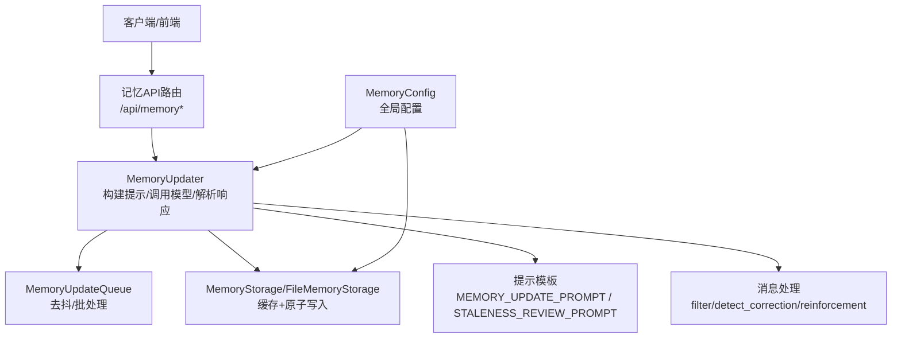
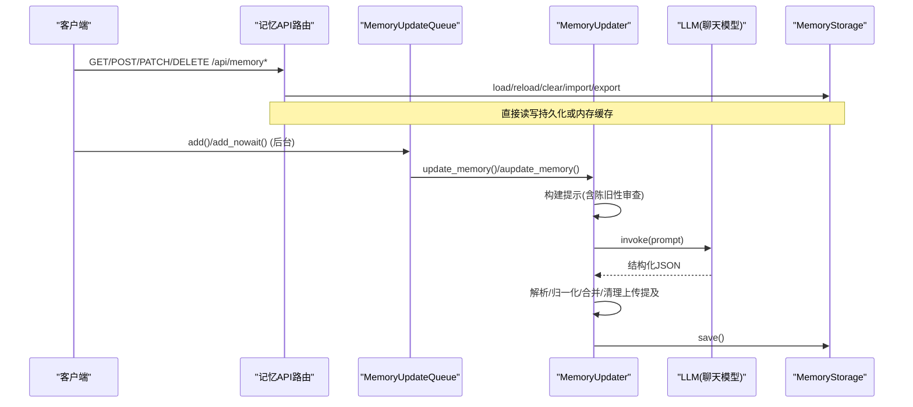
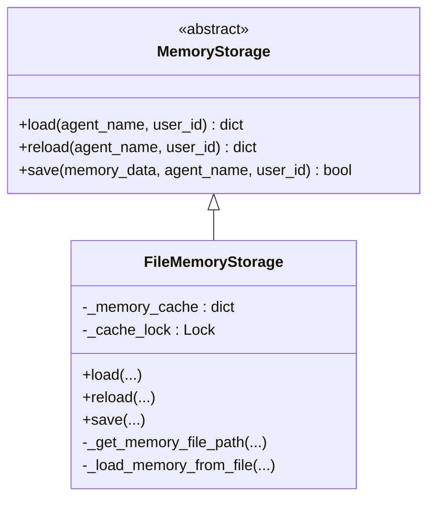
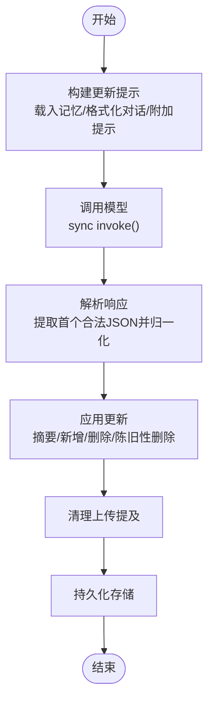
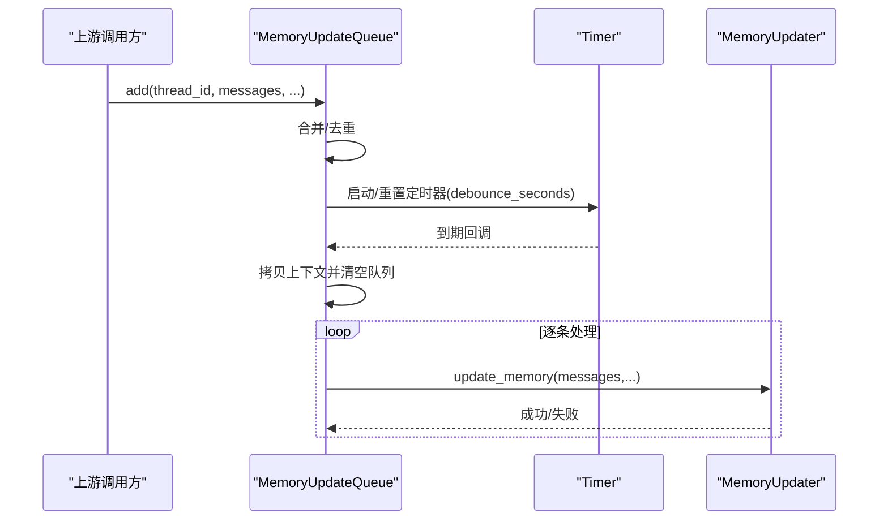
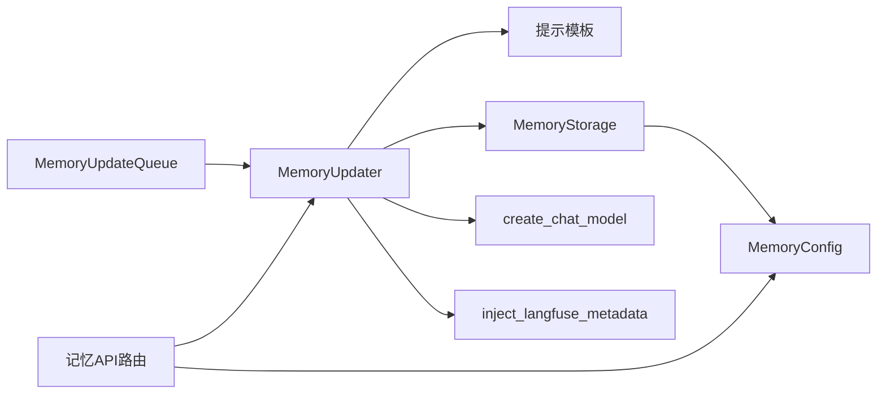

# 记忆管理系统

<cite>
**本文引用的文件**
- [memory.py](file://backend/app/gateway/routers/memory.py)
- [memory_config.py](file://backend/packages/harness/deerflow/config/memory_config.py)
- [storage.py](file://backend/packages/harness/deerflow/agents/memory/storage.py)
- [updater.py](file://backend/packages/harness/deerflow/agents/memory/updater.py)
- [queue.py](file://backend/packages/harness/deerflow/agents/memory/queue.py)
- [prompt.py](file://backend/packages/harness/deerflow/agents/memory/prompt.py)
- [message_processing.py](file://backend/packages/harness/deerflow/agents/memory/message_processing.py)
</cite>

## 目录
1. [简介](#简介)
2. [项目结构](#项目结构)
3. [核心组件](#核心组件)
4. [架构总览](#架构总览)
5. [详细组件分析](#详细组件分析)
6. [依赖关系分析](#依赖关系分析)
7. [性能与可扩展性](#性能与可扩展性)
8. [故障排查指南](#故障排查指南)
9. [结论](#结论)
10. [附录：配置与调优示例](#附录配置与调优示例)

## 简介
本文件系统性梳理 DeerFlow 的记忆管理系统，覆盖短期上下文管理与长期记忆持久化的分层设计、存储机制（含可插拔存储提供者）、更新流程（消息处理管道、摘要生成、合并策略与冲突解决）、用户隔离与多租户支持，以及配置项与性能调优建议。系统通过“队列+去抖”的异步更新路径，结合 LLM 驱动的语义更新与“陈旧性审查”，在保障一致性与可控成本的前提下实现个性化记忆注入。

## 项目结构
记忆系统位于后端 harness 模块中，并通过网关路由暴露管理接口。关键位置如下：
- 网关 API：/api/memory* 路由，提供读取、重载、清空、事实 CRUD、导入导出、配置与状态查询等能力
- 配置中心：MemoryConfig 集中定义开关、存储路径、去抖时间、注入预算、陈旧性审查等参数
- 存储层：抽象 MemoryStorage 与默认 FileMemoryStorage，支持按用户/代理维度选择持久化目标
- 更新器：MemoryUpdater 负责构建提示、调用模型、解析响应、应用变更并持久化
- 队列：MemoryUpdateQueue 基于线程 Timer 的去抖批处理，聚合同一会话的多轮对话后统一更新
- 提示工程：MEMORY_UPDATE_PROMPT、STALENESS_REVIEW_PROMPT 等模板驱动结构化输出
- 消息处理：过滤上传事件、检测纠正/强化信号，为更新器提供高质量输入

图示来源
- [memory.py:148-412](file://backend/app/gateway/routers/memory.py#L148-L412)
- [updater.py:467-726](file://backend/packages/harness/deerflow/agents/memory/updater.py#L467-L726)
- [queue.py:31-278](file://backend/packages/harness/deerflow/agents/memory/queue.py#L31-L278)
- [storage.py:43-190](file://backend/packages/harness/deerflow/agents/memory/storage.py#L43-L190)
- [prompt.py:22-171](file://backend/packages/harness/deerflow/agents/memory/prompt.py#L22-L171)
- [message_processing.py:56-117](file://backend/packages/harness/deerflow/agents/memory/message_processing.py#L56-L117)

章节来源
- [memory.py:1-412](file://backend/app/gateway/routers/memory.py#L1-L412)
- [memory_config.py:1-156](file://backend/packages/harness/deerflow/config/memory_config.py#L1-L156)
- [storage.py:1-232](file://backend/packages/harness/deerflow/agents/memory/storage.py#L1-L232)
- [updater.py:1-882](file://backend/packages/harness/deerflow/agents/memory/updater.py#L1-L882)
- [queue.py:1-308](file://backend/packages/harness/deerflow/agents/memory/queue.py#L1-L308)
- [prompt.py:1-200](file://backend/packages/harness/deerflow/agents/memory/prompt.py#L1-L200)
- [message_processing.py:1-117](file://backend/packages/harness/deerflow/agents/memory/message_processing.py#L1-L117)

## 核心组件
- 配置中心 MemoryConfig
  - 控制记忆开关、存储路径与类名、去抖秒数、最大事实数、置信度阈值、注入开关与预算、token 计数策略、保证类别与预算、陈旧性审查开关与阈值等
- 存储层 MemoryStorage 与 FileMemoryStorage
  - 抽象加载/保存/重载；FileMemoryStorage 提供进程内缓存（按 user_id + agent_name 键）与 mtime 失效、原子写入（临时文件+replace）
- 更新器 MemoryUpdater
  - 构建更新提示（含陈旧性审查段）、调用模型、解析 JSON、应用变更（用户/历史摘要、新增/删除事实、陈旧性删除）、清理上传事件提及、持久化
- 队列 MemoryUpdateQueue
  - 按 thread_id/user_id/agent_name 去重合并，Timer 延迟触发，支持立即刷新与强制 flush
- 提示模板与消息处理
  - MEMORY_UPDATE_PROMPT 规定结构化输出字段；STALENESS_REVIEW_PROMPT 用于老化事实审查；消息过滤剔除上传块与内部隐藏消息，并检测纠正/强化信号

章节来源
- [memory_config.py:8-135](file://backend/packages/harness/deerflow/config/memory_config.py#L8-L135)
- [storage.py:43-190](file://backend/packages/harness/deerflow/agents/memory/storage.py#L43-L190)
- [updater.py:467-800](file://backend/packages/harness/deerflow/agents/memory/updater.py#L467-L800)
- [queue.py:31-278](file://backend/packages/harness/deerflow/agents/memory/queue.py#L31-L278)
- [prompt.py:22-171](file://backend/packages/harness/deerflow/agents/memory/prompt.py#L22-L171)
- [message_processing.py:56-117](file://backend/packages/harness/deerflow/agents/memory/message_processing.py#L56-L117)

## 架构总览
记忆系统采用“短上下文+长记忆”的分层设计：
- 短期上下文：由消息处理管道过滤后的最近对话片段，作为更新器的输入
- 长期记忆：JSON 结构的持久化数据，包含用户上下文、历史摘要与事实列表
- 更新路径：队列去抖 → 更新器构建提示 → 模型生成结构化更新 → 解析与合并 → 存储持久化
- 注入路径：将记忆内容格式化后注入系统提示，受 token 预算与“保证类别”策略约束

图示来源
- [memory.py:148-412](file://backend/app/gateway/routers/memory.py#L148-L412)
- [queue.py:177-234](file://backend/packages/harness/deerflow/agents/memory/queue.py#L177-L234)
- [updater.py:569-726](file://backend/packages/harness/deerflow/agents/memory/updater.py#L569-L726)
- [storage.py:123-190](file://backend/packages/harness/deerflow/agents/memory/storage.py#L123-L190)

## 详细组件分析

### 存储层：MemoryStorage 与 FileMemoryStorage
- 抽象接口
  - load(agent_name, user_id): 按作用域加载
  - reload(agent_name, user_id): 强制从文件重载并刷新缓存
  - save(memory_data, agent_name, user_id): 原子写入并更新缓存
- 默认实现要点
  - 路径解析：优先 per-user/per-agent；若 storage_path 为绝对路径则共享；否则回退到 base_dir 下的相对路径
  - 进程内缓存：以 (user_id, agent_name) 为键，记录内存对象与文件 mtime，避免重复 IO
  - 原子写入：先写 .tmp 再 replace，失败不污染缓存
  - 并发安全：读写缓存使用互斥锁

图示来源
- [storage.py:43-190](file://backend/packages/harness/deerflow/agents/memory/storage.py#L43-L190)

章节来源
- [storage.py:84-190](file://backend/packages/harness/deerflow/agents/memory/storage.py#L84-L190)

### 更新器：MemoryUpdater
- 功能职责
  - 构建更新提示：载入当前记忆、格式化对话、附加纠正/强化提示、可选陈旧性审查段
  - 调用模型：同步路径 model.invoke()，在异步上下文中通过线程池执行以避免跨事件循环连接复用问题
  - 解析响应：从任意包裹文本中提取首个合法 JSON，校验必需字段并归一化
  - 应用更新：更新用户/历史摘要、新增事实、删除事实、陈旧性删除（带候选集合交集与安全上限）
  - 清理上传提及：正则移除与文件上传相关的句子，防止跨会话泄露
  - 持久化：通过存储层 save() 落盘
- 关键细节
  - 陈旧性审查：仅对超过阈值的非保护类别事实进行候选筛选，LLM 返回的删除需与候选集合求交，且限制每轮最大删除数量
  - 安全归一化：严格校验 confidence 范围、类型与有限值；丢弃非法条目
  - 追踪上下文：在 Timer/线程池中重建 request_trace_context，确保日志与追踪元数据正确

图示来源
- [updater.py:512-567](file://backend/packages/harness/deerflow/agents/memory/updater.py#L512-L567)
- [updater.py:569-726](file://backend/packages/harness/deerflow/agents/memory/updater.py#L569-L726)
- [updater.py:728-800](file://backend/packages/harness/deerflow/agents/memory/updater.py#L728-L800)

章节来源
- [updater.py:467-800](file://backend/packages/harness/deerflow/agents/memory/updater.py#L467-L800)

### 队列：MemoryUpdateQueue（去抖与批处理）
- 去抖策略
  - 同 thread_id/user_id/agent_name 的多次入队会合并，保留最新的 messages 与合并后的纠正/强化标志
  - 每次入队重置 Timer，等待 debounce_seconds 后批量处理
- 处理流程
  - 锁定下拷贝待处理上下文并清空队列
  - 逐个调用 MemoryUpdater.update_memory()，必要时短暂休眠避免限流
  - 支持 flush()/flush_nowait()/clear() 等测试与优雅关闭辅助方法

图示来源
- [queue.py:55-176](file://backend/packages/harness/deerflow/agents/memory/queue.py#L55-L176)
- [queue.py:177-234](file://backend/packages/harness/deerflow/agents/memory/queue.py#L177-L234)

章节来源
- [queue.py:31-278](file://backend/packages/harness/deerflow/agents/memory/queue.py#L31-L278)

### 提示工程与消息处理
- 提示模板
  - MEMORY_UPDATE_PROMPT：要求结构化 JSON 输出，包含 user/history/newFacts/factsToRemove/staleFactsToRemove 等字段，并给出长度与分类指导
  - STALENESS_REVIEW_PROMPT：当启用陈旧性审查时，追加老化事实清单并要求逐项判定 KEEP/REMOVE
- 消息处理
  - filter_messages_for_memory：仅保留人类输入与最终助手回复；剔除框架内部隐藏消息与上传块
  - detect_correction/detect_reinforcement：基于正则匹配近几轮用户消息中的纠正/强化信号，影响更新提示的强调段落

章节来源
- [prompt.py:22-171](file://backend/packages/harness/deerflow/agents/memory/prompt.py#L22-L171)
- [message_processing.py:56-117](file://backend/packages/harness/deerflow/agents/memory/message_processing.py#L56-L117)

### 网关 API：/api/memory*
- 主要端点
  - GET /api/memory：获取当前记忆数据
  - POST /api/memory/reload：从文件重载并刷新缓存
  - DELETE /api/memory：清空所有记忆数据
  - POST /api/memory/facts：创建单条事实
  - DELETE /api/memory/facts/{fact_id}：删除事实
  - PATCH /api/memory/facts/{fact_id}：部分更新事实
  - GET /api/memory/export：导出当前记忆
  - POST /api/memory/import：导入并覆盖记忆
  - GET /api/memory/config：获取配置快照
  - GET /api/memory/status：同时返回配置与数据
- 用户隔离
  - _resolve_memory_user_id：优先使用可信内部所有者头（经 make_safe_user_id 规范化），否则回退到有效用户 ID，确保 IM 通道命令读取绑定拥有者的记忆

章节来源
- [memory.py:22-43](file://backend/app/gateway/routers/memory.py#L22-L43)
- [memory.py:148-412](file://backend/app/gateway/routers/memory.py#L148-L412)

## 依赖关系分析
- 组件耦合
  - 路由层依赖 updater 与 config，间接依赖 storage
  - updater 依赖 prompt、storage、config 与模型工厂
  - queue 依赖 updater 并在定时任务中重建追踪上下文
  - storage 依赖 config 与 paths，提供默认实现
- 外部依赖
  - 模型工厂 create_chat_model（同步路径）
  - 追踪注入 inject_langfuse_metadata
  - 可选 tiktoken（token 计数策略）

图示来源
- [memory.py:148-412](file://backend/app/gateway/routers/memory.py#L148-L412)
- [updater.py:467-726](file://backend/packages/harness/deerflow/agents/memory/updater.py#L467-L726)
- [queue.py:177-234](file://backend/packages/harness/deerflow/agents/memory/queue.py#L177-L234)
- [storage.py:196-232](file://backend/packages/harness/deerflow/agents/memory/storage.py#L196-L232)

章节来源
- [memory.py:1-412](file://backend/app/gateway/routers/memory.py#L1-L412)
- [updater.py:1-882](file://backend/packages/harness/deerflow/agents/memory/updater.py#L1-L882)
- [queue.py:1-308](file://backend/packages/harness/deerflow/agents/memory/queue.py#L1-L308)
- [storage.py:1-232](file://backend/packages/harness/deerflow/agents/memory/storage.py#L1-L232)

## 性能与可扩展性
- 去抖与批处理
  - 通过 debounce_seconds 减少频繁 LLM 调用；同一会话多次入队自动合并，降低冗余更新
- 存储优化
  - 进程内缓存 + mtime 失效，避免重复磁盘 IO
  - 原子写入（临时文件+replace）提升一致性并缩短锁持有时间
- 模型调用
  - 同步路径避免跨事件循环连接复用问题；在异步上下文中通过线程池执行，不阻塞主循环
- 注入预算控制
  - max_injection_tokens 与 token_counting 策略（tiktoken 精确但可能首次下载编码表；char 无需网络）
  - guaranteed_categories 与 guaranteed_token_budget 确保高价值事实不被常规预算挤占
- 陈旧性审查
  - staleness_review_enabled 配合 age_days/min_candidates/max_removals_per_cycle 控制开销与风险
- 可扩展存储
  - 通过 storage_class 动态加载自定义存储实现（需继承 MemoryStorage），便于对接分布式/向量存储

[本节为通用性能讨论，不直接分析具体文件]

## 故障排查指南
- 常见错误映射
  - 置信度越界或非法：返回 400，提示“Invalid confidence value; must be between 0 and 1.”
  - 事实内容为空：返回 400，提示“Memory fact content cannot be empty.”
  - 事实不存在：返回 404，提示“Memory fact '...' not found.”
  - 文件系统异常：返回 500，如“Failed to clear memory data.”、“Failed to create/update/delete memory fact.”、“Failed to import memory data.”
- 定位建议
  - 检查 storage_path 是否可写、是否存在权限问题
  - 确认 debounce_seconds 设置是否过小导致频繁更新
  - 查看日志中“Failed to parse LLM response for memory update”与“Memory update failed”
  - 核对 token_counting 在网络受限环境下的行为差异

章节来源
- [memory.py:90-97](file://backend/app/gateway/routers/memory.py#L90-L97)
- [memory.py:220-327](file://backend/app/gateway/routers/memory.py#L220-L327)
- [updater.py:657-662](file://backend/packages/harness/deerflow/agents/memory/updater.py#L657-L662)

## 结论
DeerFlow 的记忆系统在架构上实现了“短上下文→长记忆”的清晰分层，通过可插拔存储、去抖批处理、结构化提示与陈旧性审查，兼顾了准确性、一致性与成本可控。其用户隔离与多租户支持通过 user_id/agent_name 与作用域路径解析实现，API 层提供完备的管理能力。生产部署建议根据业务场景调整去抖时间、注入预算与陈旧性审查阈值，并结合自定义存储以满足更高吞吐与可靠性需求。

[本节为总结性内容，不直接分析具体文件]

## 附录：配置与调优示例
- 基础开关与存储
  - enabled: 是否启用记忆机制
  - storage_path: 存储路径（绝对路径=共享；相对路径=相对于 base_dir；为空=per-user）
  - storage_class: 存储实现类路径（默认 FileMemoryStorage）
- 更新频率与容量
  - debounce_seconds: 去抖秒数（1-300）
  - max_facts: 最大事实数（10-500）
  - fact_confidence_threshold: 最低置信度阈值（0-1）
- 注入控制
  - injection_enabled: 是否注入记忆到系统提示
  - max_injection_tokens: 注入最大 token 数（100-8000）
  - token_counting: 计数策略（tiktoken/char）
  - guaranteed_categories: 保证类别（默认 ["correction"]）
  - guaranteed_token_budget: 保证类别预算（50-2000）
- 陈旧性审查
  - staleness_review_enabled: 是否启用
  - staleness_age_days: 老化天数阈值（30-365）
  - staleness_min_candidates: 触发最小候选数（1-50）
  - staleness_max_removals_per_cycle: 每轮最大删除数（1-50）
  - staleness_protected_categories: 保护类别（默认 ["correction"]）

章节来源
- [memory_config.py:8-135](file://backend/packages/harness/deerflow/config/memory_config.py#L8-L135)