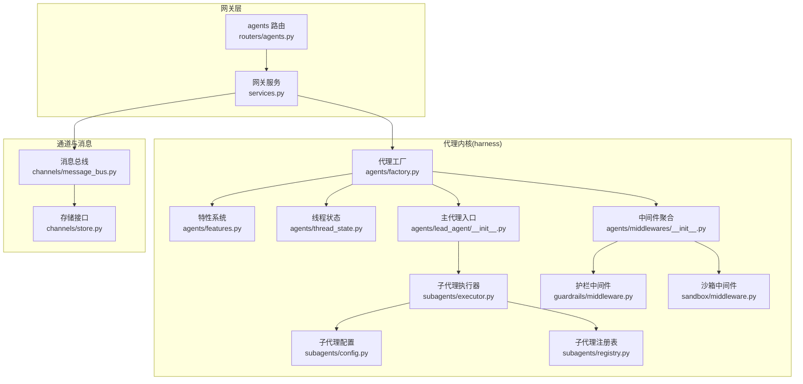
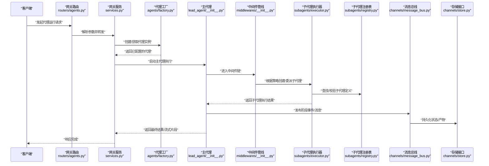
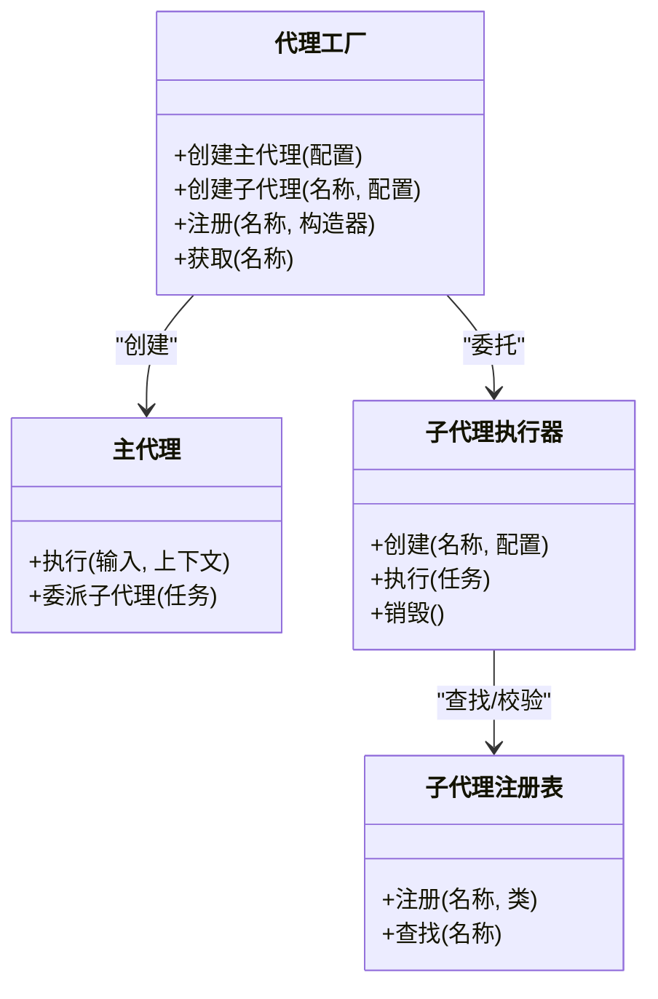
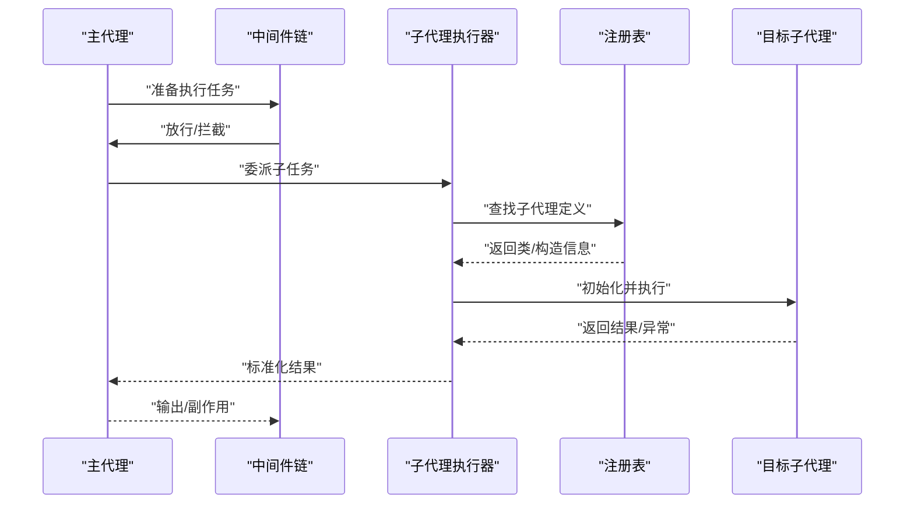
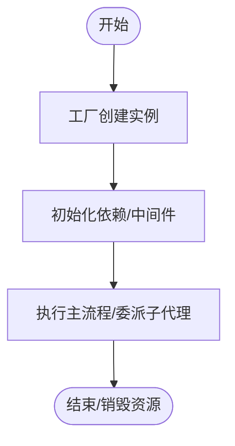
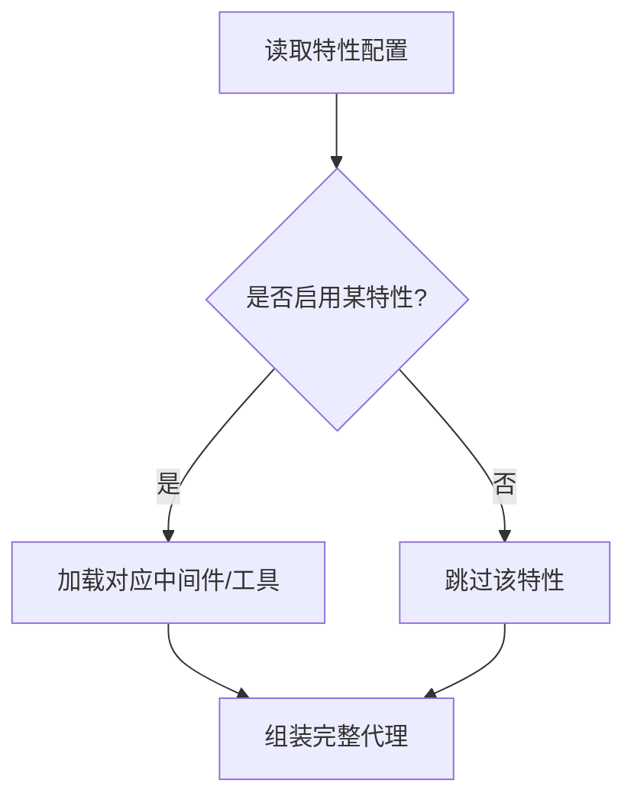
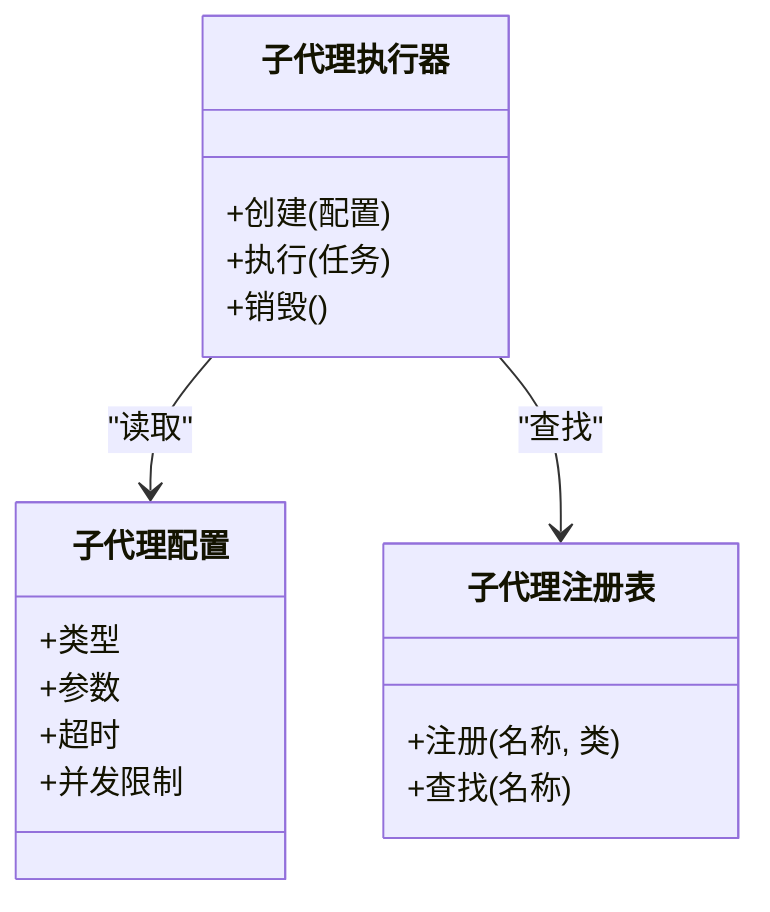
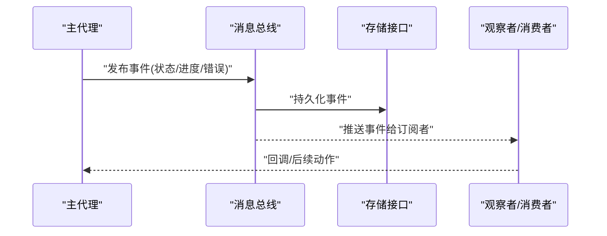
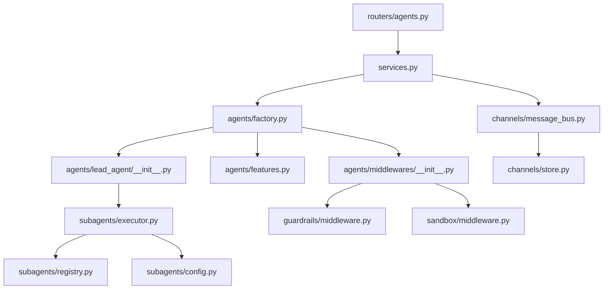

# 代理系统

<cite>
**本文引用的文件**   
- [backend/packages/harness/deerflow/agents/factory.py](file://backend/packages/harness/deerflow/agents/factory.py)
- [backend/packages/harness/deerflow/agents/features.py](file://backend/packages/harness/deerflow/agents/features.py)
- [backend/packages/harness/deerflow/agents/thread_state.py](file://backend/packages/harness/deerflow/agents/thread_state.py)
- [backend/packages/harness/deerflow/agents/lead_agent/__init__.py](file://backend/packages/harness/deerflow/agents/lead_agent/__init__.py)
- [backend/packages/harness/deerflow/agents/middlewares/__init__.py](file://backend/packages/harness/deerflow/agents/middlewares/__init__.py)
- [backend/packages/harness/deerflow/subagents/config.py](file://backend/packages/harness/deerflow/subagents/config.py)
- [backend/packages/harness/deerflow/subagents/executor.py](file://backend/packages/harness/deerflow/subagents/executor.py)
- [backend/packages/harness/deerflow/subagents/registry.py](file://backend/packages/harness/deerflow/subagents/registry.py)
- [backend/packages/harness/deerflow/guardrails/middleware.py](file://backend/packages/harness/deerflow/guardrails/middleware.py)
- [backend/packages/harness/deerflow/sandbox/middleware.py](file://backend/packages/harness/deerflow/sandbox/middleware.py)
- [backend/app/gateway/routers/agents.py](file://backend/app/gateway/routers/agents.py)
- [backend/app/gateway/services.py](file://backend/app/gateway/services.py)
- [backend/app/channels/message_bus.py](file://backend/app/channels/message_bus.py)
- [backend/app/channels/store.py](file://backend/app/channels/store.py)
- [backend/tests/test_create_deerflow_agent.py](file://backend/tests/test_create_deerflow_agent.py)
- [backend/tests/test_custom_agent.py](file://backend/tests/test_custom_agent.py)
- [backend/tests/test_subagent_executor.py](file://backend/tests/test_subagent_executor.py)
- [backend/tests/test_lead_agent_prompt.py](file://backend/tests/test_lead_agent_prompt.py)
</cite>

## 目录
1. [简介](#简介)
2. [项目结构](#项目结构)
3. [核心组件](#核心组件)
4. [架构总览](#架构总览)
5. [详细组件分析](#详细组件分析)
6. [依赖分析](#依赖分析)
7. [性能考虑](#性能考虑)
8. [故障排查指南](#故障排查指南)
9. [结论](#结论)
10. [附录](#附录)

## 简介
本文件面向 DeerFlow 代理系统的开发者与使用者，系统性阐述代理的核心概念、设计理念与实现细节。重点覆盖：
- 主代理(Lead Agent)与子代理(Sub Agent)的职责分工与协作机制
- 代理生命周期管理（创建、初始化、执行、销毁）
- 工厂模式在代理实例化、配置与注册中的应用
- 特性(Features)系统的启用与禁用方式
- 代理间通信机制（消息传递、状态同步、错误处理）
- 自定义代理的创建与行为配置示例（以路径引用形式提供）

## 项目结构
DeerFlow 后端采用分层与模块化组织，代理相关能力集中在 harness 包中，并通过网关路由暴露 API；通道子系统负责跨进程/跨服务消息与持久化。

图表来源
- [backend/app/gateway/routers/agents.py](file://backend/app/gateway/routers/agents.py)
- [backend/app/gateway/services.py](file://backend/app/gateway/services.py)
- [backend/packages/harness/deerflow/agents/factory.py](file://backend/packages/harness/deerflow/agents/factory.py)
- [backend/packages/harness/deerflow/agents/features.py](file://backend/packages/harness/deerflow/agents/features.py)
- [backend/packages/harness/deerflow/agents/thread_state.py](file://backend/packages/harness/deerflow/agents/thread_state.py)
- [backend/packages/harness/deerflow/agents/lead_agent/__init__.py](file://backend/packages/harness/deerflow/agents/lead_agent/__init__.py)
- [backend/packages/harness/deerflow/agents/middlewares/__init__.py](file://backend/packages/harness/deerflow/agents/middlewares/__init__.py)
- [backend/packages/harness/deerflow/subagents/config.py](file://backend/packages/harness/deerflow/subagents/config.py)
- [backend/packages/harness/deerflow/subagents/executor.py](file://backend/packages/harness/deerflow/subagents/executor.py)
- [backend/packages/harness/deerflow/subagents/registry.py](file://backend/packages/harness/deerflow/subagents/registry.py)
- [backend/packages/harness/deerflow/guardrails/middleware.py](file://backend/packages/harness/deerflow/guardrails/middleware.py)
- [backend/packages/harness/deerflow/sandbox/middleware.py](file://backend/packages/harness/deerflow/sandbox/middleware.py)
- [backend/app/channels/message_bus.py](file://backend/app/channels/message_bus.py)
- [backend/app/channels/store.py](file://backend/app/channels/store.py)

章节来源
- [backend/app/gateway/routers/agents.py](file://backend/app/gateway/routers/agents.py)
- [backend/app/gateway/services.py](file://backend/app/gateway/services.py)
- [backend/packages/harness/deerflow/agents/factory.py](file://backend/packages/harness/deerflow/agents/factory.py)
- [backend/packages/harness/deerflow/agents/features.py](file://backend/packages/harness/deerflow/agents/features.py)
- [backend/packages/harness/deerflow/agents/thread_state.py](file://backend/packages/harness/deerflow/agents/thread_state.py)
- [backend/packages/harness/deerflow/agents/lead_agent/__init__.py](file://backend/packages/harness/deerflow/agents/lead_agent/__init__.py)
- [backend/packages/harness/deerflow/agents/middlewares/__init__.py](file://backend/packages/harness/deerflow/agents/middlewares/__init__.py)
- [backend/packages/harness/deerflow/subagents/config.py](file://backend/packages/harness/deerflow/subagents/config.py)
- [backend/packages/harness/deerflow/subagents/executor.py](file://backend/packages/harness/deerflow/subagents/executor.py)
- [backend/packages/harness/deerflow/subagents/registry.py](file://backend/packages/harness/deerflow/subagents/registry.py)
- [backend/packages/harness/deerflow/guardrails/middleware.py](file://backend/packages/harness/deerflow/guardrails/middleware.py)
- [backend/packages/harness/deerflow/sandbox/middleware.py](file://backend/packages/harness/deerflow/sandbox/middleware.py)
- [backend/app/channels/message_bus.py](file://backend/app/channels/message_bus.py)
- [backend/app/channels/store.py](file://backend/app/channels/store.py)

## 核心组件
- 代理工厂(Facory)：集中负责代理实例的创建、配置注入与注册，屏蔽具体类型差异，统一对外暴露构建接口。
- 主代理(Lead Agent)：作为任务编排中心，负责任务拆解、工具调用、子代理调度与结果汇聚。
- 子代理(Sub Agent)：按领域或职责划分的专用执行体，由主代理按需创建与委派。
- 特性(Features)系统：通过声明式开关控制可选能力（如记忆、搜索、沙箱等），支持运行时组合。
- 中间件管线：将护栏、沙箱、限流、日志等横切关注点以中间件形式串联，统一拦截与增强。
- 线程状态(Thread State)：维护会话级上下文、消息历史、计划与产物等共享数据。
- 子代理执行器与注册表：负责子代理的生命周期、参数校验、并发控制与发现。
- 网关与服务：对外暴露 REST/流式接口，协调代理运行与通道消息。

章节来源
- [backend/packages/harness/deerflow/agents/factory.py](file://backend/packages/harness/deerflow/agents/factory.py)
- [backend/packages/harness/deerflow/agents/lead_agent/__init__.py](file://backend/packages/harness/deerflow/agents/lead_agent/__init__.py)
- [backend/packages/harness/deerflow/agents/features.py](file://backend/packages/harness/deerflow/agents/features.py)
- [backend/packages/harness/deerflow/agents/thread_state.py](file://backend/packages/harness/deerflow/agents/thread_state.py)
- [backend/packages/harness/deerflow/agents/middlewares/__init__.py](file://backend/packages/harness/deerflow/agents/middlewares/__init__.py)
- [backend/packages/harness/deerflow/subagents/executor.py](file://backend/packages/harness/deerflow/subagents/executor.py)
- [backend/packages/harness/deerflow/subagents/registry.py](file://backend/packages/harness/deerflow/subagents/registry.py)
- [backend/packages/harness/deerflow/subagents/config.py](file://backend/packages/harness/deerflow/subagents/config.py)
- [backend/app/gateway/routers/agents.py](file://backend/app/gateway/routers/agents.py)
- [backend/app/gateway/services.py](file://backend/app/gateway/services.py)

## 架构总览
下图展示从请求进入网关到代理执行、子代理协作、消息与状态流转的整体流程。

图表来源
- [backend/app/gateway/routers/agents.py](file://backend/app/gateway/routers/agents.py)
- [backend/app/gateway/services.py](file://backend/app/gateway/services.py)
- [backend/packages/harness/deerflow/agents/factory.py](file://backend/packages/harness/deerflow/agents/factory.py)
- [backend/packages/harness/deerflow/agents/lead_agent/__init__.py](file://backend/packages/harness/deerflow/agents/lead_agent/__init__.py)
- [backend/packages/harness/deerflow/agents/middlewares/__init__.py](file://backend/packages/harness/deerflow/agents/middlewares/__init__.py)
- [backend/packages/harness/deerflow/subagents/executor.py](file://backend/packages/harness/deerflow/subagents/executor.py)
- [backend/packages/harness/deerflow/subagents/registry.py](file://backend/packages/harness/deerflow/subagents/registry.py)
- [backend/app/channels/message_bus.py](file://backend/app/channels/message_bus.py)
- [backend/app/channels/store.py](file://backend/app/channels/store.py)

## 详细组件分析

### 代理工厂(Facory)模式
- 职责
  - 接收高层配置，组装模型、工具、中间件、特性开关与线程状态。
  - 统一创建主代理与子代理实例，并提供注册/发现能力。
  - 对上层隐藏具体实现差异，保证一致的使用体验。
- 关键流程
  - 解析配置 -> 加载特性 -> 构建中间件链 -> 实例化主代理 -> 注册可复用资源。
- 扩展点
  - 新增代理类型时，仅需在工厂中注册构造逻辑与默认配置。

图表来源
- [backend/packages/harness/deerflow/agents/factory.py](file://backend/packages/harness/deerflow/agents/factory.py)
- [backend/packages/harness/deerflow/agents/lead_agent/__init__.py](file://backend/packages/harness/deerflow/agents/lead_agent/__init__.py)
- [backend/packages/harness/deerflow/subagents/executor.py](file://backend/packages/harness/deerflow/subagents/executor.py)
- [backend/packages/harness/deerflow/subagents/registry.py](file://backend/packages/harness/deerflow/subagents/registry.py)

章节来源
- [backend/packages/harness/deerflow/agents/factory.py](file://backend/packages/harness/deerflow/agents/factory.py)
- [backend/packages/harness/deerflow/subagents/executor.py](file://backend/packages/harness/deerflow/subagents/executor.py)
- [backend/packages/harness/deerflow/subagents/registry.py](file://backend/packages/harness/deerflow/subagents/registry.py)

### 主代理(Lead Agent)与子代理(Sub Agent)
- 主代理
  - 负责整体编排：理解意图、生成计划、选择工具与子代理、合并结果。
  - 与中间件交互，确保安全、审计、限流等横切能力生效。
- 子代理
  - 专注特定领域（如搜索、代码执行、绘图等），具备独立配置与生命周期。
  - 由执行器统一管理，支持并发、超时与重试策略。

图表来源
- [backend/packages/harness/deerflow/agents/lead_agent/__init__.py](file://backend/packages/harness/deerflow/agents/lead_agent/__init__.py)
- [backend/packages/harness/deerflow/agents/middlewares/__init__.py](file://backend/packages/harness/deerflow/agents/middlewares/__init__.py)
- [backend/packages/harness/deerflow/subagents/executor.py](file://backend/packages/harness/deerflow/subagents/executor.py)
- [backend/packages/harness/deerflow/subagents/registry.py](file://backend/packages/harness/deerflow/subagents/registry.py)

章节来源
- [backend/packages/harness/deerflow/agents/lead_agent/__init__.py](file://backend/packages/harness/deerflow/agents/lead_agent/__init__.py)
- [backend/packages/harness/deerflow/subagents/executor.py](file://backend/packages/harness/deerflow/subagents/executor.py)
- [backend/packages/harness/deerflow/subagents/registry.py](file://backend/packages/harness/deerflow/subagents/registry.py)

### 代理生命周期管理
- 创建
  - 通过工厂接收配置，完成依赖注入与特性装配。
- 初始化
  - 建立中间件链、连接外部服务、预热缓存。
- 执行
  - 主代理驱动工作流，必要时委派子代理；中间件贯穿全链路。
- 销毁
  - 释放资源、关闭连接、清理临时状态。

章节来源
- [backend/packages/harness/deerflow/agents/factory.py](file://backend/packages/harness/deerflow/agents/factory.py)
- [backend/packages/harness/deerflow/agents/lead_agent/__init__.py](file://backend/packages/harness/deerflow/agents/lead_agent/__init__.py)

### 特性(Features)系统
- 设计要点
  - 以声明式开关控制功能模块（如记忆、搜索、沙箱、标题生成等）。
  - 在工厂装配阶段读取特性配置，动态启用/禁用对应中间件与工具。
- 使用方式
  - 在配置中指定特性集合；工厂据此构建最小可用代理。
  - 运行时可通过配置热更新（若平台支持）调整特性。

章节来源
- [backend/packages/harness/deerflow/agents/features.py](file://backend/packages/harness/deerflow/agents/features.py)
- [backend/packages/harness/deerflow/agents/factory.py](file://backend/packages/harness/deerflow/agents/factory.py)

### 中间件与横切关注点
- 护栏(Guardrails)：内容安全、越权访问防护、敏感信息过滤。
- 沙箱(Sandbox)：受限环境执行、文件系统隔离、网络访问控制。
- 其他常见中间件：限流、重试、日志、追踪、上传处理等。

图表来源
- [backend/packages/harness/deerflow/guardrails/middleware.py](file://backend/packages/harness/deerflow/guardrails/middleware.py)
- [backend/packages/harness/deerflow/sandbox/middleware.py](file://backend/packages/harness/deerflow/sandbox/middleware.py)
- [backend/packages/harness/deerflow/agents/middlewares/__init__.py](file://backend/packages/harness/deerflow/agents/middlewares/__init__.py)

章节来源
- [backend/packages/harness/deerflow/guardrails/middleware.py](file://backend/packages/harness/deerflow/guardrails/middleware.py)
- [backend/packages/harness/deerflow/sandbox/middleware.py](file://backend/packages/harness/deerflow/sandbox/middleware.py)
- [backend/packages/harness/deerflow/agents/middlewares/__init__.py](file://backend/packages/harness/deerflow/agents/middlewares/__init__.py)

### 线程状态(Thread State)
- 作用
  - 维护会话级上下文：消息历史、计划、产物、元数据等。
  - 为中间件与子代理提供一致的读写视图。
- 关键点
  - 线程安全读写、增量更新、快照与回滚（视实现而定）。

章节来源
- [backend/packages/harness/deerflow/agents/thread_state.py](file://backend/packages/harness/deerflow/agents/thread_state.py)

### 子代理配置与执行
- 配置
  - 通过配置对象描述子代理类型、参数、超时、并发限制等。
- 执行器
  - 负责实例化、参数校验、执行与结果归一化。
- 注册表
  - 集中管理子代理类型与构造器映射，支持动态发现。

图表来源
- [backend/packages/harness/deerflow/subagents/config.py](file://backend/packages/harness/deerflow/subagents/config.py)
- [backend/packages/harness/deerflow/subagents/executor.py](file://backend/packages/harness/deerflow/subagents/executor.py)
- [backend/packages/harness/deerflow/subagents/registry.py](file://backend/packages/harness/deerflow/subagents/registry.py)

章节来源
- [backend/packages/harness/deerflow/subagents/config.py](file://backend/packages/harness/deerflow/subagents/config.py)
- [backend/packages/harness/deerflow/subagents/executor.py](file://backend/packages/harness/deerflow/subagents/executor.py)
- [backend/packages/harness/deerflow/subagents/registry.py](file://backend/packages/harness/deerflow/subagents/registry.py)

### 代理间通信机制
- 消息总线
  - 用于代理内部事件与跨组件消息传递，支持异步发布/订阅。
- 存储接口
  - 持久化消息、状态与产物，保障可观测性与恢复能力。
- 错误处理
  - 中间件捕获异常、记录上下文、降级与重试策略。

图表来源
- [backend/app/channels/message_bus.py](file://backend/app/channels/message_bus.py)
- [backend/app/channels/store.py](file://backend/app/channels/store.py)
- [backend/packages/harness/deerflow/agents/lead_agent/__init__.py](file://backend/packages/harness/deerflow/agents/lead_agent/__init__.py)

章节来源
- [backend/app/channels/message_bus.py](file://backend/app/channels/message_bus.py)
- [backend/app/channels/store.py](file://backend/app/channels/store.py)

### 网关与服务集成
- 路由
  - 暴露代理创建、运行、查询等接口。
- 服务
  - 协调工厂、执行器与通道，封装事务与错误码。

章节来源
- [backend/app/gateway/routers/agents.py](file://backend/app/gateway/routers/agents.py)
- [backend/app/gateway/services.py](file://backend/app/gateway/services.py)

### 自定义代理与行为配置示例
以下示例以“路径引用”的形式给出，便于快速定位源码中的实际用法：
- 创建 DeerFlow 代理
  - [测试用例：创建 DeerFlow 代理](file://backend/tests/test_create_deerflow_agent.py)
- 自定义代理实现
  - [测试用例：自定义代理](file://backend/tests/test_custom_agent.py)
- 子代理执行器使用
  - [测试用例：子代理执行器](file://backend/tests/test_subagent_executor.py)
- 主代理提示词与行为
  - [测试用例：主代理提示词](file://backend/tests/test_lead_agent_prompt.py)

章节来源
- [backend/tests/test_create_deerflow_agent.py](file://backend/tests/test_create_deerflow_agent.py)
- [backend/tests/test_custom_agent.py](file://backend/tests/test_custom_agent.py)
- [backend/tests/test_subagent_executor.py](file://backend/tests/test_subagent_executor.py)
- [backend/tests/test_lead_agent_prompt.py](file://backend/tests/test_lead_agent_prompt.py)

## 依赖分析
- 耦合关系
  - 网关层依赖工厂与服务；工厂依赖主代理、特性系统与中间件；主代理依赖子代理执行器与注册表；执行器依赖配置与注册表。
- 外部集成
  - 消息总线与存储接口提供跨组件通信与持久化能力。
- 潜在循环依赖
  - 通过工厂与注册表解耦，避免直接相互导入导致的环。

图表来源
- [backend/app/gateway/routers/agents.py](file://backend/app/gateway/routers/agents.py)
- [backend/app/gateway/services.py](file://backend/app/gateway/services.py)
- [backend/packages/harness/deerflow/agents/factory.py](file://backend/packages/harness/deerflow/agents/factory.py)
- [backend/packages/harness/deerflow/agents/lead_agent/__init__.py](file://backend/packages/harness/deerflow/agents/lead_agent/__init__.py)
- [backend/packages/harness/deerflow/agents/features.py](file://backend/packages/harness/deerflow/agents/features.py)
- [backend/packages/harness/deerflow/agents/middlewares/__init__.py](file://backend/packages/harness/deerflow/agents/middlewares/__init__.py)
- [backend/packages/harness/deerflow/subagents/executor.py](file://backend/packages/harness/deerflow/subagents/executor.py)
- [backend/packages/harness/deerflow/subagents/registry.py](file://backend/packages/harness/deerflow/subagents/registry.py)
- [backend/packages/harness/deerflow/subagents/config.py](file://backend/packages/harness/deerflow/subagents/config.py)
- [backend/packages/harness/deerflow/guardrails/middleware.py](file://backend/packages/harness/deerflow/guardrails/middleware.py)
- [backend/packages/harness/deerflow/sandbox/middleware.py](file://backend/packages/harness/deerflow/sandbox/middleware.py)
- [backend/app/channels/message_bus.py](file://backend/app/channels/message_bus.py)
- [backend/app/channels/store.py](file://backend/app/channels/store.py)

## 性能考虑
- 并发与限流
  - 子代理执行器应支持并发上限与队列控制，避免资源耗尽。
- 中间件开销
  - 合理裁剪中间件数量，避免重复计算与过度序列化。
- 状态持久化
  - 批量写入与增量更新可减少 I/O 压力。
- 缓存与预热
  - 对频繁使用的工具与模型进行缓存，缩短冷启动时间。
- 超时与重试
  - 设置合理的超时与退避策略，提升鲁棒性。

## 故障排查指南
- 常见问题
  - 代理创建失败：检查工厂配置与特性开关是否正确。
  - 子代理未找到：确认注册表中是否存在对应名称与类型。
  - 中间件拦截：查看护栏与沙箱规则是否过于严格。
  - 消息丢失：检查消息总线与存储接口的连通性与权限。
- 定位手段
  - 开启追踪与日志，结合线程状态快照定位问题。
  - 使用测试用例复现路径，逐步缩小范围。

章节来源
- [backend/packages/harness/deerflow/agents/factory.py](file://backend/packages/harness/deerflow/agents/factory.py)
- [backend/packages/harness/deerflow/subagents/registry.py](file://backend/packages/harness/deerflow/subagents/registry.py)
- [backend/packages/harness/deerflow/guardrails/middleware.py](file://backend/packages/harness/deerflow/guardrails/middleware.py)
- [backend/packages/harness/deerflow/sandbox/middleware.py](file://backend/packages/harness/deerflow/sandbox/middleware.py)
- [backend/app/channels/message_bus.py](file://backend/app/channels/message_bus.py)
- [backend/app/channels/store.py](file://backend/app/channels/store.py)

## 结论
DeerFlow 代理系统通过工厂模式、特性系统与中间件管线实现了高内聚、低耦合的可插拔架构。主代理与子代理职责清晰、协作顺畅，配合消息总线与线程状态，提供了稳定可靠的执行环境与可扩展能力。建议在实际项目中优先通过配置与特性开关定制行为，并在需要时基于现有接口扩展自定义代理与中间件。

## 附录
- 术语
  - 主代理：任务编排与决策中心
  - 子代理：领域专用执行单元
  - 特性：可插拔的功能开关
  - 中间件：横切关注点的处理单元
  - 线程状态：会话级上下文与数据
  - 消息总线：异步事件与消息通道
  - 存储接口：持久化与检索抽象