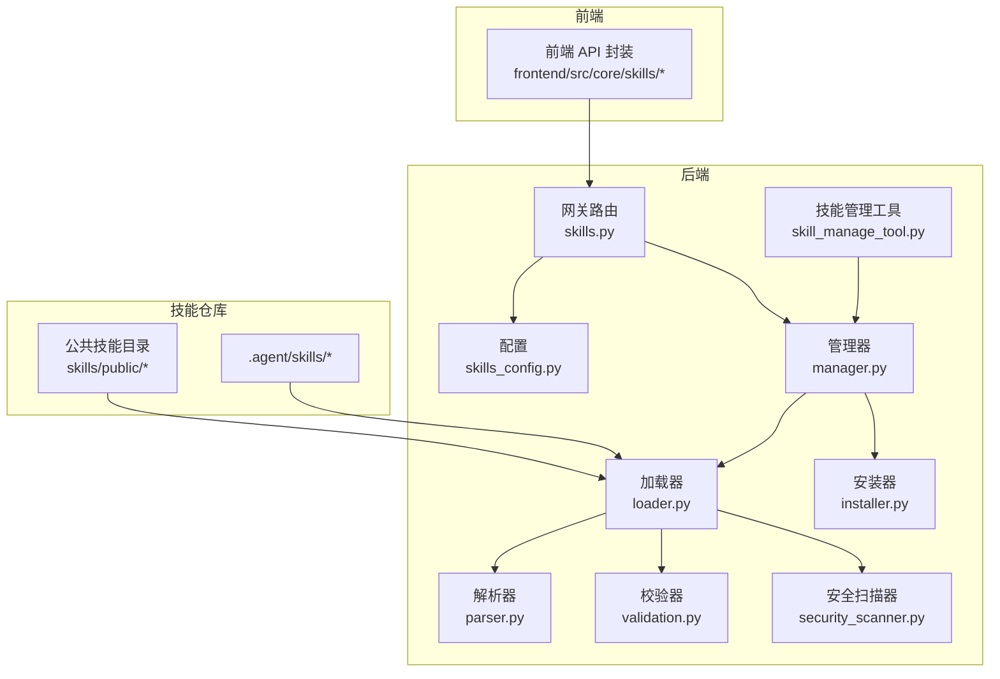
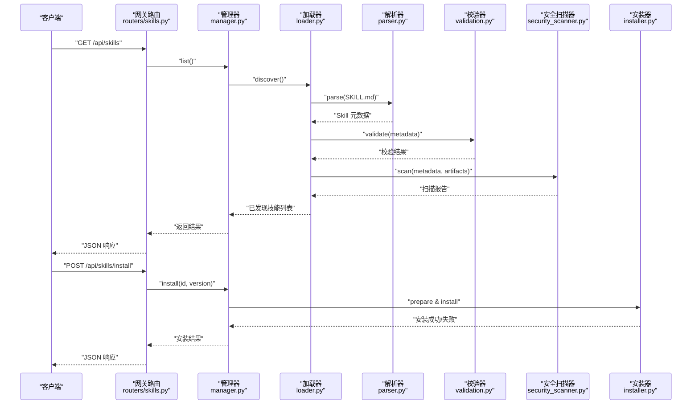
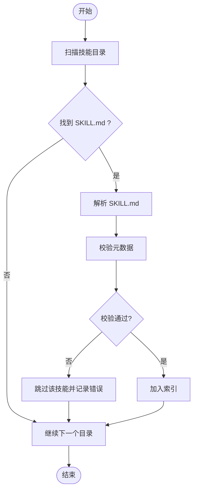
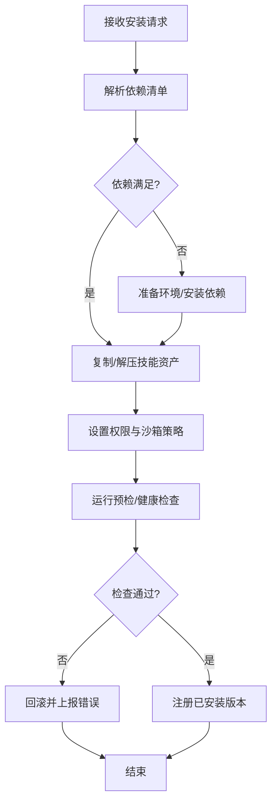
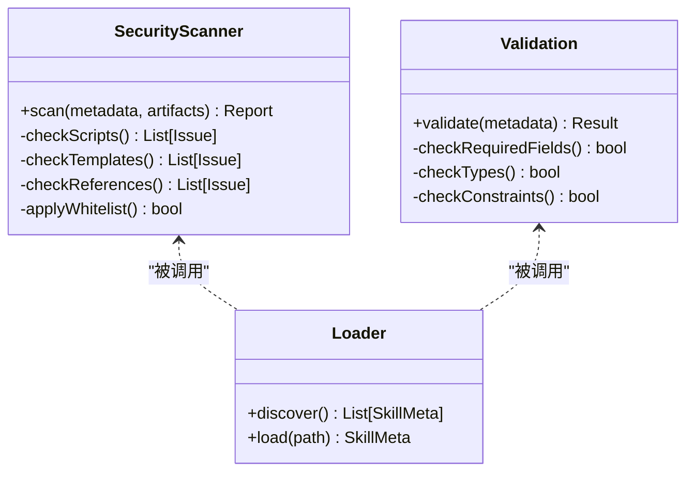
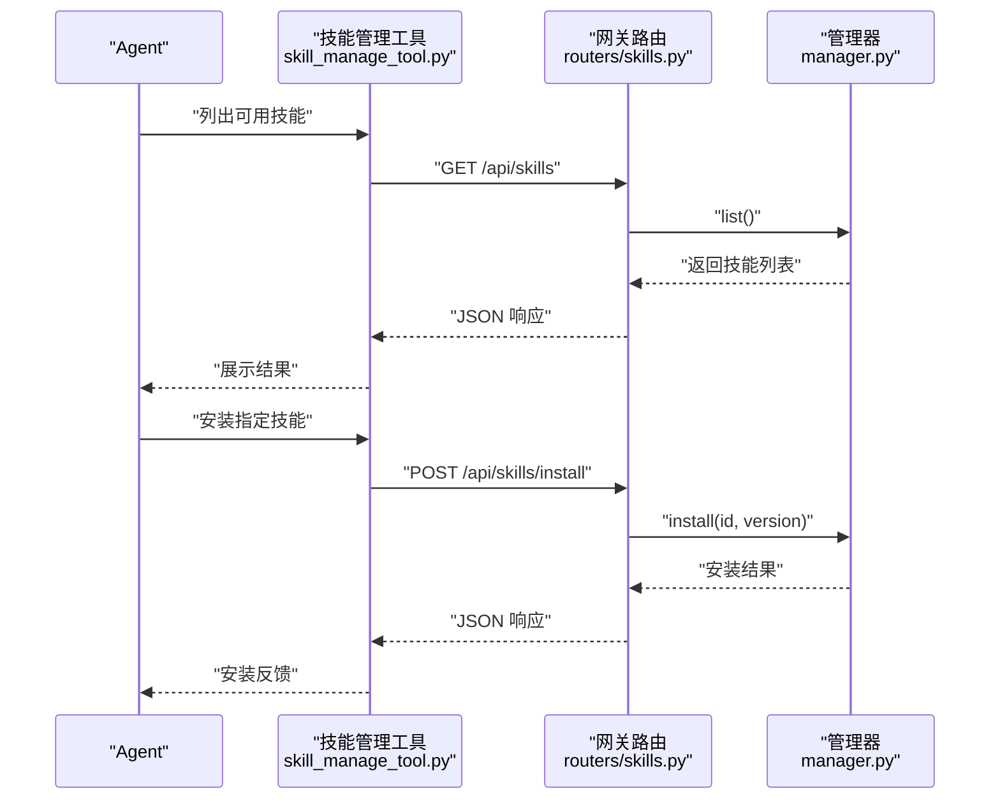
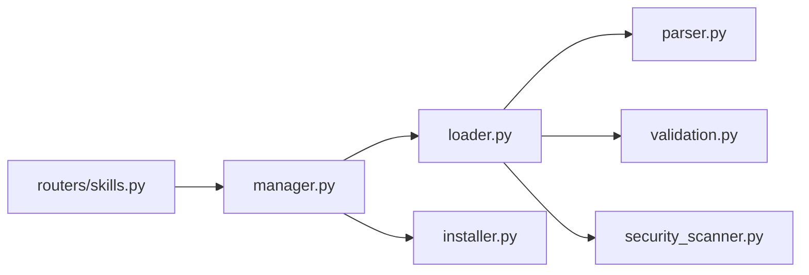

# 技能系统

<cite>
**本文引用的文件**   
- [backend/app/gateway/routers/skills.py](file://backend/app/gateway/routers/skills.py)
- [backend/packages/harness/deerflow/config/skills_config.py](file://backend/packages/harness/deerflow/config/skills_config.py)
- [backend/packages/harness/deerflow/skills/__init__.py](file://backend/packages/harness/deerflow/skills/__init__.py)
- [backend/packages/harness/deerflow/skills/loader.py](file://backend/packages/harness/deerflow/skills/loader.py)
- [backend/packages/harness/deerflow/skills/manager.py](file://backend/packages/harness/deerflow/skills/manager.py)
- [backend/packages/harness/deerflow/skills/parser.py](file://backend/packages/harness/deerflow/skills/parser.py)
- [backend/packages/harness/deerflow/skills/validation.py](file://backend/packages/harness/deerflow/skills/validation.py)
- [backend/packages/harness/deerflow/skills/security_scanner.py](file://backend/packages/harness/deerflow/skills/security_scanner.py)
- [backend/packages/harness/deerflow/skills/installer.py](file://backend/packages/harness/deerflow/skills/installer.py)
- [backend/packages/harness/deerflow/tools/skill_manage_tool.py](file://backend/packages/harness/deerflow/tools/skill_manage_tool.py)
- [skills/public/bootstrap/SKILL.md](file://skills/public/bootstrap/SKILL.md)
- [skills/public/chart-visualization/SKILL.md](file://skills/public/chart-visualization/SKILL.md)
- [skills/public/data-analysis/SKILL.md](file://skills/public/data-analysis/SKILL.md)
- [skills/public/image-generation/SKILL.md](file://skills/public/image-generation/SKILL.md)
- [skills/public/podcast-generation/SKILL.md](file://skills/public/podcast-generation/SKILL.md)
- [skills/public/systematic-literature-review/SKILL.md](file://skills/public/systematic-literature-review/SKILL.md)
- [skills/public/academic-paper-review/SKILL.md](file://skills/public/academic-paper-review/SKILL.md)
- [skills/public/code-documentation/SKILL.md](file://skills/public/code-documentation/SKILL.md)
- [skills/public/consulting-analysis/SKILL.md](file://skills/public/consulting-analysis/SKILL.md)
- [skills/public/deep-research/SKILL.md](file://skills/public/deep-research/SKILL.md)
- [skills/public/find-skills/SKILL.md](file://skills/public/find-skills/SKILL.md)
- [skills/public/frontend-design/SKILL.md](file://skills/public/frontend-design/SKILL.md)
- [skills/public/github-deep-research/SKILL.md](file://skills/public/github-deep-research/SKILL.md)
- [skills/public/newsletter-generation/SKILL.md](file://skills/public/newsletter-generation/SKILL.md)
- [skills/public/novel-generation/SKILL.md](file://skills/public/novel-generation/SKILL.md)
- [skills/public/ppt-generation/SKILL.md](file://skills/public/ppt-generation/SKILL.md)
- [skills/public/skill-creator/SKILL.md](file://skills/public/skill-creator/SKILL.md)
- [skills/public/surprise-me/SKILL.md](file://skills/public/surprise-me/SKILL.md)
- [skills/public/vercel-deploy-claimable/SKILL.md](file://skills/public/vercel-deploy-claimable/SKILL.md)
- [skills/public/video-generation/SKILL.md](file://skills/public/video-generation/SKILL.md)
- [skills/public/web-design-guidelines/SKILL.md](file://skills/public/web-design-guidelines/SKILL.md)
- [.agent/skills/smoke-test/SKILL.md](file://.agent/skills/smoke-test/SKILL.md)
- [backend/tests/test_skills_loader.py](file://backend/tests/test_skills_loader.py)
- [backend/tests/test_skills_parser.py](file://backend/tests/test_skills_parser.py)
- [backend/tests/test_skills_validation.py](file://backend/tests/test_skills_validation.py)
- [backend/tests/test_security_scanner.py](file://backend/tests/test_security_scanner.py)
- [backend/tests/test_skills_installer.py](file://backend/tests/test_skills_installer.py)
- [backend/tests/test_skill_manage_tool.py](file://backend/tests/test_skill_manage_tool.py)
</cite>

## 目录
1. [简介](#简介)
2. [项目结构](#项目结构)
3. [核心组件](#核心组件)
4. [架构总览](#架构总览)
5. [详细组件分析](#详细组件分析)
6. [依赖关系分析](#依赖关系分析)
7. [性能考虑](#性能考虑)
8. [故障排查指南](#故障排查指南)
9. [结论](#结论)
10. [附录](#附录)

## 简介
本文件面向 DeerFlow 技能系统，系统性阐述“技能(Skill)”的概念、设计哲学与实现机制。与传统工具相比，技能以声明式规范驱动，具备更强的可组合性、可发现性与可治理性。文档覆盖：
- 技能与传统工具的区别与优势
- SKILL.md 定义格式与必需字段
- 技能目录(Catalog)的发现、注册与版本控制
- 安装器(Installer)的依赖解析、环境准备与权限设置
- 安全扫描与验证机制
- 开发指南（编写、测试、发布）
- 完整示例与最佳实践

## 项目结构
DeerFlow 的技能系统由后端网关路由、配置、加载器、管理器、解析器、校验器、安全扫描器、安装器以及前端工具等模块组成；同时提供大量公共技能示例供参考与复用。

图示来源
- [backend/app/gateway/routers/skills.py](file://backend/app/gateway/routers/skills.py)
- [backend/packages/harness/deerflow/config/skills_config.py](file://backend/packages/harness/deerflow/config/skills_config.py)
- [backend/packages/harness/deerflow/skills/loader.py](file://backend/packages/harness/deerflow/skills/loader.py)
- [backend/packages/harness/deerflow/skills/manager.py](file://backend/packages/harness/deerflow/skills/manager.py)
- [backend/packages/harness/deerflow/skills/parser.py](file://backend/packages/harness/deerflow/skills/parser.py)
- [backend/packages/harness/deerflow/skills/validation.py](file://backend/packages/harness/deerflow/skills/validation.py)
- [backend/packages/harness/deerflow/skills/security_scanner.py](file://backend/packages/harness/deerflow/skills/security_scanner.py)
- [backend/packages/harness/deerflow/skills/installer.py](file://backend/packages/harness/deerflow/skills/installer.py)
- [backend/packages/harness/deerflow/tools/skill_manage_tool.py](file://backend/packages/harness/deerflow/tools/skill_manage_tool.py)

章节来源
- [backend/app/gateway/routers/skills.py](file://backend/app/gateway/routers/skills.py)
- [backend/packages/harness/deerflow/config/skills_config.py](file://backend/packages/harness/deerflow/config/skills_config.py)
- [backend/packages/harness/deerflow/skills/loader.py](file://backend/packages/harness/deerflow/skills/loader.py)
- [backend/packages/harness/deerflow/skills/manager.py](file://backend/packages/harness/deerflow/skills/manager.py)
- [backend/packages/harness/deerflow/skills/parser.py](file://backend/packages/harness/deerflow/skills/parser.py)
- [backend/packages/harness/deerflow/skills/validation.py](file://backend/packages/harness/deerflow/skills/validation.py)
- [backend/packages/harness/deerflow/skills/security_scanner.py](file://backend/packages/harness/deerflow/skills/security_scanner.py)
- [backend/packages/harness/deerflow/skills/installer.py](file://backend/packages/harness/deerflow/skills/installer.py)
- [backend/packages/harness/deerflow/tools/skill_manage_tool.py](file://backend/packages/harness/deerflow/tools/skill_manage_tool.py)

## 核心组件
- 配置(skills_config.py)：集中管理技能目录路径、启用开关、缓存策略、安全策略等。
- 加载器(loader.py)：负责从磁盘或归档中扫描、解析并构建技能元数据索引。
- 管理器(manager.py)：对外暴露技能的查询、安装、卸载、更新、状态查看等能力。
- 解析器(parser.py)：解析 SKILL.md 中的结构化头部与正文，生成统一模型。
- 校验器(validation.py)：对解析结果进行必填字段、类型与约束校验。
- 安全扫描器(security_scanner.py)：对脚本、模板、引用资源进行风险检测与白名单校验。
- 安装器(installer.py)：处理依赖解析、环境准备、权限设置与回滚。
- 网关路由(routers/skills.py)：将 HTTP 请求映射到管理器方法，提供 RESTful 接口。
- 技能管理工具(skill_manage_tool.py)：在 Agent 执行上下文中提供技能管理能力。

章节来源
- [backend/packages/harness/deerflow/config/skills_config.py](file://backend/packages/harness/deerflow/config/skills_config.py)
- [backend/packages/harness/deerflow/skills/loader.py](file://backend/packages/harness/deerflow/skills/loader.py)
- [backend/packages/harness/deerflow/skills/manager.py](file://backend/packages/harness/deerflow/skills/manager.py)
- [backend/packages/harness/deerflow/skills/parser.py](file://backend/packages/harness/deerflow/skills/parser.py)
- [backend/packages/harness/deerflow/skills/validation.py](file://backend/packages/harness/deerflow/skills/validation.py)
- [backend/packages/harness/deerflow/skills/security_scanner.py](file://backend/packages/harness/deerflow/skills/security_scanner.py)
- [backend/packages/harness/deerflow/skills/installer.py](file://backend/packages/harness/deerflow/skills/installer.py)
- [backend/app/gateway/routers/skills.py](file://backend/app/gateway/routers/skills.py)
- [backend/packages/harness/deerflow/tools/skill_manage_tool.py](file://backend/packages/harness/deerflow/tools/skill_manage_tool.py)

## 架构总览
技能系统的整体调用链如下：客户端通过网关路由访问技能服务，管理器协调加载器完成发现与解析，随后经校验与安全扫描后进入安装器进行部署，最终通过工具层暴露给 Agent 使用。

图示来源
- [backend/app/gateway/routers/skills.py](file://backend/app/gateway/routers/skills.py)
- [backend/packages/harness/deerflow/skills/manager.py](file://backend/packages/harness/deerflow/skills/manager.py)
- [backend/packages/harness/deerflow/skills/loader.py](file://backend/packages/harness/deerflow/skills/loader.py)
- [backend/packages/harness/deerflow/skills/parser.py](file://backend/packages/harness/deerflow/skills/parser.py)
- [backend/packages/harness/deerflow/skills/validation.py](file://backend/packages/harness/deerflow/skills/validation.py)
- [backend/packages/harness/deerflow/skills/security_scanner.py](file://backend/packages/harness/deerflow/skills/security_scanner.py)
- [backend/packages/harness/deerflow/skills/installer.py](file://backend/packages/harness/deerflow/skills/installer.py)

## 详细组件分析

### 概念与设计哲学
- 技能 vs 传统工具
  - 传统工具多为过程化函数集合，强调“怎么做”；技能强调“做什么”，通过声明式描述与上下文装配，使大模型能更稳定地编排复杂任务。
  - 技能包含元数据、依赖、脚本、模板、参考文档等资产，支持版本化与可观测性，便于治理与审计。
- 设计原则
  - 可发现：基于目录与清单自动发现。
  - 可组合：通过依赖与上下文拼装多技能协作。
  - 可治理：统一的解析、校验与安全扫描流程。
  - 可演进：版本控制与增量更新。

[本节为概念性说明，不直接分析具体文件]

### SKILL.md 定义格式与规范
- 文件位置：每个技能根目录必须包含 SKILL.md。
- 结构建议
  - 头部元数据：名称、版本、作者、许可证、描述、标签、入口点、依赖、环境变量、权限要求等。
  - 正文说明：用途、前置条件、输入输出约定、注意事项。
  - 关联资产：scripts、templates、references、assets 等子目录。
- 必需字段
  - 名称、版本、描述、入口点、依赖、权限要求等关键字段需满足校验规则。
- 示例参考
  - 公共技能示例：bootstrap、chart-visualization、data-analysis、image-generation、podcast-generation、systematic-literature-review、academic-paper-review、code-documentation、consulting-analysis、deep-research、find-skills、frontend-design、github-deep-research、newsletter-generation、novel-generation、ppt-generation、skill-creator、surprise-me、vercel-deploy-claimable、video-generation、web-design-guidelines。
  - 内部冒烟测试示例：.agent/skills/smoke-test。

章节来源
- [skills/public/bootstrap/SKILL.md](file://skills/public/bootstrap/SKILL.md)
- [skills/public/chart-visualization/SKILL.md](file://skills/public/chart-visualization/SKILL.md)
- [skills/public/data-analysis/SKILL.md](file://skills/public/data-analysis/SKILL.md)
- [skills/public/image-generation/SKILL.md](file://skills/public/image-generation/SKILL.md)
- [skills/public/podcast-generation/SKILL.md](file://skills/public/podcast-generation/SKILL.md)
- [skills/public/systematic-literature-review/SKILL.md](file://skills/public/systematic-literature-review/SKILL.md)
- [skills/public/academic-paper-review/SKILL.md](file://skills/public/academic-paper-review/SKILL.md)
- [skills/public/code-documentation/SKILL.md](file://skills/public/code-documentation/SKILL.md)
- [skills/public/consulting-analysis/SKILL.md](file://skills/public/consulting-analysis/SKILL.md)
- [skills/public/deep-research/SKILL.md](file://skills/public/deep-research/SKILL.md)
- [skills/public/find-skills/SKILL.md](file://skills/public/find-skills/SKILL.md)
- [skills/public/frontend-design/SKILL.md](file://skills/public/frontend-design/SKILL.md)
- [skills/public/github-deep-research/SKILL.md](file://skills/public/github-deep-research/SKILL.md)
- [skills/public/newsletter-generation/SKILL.md](file://skills/public/newsletter-generation/SKILL.md)
- [skills/public/novel-generation/SKILL.md](file://skills/public/novel-generation/SKILL.md)
- [skills/public/ppt-generation/SKILL.md](file://skills/public/ppt-generation/SKILL.md)
- [skills/public/skill-creator/SKILL.md](file://skills/public/skill-creator/SKILL.md)
- [skills/public/surprise-me/SKILL.md](file://skills/public/surprise-me/SKILL.md)
- [skills/public/vercel-deploy-claimable/SKILL.md](file://skills/public/vercel-deploy-claimable/SKILL.md)
- [skills/public/video-generation/SKILL.md](file://skills/public/video-generation/SKILL.md)
- [skills/public/web-design-guidelines/SKILL.md](file://skills/public/web-design-guidelines/SKILL.md)
- [.agent/skills/smoke-test/SKILL.md](file://.agent/skills/smoke-test/SKILL.md)

### 技能目录(Catalog)管理机制
- 发现
  - 加载器按配置路径递归扫描包含 SKILL.md 的目录，收集候选技能。
- 注册
  - 解析器将 SKILL.md 转换为统一元数据模型，校验器确保完整性与一致性。
- 版本控制
  - 元数据中包含版本号，管理器支持按版本查询与切换；安装器支持版本选择与回滚。
- 缓存与刷新
  - 配置项控制是否缓存目录索引及刷新策略，避免频繁 IO。

图示来源
- [backend/packages/harness/deerflow/skills/loader.py](file://backend/packages/harness/deerflow/skills/loader.py)
- [backend/packages/harness/deerflow/skills/parser.py](file://backend/packages/harness/deerflow/skills/parser.py)
- [backend/packages/harness/deerflow/skills/validation.py](file://backend/packages/harness/deerflow/skills/validation.py)

章节来源
- [backend/packages/harness/deerflow/skills/loader.py](file://backend/packages/harness/deerflow/skills/loader.py)
- [backend/packages/harness/deerflow/skills/parser.py](file://backend/packages/harness/deerflow/skills/parser.py)
- [backend/packages/harness/deerflow/skills/validation.py](file://backend/packages/harness/deerflow/skills/validation.py)

### 安装器(Installer)工作原理
- 依赖解析
  - 根据 SKILL.md 声明的依赖（如外部包、环境变量、运行时），生成安装计划。
- 环境准备
  - 创建隔离工作区、准备虚拟环境、拉取代码或镜像、初始化配置文件。
- 权限设置
  - 依据权限要求设置文件读写、网络访问、进程执行等最小权限。
- 安装与回滚
  - 原子化安装步骤，失败时触发回滚，保证系统一致性。

图示来源
- [backend/packages/harness/deerflow/skills/installer.py](file://backend/packages/harness/deerflow/skills/installer.py)

章节来源
- [backend/packages/harness/deerflow/skills/installer.py](file://backend/packages/harness/deerflow/skills/installer.py)

### 安全扫描与验证机制
- 静态扫描
  - 对脚本、模板、引用资源进行危险模式匹配、敏感信息检测、外部依赖风险评估。
- 动态校验
  - 结合校验器对元数据与资产进行一致性检查，防止恶意篡改。
- 白名单与策略
  - 支持白名单机制与策略配置，允许受控扩展。
- 报告与阻断
  - 扫描结果用于阻断高风险技能安装，并提供修复建议。

图示来源
- [backend/packages/harness/deerflow/skills/security_scanner.py](file://backend/packages/harness/deerflow/skills/security_scanner.py)
- [backend/packages/harness/deerflow/skills/validation.py](file://backend/packages/harness/deerflow/skills/validation.py)
- [backend/packages/harness/deerflow/skills/loader.py](file://backend/packages/harness/deerflow/skills/loader.py)

章节来源
- [backend/packages/harness/deerflow/skills/security_scanner.py](file://backend/packages/harness/deerflow/skills/security_scanner.py)
- [backend/packages/harness/deerflow/skills/validation.py](file://backend/packages/harness/deerflow/skills/validation.py)

### 网关与工具集成
- 网关路由
  - 提供技能列表、详情、安装、卸载、更新、状态查询等 REST 接口。
- 工具层
  - 在 Agent 执行环境中暴露技能管理能力，便于智能体自主发现与安装技能。

图示来源
- [backend/packages/harness/deerflow/tools/skill_manage_tool.py](file://backend/packages/harness/deerflow/tools/skill_manage_tool.py)
- [backend/app/gateway/routers/skills.py](file://backend/app/gateway/routers/skills.py)
- [backend/packages/harness/deerflow/skills/manager.py](file://backend/packages/harness/deerflow/skills/manager.py)

章节来源
- [backend/packages/harness/deerflow/tools/skill_manage_tool.py](file://backend/packages/harness/deerflow/tools/skill_manage_tool.py)
- [backend/app/gateway/routers/skills.py](file://backend/app/gateway/routers/skills.py)
- [backend/packages/harness/deerflow/skills/manager.py](file://backend/packages/harness/deerflow/skills/manager.py)

## 依赖关系分析
- 组件耦合
  - 管理器依赖加载器、安装器；加载器依赖解析器、校验器、安全扫描器；网关路由仅依赖管理器，保持低耦合。
- 外部依赖
  - 文件系统、配置中心、可选的沙箱与网络访问控制。
- 循环依赖
  - 当前分层清晰，未发现循环依赖。

图示来源
- [backend/app/gateway/routers/skills.py](file://backend/app/gateway/routers/skills.py)
- [backend/packages/harness/deerflow/skills/manager.py](file://backend/packages/harness/deerflow/skills/manager.py)
- [backend/packages/harness/deerflow/skills/loader.py](file://backend/packages/harness/deerflow/skills/loader.py)
- [backend/packages/harness/deerflow/skills/installer.py](file://backend/packages/harness/deerflow/skills/installer.py)
- [backend/packages/harness/deerflow/skills/parser.py](file://backend/packages/harness/deerflow/skills/parser.py)
- [backend/packages/harness/deerflow/skills/validation.py](file://backend/packages/harness/deerflow/skills/validation.py)
- [backend/packages/harness/deerflow/skills/security_scanner.py](file://backend/packages/harness/deerflow/skills/security_scanner.py)

章节来源
- [backend/app/gateway/routers/skills.py](file://backend/app/gateway/routers/skills.py)
- [backend/packages/harness/deerflow/skills/manager.py](file://backend/packages/harness/deerflow/skills/manager.py)
- [backend/packages/harness/deerflow/skills/loader.py](file://backend/packages/harness/deerflow/skills/loader.py)
- [backend/packages/harness/deerflow/skills/installer.py](file://backend/packages/harness/deerflow/skills/installer.py)
- [backend/packages/harness/deerflow/skills/parser.py](file://backend/packages/harness/deerflow/skills/parser.py)
- [backend/packages/harness/deerflow/skills/validation.py](file://backend/packages/harness/deerflow/skills/validation.py)
- [backend/packages/harness/deerflow/skills/security_scanner.py](file://backend/packages/harness/deerflow/skills/security_scanner.py)

## 性能考虑
- 目录索引缓存：减少重复扫描开销，按需刷新。
- 并行解析：对多个技能元数据解析可并发执行。
- 增量安装：仅变更部分资产时跳过不必要步骤。
- 安全扫描优化：对已知白名单资产快速通过，降低扫描成本。

[本节为通用指导，不直接分析具体文件]

## 故障排查指南
- 常见问题
  - 技能未显示：检查目录路径配置、SKILL.md 是否存在且符合规范。
  - 安装失败：查看安装日志、依赖是否满足、权限是否正确。
  - 安全拦截：根据扫描报告修复脚本或模板中的风险项。
- 定位手段
  - 使用网关接口获取详细错误信息。
  - 查看单元测试覆盖场景，对照复现问题。
- 相关测试用例
  - 加载器、解析器、校验器、安全扫描器、安装器、工具层的单测可作为行为基线。

章节来源
- [backend/tests/test_skills_loader.py](file://backend/tests/test_skills_loader.py)
- [backend/tests/test_skills_parser.py](file://backend/tests/test_skills_parser.py)
- [backend/tests/test_skills_validation.py](file://backend/tests/test_skills_validation.py)
- [backend/tests/test_security_scanner.py](file://backend/tests/test_security_scanner.py)
- [backend/tests/test_skills_installer.py](file://backend/tests/test_skills_installer.py)
- [backend/tests/test_skill_manage_tool.py](file://backend/tests/test_skill_manage_tool.py)

## 结论
DeerFlow 技能系统通过声明式规范、严格的解析与校验、完善的安全扫描与安装流程，实现了高内聚、低耦合的可插拔能力扩展。配合丰富的公共技能示例与完善的测试覆盖，开发者可以快速构建、测试并发布高质量技能，提升 Agent 的任务编排效率与稳定性。

[本节为总结性内容，不直接分析具体文件]

## 附录

### 开发指南
- 编写自定义技能
  - 在目标目录下创建 SKILL.md，填写必要元数据与说明。
  - 组织 scripts、templates、references、assets 等资产。
  - 明确依赖与环境变量，遵循最小权限原则。
- 本地测试
  - 使用加载器与解析器进行离线验证。
  - 运行安全扫描与校验器，修复问题后再提交。
- 发布与分发
  - 将技能放入公共目录或私有仓库，遵循版本命名规范。
  - 通过网关接口或工具层进行安装与升级。

[本节为通用指导，不直接分析具体文件]

### 最佳实践建议
- 清晰的职责边界：每个技能聚焦单一领域，避免过度耦合。
- 稳健的错误处理：在脚本与模板中增加健壮的错误提示与回退逻辑。
- 安全的默认值：默认关闭非必要权限，按需开启。
- 可观测性：输出结构化日志与指标，便于追踪与排障。
- 文档先行：SKILL.md 应包含输入输出约定、示例与注意事项。

[本节为通用指导，不直接分析具体文件]