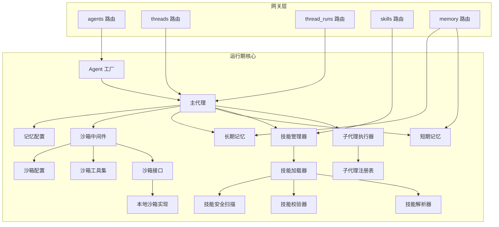
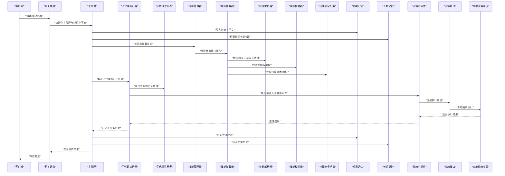
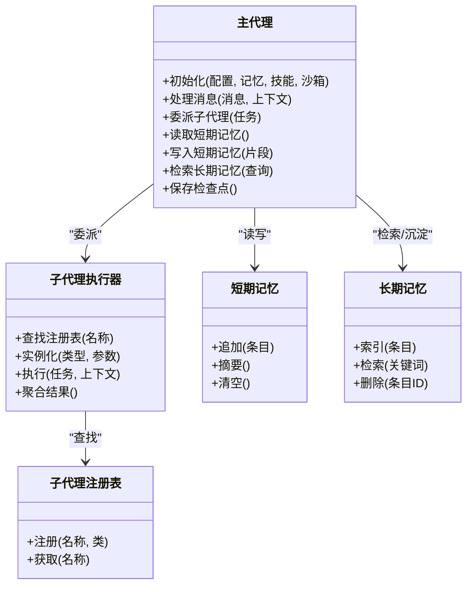
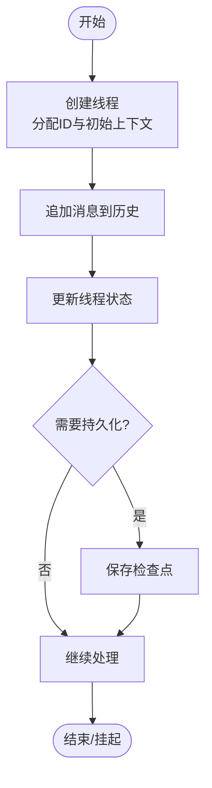
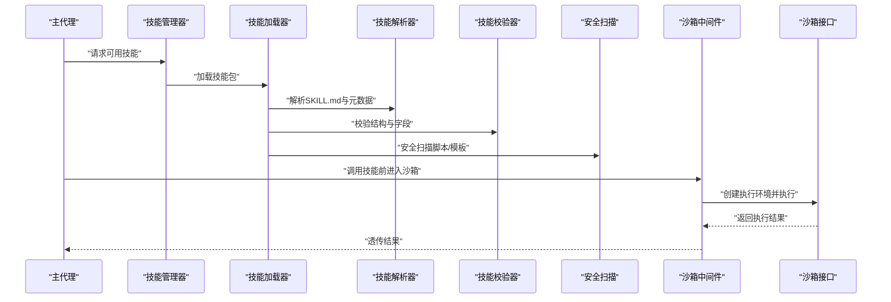
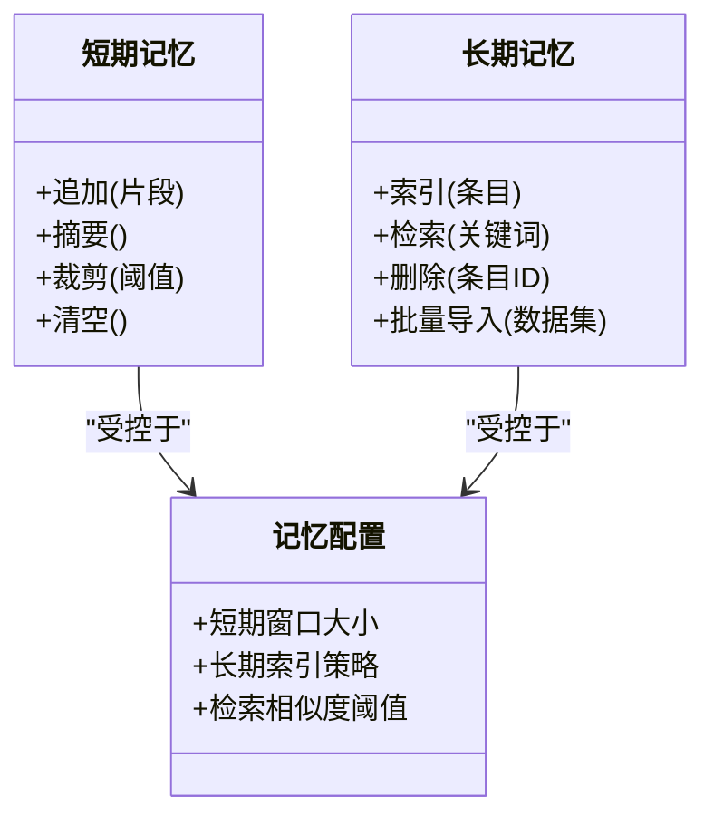
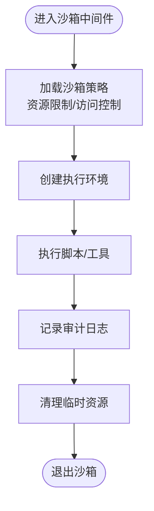
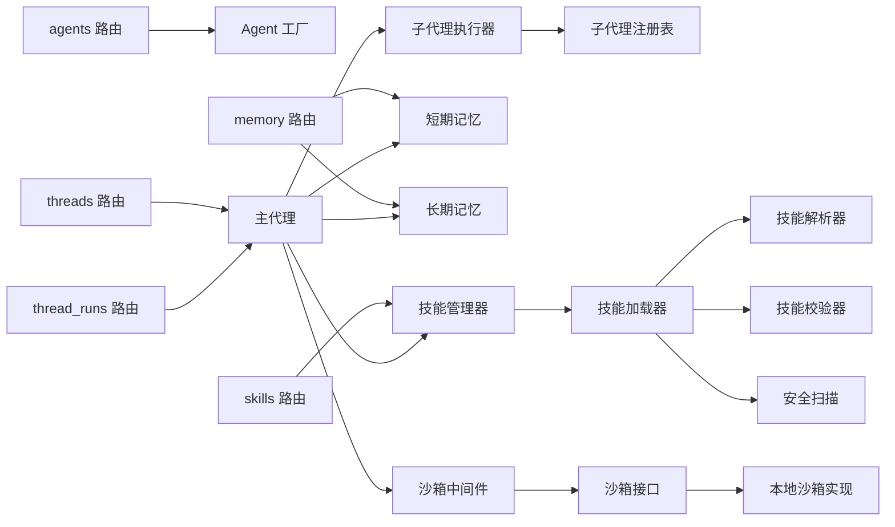

# 核心概念

<cite>
**本文引用的文件**   
- [backend/app/gateway/routers/agents.py](file://backend/app/gateway/routers/agents.py)
- [backend/app/gateway/routers/threads.py](file://backend/app/gateway/routers/threads.py)
- [backend/app/gateway/routers/thread_runs.py](file://backend/app/gateway/routers/thread_runs.py)
- [backend/app/gateway/routers/skills.py](file://backend/app/gateway/routers/skills.py)
- [backend/app/gateway/routers/memory.py](file://backend/app/gateway/routers/memory.py)
- [backend/packages/harness/deerflow/agents/factory.py](file://backend/packages/harness/deerflow/agents/factory.py)
- [backend/packages/harness/deerflow/agents/thread_state.py](file://backend/packages/harness/deerflow/agents/thread_state.py)
- [backend/packages/harness/deerflow/agents/lead_agent/__init__.py](file://backend/packages/harness/deerflow/agents/lead_agent/__init__.py)
- [backend/packages/harness/deerflow/subagents/executor.py](file://backend/packages/harness/deerflow/subagents/executor.py)
- [backend/packages/harness/deerflow/subagents/registry.py](file://backend/packages/harness/deerflow/subagents/registry.py)
- [backend/packages/harness/deerflow/skills/loader.py](file://backend/packages/harness/deerflow/skills/loader.py)
- [backend/packages/harness/deerflow/skills/manager.py](file://backend/packages/harness/deerflow/skills/manager.py)
- [backend/packages/harness/deerflow/skills/parser.py](file://backend/packages/harness/deerflow/skills/parser.py)
- [backend/packages/harness/deerflow/skills/validation.py](file://backend/packages/harness/deerflow/skills/validation.py)
- [backend/packages/harness/deerflow/skills/security_scanner.py](file://backend/packages/harness/deerflow/skills/security_scanner.py)
- [backend/packages/harness/deerflow/sandbox/sandbox.py](file://backend/packages/harness/deerflow/sandbox/sandbox.py)
- [backend/packages/harness/deerflow/sandbox/middleware.py](file://backend/packages/harness/deerflow/sandbox/middleware.py)
- [backend/packages/harness/deerflow/sandbox/tools.py](file://backend/packages/harness/deerflow/sandbox/tools.py)
- [backend/packages/harness/deerflow/sandbox/local/__init__.py](file://backend/packages/harness/deerflow/sandbox/local/__init__.py)
- [backend/packages/harness/deerflow/config/sandbox_config.py](file://backend/packages/harness/deerflow/config/sandbox_config.py)
- [backend/packages/harness/deerflow/config/memory_config.py](file://backend/packages/harness/deerflow/config/memory_config.py)
- [backend/packages/harness/deerflow/agents/memory/short_term.py](file://backend/packages/harness/deerflow/agents/memory/short_term.py)
- [backend/packages/harness/deerflow/agents/memory/long_term.py](file://backend/packages/harness/deerflow/agents/memory/long_term.py)
</cite>

## 目录
1. [简介](#简介)
2. [项目结构](#项目结构)
3. [核心组件](#核心组件)
4. [架构总览](#架构总览)
5. [详细组件分析](#详细组件分析)
6. [依赖分析](#依赖分析)
7. [性能考虑](#性能考虑)
8. [故障排查指南](#故障排查指南)
9. [结论](#结论)
10. [附录](#附录)

## 简介
本文件为 DeerFlow 的核心概念文档，聚焦以下关键主题：
- 代理（Agent）与生命周期管理：主代理与子代理的协作机制、创建与销毁流程。
- 线程（Thread）管理机制：会话状态持久化、消息历史管理与上下文传递。
- 技能（Skill）系统：设计理念、定义、注册与调用流程。
- 记忆（Memory）架构：短期记忆与长期记忆的用途与实现差异。
- 沙箱（Sandbox）安全模型：执行环境隔离与安全策略。

目标是通过清晰的概念图与实际代码路径，帮助开发者快速理解这些概念在系统中的落地方式。

## 项目结构
DeerFlow 后端采用分层与模块化组织：
- Gateway 层提供 HTTP API 路由，暴露 Agent、Thread、Skill、Memory 等能力。
- Harness 层封装 Agent 运行时、子代理执行器、技能加载与管理、沙箱执行、配置与中间件等核心能力。
- 配置集中在 config 模块，便于统一开关与参数管理。

图表来源
- [backend/app/gateway/routers/agents.py](file://backend/app/gateway/routers/agents.py)
- [backend/app/gateway/routers/threads.py](file://backend/app/gateway/routers/threads.py)
- [backend/app/gateway/routers/thread_runs.py](file://backend/app/gateway/routers/thread_runs.py)
- [backend/app/gateway/routers/skills.py](file://backend/app/gateway/routers/skills.py)
- [backend/app/gateway/routers/memory.py](file://backend/app/gateway/routers/memory.py)
- [backend/packages/harness/deerflow/agents/factory.py](file://backend/packages/harness/deerflow/agents/factory.py)
- [backend/packages/harness/deerflow/agents/lead_agent/__init__.py](file://backend/packages/harness/deerflow/agents/lead_agent/__init__.py)
- [backend/packages/harness/deerflow/subagents/executor.py](file://backend/packages/harness/deerflow/subagents/executor.py)
- [backend/packages/harness/deerflow/subagents/registry.py](file://backend/packages/harness/deerflow/subagents/registry.py)
- [backend/packages/harness/deerflow/skills/loader.py](file://backend/packages/harness/deerflow/skills/loader.py)
- [backend/packages/harness/deerflow/skills/manager.py](file://backend/packages/harness/deerflow/skills/manager.py)
- [backend/packages/harness/deerflow/skills/parser.py](file://backend/packages/harness/deerflow/skills/parser.py)
- [backend/packages/harness/deerflow/skills/validation.py](file://backend/packages/harness/deerflow/skills/validation.py)
- [backend/packages/harness/deerflow/skills/security_scanner.py](file://backend/packages/harness/deerflow/skills/security_scanner.py)
- [backend/packages/harness/deerflow/sandbox/sandbox.py](file://backend/packages/harness/deerflow/sandbox/sandbox.py)
- [backend/packages/harness/deerflow/sandbox/middleware.py](file://backend/packages/harness/deerflow/sandbox/middleware.py)
- [backend/packages/harness/deerflow/sandbox/tools.py](file://backend/packages/harness/deerflow/sandbox/tools.py)
- [backend/packages/harness/deerflow/sandbox/local/__init__.py](file://backend/packages/harness/deerflow/sandbox/local/__init__.py)
- [backend/packages/harness/deerflow/config/sandbox_config.py](file://backend/packages/harness/deerflow/config/sandbox_config.py)
- [backend/packages/harness/deerflow/config/memory_config.py](file://backend/packages/harness/deerflow/config/memory_config.py)

章节来源
- [backend/app/gateway/routers/agents.py](file://backend/app/gateway/routers/agents.py)
- [backend/app/gateway/routers/threads.py](file://backend/app/gateway/routers/threads.py)
- [backend/app/gateway/routers/thread_runs.py](file://backend/app/gateway/routers/thread_runs.py)
- [backend/app/gateway/routers/skills.py](file://backend/app/gateway/routers/skills.py)
- [backend/app/gateway/routers/memory.py](file://backend/app/gateway/routers/memory.py)
- [backend/packages/harness/deerflow/agents/factory.py](file://backend/packages/harness/deerflow/agents/factory.py)
- [backend/packages/harness/deerflow/agents/lead_agent/__init__.py](file://backend/packages/harness/deerflow/agents/lead_agent/__init__.py)
- [backend/packages/harness/deerflow/subagents/executor.py](file://backend/packages/harness/deerflow/subagents/executor.py)
- [backend/packages/harness/deerflow/subagents/registry.py](file://backend/packages/harness/deerflow/subagents/registry.py)
- [backend/packages/harness/deerflow/skills/loader.py](file://backend/packages/harness/deerflow/skills/loader.py)
- [backend/packages/harness/deerflow/skills/manager.py](file://backend/packages/harness/deerflow/skills/manager.py)
- [backend/packages/harness/deerflow/skills/parser.py](file://backend/packages/harness/deerflow/skills/parser.py)
- [backend/packages/harness/deerflow/skills/validation.py](file://backend/packages/harness/deerflow/skills/validation.py)
- [backend/packages/harness/deerflow/skills/security_scanner.py](file://backend/packages/harness/deerflow/skills/security_scanner.py)
- [backend/packages/harness/deerflow/sandbox/sandbox.py](file://backend/packages/harness/deerflow/sandbox/sandbox.py)
- [backend/packages/harness/deerflow/sandbox/middleware.py](file://backend/packages/harness/deerflow/sandbox/middleware.py)
- [backend/packages/harness/deerflow/sandbox/tools.py](file://backend/packages/harness/deerflow/sandbox/tools.py)
- [backend/packages/harness/deerflow/sandbox/local/__init__.py](file://backend/packages/harness/deerflow/sandbox/local/__init__.py)
- [backend/packages/harness/deerflow/config/sandbox_config.py](file://backend/packages/harness/deerflow/config/sandbox_config.py)
- [backend/packages/harness/deerflow/config/memory_config.py](file://backend/packages/harness/deerflow/config/memory_config.py)

## 核心组件
本节从概念层面梳理五大核心组件的职责与交互关系，并在后续章节给出更深入的代码级分析。

- 代理（Agent）
  - 主代理负责编排任务、决策是否委派子代理、维护线程上下文与记忆读写。
  - 子代理由执行器根据注册表动态实例化并执行，结果回传主代理。
- 线程（Thread）
  - 承载一次对话或任务的完整上下文，包括消息历史、中间状态与产物。
  - 通过检查点（checkpointer）进行状态持久化，支持断点续跑与回溯。
- 技能（Skill）
  - 以声明式描述与脚本/模板组合的方式扩展能力，具备加载、解析、校验与安全扫描流程。
- 记忆（Memory）
  - 短期记忆用于当前会话内的即时上下文；长期记忆用于跨会话的知识沉淀与检索。
- 沙箱（Sandbox）
  - 对可执行代码或外部命令进行隔离执行，提供资源限制、文件系统访问控制与审计。

章节来源
- [backend/packages/harness/deerflow/agents/factory.py](file://backend/packages/harness/deerflow/agents/factory.py)
- [backend/packages/harness/deerflow/agents/lead_agent/__init__.py](file://backend/packages/harness/deerflow/agents/lead_agent/__init__.py)
- [backend/packages/harness/deerflow/subagents/executor.py](file://backend/packages/harness/deerflow/subagents/executor.py)
- [backend/packages/harness/deerflow/subagents/registry.py](file://backend/packages/harness/deerflow/subagents/registry.py)
- [backend/packages/harness/deerflow/agents/thread_state.py](file://backend/packages/harness/deerflow/agents/thread_state.py)
- [backend/packages/harness/deerflow/agents/memory/short_term.py](file://backend/packages/harness/deerflow/agents/memory/short_term.py)
- [backend/packages/harness/deerflow/agents/memory/long_term.py](file://backend/packages/harness/deerflow/agents/memory/long_term.py)
- [backend/packages/harness/deerflow/skills/loader.py](file://backend/packages/harness/deerflow/skills/loader.py)
- [backend/packages/harness/deerflow/skills/manager.py](file://backend/packages/harness/deerflow/skills/manager.py)
- [backend/packages/harness/deerflow/skills/parser.py](file://backend/packages/harness/deerflow/skills/parser.py)
- [backend/packages/harness/deerflow/skills/validation.py](file://backend/packages/harness/deerflow/skills/validation.py)
- [backend/packages/harness/deerflow/skills/security_scanner.py](file://backend/packages/harness/deerflow/skills/security_scanner.py)
- [backend/packages/harness/deerflow/sandbox/sandbox.py](file://backend/packages/harness/deerflow/sandbox/sandbox.py)
- [backend/packages/harness/deerflow/sandbox/middleware.py](file://backend/packages/harness/deerflow/sandbox/middleware.py)
- [backend/packages/harness/deerflow/sandbox/tools.py](file://backend/packages/harness/deerflow/sandbox/tools.py)
- [backend/packages/harness/deerflow/sandbox/local/__init__.py](file://backend/packages/harness/deerflow/sandbox/local/__init__.py)
- [backend/packages/harness/deerflow/config/sandbox_config.py](file://backend/packages/harness/deerflow/config/sandbox_config.py)
- [backend/packages/harness/deerflow/config/memory_config.py](file://backend/packages/harness/deerflow/config/memory_config.py)

## 架构总览
下图展示了从网关到运行期的整体数据流与控制流，涵盖 Agent、Thread、Skill、Memory 与 Sandbox 的关键交互。

图表来源
- [backend/app/gateway/routers/threads.py](file://backend/app/gateway/routers/threads.py)
- [backend/app/gateway/routers/thread_runs.py](file://backend/app/gateway/routers/thread_runs.py)
- [backend/packages/harness/deerflow/agents/lead_agent/__init__.py](file://backend/packages/harness/deerflow/agents/lead_agent/__init__.py)
- [backend/packages/harness/deerflow/subagents/executor.py](file://backend/packages/harness/deerflow/subagents/executor.py)
- [backend/packages/harness/deerflow/subagents/registry.py](file://backend/packages/harness/deerflow/subagents/registry.py)
- [backend/packages/harness/deerflow/skills/manager.py](file://backend/packages/harness/deerflow/skills/manager.py)
- [backend/packages/harness/deerflow/skills/loader.py](file://backend/packages/harness/deerflow/skills/loader.py)
- [backend/packages/harness/deerflow/skills/parser.py](file://backend/packages/harness/deerflow/skills/parser.py)
- [backend/packages/harness/deerflow/skills/validation.py](file://backend/packages/harness/deerflow/skills/validation.py)
- [backend/packages/harness/deerflow/skills/security_scanner.py](file://backend/packages/harness/deerflow/skills/security_scanner.py)
- [backend/packages/harness/deerflow/agents/memory/short_term.py](file://backend/packages/harness/deerflow/agents/memory/short_term.py)
- [backend/packages/harness/deerflow/agents/memory/long_term.py](file://backend/packages/harness/deerflow/agents/memory/long_term.py)
- [backend/packages/harness/deerflow/sandbox/middleware.py](file://backend/packages/harness/deerflow/sandbox/middleware.py)
- [backend/packages/harness/deerflow/sandbox/sandbox.py](file://backend/packages/harness/deerflow/sandbox/sandbox.py)
- [backend/packages/harness/deerflow/sandbox/local/__init__.py](file://backend/packages/harness/deerflow/sandbox/local/__init__.py)

## 详细组件分析

### 代理（Agent）与生命周期管理
- 主代理职责
  - 接收用户输入，构建线程上下文，决定是否需要调用技能或委派子代理。
  - 协调短期/长期记忆读写，确保上下文一致性与可追溯性。
- 子代理协作
  - 通过执行器与注册表动态选择并实例化子代理，执行完成后将结果合并至主代理上下文。
- 生命周期
  - 创建：由工厂根据配置生成主代理实例，注入记忆、技能、沙箱等依赖。
  - 运行：在主循环中处理消息、调用工具/技能、委派子代理。
  - 结束：清理临时资源，持久化最终状态，释放子代理与环境。

图表来源
- [backend/packages/harness/deerflow/agents/lead_agent/__init__.py](file://backend/packages/harness/deerflow/agents/lead_agent/__init__.py)
- [backend/packages/harness/deerflow/subagents/executor.py](file://backend/packages/harness/deerflow/subagents/executor.py)
- [backend/packages/harness/deerflow/subagents/registry.py](file://backend/packages/harness/deerflow/subagents/registry.py)
- [backend/packages/harness/deerflow/agents/memory/short_term.py](file://backend/packages/harness/deerflow/agents/memory/short_term.py)
- [backend/packages/harness/deerflow/agents/memory/long_term.py](file://backend/packages/harness/deerflow/agents/memory/long_term.py)

章节来源
- [backend/packages/harness/deerflow/agents/factory.py](file://backend/packages/harness/deerflow/agents/factory.py)
- [backend/packages/harness/deerflow/agents/lead_agent/__init__.py](file://backend/packages/harness/deerflow/agents/lead_agent/__init__.py)
- [backend/packages/harness/deerflow/subagents/executor.py](file://backend/packages/harness/deerflow/subagents/executor.py)
- [backend/packages/harness/deerflow/subagents/registry.py](file://backend/packages/harness/deerflow/subagents/registry.py)

### 线程（Thread）管理机制
- 会话状态持久化
  - 使用检查点机制保存线程快照，支持恢复与回放。
- 消息历史管理
  - 按时间顺序维护消息列表，支持增量追加与分页读取。
- 上下文传递
  - 线程上下文包含用户意图、中间产物、工具输出与引用来源，贯穿整个执行链路。

图表来源
- [backend/app/gateway/routers/threads.py](file://backend/app/gateway/routers/threads.py)
- [backend/app/gateway/routers/thread_runs.py](file://backend/app/gateway/routers/thread_runs.py)
- [backend/packages/harness/deerflow/agents/thread_state.py](file://backend/packages/harness/deerflow/agents/thread_state.py)

章节来源
- [backend/app/gateway/routers/threads.py](file://backend/app/gateway/routers/threads.py)
- [backend/app/gateway/routers/thread_runs.py](file://backend/app/gateway/routers/thread_runs.py)
- [backend/packages/harness/deerflow/agents/thread_state.py](file://backend/packages/harness/deerflow/agents/thread_state.py)

### 技能（Skill）系统
- 设计理念
  - 以“声明式描述+脚本/模板”的方式扩展能力，降低集成成本，提升可复用性。
- 定义与注册
  - 通过 SKILL.md 与元数据定义技能能力边界与触发条件。
  - 加载器负责发现、解析、校验与安全扫描，注册到管理器供主代理按需调用。
- 调用流程
  - 主代理根据任务语义匹配技能，经中间件进入沙箱执行，结果回写线程上下文。

图表来源
- [backend/packages/harness/deerflow/skills/manager.py](file://backend/packages/harness/deerflow/skills/manager.py)
- [backend/packages/harness/deerflow/skills/loader.py](file://backend/packages/harness/deerflow/skills/loader.py)
- [backend/packages/harness/deerflow/skills/parser.py](file://backend/packages/harness/deerflow/skills/parser.py)
- [backend/packages/harness/deerflow/skills/validation.py](file://backend/packages/harness/deerflow/skills/validation.py)
- [backend/packages/harness/deerflow/skills/security_scanner.py](file://backend/packages/harness/deerflow/skills/security_scanner.py)
- [backend/packages/harness/deerflow/sandbox/middleware.py](file://backend/packages/harness/deerflow/sandbox/middleware.py)
- [backend/packages/harness/deerflow/sandbox/sandbox.py](file://backend/packages/harness/deerflow/sandbox/sandbox.py)

章节来源
- [backend/packages/harness/deerflow/skills/loader.py](file://backend/packages/harness/deerflow/skills/loader.py)
- [backend/packages/harness/deerflow/skills/manager.py](file://backend/packages/harness/deerflow/skills/manager.py)
- [backend/packages/harness/deerflow/skills/parser.py](file://backend/packages/harness/deerflow/skills/parser.py)
- [backend/packages/harness/deerflow/skills/validation.py](file://backend/packages/harness/deerflow/skills/validation.py)
- [backend/packages/harness/deerflow/skills/security_scanner.py](file://backend/packages/harness/deerflow/skills/security_scanner.py)

### 记忆（Memory）架构
- 短期记忆
  - 面向当前会话，存储最近的消息片段、工具输出与中间结论，支持摘要与裁剪以保持上下文长度可控。
- 长期记忆
  - 面向跨会话，存储结构化知识与检索索引，支持关键词检索与去重，用于沉淀经验与参考。
- 使用场景
  - 短期记忆用于实时推理与对话连贯性；长期记忆用于背景知识补充与一致性约束。

图表来源
- [backend/packages/harness/deerflow/agents/memory/short_term.py](file://backend/packages/harness/deerflow/agents/memory/short_term.py)
- [backend/packages/harness/deerflow/agents/memory/long_term.py](file://backend/packages/harness/deerflow/agents/memory/long_term.py)
- [backend/packages/harness/deerflow/config/memory_config.py](file://backend/packages/harness/deerflow/config/memory_config.py)

章节来源
- [backend/packages/harness/deerflow/agents/memory/short_term.py](file://backend/packages/harness/deerflow/agents/memory/short_term.py)
- [backend/packages/harness/deerflow/agents/memory/long_term.py](file://backend/packages/harness/deerflow/agents/memory/long_term.py)
- [backend/packages/harness/deerflow/config/memory_config.py](file://backend/packages/harness/deerflow/config/memory_config.py)

### 沙箱（Sandbox）安全模型
- 隔离机制
  - 通过中间件在进入执行前创建隔离环境，限制网络、文件系统与进程资源。
- 安全策略
  - 白名单工具集、路径挂载控制、超时与内存限制、审计日志记录。
- 执行环境
  - 本地实现提供轻量隔离；可扩展为容器化或远程执行后端。

图表来源
- [backend/packages/harness/deerflow/sandbox/middleware.py](file://backend/packages/harness/deerflow/sandbox/middleware.py)
- [backend/packages/harness/deerflow/sandbox/sandbox.py](file://backend/packages/harness/deerflow/sandbox/sandbox.py)
- [backend/packages/harness/deerflow/sandbox/tools.py](file://backend/packages/harness/deerflow/sandbox/tools.py)
- [backend/packages/harness/deerflow/sandbox/local/__init__.py](file://backend/packages/harness/deerflow/sandbox/local/__init__.py)
- [backend/packages/harness/deerflow/config/sandbox_config.py](file://backend/packages/harness/deerflow/config/sandbox_config.py)

章节来源
- [backend/packages/harness/deerflow/sandbox/middleware.py](file://backend/packages/harness/deerflow/sandbox/middleware.py)
- [backend/packages/harness/deerflow/sandbox/sandbox.py](file://backend/packages/harness/deerflow/sandbox/sandbox.py)
- [backend/packages/harness/deerflow/sandbox/tools.py](file://backend/packages/harness/deerflow/sandbox/tools.py)
- [backend/packages/harness/deerflow/sandbox/local/__init__.py](file://backend/packages/harness/deerflow/sandbox/local/__init__.py)
- [backend/packages/harness/deerflow/config/sandbox_config.py](file://backend/packages/harness/deerflow/config/sandbox_config.py)

## 依赖分析
- 组件耦合
  - 主代理强依赖记忆、技能与沙箱；子代理执行器依赖注册表；技能加载器依赖解析、校验与安全扫描。
- 外部依赖
  - 网关路由对外暴露 API；配置模块集中管理行为开关。
- 潜在环依赖
  - 通过中间件与接口抽象避免直接循环依赖，保持松耦合。

图表来源
- [backend/app/gateway/routers/agents.py](file://backend/app/gateway/routers/agents.py)
- [backend/app/gateway/routers/threads.py](file://backend/app/gateway/routers/threads.py)
- [backend/app/gateway/routers/thread_runs.py](file://backend/app/gateway/routers/thread_runs.py)
- [backend/app/gateway/routers/skills.py](file://backend/app/gateway/routers/skills.py)
- [backend/app/gateway/routers/memory.py](file://backend/app/gateway/routers/memory.py)
- [backend/packages/harness/deerflow/agents/factory.py](file://backend/packages/harness/deerflow/agents/factory.py)
- [backend/packages/harness/deerflow/agents/lead_agent/__init__.py](file://backend/packages/harness/deerflow/agents/lead_agent/__init__.py)
- [backend/packages/harness/deerflow/subagents/executor.py](file://backend/packages/harness/deerflow/subagents/executor.py)
- [backend/packages/harness/deerflow/subagents/registry.py](file://backend/packages/harness/deerflow/subagents/registry.py)
- [backend/packages/harness/deerflow/skills/manager.py](file://backend/packages/harness/deerflow/skills/manager.py)
- [backend/packages/harness/deerflow/skills/loader.py](file://backend/packages/harness/deerflow/skills/loader.py)
- [backend/packages/harness/deerflow/skills/parser.py](file://backend/packages/harness/deerflow/skills/parser.py)
- [backend/packages/harness/deerflow/skills/validation.py](file://backend/packages/harness/deerflow/skills/validation.py)
- [backend/packages/harness/deerflow/skills/security_scanner.py](file://backend/packages/harness/deerflow/skills/security_scanner.py)
- [backend/packages/harness/deerflow/agents/memory/short_term.py](file://backend/packages/harness/deerflow/agents/memory/short_term.py)
- [backend/packages/harness/deerflow/agents/memory/long_term.py](file://backend/packages/harness/deerflow/agents/memory/long_term.py)
- [backend/packages/harness/deerflow/sandbox/middleware.py](file://backend/packages/harness/deerflow/sandbox/middleware.py)
- [backend/packages/harness/deerflow/sandbox/sandbox.py](file://backend/packages/harness/deerflow/sandbox/sandbox.py)
- [backend/packages/harness/deerflow/sandbox/local/__init__.py](file://backend/packages/harness/deerflow/sandbox/local/__init__.py)

章节来源
- [backend/app/gateway/routers/agents.py](file://backend/app/gateway/routers/agents.py)
- [backend/app/gateway/routers/threads.py](file://backend/app/gateway/routers/threads.py)
- [backend/app/gateway/routers/thread_runs.py](file://backend/app/gateway/routers/thread_runs.py)
- [backend/app/gateway/routers/skills.py](file://backend/app/gateway/routers/skills.py)
- [backend/app/gateway/routers/memory.py](file://backend/app/gateway/routers/memory.py)
- [backend/packages/harness/deerflow/agents/factory.py](file://backend/packages/harness/deerflow/agents/factory.py)
- [backend/packages/harness/deerflow/agents/lead_agent/__init__.py](file://backend/packages/harness/deerflow/agents/lead_agent/__init__.py)
- [backend/packages/harness/deerflow/subagents/executor.py](file://backend/packages/harness/deerflow/subagents/executor.py)
- [backend/packages/harness/deerflow/subagents/registry.py](file://backend/packages/harness/deerflow/subagents/registry.py)
- [backend/packages/harness/deerflow/skills/manager.py](file://backend/packages/harness/deerflow/skills/manager.py)
- [backend/packages/harness/deerflow/skills/loader.py](file://backend/packages/harness/deerflow/skills/loader.py)
- [backend/packages/harness/deerflow/skills/parser.py](file://backend/packages/harness/deerflow/skills/parser.py)
- [backend/packages/harness/deerflow/skills/validation.py](file://backend/packages/harness/deerflow/skills/validation.py)
- [backend/packages/harness/deerflow/skills/security_scanner.py](file://backend/packages/harness/deerflow/skills/security_scanner.py)
- [backend/packages/harness/deerflow/agents/memory/short_term.py](file://backend/packages/harness/deerflow/agents/memory/short_term.py)
- [backend/packages/harness/deerflow/agents/memory/long_term.py](file://backend/packages/harness/deerflow/agents/memory/long_term.py)
- [backend/packages/harness/deerflow/sandbox/middleware.py](file://backend/packages/harness/deerflow/sandbox/middleware.py)
- [backend/packages/harness/deerflow/sandbox/sandbox.py](file://backend/packages/harness/deerflow/sandbox/sandbox.py)
- [backend/packages/harness/deerflow/sandbox/local/__init__.py](file://backend/packages/harness/deerflow/sandbox/local/__init__.py)

## 性能考虑
- 记忆裁剪与摘要
  - 短期记忆需设置合理窗口与摘要策略，避免上下文过长导致延迟与成本上升。
- 子代理并发与限流
  - 对子代理执行进行并发控制与超时保护，防止雪崩效应。
- 技能加载缓存
  - 对已解析与校验通过的技能进行缓存，减少重复 IO 与解析开销。
- 沙箱资源限制
  - 严格限制 CPU、内存与 I/O，避免长时间占用与资源泄漏。

[本节为通用指导，不直接分析具体文件]

## 故障排查指南
- 线程状态不一致
  - 检查检查点保存与恢复逻辑，确认消息历史与上下文同步。
- 子代理执行失败
  - 查看注册表是否正确注册，执行器日志与沙箱审计日志定位问题。
- 技能加载异常
  - 校验 SKILL.md 结构与字段，确认安全扫描未阻断合法脚本。
- 记忆检索不准确
  - 调整长期记忆索引策略与相似度阈值，验证检索关键词与过滤条件。
- 沙箱执行被拒绝
  - 核对白名单工具与路径挂载策略，检查超时与资源限制配置。

章节来源
- [backend/packages/harness/deerflow/agents/thread_state.py](file://backend/packages/harness/deerflow/agents/thread_state.py)
- [backend/packages/harness/deerflow/subagents/executor.py](file://backend/packages/harness/deerflow/subagents/executor.py)
- [backend/packages/harness/deerflow/skills/loader.py](file://backend/packages/harness/deerflow/skills/loader.py)
- [backend/packages/harness/deerflow/skills/validation.py](file://backend/packages/harness/deerflow/skills/validation.py)
- [backend/packages/harness/deerflow/skills/security_scanner.py](file://backend/packages/harness/deerflow/skills/security_scanner.py)
- [backend/packages/harness/deerflow/agents/memory/long_term.py](file://backend/packages/harness/deerflow/agents/memory/long_term.py)
- [backend/packages/harness/deerflow/sandbox/middleware.py](file://backend/packages/harness/deerflow/sandbox/middleware.py)
- [backend/packages/harness/deerflow/config/sandbox_config.py](file://backend/packages/harness/deerflow/config/sandbox_config.py)

## 结论
DeerFlow 通过主代理与子代理的协作、线程状态的持久化管理、可插拔的技能系统与严格的沙箱安全模型，构建了灵活且安全的智能体运行平台。短期与长期记忆的分层设计提升了上下文质量与知识复用效率。建议在实际部署中结合业务场景优化记忆窗口、子代理并发与沙箱策略，以获得更好的性能与稳定性。

[本节为总结性内容，不直接分析具体文件]

## 附录
- 示例与最佳实践
  - 参考 skills/public 下的公开技能，了解 SKILL.md 的结构与脚本/模板的组织方式。
  - 在开发自定义技能时，优先遵循校验与安全扫描要求，确保可被加载与执行。

[本节为补充说明，不直接分析具体文件]