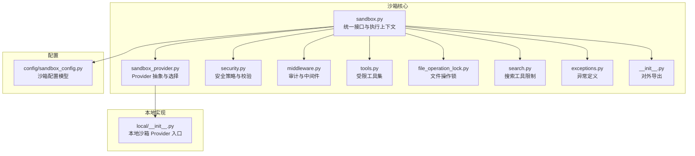
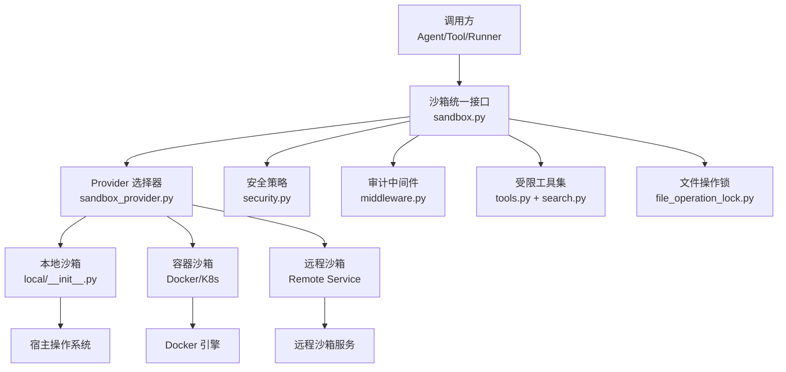
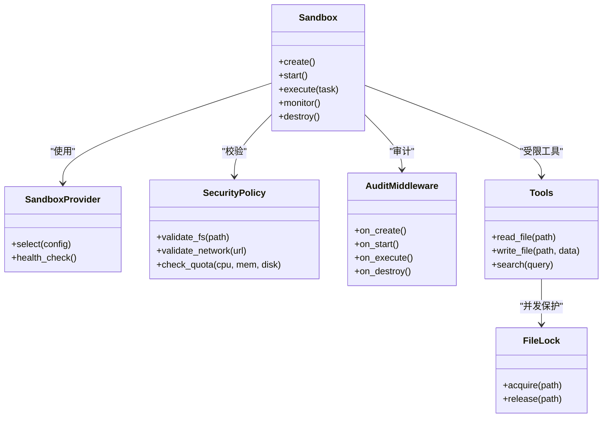
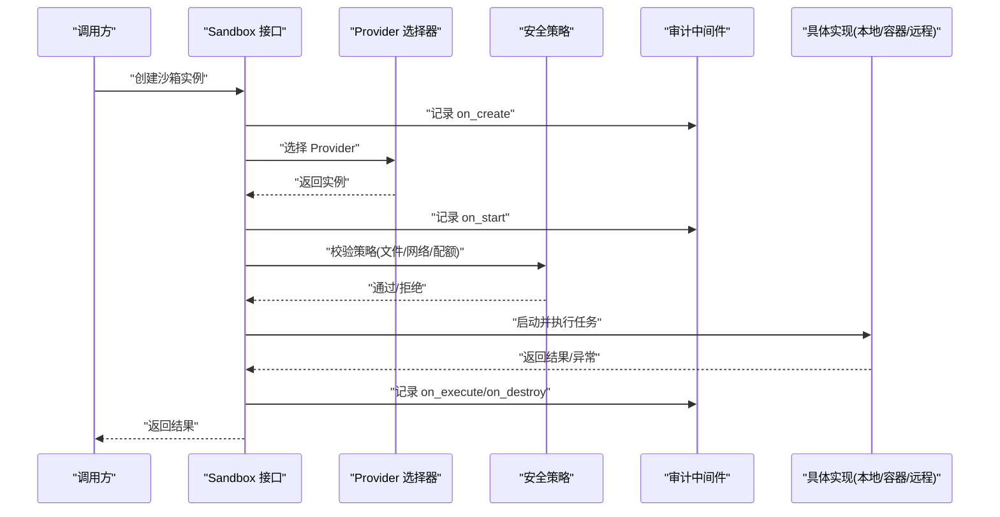
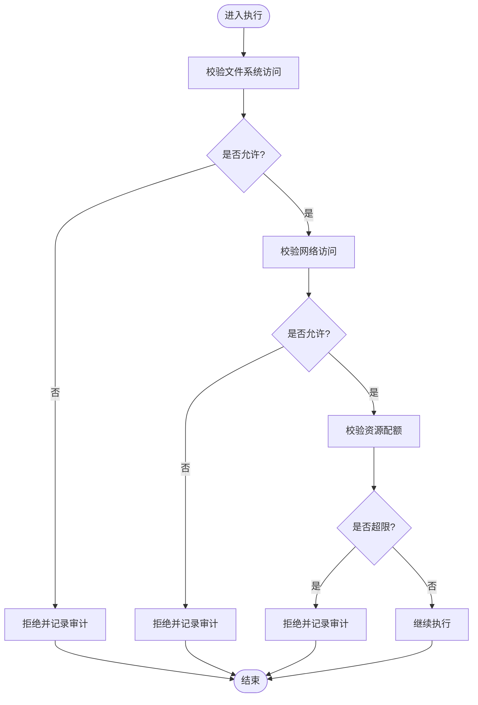
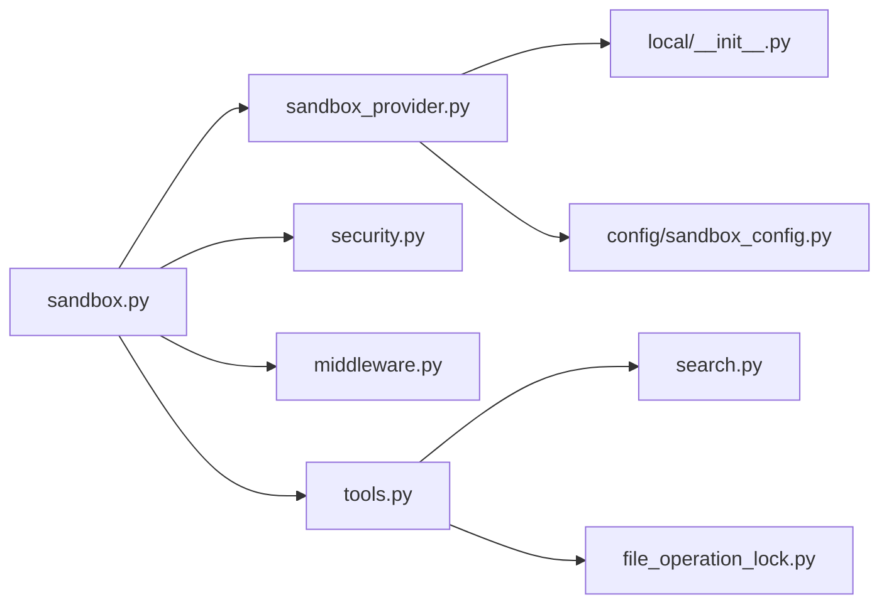

# 沙箱安全模型

<cite>
**本文引用的文件**   
- [sandbox.py](file://backend/packages/harness/deerflow/sandbox/sandbox.py)
- [sandbox_provider.py](file://backend/packages/harness/deerflow/sandbox/sandbox_provider.py)
- [security.py](file://backend/packages/harness/deerflow/sandbox/security.py)
- [middleware.py](file://backend/packages/harness/deerflow/sandbox/middleware.py)
- [tools.py](file://backend/packages/harness/deerflow/sandbox/tools.py)
- [file_operation_lock.py](file://backend/packages/harness/deerflow/sandbox/file_operation_lock.py)
- [search.py](file://backend/packages/harness/deerflow/sandbox/search.py)
- [exceptions.py](file://backend/packages/harness/deerflow/sandbox/exceptions.py)
- [__init__.py](file://backend/packages/harness/deerflow/sandbox/__init__.py)
- [local/__init__.py](file://backend/packages/harness/deerflow/sandbox/local/__init__.py)
- [config/sandbox_config.py](file://backend/packages/harness/deerflow/config/sandbox_config.py)
- [test_sandbox_audit_middleware.py](file://backend/tests/test_sandbox_audit_middleware.py)
- [test_aio_sandbox.py](file://backend/tests/test_aio_sandbox.py)
- [test_aio_sandbox_local_backend.py](file://backend/tests/test_aio_sandbox_local_backend.py)
- [test_aio_sandbox_provider.py](file://backend/tests/test_aio_sandbox_provider.py)
- [test_docker_sandbox_mode_detection.py](file://backend/tests/test_docker_sandbox_mode_detection.py)
- [test_local_sandbox_encoding.py](file://backend/tests/test_local_sandbox_encoding.py)
- [test_local_sandbox_provider_mounts.py](file://backend/tests/test_local_sandbox_provider_mounts.py)
- [test_sandbox_search_tools.py](file://backend/tests/test_sandbox_search_tools.py)
- [test_sandbox_tools_security.py](file://backend/tests/test_sandbox_tools_security.py)
- [test_sandbox_orphan_reconciliation.py](file://backend/tests/test_sandbox_orphan_reconciliation.py)
- [test_sandbox_orphan_reconciliation_e2e.py](file://backend/tests/test_sandbox_orphan_reconciliation_e2e.py)
- [docker-compose.yaml](file://docker/docker-compose.yaml)
- [provisioner/app.py](file://docker/provisioner/app.py)
</cite>

## 目录
1. [简介](#简介)
2. [项目结构](#项目结构)
3. [核心组件](#核心组件)
4. [架构总览](#架构总览)
5. [详细组件分析](#详细组件分析)
6. [依赖关系分析](#依赖关系分析)
7. [性能与资源管理](#性能与资源管理)
8. [故障排查指南](#故障排查指南)
9. [结论](#结论)
10. [附录：配置示例与最佳实践](#附录配置示例与最佳实践)

## 简介
本文件面向 DeerFlow 的沙箱安全模型，系统性阐述“什么是沙箱”以及“为什么需要安全隔离”，并围绕本地沙箱、容器沙箱与远程沙箱三类实现，给出策略配置、生命周期管理、安全检查与审计机制的完整说明。文档同时提供架构图、流程图与类图，帮助读者从高层到代码级全面理解 DeerFlow 如何以可插拔的方式运行不可信代码，并在文件系统、网络、资源配额等维度进行严格约束。

## 项目结构
DeerFlow 的沙箱能力集中在后端 harness 的 sandbox 模块中，并通过 provider 抽象支持多种运行时（本地进程、容器、远程服务）。相关配置位于 config 子模块，测试覆盖关键路径与安全场景。

图表来源
- [sandbox.py:1-200](file://backend/packages/harness/deerflow/sandbox/sandbox.py#L1-L200)
- [sandbox_provider.py:1-200](file://backend/packages/harness/deerflow/sandbox/sandbox_provider.py#L1-L200)
- [security.py:1-200](file://backend/packages/harness/deerflow/sandbox/security.py#L1-L200)
- [middleware.py:1-200](file://backend/packages/harness/deerflow/sandbox/middleware.py#L1-L200)
- [tools.py:1-200](file://backend/packages/harness/deerflow/sandbox/tools.py#L1-L200)
- [file_operation_lock.py:1-200](file://backend/packages/harness/deerflow/sandbox/file_operation_lock.py#L1-L200)
- [search.py:1-200](file://backend/packages/harness/deerflow/sandbox/search.py#L1-L200)
- [exceptions.py:1-200](file://backend/packages/harness/deerflow/sandbox/exceptions.py#L1-L200)
- [__init__.py:1-200](file://backend/packages/harness/deerflow/sandbox/__init__.py#L1-L200)
- [local/__init__.py:1-200](file://backend/packages/harness/deerflow/sandbox/local/__init__.py#L1-L200)
- [config/sandbox_config.py:1-200](file://backend/packages/harness/deerflow/config/sandbox_config.py#L1-L200)

章节来源
- [sandbox.py:1-200](file://backend/packages/harness/deerflow/sandbox/sandbox.py#L1-L200)
- [sandbox_provider.py:1-200](file://backend/packages/harness/deerflow/sandbox/sandbox_provider.py#L1-L200)
- [config/sandbox_config.py:1-200](file://backend/packages/harness/deerflow/config/sandbox_config.py#L1-L200)

## 核心组件
- 统一沙箱接口与执行上下文：定义创建、启动、执行、监控、销毁等生命周期方法，屏蔽不同 Provider 的差异。
- Provider 抽象与选择：根据配置动态选择本地、容器或远程 Provider，并提供统一的调用契约。
- 安全策略与校验：集中管理文件系统访问控制、网络限制、资源配额、超时与内存上限等策略。
- 审计中间件：在关键节点记录审计日志，支持行为追踪与异常检测。
- 受限工具集：为沙箱内任务提供受控的工具能力（如受限的文件读写、搜索等），避免直接暴露系统 API。
- 文件操作锁：在多并发场景下保证文件操作的原子性与一致性，防止竞态条件导致的越权访问。
- 搜索工具限制：对搜索范围、域名白名单、结果大小等进行限制，降低信息泄露风险。
- 异常体系：定义沙箱相关的错误类型，便于上层统一处理与降级。

章节来源
- [sandbox.py:1-200](file://backend/packages/harness/deerflow/sandbox/sandbox.py#L1-L200)
- [sandbox_provider.py:1-200](file://backend/packages/harness/deerflow/sandbox/sandbox_provider.py#L1-L200)
- [security.py:1-200](file://backend/packages/harness/deerflow/sandbox/security.py#L1-L200)
- [middleware.py:1-200](file://backend/packages/harness/deerflow/sandbox/middleware.py#L1-L200)
- [tools.py:1-200](file://backend/packages/harness/deerflow/sandbox/tools.py#L1-L200)
- [file_operation_lock.py:1-200](file://backend/packages/harness/deerflow/sandbox/file_operation_lock.py#L1-L200)
- [search.py:1-200](file://backend/packages/harness/deerflow/sandbox/search.py#L1-L200)
- [exceptions.py:1-200](file://backend/packages/harness/deerflow/sandbox/exceptions.py#L1-L200)

## 架构总览
下图展示了沙箱在 DeerFlow 中的整体架构：上层通过统一接口发起执行请求，由 Provider 选择具体运行时；安全策略在入口处拦截不合规操作；审计中间件贯穿整个生命周期；底层资源由操作系统或容器编排平台保障隔离。

图表来源
- [sandbox.py:1-200](file://backend/packages/harness/deerflow/sandbox/sandbox.py#L1-L200)
- [sandbox_provider.py:1-200](file://backend/packages/harness/deerflow/sandbox/sandbox_provider.py#L1-L200)
- [local/__init__.py:1-200](file://backend/packages/harness/deerflow/sandbox/local/__init__.py#L1-L200)
- [security.py:1-200](file://backend/packages/harness/deerflow/sandbox/security.py#L1-L200)
- [middleware.py:1-200](file://backend/packages/harness/deerflow/sandbox/middleware.py#L1-L200)
- [tools.py:1-200](file://backend/packages/harness/deerflow/sandbox/tools.py#L1-L200)
- [search.py:1-200](file://backend/packages/harness/deerflow/sandbox/search.py#L1-L200)
- [file_operation_lock.py:1-200](file://backend/packages/harness/deerflow/sandbox/file_operation_lock.py#L1-L200)

## 详细组件分析

### 统一沙箱接口与执行上下文（sandbox.py）
- 职责：定义沙箱实例的生命周期方法（创建、启动、执行、监控、销毁），封装执行上下文（工作目录、环境变量、资源限制、超时等）。
- 关键点：
  - 执行前进行策略校验（文件系统、网络、资源配额）。
  - 执行后收集审计事件与指标。
  - 异常标准化，向上层返回一致的错误语义。
- 复杂度：主要开销来自 Provider 的具体实现；接口本身保持 O(1) 调度成本。

章节来源
- [sandbox.py:1-200](file://backend/packages/harness/deerflow/sandbox/sandbox.py#L1-L200)

### Provider 抽象与选择（sandbox_provider.py）
- 职责：根据配置选择本地、容器或远程 Provider，并返回符合统一接口的实例。
- 关键点：
  - 配置驱动：读取 sandbox_config 决定 Provider 类型与参数。
  - 健康检查：启动时验证 Provider 可用性。
  - 优雅降级：当某 Provider 不可用时回退至其他可用实现（若配置允许）。
- 扩展性：新增 Provider 只需实现统一接口并注册到选择器。

章节来源
- [sandbox_provider.py:1-200](file://backend/packages/harness/deerflow/sandbox/sandbox_provider.py#L1-L200)
- [config/sandbox_config.py:1-200](file://backend/packages/harness/deerflow/config/sandbox_config.py#L1-L200)

### 安全策略与校验（security.py）
- 职责：集中管理沙箱安全策略，包括：
  - 文件系统访问控制：白名单目录、只读挂载、禁止敏感路径。
  - 网络限制：域名白名单、端口限制、禁用出站连接。
  - 资源配额：CPU、内存、磁盘、时间片、并发数。
  - 输入输出限制：最大输入大小、输出截断、编码规范。
- 关键点：
  - 策略可组合、可热更新。
  - 校验失败立即拒绝执行并记录审计事件。
- 复杂度：策略匹配通常为线性扫描，可通过索引优化。

章节来源
- [security.py:1-200](file://backend/packages/harness/deerflow/sandbox/security.py#L1-L200)

### 审计中间件（middleware.py）
- 职责：在沙箱生命周期的关键节点插入审计逻辑，记录：
  - 创建/启动/销毁事件
  - 执行开始/结束、耗时、资源使用
  - 策略命中与拒绝原因
  - 异常堆栈与上下文快照
- 关键点：
  - 异步非阻塞写入，避免影响执行性能。
  - 支持采样与分级日志，便于生产环境调优。
- 复杂度：I/O 为主，建议异步队列+批量落盘。

章节来源
- [middleware.py:1-200](file://backend/packages/harness/deerflow/sandbox/middleware.py#L1-L200)
- [test_sandbox_audit_middleware.py:1-200](file://backend/tests/test_sandbox_audit_middleware.py#L1-L200)

### 受限工具集（tools.py, search.py）
- 职责：为沙箱内任务提供最小必要能力，避免直接暴露系统 API。
- 关键点：
  - 文件工具：基于白名单路径与只读模式，结合 file_operation_lock 保证并发安全。
  - 搜索工具：限制搜索引擎、域名白名单、结果大小与缓存策略。
  - 网络工具：仅允许白名单域名与协议，强制超时与重试上限。
- 复杂度：工具内部多为 I/O 密集，需关注超时与限流。

章节来源
- [tools.py:1-200](file://backend/packages/harness/deerflow/sandbox/tools.py#L1-L200)
- [search.py:1-200](file://backend/packages/harness/deerflow/sandbox/search.py#L1-L200)
- [file_operation_lock.py:1-200](file://backend/packages/harness/deerflow/sandbox/file_operation_lock.py#L1-L200)
- [test_sandbox_search_tools.py:1-200](file://backend/tests/test_sandbox_search_tools.py#L1-L200)
- [test_sandbox_tools_security.py:1-200](file://backend/tests/test_sandbox_tools_security.py#L1-L200)

### 异常体系（exceptions.py）
- 职责：定义沙箱相关异常类型，如策略拒绝、资源超限、Provider 不可用、执行超时等。
- 关键点：
  - 异常分层清晰，便于上层捕获与降级。
  - 包含结构化错误码与消息，利于审计与告警。

章节来源
- [exceptions.py:1-200](file://backend/packages/harness/deerflow/sandbox/exceptions.py#L1-L200)

### 本地沙箱 Provider（local/__init__.py）
- 职责：在宿主机上以进程或线程方式运行任务，适合开发与低延迟场景。
- 关键点：
  - 通过命名空间、cgroups 或用户权限实现基础隔离。
  - 支持挂载卷与只读根文件系统。
  - 与宿主共享内核，隔离强度弱于容器。
- 适用场景：开发调试、可信代码执行、快速迭代。

章节来源
- [local/__init__.py:1-200](file://backend/packages/harness/deerflow/sandbox/local/__init__.py#L1-L200)
- [test_local_sandbox_encoding.py:1-200](file://backend/tests/test_local_sandbox_encoding.py#L1-L200)
- [test_local_sandbox_provider_mounts.py:1-200](file://backend/tests/test_local_sandbox_provider_mounts.py#L1-L200)

### 容器沙箱（Docker/K8s）
- 职责：利用容器技术实现强隔离，适合多租户与不可信代码执行。
- 关键点：
  - 镜像白名单、只读根文件系统、最小化权限。
  - 通过 cgroup 限制 CPU/内存/IO，通过网络策略限制出站。
  - 与 Orchestrator 集成实现弹性伸缩与自愈。
- 适用场景：生产环境、高隔离需求、多租户。

章节来源
- [test_docker_sandbox_mode_detection.py:1-200](file://backend/tests/test_docker_sandbox_mode_detection.py#L1-L200)
- [docker-compose.yaml:1-200](file://docker/docker-compose.yaml#L1-L200)

### 远程沙箱（Remote Sandbox）
- 职责：将沙箱执行卸载到独立服务，主进程仅负责编排与结果收集。
- 关键点：
  - 通过 gRPC/HTTP 与远程服务通信，支持跨主机部署。
  - 远程服务可复用容器或虚拟机作为执行单元。
  - 具备更强的可扩展性与容错能力。
- 适用场景：分布式执行、跨地域部署、资源池化管理。

章节来源
- [test_aio_sandbox.py:1-200](file://backend/tests/test_aio_sandbox.py#L1-L200)
- [test_aio_sandbox_local_backend.py:1-200](file://backend/tests/test_aio_sandbox_local_backend.py#L1-L200)
- [test_aio_sandbox_provider.py:1-200](file://backend/tests/test_aio_sandbox_provider.py#L1-L200)
- [provisioner/app.py:1-200](file://docker/provisioner/app.py#L1-L200)

### 类图：沙箱核心对象关系

图表来源
- [sandbox.py:1-200](file://backend/packages/harness/deerflow/sandbox/sandbox.py#L1-L200)
- [sandbox_provider.py:1-200](file://backend/packages/harness/deerflow/sandbox/sandbox_provider.py#L1-L200)
- [security.py:1-200](file://backend/packages/harness/deerflow/sandbox/security.py#L1-L200)
- [middleware.py:1-200](file://backend/packages/harness/deerflow/sandbox/middleware.py#L1-L200)
- [tools.py:1-200](file://backend/packages/harness/deerflow/sandbox/tools.py#L1-L200)
- [file_operation_lock.py:1-200](file://backend/packages/harness/deerflow/sandbox/file_operation_lock.py#L1-L200)

### 序列图：沙箱执行流程

图表来源
- [sandbox.py:1-200](file://backend/packages/harness/deerflow/sandbox/sandbox.py#L1-L200)
- [sandbox_provider.py:1-200](file://backend/packages/harness/deerflow/sandbox/sandbox_provider.py#L1-L200)
- [security.py:1-200](file://backend/packages/harness/deerflow/sandbox/security.py#L1-L200)
- [middleware.py:1-200](file://backend/packages/harness/deerflow/sandbox/middleware.py#L1-L200)

### 流程图：安全策略校验

图表来源
- [security.py:1-200](file://backend/packages/harness/deerflow/sandbox/security.py#L1-L200)
- [middleware.py:1-200](file://backend/packages/harness/deerflow/sandbox/middleware.py#L1-L200)

## 依赖关系分析
- 松耦合设计：sandbox.py 通过 Provider 抽象解耦具体实现，新增 Provider 无需改动核心逻辑。
- 策略与执行分离：security.py 专注策略定义与校验，sandbox.py 负责编排与调用。
- 审计贯穿始终：middleware.py 在各阶段注入审计点，便于全链路追踪。
- 外部依赖：容器沙箱依赖 Docker/K8s，远程沙箱依赖远程服务，本地沙箱依赖操作系统能力。

图表来源
- [sandbox.py:1-200](file://backend/packages/harness/deerflow/sandbox/sandbox.py#L1-L200)
- [sandbox_provider.py:1-200](file://backend/packages/harness/deerflow/sandbox/sandbox_provider.py#L1-L200)
- [security.py:1-200](file://backend/packages/harness/deerflow/sandbox/security.py#L1-L200)
- [middleware.py:1-200](file://backend/packages/harness/deerflow/sandbox/middleware.py#L1-L200)
- [tools.py:1-200](file://backend/packages/harness/deerflow/sandbox/tools.py#L1-L200)
- [search.py:1-200](file://backend/packages/harness/deerflow/sandbox/search.py#L1-L200)
- [file_operation_lock.py:1-200](file://backend/packages/harness/deerflow/sandbox/file_operation_lock.py#L1-L200)
- [local/__init__.py:1-200](file://backend/packages/harness/deerflow/sandbox/local/__init__.py#L1-L200)
- [config/sandbox_config.py:1-200](file://backend/packages/harness/deerflow/config/sandbox_config.py#L1-L200)

章节来源
- [sandbox.py:1-200](file://backend/packages/harness/deerflow/sandbox/sandbox.py#L1-L200)
- [sandbox_provider.py:1-200](file://backend/packages/harness/deerflow/sandbox/sandbox_provider.py#L1-L200)
- [config/sandbox_config.py:1-200](file://backend/packages/harness/deerflow/config/sandbox_config.py#L1-L200)

## 性能与资源管理
- 资源配额：通过 security.py 的配额校验与 Provider 的资源限制（cgroup/容器规格）共同保障 CPU、内存、磁盘与时间的上限。
- 并发控制：file_operation_lock.py 避免文件竞争，减少锁粒度以提升吞吐。
- 异步审计：middleware.py 采用异步写入与批量落盘，降低对执行路径的影响。
- 缓存与限流：search.py 可对搜索结果进行缓存与速率限制，避免上游服务过载。
- 弹性伸缩：容器与远程 Provider 可与编排平台联动，按需扩缩容。

[本节为通用指导，不直接分析具体文件]

## 故障排查指南
- 审计日志：查看 middleware.py 记录的创建、启动、执行、销毁事件，定位失败阶段。
- 策略拒绝：检查 security.py 的校验规则，确认文件路径、域名、配额是否符合预期。
- Provider 健康：通过 sandbox_provider.py 的健康检查接口确认本地/容器/远程服务状态。
- 文件锁问题：若出现死锁或超时，检查 file_operation_lock.py 的获取与释放逻辑。
- 编码问题：参考 test_local_sandbox_encoding.py 的测试用例，确保输入输出编码一致。
- 挂载问题：参考 test_local_sandbox_provider_mounts.py，确认卷挂载与权限设置正确。
- 孤儿回收：参考 test_sandbox_orphan_reconciliation.py 与 e2e 版本，确保异常退出后的资源清理。

章节来源
- [middleware.py:1-200](file://backend/packages/harness/deerflow/sandbox/middleware.py#L1-L200)
- [security.py:1-200](file://backend/packages/harness/deerflow/sandbox/security.py#L1-L200)
- [sandbox_provider.py:1-200](file://backend/packages/harness/deerflow/sandbox/sandbox_provider.py#L1-L200)
- [file_operation_lock.py:1-200](file://backend/packages/harness/deerflow/sandbox/file_operation_lock.py#L1-L200)
- [test_local_sandbox_encoding.py:1-200](file://backend/tests/test_local_sandbox_encoding.py#L1-L200)
- [test_local_sandbox_provider_mounts.py:1-200](file://backend/tests/test_local_sandbox_provider_mounts.py#L1-L200)
- [test_sandbox_orphan_reconciliation.py:1-200](file://backend/tests/test_sandbox_orphan_reconciliation.py#L1-L200)
- [test_sandbox_orphan_reconciliation_e2e.py:1-200](file://backend/tests/test_sandbox_orphan_reconciliation_e2e.py#L1-L200)

## 结论
DeerFlow 的沙箱安全模型以统一接口为核心，通过 Provider 抽象实现本地、容器与远程三种运行时的灵活切换；以安全策略与审计中间件贯穿生命周期，确保文件系统、网络与资源的严格管控；借助受限工具集与文件锁提升安全性与并发稳定性。该设计兼顾可扩展性与可观测性，适用于从开发调试到生产多租户的广泛场景。

[本节为总结，不直接分析具体文件]

## 附录：配置示例与最佳实践

### 配置要点（基于 sandbox_config.py）
- Provider 类型：选择 local、container 或 remote。
- 文件系统：配置白名单目录、只读挂载、敏感路径黑名单。
- 网络策略：域名白名单、端口限制、禁用出站。
- 资源配额：CPU、内存、磁盘、超时、并发上限。
- 审计级别：开启关键事件与采样率。

章节来源
- [config/sandbox_config.py:1-200](file://backend/packages/harness/deerflow/config/sandbox_config.py#L1-L200)

### 最佳实践
- 默认拒绝：策略遵循“默认拒绝，显式允许”原则。
- 最小权限：容器镜像最小化，关闭不必要的能力。
- 只读根文件系统：除必要挂载外，根文件系统设为只读。
- 网络白名单：仅允许业务必需域名与协议。
- 资源上限：为每个沙箱实例设置严格的 CPU/内存/IO 上限。
- 审计与告警：对策略拒绝与异常进行告警，建立闭环处置流程。
- 灰度发布：新 Provider 或策略变更先灰度验证，再全量上线。
- 定期演练：模拟恶意脚本与资源耗尽场景，验证防护有效性。

[本节为通用指导，不直接分析具体文件]