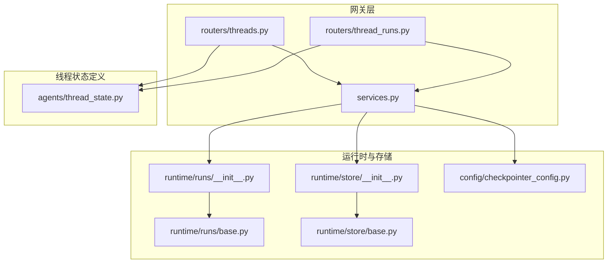
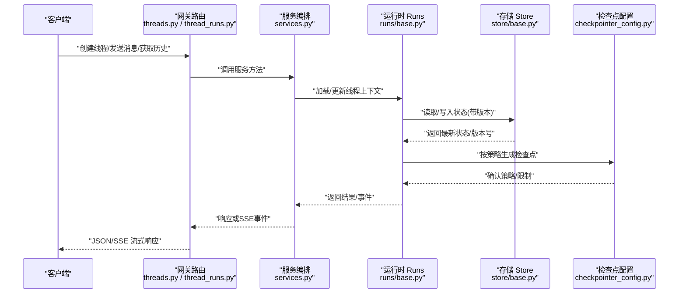
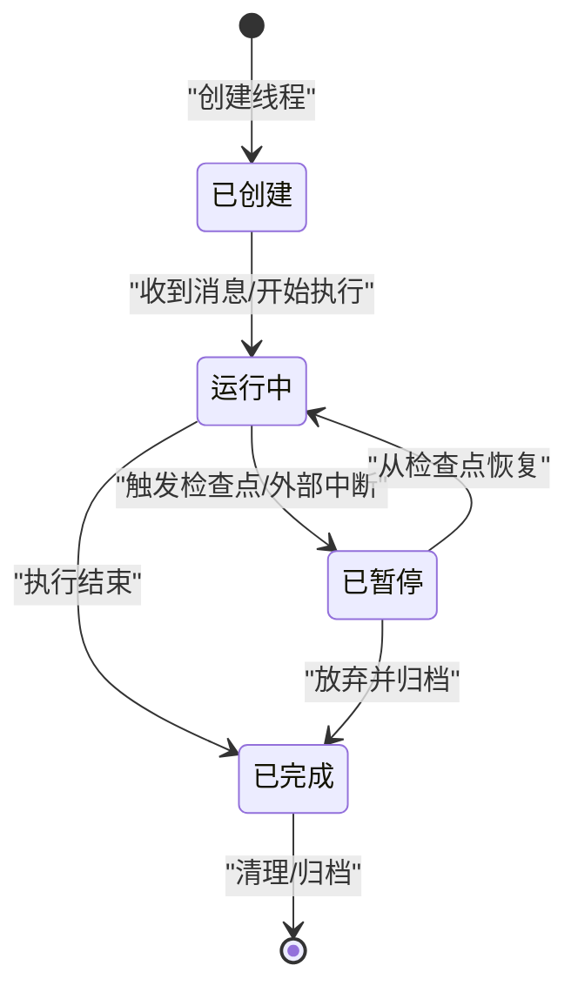
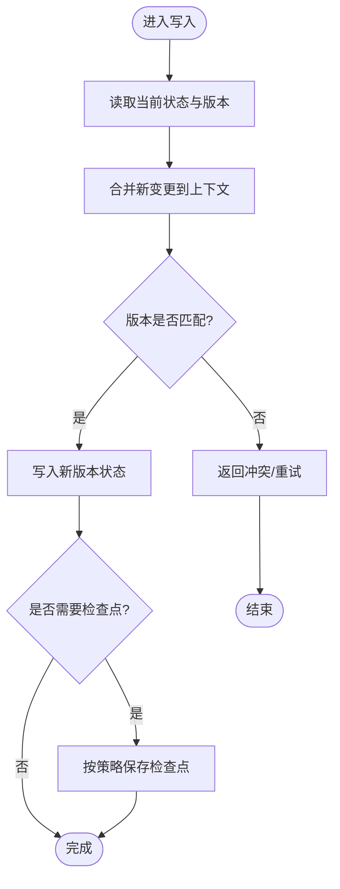
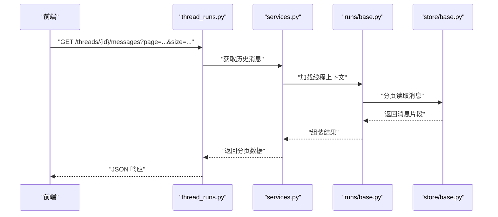
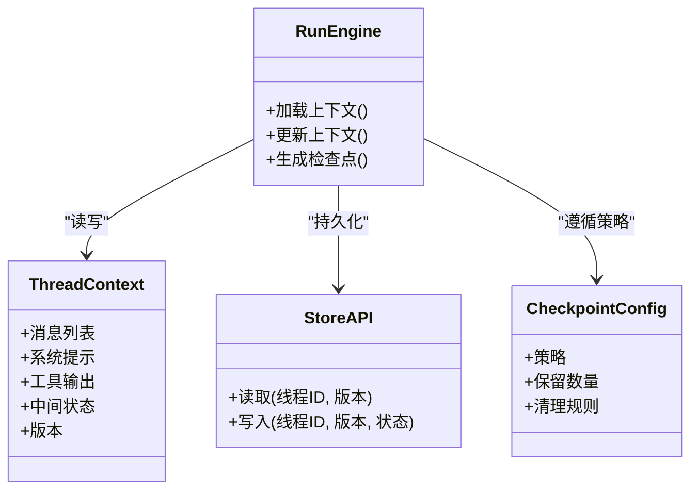
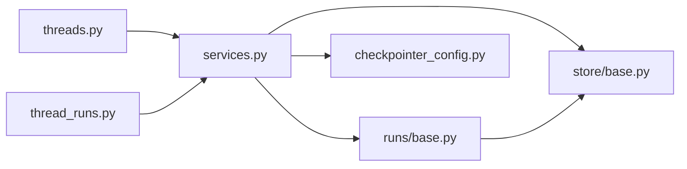

# 线程管理

<cite>
**本文引用的文件**   
- [backend/app/gateway/routers/threads.py](file://backend/app/gateway/routers/threads.py)
- [backend/app/gateway/routers/thread_runs.py](file://backend/app/gateway/routers/thread_runs.py)
- [backend/app/gateway/services.py](file://backend/app/gateway/services.py)
- [backend/packages/harness/deerflow/agents/thread_state.py](file://backend/packages/harness/deerflow/agents/thread_state.py)
- [backend/packages/harness/deerflow/runtime/runs/__init__.py](file://backend/packages/harness/deerflow/runtime/runs/__init__.py)
- [backend/packages/harness/deerflow/runtime/runs/base.py](file://backend/packages/harness/deerflow/runtime/runs/base.py)
- [backend/packages/harness/deerflow/runtime/store/__init__.py](file://backend/packages/harness/deerflow/runtime/store/__init__.py)
- [backend/packages/harness/deerflow/runtime/store/base.py](file://backend/packages/harness/deerflow/runtime/store/base.py)
- [backend/packages/harness/deerflow/config/checkpointer_config.py](file://backend/packages/harness/deerflow/config/checkpointer_config.py)
- [backend/tests/test_threads_router.py](file://backend/tests/test_threads_router.py)
- [backend/tests/test_thread_data_middleware.py](file://backend/tests/test_thread_data_middleware.py)
</cite>

## 目录
1. [简介](#简介)
2. [项目结构](#项目结构)
3. [核心组件](#核心组件)
4. [架构总览](#架构总览)
5. [详细组件分析](#详细组件分析)
6. [依赖关系分析](#依赖关系分析)
7. [性能考虑](#性能考虑)
8. [故障排查指南](#故障排查指南)
9. [结论](#结论)
10. [附录](#附录)

## 简介
本文件面向 DeerFlow 的“线程(Thread)”子系统，系统性阐述线程在对话系统中的角色、状态管理与持久化、并发访问控制、生命周期流程、消息历史与上下文传递机制，并提供 API 使用示例与状态转换图。文档以代码为依据，结合后端网关路由、运行时运行期与存储层实现进行说明，帮助读者快速理解并正确使用线程相关能力。

## 项目结构
围绕线程管理的核心代码主要分布在以下位置：
- 网关路由层：对外暴露 REST/SSE 接口，处理线程创建、消息发送、历史记录查询等请求
- 服务编排层：协调路由与运行时、存储、检查点等组件
- 运行时与存储层：负责线程状态的执行、版本化、持久化与并发控制
- 配置层：检查点（Checkpointer）策略与行为配置
- 测试用例：覆盖路由与服务的关键路径

图示来源
- [backend/app/gateway/routers/threads.py](file://backend/app/gateway/routers/threads.py)
- [backend/app/gateway/routers/thread_runs.py](file://backend/app/gateway/routers/thread_runs.py)
- [backend/app/gateway/services.py](file://backend/app/gateway/services.py)
- [backend/packages/harness/deerflow/runtime/runs/__init__.py](file://backend/packages/harness/deerflow/runtime/runs/__init__.py)
- [backend/packages/harness/deerflow/runtime/runs/base.py](file://backend/packages/harness/deerflow/runtime/runs/base.py)
- [backend/packages/harness/deerflow/runtime/store/__init__.py](file://backend/packages/harness/deerflow/runtime/store/__init__.py)
- [backend/packages/harness/deerflow/runtime/store/base.py](file://backend/packages/harness/deerflow/runtime/store/base.py)
- [backend/packages/harness/deerflow/config/checkpointer_config.py](file://backend/packages/harness/deerflow/config/checkpointer_config.py)
- [backend/packages/harness/deerflow/agents/thread_state.py](file://backend/packages/harness/deerflow/agents/thread_state.py)

章节来源
- [backend/app/gateway/routers/threads.py](file://backend/app/gateway/routers/threads.py)
- [backend/app/gateway/routers/thread_runs.py](file://backend/app/gateway/routers/thread_runs.py)
- [backend/app/gateway/services.py](file://backend/app/gateway/services.py)
- [backend/packages/harness/deerflow/agents/thread_state.py](file://backend/packages/harness/deerflow/agents/thread_state.py)
- [backend/packages/harness/deerflow/runtime/runs/__init__.py](file://backend/packages/harness/deerflow/runtime/runs/__init__.py)
- [backend/packages/harness/deerflow/runtime/runs/base.py](file://backend/packages/harness/deerflow/runtime/runs/base.py)
- [backend/packages/harness/deerflow/runtime/store/__init__.py](file://backend/packages/harness/deerflow/runtime/store/__init__.py)
- [backend/packages/harness/deerflow/runtime/store/base.py](file://backend/packages/harness/deerflow/runtime/store/base.py)
- [backend/packages/harness/deerflow/config/checkpointer_config.py](file://backend/packages/harness/deerflow/config/checkpointer_config.py)

## 核心组件
- 线程路由（REST/SSE）
  - 提供线程创建、列出、更新元信息、删除等接口
  - 提供向线程追加消息、获取历史消息、分页加载等接口
  - 通过 SSE 推送运行事件流
- 服务编排
  - 封装对运行时与存储的调用，统一错误处理与参数校验
- 运行时（Runs）
  - 负责线程上下文的加载、增量更新、版本化快照与恢复
  - 支持并发安全访问与幂等写入
- 存储（Store）
  - 抽象持久化接口，具体实现可对接不同后端
  - 保证状态一致性、事务性与并发控制
- 检查点配置（Checkpointer）
  - 控制状态快照策略、保留策略、回滚与清理
- 线程状态模型（Thread State）
  - 定义线程上下文的数据结构与字段语义，贯穿运行与存储

章节来源
- [backend/app/gateway/routers/threads.py](file://backend/app/gateway/routers/threads.py)
- [backend/app/gateway/routers/thread_runs.py](file://backend/app/gateway/routers/thread_runs.py)
- [backend/app/gateway/services.py](file://backend/app/gateway/services.py)
- [backend/packages/harness/deerflow/runtime/runs/__init__.py](file://backend/packages/harness/deerflow/runtime/runs/__init__.py)
- [backend/packages/harness/deerflow/runtime/runs/base.py](file://backend/packages/harness/deerflow/runtime/runs/base.py)
- [backend/packages/harness/deerflow/runtime/store/__init__.py](file://backend/packages/harness/deerflow/runtime/store/__init__.py)
- [backend/packages/harness/deerflow/runtime/store/base.py](file://backend/packages/harness/deerflow/runtime/store/base.py)
- [backend/packages/harness/deerflow/config/checkpointer_config.py](file://backend/packages/harness/deerflow/config/checkpointer_config.py)
- [backend/packages/harness/deerflow/agents/thread_state.py](file://backend/packages/harness/deerflow/agents/thread_state.py)

## 架构总览
下图展示了从客户端到线程运行的端到端数据流与控制流。

图示来源
- [backend/app/gateway/routers/threads.py](file://backend/app/gateway/routers/threads.py)
- [backend/app/gateway/routers/thread_runs.py](file://backend/app/gateway/routers/thread_runs.py)
- [backend/app/gateway/services.py](file://backend/app/gateway/services.py)
- [backend/packages/harness/deerflow/runtime/runs/base.py](file://backend/packages/harness/deerflow/runtime/runs/base.py)
- [backend/packages/harness/deerflow/runtime/store/base.py](file://backend/packages/harness/deerflow/runtime/store/base.py)
- [backend/packages/harness/deerflow/config/checkpointer_config.py](file://backend/packages/harness/deerflow/config/checkpointer_config.py)

## 详细组件分析

### 线程状态模型与生命周期
- 线程状态模型
  - 定义线程上下文的核心字段与类型约束，包括消息列表、系统提示、工具输出、中间态等
  - 作为运行时读写与存储序列化的基础
- 生命周期阶段
  - 创建：初始化空上下文，分配唯一标识，落盘初始状态
  - 运行：接收新消息，增量更新上下文，触发 Agent 工作流
  - 暂停/恢复：基于检查点保存中间状态，后续可从指定版本恢复
  - 结束：完成所有步骤，归档最终状态，释放资源
- 并发访问控制
  - 通过版本号/时间戳实现乐观锁，避免写冲突
  - 关键路径加锁或队列串行化，确保同一线程的写入有序

图示来源
- [backend/packages/harness/deerflow/agents/thread_state.py](file://backend/packages/harness/deerflow/agents/thread_state.py)
- [backend/packages/harness/deerflow/runtime/runs/base.py](file://backend/packages/harness/deerflow/runtime/runs/base.py)
- [backend/packages/harness/deerflow/runtime/store/base.py](file://backend/packages/harness/deerflow/runtime/store/base.py)
- [backend/packages/harness/deerflow/config/checkpointer_config.py](file://backend/packages/harness/deerflow/config/checkpointer_config.py)

章节来源
- [backend/packages/harness/deerflow/agents/thread_state.py](file://backend/packages/harness/deerflow/agents/thread_state.py)
- [backend/packages/harness/deerflow/runtime/runs/base.py](file://backend/packages/harness/deerflow/runtime/runs/base.py)
- [backend/packages/harness/deerflow/runtime/store/base.py](file://backend/packages/harness/deerflow/runtime/store/base.py)
- [backend/packages/harness/deerflow/config/checkpointer_config.py](file://backend/packages/harness/deerflow/config/checkpointer_config.py)

### 状态持久化、版本控制与并发控制
- 持久化
  - 存储层抽象出统一的读写接口，支持多后端实现
  - 每次状态变更写入新版本，保留历史以便回溯
- 版本控制
  - 每个状态对象携带版本号，写入前校验期望版本
  - 失败时返回冲突信号，由上层重试或降级
- 并发控制
  - 读多写少场景下采用乐观锁；高并发写场景可引入排队或分片
  - 检查点策略可限制快照频率与数量，平衡一致性与开销

图示来源
- [backend/packages/harness/deerflow/runtime/store/base.py](file://backend/packages/harness/deerflow/runtime/store/base.py)
- [backend/packages/harness/deerflow/config/checkpointer_config.py](file://backend/packages/harness/deerflow/config/checkpointer_config.py)

章节来源
- [backend/packages/harness/deerflow/runtime/store/base.py](file://backend/packages/harness/deerflow/runtime/store/base.py)
- [backend/packages/harness/deerflow/config/checkpointer_config.py](file://backend/packages/harness/deerflow/config/checkpointer_config.py)

### 消息历史管理与分页
- 存储与检索
  - 消息按线程维度组织，支持按时间顺序检索
  - 支持过滤条件（如消息类型、来源）与排序
- 分页加载
  - 通过游标或页码+大小参数实现高效分页
  - 前端按需加载，减少首屏压力
- 增量同步
  - 结合 SSE 推送新增消息片段，提升交互体验

图示来源
- [backend/app/gateway/routers/thread_runs.py](file://backend/app/gateway/routers/thread_runs.py)
- [backend/app/gateway/services.py](file://backend/app/gateway/services.py)
- [backend/packages/harness/deerflow/runtime/runs/base.py](file://backend/packages/harness/deerflow/runtime/runs/base.py)
- [backend/packages/harness/deerflow/runtime/store/base.py](file://backend/packages/harness/deerflow/runtime/store/base.py)

章节来源
- [backend/app/gateway/routers/thread_runs.py](file://backend/app/gateway/routers/thread_runs.py)
- [backend/app/gateway/services.py](file://backend/app/gateway/services.py)
- [backend/packages/harness/deerflow/runtime/runs/base.py](file://backend/packages/harness/deerflow/runtime/runs/base.py)
- [backend/packages/harness/deerflow/runtime/store/base.py](file://backend/packages/harness/deerflow/runtime/store/base.py)

### 上下文传递机制
- 线程上下文
  - 包含用户输入、系统提示、工具调用结果、中间推理过程等
  - 在运行过程中被多个中间件/子代理共享与更新
- 传递方式
  - 函数参数显式传递
  - 全局上下文对象（线程内单例）
  - 事件总线/消息队列（跨进程/容器）
- 一致性保障
  - 通过检查点与版本控制确保上下文在重启后仍可恢复
  - 并发写入需序列化或加锁

图示来源
- [backend/packages/harness/deerflow/agents/thread_state.py](file://backend/packages/harness/deerflow/agents/thread_state.py)
- [backend/packages/harness/deerflow/runtime/runs/base.py](file://backend/packages/harness/deerflow/runtime/runs/base.py)
- [backend/packages/harness/deerflow/runtime/store/base.py](file://backend/packages/harness/deerflow/runtime/store/base.py)
- [backend/packages/harness/deerflow/config/checkpointer_config.py](file://backend/packages/harness/deerflow/config/checkpointer_config.py)

章节来源
- [backend/packages/harness/deerflow/agents/thread_state.py](file://backend/packages/harness/deerflow/agents/thread_state.py)
- [backend/packages/harness/deerflow/runtime/runs/base.py](file://backend/packages/harness/deerflow/runtime/runs/base.py)
- [backend/packages/harness/deerflow/runtime/store/base.py](file://backend/packages/harness/deerflow/runtime/store/base.py)
- [backend/packages/harness/deerflow/config/checkpointer_config.py](file://backend/packages/harness/deerflow/config/checkpointer_config.py)

### API 使用示例（创建线程、发送消息、获取历史）
- 创建线程
  - 请求：POST /threads
  - 响应：返回线程 ID 与初始状态
- 发送消息
  - 请求：POST /threads/{id}/messages
  - 支持文本、附件、工具调用上下文
  - 可选流式响应（SSE）
- 获取历史
  - 请求：GET /threads/{id}/messages?page=&size=&sort=
  - 支持过滤与分页
- 运行事件
  - 请求：GET /threads/{id}/runs/events
  - 返回运行过程中的事件流（如步骤开始/结束、工具调用、错误等）

章节来源
- [backend/app/gateway/routers/threads.py](file://backend/app/gateway/routers/threads.py)
- [backend/app/gateway/routers/thread_runs.py](file://backend/app/gateway/routers/thread_runs.py)
- [backend/app/gateway/services.py](file://backend/app/gateway/services.py)

## 依赖关系分析
- 耦合与内聚
  - 路由层仅负责协议适配与参数校验，业务编排下沉至 services
  - runs 与 store 解耦，便于替换存储实现
- 外部依赖
  - 检查点配置影响运行时行为，需与存储实现保持一致
- 潜在循环依赖
  - 通过分层与接口隔离避免循环引用

图示来源
- [backend/app/gateway/routers/threads.py](file://backend/app/gateway/routers/threads.py)
- [backend/app/gateway/routers/thread_runs.py](file://backend/app/gateway/routers/thread_runs.py)
- [backend/app/gateway/services.py](file://backend/app/gateway/services.py)
- [backend/packages/harness/deerflow/runtime/runs/base.py](file://backend/packages/harness/deerflow/runtime/runs/base.py)
- [backend/packages/harness/deerflow/runtime/store/base.py](file://backend/packages/harness/deerflow/runtime/store/base.py)
- [backend/packages/harness/deerflow/config/checkpointer_config.py](file://backend/packages/harness/deerflow/config/checkpointer_config.py)

章节来源
- [backend/app/gateway/routers/threads.py](file://backend/app/gateway/routers/threads.py)
- [backend/app/gateway/routers/thread_runs.py](file://backend/app/gateway/routers/thread_runs.py)
- [backend/app/gateway/services.py](file://backend/app/gateway/services.py)
- [backend/packages/harness/deerflow/runtime/runs/base.py](file://backend/packages/harness/deerflow/runtime/runs/base.py)
- [backend/packages/harness/deerflow/runtime/store/base.py](file://backend/packages/harness/deerflow/runtime/store/base.py)
- [backend/packages/harness/deerflow/config/checkpointer_config.py](file://backend/packages/harness/deerflow/config/checkpointer_config.py)

## 性能考虑
- 分页与懒加载
  - 默认小页大小，结合游标提升大会话性能
- 检查点策略
  - 合理设置快照频率与保留数量，避免频繁 IO
- 并发写入
  - 热点线程建议启用队列串行化或分片存储
- 缓存
  - 对只读历史可引入本地缓存，降低存储压力

[本节为通用指导，不直接分析具体文件]

## 故障排查指南
- 常见问题
  - 版本冲突：写入失败，需重试或协商最新版本
  - 检查点缺失：无法恢复，需检查配置与存储可用性
  - 消息丢失：确认写入成功与持久化策略
- 定位手段
  - 查看运行日志与事件流
  - 核对检查点配置与存储后端健康状态
  - 使用测试用例复现问题路径

章节来源
- [backend/tests/test_threads_router.py](file://backend/tests/test_threads_router.py)
- [backend/tests/test_thread_data_middleware.py](file://backend/tests/test_thread_data_middleware.py)

## 结论
DeerFlow 的线程管理以“状态即上下文”为核心，通过运行时与存储层的清晰分层、版本化与检查点策略，实现了可靠的并发控制与可恢复性。配合网关提供的简洁 API 与 SSE 事件流，开发者可以构建稳定高效的对话系统。

## 附录
- 术语
  - 线程：一次对话的上下文载体
  - 检查点：线程状态的快照，用于恢复与回溯
  - 版本：状态对象的递增编号，用于并发控制
- 参考文件
  - 路由与服务：threads.py、thread_runs.py、services.py
  - 运行时与存储：runs/base.py、store/base.py
  - 配置：checkpointer_config.py
  - 状态模型：thread_state.py