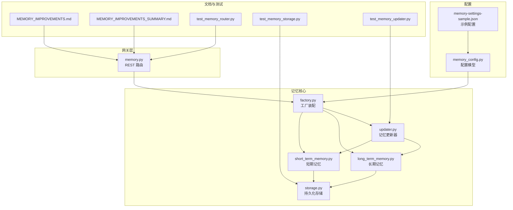
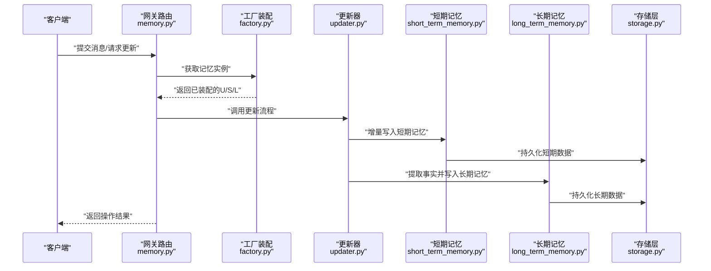
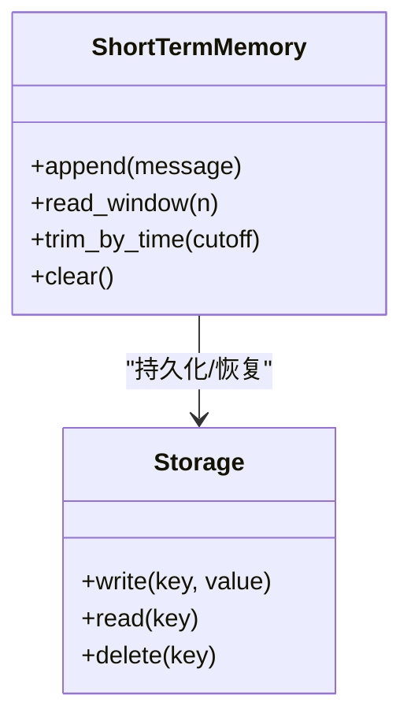
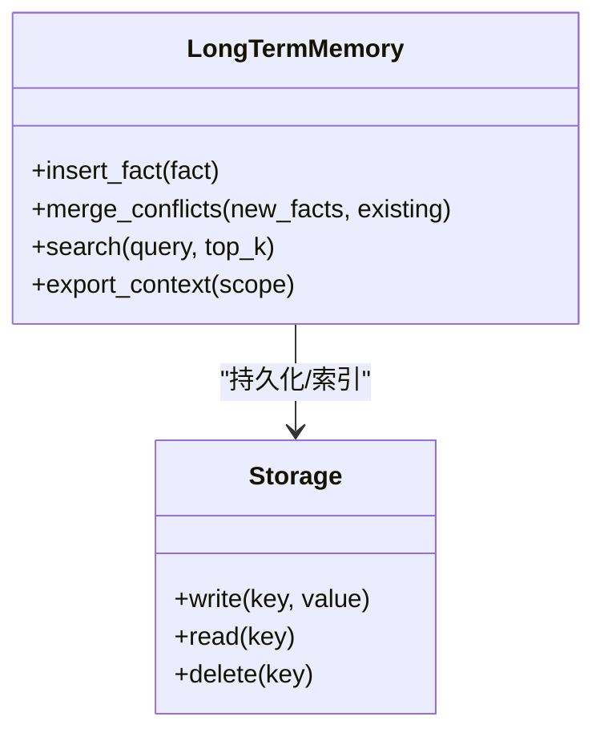
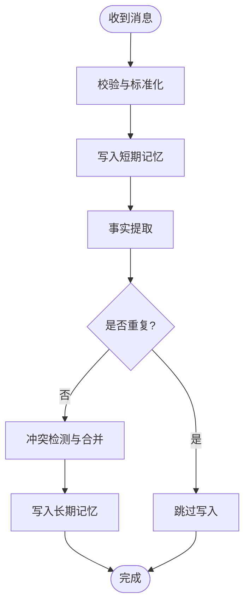
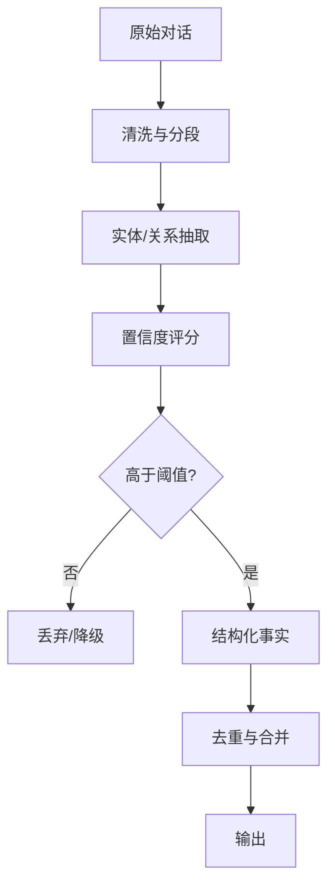
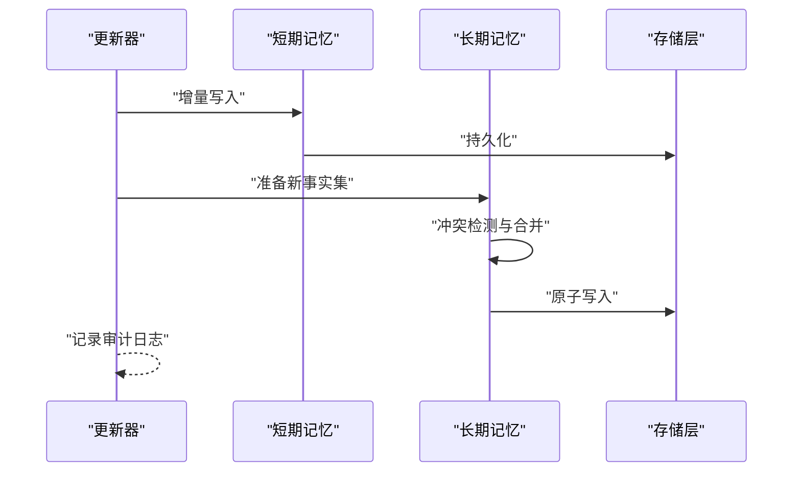
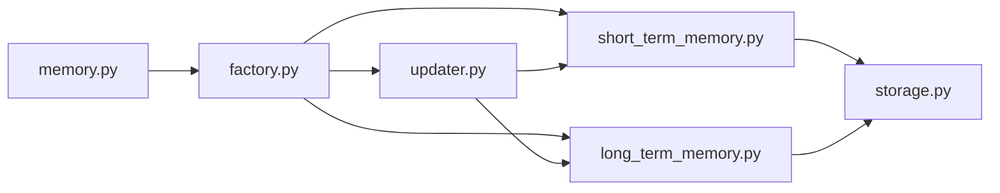

# 记忆架构

<cite>
**本文引用的文件**   
- [backend/app/gateway/routers/memory.py](file://backend/app/gateway/routers/memory.py)
- [backend/packages/harness/deerflow/agents/memory/__init__.py](file://backend/packages/harness/deerflow/agents/memory/__init__.py)
- [backend/packages/harness/deerflow/agents/memory/factory.py](file://backend/packages/harness/deerflow/agents/memory/factory.py)
- [backend/packages/harness/deerflow/agents/memory/short_term_memory.py](file://backend/packages/harness/deerflow/agents/memory/short_term_memory.py)
- [backend/packages/harness/deerflow/agents/memory/long_term_memory.py](file://backend/packages/harness/deerflow/agents/memory/long_term_memory.py)
- [backend/packages/harness/deerflow/agents/memory/updater.py](file://backend/packages/harness/deerflow/agents/memory/updater.py)
- [backend/packages/harness/deerflow/agents/memory/storage.py](file://backend/packages/harness/deerflow/agents/memory/storage.py)
- [backend/packages/harness/deerflow/config/memory_config.py](file://backend/packages/harness/deerflow/config/memory_config.py)
- [backend/docs/MEMORY_IMPROVEMENTS.md](file://backend/docs/MEMORY_IMPROVEMENTS.md)
- [backend/docs/MEMORY_IMPROVEMENTS_SUMMARY.md](file://backend/docs/MEMORY_IMPROVEMENTS_SUMMARY.md)
- [backend/docs/memory-settings-sample.json](file://backend/docs/memory-settings-sample.json)
- [backend/tests/test_memory_router.py](file://backend/tests/test_memory_router.py)
- [backend/tests/test_memory_storage.py](file://backend/tests/test_memory_storage.py)
- [backend/tests/test_memory_updater.py](file://backend/tests/test_memory_updater.py)
</cite>

## 目录
1. [简介](#简介)
2. [项目结构](#项目结构)
3. [核心组件](#核心组件)
4. [架构总览](#架构总览)
5. [详细组件分析](#详细组件分析)
6. [依赖分析](#依赖分析)
7. [性能考虑](#性能考虑)
8. [故障排查指南](#故障排查指南)
9. [结论](#结论)
10. [附录](#附录)

## 简介
本文件系统化梳理 DeerFlow 的记忆架构，围绕分层设计、短期与长期记忆的职责划分、消息处理管道、事实提取算法、记忆更新机制以及查询检索最佳实践展开。文档面向不同技术背景的读者，既提供高层概览，也深入到代码级实现细节，并辅以架构图与流程图帮助理解。

## 项目结构
记忆相关代码主要位于后端 harness 的 agents.memory 模块，并通过网关路由对外暴露接口；配置集中在 memory_config；测试覆盖路由、存储与更新器；文档包含改进说明与示例配置。

图示来源
- [backend/app/gateway/routers/memory.py](file://backend/app/gateway/routers/memory.py)
- [backend/packages/harness/deerflow/agents/memory/factory.py](file://backend/packages/harness/deerflow/agents/memory/factory.py)
- [backend/packages/harness/deerflow/agents/memory/short_term_memory.py](file://backend/packages/harness/deerflow/agents/memory/short_term_memory.py)
- [backend/packages/harness/deerflow/agents/memory/long_term_memory.py](file://backend/packages/harness/deerflow/agents/memory/long_term_memory.py)
- [backend/packages/harness/deerflow/agents/memory/updater.py](file://backend/packages/harness/deerflow/agents/memory/updater.py)
- [backend/packages/harness/deerflow/agents/memory/storage.py](file://backend/packages/harness/deerflow/agents/memory/storage.py)
- [backend/packages/harness/deerflow/config/memory_config.py](file://backend/packages/harness/deerflow/config/memory_config.py)
- [backend/docs/memory-settings-sample.json](file://backend/docs/memory-settings-sample.json)
- [backend/docs/MEMORY_IMPROVEMENTS.md](file://backend/docs/MEMORY_IMPROVEMENTS.md)
- [backend/docs/MEMORY_IMPROVEMENTS_SUMMARY.md](file://backend/docs/MEMORY_IMPROVEMENTS_SUMMARY.md)
- [backend/tests/test_memory_router.py](file://backend/tests/test_memory_router.py)
- [backend/tests/test_memory_storage.py](file://backend/tests/test_memory_storage.py)
- [backend/tests/test_memory_updater.py](file://backend/tests/test_memory_updater.py)

章节来源
- [backend/app/gateway/routers/memory.py](file://backend/app/gateway/routers/memory.py)
- [backend/packages/harness/deerflow/agents/memory/factory.py](file://backend/packages/harness/deerflow/agents/memory/factory.py)
- [backend/packages/harness/deerflow/agents/memory/short_term_memory.py](file://backend/packages/harness/deerflow/agents/memory/short_term_memory.py)
- [backend/packages/harness/deerflow/agents/memory/long_term_memory.py](file://backend/packages/harness/deerflow/agents/memory/long_term_memory.py)
- [backend/packages/harness/deerflow/agents/memory/updater.py](file://backend/packages/harness/deerflow/agents/memory/updater.py)
- [backend/packages/harness/deerflow/agents/memory/storage.py](file://backend/packages/harness/deerflow/agents/memory/storage.py)
- [backend/packages/harness/deerflow/config/memory_config.py](file://backend/packages/harness/deerflow/config/memory_config.py)
- [backend/docs/memory-settings-sample.json](file://backend/docs/memory-settings-sample.json)
- [backend/docs/MEMORY_IMPROVEMENTS.md](file://backend/docs/MEMORY_IMPROVEMENTS.md)
- [backend/docs/MEMORY_IMPROVEMENTS_SUMMARY.md](file://backend/docs/MEMORY_IMPROVEMENTS_SUMMARY.md)
- [backend/tests/test_memory_router.py](file://backend/tests/test_memory_router.py)
- [backend/tests/test_memory_storage.py](file://backend/tests/test_memory_storage.py)
- [backend/tests/test_memory_updater.py](file://backend/tests/test_memory_updater.py)

## 核心组件
- 短期记忆（Short-term Memory）：面向会话内的高频读写，承载最近对话片段、上下文摘要与临时状态，强调低延迟与高吞吐。
- 长期记忆（Long-term Memory）：面向跨会话的知识沉淀，存储结构化事实、实体关系与主题摘要，支持检索增强生成（RAG）。
- 记忆更新器（Memory Updater）：协调增量写入、冲突检测与合并策略，保证一致性与幂等性。
- 存储层（Storage）：抽象底层持久化介质，统一读写接口，屏蔽具体实现差异。
- 工厂装配（Factory）：依据配置组装各记忆组件，注入依赖。
- 配置（Memory Config）：集中管理阈值、窗口大小、索引策略、压缩与清理策略等。

章节来源
- [backend/packages/harness/deerflow/agents/memory/short_term_memory.py](file://backend/packages/harness/deerflow/agents/memory/short_term_memory.py)
- [backend/packages/harness/deerflow/agents/memory/long_term_memory.py](file://backend/packages/harness/deerflow/agents/memory/long_term_memory.py)
- [backend/packages/harness/deerflow/agents/memory/updater.py](file://backend/packages/harness/deerflow/agents/memory/updater.py)
- [backend/packages/harness/deerflow/agents/memory/storage.py](file://backend/packages/harness/deerflow/agents/memory/storage.py)
- [backend/packages/harness/deerflow/agents/memory/factory.py](file://backend/packages/harness/deerflow/agents/memory/factory.py)
- [backend/packages/harness/deerflow/config/memory_config.py](file://backend/packages/harness/deerflow/config/memory_config.py)

## 架构总览
DeerFlow 记忆系统采用“分层+管道”的设计：消息进入网关后，由更新器驱动短期记忆快速落盘，随后触发异步的事实提取与长期记忆写入；查询时优先命中短期缓存，再回退到长期检索。

图示来源
- [backend/app/gateway/routers/memory.py](file://backend/app/gateway/routers/memory.py)
- [backend/packages/harness/deerflow/agents/memory/factory.py](file://backend/packages/harness/deerflow/agents/memory/factory.py)
- [backend/packages/harness/deerflow/agents/memory/updater.py](file://backend/packages/harness/deerflow/agents/memory/updater.py)
- [backend/packages/harness/deerflow/agents/memory/short_term_memory.py](file://backend/packages/harness/deerflow/agents/memory/short_term_memory.py)
- [backend/packages/harness/deerflow/agents/memory/long_term_memory.py](file://backend/packages/harness/deerflow/agents/memory/long_term_memory.py)
- [backend/packages/harness/deerflow/agents/memory/storage.py](file://backend/packages/harness/deerflow/agents/memory/storage.py)

## 详细组件分析

### 短期记忆（Short-term Memory）
- 职责：维护会话窗口内的最近消息、中间态与轻量摘要，提供 O(1)/O(log n) 级别的追加与范围读取。
- 数据结构：环形缓冲或时间戳索引的消息队列，附带元数据（会话ID、时间戳、来源、权重）。
- 存储策略：内存为主，必要时落盘；按窗口大小与过期策略自动淘汰。
- 典型操作：追加消息、滑动窗口裁剪、批量读取、快速检索最近N条。

图示来源
- [backend/packages/harness/deerflow/agents/memory/short_term_memory.py](file://backend/packages/harness/deerflow/agents/memory/short_term_memory.py)
- [backend/packages/harness/deerflow/agents/memory/storage.py](file://backend/packages/harness/deerflow/agents/memory/storage.py)

章节来源
- [backend/packages/harness/deerflow/agents/memory/short_term_memory.py](file://backend/packages/harness/deerflow/agents/memory/short_term_memory.py)
- [backend/packages/harness/deerflow/agents/memory/storage.py](file://backend/packages/harness/deerflow/agents/memory/storage.py)

### 长期记忆（Long-term Memory）
- 职责：沉淀跨会话的结构化知识，包括事实三元组、实体属性、主题摘要与关联图谱片段。
- 数据结构：键值/图/向量混合结构，支持语义检索与精确匹配。
- 存储策略：持久化为主，支持分片与索引；可结合外部向量库或图数据库。
- 典型操作：插入事实、去重合并、相似度检索、子图抽取。

图示来源
- [backend/packages/harness/deerflow/agents/memory/long_term_memory.py](file://backend/packages/harness/deerflow/agents/memory/long_term_memory.py)
- [backend/packages/harness/deerflow/agents/memory/storage.py](file://backend/packages/harness/deerflow/agents/memory/storage.py)

章节来源
- [backend/packages/harness/deerflow/agents/memory/long_term_memory.py](file://backend/packages/harness/deerflow/agents/memory/long_term_memory.py)
- [backend/packages/harness/deerflow/agents/memory/storage.py](file://backend/packages/harness/deerflow/agents/memory/storage.py)

### 消息处理管道（Message Processing Pipeline）
- 入口：网关路由接收消息，委托更新器执行流水线。
- 阶段：
  - 校验与标准化：规范化消息格式、过滤无效内容。
  - 短期写入：立即落盘短期记忆，保障低延迟。
  - 事实提取：从对话中抽取关键信息，形成结构化事实。
  - 长期写入：去重、合并后写入长期记忆。
  - 可选：触发摘要、清理与索引重建。

图示来源
- [backend/app/gateway/routers/memory.py](file://backend/app/gateway/routers/memory.py)
- [backend/packages/harness/deerflow/agents/memory/updater.py](file://backend/packages/harness/deerflow/agents/memory/updater.py)
- [backend/packages/harness/deerflow/agents/memory/short_term_memory.py](file://backend/packages/harness/deerflow/agents/memory/short_term_memory.py)
- [backend/packages/harness/deerflow/agents/memory/long_term_memory.py](file://backend/packages/harness/deerflow/agents/memory/long_term_memory.py)

章节来源
- [backend/app/gateway/routers/memory.py](file://backend/app/gateway/routers/memory.py)
- [backend/packages/harness/deerflow/agents/memory/updater.py](file://backend/packages/harness/deerflow/agents/memory/updater.py)

### 事实提取算法（Fact Extraction）
- 输入：原始对话片段、工具输出、系统提示等。
- 步骤：
  - 文本清洗与分段：去除噪声、切分为可处理的单元。
  - 实体识别与关系抽取：识别主体、客体与谓词，构建三元组。
  - 置信度评估：基于规则与模型打分，过滤低质量事实。
  - 结构化输出：统一为事实对象，携带来源、时间戳与上下文引用。
- 优化：批处理、增量对比、缓存相似片段以减少重复计算。

图示来源
- [backend/packages/harness/deerflow/agents/memory/updater.py](file://backend/packages/harness/deerflow/agents/memory/updater.py)
- [backend/packages/harness/deerflow/agents/memory/long_term_memory.py](file://backend/packages/harness/deerflow/agents/memory/long_term_memory.py)

章节来源
- [backend/packages/harness/deerflow/agents/memory/updater.py](file://backend/packages/harness/deerflow/agents/memory/updater.py)
- [backend/packages/harness/deerflow/agents/memory/long_term_memory.py](file://backend/packages/harness/deerflow/agents/memory/long_term_memory.py)

### 记忆更新机制（Memory Updater）
- 增量更新：仅对新增或变更部分进行写入，避免全量重写。
- 冲突解决：比较新旧事实的等价性与时效性，采用“最新有效”、“证据更强”等策略。
- 一致性保证：原子写入、幂等键、事务边界与失败回滚。
- 监控与审计：记录更新日志、版本号与来源追踪。

图示来源
- [backend/packages/harness/deerflow/agents/memory/updater.py](file://backend/packages/harness/deerflow/agents/memory/updater.py)
- [backend/packages/harness/deerflow/agents/memory/short_term_memory.py](file://backend/packages/harness/deerflow/agents/memory/short_term_memory.py)
- [backend/packages/harness/deerflow/agents/memory/long_term_memory.py](file://backend/packages/harness/deerflow/agents/memory/long_term_memory.py)
- [backend/packages/harness/deerflow/agents/memory/storage.py](file://backend/packages/harness/deerflow/agents/memory/storage.py)

章节来源
- [backend/packages/harness/deerflow/agents/memory/updater.py](file://backend/packages/harness/deerflow/agents/memory/updater.py)
- [backend/packages/harness/deerflow/agents/memory/storage.py](file://backend/packages/harness/deerflow/agents/memory/storage.py)

### 配置与示例
- 配置项：短期窗口大小、过期策略、长期记忆索引类型、事实提取阈值、并发与批大小等。
- 示例：通过 JSON 配置文件定义默认策略，便于环境切换与灰度发布。

章节来源
- [backend/packages/harness/deerflow/config/memory_config.py](file://backend/packages/harness/deerflow/config/memory_config.py)
- [backend/docs/memory-settings-sample.json](file://backend/docs/memory-settings-sample.json)

## 依赖分析
- 耦合关系：
  - 网关路由依赖工厂装配，间接依赖短期/长期记忆与更新器。
  - 更新器同时依赖短期与长期记忆，形成双向协作。
  - 短期/长期记忆均依赖存储层，屏蔽底层差异。
- 外部依赖：
  - 可能的向量库/图数据库通过存储层抽象接入。
  - 配置加载来自 YAML/JSON 与环境变量。

图示来源
- [backend/app/gateway/routers/memory.py](file://backend/app/gateway/routers/memory.py)
- [backend/packages/harness/deerflow/agents/memory/factory.py](file://backend/packages/harness/deerflow/agents/memory/factory.py)
- [backend/packages/harness/deerflow/agents/memory/short_term_memory.py](file://backend/packages/harness/deerflow/agents/memory/short_term_memory.py)
- [backend/packages/harness/deerflow/agents/memory/long_term_memory.py](file://backend/packages/harness/deerflow/agents/memory/long_term_memory.py)
- [backend/packages/harness/deerflow/agents/memory/updater.py](file://backend/packages/harness/deerflow/agents/memory/updater.py)
- [backend/packages/harness/deerflow/agents/memory/storage.py](file://backend/packages/harness/deerflow/agents/memory/storage.py)

章节来源
- [backend/app/gateway/routers/memory.py](file://backend/app/gateway/routers/memory.py)
- [backend/packages/harness/deerflow/agents/memory/factory.py](file://backend/packages/harness/deerflow/agents/memory/factory.py)
- [backend/packages/harness/deerflow/agents/memory/storage.py](file://backend/packages/harness/deerflow/agents/memory/storage.py)

## 性能考虑
- 短期记忆：
  - 使用环形缓冲与时间戳索引，降低追加与裁剪成本。
  - 批量写入与异步落盘，减少锁竞争。
- 长期记忆：
  - 事实去重与近似哈希，避免重复写入。
  - 向量索引与分片，提升检索吞吐。
- 更新器：
  - 增量合并与幂等键，避免重复计算。
  - 控制并发与批大小，平衡延迟与吞吐。
- 缓存策略：
  - 热点事实与常用上下文缓存，设置合理 TTL。
  - 多级缓存（内存+本地磁盘），提高命中率。

[本节为通用性能建议，不直接分析具体文件]

## 故障排查指南
- 常见问题：
  - 短期记忆丢失：检查窗口裁剪与过期策略是否正确；确认持久化路径与权限。
  - 长期记忆不一致：核对冲突合并逻辑与幂等键；查看审计日志定位异常写入。
  - 事实提取质量差：调整置信度阈值与抽取规则；增加训练样本或提示模板。
- 诊断手段：
  - 启用更新器与存储层的详细日志。
  - 使用单元测试用例验证关键路径（路由、存储、更新器）。
  - 通过示例配置在不同环境下复现问题。

章节来源
- [backend/tests/test_memory_router.py](file://backend/tests/test_memory_router.py)
- [backend/tests/test_memory_storage.py](file://backend/tests/test_memory_storage.py)
- [backend/tests/test_memory_updater.py](file://backend/tests/test_memory_updater.py)
- [backend/docs/MEMORY_IMPROVEMENTS.md](file://backend/docs/MEMORY_IMPROVEMENTS.md)
- [backend/docs/MEMORY_IMPROVEMENTS_SUMMARY.md](file://backend/docs/MEMORY_IMPROVEMENTS_SUMMARY.md)

## 结论
DeerFlow 的记忆架构以分层与管道为核心，短期记忆保障低延迟响应，长期记忆沉淀高质量知识，更新器确保一致性与幂等性。通过合理的配置与缓存策略，可在复杂对话场景中实现稳定、可扩展的记忆能力。

[本节为总结性内容，不直接分析具体文件]

## 附录
- 实际使用示例（概念性）：
  - 初始化：通过工厂装配短期/长期记忆与更新器。
  - 写入：调用网关路由提交消息，观察短期与长期写入结果。
  - 查询：先查短期窗口，再回退到长期检索，组合上下文用于生成。
  - 调优：根据业务需求调整窗口大小、阈值与索引策略。

[本节为概念性示例，不直接分析具体文件]