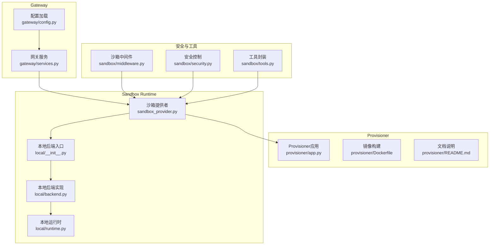
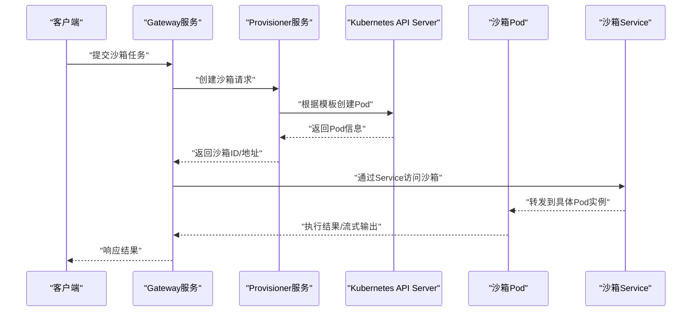
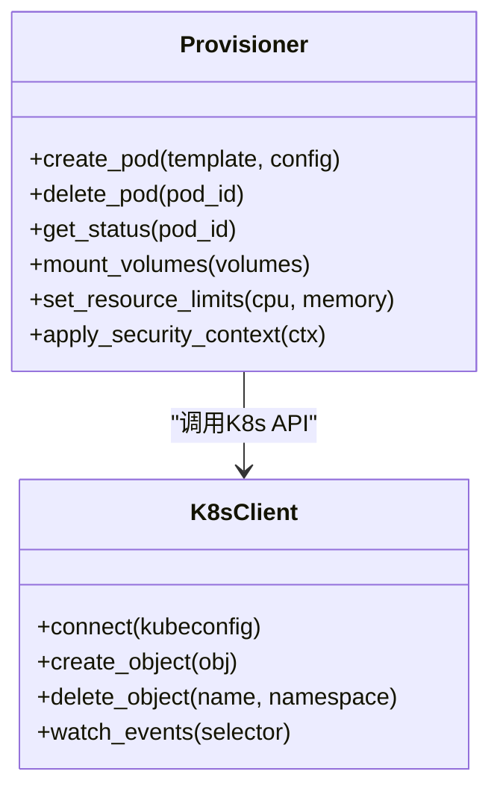
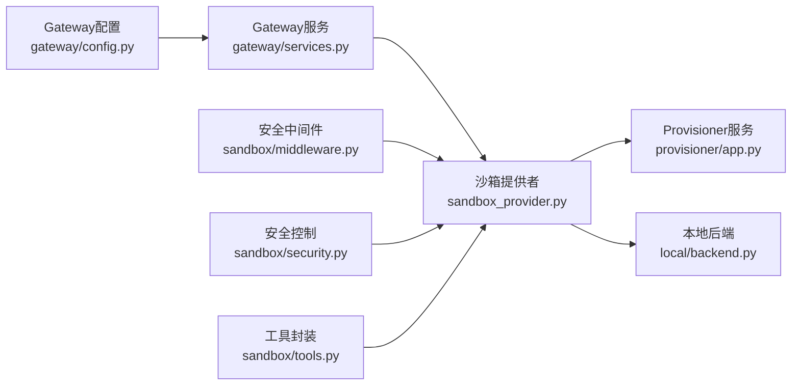

# Kubernetes集成

<cite>
**本文引用的文件**   
- [backend/app/gateway/config.py](file://backend/app/gateway/config.py)
- [backend/app/gateway/services.py](file://backend/app/gateway/services.py)
- [docker/provisioner/app.py](file://docker/provisioner/app.py)
- [docker/provisioner/Dockerfile](file://docker/provisioner/Dockerfile)
- [docker/provisioner/README.md](file://docker/provisioner/README.md)
- [backend/packages/harness/deerflow/sandbox/sandbox_provider.py](file://backend/packages/harness/deerflow/sandbox/sandbox_provider.py)
- [backend/packages/harness/deerflow/sandbox/local/__init__.py](file://backend/packages/harness/deerflow/sandbox/local/__init__.py)
- [backend/packages/harness/deerflow/sandbox/local/backend.py](file://backend/packages/harness/deerflow/sandbox/local/backend.py)
- [backend/packages/harness/deerflow/sandbox/local/runtime.py](file://backend/packages/harness/deerflow/sandbox/local/runtime.py)
- [backend/packages/harness/deerflow/sandbox/middleware.py](file://backend/packages/harness/deerflow/sandbox/middleware.py)
- [backend/packages/harness/deerflow/sandbox/security.py](file://backend/packages/harness/deerflow/sandbox/security.py)
- [backend/packages/harness/deerflow/sandbox/tools.py](file://backend/packages/harness/deerflow/sandbox/tools.py)
- [backend/tests/test_provisioner_kubeconfig.py](file://backend/tests/test_provisioner_kubeconfig.py)
- [backend/tests/test_provisioner_pvc_volumes.py](file://backend/tests/test_provisioner_pvc_volumes.py)
- [backend/tests/test_aio_sandbox.py](file://backend/tests/test_aio_sandbox.py)
- [backend/tests/test_aio_sandbox_local_backend.py](file://backend/tests/test_aio_sandbox_local_backend.py)
- [backend/tests/test_aio_sandbox_provider.py](file://backend/tests/test_aio_sandbox_provider.py)
- [backend/tests/test_docker_sandbox_mode_detection.py](file://backend/tests/test_docker_sandbox_mode检测.py)
- [backend/tests/test_sandbox_orphan_reconciliation.py](file://backend/tests/test_sandbox_orphan_reconciliation.py)
- [backend/tests/test_sandbox_orphan_reconciliation_e2e.py](file://backend/tests/test_sandbox_orphan_reconciliation_e2e.py)
- [backend/tests/test_sandbox_tools_security.py](file://backend/tests/test_sandbox_tools_security.py)
- [backend/tests/test_local_sandbox_provider_mounts.py](file://backend/tests/test_local_sandbox_provider_mounts.py)
- [backend/tests/test_sandbox_audit_middleware.py](file://backend/tests/test_sandbox_audit_middleware.py)
- [backend/tests/test_sandbox_search_tools.py](file://backend/tests/test_sandbox_search_tools.py)
- [backend/tests/test_stream_bridge.py](file://backend/tests/test_stream_bridge.py)
- [backend/tests/test_tracing_factory.py](file://backend/tests/test_tracing_factory.py)
- [backend/tests/test_tracing_config.py](file://backend/tests/test_tracing_config.py)
- [backend/docs/ARCHITECTURE.md](file://backend/docs/ARCHITECTURE.md)
- [backend/docs/STREAMING.md](file://backend/docs/STREAMING.md)
- [backend/docs/MCP_SERVER.md](file://backend/docs/MCP_SERVER.md)
- [backend/docs/GUARDRAILS.md](file://backend/docs/GUARDRAILS.md)
- [backend/docs/CONFIGURATION.md](file://backend/docs/CONFIGURATION.md)
- [backend/docs/README.md](file://backend/docs/README.md)
- [backend/README.md](file://backend/README.md)
- [docker/docker-compose.yaml](file://docker/docker-compose.yaml)
- [docker/docker-compose-dev.yaml](file://docker/docker-compose-dev.yaml)
</cite>

## 目录
1. [简介](#简介)
2. [项目结构](#项目结构)
3. [核心组件](#核心组件)
4. [架构总览](#架构总览)
5. [详细组件分析](#详细组件分析)
6. [依赖关系分析](#依赖关系分析)
7. [性能与扩缩容](#性能与扩缩容)
8. [监控、日志与故障诊断](#监控日志与故障诊断)
9. [结论](#结论)
10. [附录](#附录)

## 简介
本文件面向在Kubernetes集群中部署和运行DeerFlow沙箱的工程师，聚焦以下目标：
- 解释Provisioner服务在Kubernetes中的职责与部署方式
- 说明Pod模板配置、资源请求/限制、安全上下文设置
- 介绍存储卷使用（临时存储、持久化存储、配置映射）
- 阐述网络策略与服务发现机制，确保沙箱间通信安全可控
- 提供Helm Chart或Kustomize部署示例思路
- 给出扩缩容策略与高可用配置建议
- 提供监控、日志收集与故障诊断方法

## 项目结构
与Kubernetes集成相关的代码主要分布在以下位置：
- Gateway层：负责沙箱生命周期编排、配置加载、对外API暴露
- Provisioner服务：独立进程，负责根据请求创建/销毁沙箱Pod
- Sandbox运行时：本地/远程后端抽象，支持Docker/Kubernetes等后端
- 测试用例：覆盖kubeconfig、PVC挂载、审计中间件、孤儿回收等场景

图表来源
- [backend/app/gateway/config.py](file://backend/app/gateway/config.py)
- [backend/app/gateway/services.py](file://backend/app/gateway/services.py)
- [docker/provisioner/app.py](file://docker/provisioner/app.py)
- [docker/provisioner/Dockerfile](file://docker/provisioner/Dockerfile)
- [docker/provisioner/README.md](file://docker/provisioner/README.md)
- [backend/packages/harness/deerflow/sandbox/sandbox_provider.py](file://backend/packages/harness/deerflow/sandbox/sandbox_provider.py)
- [backend/packages/harness/deerflow/sandbox/local/__init__.py](file://backend/packages/harness/deerflow/sandbox/local/__init__.py)
- [backend/packages/harness/deerflow/sandbox/local/backend.py](file://backend/packages/harness/deerflow/sandbox/local/backend.py)
- [backend/packages/harness/deerflow/sandbox/local/runtime.py](file://backend/packages/harness/deerflow/sandbox/local/runtime.py)
- [backend/packages/harness/deerflow/sandbox/middleware.py](file://backend/packages/harness/deerflow/sandbox/middleware.py)
- [backend/packages/harness/deerflow/sandbox/security.py](file://backend/packages/harness/deerflow/sandbox/security.py)
- [backend/packages/harness/deerflow/sandbox/tools.py](file://backend/packages/harness/deerflow/sandbox/tools.py)

章节来源
- [backend/docs/ARCHITECTURE.md](file://backend/docs/ARCHITECTURE.md)
- [backend/README.md](file://backend/README.md)

## 核心组件
- 沙箱提供者（Sandbox Provider）
  - 统一抽象不同后端（本地、Docker、Kubernetes），对外暴露创建/销毁/状态查询接口
  - 通过配置选择后端类型，并注入对应实现
- Provisioner服务
  - 作为独立的沙箱编排服务，接收来自Gateway的请求，调用Kubernetes API创建/管理Pod
  - 支持kubeconfig、命名空间、标签、注解、资源配额、存储卷、安全上下文等参数
- 本地后端（Local Backend）
  - 用于开发调试，模拟Kubernetes行为，便于快速验证沙箱逻辑
- 安全与中间件
  - 对沙箱执行进行审计、限流、输入输出校验、工具白名单等安全控制

章节来源
- [backend/packages/harness/deerflow/sandbox/sandbox_provider.py](file://backend/packages/harness/deerflow/sandbox/sandbox_provider.py)
- [docker/provisioner/app.py](file://docker/provisioner/app.py)
- [backend/packages/harness/deerflow/sandbox/local/__init__.py](file://backend/packages/harness/deerflow/sandbox/local/__init__.py)
- [backend/packages/harness/deerflow/sandbox/middleware.py](file://backend/packages/harness/deerflow/sandbox/middleware.py)
- [backend/packages/harness/deerflow/sandbox/security.py](file://backend/packages/harness/deerflow/sandbox/security.py)

## 架构总览
下图展示了Gateway、Provisioner与Kubernetes集群之间的交互流程。Gateway将沙箱任务委托给Provisioner，后者基于Pod模板创建Pod，并通过Service发现与沙箱容器通信。

图表来源
- [backend/app/gateway/services.py](file://backend/app/gateway/services.py)
- [docker/provisioner/app.py](file://docker/provisioner/app.py)

## 详细组件分析

### Provisioner服务（Kubernetes沙箱编排）
- 职责
  - 解析沙箱创建请求，生成Kubernetes Pod对象
  - 管理Pod生命周期（启动、停止、健康检查、清理）
  - 处理存储卷挂载（临时存储、持久化存储、配置映射）
  - 注入安全上下文与资源限制
- 关键配置项
  - kubeconfig路径或环境变量
  - 命名空间、标签、注解
  - 资源请求/限制（CPU、内存）
  - 存储卷类型与挂载点
  - 安全上下文（用户、权限、只读根文件系统）
- 部署建议
  - 以Deployment形式部署，副本数≥2以实现高可用
  - 使用HorizontalPodAutoscaler按CPU/内存或自定义指标自动扩缩容
  - 结合ClusterRole/Role绑定最小权限RBAC

章节来源
- [docker/provisioner/app.py](file://docker/provisioner/app.py)
- [docker/provisioner/Dockerfile](file://docker/provisioner/Dockerfile)
- [docker/provisioner/README.md](file://docker/provisioner/README.md)
- [backend/tests/test_provisioner_kubeconfig.py](file://backend/tests/test_provisioner_kubeconfig.py)
- [backend/tests/test_provisioner_pvc_volumes.py](file://backend/tests/test_provisioner_pvc_volumes.py)

#### Provisioner类图（概念映射）

图表来源
- [docker/provisioner/app.py](file://docker/provisioner/app.py)

### 沙箱提供者（Sandbox Provider）
- 职责
  - 抽象后端差异，统一创建/销毁/查询接口
  - 根据配置选择Kubernetes或本地后端
  - 与Provisioner协作完成Pod生命周期管理
- 关键能力
  - 动态后端切换
  - 错误重试与超时控制
  - 与中间件集成（审计、限流、安全）

章节来源
- [backend/packages/harness/deerflow/sandbox/sandbox_provider.py](file://backend/packages/harness/deerflow/sandbox/sandbox_provider.py)
- [backend/tests/test_aio_sandbox_provider.py](file://backend/tests/test_aio_sandbox_provider.py)

### 本地后端（Local Backend）
- 用途
  - 开发调试环境快速验证沙箱逻辑
  - 模拟Kubernetes行为，减少外部依赖
- 特点
  - 轻量级，无需真实K8s集群
  - 支持基本挂载与安全上下文模拟

章节来源
- [backend/packages/harness/deerflow/sandbox/local/__init__.py](file://backend/packages/harness/deerflow/sandbox/local/__init__.py)
- [backend/packages/harness/deerflow/sandbox/local/backend.py](file://backend/packages/harness/deerflow/sandbox/local/backend.py)
- [backend/packages/harness/deerflow/sandbox/local/runtime.py](file://backend/packages/harness/deerflow/sandbox/local/runtime.py)
- [backend/tests/test_aio_sandbox_local_backend.py](file://backend/tests/test_aio_sandbox_local_backend.py)

### 安全与中间件
- 审计中间件
  - 记录沙箱创建、执行、销毁事件
  - 输出结构化日志，便于集中采集与分析
- 安全控制
  - 工具白名单、命令过滤、网络访问限制
  - 输入输出大小限制、敏感信息脱敏
- 工具封装
  - 对危险操作进行包装与校验

章节来源
- [backend/packages/harness/deerflow/sandbox/middleware.py](file://backend/packages/harness/deerflow/sandbox/middleware.py)
- [backend/packages/harness/deerflow/sandbox/security.py](file://backend/packages/harness/deerflow/sandbox/security.py)
- [backend/packages/harness/deerflow/sandbox/tools.py](file://backend/packages/harness/deerflow/sandbox/tools.py)
- [backend/tests/test_sandbox_audit_middleware.py](file://backend/tests/test_sandbox_audit_middleware.py)
- [backend/tests/test_sandbox_tools_security.py](file://backend/tests/test_sandbox_tools_security.py)

### 存储卷使用指南
- 临时存储
  - 使用emptyDir或hostPath，适用于无状态计算任务
- 持久化存储
  - 使用PersistentVolumeClaim（PVC），支持数据共享与跨Pod复用
- 配置映射
  - 使用ConfigMap注入配置文件，避免硬编码
- 挂载策略
  - 只读挂载提升安全性
  - 按需挂载减少资源占用

章节来源
- [backend/tests/test_provisioner_pvc_volumes.py](file://backend/tests/test_provisioner_pvc_volumes.py)
- [backend/tests/test_local_sandbox_provider_mounts.py](file://backend/tests/test_local_sandbox_provider_mounts.py)

### 网络策略与服务发现
- 服务发现
  - 为每个沙箱Pod创建Headless Service或使用DNS名称直接访问
- 网络策略
  - 默认拒绝所有入站流量，仅开放必要端口
  - 限制沙箱Pod与外部网络的通信范围
- 内部通信
  - 通过ClusterIP Service聚合多个沙箱实例，实现负载均衡

章节来源
- [backend/tests/test_aio_sandbox.py](file://backend/tests/test_aio_sandbox.py)
- [backend/tests/test_stream_bridge.py](file://backend/tests/test_stream_bridge.py)

### 扩缩容与高可用
- 水平扩缩容
  - 使用HPA基于CPU/内存或自定义指标自动调整Provisioner副本数
- 高可用配置
  - 多副本部署+反亲和性规则，避免单点故障
  - 持久化存储采用多副本或云厂商高可用卷
- 优雅停机
  - 设置terminationGracePeriodSeconds，确保正在执行的沙箱任务可被安全终止

章节来源
- [docker/provisioner/app.py](file://docker/provisioner/app.py)
- [backend/tests/test_sandbox_orphan_reconciliation.py](file://backend/tests/test_sandbox_orphan_reconciliation.py)
- [backend/tests/test_sandbox_orphan_reconciliation_e2e.py](file://backend/tests/test_sandbox_orphan_reconciliation_e2e.py)

## 依赖关系分析

图表来源
- [backend/app/gateway/config.py](file://backend/app/gateway/config.py)
- [backend/app/gateway/services.py](file://backend/app/gateway/services.py)
- [backend/packages/harness/deerflow/sandbox/sandbox_provider.py](file://backend/packages/harness/deerflow/sandbox/sandbox_provider.py)
- [docker/provisioner/app.py](file://docker/provisioner/app.py)
- [backend/packages/harness/deerflow/sandbox/local/backend.py](file://backend/packages/harness/deerflow/sandbox/local/backend.py)
- [backend/packages/harness/deerflow/sandbox/middleware.py](file://backend/packages/harness/deerflow/sandbox/middleware.py)
- [backend/packages/harness/deerflow/sandbox/security.py](file://backend/packages/harness/deerflow/sandbox/security.py)
- [backend/packages/harness/deerflow/sandbox/tools.py](file://backend/packages/harness/deerflow/sandbox/tools.py)

章节来源
- [backend/app/gateway/config.py](file://backend/app/gateway/config.py)
- [backend/app/gateway/services.py](file://backend/app/gateway/services.py)
- [backend/packages/harness/deerflow/sandbox/sandbox_provider.py](file://backend/packages/harness/deerflow/sandbox/sandbox_provider.py)

## 性能与扩缩容
- 资源规划
  - 为沙箱Pod设置合理的CPU/内存请求与限制，避免资源争用
  - 使用LimitRange与ResourceQuota约束命名空间资源上限
- 扩缩容策略
  - 基于QPS、队列长度、CPU利用率等指标触发HPA
  - 针对长耗时任务，考虑Job或CronJob模式
- 高可用设计
  - 多副本+反亲和性，避免节点故障导致服务中断
  - 持久化存储选择高可用后端（如分布式块存储）

[本节为通用指导，不直接分析具体文件]

## 监控、日志与故障诊断
- 日志收集
  - 启用结构化日志，输出到stdout/stderr，由DaemonSet采集至集中式日志系统
  - 审计中间件记录关键事件，便于追溯
- 指标监控
  - 暴露Prometheus指标，监控沙箱数量、成功率、延迟、资源使用率
- 链路追踪
  - 集成OpenTelemetry或Jaeger，追踪跨服务调用链
- 故障诊断
  - 查看Pod事件与日志，定位启动失败、资源不足、网络不通等问题
  - 使用kubectl describe/pod logs/exec进行交互式排查
  - 关注孤儿沙箱回收任务，确保资源不被泄漏

章节来源
- [backend/tests/test_sandbox_audit_middleware.py](file://backend/tests/test_sandbox_audit_middleware.py)
- [backend/tests/test_tracing_factory.py](file://backend/tests/test_tracing_factory.py)
- [backend/tests/test_tracing_config.py](file://backend/tests/test_tracing_config.py)
- [backend/tests/test_sandbox_orphan_reconciliation.py](file://backend/tests/test_sandbox_orphan_reconciliation.py)
- [backend/tests/test_sandbox_orphan_reconciliation_e2e.py](file://backend/tests/test_sandbox_orphan_reconciliation_e2e.py)

## 结论
通过在Kubernetes中部署Provisioner服务并结合沙箱提供者抽象，DeerFlow能够在云原生环境中实现安全、可扩展的沙箱执行。配合合适的存储、网络策略、监控与扩缩容策略，可有效保障生产环境的稳定性与安全性。

[本节为总结性内容，不直接分析具体文件]

## 附录

### Helm Chart / Kustomize部署示例思路
- Helm Chart
  - 定义Provisioner Deployment、Service、HPA、RBAC等资源
  - 使用values.yaml管理kubeconfig、命名空间、资源限制、存储卷等参数
- Kustomize
  - 基于基础清单叠加patch，适配不同环境（dev/staging/prod）
  - 使用configMapGenerator注入配置，Secret管理敏感信息

[本节为概念性指导，不直接分析具体文件]

### 参考文档与测试用例
- 架构与设计文档
  - [backend/docs/ARCHITECTURE.md](file://backend/docs/ARCHITECTURE.md)
  - [backend/docs/STREAMING.md](file://backend/docs/STREAMING.md)
  - [backend/docs/MCP_SERVER.md](file://backend/docs/MCP_SERVER.md)
  - [backend/docs/GUARDRAILS.md](file://backend/docs/GUARDRAILS.md)
  - [backend/docs/CONFIGURATION.md](file://backend/docs/CONFIGURATION.md)
  - [backend/docs/README.md](file://backend/docs/README.md)
- Docker Compose示例
  - [docker/docker-compose.yaml](file://docker/docker-compose.yaml)
  - [docker/docker-compose-dev.yaml](file://docker/docker-compose-dev.yaml)

章节来源
- [backend/docs/ARCHITECTURE.md](file://backend/docs/ARCHITECTURE.md)
- [backend/docs/STREAMING.md](file://backend/docs/STREAMING.md)
- [backend/docs/MCP_SERVER.md](file://backend/docs/MCP_SERVER.md)
- [backend/docs/GUARDRAILS.md](file://backend/docs/GUARDRAILS.md)
- [backend/docs/CONFIGURATION.md](file://backend/docs/CONFIGURATION.md)
- [backend/docs/README.md](file://backend/docs/README.md)
- [docker/docker-compose.yaml](file://docker/docker-compose.yaml)
- [docker/docker-compose-dev.yaml](file://docker/docker-compose-dev.yaml)