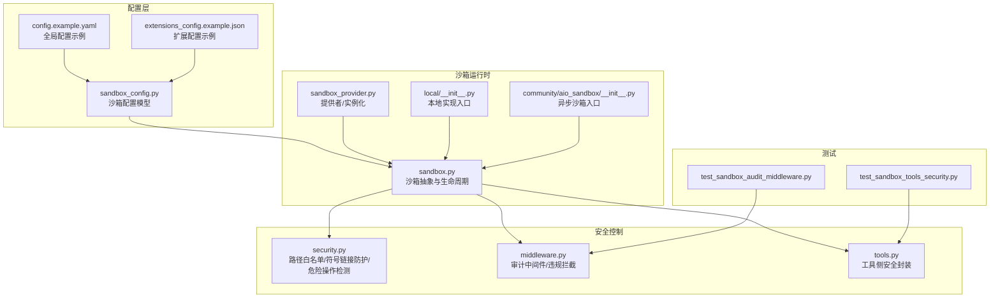
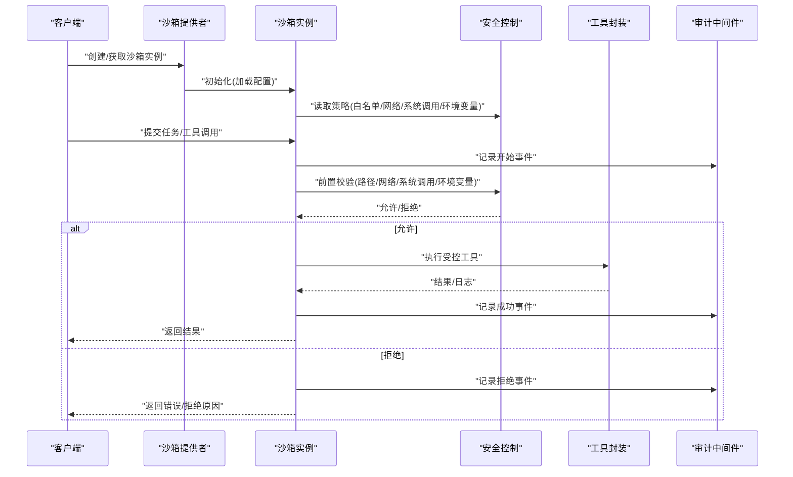
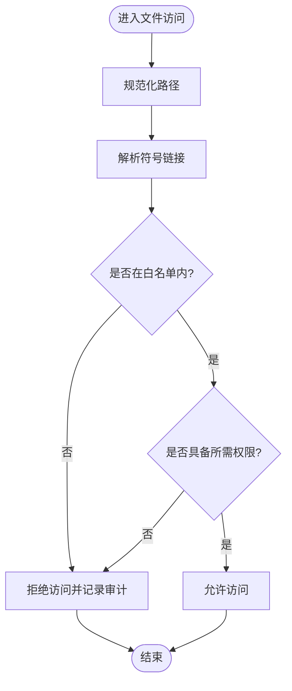
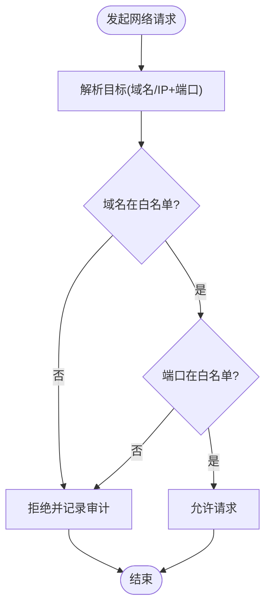
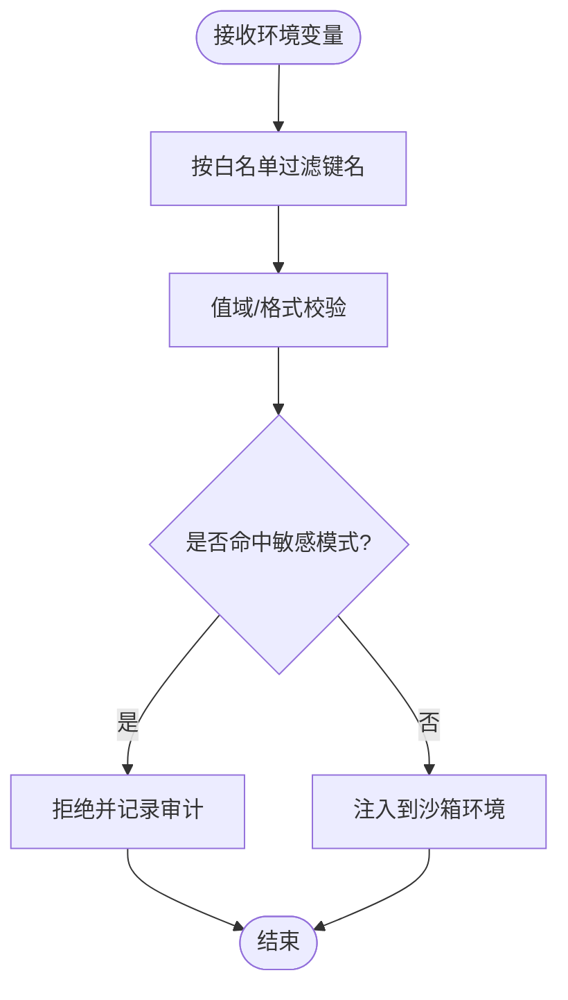
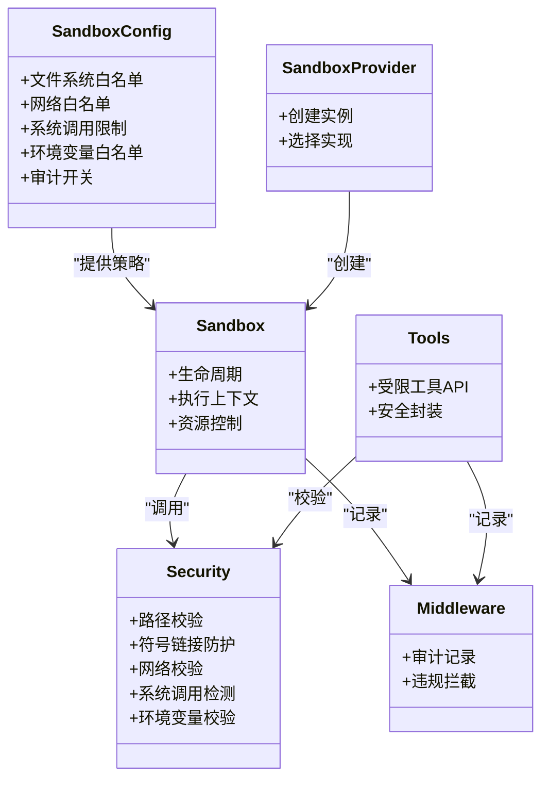

# 安全策略

<cite>
**本文引用的文件**   
- [sandbox_config.py](file://backend/packages/harness/deerflow/config/sandbox_config.py)
- [security.py](file://backend/packages/harness/deerflow/sandbox/security.py)
- [sandbox.py](file://backend/packages/harness/deerflow/sandbox/sandbox.py)
- [middleware.py](file://backend/packages/harness/deerflow/sandbox/middleware.py)
- [tools.py](file://backend/packages/harness/deerflow/sandbox/tools.py)
- [sandbox_provider.py](file://backend/packages/harness/deerflow/sandbox/sandbox_provider.py)
- [local/__init__.py](file://backend/packages/harness/deerflow/sandbox/local/__init__.py)
- [aio_sandbox/__init__.py](file://backend/packages/harness/deerflow/community/aio_sandbox/__init__.py)
- [test_sandbox_tools_security.py](file://backend/tests/test_sandbox_tools_security.py)
- [test_sandbox_audit_middleware.py](file://backend/tests/test_sandbox_audit_middleware.py)
- [config.example.yaml](file://config.example.yaml)
- [extensions_config.example.json](file://extensions_config.example.json)
</cite>

## 目录
1. [简介](#简介)
2. [项目结构](#项目结构)
3. [核心组件](#核心组件)
4. [架构总览](#架构总览)
5. [详细组件分析](#详细组件分析)
6. [依赖关系分析](#依赖关系分析)
7. [性能考虑](#性能考虑)
8. [故障排查指南](#故障排查指南)
9. [结论](#结论)
10. [附录](#附录)

## 简介
本指南面向在 Deer-Flow 中启用与配置沙箱安全策略的工程师与运维人员，围绕最小权限原则与纵深防御策略，系统阐述文件系统访问控制、网络访问控制、系统调用拦截与危险操作检测、环境变量注入校验与敏感信息保护、审计与告警等关键能力。文档同时提供可操作的配置示例与自定义安全规则开发指引，帮助在生产环境中构建高可用的安全沙箱执行环境。

## 项目结构
与安全策略相关的代码主要位于后端 harness 的沙箱模块与配置模块中，并通过测试用例验证行为与边界条件。下图给出与“安全策略”主题直接相关的核心文件与职责概览：

图表来源
- [sandbox_config.py:1-200](file://backend/packages/harness/deerflow/config/sandbox_config.py#L1-L200)
- [security.py:1-200](file://backend/packages/harness/deerflow/sandbox/security.py#L1-L200)
- [sandbox.py:1-200](file://backend/packages/harness/deerflow/sandbox/sandbox.py#L1-L200)
- [middleware.py:1-200](file://backend/packages/harness/deerflow/sandbox/middleware.py#L1-L200)
- [tools.py:1-200](file://backend/packages/harness/deerflow/sandbox/tools.py#L1-L200)
- [sandbox_provider.py:1-200](file://backend/packages/harness/deerflow/sandbox/sandbox_provider.py#L1-L200)
- [local/__init__.py:1-200](file://backend/packages/harness/deerflow/sandbox/local/__init__.py#L1-L200)
- [aio_sandbox/__init__.py:1-200](file://backend/packages/harness/deerflow/community/aio_sandbox/__init__.py#L1-L200)
- [test_sandbox_tools_security.py:1-200](file://backend/tests/test_sandbox_tools_security.py#L1-L200)
- [test_sandbox_audit_middleware.py:1-200](file://backend/tests/test_sandbox_audit_middleware.py#L1-L200)

章节来源
- [sandbox_config.py:1-200](file://backend/packages/harness/deerflow/config/sandbox_config.py#L1-L200)
- [security.py:1-200](file://backend/packages/harness/deerflow/sandbox/security.py#L1-L200)
- [sandbox.py:1-200](file://backend/packages/harness/deerflow/sandbox/sandbox.py#L1-L200)
- [middleware.py:1-200](file://backend/packages/harness/deerflow/sandbox/middleware.py#L1-L200)
- [tools.py:1-200](file://backend/packages/harness/deerflow/sandbox/tools.py#L1-L200)
- [sandbox_provider.py:1-200](file://backend/packages/harness/deerflow/sandbox/sandbox_provider.py#L1-L200)
- [local/__init__.py:1-200](file://backend/packages/harness/deerflow/sandbox/local/__init__.py#L1-L200)
- [aio_sandbox/__init__.py:1-200](file://backend/packages/harness/deerflow/community/aio_sandbox/__init__.py#L1-L200)
- [test_sandbox_tools_security.py:1-200](file://backend/tests/test_sandbox_tools_security.py#L1-L200)
- [test_sandbox_audit_middleware.py:1-200](file://backend/tests/test_sandbox_audit_middleware.py#L1-L200)

## 核心组件
- 配置模型（最小权限与策略开关）
  - 沙箱配置模型集中定义文件系统白名单、网络访问策略、系统调用限制、环境变量注入策略、审计开关等。通过配置文件或环境变量加载，为沙箱运行期提供统一策略源。
  - 参考路径：[sandbox_config.py](file://backend/packages/harness/deerflow/config/sandbox_config.py)

- 安全控制内核
  - 路径白名单与规范化校验、符号链接解析与防逃逸、危险系统调用与高危 API 检测、资源用量与超时控制。
  - 参考路径：[security.py](file://backend/packages/harness/deerflow/sandbox/security.py)

- 沙箱抽象与提供者
  - 沙箱抽象接口定义生命周期、执行上下文、资源隔离；提供者负责具体实现（本地/容器/异步）的创建与调度。
  - 参考路径：[sandbox.py](file://backend/packages/harness/deerflow/sandbox/sandbox.py)、[sandbox_provider.py](file://backend/packages/harness/deerflow/sandbox/sandbox_provider.py)、[local/__init__.py](file://backend/packages/harness/deerflow/sandbox/local/__init__.py)、[aio_sandbox/__init__.py](file://backend/packages/harness/deerflow/community/aio_sandbox/__init__.py)

- 审计与中间件
  - 在执行前后记录关键事件（启动、退出、异常、拒绝），对违规操作进行拦截并上报。
  - 参考路径：[middleware.py](file://backend/packages/harness/deerflow/sandbox/middleware.py)

- 工具侧安全封装
  - 将受限能力以工具形式暴露给上层，内部强制走安全校验与审计。
  - 参考路径：[tools.py](file://backend/packages/harness/deerflow/sandbox/tools.py)

- 测试与回归
  - 针对工具安全与审计中间件的单测覆盖关键路径与边界场景。
  - 参考路径：[test_sandbox_tools_security.py](file://backend/tests/test_sandbox_tools_security.py)、[test_sandbox_audit_middleware.py](file://backend/tests/test_sandbox_audit_middleware.py)

章节来源
- [sandbox_config.py:1-200](file://backend/packages/harness/deerflow/config/sandbox_config.py#L1-L200)
- [security.py:1-200](file://backend/packages/harness/deerflow/sandbox/security.py#L1-L200)
- [sandbox.py:1-200](file://backend/packages/harness/deerflow/sandbox/sandbox.py#L1-L200)
- [sandbox_provider.py:1-200](file://backend/packages/harness/deerflow/sandbox/sandbox_provider.py#L1-L200)
- [local/__init__.py:1-200](file://backend/packages/harness/deerflow/sandbox/local/__init__.py#L1-L200)
- [aio_sandbox/__init__.py:1-200](file://backend/packages/harness/deerflow/community/aio_sandbox/__init__.py#L1-L200)
- [middleware.py:1-200](file://backend/packages/harness/deerflow/sandbox/middleware.py#L1-L200)
- [tools.py:1-200](file://backend/packages/harness/deerflow/sandbox/tools.py#L1-L200)
- [test_sandbox_tools_security.py:1-200](file://backend/tests/test_sandbox_tools_security.py#L1-L200)
- [test_sandbox_audit_middleware.py:1-200](file://backend/tests/test_sandbox_audit_middleware.py#L1-L200)

## 架构总览
下图展示从请求进入、策略加载、安全校验到执行与审计的端到端流程。

图表来源
- [sandbox_provider.py:1-200](file://backend/packages/harness/deerflow/sandbox/sandbox_provider.py#L1-L200)
- [sandbox.py:1-200](file://backend/packages/harness/deerflow/sandbox/sandbox.py#L1-L200)
- [security.py:1-200](file://backend/packages/harness/deerflow/sandbox/security.py#L1-L200)
- [tools.py:1-200](file://backend/packages/harness/deerflow/sandbox/tools.py#L1-L200)
- [middleware.py:1-200](file://backend/packages/harness/deerflow/sandbox/middleware.py#L1-L200)

## 详细组件分析

### 安全模型与设计原则
- 最小权限原则
  - 默认拒绝：未显式允许的访问一律拒绝。
  - 按需授权：仅开放任务必需的最小路径、域名、端口、系统调用集与环境变量。
- 纵深防御
  - 多层校验：配置层→沙箱层→安全控制层→工具层→审计层。
  - 失败即拒：任一环节拒绝则终止执行并记录审计事件。
- 可观测性
  - 全链路审计：启动、执行、拒绝、异常均记录结构化事件，便于追踪与告警。

章节来源
- [sandbox_config.py:1-200](file://backend/packages/harness/deerflow/config/sandbox_config.py#L1-L200)
- [security.py:1-200](file://backend/packages/harness/deerflow/sandbox/security.py#L1-L200)
- [middleware.py:1-200](file://backend/packages/harness/deerflow/sandbox/middleware.py#L1-L200)

### 文件系统安全控制
- 路径白名单
  - 支持绝对路径与相对根路径组合，所有访问路径需经规范化与白名单匹配。
  - 建议将工作目录限定在只读挂载区与受控输出目录。
- 读写权限
  - 区分只读与读写目录；写操作需显式授权并落盘至受控目录。
- 符号链接防护
  - 禁止或严格校验符号链接目标，防止跨出白名单目录的逃逸。
- 典型流程

图表来源
- [security.py:1-200](file://backend/packages/harness/deerflow/sandbox/security.py#L1-L200)
- [sandbox_config.py:1-200](file://backend/packages/harness/deerflow/config/sandbox_config.py#L1-L200)

章节来源
- [security.py:1-200](file://backend/packages/harness/deerflow/sandbox/security.py#L1-L200)
- [sandbox_config.py:1-200](file://backend/packages/harness/deerflow/config/sandbox_config.py#L1-L200)

### 网络访问控制策略
- 出站连接限制
  - 默认禁止出站；仅允许白名单域名/IP 与指定端口。
- 域名过滤
  - 支持通配与精确匹配，优先匹配更具体的规则。
- 端口访问控制
  - 白名单端口集合，非白名单端口一律拒绝。
- 典型流程

图表来源
- [security.py:1-200](file://backend/packages/harness/deerflow/sandbox/security.py#L1-L200)
- [sandbox_config.py:1-200](file://backend/packages/harness/deerflow/config/sandbox_config.py#L1-L200)

章节来源
- [security.py:1-200](file://backend/packages/harness/deerflow/sandbox/security.py#L1-L200)
- [sandbox_config.py:1-200](file://backend/packages/harness/deerflow/config/sandbox_config.py#L1-L200)

### 系统调用拦截与危险操作检测
- 拦截范围
  - 高危系统调用（如进程创建、网络套接字、文件描述符越界、特权操作等）。
- 检测机制
  - 基于黑名单与动态启发式规则组合，结合资源用量阈值触发熔断。
- 处置策略
  - 立即拒绝并记录审计事件，必要时终止当前任务。

章节来源
- [security.py:1-200](file://backend/packages/harness/deerflow/sandbox/security.py#L1-L200)
- [middleware.py:1-200](file://backend/packages/harness/deerflow/sandbox/middleware.py#L1-L200)

### 环境变量注入的安全验证与敏感信息保护
- 注入白名单
  - 仅允许注入白名单中的键名，值域与格式需符合预期。
- 敏感信息保护
  - 禁止注入包含密钥、令牌等敏感模式的环境变量；若必须使用，应通过外部密钥管理服务注入且不在日志中明文出现。
- 校验流程

图表来源
- [sandbox_config.py:1-200](file://backend/packages/harness/deerflow/config/sandbox_config.py#L1-L200)
- [security.py:1-200](file://backend/packages/harness/deerflow/sandbox/security.py#L1-L200)

章节来源
- [sandbox_config.py:1-200](file://backend/packages/harness/deerflow/config/sandbox_config.py#L1-L200)
- [security.py:1-200](file://backend/packages/harness/deerflow/sandbox/security.py#L1-L200)

### 安全策略配置示例
- 全局配置示例
  - 参考仓库提供的示例文件，定位沙箱相关字段，设置路径白名单、网络白名单、系统调用限制、环境变量白名单与审计开关。
  - 参考路径：[config.example.yaml](file://config.example.yaml)
- 扩展配置示例
  - 如需启用特定扩展能力（如异步沙箱、MCP 集成等），可在扩展配置中声明并配合安全策略生效。
  - 参考路径：[extensions_config.example.json](file://extensions_config.example.json)
- 配置项说明要点
  - 文件系统：白名单路径、读写分离、符号链接策略。
  - 网络：出站白名单（域名/IP）、端口列表、协议限制。
  - 系统调用：黑名单/白名单、资源上限、超时。
  - 环境变量：注入白名单、敏感模式屏蔽。
  - 审计：开启/关闭、输出通道、告警级别。

章节来源
- [config.example.yaml:1-200](file://config.example.yaml#L1-L200)
- [extensions_config.example.json:1-200](file://extensions_config.example.json#L1-L200)
- [sandbox_config.py:1-200](file://backend/packages/harness/deerflow/config/sandbox_config.py#L1-L200)

### 自定义安全规则开发指南
- 扩展点
  - 在安全控制模块中新增规则处理器，遵循统一的输入/输出契约与错误语义。
  - 在工具封装层增加新的受限工具时，确保其内部调用全部经过安全校验与审计。
- 开发步骤
  - 定义规则数据结构与校验逻辑。
  - 注册到安全控制管线，保证顺序执行与短路拒绝。
  - 补充单元测试，覆盖正常与拒绝分支。
- 参考位置
  - 安全控制：[security.py](file://backend/packages/harness/deerflow/sandbox/security.py)
  - 工具封装：[tools.py](file://backend/packages/harness/deerflow/sandbox/tools.py)
  - 测试样例：[test_sandbox_tools_security.py](file://backend/tests/test_sandbox_tools_security.py)

章节来源
- [security.py:1-200](file://backend/packages/harness/deerflow/sandbox/security.py#L1-L200)
- [tools.py:1-200](file://backend/packages/harness/deerflow/sandbox/tools.py#L1-L200)
- [test_sandbox_tools_security.py:1-200](file://backend/tests/test_sandbox_tools_security.py#L1-L200)

### 安全审计与违规监控告警
- 审计内容
  - 沙箱生命周期事件、工具调用、拒绝与异常、资源超限等。
- 告警策略
  - 基于审计事件类型与频率设定阈值，联动告警通道（如日志平台、消息队列）。
- 参考实现
  - 审计中间件：[middleware.py](file://backend/packages/harness/deerflow/sandbox/middleware.py)
  - 审计单测：[test_sandbox_audit_middleware.py](file://backend/tests/test_sandbox_audit_middleware.py)

章节来源
- [middleware.py:1-200](file://backend/packages/harness/deerflow/sandbox/middleware.py#L1-L200)
- [test_sandbox_audit_middleware.py:1-200](file://backend/tests/test_sandbox_audit_middleware.py#L1-L200)

## 依赖关系分析
- 组件耦合
  - 沙箱抽象依赖安全控制与审计中间件；提供者负责实例化与生命周期管理；工具封装作为对外暴露面，内部强依赖安全控制。
- 外部依赖
  - 配置加载来自 YAML/JSON 示例文件；运行时策略由配置模型驱动。
- 潜在风险
  - 避免在工具封装中绕过安全控制；审计事件需保持幂等与不可篡改。

图表来源
- [sandbox_config.py:1-200](file://backend/packages/harness/deerflow/config/sandbox_config.py#L1-L200)
- [security.py:1-200](file://backend/packages/harness/deerflow/sandbox/security.py#L1-L200)
- [sandbox.py:1-200](file://backend/packages/harness/deerflow/sandbox/sandbox.py#L1-L200)
- [sandbox_provider.py:1-200](file://backend/packages/harness/deerflow/sandbox/sandbox_provider.py#L1-L200)
- [middleware.py:1-200](file://backend/packages/harness/deerflow/sandbox/middleware.py#L1-L200)
- [tools.py:1-200](file://backend/packages/harness/deerflow/sandbox/tools.py#L1-L200)

章节来源
- [sandbox_config.py:1-200](file://backend/packages/harness/deerflow/config/sandbox_config.py#L1-L200)
- [security.py:1-200](file://backend/packages/harness/deerflow/sandbox/security.py#L1-L200)
- [sandbox.py:1-200](file://backend/packages/harness/deerflow/sandbox/sandbox.py#L1-L200)
- [sandbox_provider.py:1-200](file://backend/packages/harness/deerflow/sandbox/sandbox_provider.py#L1-L200)
- [middleware.py:1-200](file://backend/packages/harness/deerflow/sandbox/middleware.py#L1-L200)
- [tools.py:1-200](file://backend/packages/harness/deerflow/sandbox/tools.py#L1-L200)

## 性能考虑
- 策略缓存
  - 对频繁使用的白名单与规则进行内存缓存，减少重复计算。
- 短路与并行
  - 快速失败的校验优先执行；独立校验可并行化以提升吞吐。
- 资源限额
  - CPU/内存/IO/网络带宽限额，避免单个任务影响整体稳定性。
- 超时与重试
  - 合理设置超时与退避策略，避免雪崩。

## 故障排查指南
- 常见问题
  - 路径访问被拒绝：检查白名单与符号链接策略。
  - 网络请求被阻断：确认域名/IP与端口是否在白名单。
  - 环境变量注入失败：核对键名白名单与敏感模式屏蔽。
  - 审计无记录：检查审计中间件开关与输出通道。
- 定位方法
  - 查看审计事件日志，关注拒绝原因与堆栈。
  - 逐步缩小白名单范围，复现问题后回滚变更。
- 参考实现
  - 审计中间件与单测：[middleware.py](file://backend/packages/harness/deerflow/sandbox/middleware.py)、[test_sandbox_audit_middleware.py](file://backend/tests/test_sandbox_audit_middleware.py)

章节来源
- [middleware.py:1-200](file://backend/packages/harness/deerflow/sandbox/middleware.py#L1-L200)
- [test_sandbox_audit_middleware.py:1-200](file://backend/tests/test_sandbox_audit_middleware.py#L1-L200)

## 结论
通过将最小权限与纵深防御贯穿配置、沙箱、安全控制、工具与审计各层，Deer-Flow 提供了可配置、可扩展、可观测的沙箱安全体系。建议在生产环境严格采用默认拒绝策略，精细化白名单，并结合审计与告警形成闭环治理。

## 附录
- 相关文件索引
  - 配置模型：[sandbox_config.py](file://backend/packages/harness/deerflow/config/sandbox_config.py)
  - 安全控制：[security.py](file://backend/packages/harness/deerflow/sandbox/security.py)
  - 沙箱抽象与提供者：[sandbox.py](file://backend/packages/harness/deerflow/sandbox/sandbox.py)、[sandbox_provider.py](file://backend/packages/harness/deerflow/sandbox/sandbox_provider.py)
  - 本地与异步实现入口：[local/__init__.py](file://backend/packages/harness/deerflow/sandbox/local/__init__.py)、[aio_sandbox/__init__.py](file://backend/packages/harness/deerflow/community/aio_sandbox/__init__.py)
  - 审计中间件：[middleware.py](file://backend/packages/harness/deerflow/sandbox/middleware.py)
  - 工具封装：[tools.py](file://backend/packages/harness/deerflow/sandbox/tools.py)
  - 测试用例：[test_sandbox_tools_security.py](file://backend/tests/test_sandbox_tools_security.py)、[test_sandbox_audit_middleware.py](file://backend/tests/test_sandbox_audit_middleware.py)
  - 配置示例：[config.example.yaml](file://config.example.yaml)、[extensions_config.example.json](file://extensions_config.example.json)