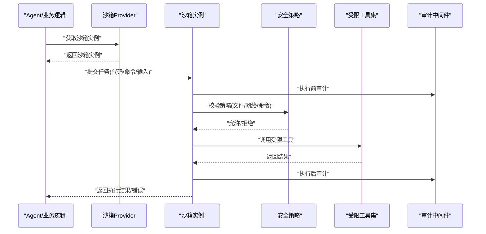
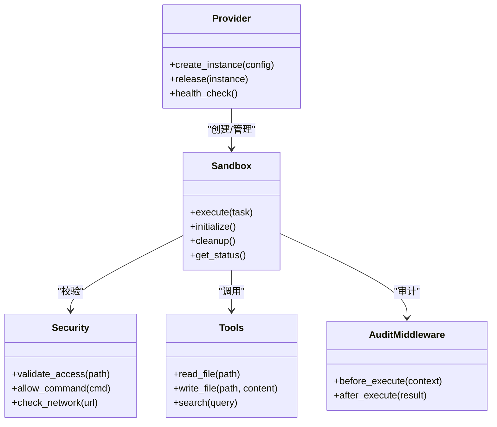
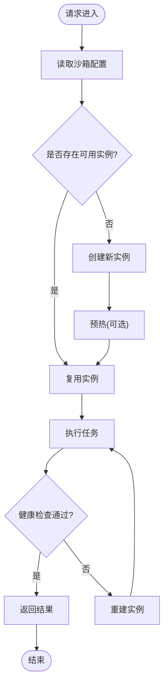
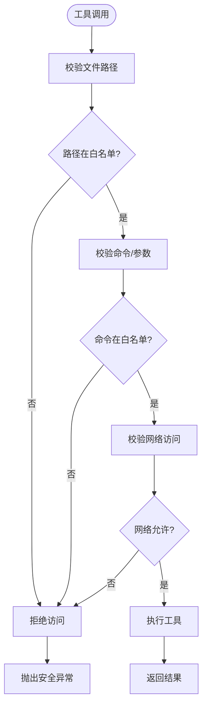
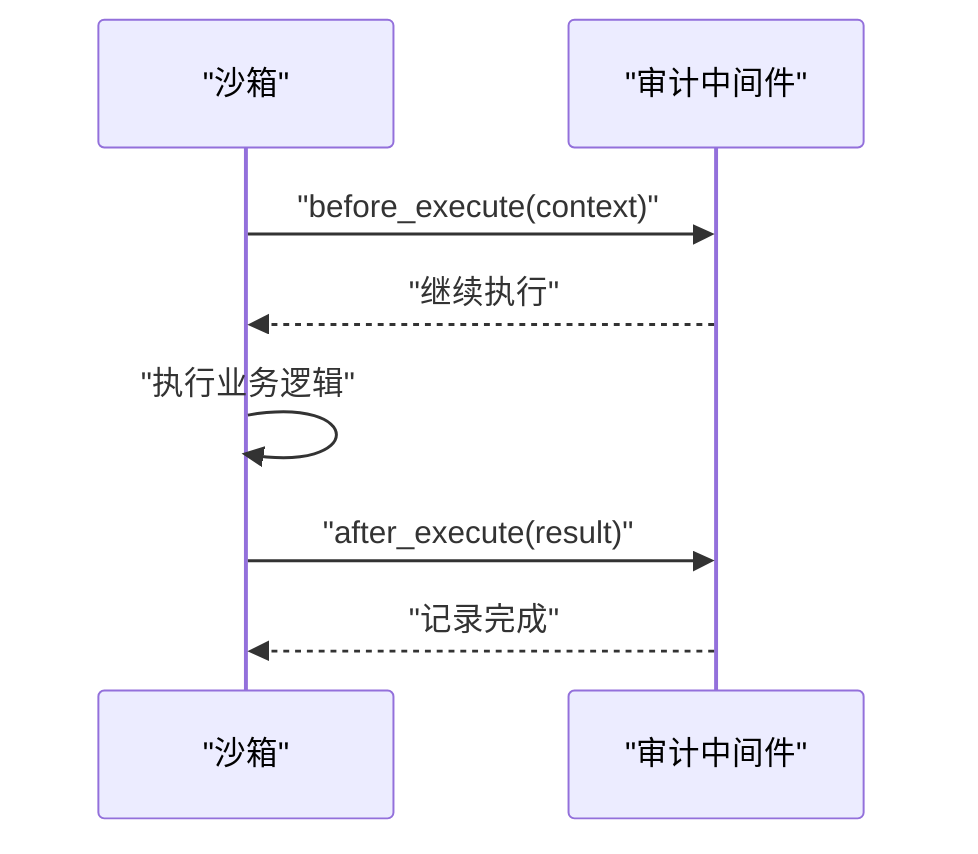
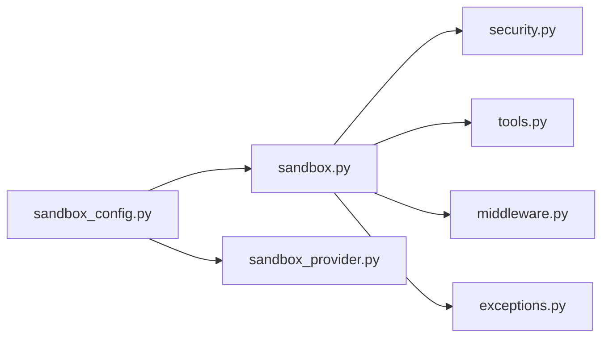

# BoxLite轻量级沙箱

<cite>
**本文引用的文件**   
- [sandbox.py](file://backend/packages/harness/deerflow/sandbox/sandbox.py)
- [sandbox_provider.py](file://backend/packages/harness/deerflow/sandbox/sandbox_provider.py)
- [security.py](file://backend/packages/harness/deerflow/sandbox/security.py)
- [tools.py](file://backend/packages/harness/deerflow/sandbox/tools.py)
- [middleware.py](file://backend/packages/harness/deerflow/sandbox/middleware.py)
- [exceptions.py](file://backend/packages/harness/deerflow/sandbox/exceptions.py)
- [sandbox_config.py](file://backend/packages/harness/deerflow/config/sandbox_config.py)
- [test_aio_sandbox.py](file://backend/tests/test_aio_sandbox.py)
- [test_aio_sandbox_local_backend.py](file://backend/tests/test_aio_sandbox_local_backend.py)
- [test_aio_sandbox_provider.py](file://backend/tests/test_aio_sandbox_provider.py)
- [test_local_sandbox_encoding.py](file://backend/tests/test_local_sandbox_encoding.py)
- [test_local_sandbox_provider_mounts.py](file://backend/tests/test_local_sandbox_provider_mounts.py)
- [test_sandbox_audit_middleware.py](file://backend/tests/test_sandbox_audit_middleware.py)
- [test_sandbox_orphan_reconciliation.py](file://backend/tests/test_sandbox_orphan_reconciliation.py)
- [test_sandbox_orphan_reconciliation_e2e.py](file://backend/tests/test_sandbox_orphan_reconciliation_e2e.py)
- [test_sandbox_search_tools.py](file://backend/tests/test_sandbox_search_tools.py)
- [test_sandbox_tools_security.py](file://backend/tests/test_sandbox_tools_security.py)
</cite>

## 目录
1. [简介](#简介)
2. [项目结构](#项目结构)
3. [核心组件](#核心组件)
4. [架构总览](#架构总览)
5. [详细组件分析](#详细组件分析)
6. [依赖关系分析](#依赖关系分析)
7. [性能考量](#性能考量)
8. [故障诊断指南](#故障诊断指南)
9. [结论](#结论)
10. [附录](#附录)

## 简介
BoxLite是DeerFlow框架中的轻量级代码执行沙箱，旨在为不可信代码提供安全、隔离且低开销的执行环境。其设计理念强调：
- 轻量级容器化与快速启动：通过最小化的运行时和进程模型，降低冷启动时延与资源占用。
- 强隔离与安全策略：文件系统、网络、系统调用等维度进行限制，结合白名单工具集与审计中间件保障执行安全。
- 可插拔Provider：以统一接口对接不同后端（本地进程、远程服务或未来容器），便于扩展与部署。
- 与DeerFlow深度集成：作为Agent工具链的受控执行层，支撑搜索、文件操作、脚本运行等能力。

本文件面向开发者与运维人员，覆盖安装部署、配置选项、核心功能、Provider集成、性能分析与排障方法。

## 项目结构
与BoxLite相关的核心代码位于后端包的sandbox子模块中，并配套有配置定义与测试用例：
- sandbox：沙箱抽象、Provider实现、安全策略、工具封装、审计中间件与异常类型
- config：沙箱配置模型与默认值
- tests：针对沙箱生命周期、编码、挂载、审计、孤儿回收、搜索工具与安全性的端到端与单元测试

```mermaid
graph TB
subgraph "DeerFlow 后端"
A["sandbox/sandbox.py<br/>沙箱抽象与基础能力"]
B["sandbox/sandbox_provider.py<br/>Provider接口与实例管理"]
C["sandbox/security.py<br/>安全策略与约束"]
D["sandbox/tools.py<br/>受限工具集"]
E["sandbox/middleware.py<br/>审计与拦截中间件"]
F["sandbox/exceptions.py<br/>沙箱异常类型"]
G["config/sandbox_config.py<br/>沙箱配置模型"]
end
subgraph "测试"
T1["tests/test_aio_sandbox.py"]
T2["tests/test_aio_sandbox_local_backend.py"]
T3["tests/test_aio_sandbox_provider.py"]
T4["tests/test_local_sandbox_encoding.py"]
T5["tests/test_local_sandbox_provider_mounts.py"]
T6["tests/test_sandbox_audit_middleware.py"]
T7["tests/test_sandbox_orphan_reconciliation.py"]
T8["tests/test_sandbox_orphan_reconciliation_e2e.py"]
T9["tests/test_sandbox_search_tools.py"]
T10["tests/test_sandbox_tools_security.py"]
end
A --> B
A --> C
A --> D
A --> E
A --> F
G --> A
G --> B
T1 --> A
T2 --> A
T3 --> B
T4 --> A
T5 --> B
T6 --> E
T7 --> B
T8 --> B
T9 --> D
T10 --> D
```

图表来源
- [sandbox.py](file://backend/packages/harness/deerflow/sandbox/sandbox.py)
- [sandbox_provider.py](file://backend/packages/harness/deerflow/sandbox/sandbox_provider.py)
- [security.py](file://backend/packages/harness/deerflow/sandbox/security.py)
- [tools.py](file://backend/packages/harness/deerflow/sandbox/tools.py)
- [middleware.py](file://backend/packages/harness/deerflow/sandbox/middleware.py)
- [exceptions.py](file://backend/packages/harness/deerflow/sandbox/exceptions.py)
- [sandbox_config.py](file://backend/packages/harness/deerflow/config/sandbox_config.py)
- [test_aio_sandbox.py](file://backend/tests/test_aio_sandbox.py)
- [test_aio_sandbox_local_backend.py](file://backend/tests/test_aio_sandbox_local_backend.py)
- [test_aio_sandbox_provider.py](file://backend/tests/test_aio_sandbox_provider.py)
- [test_local_sandbox_encoding.py](file://backend/tests/test_local_sandbox_encoding.py)
- [test_local_sandbox_provider_mounts.py](file://backend/tests/test_local_sandbox_provider_mounts.py)
- [test_sandbox_audit_middleware.py](file://backend/tests/test_sandbox_audit_middleware.py)
- [test_sandbox_orphan_reconciliation.py](file://backend/tests/test_sandbox_orphan_reconciliation.py)
- [test_sandbox_orphan_reconciliation_e2e.py](file://backend/tests/test_sandbox_orphan_reconciliation_e2e.py)
- [test_sandbox_search_tools.py](file://backend/tests/test_sandbox_search_tools.py)
- [test_sandbox_tools_security.py](file://backend/tests/test_sandbox_tools_security.py)

章节来源
- [sandbox.py](file://backend/packages/harness/deerflow/sandbox/sandbox.py)
- [sandbox_provider.py](file://backend/packages/harness/deerflow/sandbox/sandbox_provider.py)
- [security.py](file://backend/packages/harness/deerflow/sandbox/security.py)
- [tools.py](file://backend/packages/harness/deerflow/sandbox/tools.py)
- [middleware.py](file://backend/packages/harness/deerflow/sandbox/middleware.py)
- [exceptions.py](file://backend/packages/harness/deerflow/sandbox/exceptions.py)
- [sandbox_config.py](file://backend/packages/harness/deerflow/config/sandbox_config.py)

## 核心组件
- 沙箱抽象与基础能力：定义统一的执行接口、上下文、结果结构与生命周期钩子，屏蔽底层差异。
- Provider接口与实例管理：负责创建、复用、销毁沙箱实例，支持多后端切换与连接池。
- 安全策略：对文件系统访问、命令白名单、网络访问、资源配额等进行约束。
- 受限工具集：仅暴露安全的内置工具（如受限的文件读写、搜索、计算等）。
- 审计中间件：在执行前后记录关键事件，用于追踪与合规。
- 异常体系：区分超时、权限拒绝、资源不足、IO错误等，便于上层处理。
- 配置模型：集中管理沙箱行为参数，包括安全策略、资源限制、超时、日志级别等。

章节来源
- [sandbox.py](file://backend/packages/harness/deerflow/sandbox/sandbox.py)
- [sandbox_provider.py](file://backend/packages/harness/deerflow/sandbox/sandbox_provider.py)
- [security.py](file://backend/packages/harness/deerflow/sandbox/security.py)
- [tools.py](file://backend/packages/harness/deerflow/sandbox/tools.py)
- [middleware.py](file://backend/packages/harness/deerflow/sandbox/middleware.py)
- [exceptions.py](file://backend/packages/harness/deerflow/sandbox/exceptions.py)
- [sandbox_config.py](file://backend/packages/harness/deerflow/config/sandbox_config.py)

## 架构总览
BoxLite在DeerFlow中的角色是“受控执行层”，由Provider统一管理实例，Agent通过工具间接调用沙箱能力，审计中间件贯穿执行链路。

图表来源
- [sandbox_provider.py](file://backend/packages/harness/deerflow/sandbox/sandbox_provider.py)
- [sandbox.py](file://backend/packages/harness/deerflow/sandbox/sandbox.py)
- [security.py](file://backend/packages/harness/deerflow/sandbox/security.py)
- [tools.py](file://backend/packages/harness/deerflow/sandbox/tools.py)
- [middleware.py](file://backend/packages/harness/deerflow/sandbox/middleware.py)

## 详细组件分析

### 沙箱抽象与基础能力
- 职责：定义执行入口、上下文传递、结果封装、生命周期管理（初始化、预热、清理）。
- 设计要点：
  - 异步友好：支持异步执行与流式输出，适配高并发场景。
  - 可扩展：通过Provider与工具集解耦具体实现。
  - 健壮性：统一异常映射与错误码，便于上层降级与重试。

图表来源
- [sandbox.py](file://backend/packages/harness/deerflow/sandbox/sandbox.py)
- [sandbox_provider.py](file://backend/packages/harness/deerflow/sandbox/sandbox_provider.py)
- [security.py](file://backend/packages/harness/deerflow/sandbox/security.py)
- [tools.py](file://backend/packages/harness/deerflow/sandbox/tools.py)
- [middleware.py](file://backend/packages/harness/deerflow/sandbox/middleware.py)

章节来源
- [sandbox.py](file://backend/packages/harness/deerflow/sandbox/sandbox.py)

### Provider接口与实例管理
- 职责：根据配置创建并缓存沙箱实例，提供健康检查、优雅关闭与资源回收。
- 关键点：
  - 多后端支持：本地进程、远程服务等可通过同一接口接入。
  - 生命周期：预热减少冷启动延迟；空闲回收避免资源泄漏。
  - 并发控制：实例池大小、队列长度、超时退避等。

图表来源
- [sandbox_provider.py](file://backend/packages/harness/deerflow/sandbox/sandbox_provider.py)

章节来源
- [sandbox_provider.py](file://backend/packages/harness/deerflow/sandbox/sandbox_provider.py)

### 安全策略与受限工具集
- 安全策略：
  - 文件系统：路径白名单、只读挂载、禁止越权访问。
  - 命令白名单：仅允许预定义命令与参数模式。
  - 网络访问：域名/IP白名单、端口限制、协议过滤。
  - 资源配额：CPU、内存、磁盘I/O上限，防止滥用。
- 受限工具集：
  - 文件操作：受限的读写接口，自动校验路径与大小。
  - 搜索工具：基于内部索引或受限外部源的安全查询。
  - 计算工具：纯函数型计算，无副作用。

图表来源
- [security.py](file://backend/packages/harness/deerflow/sandbox/security.py)
- [tools.py](file://backend/packages/harness/deerflow/sandbox/tools.py)

章节来源
- [security.py](file://backend/packages/harness/deerflow/sandbox/security.py)
- [tools.py](file://backend/packages/harness/deerflow/sandbox/tools.py)

### 审计中间件
- 作用：在执行前后记录上下文、耗时、资源使用与结果摘要，便于追踪与合规。
- 内容：
  - 前置审计：记录任务ID、用户、工具、参数摘要。
  - 后置审计：记录状态码、耗时、错误信息、资源峰值。
  - 脱敏：敏感字段自动脱敏，避免泄露。

图表来源
- [middleware.py](file://backend/packages/harness/deerflow/sandbox/middleware.py)

章节来源
- [middleware.py](file://backend/packages/harness/deerflow/sandbox/middleware.py)

### 异常体系
- 分类：超时、权限拒绝、资源不足、IO错误、网络错误、未知错误等。
- 处理：统一映射到标准异常，携带错误码与提示，便于上层重试、降级与告警。

章节来源
- [exceptions.py](file://backend/packages/harness/deerflow/sandbox/exceptions.py)

### 配置模型
- 范围：安全策略、资源限制、执行超时、日志级别、Provider后端参数等。
- 特点：集中管理、默认值合理、支持热更新与校验。

章节来源
- [sandbox_config.py](file://backend/packages/harness/deerflow/config/sandbox_config.py)

## 依赖关系分析
- 内聚与耦合：
  - Sandbox与Provider松耦合，通过接口交互，利于替换后端。
  - Security与Tools被Sandbox组合使用，职责清晰。
  - AuditMiddleware横切关注点，不侵入业务逻辑。
- 外部依赖：
  - 文件系统、网络库、进程管理等系统能力通过安全策略进行约束。
- 潜在循环依赖：
  - 当前分层清晰，未见循环导入迹象。

图表来源
- [sandbox_config.py](file://backend/packages/harness/deerflow/config/sandbox_config.py)
- [sandbox.py](file://backend/packages/harness/deerflow/sandbox/sandbox.py)
- [sandbox_provider.py](file://backend/packages/harness/deerflow/sandbox/sandbox_provider.py)
- [security.py](file://backend/packages/harness/deerflow/sandbox/security.py)
- [tools.py](file://backend/packages/harness/deerflow/sandbox/tools.py)
- [middleware.py](file://backend/packages/harness/deerflow/sandbox/middleware.py)
- [exceptions.py](file://backend/packages/harness/deerflow/sandbox/exceptions.py)

章节来源
- [sandbox.py](file://backend/packages/harness/deerflow/sandbox/sandbox.py)
- [sandbox_provider.py](file://backend/packages/harness/deerflow/sandbox/sandbox_provider.py)
- [sandbox_config.py](file://backend/packages/harness/deerflow/config/sandbox_config.py)

## 性能考量
- 启动时间：
  - 通过Provider实例池与预热机制降低冷启动时延。
  - 建议按负载规模调整实例池大小与预热阈值。
- 内存占用：
  - 沙箱进程/容器应设置内存上限，避免OOM影响宿主。
  - 大对象输出需分页或流式传输，减少峰值内存。
- 并发能力：
  - 异步执行与队列限流提升吞吐。
  - 监控队列积压与超时率，动态扩缩容。
- I/O与网络：
  - 文件读写走只读镜像或缓存层，减少宿主机压力。
  - 网络访问走代理与白名单，避免长连接堆积。

[本节为通用指导，无需特定文件引用]

## 故障诊断指南
- 常见问题定位：
  - 启动失败：检查Provider健康检查与实例创建日志。
  - 执行超时：核对执行超时配置与任务复杂度，必要时拆分任务。
  - 权限拒绝：审查安全策略白名单与挂载路径。
  - 编码问题：确认输入输出编码一致，避免乱码。
  - 挂载异常：验证卷挂载路径与权限。
  - 审计缺失：检查中间件是否启用与日志通道。
  - 孤儿实例：观察回收策略与E2E流程是否生效。
- 调试建议：
  - 开启详细日志与审计输出。
  - 使用最小复现用例与单测覆盖。
  - 逐步放宽策略定位瓶颈。

章节来源
- [test_aio_sandbox.py](file://backend/tests/test_aio_sandbox.py)
- [test_aio_sandbox_local_backend.py](file://backend/tests/test_aio_sandbox_local_backend.py)
- [test_aio_sandbox_provider.py](file://backend/tests/test_aio_sandbox_provider.py)
- [test_local_sandbox_encoding.py](file://backend/tests/test_local_sandbox_encoding.py)
- [test_local_sandbox_provider_mounts.py](file://backend/tests/test_local_sandbox_provider_mounts.py)
- [test_sandbox_audit_middleware.py](file://backend/tests/test_sandbox_audit_middleware.py)
- [test_sandbox_orphan_reconciliation.py](file://backend/tests/test_sandbox_orphan_reconciliation.py)
- [test_sandbox_orphan_reconciliation_e2e.py](file://backend/tests/test_sandbox_orphan_reconciliation_e2e.py)
- [test_sandbox_search_tools.py](file://backend/tests/test_sandbox_search_tools.py)
- [test_sandbox_tools_security.py](file://backend/tests/test_sandbox_tools_security.py)

## 结论
BoxLite以轻量、安全、可插拔为核心，为DeerFlow提供了可靠的代码执行沙箱。通过Provider抽象、严格的安全策略与完善的审计机制，既保证了执行效率，又兼顾了安全性与可观测性。建议在生产环境中结合负载特征调优实例池、资源配额与超时策略，并持续完善审计与监控指标。

[本节为总结，无需特定文件引用]

## 附录
- 安装与部署（概念性说明）：
  - 依赖准备：确保Python环境与必要系统库就绪。
  - 配置初始化：加载沙箱配置，设置安全策略与资源限制。
  - 服务启动：启动Provider与网关，验证健康检查。
- 与DeerFlow集成（概念性说明）：
  - 通过Provider接口注册沙箱后端。
  - 在Agent工具链中引入受限工具集。
  - 启用审计中间件，接入日志与监控系统。

[本节为概念性说明，无需特定文件引用]