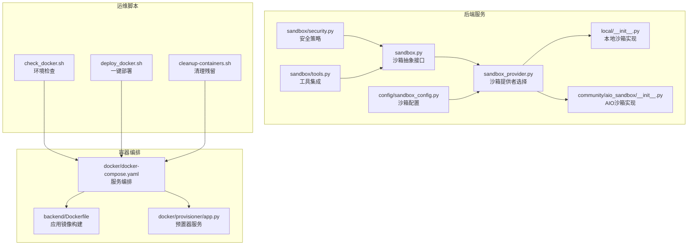
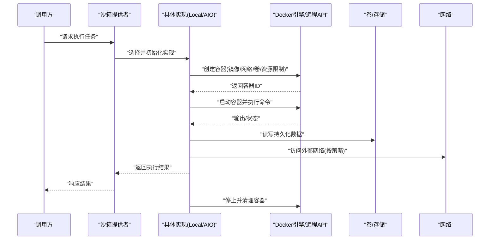
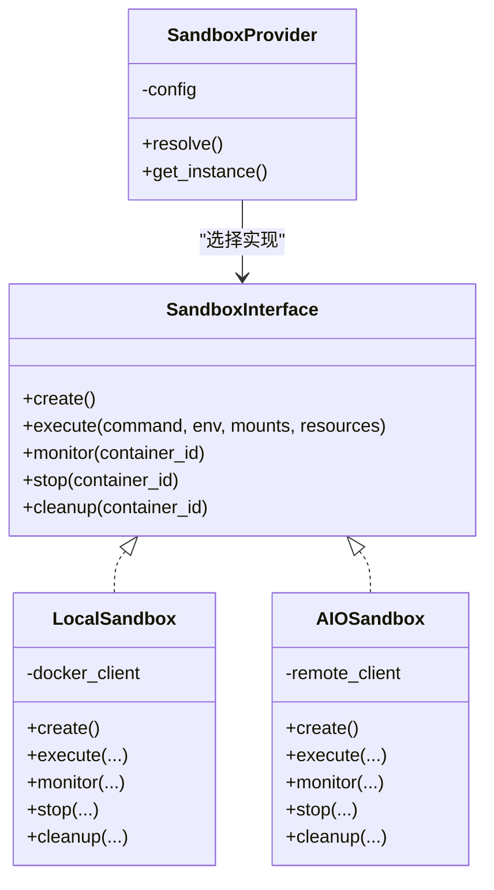
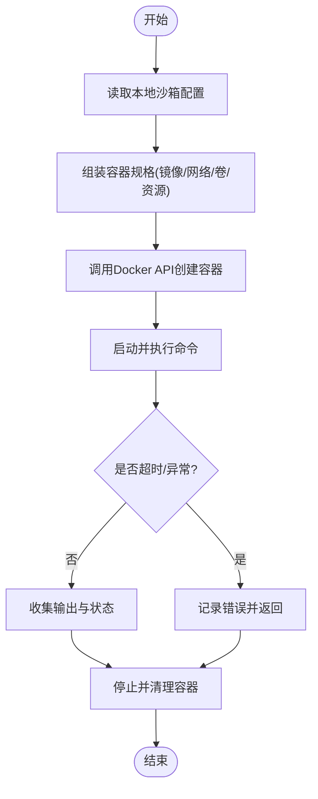
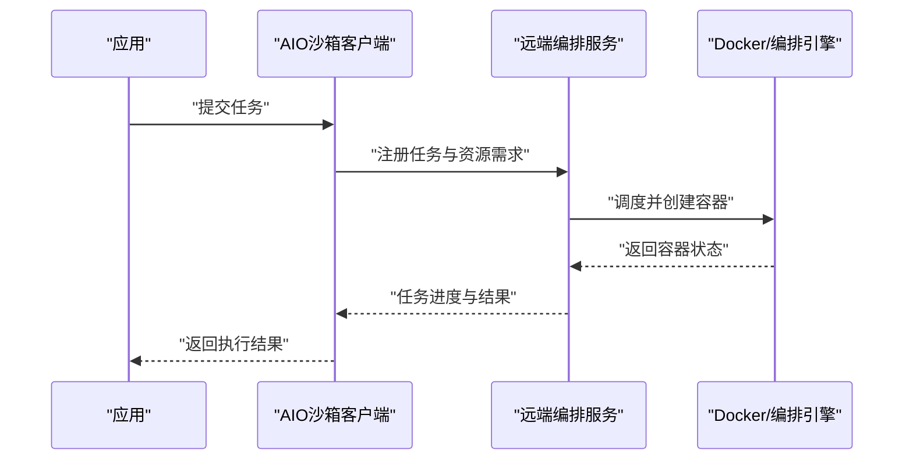
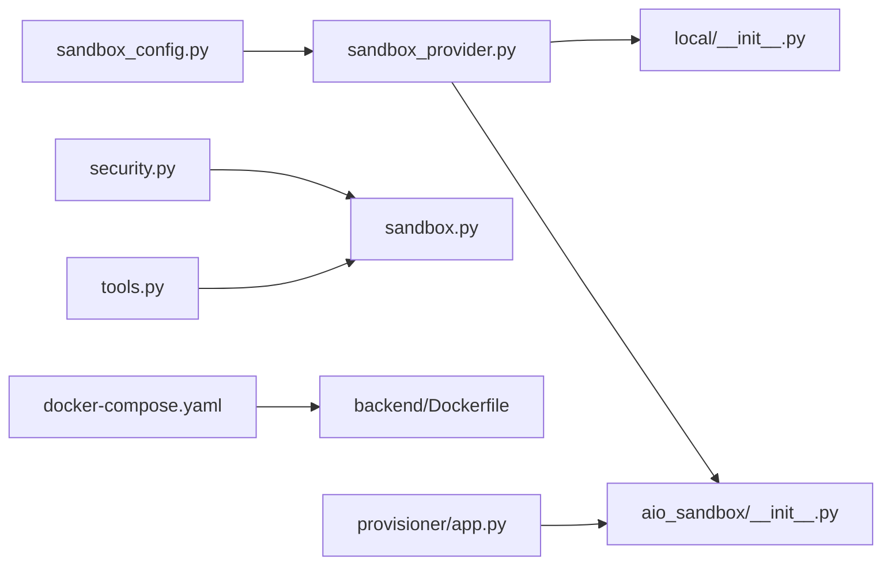
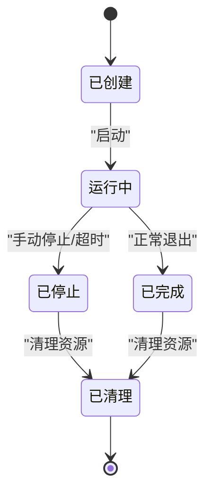

# Docker容器沙箱

<cite>
**本文引用的文件**   
- [sandbox.py](file://backend/packages/harness/deerflow/sandbox/sandbox.py)
- [sandbox_provider.py](file://backend/packages/harness/deerflow/sandbox/sandbox_provider.py)
- [local/__init__.py](file://backend/packages/harness/deerflow/sandbox/local/__init__.py)
- [aio_sandbox/__init__.py](file://backend/packages/harness/deerflow/community/aio_sandbox/__init__.py)
- [sandbox_config.py](file://backend/packages/harness/deerflow/config/sandbox_config.py)
- [security.py](file://backend/packages/harness/deerflow/sandbox/security.py)
- [tools.py](file://backend/packages/harness/deerflow/sandbox/tools.py)
- [docker-compose.yaml](file://docker/docker-compose.yaml)
- [Dockerfile](file://backend/Dockerfile)
- [provisioner/app.py](file://docker/provisioner/app.py)
- [check_docker.sh](file://agent/skills/smoke-test/scripts/check_docker.sh)
- [deploy_docker.sh](file://agent/skills/smoke-test/scripts/deploy_docker.sh)
- [cleanup-containers.sh](file://scripts/cleanup-containers.sh)
- [test_aio_sandbox.py](file://backend/tests/test_aio_sandbox.py)
- [test_local_sandbox_provider_mounts.py](file://backend/tests/test_local_sandbox_provider_mounts.py)
</cite>

## 目录
1. [简介](#简介)
2. [项目结构](#项目结构)
3. [核心组件](#核心组件)
4. [架构总览](#架构总览)
5. [详细组件分析](#详细组件分析)
6. [依赖关系分析](#依赖关系分析)
7. [性能与资源限制](#性能与资源限制)
8. [安全配置最佳实践](#安全配置最佳实践)
9. [生命周期管理](#生命周期管理)
10. [镜像管理与缓存](#镜像管理与缓存)
11. [容器间通信与数据共享](#容器间通信与数据共享)
12. [故障排查指南](#故障排查指南)
13. [结论](#结论)
14. [附录](#附录)

## 简介
本文件面向需要在生产或开发环境中使用Docker容器沙箱的用户与运维工程师，系统性地阐述AIO Sandbox与Local Sandbox的实现原理、架构设计、镜像策略、编排与资源限制、生命周期管理、通信与数据共享方案、安全加固要点以及性能调优与排障方法。文档以仓库中现有实现为依据，结合测试与部署脚本进行说明，帮助读者快速落地并稳定运行。

## 项目结构
与Docker容器沙箱相关的代码主要分布在以下位置：
- 沙箱抽象与提供者：backend/packages/harness/deerflow/sandbox/
- AIO Sandbox（远程/云端）：backend/packages/harness/deerflow/community/aio_sandbox/
- Local Sandbox（本地）：backend/packages/harness/deerflow/sandbox/local/
- 沙箱配置与安全：backend/packages/harness/deerflow/config/sandbox_config.py、backend/packages/harness/deerflow/sandbox/security.py
- 工具集成：backend/packages/harness/deerflow/sandbox/tools.py
- 容器编排与镜像：docker/docker-compose.yaml、backend/Dockerfile、docker/provisioner/app.py
- 部署与检查脚本：agent/skills/smoke-test/scripts/check_docker.sh、agent/skills/smoke-test/scripts/deploy_docker.sh、scripts/cleanup-containers.sh
- 测试用例：backend/tests/test_aio_sandbox.py、backend/tests/test_local_sandbox_provider_mounts.py

图表来源
- [sandbox.py:1-200](file://backend/packages/harness/deerflow/sandbox/sandbox.py#L1-L200)
- [sandbox_provider.py:1-200](file://backend/packages/harness/deerflow/sandbox/sandbox_provider.py#L1-L200)
- [local/__init__.py:1-200](file://backend/packages/harness/deerflow/sandbox/local/__init__.py#L1-L200)
- [aio_sandbox/__init__.py:1-200](file://backend/packages/harness/deerflow/community/aio_sandbox/__init__.py#L1-L200)
- [sandbox_config.py:1-200](file://backend/packages/harness/deerflow/config/sandbox_config.py#L1-L200)
- [security.py:1-200](file://backend/packages/harness/deerflow/sandbox/security.py#L1-L200)
- [tools.py:1-200](file://backend/packages/harness/deerflow/sandbox/tools.py#L1-L200)
- [docker-compose.yaml:1-200](file://docker/docker-compose.yaml#L1-L200)
- [Dockerfile:1-200](file://backend/Dockerfile#L1-L200)
- [provisioner/app.py:1-200](file://docker/provisioner/app.py#L1-L200)
- [check_docker.sh:1-200](file://agent/skills/smoke-test/scripts/check_docker.sh#L1-L200)
- [deploy_docker.sh:1-200](file://agent/skills/smoke-test/scripts/deploy_docker.sh#L1-L200)
- [cleanup-containers.sh:1-200](file://scripts/cleanup-containers.sh#L1-L200)

章节来源
- [sandbox.py:1-200](file://backend/packages/harness/deerflow/sandbox/sandbox.py#L1-L200)
- [sandbox_provider.py:1-200](file://backend/packages/harness/deerflow/sandbox/sandbox_provider.py#L1-L200)
- [local/__init__.py:1-200](file://backend/packages/harness/deerflow/sandbox/local/__init__.py#L1-L200)
- [aio_sandbox/__init__.py:1-200](file://backend/packages/harness/deerflow/community/aio_sandbox/__init__.py#L1-L200)
- [sandbox_config.py:1-200](file://backend/packages/harness/deerflow/config/sandbox_config.py#L1-L200)
- [security.py:1-200](file://backend/packages/harness/deerflow/sandbox/security.py#L1-L200)
- [tools.py:1-200](file://backend/packages/harness/deerflow/sandbox/tools.py#L1-L200)
- [docker-compose.yaml:1-200](file://docker/docker-compose.yaml#L1-L200)
- [Dockerfile:1-200](file://backend/Dockerfile#L1-L200)
- [provisioner/app.py:1-200](file://docker/provisioner/app.py#L1-L200)
- [check_docker.sh:1-200](file://agent/skills/smoke-test/scripts/check_docker.sh#L1-L200)
- [deploy_docker.sh:1-200](file://agent/skills/smoke-test/scripts/deploy_docker.sh#L1-L200)
- [cleanup-containers.sh:1-200](file://scripts/cleanup-containers.sh#L1-L200)

## 核心组件
- 沙箱抽象层：定义统一的创建、执行、监控、停止、清理等接口，屏蔽底层差异。
- 沙箱提供者：根据配置选择具体实现（Local或AIO），负责实例化与路由。
- Local Sandbox：在宿主机Docker引擎上直接创建与管理容器，适合本地开发与小规模场景。
- AIO Sandbox：通过远程服务或编排平台管理容器，适合多租户与云原生部署。
- 配置与安全：集中式配置项控制镜像、网络、卷挂载、资源限制、用户权限等；安全模块提供访问控制与上下文约束。
- 工具集成：将沙箱能力封装为可被上层Agent调用的工具，支持文件操作、命令执行等。

章节来源
- [sandbox.py:1-200](file://backend/packages/harness/deerflow/sandbox/sandbox.py#L1-L200)
- [sandbox_provider.py:1-200](file://backend/packages/harness/deerflow/sandbox/sandbox_provider.py#L1-L200)
- [local/__init__.py:1-200](file://backend/packages/harness/deerflow/sandbox/local/__init__.py#L1-L200)
- [aio_sandbox/__init__.py:1-200](file://backend/packages/harness/deerflow/community/aio_sandbox/__init__.py#L1-L200)
- [sandbox_config.py:1-200](file://backend/packages/harness/deerflow/config/sandbox_config.py#L1-L200)
- [security.py:1-200](file://backend/packages/harness/deerflow/sandbox/security.py#L1-L200)
- [tools.py:1-200](file://backend/packages/harness/deerflow/sandbox/tools.py#L1-L200)

## 架构总览
下图展示了从调用方到沙箱执行的端到端流程，包括提供者选择、容器创建、资源隔离、结果返回与清理。

图表来源
- [sandbox_provider.py:1-200](file://backend/packages/harness/deerflow/sandbox/sandbox_provider.py#L1-L200)
- [local/__init__.py:1-200](file://backend/packages/harness/deerflow/sandbox/local/__init__.py#L1-L200)
- [aio_sandbox/__init__.py:1-200](file://backend/packages/harness/deerflow/community/aio_sandbox/__init__.py#L1-L200)
- [docker-compose.yaml:1-200](file://docker/docker-compose.yaml#L1-L200)

## 详细组件分析

### 沙箱抽象与提供者
- 抽象接口：统一暴露创建、执行、监控、停止、清理等方法，确保上层逻辑与底层实现解耦。
- 提供者选择：依据配置决定使用Local还是AIO实现，便于在不同环境灵活切换。
- 错误处理：对Docker API异常、超时、权限不足等情况进行捕获与转换，向上抛出明确错误信息。

图表来源
- [sandbox.py:1-200](file://backend/packages/harness/deerflow/sandbox/sandbox.py#L1-L200)
- [sandbox_provider.py:1-200](file://backend/packages/harness/deerflow/sandbox/sandbox_provider.py#L1-L200)
- [local/__init__.py:1-200](file://backend/packages/harness/deerflow/sandbox/local/__init__.py#L1-L200)
- [aio_sandbox/__init__.py:1-200](file://backend/packages/harness/deerflow/community/aio_sandbox/__init__.py#L1-L200)

章节来源
- [sandbox.py:1-200](file://backend/packages/harness/deerflow/sandbox/sandbox.py#L1-L200)
- [sandbox_provider.py:1-200](file://backend/packages/harness/deerflow/sandbox/sandbox_provider.py#L1-L200)
- [local/__init__.py:1-200](file://backend/packages/harness/deerflow/sandbox/local/__init__.py#L1-L200)
- [aio_sandbox/__init__.py:1-200](file://backend/packages/harness/deerflow/community/aio_sandbox/__init__.py#L1-L200)

### Local Sandbox实现
- 容器创建：基于Docker SDK在宿主机创建容器，支持镜像拉取、网络模式、卷挂载、资源限制等参数。
- 执行与监控：启动容器后执行命令，实时获取日志与退出码，支持超时控制。
- 清理策略：任务完成后自动停止并删除容器，避免资源泄漏。

图表来源
- [local/__init__.py:1-200](file://backend/packages/harness/deerflow/sandbox/local/__init__.py#L1-L200)
- [docker-compose.yaml:1-200](file://docker/docker-compose.yaml#L1-L200)

章节来源
- [local/__init__.py:1-200](file://backend/packages/harness/deerflow/sandbox/local/__init__.py#L1-L200)
- [test_local_sandbox_provider_mounts.py:1-200](file://backend/tests/test_local_sandbox_provider_mounts.py#L1-L200)

### AIO Sandbox实现
- 远程管理：通过远程服务或编排平台管理容器生命周期，适用于多租户与分布式环境。
- 资源隔离：由远端平台保证CPU、内存、磁盘、网络的隔离与配额。
- 弹性扩展：按需扩缩容，支持高并发任务调度。

图表来源
- [aio_sandbox/__init__.py:1-200](file://backend/packages/harness/deerflow/community/aio_sandbox/__init__.py#L1-L200)
- [provisioner/app.py:1-200](file://docker/provisioner/app.py#L1-L200)

章节来源
- [aio_sandbox/__init__.py:1-200](file://backend/packages/harness/deerflow/community/aio_sandbox/__init__.py#L1-L200)
- [provisioner/app.py:1-200](file://docker/provisioner/app.py#L1-L200)
- [test_aio_sandbox.py:1-200](file://backend/tests/test_aio_sandbox.py#L1-L200)

### 配置与安全
- 配置项：包含镜像名称与版本、网络模式、卷路径、资源限制、超时时间、日志级别等。
- 安全策略：限制文件系统访问范围、禁用危险系统调用、最小权限原则、只读根文件系统建议。
- 上下文管理：为每个任务生成独立的安全上下文，隔离环境变量与密钥注入。

章节来源
- [sandbox_config.py:1-200](file://backend/packages/harness/deerflow/config/sandbox_config.py#L1-L200)
- [security.py:1-200](file://backend/packages/harness/deerflow/sandbox/security.py#L1-L200)

### 工具集成
- 将沙箱能力封装为工具函数，供上层Agent调用，如“在沙箱中执行Python脚本”、“读取/写入指定卷路径”。
- 输入校验与白名单：对命令、路径、环境变量进行严格校验，防止注入与越权。

章节来源
- [tools.py:1-200](file://backend/packages/harness/deerflow/sandbox/tools.py#L1-L200)

## 依赖关系分析
- 沙箱抽象与实现之间通过接口解耦，提供者负责动态选择。
- Local实现依赖宿主机Docker引擎；AIO实现依赖远端编排服务。
- 配置与安全模块贯穿所有实现，提供一致的策略与约束。
- 编排与镜像构建通过Docker Compose与Dockerfile完成，提供可复现的部署基线。

图表来源
- [sandbox_config.py:1-200](file://backend/packages/harness/deerflow/config/sandbox_config.py#L1-L200)
- [security.py:1-200](file://backend/packages/harness/deerflow/sandbox/security.py#L1-L200)
- [tools.py:1-200](file://backend/packages/harness/deerflow/sandbox/tools.py#L1-L200)
- [sandbox_provider.py:1-200](file://backend/packages/harness/deerflow/sandbox/sandbox_provider.py#L1-L200)
- [sandbox.py:1-200](file://backend/packages/harness/deerflow/sandbox/sandbox.py#L1-L200)
- [local/__init__.py:1-200](file://backend/packages/harness/deerflow/sandbox/local/__init__.py#L1-L200)
- [aio_sandbox/__init__.py:1-200](file://backend/packages/harness/deerflow/community/aio_sandbox/__init__.py#L1-L200)
- [docker-compose.yaml:1-200](file://docker/docker-compose.yaml#L1-L200)
- [Dockerfile:1-200](file://backend/Dockerfile#L1-L200)
- [provisioner/app.py:1-200](file://docker/provisioner/app.py#L1-L200)

章节来源
- [sandbox_provider.py:1-200](file://backend/packages/harness/deerflow/sandbox/sandbox_provider.py#L1-L200)
- [sandbox.py:1-200](file://backend/packages/harness/deerflow/sandbox/sandbox.py#L1-L200)
- [docker-compose.yaml:1-200](file://docker/docker-compose.yaml#L1-L200)
- [Dockerfile:1-200](file://backend/Dockerfile#L1-L200)

## 性能与资源限制
- CPU与内存限制：在容器规格中设置CPU份额与内存上限，避免单任务占用过多资源。
- 磁盘I/O限制：通过卷类型与大小限制控制I/O带宽与容量，防止写放大。
- 网络隔离：使用专用网络命名空间，限制出站访问与端口暴露，减少攻击面。
- 超时与重试：为执行过程设置合理超时，失败时进行有限次重试，提升稳定性。
- 日志与指标：启用结构化日志与关键指标采集，便于定位瓶颈。

章节来源
- [sandbox_config.py:1-200](file://backend/packages/harness/deerflow/config/sandbox_config.py#L1-L200)
- [docker-compose.yaml:1-200](file://docker/docker-compose.yaml#L1-L200)

## 安全配置最佳实践
- 最小权限：以非root用户运行容器，仅授予必要文件与命令权限。
- 只读根文件系统：除必要临时目录外，根文件系统设为只读，降低篡改风险。
- 访问控制：通过安全策略限制系统调用、网络访问与设备挂载。
- 密钥管理：使用环境变量或安全卷注入敏感信息，避免硬编码。
- 审计与追踪：记录容器创建、执行、访问事件，形成可追溯审计链。

章节来源
- [security.py:1-200](file://backend/packages/harness/deerflow/sandbox/security.py#L1-L200)
- [sandbox_config.py:1-200](file://backend/packages/harness/deerflow/config/sandbox_config.py#L1-L200)

## 生命周期管理
- 创建：根据配置组装镜像、网络、卷、资源限制，调用Docker API创建容器。
- 启动：传入命令与环境变量，启动容器并进入执行阶段。
- 监控：轮询或流式获取日志与状态，支持超时与中断。
- 停止：优雅终止进程，必要时强制停止，确保资源释放。
- 清理：删除容器与临时文件，回收卷与网络资源。

图表来源
- [sandbox.py:1-200](file://backend/packages/harness/deerflow/sandbox/sandbox.py#L1-L200)
- [local/__init__.py:1-200](file://backend/packages/harness/deerflow/sandbox/local/__init__.py#L1-L200)
- [aio_sandbox/__init__.py:1-200](file://backend/packages/harness/deerflow/community/aio_sandbox/__init__.py#L1-L200)

章节来源
- [sandbox.py:1-200](file://backend/packages/harness/deerflow/sandbox/sandbox.py#L1-L200)
- [local/__init__.py:1-200](file://backend/packages/harness/deerflow/sandbox/local/__init__.py#L1-L200)
- [aio_sandbox/__init__.py:1-200](file://backend/packages/harness/deerflow/community/aio_sandbox/__init__.py#L1-L200)

## 镜像管理与缓存
- 基础镜像选择：优先选用精简且稳定的官方镜像，减少漏洞面与体积。
- 自定义镜像构建：在Dockerfile中安装必要依赖，固化运行时环境，确保可重复性。
- 镜像缓存机制：利用Docker层缓存加速构建；在CI/CD中预拉取常用镜像，缩短冷启动时间。
- 版本治理：为镜像打固定标签，避免隐式升级导致的不兼容问题。

章节来源
- [Dockerfile:1-200](file://backend/Dockerfile#L1-L200)
- [docker-compose.yaml:1-200](file://docker/docker-compose.yaml#L1-L200)

## 容器间通信与数据共享
- 卷挂载：通过命名卷或绑定挂载共享数据，确保跨容器持久化与一致性。
- 网络配置：使用自定义桥接网络或覆盖网络，按服务划分子网与访问策略。
- 文件传输：在服务间通过HTTP/消息队列等方式交换数据，避免直接共享文件系统带来的锁竞争。

章节来源
- [docker-compose.yaml:1-200](file://docker/docker-compose.yaml#L1-L200)
- [test_local_sandbox_provider_mounts.py:1-200](file://backend/tests/test_local_sandbox_provider_mounts.py#L1-L200)

## 故障排查指南
- 环境检查：使用脚本验证Docker安装、版本与权限，确认网络连通性与卷可用。
- 部署验证：一键部署脚本用于拉起服务，观察日志与端口监听情况。
- 清理残留：定期清理僵尸容器与未用卷，释放磁盘与句柄资源。
- 常见错误：镜像拉取失败、权限不足、端口冲突、卷挂载路径不存在等，需逐项核对配置与宿主环境。

章节来源
- [check_docker.sh:1-200](file://agent/skills/smoke-test/scripts/check_docker.sh#L1-L200)
- [deploy_docker.sh:1-200](file://agent/skills/smoke-test/scripts/deploy_docker.sh#L1-L200)
- [cleanup-containers.sh:1-200](file://scripts/cleanup-containers.sh#L1-L200)

## 结论
本仓库提供了完整的Docker容器沙箱实现，涵盖Local与AIO两种模式，具备清晰的抽象与提供者选择机制，配合配置与安全策略、编排与镜像构建、以及完善的运维脚本，能够满足从本地开发到生产部署的多场景需求。遵循本文档的最佳实践与排障建议，可有效提升系统的稳定性、安全性与可维护性。

## 附录
- 参考测试用例：
  - AIO沙箱功能与边界条件：[test_aio_sandbox.py](file://backend/tests/test_aio_sandbox.py)
  - Local沙箱卷挂载行为：[test_local_sandbox_provider_mounts.py](file://backend/tests/test_local_sandbox_provider_mounts.py)
- 相关文档与示例：
  - 沙箱配置样例与路径示例可参考后端文档目录中的配置文件与示例。