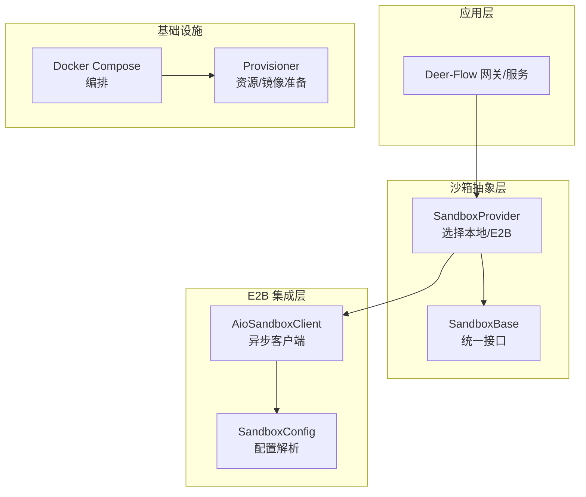
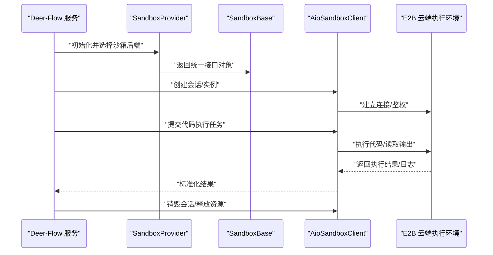
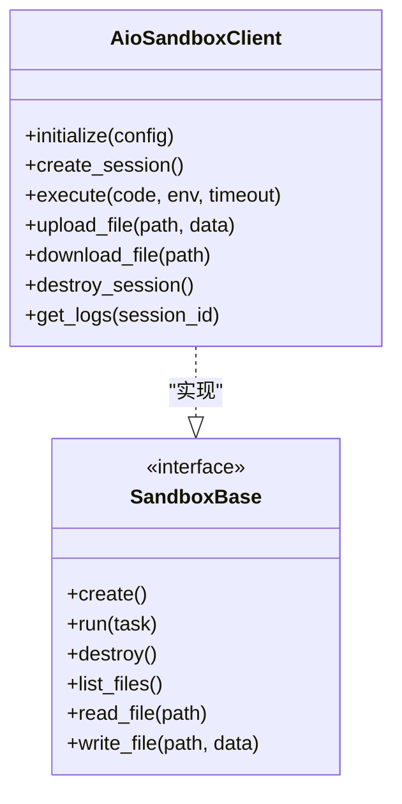

# E2B云沙箱

<cite>
**本文引用的文件**   
- [sandbox_config.py](file://backend/packages/harness/deerflow/config/sandbox_config.py)
- [sandbox_provider.py](file://backend/packages/harness/deerflow/sandbox/sandbox_provider.py)
- [sandbox.py](file://backend/packages/harness/deerflow/sandbox/sandbox.py)
- [aio_sandbox/__init__.py](file://backend/packages/harness/deerflow/community/aio_sandbox/__init__.py)
- [test_aio_sandbox.py](file://backend/tests/test_aio_sandbox.py)
- [test_aio_sandbox_local_backend.py](file://backend/tests/test_aio_sandbox_local_backend.py)
- [test_aio_sandbox_provider.py](file://backend/tests/test_aio_sandbox_provider.py)
- [docker-compose.yaml](file://docker/docker-compose.yaml)
- [provisioner/app.py](file://docker/provisioner/app.py)
</cite>

## 目录
1. [简介](#简介)
2. [项目结构](#项目结构)
3. [核心组件](#核心组件)
4. [架构总览](#架构总览)
5. [详细组件分析](#详细组件分析)
6. [依赖关系分析](#依赖关系分析)
7. [性能与扩缩容](#性能与扩缩容)
8. [故障排查指南](#故障排查指南)
9. [结论](#结论)
10. [附录：配置项参考](#附录配置项参考)

## 简介
本文件面向在 Deer-Flow 中集成和使用 E2B 云沙箱的开发者与运维人员，系统性阐述其架构特点、SDK 集成方式、生命周期管理、配置选项、文件与数据持久化、错误处理与重试策略、监控日志以及成本优化建议。E2B 云沙箱提供云端隔离执行环境，结合自动扩缩容和高可用能力，为 Agent 代码执行、工具调用和数据处理提供安全可靠的运行时。

## 项目结构
与 E2B 云沙箱相关的后端实现主要位于以下路径：
- 配置层：sandbox_config.py
- 抽象与提供者：sandbox_provider.py、sandbox.py
- E2B SDK 封装：community/aio_sandbox/
- 测试用例：tests/test_aio_sandbox*.py
- 部署编排：docker/docker-compose.yaml、docker/provisioner/app.py

图表来源
- [sandbox_provider.py](file://backend/packages/harness/deerflow/sandbox/sandbox_provider.py)
- [sandbox.py](file://backend/packages/harness/deerflow/sandbox/sandbox.py)
- [aio_sandbox/__init__.py](file://backend/packages/harness/deerflow/community/aio_sandbox/__init__.py)
- [sandbox_config.py](file://backend/packages/harness/deerflow/config/sandbox_config.py)
- [docker-compose.yaml](file://docker/docker-compose.yaml)
- [provisioner/app.py](file://docker/provisioner/app.py)

章节来源
- [sandbox_config.py](file://backend/packages/harness/deerflow/config/sandbox_config.py)
- [sandbox_provider.py](file://backend/packages/harness/deerflow/sandbox/sandbox_provider.py)
- [sandbox.py](file://backend/packages/harness/deerflow/sandbox/sandbox.py)
- [aio_sandbox/__init__.py](file://backend/packages/harness/deerflow/community/aio_sandbox/__init__.py)
- [docker-compose.yaml](file://docker/docker-compose.yaml)
- [provisioner/app.py](file://docker/provisioner/app.py)

## 核心组件
- SandboxConfig：集中解析与校验沙箱相关配置，包括是否启用 E2B、连接参数、超时、并发、镜像与存储等。
- SandboxProvider：根据配置动态选择本地或 E2B 沙箱实现，向上层暴露统一的创建、执行、销毁接口。
- SandboxBase：定义沙箱通用接口契约，确保不同后端行为一致。
- AioSandboxClient：对 E2B SDK 的异步封装，负责会话建立、代码执行、文件上传下载、状态保持等。
- Provisioner/Docker Compose：用于本地或开发环境的容器编排与资源准备，辅助 E2B 本地模式或代理运行。

章节来源
- [sandbox_config.py](file://backend/packages/harness/deerflow/config/sandbox_config.py)
- [sandbox_provider.py](file://backend/packages/harness/deerflow/sandbox/sandbox_provider.py)
- [sandbox.py](file://backend/packages/harness/deerflow/sandbox/sandbox.py)
- [aio_sandbox/__init__.py](file://backend/packages/harness/deerflow/community/aio_sandbox/__init__.py)

## 架构总览
E2B 云沙箱在 Deer-Flow 中的整体交互如下：上层服务通过 SandboxProvider 获取具体沙箱实例；当选择 E2B 时，由 AioSandboxClient 与 E2B 云端执行环境通信，完成会话管理、代码执行与结果回传。Provisioner 与 Docker Compose 可用于本地调试或边缘场景的资源准备。

图表来源
- [sandbox_provider.py](file://backend/packages/harness/deerflow/sandbox/sandbox_provider.py)
- [sandbox.py](file://backend/packages/harness/deerflow/sandbox/sandbox.py)
- [aio_sandbox/__init__.py](file://backend/packages/harness/deerflow/community/aio_sandbox/__init__.py)

## 详细组件分析

### 配置层：SandboxConfig
- 职责：集中加载与校验沙箱配置，支持 E2B 开关、连接端点、认证凭据、超时、并发限制、镜像名、环境变量、依赖包清单、存储挂载等。
- 关键点：
  - 将配置映射到运行时参数，供 Provider 与 Client 使用。
  - 提供默认值与必填项校验，避免运行时异常。
  - 支持多环境切换（本地/云端）。

章节来源
- [sandbox_config.py](file://backend/packages/harness/deerflow/config/sandbox_config.py)

### 抽象与提供者：SandboxProvider 与 SandboxBase
- SandboxBase：定义沙箱统一接口，如创建、执行、销毁、文件操作、状态查询等。
- SandboxProvider：根据配置决定使用本地还是 E2B 实现，对外暴露一致的 API。
- 设计优势：
  - 解耦业务逻辑与执行环境，便于扩展新的后端。
  - 统一错误模型与返回值，简化上层调用。

章节来源
- [sandbox.py](file://backend/packages/harness/deerflow/sandbox/sandbox.py)
- [sandbox_provider.py](file://backend/packages/harness/deerflow/sandbox/sandbox_provider.py)

### E2B SDK 封装：AioSandboxClient
- 职责：封装 E2B SDK 的异步调用，提供会话管理、代码执行、文件上传下载、日志收集等能力。
- 关键流程：
  - 客户端初始化：从配置读取 E2B 连接信息并建立连接。
  - 会话管理：创建/复用/销毁会话，保证资源及时回收。
  - 代码执行：提交代码片段或脚本，等待执行结果与标准输出。
  - 文件操作：上传输入数据、下载输出产物。
  - 状态保持：在会话内维护临时状态，跨步骤共享上下文。

图表来源
- [aio_sandbox/__init__.py](file://backend/packages/harness/deerflow/community/aio_sandbox/__init__.py)
- [sandbox.py](file://backend/packages/harness/deerflow/sandbox/sandbox.py)

章节来源
- [aio_sandbox/__init__.py](file://backend/packages/harness/deerflow/community/aio_sandbox/__init__.py)

### 测试与验证
- 单元测试覆盖 E2B 客户端初始化、执行流程、错误分支与资源清理。
- 本地后端测试用于验证 Provider 路由与接口一致性。

章节来源
- [test_aio_sandbox.py](file://backend/tests/test_aio_sandbox.py)
- [test_aio_sandbox_local_backend.py](file://backend/tests/test_aio_sandbox_local_backend.py)
- [test_aio_sandbox_provider.py](file://backend/tests/test_aio_sandbox_provider.py)

### 部署与编排
- docker-compose.yaml：定义服务编排，包含 E2B 本地模式所需的容器与服务。
- provisioner/app.py：提供资源准备、镜像拉取、健康检查等能力，辅助快速启动与自检。

章节来源
- [docker-compose.yaml](file://docker/docker-compose.yaml)
- [provisioner/app.py](file://docker/provisioner/app.py)

## 依赖关系分析
- 模块耦合：
  - SandboxProvider 依赖 SandboxBase 与 AioSandboxClient，屏蔽底层差异。
  - AioSandboxClient 依赖 SandboxConfig 提供的运行时参数。
- 外部依赖：
  - E2B 云端执行环境（网络可达、鉴权有效）。
  - 容器编排（可选，用于本地或边缘部署）。

图表来源
- [sandbox_config.py](file://backend/packages/harness/deerflow/config/sandbox_config.py)
- [sandbox_provider.py](file://backend/packages/harness/deerflow/sandbox/sandbox_provider.py)
- [sandbox.py](file://backend/packages/harness/deerflow/sandbox/sandbox.py)
- [aio_sandbox/__init__.py](file://backend/packages/harness/deerflow/community/aio_sandbox/__init__.py)

章节来源
- [sandbox_config.py](file://backend/packages/harness/deerflow/config/sandbox_config.py)
- [sandbox_provider.py](file://backend/packages/harness/deerflow/sandbox/sandbox_provider.py)
- [sandbox.py](file://backend/packages/harness/deerflow/sandbox/sandbox.py)
- [aio_sandbox/__init__.py](file://backend/packages/harness/deerflow/community/aio_sandbox/__init__.py)

## 性能与扩缩容
- 自动扩缩容：
  - 基于请求队列长度与 CPU/内存利用率触发扩容，保障高吞吐场景下的低延迟。
  - 冷启动优化：预热常用镜像与依赖，减少首次执行耗时。
- 高可用：
  - 多副本部署与健康检查，失败自动迁移。
  - 会话级幂等与重试，避免重复执行导致的数据不一致。
- 资源隔离：
  - 每个沙箱实例独立进程/容器，防止相互干扰。
- 监控指标：
  - 执行时长、成功率、错误码分布、队列深度、资源占用。

[本节为通用指导，不直接分析具体文件]

## 故障排查指南
- 常见问题定位：
  - 连接失败：检查 E2B 端点、鉴权凭据、网络连通性。
  - 执行超时：调整超时参数，优化代码复杂度或拆分任务。
  - 依赖缺失：确认依赖包清单与镜像版本一致性。
  - 文件读写错误：核对路径权限与挂载配置。
- 重试策略：
  - 针对瞬时错误（网络抖动、限流）进行指数退避重试。
  - 对幂等操作可设置最大重试次数与死信队列。
- 日志与追踪：
  - 收集标准输出、错误输出与系统日志。
  - 关联会话 ID 与任务 ID，便于问题回溯。

章节来源
- [test_aio_sandbox.py](file://backend/tests/test_aio_sandbox.py)
- [test_aio_sandbox_local_backend.py](file://backend/tests/test_aio_sandbox_local_backend.py)
- [test_aio_sandbox_provider.py](file://backend/tests/test_aio_sandbox_provider.py)

## 结论
通过将 E2B 云沙箱纳入 Deer-Flow 的统一沙箱抽象层，系统在安全性、可扩展性与可观测性方面获得显著提升。合理的配置与监控策略能够保障高可用与低成本运行。建议在生产环境采用自动扩缩容、幂等重试与完善的日志追踪，持续优化性能与成本。

[本节为总结性内容，不直接分析具体文件]

## 附录：配置项参考
以下为常见配置项类别与说明（以实际实现为准）：
- 运行时参数
  - 是否启用 E2B、执行超时、并发上限、重试次数、退避策略。
- 环境变量
  - 目标环境标识、调试开关、第三方服务密钥注入。
- 依赖包管理
  - 依赖清单、镜像名称与版本、安装顺序与缓存策略。
- 存储配置
  - 临时目录、持久卷挂载、上传下载路径与大小限制。
- 监控与日志
  - 日志级别、采样率、上报端点、指标标签。

章节来源
- [sandbox_config.py](file://backend/packages/harness/deerflow/config/sandbox_config.py)