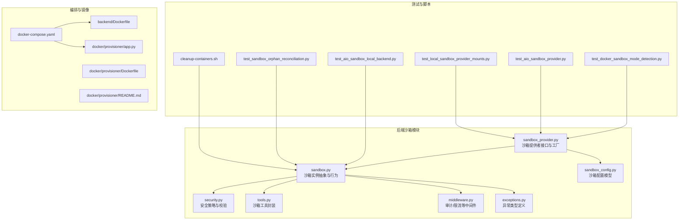
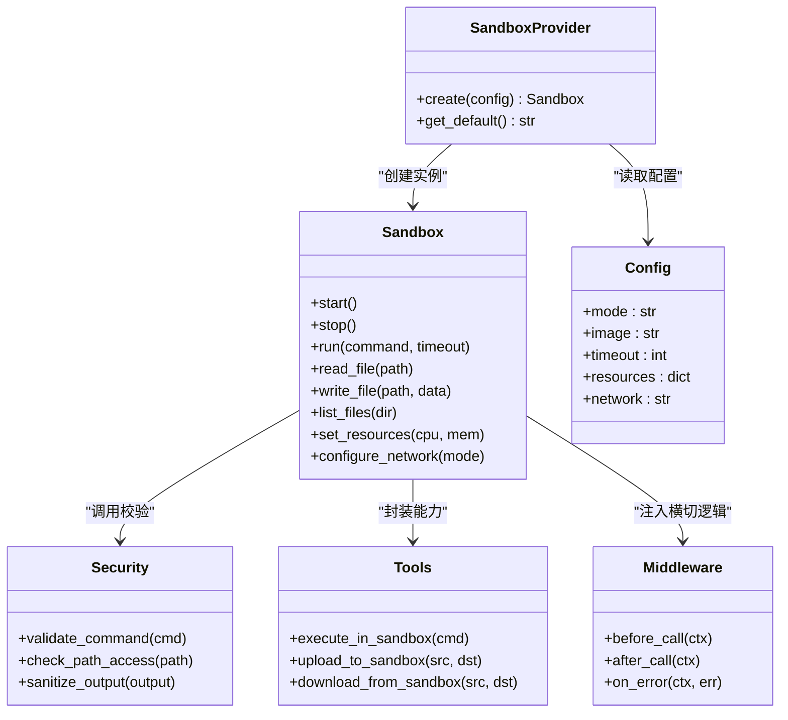
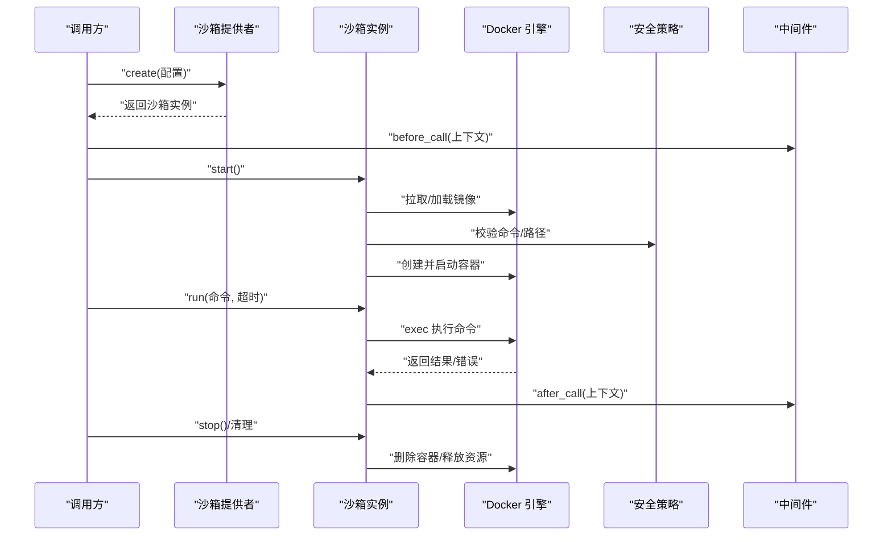
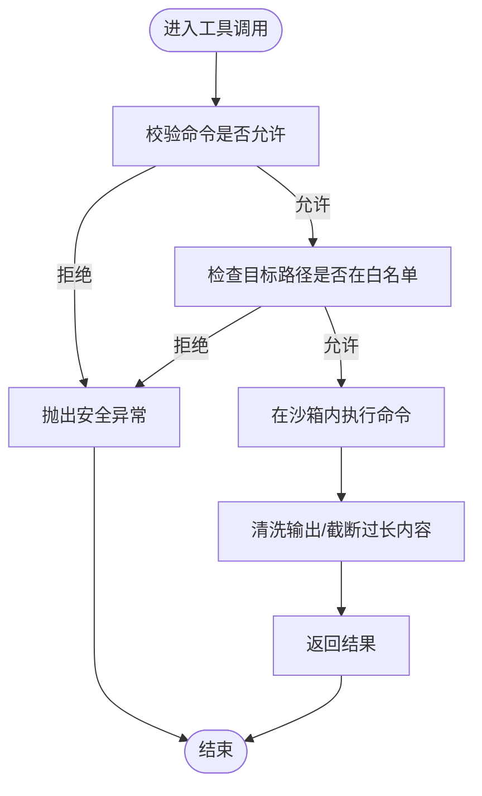
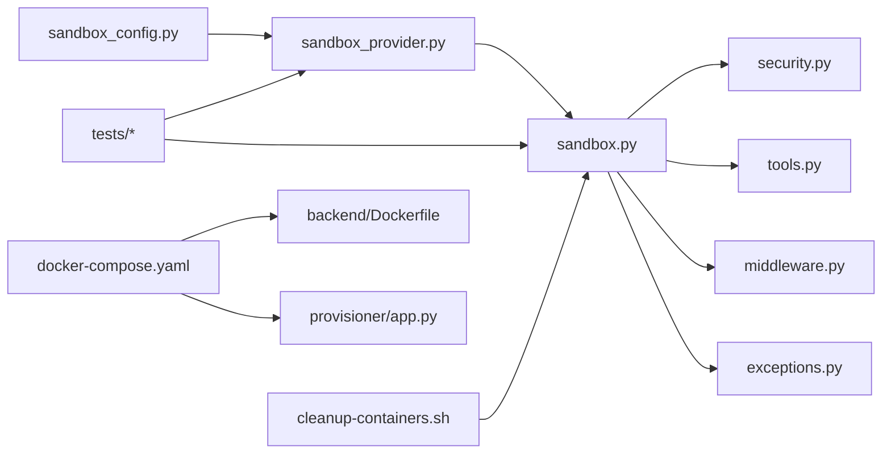

# 容器沙箱

<cite>
**本文引用的文件**   
- [sandbox_config.py](file://backend/packages/harness/deerflow/config/sandbox_config.py)
- [sandbox.py](file://backend/packages/harness/deerflow/sandbox/sandbox.py)
- [sandbox_provider.py](file://backend/packages/harness/deerflow/sandbox/sandbox_provider.py)
- [security.py](file://backend/packages/harness/deerflow/sandbox/security.py)
- [tools.py](file://backend/packages/harness/deerflow/sandbox/tools.py)
- [middleware.py](file://backend/packages/harness/deerflow/sandbox/middleware.py)
- [exceptions.py](file://backend/packages/harness/deerflow/sandbox/exceptions.py)
- [docker_sandbox_mode_detection_test.py](file://backend/tests/test_docker_sandbox_mode_detection.py)
- [test_aio_sandbox_local_backend.py](file://backend/tests/test_aio_sandbox_local_backend.py)
- [test_aio_sandbox_provider.py](file://backend/tests/test_aio_sandbox_provider.py)
- [test_local_sandbox_provider_mounts.py](file://backend/tests/test_local_sandbox_provider_mounts.py)
- [test_sandbox_orphan_reconciliation.py](file://backend/tests/test_sandbox_orphan_reconciliation.py)
- [cleanup-containers.sh](file://scripts/cleanup-containers.sh)
- [docker-compose.yaml](file://docker/docker-compose.yaml)
- [Dockerfile](file://backend/Dockerfile)
- [provisioner/app.py](file://docker/provisioner/app.py)
- [provisioner/Dockerfile](file://docker/provisioner/Dockerfile)
- [provisioner/README.md](file://docker/provisioner/README.md)
</cite>

## 目录
1. [简介](#简介)
2. [项目结构](#项目结构)
3. [核心组件](#核心组件)
4. [架构总览](#架构总览)
5. [详细组件分析](#详细组件分析)
6. [依赖关系分析](#依赖关系分析)
7. [性能考虑](#性能考虑)
8. [故障排查指南](#故障排查指南)
9. [结论](#结论)
10. [附录](#附录)

## 简介
本文件面向“容器沙箱”的综合配置与管理，覆盖以下主题：
- 支持的容器运行时与使用场景：本地 Docker、E2B 云沙箱、BoxLite 轻量级容器（概念性说明）
- 部署与配置：镜像管理、容器编排、资源限制、网络配置
- 安全隔离：命名空间隔离、cgroup 资源限制、文件系统权限控制
- 生命周期管理：创建、启动、监控、清理
- 文件共享与数据持久化
- 性能优化建议与故障排查方法

本项目在代码层面提供了统一的沙箱抽象与本地 Docker 实现，并通过测试与脚本验证了模式检测、挂载、孤儿回收等关键能力。E2B 与 BoxLite 的使用方式在本仓库中未提供具体实现，本节以通用实践进行概念性说明。

## 项目结构
与容器沙箱相关的核心代码位于后端包内，围绕“沙箱提供者”、“沙箱实例”、“安全策略”、“工具集成”和“中间件”展开；同时包含若干测试与运维脚本。

图表来源
- [sandbox_provider.py](file://backend/packages/harness/deerflow/sandbox/sandbox_provider.py)
- [sandbox.py](file://backend/packages/harness/deerflow/sandbox/sandbox.py)
- [security.py](file://backend/packages/harness/deerflow/sandbox/security.py)
- [tools.py](file://backend/packages/harness/deerflow/sandbox/tools.py)
- [middleware.py](file://backend/packages/harness/deerflow/sandbox/middleware.py)
- [exceptions.py](file://backend/packages/harness/deerflow/sandbox/exceptions.py)
- [sandbox_config.py](file://backend/packages/harness/deerflow/config/sandbox_config.py)
- [test_docker_sandbox_mode_detection.py](file://backend/tests/test_docker_sandbox_mode_detection.py)
- [test_aio_sandbox_local_backend.py](file://backend/tests/test_aio_sandbox_local_backend.py)
- [test_aio_sandbox_provider.py](file://backend/tests/test_aio_sandbox_provider.py)
- [test_local_sandbox_provider_mounts.py](file://backend/tests/test_local_sandbox_provider_mounts.py)
- [test_sandbox_orphan_reconciliation.py](file://backend/tests/test_sandbox_orphan_reconciliation.py)
- [cleanup-containers.sh](file://scripts/cleanup-containers.sh)
- [docker-compose.yaml](file://docker/docker-compose.yaml)
- [Dockerfile](file://backend/Dockerfile)
- [provisioner/app.py](file://docker/provisioner/app.py)
- [provisioner/Dockerfile](file://docker/provisioner/Dockerfile)
- [provisioner/README.md](file://docker/provisioner/README.md)

章节来源
- [sandbox_provider.py](file://backend/packages/harness/deerflow/sandbox/sandbox_provider.py)
- [sandbox.py](file://backend/packages/harness/deerflow/sandbox/sandbox.py)
- [sandbox_config.py](file://backend/packages/harness/deerflow/config/sandbox_config.py)
- [docker-compose.yaml](file://docker/docker-compose.yaml)
- [Dockerfile](file://backend/Dockerfile)
- [provisioner/app.py](file://docker/provisioner/app.py)
- [provisioner/Dockerfile](file://docker/provisioner/Dockerfile)
- [provisioner/README.md](file://docker/provisioner/README.md)

## 核心组件
- 沙箱提供者（Provider）：负责选择并创建具体的沙箱实例（如本地 Docker），对外暴露统一接口。
- 沙箱实例（Sandbox）：封装容器的创建、启动、停止、执行命令、文件操作、资源与网络约束等。
- 安全策略（Security）：对输入输出、路径访问、命令白名单等进行校验与限制。
- 工具封装（Tools）：将沙箱能力包装为可被上层调用的工具函数。
- 中间件（Middleware）：在调用链上注入审计、限流、错误处理等横切逻辑。
- 配置模型（Config）：集中管理沙箱相关配置项（如运行模式、镜像、超时、资源限制等）。
- 异常体系（Exceptions）：定义沙箱相关异常类型，便于上层统一捕获与降级。

章节来源
- [sandbox_provider.py](file://backend/packages/harness/deerflow/sandbox/sandbox_provider.py)
- [sandbox.py](file://backend/packages/harness/deerflow/sandbox/sandbox.py)
- [security.py](file://backend/packages/harness/deerflow/sandbox/security.py)
- [tools.py](file://backend/packages/harness/deerflow/sandbox/tools.py)
- [middleware.py](file://backend/packages/harness/deerflow/sandbox/middleware.py)
- [exceptions.py](file://backend/packages/harness/deerflow/sandbox/exceptions.py)
- [sandbox_config.py](file://backend/packages/harness/deerflow/config/sandbox_config.py)

## 架构总览
下图展示了沙箱提供者如何根据配置选择具体实现，以及沙箱实例与安全、工具、中间件的协作关系。

图表来源
- [sandbox_provider.py](file://backend/packages/harness/deerflow/sandbox/sandbox_provider.py)
- [sandbox.py](file://backend/packages/harness/deerflow/sandbox/sandbox.py)
- [security.py](file://backend/packages/harness/deerflow/sandbox/security.py)
- [tools.py](file://backend/packages/harness/deerflow/sandbox/tools.py)
- [middleware.py](file://backend/packages/harness/deerflow/sandbox/middleware.py)
- [sandbox_config.py](file://backend/packages/harness/deerflow/config/sandbox_config.py)

## 详细组件分析

### 组件一：沙箱提供者与配置
- 职责
  - 根据配置决定使用哪种沙箱实现（例如本地 Docker）。
  - 提供默认值与参数校验，确保后续流程稳定。
- 关键点
  - 配置项包括运行模式、镜像、超时、资源限制、网络模式等。
  - 通过测试用例验证“Docker 模式检测”的可用性。
- 典型用法
  - 初始化提供者后，传入配置对象，获取一个可用的沙箱实例。

章节来源
- [sandbox_provider.py](file://backend/packages/harness/deerflow/sandbox/sandbox_provider.py)
- [sandbox_config.py](file://backend/packages/harness/deerflow/config/sandbox_config.py)
- [test_docker_sandbox_mode_detection.py](file://backend/tests/test_docker_sandbox_mode_detection.py)

### 组件二：沙箱实例（本地 Docker）
- 职责
  - 基于 Docker 引擎创建、启动、停止容器。
  - 在容器内执行命令、读写文件、列出目录。
  - 支持资源限制（CPU/内存）和网络模式设置。
- 关键点
  - 通过测试验证本地后端可用性与挂载卷行为。
  - 结合中间件完成审计与错误处理。
- 生命周期
  - 创建 -> 启动 -> 执行任务 -> 监控状态 -> 清理资源。

图表来源
- [sandbox.py](file://backend/packages/harness/deerflow/sandbox/sandbox.py)
- [security.py](file://backend/packages/harness/deerflow/sandbox/security.py)
- [middleware.py](file://backend/packages/harness/deerflow/sandbox/middleware.py)
- [test_aio_sandbox_local_backend.py](file://backend/tests/test_aio_sandbox_local_backend.py)

章节来源
- [sandbox.py](file://backend/packages/harness/deerflow/sandbox/sandbox.py)
- [test_aio_sandbox_local_backend.py](file://backend/tests/test_aio_sandbox_local_backend.py)
- [test_local_sandbox_provider_mounts.py](file://backend/tests/test_local_sandbox_provider_mounts.py)

### 组件三：安全策略与工具封装
- 安全策略
  - 命令白名单与黑名单校验。
  - 路径访问控制（仅允许受限目录）。
  - 输出清洗与长度限制。
- 工具封装
  - 将沙箱能力封装为易用的工具函数，供上层业务直接调用。
  - 在工具层统一处理错误与日志。

图表来源
- [security.py](file://backend/packages/harness/deerflow/sandbox/security.py)
- [tools.py](file://backend/packages/harness/deerflow/sandbox/tools.py)

章节来源
- [security.py](file://backend/packages/harness/deerflow/sandbox/security.py)
- [tools.py](file://backend/packages/harness/deerflow/sandbox/tools.py)

### 组件四：中间件与异常体系
- 中间件
  - 在调用前后注入审计、指标采集、限流等逻辑。
  - 统一错误处理与重试策略。
- 异常体系
  - 定义沙箱相关异常类型，便于上层区分处理（如超时、权限不足、资源不足等）。

章节来源
- [middleware.py](file://backend/packages/harness/deerflow/sandbox/middleware.py)
- [exceptions.py](file://backend/packages/harness/deerflow/sandbox/exceptions.py)

### 组件五：编排与镜像
- 镜像构建
  - 使用后端 Dockerfile 构建应用镜像，确保依赖与环境一致。
- 服务编排
  - 通过 docker-compose.yaml 编排多服务（如网关、后端、代理等）。
- 预置器（Provisioner）
  - 提供辅助服务，用于环境准备或资源调度。
  - 包含独立 Dockerfile 与使用说明。

章节来源
- [Dockerfile](file://backend/Dockerfile)
- [docker-compose.yaml](file://docker/docker-compose.yaml)
- [provisioner/app.py](file://docker/provisioner/app.py)
- [provisioner/Dockerfile](file://docker/provisioner/Dockerfile)
- [provisioner/README.md](file://docker/provisioner/README.md)

## 依赖关系分析
- 模块耦合
  - 沙箱提供者依赖配置模型，并返回沙箱实例。
  - 沙箱实例强依赖安全策略与工具封装，并通过中间件增强横切能力。
- 外部依赖
  - 本地 Docker 引擎作为运行时。
  - 可选的外部服务（如预置器）通过编排组合。
- 潜在循环依赖
  - 当前设计采用分层与接口抽象，避免循环依赖。

图表来源
- [sandbox_config.py](file://backend/packages/harness/deerflow/config/sandbox_config.py)
- [sandbox_provider.py](file://backend/packages/harness/deerflow/sandbox/sandbox_provider.py)
- [sandbox.py](file://backend/packages/harness/deerflow/sandbox/sandbox.py)
- [security.py](file://backend/packages/harness/deerflow/sandbox/security.py)
- [tools.py](file://backend/packages/harness/deerflow/sandbox/tools.py)
- [middleware.py](file://backend/packages/harness/deerflow/sandbox/middleware.py)
- [exceptions.py](file://backend/packages/harness/deerflow/sandbox/exceptions.py)
- [cleanup-containers.sh](file://scripts/cleanup-containers.sh)
- [docker-compose.yaml](file://docker/docker-compose.yaml)
- [Dockerfile](file://backend/Dockerfile)
- [provisioner/app.py](file://docker/provisioner/app.py)

章节来源
- [sandbox_provider.py](file://backend/packages/harness/deerflow/sandbox/sandbox_provider.py)
- [sandbox.py](file://backend/packages/harness/deerflow/sandbox/sandbox.py)
- [docker-compose.yaml](file://docker/docker-compose.yaml)

## 性能考虑
- 镜像预热与缓存
  - 提前拉取常用镜像，减少冷启动时间。
- 资源限制
  - 合理设置 CPU/内存上限，避免单任务占用过多资源。
- 并发与复用
  - 短生命周期任务优先复用容器池，降低创建开销。
- I/O 优化
  - 使用只读根文件系统，减少写放大；按需挂载最小必要目录。
- 网络优化
  - 关闭不必要的端口暴露，使用内部网络通信。
- 监控与告警
  - 记录关键指标（启动耗时、执行时长、失败率），设置阈值告警。

[本节为通用指导，不直接分析具体文件]

## 故障排查指南
- 常见问题定位
  - 模式检测失败：确认 Docker 引擎可用与权限正确。
  - 挂载卷不可用：检查宿主机路径存在性与 SELinux/AppArmor 策略。
  - 孤儿容器残留：使用清理脚本或后台任务定期回收。
- 诊断步骤
  - 查看沙箱中间件日志与审计信息。
  - 检查安全策略是否误拦截合法命令或路径。
  - 核对资源限制是否过小导致 OOM 或 CPU 节流。
- 自动化清理
  - 使用提供的清理脚本定期回收僵尸容器与临时文件。

章节来源
- [test_docker_sandbox_mode_detection.py](file://backend/tests/test_docker_sandbox_mode_detection.py)
- [test_local_sandbox_provider_mounts.py](file://backend/tests/test_local_sandbox_provider_mounts.py)
- [test_sandbox_orphan_reconciliation.py](file://backend/tests/test_sandbox_orphan_reconciliation.py)
- [cleanup-containers.sh](file://scripts/cleanup-containers.sh)
- [middleware.py](file://backend/packages/harness/deerflow/sandbox/middleware.py)

## 结论
本项目通过统一的沙箱抽象与本地 Docker 实现，提供了可扩展的沙箱管理能力。配合安全策略、工具封装与中间件，能够满足大多数安全隔离与资源管控需求。对于云沙箱（E2B）与轻量容器（BoxLite），可在现有抽象基础上扩展新的提供者实现，复用安全与工具能力，快速接入不同运行时。

[本节为总结性内容，不直接分析具体文件]

## 附录

### 支持的容器运行时与使用场景
- 本地 Docker
  - 特点：成熟生态、易于编排、资源可控。
  - 适用：开发调试、私有化部署、中等规模生产。
- E2B 云沙箱（概念性说明）
  - 特点：云端隔离、弹性伸缩、免运维。
  - 适用：高并发、多租户、需要快速扩缩的场景。
- BoxLite 轻量级容器（概念性说明）
  - 特点：极小镜像、低开销、启动快。
  - 适用：边缘计算、短时任务、资源受限环境。

[本节为概念性说明，不直接分析具体文件]

### 部署与配置要点
- 镜像管理
  - 使用后端 Dockerfile 构建基础镜像，固定依赖版本。
  - 在编排文件中声明镜像标签与拉取策略。
- 容器编排
  - 通过 docker-compose.yaml 管理服务间依赖与网络。
  - 将敏感配置通过环境变量注入，避免硬编码。
- 资源限制
  - 在沙箱配置中设置 CPU/内存上限，防止资源争用。
- 网络配置
  - 仅暴露必要端口，使用内部网络进行服务间通信。

章节来源
- [Dockerfile](file://backend/Dockerfile)
- [docker-compose.yaml](file://docker/docker-compose.yaml)
- [sandbox_config.py](file://backend/packages/harness/deerflow/config/sandbox_config.py)

### 安全隔离机制
- 命名空间隔离
  - 利用容器运行时提供的进程、网络、文件系统命名空间隔离。
- cgroup 资源限制
  - 通过沙箱配置限制 CPU/内存使用，避免资源耗尽。
- 文件系统权限控制
  - 使用只读根文件系统与最小化挂载点，结合安全策略校验路径访问。

章节来源
- [security.py](file://backend/packages/harness/deerflow/sandbox/security.py)
- [sandbox.py](file://backend/packages/harness/deerflow/sandbox/sandbox.py)

### 生命周期管理指南
- 创建与启动
  - 通过沙箱提供者创建实例并启动容器。
- 执行与监控
  - 在容器内执行命令，收集输出与指标。
- 清理与回收
  - 任务结束后停止并删除容器，释放资源；必要时使用清理脚本兜底。

章节来源
- [sandbox_provider.py](file://backend/packages/harness/deerflow/sandbox/sandbox_provider.py)
- [sandbox.py](file://backend/packages/harness/deerflow/sandbox/sandbox.py)
- [cleanup-containers.sh](file://scripts/cleanup-containers.sh)

### 文件共享与数据持久化
- 卷挂载
  - 将宿主目录挂载到容器指定路径，实现数据持久化。
- 上传下载
  - 通过工具封装提供上传/下载能力，便于与外部系统交互。
- 安全边界
  - 严格限制可访问路径，避免越权访问。

章节来源
- [test_local_sandbox_provider_mounts.py](file://backend/tests/test_local_sandbox_provider_mounts.py)
- [tools.py](file://backend/packages/harness/deerflow/sandbox/tools.py)
- [security.py](file://backend/packages/harness/deerflow/sandbox/security.py)

### 性能优化与故障排查清单
- 优化建议
  - 镜像预热、容器池复用、I/O 只读、网络最小化暴露。
- 排查清单
  - 模式检测、挂载权限、资源限制、中间件日志、异常类型。

章节来源
- [test_docker_sandbox_mode_detection.py](file://backend/tests/test_docker_sandbox_mode_detection.py)
- [test_local_sandbox_provider_mounts.py](file://backend/tests/test_local_sandbox_provider_mounts.py)
- [test_sandbox_orphan_reconciliation.py](file://backend/tests/test_sandbox_orphan_reconciliation.py)
- [cleanup-containers.sh](file://scripts/cleanup-containers.sh)
- [middleware.py](file://backend/packages/harness/deerflow/sandbox/middleware.py)
- [exceptions.py](file://backend/packages/harness/deerflow/sandbox/exceptions.py)