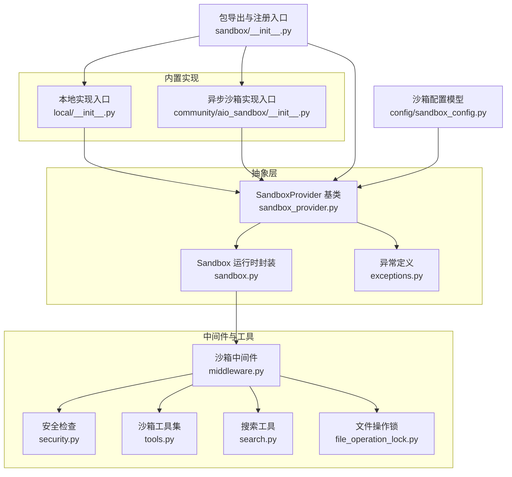
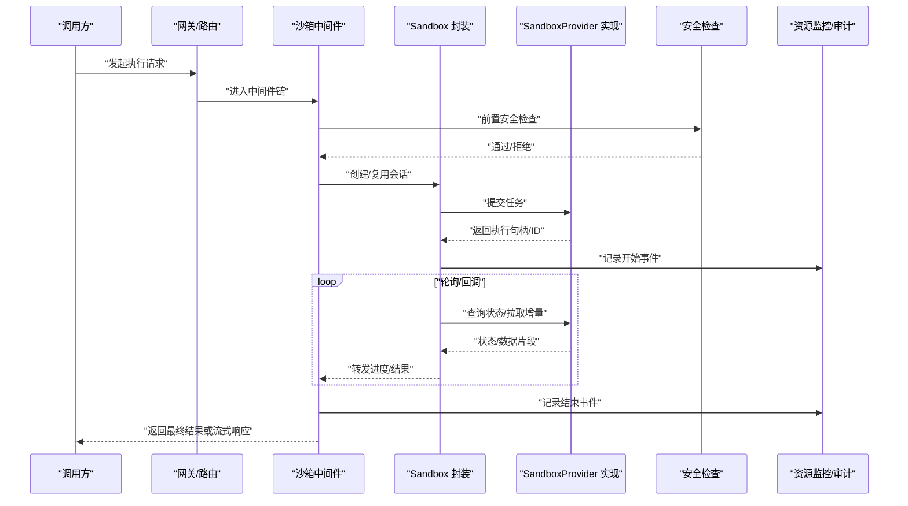
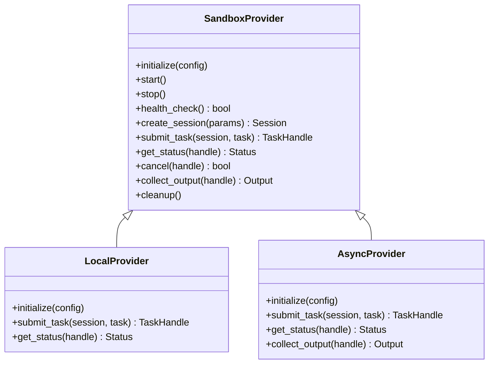
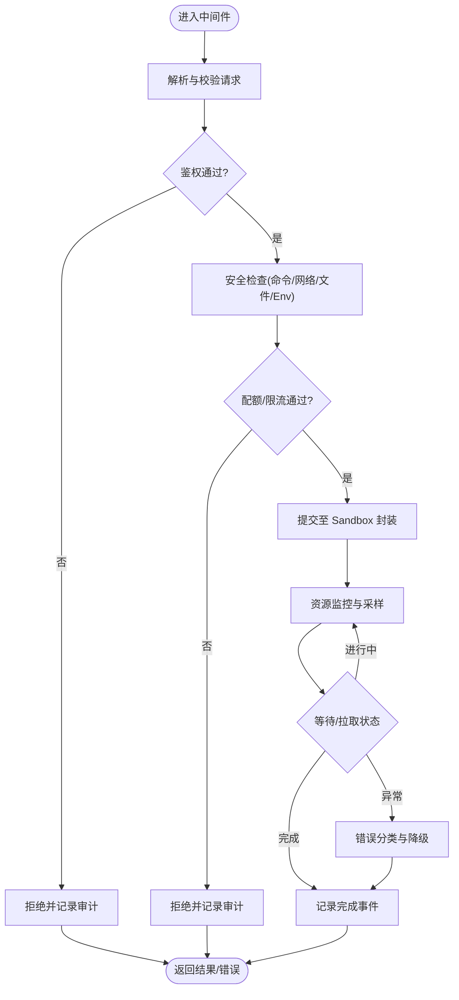
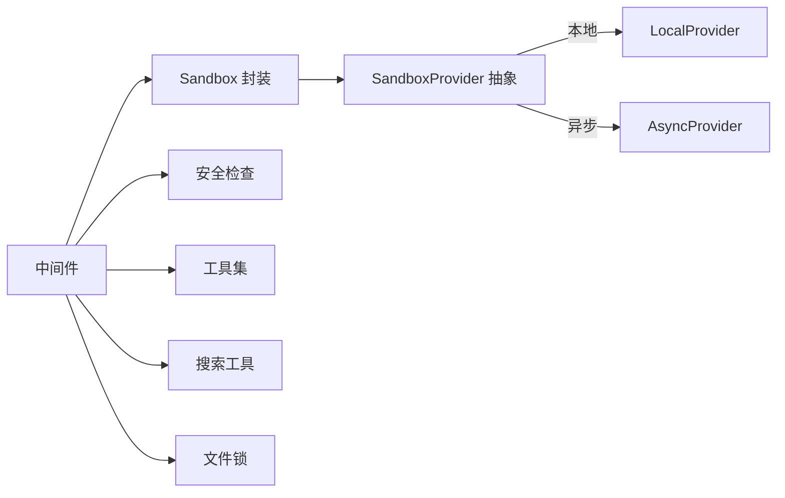

# 沙箱提供者抽象层

<cite>
**本文引用的文件**   
- [sandbox_provider.py](file://backend/packages/harness/deerflow/sandbox/sandbox_provider.py)
- [sandbox.py](file://backend/packages/harness/deerflow/sandbox/sandbox.py)
- [middleware.py](file://backend/packages/harness/deerflow/sandbox/middleware.py)
- [security.py](file://backend/packages/harness/deerflow/sandbox/security.py)
- [exceptions.py](file://backend/packages/harness/deerflow/sandbox/exceptions.py)
- [tools.py](file://backend/packages/harness/deerflow/sandbox/tools.py)
- [search.py](file://backend/packages/harness/deerflow/sandbox/search.py)
- [file_operation_lock.py](file://backend/packages/harness/deerflow/sandbox/file_operation_lock.py)
- [__init__.py](file://backend/packages/harness/deerflow/sandbox/__init__.py)
- [local/__init__.py](file://backend/packages/harness/deerflow/sandbox/local/__init__.py)
- [aio_sandbox/__init__.py](file://backend/packages/harness/deerflow/community/aio_sandbox/__init__.py)
- [sandbox_config.py](file://backend/packages/harness/deerflow/config/sandbox_config.py)
- [test_aio_sandbox_provider.py](file://backend/tests/test_aio_sandbox_provider.py)
- [test_aio_sandbox_local_backend.py](file://backend/tests/test_aio_sandbox_local_backend.py)
- [test_sandbox_audit_middleware.py](file://backend/tests/test_sandbox_audit_middleware.py)
- [test_sandbox_orphan_reconciliation.py](file://backend/tests/test_sandbox_orphan_reconciliation.py)
- [test_sandbox_search_tools.py](file://backend/tests/test_sandbox_search_tools.py)
- [test_sandbox_tools_security.py](file://backend/tests/test_sandbox_tools_security.py)
</cite>

## 目录
1. [简介](#简介)
2. [项目结构](#项目结构)
3. [核心组件](#核心组件)
4. [架构总览](#架构总览)
5. [详细组件分析](#详细组件分析)
6. [依赖关系分析](#依赖关系分析)
7. [性能考虑](#性能考虑)
8. [故障排查指南](#故障排查指南)
9. [结论](#结论)
10. [附录](#附录)

## 简介
本文件面向“沙箱提供者抽象层”的架构设计与扩展实践，围绕统一接口、中间件机制、注册与发现、配置系统、测试策略与安全审计等维度进行系统化说明。目标是帮助读者快速理解并安全地扩展新的沙箱实现（如本地进程、容器化或远程服务），并在生产环境中稳定运行。

## 项目结构
与沙箱提供者抽象层相关的代码主要位于后端 harness 模块中：
- 抽象与契约：sandbox_provider.py、sandbox.py、exceptions.py
- 中间件与工具：middleware.py、tools.py、search.py、file_operation_lock.py
- 内置实现：local/ 与 community/aio_sandbox/
- 配置：config/sandbox_config.py
- 测试：tests 下多个以 sandbox 开头的用例

图表来源
- [sandbox_provider.py](file://backend/packages/harness/deerflow/sandbox/sandbox_provider.py)
- [sandbox.py](file://backend/packages/harness/deerflow/sandbox/sandbox.py)
- [middleware.py](file://backend/packages/harness/deerflow/sandbox/middleware.py)
- [security.py](file://backend/packages/harness/deerflow/sandbox/security.py)
- [tools.py](file://backend/packages/harness/deerflow/sandbox/tools.py)
- [search.py](file://backend/packages/harness/deerflow/sandbox/search.py)
- [file_operation_lock.py](file://backend/packages/harness/deerflow/sandbox/file_operation_lock.py)
- [__init__.py](file://backend/packages/harness/deerflow/sandbox/__init__.py)
- [local/__init__.py](file://backend/packages/harness/deerflow/sandbox/local/__init__.py)
- [aio_sandbox/__init__.py](file://backend/packages/harness/deerflow/community/aio_sandbox/__init__.py)
- [sandbox_config.py](file://backend/packages/harness/deerflow/config/sandbox_config.py)

章节来源
- [sandbox_provider.py](file://backend/packages/harness/deerflow/sandbox/sandbox_provider.py)
- [sandbox.py](file://backend/packages/harness/deerflow/sandbox/sandbox.py)
- [middleware.py](file://backend/packages/harness/deerflow/sandbox/middleware.py)
- [security.py](file://backend/packages/harness/deerflow/sandbox/security.py)
- [tools.py](file://backend/packages/harness/deerflow/sandbox/tools.py)
- [search.py](file://backend/packages/harness/deerflow/sandbox/search.py)
- [file_operation_lock.py](file://backend/packages/harness/deerflow/sandbox/file_operation_lock.py)
- [__init__.py](file://backend/packages/harness/deerflow/sandbox/__init__.py)
- [local/__init__.py](file://backend/packages/harness/deerflow/sandbox/local/__init__.py)
- [aio_sandbox/__init__.py](file://backend/packages/harness/deerflow/community/aio_sandbox/__init__.py)
- [sandbox_config.py](file://backend/packages/harness/deerflow/config/sandbox_config.py)

## 核心组件
- SandboxProvider 基类
  - 职责：定义沙箱提供者的统一契约，包括初始化、生命周期管理、执行上下文构建、资源清理、健康检查等。
  - 关键方法（概念性）：初始化与配置加载、启动/停止、创建执行会话、提交任务、获取状态、回收资源、健康探测。
  - 设计要点：面向接口编程；将平台差异隔离在子类中；对外暴露稳定的调用语义。

- Sandbox 运行时封装
  - 职责：对上层屏蔽底层 Provider 的差异，提供统一的执行视图，负责超时、重试、错误归一化、结果序列化等。
  - 关键能力：会话管理、并发控制、输出流式处理、错误映射。

- 中间件机制
  - 职责：在执行链路前后注入横切关注点，如请求拦截、安全检查、资源监控、审计日志、错误处理。
  - 典型阶段：前置校验→权限与策略检查→资源配额与限流→执行→后置审计与指标上报→异常兜底。

- 安全与工具
  - 安全检查：命令白名单、网络访问控制、文件系统路径白名单、环境变量过滤。
  - 工具集：为沙箱内任务提供受限的工具函数（如只读文件访问、受限网络请求）。
  - 搜索工具：在受控范围内提供检索能力，避免越权访问。
  - 文件操作锁：防止并发写入冲突与竞态条件。

- 内置实现
  - 本地实现：基于本地进程或解释器环境，适合开发与轻量场景。
  - 异步沙箱（AIO）：基于异步 I/O 的远程或容器化实现，适合高并发与隔离性要求高的场景。

- 配置系统
  - 配置模型：集中定义沙箱相关参数（如超时、配额、镜像、挂载卷、网络策略等）。
  - 支持方式：配置文件与环境变量，必要时支持热更新。

章节来源
- [sandbox_provider.py](file://backend/packages/harness/deerflow/sandbox/sandbox_provider.py)
- [sandbox.py](file://backend/packages/harness/deerflow/sandbox/sandbox.py)
- [middleware.py](file://backend/packages/harness/deerflow/sandbox/middleware.py)
- [security.py](file://backend/packages/harness/deerflow/sandbox/security.py)
- [tools.py](file://backend/packages/harness/deerflow/sandbox/tools.py)
- [search.py](file://backend/packages/harness/deerflow/sandbox/search.py)
- [file_operation_lock.py](file://backend/packages/harness/deerflow/sandbox/file_operation_lock.py)
- [sandbox_config.py](file://backend/packages/harness/deerflow/config/sandbox_config.py)

## 架构总览
下图展示了从调用方到沙箱执行的端到端流程，以及中间件在各阶段的介入点。

图表来源
- [middleware.py](file://backend/packages/harness/deerflow/sandbox/middleware.py)
- [sandbox.py](file://backend/packages/harness/deerflow/sandbox/sandbox.py)
- [sandbox_provider.py](file://backend/packages/harness/deerflow/sandbox/sandbox_provider.py)
- [security.py](file://backend/packages/harness/deerflow/sandbox/security.py)

## 详细组件分析

### 组件一：SandboxProvider 抽象与实现
- 抽象契约
  - 初始化：接收配置对象，完成连接池、凭据、策略加载。
  - 生命周期：start/stop、health_check、shutdown。
  - 执行：create_session、submit_task、get_status、cancel、collect_output。
  - 资源：mounts、env、limits、timeout、retries 等策略参数。
- 实现建议
  - 本地实现：使用子进程/解释器，限制可执行命令与 IO。
  - 异步实现：基于 HTTP/gRPC/WebSocket 的远程执行，具备幂等与断线重连。
  - 错误映射：将底层异常转换为统一异常类型，便于中间件处理。
- 版本兼容
  - 提供版本号与能力清单，向上兼容时保持接口稳定，向下兼容需显式降级。

图表来源
- [sandbox_provider.py](file://backend/packages/harness/deerflow/sandbox/sandbox_provider.py)
- [local/__init__.py](file://backend/packages/harness/deerflow/sandbox/local/__init__.py)
- [aio_sandbox/__init__.py](file://backend/packages/harness/deerflow/community/aio_sandbox/__init__.py)

章节来源
- [sandbox_provider.py](file://backend/packages/harness/deerflow/sandbox/sandbox_provider.py)
- [local/__init__.py](file://backend/packages/harness/deerflow/sandbox/local/__init__.py)
- [aio_sandbox/__init__.py](file://backend/packages/harness/deerflow/community/aio_sandbox/__init__.py)

### 组件二：中间件机制（请求拦截、安全检查、资源监控、错误处理）
- 工作流
  - 请求拦截：解析入参、鉴权、速率限制、配额检查。
  - 安全检查：命令/网络/文件/环境变量白名单校验。
  - 资源监控：CPU/内存/IO/网络用量采集与上限熔断。
  - 错误处理：统一异常分类、降级策略、重试与补偿。
  - 审计日志：全链路事件记录，包含时间戳、用户、租户、资源消耗。
- 扩展点
  - 新增中间件：按顺序插入到链中，保证幂等与可观测性。
  - 钩子：before_submit、after_status、on_error、on_complete。

图表来源
- [middleware.py](file://backend/packages/harness/deerflow/sandbox/middleware.py)
- [security.py](file://backend/packages/harness/deerflow/sandbox/security.py)
- [sandbox.py](file://backend/packages/harness/deerflow/sandbox/sandbox.py)

章节来源
- [middleware.py](file://backend/packages/harness/deerflow/sandbox/middleware.py)
- [security.py](file://backend/packages/harness/deerflow/sandbox/security.py)
- [sandbox.py](file://backend/packages/harness/deerflow/sandbox/sandbox.py)

### 组件三：安全与工具（文件、网络、搜索、锁）
- 安全检查
  - 命令白名单：仅允许预置命令集合。
  - 网络策略：域名/IP 白名单、端口限制、代理开关。
  - 文件系统：只读挂载、路径前缀白名单、大小限制。
  - 环境变量：最小必要集，敏感信息加密存储。
- 工具集
  - 受限 IO：只读读取、受限写入、临时目录隔离。
  - 受限网络：HTTP 客户端封装，强制超时与证书校验。
  - 搜索工具：在受控索引上执行查询，禁止任意外网访问。
- 文件操作锁
  - 并发写保护：基于文件锁或分布式锁，避免脏写。
  - 原子替换：先写临时文件再原子移动，确保一致性。

章节来源
- [security.py](file://backend/packages/harness/deerflow/sandbox/security.py)
- [tools.py](file://backend/packages/harness/deerflow/sandbox/tools.py)
- [search.py](file://backend/packages/harness/deerflow/sandbox/search.py)
- [file_operation_lock.py](file://backend/packages/harness/deerflow/sandbox/file_operation_lock.py)

### 组件四：注册与发现机制
- 注册中心
  - 静态注册：在包入口 __init__.py 中集中注册 Provider 类型与别名。
  - 动态发现：扫描插件目录或外部配置，按需加载。
- 配置驱动
  - 根据配置选择 Provider 类型（local/aio 等），并传入对应参数。
- 版本兼容
  - 能力协商：Provider 上报能力清单，调用方据此选择合适实现。
  - 回退策略：当目标 Provider 不可用时，自动降级到兼容实现。

章节来源
- [__init__.py](file://backend/packages/harness/deerflow/sandbox/__init__.py)
- [sandbox_config.py](file://backend/packages/harness/deerflow/config/sandbox_config.py)

### 组件五：配置系统（格式、环境变量、热更新）
- 配置项
  - 通用：超时、重试、并发度、日志级别。
  - 安全：白名单、配额、网络策略、挂载卷。
  - 运行时：动态调整限流、熔断阈值、灰度发布比例。
- 来源优先级
  - 默认值 < 配置文件 < 环境变量 < 运行时更新。
- 热更新
  - 监听配置变更事件，触发 Provider 重新初始化或策略刷新。

章节来源
- [sandbox_config.py](file://backend/packages/harness/deerflow/config/sandbox_config.py)

## 依赖关系分析
- 耦合与内聚
  - SandboxProvider 与 Sandbox 解耦，前者专注平台差异，后者专注执行编排。
  - 中间件与 Provider 松耦合，通过统一接口交互。
- 外部依赖
  - 文件系统、网络、进程/容器运行时、消息通道（可选）。
- 潜在循环依赖
  - 避免中间件直接依赖具体 Provider 实现，应通过抽象接口。

图表来源
- [middleware.py](file://backend/packages/harness/deerflow/sandbox/middleware.py)
- [sandbox.py](file://backend/packages/harness/deerflow/sandbox/sandbox.py)
- [sandbox_provider.py](file://backend/packages/harness/deerflow/sandbox/sandbox_provider.py)
- [security.py](file://backend/packages/harness/deerflow/sandbox/security.py)
- [tools.py](file://backend/packages/harness/deerflow/sandbox/tools.py)
- [search.py](file://backend/packages/harness/deerflow/sandbox/search.py)
- [file_operation_lock.py](file://backend/packages/harness/deerflow/sandbox/file_operation_lock.py)

章节来源
- [middleware.py](file://backend/packages/harness/deerflow/sandbox/middleware.py)
- [sandbox.py](file://backend/packages/harness/deerflow/sandbox/sandbox.py)
- [sandbox_provider.py](file://backend/packages/harness/deerflow/sandbox/sandbox_provider.py)
- [security.py](file://backend/packages/harness/deerflow/sandbox/security.py)
- [tools.py](file://backend/packages/harness/deerflow/sandbox/tools.py)
- [search.py](file://backend/packages/harness/deerflow/sandbox/search.py)
- [file_operation_lock.py](file://backend/packages/harness/deerflow/sandbox/file_operation_lock.py)

## 性能考虑
- 并发与队列
  - 合理设置并发度与队列长度，避免过载导致雪崩。
- 资源配额
  - CPU/内存/IO/网络限额，结合熔断与退避策略。
- 缓存与复用
  - 会话复用、连接池、结果缓存（注意一致性）。
- 流式输出
  - 大结果采用分片/流式传输，降低峰值内存占用。
- 基准与压测
  - 建立吞吐、延迟、错误率、资源利用率指标，定期回归。

[本节为通用指导，不直接分析具体文件]

## 故障排查指南
- 常见问题定位
  - 启动失败：检查 Provider 初始化参数、依赖服务连通性。
  - 执行超时：确认任务复杂度、资源配额、网络延迟。
  - 权限拒绝：核对白名单策略、挂载卷权限、环境变量。
  - 资源泄漏：验证会话关闭、文件锁释放、进程回收。
- 诊断手段
  - 启用详细日志与审计事件，关联 TraceId。
  - 使用健康检查接口探测 Provider 可用性。
  - 针对孤儿会话进行周期性清理与恢复。

章节来源
- [exceptions.py](file://backend/packages/harness/deerflow/sandbox/exceptions.py)
- [test_sandbox_orphan_reconciliation.py](file://backend/tests/test_sandbox_orphan_reconciliation.py)

## 结论
沙箱提供者抽象层通过统一接口与中间件机制，实现了跨平台的执行隔离与安全可控。遵循本文档的扩展指南，开发者可以安全地接入新的 Provider，并通过完善的配置、测试与安全审计保障生产稳定性。

## 附录

### 自定义沙箱提供者开发指南
- 接口实现
  - 继承 SandboxProvider，实现生命周期与执行方法。
  - 将底层异常映射为统一异常类型。
- 生命周期管理
  - 确保 start/stop 幂等，健康检查准确反映真实状态。
  - 优雅关闭：等待任务完成或取消，释放资源。
- 错误处理最佳实践
  - 区分可重试与不可重试错误，提供明确的重试策略。
  - 记录完整上下文（请求 ID、输入摘要、资源使用）。
- 注册与发现
  - 在包入口注册新 Provider 类型与别名。
  - 支持动态加载与版本协商。
- 配置与热更新
  - 提供最小必要配置项，支持环境变量覆盖。
  - 实现配置变更的热重载，避免重启影响。

章节来源
- [sandbox_provider.py](file://backend/packages/harness/deerflow/sandbox/sandbox_provider.py)
- [__init__.py](file://backend/packages/harness/deerflow/sandbox/__init__.py)
- [sandbox_config.py](file://backend/packages/harness/deerflow/config/sandbox_config.py)

### 测试策略与验证方法
- 单元测试
  - 覆盖 Provider 初始化、执行、状态查询、取消、清理。
  - 模拟异常路径（超时、网络错误、权限拒绝）。
- 集成测试
  - 端到端流程：中间件→Sandbox→Provider→审计。
  - 资源配额与熔断验证。
- 安全测试
  - 白名单绕过检测、越权访问防护、注入攻击防护。
- 性能与压力测试
  - 基准：吞吐、P95/P99 延迟、错误率。
  - 压力：长时间高负载下的稳定性与资源泄漏检测。

章节来源
- [test_aio_sandbox_provider.py](file://backend/tests/test_aio_sandbox_provider.py)
- [test_aio_sandbox_local_backend.py](file://backend/tests/test_aio_sandbox_local_backend.py)
- [test_sandbox_audit_middleware.py](file://backend/tests/test_sandbox_audit_middleware.py)
- [test_sandbox_search_tools.py](file://backend/tests/test_sandbox_search_tools.py)
- [test_sandbox_tools_security.py](file://backend/tests/test_sandbox_tools_security.py)

### 安全考虑与审计日志
- 安全原则
  - 最小权限：仅授予必要命令、网络与文件访问。
  - 纵深防御：多层校验（中间件、安全检查、工具封装）。
  - 可观测性：全链路审计与指标上报。
- 审计日志
  - 记录关键事件：请求进入、安全检查、资源使用、结果产出、异常发生。
  - 脱敏与合规：避免泄露敏感信息，保留必要上下文。

章节来源
- [middleware.py](file://backend/packages/harness/deerflow/sandbox/middleware.py)
- [security.py](file://backend/packages/harness/deerflow/sandbox/security.py)
- [test_sandbox_audit_middleware.py](file://backend/tests/test_sandbox_audit_middleware.py)