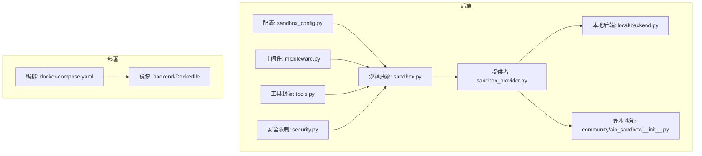
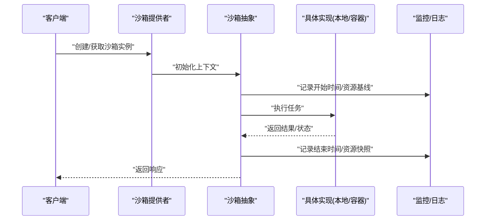
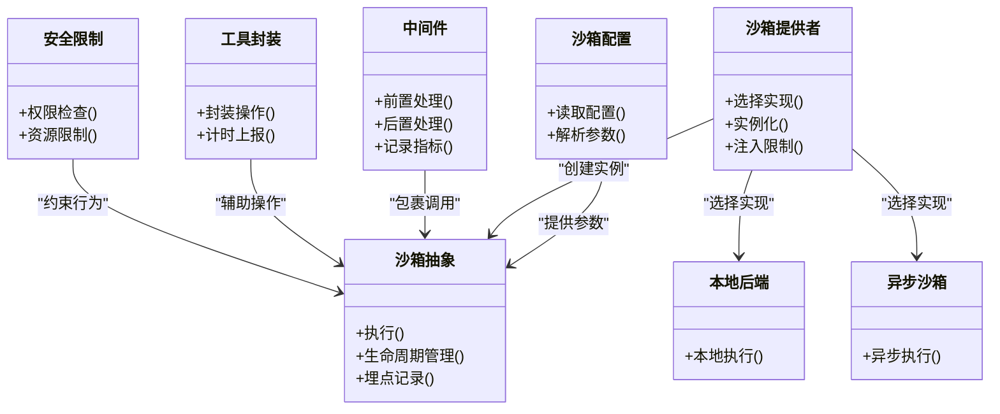

# 性能监控

<cite>
**本文引用的文件**   
- [sandbox_config.py](file://backend/packages/harness/deerflow/config/sandbox_config.py)
- [sandbox.py](file://backend/packages/harness/deerflow/sandbox/sandbox.py)
- [sandbox_provider.py](file://backend/packages/harness/deerflow/sandbox/sandbox_provider.py)
- [middleware.py](file://backend/packages/harness/deerflow/sandbox/middleware.py)
- [tools.py](file://backend/packages/harness/deerflow/sandbox/tools.py)
- [security.py](file://backend/packages/harness/deerflow/sandbox/security.py)
- [aio_sandbox/__init__.py](file://backend/packages/harness/deerflow/community/aio_sandbox/__init__.py)
- [local/backend.py](file://backend/packages/harness/deerflow/sandbox/local/backend.py)
- [docker-compose.yaml](file://docker/docker-compose.yaml)
- [Dockerfile](file://backend/Dockerfile)
</cite>

## 目录
1. [简介](#简介)
2. [项目结构](#项目结构)
3. [核心组件](#核心组件)
4. [架构总览](#架构总览)
5. [详细组件分析](#详细组件分析)
6. [依赖关系分析](#依赖关系分析)
7. [性能考虑](#性能考虑)
8. [故障排查指南](#故障排查指南)
9. [结论](#结论)
10. [附录](#附录)

## 简介
本指南聚焦于沙箱执行的性能监控与优化，围绕以下目标展开：
- 指标采集：CPU、内存、磁盘I/O、网络带宽等关键指标的收集方法与落地位置。
- 工具使用：内置性能分析器与外部监控工具的集成方式。
- 统计与分析：资源使用统计方法、瓶颈识别与优化机会定位。
- 调优实践：资源配额、缓存策略、并发控制等最佳实践。
- 预热与复用：减少启动开销的机制与配置建议。
- 基准测试：评估不同沙箱类型的性能表现的方法与工具。

## 项目结构
与沙箱性能相关的关键代码集中在后端 harness 的沙箱模块与配置中，同时涉及容器编排与镜像构建。

图表来源
- [sandbox_config.py](file://backend/packages/harness/deerflow/config/sandbox_config.py)
- [sandbox.py](file://backend/packages/harness/deerflow/sandbox/sandbox.py)
- [sandbox_provider.py](file://backend/packages/harness/deerflow/sandbox/sandbox_provider.py)
- [middleware.py](file://backend/packages/harness/deerflow/sandbox/middleware.py)
- [tools.py](file://backend/packages/harness/deerflow/sandbox/tools.py)
- [security.py](file://backend/packages/harness/deerflow/sandbox/security.py)
- [local/backend.py](file://backend/packages/harness/deerflow/sandbox/local/backend.py)
- [aio_sandbox/__init__.py](file://backend/packages/harness/deerflow/community/aio_sandbox/__init__.py)
- [docker-compose.yaml](file://docker/docker-compose.yaml)
- [Dockerfile](file://backend/Dockerfile)

章节来源
- [sandbox_config.py](file://backend/packages/harness/deerflow/config/sandbox_config.py)
- [sandbox.py](file://backend/packages/harness/deerflow/sandbox/sandbox.py)
- [sandbox_provider.py](file://backend/packages/harness/deerflow/sandbox/sandbox_provider.py)
- [middleware.py](file://backend/packages/harness/deerflow/sandbox/middleware.py)
- [tools.py](file://backend/packages/harness/deerflow/sandbox/tools.py)
- [security.py](file://backend/packages/harness/deerflow/sandbox/security.py)
- [local/backend.py](file://backend/packages/harness/deerflow/sandbox/local/backend.py)
- [aio_sandbox/__init__.py](file://backend/packages/harness/deerflow/community/aio_sandbox/__init__.py)
- [docker-compose.yaml](file://docker/docker-compose.yaml)
- [Dockerfile](file://backend/Dockerfile)

## 核心组件
- 沙箱配置（sandbox_config.py）
  - 提供沙箱运行时的参数化能力，如超时、资源限制、镜像/运行时选择等，是性能调优的关键入口。
- 沙箱抽象（sandbox.py）
  - 定义统一的沙箱接口与生命周期管理，承载执行上下文、结果聚合与错误处理，是埋点与指标采集的核心位置。
- 沙箱提供者（sandbox_provider.py）
  - 负责具体实现的选择与实例化（例如本地进程或容器），可在此注入资源限制与监控钩子。
- 中间件（middleware.py）
  - 在调用链前后插入逻辑，适合记录耗时、异常与资源快照，便于端到端追踪。
- 工具封装（tools.py）
  - 对常用操作进行封装，可在内部加入计时与度量上报。
- 安全限制（security.py）
  - 提供系统级限制（如网络、文件系统访问），影响性能边界与稳定性。
- 本地后端（local/backend.py）
  - 本地执行路径的实现，通常用于开发/测试环境，便于快速验证性能方案。
- 异步沙箱（community/aio_sandbox/__init__.py）
  - 提供异步执行能力，有助于提升吞吐与并发性能。
- 部署与镜像（docker-compose.yaml, Dockerfile）
  - 决定容器资源配额、端口映射、卷挂载与基础镜像大小，直接影响启动时延与运行时开销。

章节来源
- [sandbox_config.py](file://backend/packages/harness/deerflow/config/sandbox_config.py)
- [sandbox.py](file://backend/packages/harness/deerflow/sandbox/sandbox.py)
- [sandbox_provider.py](file://backend/packages/harness/deerflow/sandbox/sandbox_provider.py)
- [middleware.py](file://backend/packages/harness/deerflow/sandbox/middleware.py)
- [tools.py](file://backend/packages/harness/deerflow/sandbox/tools.py)
- [security.py](file://backend/packages/harness/deerflow/sandbox/security.py)
- [local/backend.py](file://backend/packages/harness/deerflow/sandbox/local/backend.py)
- [aio_sandbox/__init__.py](file://backend/packages/harness/deerflow/community/aio_sandbox/__init__.py)
- [docker-compose.yaml](file://docker/docker-compose.yaml)
- [Dockerfile](file://backend/Dockerfile)

## 架构总览
下图展示了从请求进入、沙箱选择、执行到结果返回的整体流程，以及监控埋点的位置。

图表来源
- [sandbox_provider.py](file://backend/packages/harness/deerflow/sandbox/sandbox_provider.py)
- [sandbox.py](file://backend/packages/harness/deerflow/sandbox/sandbox.py)
- [local/backend.py](file://backend/packages/harness/deerflow/sandbox/local/backend.py)
- [aio_sandbox/__init__.py](file://backend/packages/harness/deerflow/community/aio_sandbox/__init__.py)

## 详细组件分析

### 沙箱抽象层（sandbox.py）
- 职责
  - 统一执行接口、生命周期管理、错误处理与结果聚合。
  - 作为性能埋点的中心位置，记录起止时间、异常信息、资源快照。
- 关键设计
  - 通过上下文对象传递执行参数（如超时、工作目录、环境变量）。
  - 支持在成功/失败分支分别记录指标，保证数据完整性。
- 性能关注点
  - 避免在热路径中进行昂贵的序列化/反序列化。
  - 合理设置超时与重试，防止长尾任务拖垮整体吞吐。

章节来源
- [sandbox.py](file://backend/packages/harness/deerflow/sandbox/sandbox.py)

### 沙箱提供者（sandbox_provider.py）
- 职责
  - 根据配置选择并实例化具体实现（本地进程、容器等）。
  - 注入资源限制（CPU/内存）、镜像/运行时参数。
- 性能关注点
  - 实例池/复用策略可减少冷启动开销。
  - 按需扩容与限流，避免资源争用。

章节来源
- [sandbox_provider.py](file://backend/packages/harness/deerflow/sandbox/sandbox_provider.py)

### 中间件（middleware.py）
- 职责
  - 在调用链前后插入横切逻辑，适合记录耗时、异常、资源快照。
- 性能关注点
  - 埋点逻辑需轻量，避免引入额外阻塞。
  - 采样策略可降低高负载下的开销。

章节来源
- [middleware.py](file://backend/packages/harness/deerflow/sandbox/middleware.py)

### 工具封装（tools.py）
- 职责
  - 封装常用操作（如文件读写、命令执行），统一错误与返回值。
- 性能关注点
  - 在内部增加计时与度量上报，便于细粒度定位热点。
  - 批量操作优先，减少系统调用次数。

章节来源
- [tools.py](file://backend/packages/harness/deerflow/sandbox/tools.py)

### 安全限制（security.py）
- 职责
  - 提供系统级限制（如网络、文件系统访问），保障隔离与安全。
- 性能关注点
  - 安全校验应尽可能前置与缓存，避免重复计算。
  - 限制策略与性能之间存在权衡，需按场景调优。

章节来源
- [security.py](file://backend/packages/harness/deerflow/sandbox/security.py)

### 本地后端（local/backend.py）
- 职责
  - 本地执行路径的实现，常用于开发与测试。
- 性能关注点
  - 本地路径启动快，但隔离性弱；适合快速验证性能方案。
  - 可通过进程池/线程池提升并发度。

章节来源
- [local/backend.py](file://backend/packages/harness/deerflow/sandbox/local/backend.py)

### 异步沙箱（community/aio_sandbox/__init__.py）
- 职责
  - 提供异步执行能力，提升吞吐与并发性能。
- 性能关注点
  - 结合事件循环与背压控制，避免内存暴涨。
  - 适用于IO密集型任务。

章节来源
- [aio_sandbox/__init__.py](file://backend/packages/harness/deerflow/community/aio_sandbox/__init__.py)

### 部署与镜像（docker-compose.yaml, Dockerfile）
- 职责
  - 定义容器资源配额、端口映射、卷挂载与基础镜像。
- 性能关注点
  - 镜像体积越小，拉取与启动越快。
  - 合理的资源限制可避免宿主过载。

章节来源
- [docker-compose.yaml](file://docker/docker-compose.yaml)
- [Dockerfile](file://backend/Dockerfile)

## 依赖关系分析
沙箱模块之间的耦合关系如下：

图表来源
- [sandbox_config.py](file://backend/packages/harness/deerflow/config/sandbox_config.py)
- [sandbox.py](file://backend/packages/harness/deerflow/sandbox/sandbox.py)
- [sandbox_provider.py](file://backend/packages/harness/deerflow/sandbox/sandbox_provider.py)
- [middleware.py](file://backend/packages/harness/deerflow/sandbox/middleware.py)
- [tools.py](file://backend/packages/harness/deerflow/sandbox/tools.py)
- [security.py](file://backend/packages/harness/deerflow/sandbox/security.py)
- [local/backend.py](file://backend/packages/harness/deerflow/sandbox/local/backend.py)
- [aio_sandbox/__init__.py](file://backend/packages/harness/deerflow/community/aio_sandbox/__init__.py)

章节来源
- [sandbox_config.py](file://backend/packages/harness/deerflow/config/sandbox_config.py)
- [sandbox.py](file://backend/packages/harness/deerflow/sandbox/sandbox.py)
- [sandbox_provider.py](file://backend/packages/harness/deerflow/sandbox/sandbox_provider.py)
- [middleware.py](file://backend/packages/harness/deerflow/sandbox/middleware.py)
- [tools.py](file://backend/packages/harness/deerflow/sandbox/tools.py)
- [security.py](file://backend/packages/harness/deerflow/sandbox/security.py)
- [local/backend.py](file://backend/packages/harness/deerflow/sandbox/local/backend.py)
- [aio_sandbox/__init__.py](file://backend/packages/harness/deerflow/community/aio_sandbox/__init__.py)

## 性能考虑
- 指标采集建议
  - CPU使用率：在沙箱抽象层记录任务起止时间，结合系统工具（如 cgroup/容器指标）汇总CPU占比。
  - 内存占用：在任务开始与结束时采集RSS/VMS，结合容器cgroup统计峰值与均值。
  - 磁盘I/O：通过容器I/O计数器或宿主iostat/vmstat观测读写延迟与吞吐。
  - 网络带宽：利用容器网络统计或宿主ss/netstat观察带宽与时延。
- 工具集成
  - 内置分析器：在中间件与工具封装中加入轻量计时与计数上报，输出结构化日志。
  - 外部监控：将容器指标暴露给Prometheus/Grafana，或使用eBPF/系统探针采集更细粒度指标。
- 统计与分析
  - 分位值（P50/P90/P99）更能反映长尾问题。
  - 关联分析：将任务类型、输入规模、资源配额与指标做相关性分析，定位瓶颈。
- 调优实践
  - 资源配额：依据历史峰值设定CPU/内存上限，预留缓冲避免抖动。
  - 缓存策略：对频繁使用的依赖包、模型权重、静态资源进行缓存，减少冷启动。
  - 并发控制：结合队列与令牌桶限流，避免突发流量导致雪崩。
- 预热与复用
  - 预拉取镜像与依赖，保持最小可用实例池。
  - 会话/连接复用，减少握手与鉴权开销。
- 基准测试
  - 设计典型用例集（小/中/大输入、IO密集/CPU密集）。
  - 固定资源与环境，对比不同沙箱类型（本地/容器/异步）的吞吐与时延。
  - 自动化脚本持续回归，纳入CI以发现退化。

[本节为通用指导，不直接分析具体文件]

## 故障排查指南
- 常见问题定位
  - 启动慢：检查镜像体积、依赖安装步骤、预热策略是否生效。
  - 内存泄漏：关注RSS增长曲线，结合堆栈采样定位热点。
  - IO瓶颈：查看磁盘I/O等待与队列长度，必要时调整存储类型或批量化写入。
  - 网络拥塞：检查带宽上限、DNS解析耗时、连接池大小。
- 日志与追踪
  - 在中间件与工具封装中输出结构化日志，包含任务ID、耗时、资源快照。
  - 结合分布式追踪（Trace ID）串联跨组件调用。
- 回滚与降级
  - 当指标异常时自动降级至备用实现或降低并发度。
  - 保留最近N次运行的快照，便于回溯分析。

章节来源
- [middleware.py](file://backend/packages/harness/deerflow/sandbox/middleware.py)
- [tools.py](file://backend/packages/harness/deerflow/sandbox/tools.py)
- [sandbox.py](file://backend/packages/harness/deerflow/sandbox/sandbox.py)

## 结论
通过在沙箱抽象层与中间件集中埋点，并结合容器与宿主侧的系统指标，可以全面掌握CPU、内存、磁盘I/O与网络带宽的使用情况。配合资源配额、缓存策略与并发控制，能够显著降低启动开销与长尾时延。建立完善的基准测试与回归体系，有助于持续优化与稳定演进。

[本节为总结性内容，不直接分析具体文件]

## 附录
- 术语说明
  - 沙箱：隔离执行环境，确保安全性与可控性。
  - 指标：用于衡量性能的量化数据，如时延、吞吐、资源使用率。
  - 预热：提前准备运行环境与依赖，缩短首次请求时延。
- 参考路径
  - 配置项示例与默认值请参考配置文件与文档。
  - 监控面板模板与告警规则可根据团队需求定制。

[本节为补充信息，不直接分析具体文件]