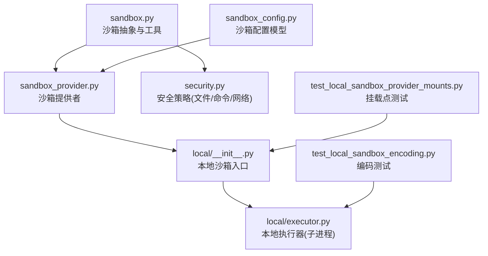
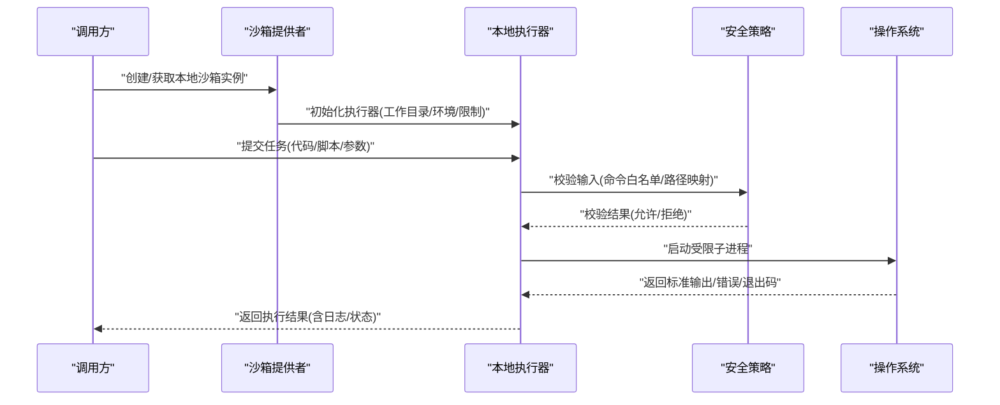
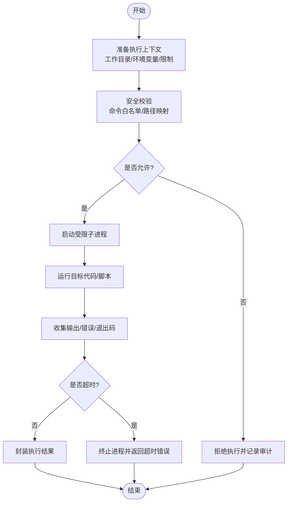
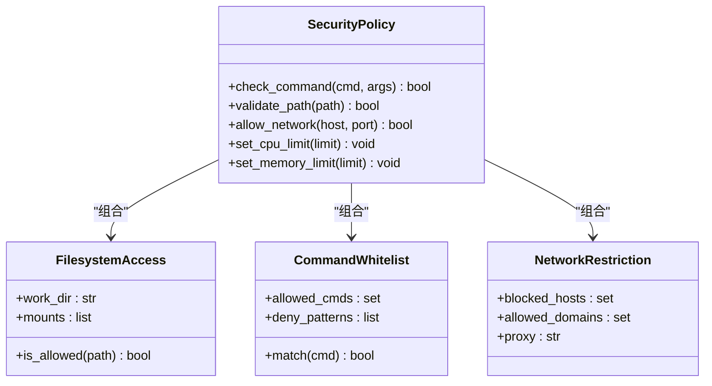
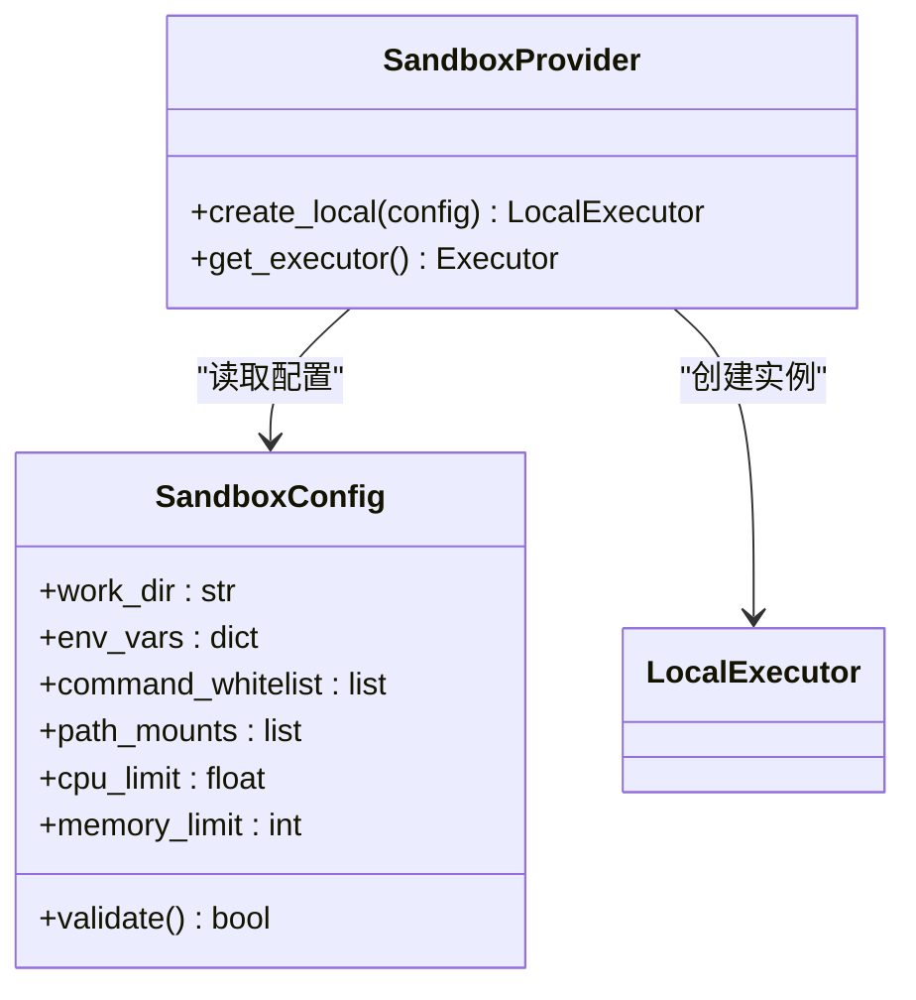
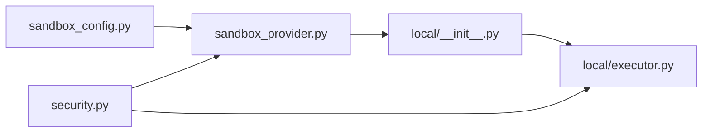

# 本地沙箱

<cite>
**本文引用的文件**   
- [sandbox.py](file://backend/packages/harness/deerflow/sandbox/sandbox.py)
- [local/__init__.py](file://backend/packages/harness/deerflow/sandbox/local/__init__.py)
- [local/executor.py](file://backend/packages/harness/deerflow/sandbox/local/executor.py)
- [security.py](file://backend/packages/harness/deerflow/sandbox/security.py)
- [sandbox_config.py](file://backend/packages/harness/deerflow/config/sandbox_config.py)
- [sandbox_provider.py](file://backend/packages/harness/deerflow/sandbox/sandbox_provider.py)
- [test_local_sandbox_encoding.py](file://backend/tests/test_local_sandbox_encoding.py)
- [test_local_sandbox_provider_mounts.py](file://backend/tests/test_local_sandbox_provider_mounts.py)
</cite>

## 目录
1. [简介](#简介)
2. [项目结构](#项目结构)
3. [核心组件](#核心组件)
4. [架构总览](#架构总览)
5. [详细组件分析](#详细组件分析)
6. [依赖关系分析](#依赖关系分析)
7. [性能与适用场景](#性能与适用场景)
8. [配置选项与最佳实践](#配置选项与最佳实践)
9. [故障排查指南](#故障排查指南)
10. [结论](#结论)

## 简介
本文件面向开发者与运维人员，系统化阐述本地沙箱的工作原理、配置项与安全策略。本地沙箱基于 Python 子进程执行模型，提供轻量级的资源隔离与访问控制能力，适用于开发测试环境与轻量级任务执行。文档涵盖工作目录设置、环境变量注入、系统命令白名单、文件路径映射等关键配置，并给出安全策略（文件系统访问控制、网络访问限制、CPU/内存限制）与最佳实践建议。同时包含性能特点说明与常见问题排查方法。

## 项目结构
与本地沙箱相关的代码主要位于后端 harness 的 sandbox 模块及其配置模块中：
- 沙箱抽象与提供者：定义统一接口与本地实现选择
- 本地执行器：基于子进程的代码执行与资源限制
- 安全策略：文件访问控制、命令白名单、网络限制等
- 配置模型：加载与校验本地沙箱相关配置
- 测试用例：覆盖编码、挂载点等关键行为

图表来源
- [sandbox.py:1-200](file://backend/packages/harness/deerflow/sandbox/sandbox.py#L1-L200)
- [sandbox_provider.py:1-200](file://backend/packages/harness/deerflow/sandbox/sandbox_provider.py#L1-L200)
- [local/__init__.py:1-200](file://backend/packages/harness/deerflow/sandbox/local/__init__.py#L1-L200)
- [local/executor.py:1-200](file://backend/packages/harness/deerflow/sandbox/local/executor.py#L1-L200)
- [security.py:1-200](file://backend/packages/harness/deerflow/sandbox/security.py#L1-L200)
- [sandbox_config.py:1-200](file://backend/packages/harness/deerflow/config/sandbox_config.py#L1-L200)
- [test_local_sandbox_encoding.py:1-200](file://backend/tests/test_local_sandbox_encoding.py#L1-L200)
- [test_local_sandbox_provider_mounts.py:1-200](file://backend/tests/test_local_sandbox_provider_mounts.py#L1-L200)

章节来源
- [sandbox.py:1-200](file://backend/packages/harness/deerflow/sandbox/sandbox.py#L1-L200)
- [sandbox_provider.py:1-200](file://backend/packages/harness/deerflow/sandbox/sandbox_provider.py#L1-L200)
- [local/__init__.py:1-200](file://backend/packages/harness/deerflow/sandbox/local/__init__.py#L1-L200)
- [local/executor.py:1-200](file://backend/packages/harness/deerflow/sandbox/local/executor.py#L1-L200)
- [security.py:1-200](file://backend/packages/harness/deerflow/sandbox/security.py#L1-L200)
- [sandbox_config.py:1-200](file://backend/packages/harness/deerflow/config/sandbox_config.py#L1-L200)
- [test_local_sandbox_encoding.py:1-200](file://backend/tests/test_local_sandbox_encoding.py#L1-L200)
- [test_local_sandbox_provider_mounts.py:1-200](file://backend/tests/test_local_sandbox_provider_mounts.py#L1-L200)

## 核心组件
- 沙箱抽象与工具：定义统一的执行接口、结果封装与通用工具函数，供上层调用。
- 本地沙箱提供者：根据配置选择本地执行器，负责生命周期管理与上下文传递。
- 本地执行器：基于 Python 子进程运行用户代码或脚本，支持超时、资源限制与输出收集。
- 安全策略：对文件系统访问、系统命令、网络访问进行约束与审计。
- 配置模型：集中管理本地沙箱相关参数，包括工作目录、环境变量、白名单、挂载映射等。
- 测试用例：验证编码处理、挂载点映射等关键路径的正确性。

章节来源
- [sandbox.py:1-200](file://backend/packages/harness/deerflow/sandbox/sandbox.py#L1-L200)
- [sandbox_provider.py:1-200](file://backend/packages/harness/deerflow/sandbox/sandbox_provider.py#L1-L200)
- [local/executor.py:1-200](file://backend/packages/harness/deerflow/sandbox/local/executor.py#L1-L200)
- [security.py:1-200](file://backend/packages/harness/deerflow/sandbox/security.py#L1-L200)
- [sandbox_config.py:1-200](file://backend/packages/harness/deerflow/config/sandbox_config.py#L1-L200)
- [test_local_sandbox_encoding.py:1-200](file://backend/tests/test_local_sandbox_encoding.py#L1-L200)
- [test_local_sandbox_provider_mounts.py:1-200](file://backend/tests/test_local_sandbox_provider_mounts.py#L1-L200)

## 架构总览
本地沙箱采用“抽象接口 + 本地实现”的分层设计。上层通过沙箱提供者获取执行器实例，执行器在受控的子进程中运行目标代码，安全策略贯穿整个执行链路，确保最小权限原则。

图表来源
- [sandbox_provider.py:1-200](file://backend/packages/harness/deerflow/sandbox/sandbox_provider.py#L1-L200)
- [local/executor.py:1-200](file://backend/packages/harness/deerflow/sandbox/local/executor.py#L1-L200)
- [security.py:1-200](file://backend/packages/harness/deerflow/sandbox/security.py#L1-L200)

## 详细组件分析

### 本地执行器（子进程执行模型）
- 执行模型：使用 Python 子进程运行目标代码或脚本，捕获标准输出、标准错误与退出码。
- 资源限制：可配置 CPU 与内存上限，结合系统级限制（如 ulimit 或容器化手段）增强隔离。
- 超时控制：为任务设置最大运行时间，避免长时间占用资源。
- 工作目录：限定执行根目录，防止越权访问宿主文件系统。
- 环境变量：按需注入环境变量，满足外部依赖与服务发现需求。
- 输出编码：正确处理多语言编码，避免乱码问题。

图表来源
- [local/executor.py:1-200](file://backend/packages/harness/deerflow/sandbox/local/executor.py#L1-L200)
- [security.py:1-200](file://backend/packages/harness/deerflow/sandbox/security.py#L1-L200)

章节来源
- [local/executor.py:1-200](file://backend/packages/harness/deerflow/sandbox/local/executor.py#L1-L200)
- [security.py:1-200](file://backend/packages/harness/deerflow/sandbox/security.py#L1-L200)
- [test_local_sandbox_encoding.py:1-200](file://backend/tests/test_local_sandbox_encoding.py#L1-L200)

### 安全策略（文件系统/命令/网络）
- 文件系统访问控制：
  - 仅允许访问指定工作目录与映射路径，禁止任意路径读取/写入。
  - 支持只读挂载与读写挂载区分，降低数据泄露风险。
- 系统命令白名单：
  - 仅允许预定义的安全命令集合，拦截危险操作（如删除、格式化、提权）。
  - 对命令参数进行二次校验，防止注入攻击。
- 网络访问限制：
  - 默认阻断外网访问，必要时通过代理或域名白名单放行。
  - 记录网络请求审计日志，便于追踪异常行为。
- 资源限制：
  - CPU 使用率与内存上限，防止资源耗尽型攻击。
  - 进程数与文件描述符限制，避免系统不稳定。

图表来源
- [security.py:1-200](file://backend/packages/harness/deerflow/sandbox/security.py#L1-L200)

章节来源
- [security.py:1-200](file://backend/packages/harness/deerflow/sandbox/security.py#L1-L200)

### 沙箱提供者与配置模型
- 沙箱提供者：
  - 根据配置选择本地执行器，负责实例化与生命周期管理。
  - 将上层调用与底层执行解耦，便于扩展其他执行后端。
- 配置模型：
  - 集中管理本地沙箱参数，包括工作目录、环境变量、白名单、挂载映射、资源限制等。
  - 提供默认值与校验逻辑，确保配置合法可用。

图表来源
- [sandbox_provider.py:1-200](file://backend/packages/harness/deerflow/sandbox/sandbox_provider.py#L1-L200)
- [sandbox_config.py:1-200](file://backend/packages/harness/deerflow/config/sandbox_config.py#L1-L200)
- [local/__init__.py:1-200](file://backend/packages/harness/deerflow/sandbox/local/__init__.py#L1-L200)

章节来源
- [sandbox_provider.py:1-200](file://backend/packages/harness/deerflow/sandbox/sandbox_provider.py#L1-L200)
- [sandbox_config.py:1-200](file://backend/packages/harness/deerflow/config/sandbox_config.py#L1-L200)
- [local/__init__.py:1-200](file://backend/packages/harness/deerflow/sandbox/local/__init__.py#L1-L200)
- [test_local_sandbox_provider_mounts.py:1-200](file://backend/tests/test_local_sandbox_provider_mounts.py#L1-L200)

## 依赖关系分析
- 模块耦合：
  - 沙箱提供者依赖配置模型与本地执行器，形成松耦合的装配关系。
  - 安全策略被执行器与安全校验流程共同引用，保证一致的策略应用。
- 外部依赖：
  - 操作系统进程管理、文件系统、网络栈。
  - 可选的系统级资源限制工具（如 cgroups、ulimit）。
- 潜在循环依赖：
  - 当前分层清晰，未见直接循环依赖；需关注新增功能时的导入顺序。

图表来源
- [sandbox_config.py:1-200](file://backend/packages/harness/deerflow/config/sandbox_config.py#L1-L200)
- [sandbox_provider.py:1-200](file://backend/packages/harness/deerflow/sandbox/sandbox_provider.py#L1-L200)
- [local/__init__.py:1-200](file://backend/packages/harness/deerflow/sandbox/local/__init__.py#L1-L200)
- [local/executor.py:1-200](file://backend/packages/harness/deerflow/sandbox/local/executor.py#L1-L200)
- [security.py:1-200](file://backend/packages/harness/deerflow/sandbox/security.py#L1-L200)

章节来源
- [sandbox_config.py:1-200](file://backend/packages/harness/deerflow/config/sandbox_config.py#L1-L200)
- [sandbox_provider.py:1-200](file://backend/packages/harness/deerflow/sandbox/sandbox_provider.py#L1-L200)
- [local/__init__.py:1-200](file://backend/packages/harness/deerflow/sandbox/local/__init__.py#L1-L200)
- [local/executor.py:1-200](file://backend/packages/harness/deerflow/sandbox/local/executor.py#L1-L200)
- [security.py:1-200](file://backend/packages/harness/deerflow/sandbox/security.py#L1-L200)

## 性能与适用场景
- 性能特点：
  - 子进程启动开销较低，适合短时任务与高频调用。
  - 资源限制可有效防止单任务拖垮整体服务。
  - 输出缓冲与流式传输可降低内存峰值。
- 适用场景：
  - 开发测试环境的自动化脚本执行。
  - 轻量数据处理与转换任务。
  - 技能/工具的离线验证与回归测试。
- 不适用场景：
  - 需要强隔离的生产环境（建议使用容器或虚拟机）。
  - 长时计算密集型任务（建议使用专用计算集群）。

[本节为通用指导，不直接分析具体文件]

## 配置选项与最佳实践
- 工作目录设置：
  - 明确指定工作目录，避免默认路径带来的权限风险。
  - 使用相对路径与绝对路径的组合，便于跨平台兼容。
- 环境变量注入：
  - 仅注入必要的环境变量，遵循最小权限原则。
  - 敏感信息通过密钥管理服务注入，避免硬编码。
- 系统命令白名单：
  - 维护最小命令集，定期审查与更新。
  - 对参数进行严格校验，防止注入与越权。
- 文件路径映射：
  - 使用只读挂载用于静态资源，读写挂载用于临时输出。
  - 限制挂载深度与数量，减少攻击面。
- 资源限制：
  - 合理设置 CPU 与内存上限，避免资源争用。
  - 启用超时保护，及时回收僵尸进程。
- 最佳实践：
  - 在测试环境中模拟生产限制，提前发现性能瓶颈。
  - 记录执行审计日志，便于问题定位与合规审计。
  - 对输出进行大小限制与内容过滤，防止恶意 payload。

章节来源
- [sandbox_config.py:1-200](file://backend/packages/harness/deerflow/config/sandbox_config.py#L1-L200)
- [security.py:1-200](file://backend/packages/harness/deerflow/sandbox/security.py#L1-L200)
- [local/executor.py:1-200](file://backend/packages/harness/deerflow/sandbox/local/executor.py#L1-L200)
- [test_local_sandbox_provider_mounts.py:1-200](file://backend/tests/test_local_sandbox_provider_mounts.py#L1-L200)

## 故障排查指南
- 常见症状：
  - 执行超时：检查任务复杂度与超时阈值设置。
  - 权限错误：确认工作目录与挂载点权限是否正确。
  - 编码乱码：验证输出编码设置与终端兼容性。
  - 命令被拒：核对命令白名单与参数校验规则。
- 诊断步骤：
  - 查看执行日志与审计记录，定位失败阶段。
  - 复现最小用例，逐步放宽限制以缩小范围。
  - 检查系统资源使用情况，排除宿主机瓶颈。
- 解决方法：
  - 调整超时与资源限制参数，平衡稳定性与性能。
  - 修正路径映射与权限配置，确保读写符合预期。
  - 更新命令白名单，添加必要但安全的命令。
  - 修复编码设置，确保多语言输出正确显示。

章节来源
- [test_local_sandbox_encoding.py:1-200](file://backend/tests/test_local_sandbox_encoding.py#L1-L200)
- [local/executor.py:1-200](file://backend/packages/harness/deerflow/sandbox/local/executor.py#L1-L200)
- [security.py:1-200](file://backend/packages/harness/deerflow/sandbox/security.py#L1-L200)

## 结论
本地沙箱通过子进程执行模型与多层次安全策略，提供了轻量且可控的任务执行环境。合理的配置与最佳实践能够显著提升安全性与稳定性，适用于开发与测试场景。对于更高隔离要求的生产环境，建议结合容器或虚拟机方案。持续监控与审计有助于及时发现与解决问题，保障系统长期稳定运行。