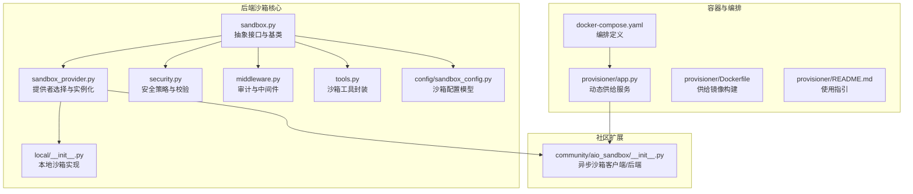
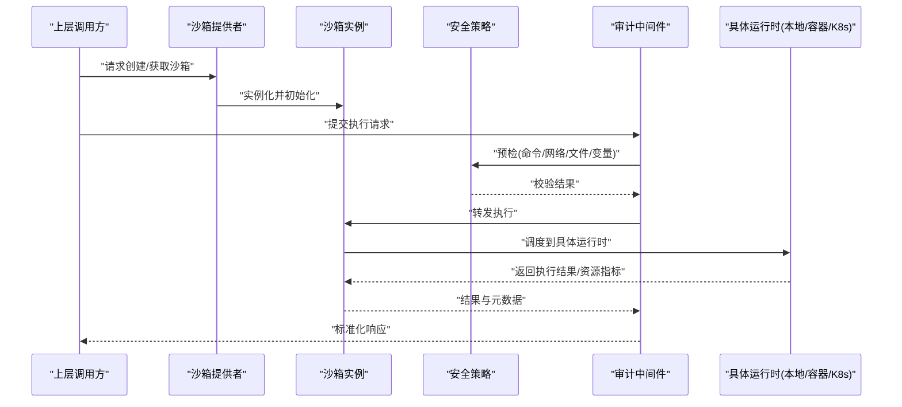
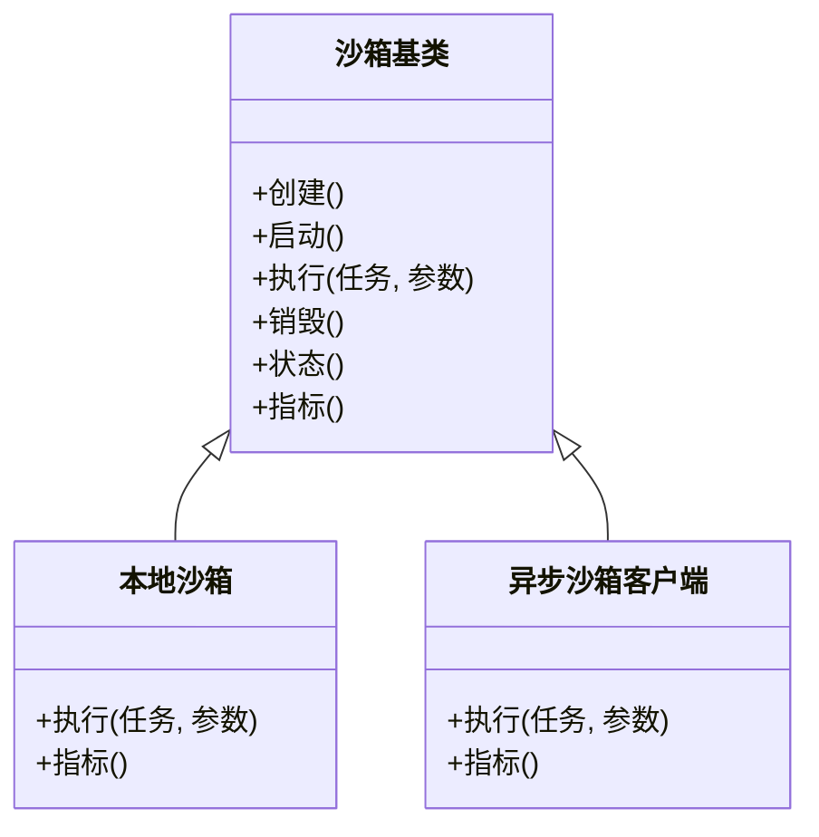
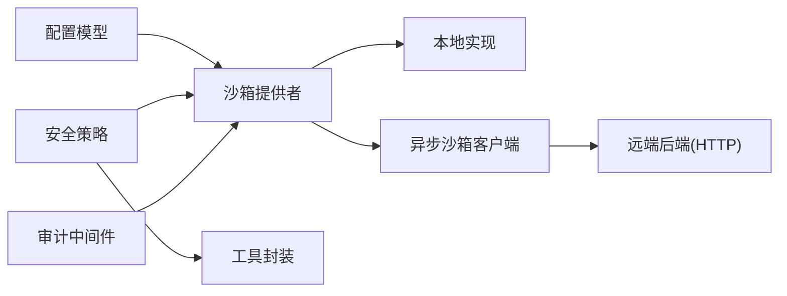
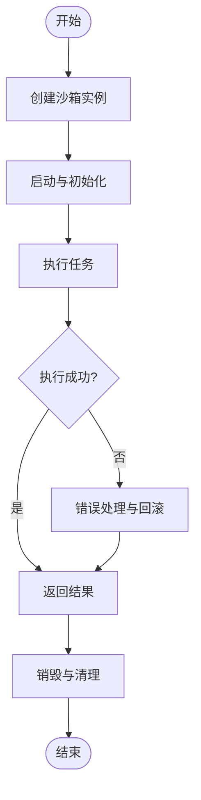

# 沙箱执行环境

<cite>
**本文引用的文件**   
- [sandbox.py](file://backend/packages/harness/deerflow/sandbox/sandbox.py)
- [sandbox_provider.py](file://backend/packages/harness/deerflow/sandbox/sandbox_provider.py)
- [sandbox_config.py](file://backend/packages/harness/deerflow/config/sandbox_config.py)
- [security.py](file://backend/packages/harness/deerflow/sandbox/security.py)
- [middleware.py](file://backend/packages/harness/deerflow/sandbox/middleware.py)
- [tools.py](file://backend/packages/harness/deerflow/sandbox/tools.py)
- [local/__init__.py](file://backend/packages/harness/deerflow/sandbox/local/__init__.py)
- [aio_sandbox/__init__.py](file://backend/packages/harness/deerflow/community/aio_sandbox/__init__.py)
- [test_aio_sandbox.py](file://backend/tests/test_aio_sandbox.py)
- [test_aio_sandbox_local_backend.py](file://backend/tests/test_aio_sandbox_local_backend.py)
- [test_aio_sandbox_provider.py](file://backend/tests/test_aio_sandbox_provider.py)
- [docker-compose.yaml](file://docker/docker-compose.yaml)
- [provisioner/app.py](file://docker/provisioner/app.py)
- [provisioner/Dockerfile](file://docker/provisioner/Dockerfile)
- [provisioner/README.md](file://docker/provisioner/README.md)
</cite>

## 目录
1. [简介](#简介)
2. [项目结构](#项目结构)
3. [核心组件](#核心组件)
4. [架构总览](#架构总览)
5. [详细组件分析](#详细组件分析)
6. [依赖关系分析](#依赖关系分析)
7. [性能考虑](#性能考虑)
8. [故障排查指南](#故障排查指南)
9. [结论](#结论)
10. [附录](#附录)

## 简介
本文件面向 DeerFlow 的沙箱执行环境，系统性阐述沙箱概念、安全隔离的重要性与实现要点，覆盖本地沙箱、容器沙箱与 Kubernetes 集群沙箱三类运行模式。文档包含配置方法、部署步骤、资源限制、网络隔离、文件系统访问控制、生命周期管理（创建/启动/执行/销毁）、沙箱间通信与数据共享方案、性能监控与资源统计、安全策略最佳实践，以及故障排查与优化建议。

## 项目结构
DeerFlow 的沙箱能力集中在后端 harness 的 sandbox 模块中，并通过配置模块提供统一入口；同时社区扩展 aio_sandbox 提供了异步沙箱客户端与本地后端示例；容器编排通过 docker-compose 与 provisioner 服务完成容器化部署与动态供给。

图示来源
- [sandbox.py](file://backend/packages/harness/deerflow/sandbox/sandbox.py)
- [sandbox_provider.py](file://backend/packages/harness/deerflow/sandbox/sandbox_provider.py)
- [security.py](file://backend/packages/harness/deerflow/sandbox/security.py)
- [middleware.py](file://backend/packages/harness/deerflow/sandbox/middleware.py)
- [tools.py](file://backend/packages/harness/deerflow/sandbox/tools.py)
- [sandbox_config.py](file://backend/packages/harness/deerflow/config/sandbox_config.py)
- [local/__init__.py](file://backend/packages/harness/deerflow/sandbox/local/__init__.py)
- [aio_sandbox/__init__.py](file://backend/packages/harness/deerflow/community/aio_sandbox/__init__.py)
- [docker-compose.yaml](file://docker/docker-compose.yaml)
- [provisioner/app.py](file://docker/provisioner/app.py)
- [provisioner/Dockerfile](file://docker/provisioner/Dockerfile)
- [provisioner/README.md](file://docker/provisioner/README.md)

章节来源
- [sandbox.py](file://backend/packages/harness/deerflow/sandbox/sandbox.py)
- [sandbox_provider.py](file://backend/packages/harness/deerflow/sandbox/sandbox_provider.py)
- [sandbox_config.py](file://backend/packages/harness/deerflow/config/sandbox_config.py)
- [security.py](file://backend/packages/harness/deerflow/sandbox/security.py)
- [middleware.py](file://backend/packages/harness/deerflow/sandbox/middleware.py)
- [tools.py](file://backend/packages/harness/deerflow/sandbox/tools.py)
- [local/__init__.py](file://backend/packages/harness/deerflow/sandbox/local/__init__.py)
- [aio_sandbox/__init__.py](file://backend/packages/harness/deerflow/community/aio_sandbox/__init__.py)
- [docker-compose.yaml](file://docker/docker-compose.yaml)
- [provisioner/app.py](file://docker/provisioner/app.py)
- [provisioner/Dockerfile](file://docker/provisioner/Dockerfile)
- [provisioner/README.md](file://docker/provisioner/README.md)

## 核心组件
- 抽象沙箱接口与基类：定义统一的创建、启动、执行、销毁、状态查询等生命周期方法与能力边界，为不同运行时提供一致契约。
- 沙箱提供者：根据配置选择具体实现（本地进程、容器或远程异步后端），负责实例化与资源分配。
- 安全策略：对命令白名单、网络访问、文件系统路径、环境变量等进行校验与约束。
- 审计中间件：记录沙箱调用上下文、输入输出摘要、资源消耗与错误信息，便于追踪与合规。
- 工具封装：将常用操作（如代码执行、文件读写、搜索）以受控工具形式暴露给上层 Agent。
- 配置模型：集中描述沙箱类型、资源配额、超时、挂载卷、网络策略、日志级别等。
- 本地实现：基于进程级隔离的最小开销实现，适合开发调试与轻量任务。
- 异步沙箱扩展：提供 HTTP 客户端与本地后端示例，用于跨进程/跨主机执行与编排集成。

章节来源
- [sandbox.py](file://backend/packages/harness/deerflow/sandbox/sandbox.py)
- [sandbox_provider.py](file://backend/packages/harness/deerflow/sandbox/sandbox_provider.py)
- [security.py](file://backend/packages/harness/deerflow/sandbox/security.py)
- [middleware.py](file://backend/packages/harness/deerflow/sandbox/middleware.py)
- [tools.py](file://backend/packages/harness/deerflow/sandbox/tools.py)
- [sandbox_config.py](file://backend/packages/harness/deerflow/config/sandbox_config.py)
- [local/__init__.py](file://backend/packages/harness/deerflow/sandbox/local/__init__.py)
- [aio_sandbox/__init__.py](file://backend/packages/harness/deerflow/community/aio_sandbox/__init__.py)

## 架构总览
下图展示了从上层调用到具体沙箱执行的端到端流程，包括提供者选择、安全校验、中间件审计、具体运行时执行与结果返回。

图示来源
- [sandbox_provider.py](file://backend/packages/harness/deerflow/sandbox/sandbox_provider.py)
- [sandbox.py](file://backend/packages/harness/deerflow/sandbox/sandbox.py)
- [security.py](file://backend/packages/harness/deerflow/sandbox/security.py)
- [middleware.py](file://backend/packages/harness/deerflow/sandbox/middleware.py)

## 详细组件分析

### 抽象沙箱接口与基类
- 职责：定义生命周期方法（创建、启动、执行、销毁）、状态查询、资源指标上报、错误语义统一。
- 设计要点：
  - 明确异常类型与错误码，便于上层降级与重试。
  - 提供可插拔的安全检查点与审计钩子。
  - 支持超时、取消与幂等性保障。
- 复杂度：接口层 O(1)，实际复杂度由具体运行时决定。

图示来源
- [sandbox.py](file://backend/packages/harness/deerflow/sandbox/sandbox.py)
- [local/__init__.py](file://backend/packages/harness/deerflow/sandbox/local/__init__.py)
- [aio_sandbox/__init__.py](file://backend/packages/harness/deerflow/community/aio_sandbox/__init__.py)

章节来源
- [sandbox.py](file://backend/packages/harness/deerflow/sandbox/sandbox.py)
- [local/__init__.py](file://backend/packages/harness/deerflow/sandbox/local/__init__.py)
- [aio_sandbox/__init__.py](file://backend/packages/harness/deerflow/community/aio_sandbox/__init__.py)

### 沙箱提供者
- 职责：根据配置解析与选择具体实现（本地/容器/K8s），管理实例池与复用策略。
- 关键点：
  - 配置驱动：按类型路由到对应工厂。
  - 资源上限：并发数、最大实例数、回收策略。
  - 健康检查：失败自动剔除与重建。
- 复杂度：选择与实例化 O(1)，池化策略影响整体吞吐。

章节来源
- [sandbox_provider.py](file://backend/packages/harness/deerflow/sandbox/sandbox_provider.py)
- [sandbox_config.py](file://backend/packages/harness/deerflow/config/sandbox_config.py)

### 安全策略
- 维度：
  - 命令白名单：仅允许受控命令集合。
  - 网络访问：域名/IP 白名单、端口限制、出站入站策略。
  - 文件系统：只读挂载、最小权限目录、路径前缀校验。
  - 环境变量：敏感键过滤、默认值注入。
  - 资源限额：CPU/内存/磁盘/时间上限。
- 校验时机：执行前预检、执行中拦截、执行后审计。
- 可扩展：插件式策略注册与优先级排序。

章节来源
- [security.py](file://backend/packages/harness/deerflow/sandbox/security.py)

### 审计中间件
- 功能：记录调用链、输入摘要、输出摘要、耗时、资源用量、错误堆栈。
- 用途：问题定位、合规审计、容量规划。
- 存储：可对接日志系统或指标平台。

章节来源
- [middleware.py](file://backend/packages/harness/deerflow/sandbox/middleware.py)

### 工具封装
- 目标：将通用操作封装为受限工具，避免直接暴露底层 API。
- 典型工具：代码执行、文件读取/写入、搜索、URL 抓取（受网安策略控制）。
- 安全：参数校验、大小限制、超时保护、输出截断。

章节来源
- [tools.py](file://backend/packages/harness/deerflow/sandbox/tools.py)

### 本地沙箱实现
- 特点：进程级隔离、低延迟、易调试，适合开发与小规模任务。
- 适用场景：快速验证、单节点测试、非关键任务。
- 局限：隔离强度有限，不适合多租户或高风险任务。

章节来源
- [local/__init__.py](file://backend/packages/harness/deerflow/sandbox/local/__init__.py)

### 异步沙箱扩展（HTTP 客户端与本地后端）
- 角色：
  - 客户端：通过 HTTP 与远端沙箱后端交互，支持异步调用。
  - 本地后端：在单机上提供 HTTP 服务，模拟远端行为，便于联调。
- 优势：解耦执行与调度，便于横向扩展与容器化部署。
- 部署：可通过 docker-compose 启动后端，供上层调用。

章节来源
- [aio_sandbox/__init__.py](file://backend/packages/harness/deerflow/community/aio_sandbox/__init__.py)
- [docker-compose.yaml](file://docker/docker-compose.yaml)

## 依赖关系分析
- 内部依赖：
  - 提供者依赖配置与安全策略。
  - 中间件与安全策略贯穿执行链路。
  - 工具封装依赖安全策略进行参数与资源校验。
- 外部依赖：
  - 容器运行时（Docker）或编排系统（Kubernetes）用于容器/K8s 沙箱。
  - HTTP 客户端用于异步沙箱后端通信。
- 耦合与内聚：
  - 接口层清晰，运行时替换成本低。
  - 安全与审计作为横切关注点，降低业务侵入。

图示来源
- [sandbox_provider.py](file://backend/packages/harness/deerflow/sandbox/sandbox_provider.py)
- [sandbox_config.py](file://backend/packages/harness/deerflow/config/sandbox_config.py)
- [security.py](file://backend/packages/harness/deerflow/sandbox/security.py)
- [middleware.py](file://backend/packages/harness/deerflow/sandbox/middleware.py)
- [tools.py](file://backend/packages/harness/deerflow/sandbox/tools.py)
- [aio_sandbox/__init__.py](file://backend/packages/harness/deerflow/community/aio_sandbox/__init__.py)

章节来源
- [sandbox_provider.py](file://backend/packages/harness/deerflow/sandbox/sandbox_provider.py)
- [sandbox_config.py](file://backend/packages/harness/deerflow/config/sandbox_config.py)
- [security.py](file://backend/packages/harness/deerflow/sandbox/security.py)
- [middleware.py](file://backend/packages/harness/deerflow/sandbox/middleware.py)
- [tools.py](file://backend/packages/harness/deerflow/sandbox/tools.py)
- [aio_sandbox/__init__.py](file://backend/packages/harness/deerflow/community/aio_sandbox/__init__.py)

## 性能考虑
- 资源配额：合理设置 CPU/内存/IO 上限，避免争用与抖动。
- 连接复用：异步后端采用连接池与长连接，减少握手开销。
- 批处理与缓存：对重复计算结果进行短期缓存，注意失效策略。
- 超时与熔断：短超时+快速失败，防止雪崩。
- 观测性：采集指标（QPS、P99、错误率、资源利用率）并告警。

[本节为通用指导，不直接分析具体文件]

## 故障排查指南
- 常见问题：
  - 沙箱无法创建：检查提供者配置、运行时可用性、资源配额。
  - 执行超时：调整超时阈值、检查任务复杂度与资源限制。
  - 网络拒绝：核对域名/IP 白名单与出站策略。
  - 文件权限：确认挂载路径与读写权限。
  - 审计缺失：检查中间件是否启用与日志通道是否正常。
- 定位手段：
  - 查看审计日志与错误堆栈。
  - 复现最小用例，逐步放宽策略定位根因。
  - 对比本地与容器/K8s 行为差异。
- 参考测试用例：
  - 异步沙箱基本流程与错误分支。
  - 本地后端连通性与协议兼容。
  - 提供者选择与配置加载。

章节来源
- [test_aio_sandbox.py](file://backend/tests/test_aio_sandbox.py)
- [test_aio_sandbox_local_backend.py](file://backend/tests/test_aio_sandbox_local_backend.py)
- [test_aio_sandbox_provider.py](file://backend/tests/test_aio_sandbox_provider.py)

## 结论
DeerFlow 的沙箱执行环境通过清晰的抽象接口、可插拔的提供者与安全审计机制，实现了从本地到容器/K8s 的统一执行体验。结合合理的资源限制、网络与文件系统策略、完善的观测与排障手段，可在保证安全的前提下获得良好的性能与可运维性。

[本节为总结，不直接分析具体文件]

## 附录

### 支持的沙箱类型与适用场景
- 本地沙箱
  - 特点：进程级隔离、低延迟、易调试。
  - 适用：开发调试、小规模任务、非关键工作负载。
- 容器沙箱
  - 特点：强隔离、可移植、资源可控。
  - 适用：多租户、生产环境、需要稳定边界的任务。
- Kubernetes 集群沙箱
  - 特点：弹性伸缩、高可用、统一治理。
  - 适用：大规模、高并发、需自动化编排的场景。

[本节为概念说明，不直接分析具体文件]

### 配置方法与部署步骤（概览）
- 配置项要点
  - 沙箱类型与提供者选择
  - 资源限制（CPU/内存/磁盘/时间）
  - 网络策略（白名单、端口）
  - 文件系统（只读/只写/读写、挂载路径）
  - 审计与日志级别
- 部署步骤（容器/K8s）
  - 准备镜像与编排文件
  - 启动编排服务（如 docker-compose）
  - 配置上游调用方指向后端地址
  - 验证连通性与基础用例
- 参考文件
  - 编排定义与镜像构建
  - 供给服务与使用说明

章节来源
- [docker-compose.yaml](file://docker/docker-compose.yaml)
- [provisioner/Dockerfile](file://docker/provisioner/Dockerfile)
- [provisioner/README.md](file://docker/provisioner/README.md)

### 生命周期管理（创建/启动/执行/销毁）
- 创建：根据配置实例化具体运行时对象。
- 启动：初始化资源、建立连接、预热必要环境。
- 执行：安全预检→中间件审计→调度到运行时→返回结果。
- 销毁：释放资源、清理临时文件、上报最终指标。

图示来源
- [sandbox.py](file://backend/packages/harness/deerflow/sandbox/sandbox.py)
- [sandbox_provider.py](file://backend/packages/harness/deerflow/sandbox/sandbox_provider.py)

### 沙箱间通信与数据共享
- 通信方式
  - 通过上游编排或服务总线协调，避免沙箱直连。
  - 使用受控消息队列或事件总线进行异步协作。
- 数据共享
  - 共享卷/对象存储：以只读或带版本化的方式共享产物。
  - 临时命名空间：限定可见范围，缩短生命周期。
- 安全原则
  - 最小权限、显式授权、审计留痕。

[本节为概念说明，不直接分析具体文件]

### 安全策略配置指南与最佳实践
- 命令白名单：仅开放必要命令，禁用危险内置函数。
- 网络隔离：默认拒绝出站，按需放行域名/IP/端口。
- 文件系统：最小挂载、只读优先、路径前缀校验。
- 资源上限：严格限制 CPU/内存/IO/时间，防止滥用。
- 审计与合规：全量记录关键动作，定期审查。
- 持续演进：灰度发布策略变更，配合回归测试。

章节来源
- [security.py](file://backend/packages/harness/deerflow/sandbox/security.py)
- [middleware.py](file://backend/packages/harness/deerflow/sandbox/middleware.py)

### 性能监控与资源统计
- 指标建议
  - 执行时延分布（P50/P90/P99）
  - 成功率/错误率
  - 资源使用（CPU/内存/IO/网络）
  - 沙箱实例数与队列长度
- 采集与可视化
  - 接入指标平台与告警规则
  - 仪表盘展示关键趋势与热点

[本节为通用指导，不直接分析具体文件]