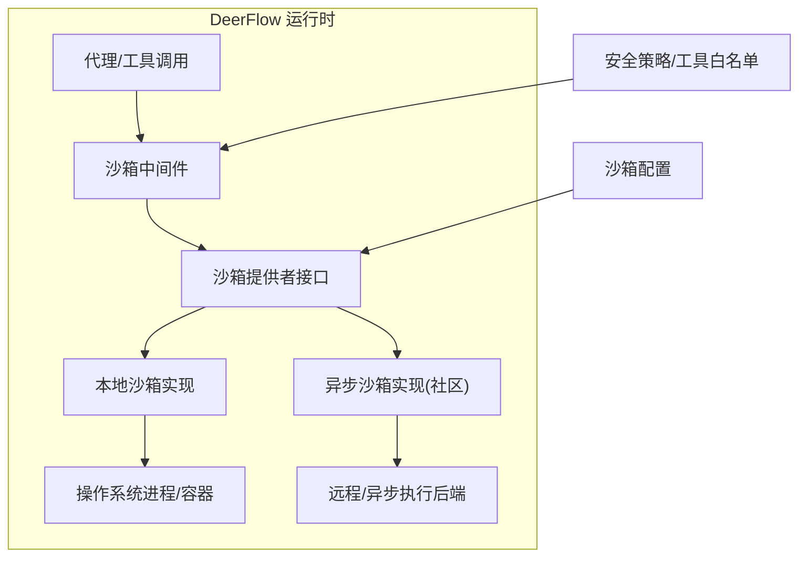
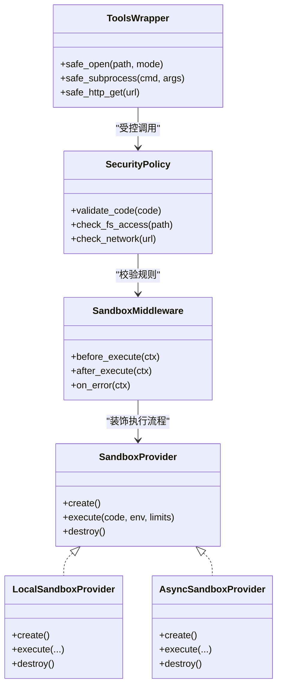
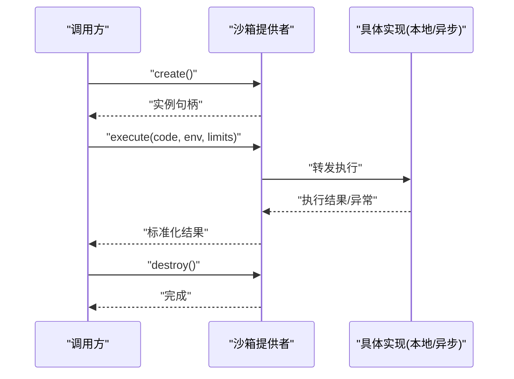
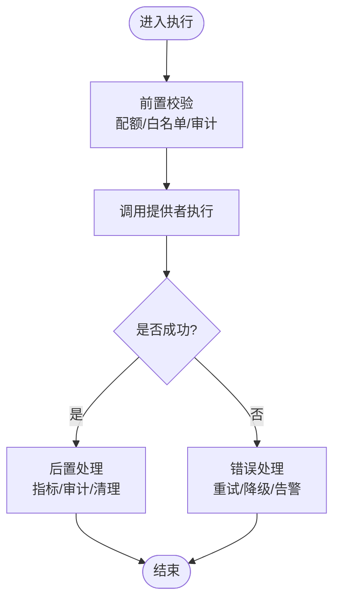
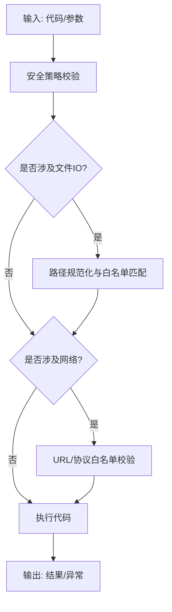
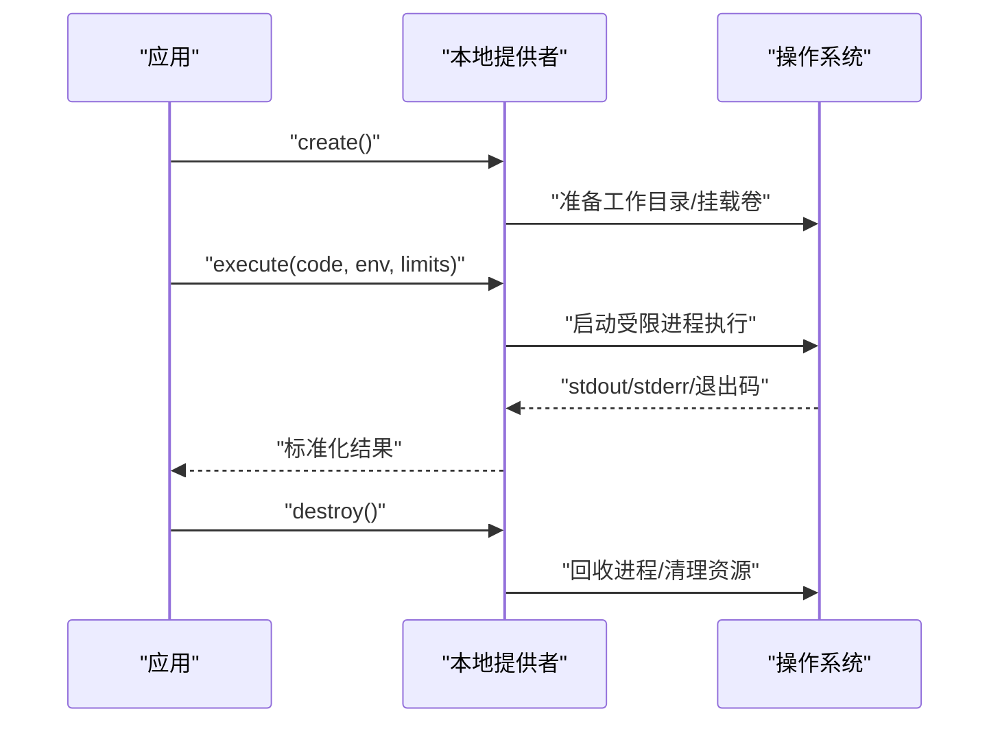
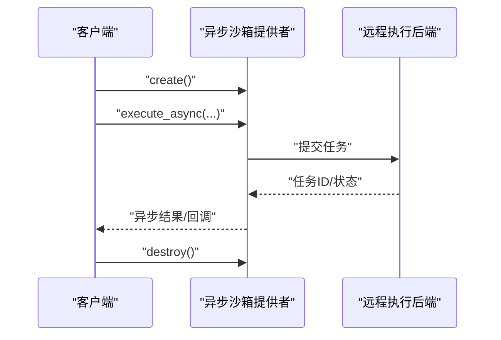
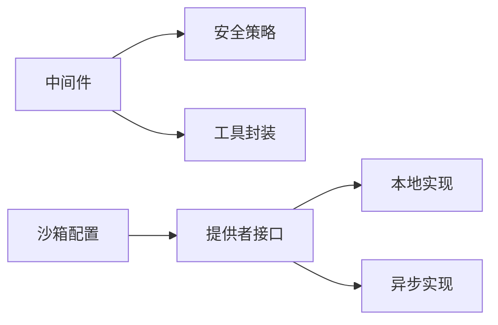

# 沙箱概述

<cite>
**本文引用的文件**   
- [sandbox.py](file://backend/packages/harness/deerflow/sandbox/sandbox.py)
- [sandbox_provider.py](file://backend/packages/harness/deerflow/sandbox/sandbox_provider.py)
- [middleware.py](file://backend/packages/harness/deerflow/sandbox/middleware.py)
- [security.py](file://backend/packages/harness/deerflow/sandbox/security.py)
- [tools.py](file://backend/packages/harness/deerflow/sandbox/tools.py)
- [exceptions.py](file://backend/packages/harness/deerflow/sandbox/exceptions.py)
- [local/__init__.py](file://backend/packages/harness/deerflow/sandbox/local/__init__.py)
- [local/backend.py](file://backend/packages/harness/deerflow/sandbox/local/backend.py)
- [config/sandbox_config.py](file://backend/packages/harness/deerflow/config/sandbox_config.py)
- [aio_sandbox/__init__.py](file://backend/packages/harness/deerflow/community/aio_sandbox/__init__.py)
- [aio_sandbox/provider.py](file://backend/packages/harness/deerflow/community/aio_sandbox/provider.py)
- [test_aio_sandbox_provider.py](file://backend/tests/test_aio_sandbox_provider.py)
- [test_local_sandbox_provider_mounts.py](file://backend/tests/test_local_sandbox_provider_mounts.py)
- [test_sandbox_tools_security.py](file://backend/tests/test_sandbox_tools_security.py)
- [test_sandbox_audit_middleware.py](file://backend/tests/test_sandbox_audit_middleware.py)
</cite>

## 目录
1. [简介](#简介)
2. [项目结构](#项目结构)
3. [核心组件](#核心组件)
4. [架构总览](#架构总览)
5. [详细组件分析](#详细组件分析)
6. [依赖关系分析](#依赖关系分析)
7. [性能与资源管理](#性能与资源管理)
8. [故障排查指南](#故障排查指南)
9. [结论](#结论)
10. [附录：沙箱选择指南](#附录沙箱选择指南)

## 简介
本章节面向DeerFlow的沙箱执行环境，阐述其核心概念、安全隔离的必要性、整体架构设计（提供者模式、生命周期、资源隔离）、在系统中的作用与交互方式，以及主要功能特性（代码执行隔离、文件系统访问控制、网络限制、资源配额等）。同时提供抽象接口与扩展机制说明，并给出沙箱类型选择建议。

## 项目结构
DeerFlow将“沙箱”作为可插拔的执行隔离层，位于代理工具链与外部执行环境之间。核心目录与职责如下：
- sandbox：定义沙箱抽象、提供者接口、中间件、安全策略与工具封装
- sandbox/local：本地实现（进程级隔离）
- community/aio_sandbox：异步沙箱提供者（示例/社区实现）
- config/sandbox_config.py：沙箱配置项
- tests：覆盖提供者、工具安全、审计中间件等关键路径

图表来源
- [sandbox.py:1-200](file://backend/packages/harness/deerflow/sandbox/sandbox.py#L1-L200)
- [sandbox_provider.py:1-200](file://backend/packages/harness/deerflow/sandbox/sandbox_provider.py#L1-L200)
- [middleware.py:1-200](file://backend/packages/harness/deerflow/sandbox/middleware.py#L1-L200)
- [security.py:1-200](file://backend/packages/harness/deerflow/sandbox/security.py#L1-L200)
- [config/sandbox_config.py:1-200](file://backend/packages/harness/deerflow/config/sandbox_config.py#L1-L200)

章节来源
- [sandbox.py:1-200](file://backend/packages/harness/deerflow/sandbox/sandbox.py#L1-L200)
- [sandbox_provider.py:1-200](file://backend/packages/harness/deerflow/sandbox/sandbox_provider.py#L1-L200)
- [middleware.py:1-200](file://backend/packages/harness/deerflow/sandbox/middleware.py#L1-L200)
- [security.py:1-200](file://backend/packages/harness/deerflow/sandbox/security.py#L1-L200)
- [config/sandbox_config.py:1-200](file://backend/packages/harness/deerflow/config/sandbox_config.py#L1-L200)

## 核心组件
- 沙箱抽象与执行入口：定义统一的执行接口、上下文与结果模型，屏蔽底层差异
- 沙箱提供者接口：负责创建、启动、销毁沙箱实例，并提供执行方法
- 沙箱中间件：在执行前后注入审计、限流、超时、错误处理等横切逻辑
- 安全策略与工具封装：对文件系统、网络、子进程等能力进行白名单与边界控制
- 本地实现：基于进程或轻量容器的本地执行器，适合开发与单机部署
- 异步沙箱实现（社区）：面向高并发与远程执行的异步提供者

章节来源
- [sandbox.py:1-200](file://backend/packages/harness/deerflow/sandbox/sandbox.py#L1-L200)
- [sandbox_provider.py:1-200](file://backend/packages/harness/deerflow/sandbox/sandbox_provider.py#L1-L200)
- [middleware.py:1-200](file://backend/packages/harness/deerflow/sandbox/middleware.py#L1-L200)
- [security.py:1-200](file://backend/packages/harness/deerflow/sandbox/security.py#L1-L200)
- [tools.py:1-200](file://backend/packages/harness/deerflow/sandbox/tools.py#L1-L200)
- [local/__init__.py:1-200](file://backend/packages/harness/deerflow/sandbox/local/__init__.py#L1-L200)
- [local/backend.py:1-200](file://backend/packages/harness/deerflow/sandbox/local/backend.py#L1-L200)
- [community/aio_sandbox/__init__.py:1-200](file://backend/packages/harness/deerflow/community/aio_sandbox/__init__.py#L1-L200)
- [community/aio_sandbox/provider.py:1-200](file://backend/packages/harness/deerflow/community/aio_sandbox/provider.py#L1-L200)

## 架构总览
DeerFlow采用“沙箱提供者模式”，上层通过统一接口请求执行，具体由不同提供者按需落地到本地进程、容器或远程服务。中间件与安全策略贯穿执行链路，确保可观测性与可控性。

图表来源
- [sandbox_provider.py:1-200](file://backend/packages/harness/deerflow/sandbox/sandbox_provider.py#L1-L200)
- [local/__init__.py:1-200](file://backend/packages/harness/deerflow/sandbox/local/__init__.py#L1-L200)
- [community/aio_sandbox/provider.py:1-200](file://backend/packages/harness/deerflow/community/aio_sandbox/provider.py#L1-L200)
- [middleware.py:1-200](file://backend/packages/harness/deerflow/sandbox/middleware.py#L1-L200)
- [security.py:1-200](file://backend/packages/harness/deerflow/sandbox/security.py#L1-L200)
- [tools.py:1-200](file://backend/packages/harness/deerflow/sandbox/tools.py#L1-L200)

## 详细组件分析

### 沙箱提供者接口与生命周期
- 抽象接口：定义创建、执行、销毁的统一契约，屏蔽本地/异步/远程差异
- 生命周期：
  - create：初始化运行环境（如准备工作目录、环境变量、资源配额）
  - execute：接收代码片段与执行参数，返回标准化结果
  - destroy：释放资源、清理临时文件、回收进程/容器
- 错误语义：失败时返回结构化异常，便于上层重试或降级

图表来源
- [sandbox_provider.py:1-200](file://backend/packages/harness/deerflow/sandbox/sandbox_provider.py#L1-L200)
- [local/backend.py:1-200](file://backend/packages/harness/deerflow/sandbox/local/backend.py#L1-L200)
- [community/aio_sandbox/provider.py:1-200](file://backend/packages/harness/deerflow/community/aio_sandbox/provider.py#L1-L200)

章节来源
- [sandbox_provider.py:1-200](file://backend/packages/harness/deerflow/sandbox/sandbox_provider.py#L1-L200)
- [local/backend.py:1-200](file://backend/packages/harness/deerflow/sandbox/local/backend.py#L1-L200)
- [community/aio_sandbox/provider.py:1-200](file://backend/packages/harness/deerflow/community/aio_sandbox/provider.py#L1-L200)

### 沙箱中间件与审计
- 作用：在执行前后注入审计日志、指标上报、限流、超时控制、错误恢复
- 典型钩子：
  - before_execute：参数校验、配额检查、审计记录
  - after_execute：结果规范化、指标统计
  - on_error：异常捕获、告警、回滚
- 与测试：审计中间件行为通过单元测试验证

图表来源
- [middleware.py:1-200](file://backend/packages/harness/deerflow/sandbox/middleware.py#L1-L200)
- [test_sandbox_audit_middleware.py:1-200](file://backend/tests/test_sandbox_audit_middleware.py#L1-L200)

章节来源
- [middleware.py:1-200](file://backend/packages/harness/deerflow/sandbox/middleware.py#L1-L200)
- [test_sandbox_audit_middleware.py:1-200](file://backend/tests/test_sandbox_audit_middleware.py#L1-L200)

### 安全策略与工具封装
- 安全策略：
  - 代码静态检查与危险API拦截
  - 文件系统访问白名单与路径规范化
  - 网络访问白名单与协议限制
- 工具封装：
  - 安全的文件读写、子进程调用、HTTP请求等
  - 所有外部I/O均经过策略校验与审计

图表来源
- [security.py:1-200](file://backend/packages/harness/deerflow/sandbox/security.py#L1-L200)
- [tools.py:1-200](file://backend/packages/harness/deerflow/sandbox/tools.py#L1-L200)
- [test_sandbox_tools_security.py:1-200](file://backend/tests/test_sandbox_tools_security.py#L1-L200)

章节来源
- [security.py:1-200](file://backend/packages/harness/deerflow/sandbox/security.py#L1-L200)
- [tools.py:1-200](file://backend/packages/harness/deerflow/sandbox/tools.py#L1-L200)
- [test_sandbox_tools_security.py:1-200](file://backend/tests/test_sandbox_tools_security.py#L1-L200)

### 本地沙箱实现
- 特点：基于本地进程或轻量容器，启动快、调试友好
- 挂载与卷：支持将宿主目录以只读/受限方式挂载到沙箱内，便于读取数据与产出工件
- 适用场景：开发调试、小规模生产、单节点部署

图表来源
- [local/__init__.py:1-200](file://backend/packages/harness/deerflow/sandbox/local/__init__.py#L1-L200)
- [local/backend.py:1-200](file://backend/packages/harness/deerflow/sandbox/local/backend.py#L1-L200)
- [test_local_sandbox_provider_mounts.py:1-200](file://backend/tests/test_local_sandbox_provider_mounts.py#L1-L200)

章节来源
- [local/__init__.py:1-200](file://backend/packages/harness/deerflow/sandbox/local/__init__.py#L1-L200)
- [local/backend.py:1-200](file://backend/packages/harness/deerflow/sandbox/local/backend.py#L1-L200)
- [test_local_sandbox_provider_mounts.py:1-200](file://backend/tests/test_local_sandbox_provider_mounts.py#L1-L200)

### 异步沙箱实现（社区）
- 特点：面向高并发与远程执行，使用异步接口提升吞吐
- 提供者：通过独立模块注册，遵循统一接口
- 适用场景：云端多租户、弹性伸缩、远端执行后端

图表来源
- [community/aio_sandbox/__init__.py:1-200](file://backend/packages/harness/deerflow/community/aio_sandbox/__init__.py#L1-L200)
- [community/aio_sandbox/provider.py:1-200](file://backend/packages/harness/deerflow/community/aio_sandbox/provider.py#L1-L200)
- [test_aio_sandbox_provider.py:1-200](file://backend/tests/test_aio_sandbox_provider.py#L1-L200)

章节来源
- [community/aio_sandbox/__init__.py:1-200](file://backend/packages/harness/deerflow/community/aio_sandbox/__init__.py#L1-L200)
- [community/aio_sandbox/provider.py:1-200](file://backend/packages/harness/deerflow/community/aio_sandbox/provider.py#L1-L200)
- [test_aio_sandbox_provider.py:1-200](file://backend/tests/test_aio_sandbox_provider.py#L1-L200)

## 依赖关系分析
- 内部依赖
  - 中间件依赖安全策略与工具封装，形成“策略+工具”的双重防护
  - 本地/异步提供者均依赖统一抽象接口，保证可替换性
- 外部依赖
  - 操作系统进程/容器运行时
  - 可选的远程执行后端（异步沙箱）
- 潜在耦合点
  - 配置项集中管理，避免硬编码
  - 异常类型统一，便于上层处理

图表来源
- [middleware.py:1-200](file://backend/packages/harness/deerflow/sandbox/middleware.py#L1-L200)
- [security.py:1-200](file://backend/packages/harness/deerflow/sandbox/security.py#L1-L200)
- [tools.py:1-200](file://backend/packages/harness/deerflow/sandbox/tools.py#L1-L200)
- [sandbox_provider.py:1-200](file://backend/packages/harness/deerflow/sandbox/sandbox_provider.py#L1-L200)
- [config/sandbox_config.py:1-200](file://backend/packages/harness/deerflow/config/sandbox_config.py#L1-L200)

章节来源
- [middleware.py:1-200](file://backend/packages/harness/deerflow/sandbox/middleware.py#L1-L200)
- [security.py:1-200](file://backend/packages/harness/deerflow/sandbox/security.py#L1-L200)
- [tools.py:1-200](file://backend/packages/harness/deerflow/sandbox/tools.py#L1-L200)
- [sandbox_provider.py:1-200](file://backend/packages/harness/deerflow/sandbox/sandbox_provider.py#L1-L200)
- [config/sandbox_config.py:1-200](file://backend/packages/harness/deerflow/config/sandbox_config.py#L1-L200)

## 性能与资源管理
- 资源配额：CPU、内存、时间、文件描述符、网络带宽等可通过配置限定
- 并发控制：异步提供者更适合高并发；本地实现需关注进程池与队列
- 启动开销：本地实现启动较快；容器化方案隔离更强但冷启动成本更高
- 监控与可观测性：结合中间件上报指标，定位瓶颈与异常

[本节为通用指导，不直接分析具体文件]

## 故障排查指南
- 常见问题
  - 执行超时：检查中间件超时配置与后端响应
  - 权限不足：确认文件系统挂载与白名单策略
  - 网络拒绝：核对URL/协议白名单与DNS解析
  - 资源耗尽：调整配额上限或扩容执行节点
- 诊断手段
  - 查看审计日志与错误堆栈
  - 复现最小用例，逐步放开限制定位问题
  - 对比本地与异步实现的差异

章节来源
- [exceptions.py:1-200](file://backend/packages/harness/deerflow/sandbox/exceptions.py#L1-L200)
- [test_sandbox_audit_middleware.py:1-200](file://backend/tests/test_sandbox_audit_middleware.py#L1-L200)
- [test_sandbox_tools_security.py:1-200](file://backend/tests/test_sandbox_tools_security.py#L1-L200)

## 结论
DeerFlow的沙箱体系通过提供者模式实现了灵活的可插拔执行隔离，配合中间件与安全策略，在保证安全性的同时兼顾了可扩展性与可观测性。开发者可按需选择本地或异步提供者，并结合配置与策略满足多样化场景。

[本节为总结性内容，不直接分析具体文件]

## 附录：沙箱选择指南
- 本地沙箱
  - 优点：启动快、调试友好、部署简单
  - 缺点：隔离强度有限，不适合强隔离需求
  - 适用：开发调试、小规模生产、单节点
- 异步沙箱（社区）
  - 优点：高并发、易水平扩展、可对接远端执行后端
  - 缺点：运维复杂度较高
  - 适用：云端多租户、大规模推理与执行
- 选择建议
  - 优先评估隔离强度与合规要求
  - 根据QPS与延迟目标选择本地或异步
  - 结合监控与审计能力完善可观测性

[本节为通用指导，不直接分析具体文件]