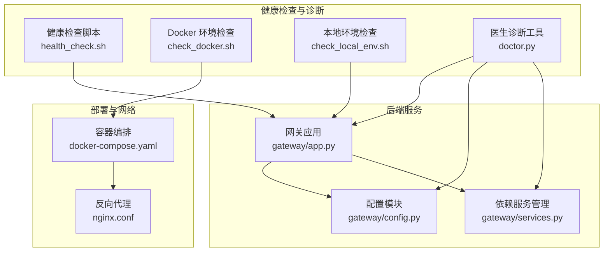
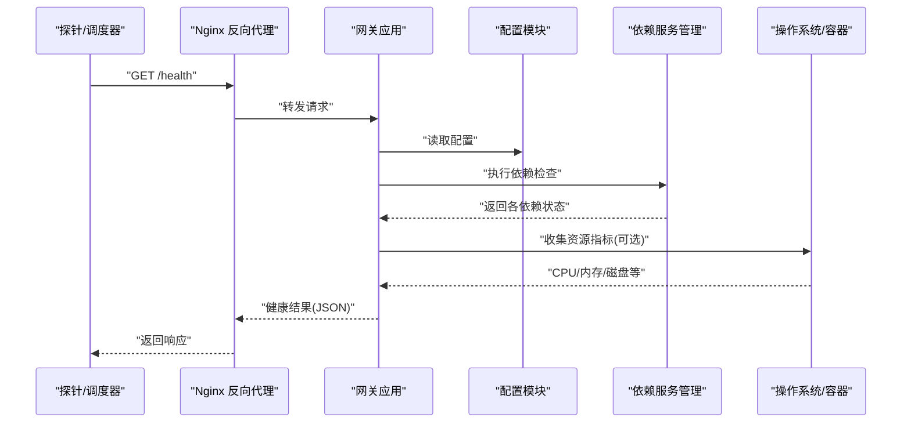
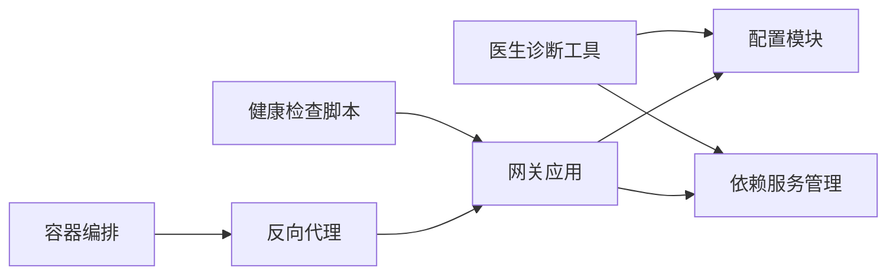

# 健康检查和监控

<cite>
**本文引用的文件**   
- [health_check.sh](file://.agent/skills/smoke-test/scripts/health_check.sh)
- [check_docker.sh](file://.agent/skills/smoke-test/scripts/check_docker.sh)
- [check_local_env.sh](file://.agent/skills/smoke-test/scripts/check_local_env.sh)
- [doctor.py](file://scripts/doctor.py)
- [test_doctor.py](file://backend/tests/test_doctor.py)
- [app.py](file://backend/app/gateway/app.py)
- [config.py](file://backend/app/gateway/config.py)
- [services.py](file://backend/app/gateway/services.py)
- [docker-compose.yaml](file://docker/docker-compose.yaml)
- [nginx.conf](file://docker/nginx/nginx.conf)
</cite>

## 目录
1. [简介](#简介)
2. [项目结构](#项目结构)
3. [核心组件](#核心组件)
4. [架构总览](#架构总览)
5. [详细组件分析](#详细组件分析)
6. [依赖关系分析](#依赖关系分析)
7. [性能考虑](#性能考虑)
8. [故障排查指南](#故障排查指南)
9. [结论](#结论)
10. [附录](#附录)

## 简介
本文件面向运维与研发人员，系统化梳理 DeerFlow 的健康检查与监控能力，覆盖：
- 健康检查接口与服务状态检测、依赖服务检查、资源使用监控
- “医生诊断工具”（Doctor）的环境检查、配置验证与问题诊断
- Docker 环境检查脚本的功能与使用场景
- 监控指标定义与采集方法（业务与技术指标）
- 告警规则配置与通知机制设置
- 监控仪表板搭建指南与最佳实践

## 项目结构
与健康检查和监控相关的代码与脚本主要分布在以下位置：
- .agent/skills/smoke-test/scripts：健康检查与环境检查脚本集合
- scripts/doctor.py：医生诊断工具主入口
- backend/app/gateway：网关应用、配置与依赖服务管理
- docker：容器编排与反向代理配置

图表来源
- [health_check.sh](file://.agent/skills/smoke-test/scripts/health_check.sh)
- [check_docker.sh](file://.agent/skills/smoke-test/scripts/check_docker.sh)
- [check_local_env.sh](file://.agent/skills/smoke-test/scripts/check_local_env.sh)
- [doctor.py](file://scripts/doctor.py)
- [app.py](file://backend/app/gateway/app.py)
- [config.py](file://backend/app/gateway/config.py)
- [services.py](file://backend/app/gateway/services.py)
- [docker-compose.yaml](file://docker/docker-compose.yaml)
- [nginx.conf](file://docker/nginx/nginx.conf)

章节来源
- [health_check.sh](file://.agent/skills/smoke-test/scripts/health_check.sh)
- [check_docker.sh](file://.agent/skills/smoke-test/scripts/check_docker.sh)
- [check_local_env.sh](file://.agent/skills/smoke-test/scripts/check_local_env.sh)
- [doctor.py](file://scripts/doctor.py)
- [app.py](file://backend/app/gateway/app.py)
- [config.py](file://backend/app/gateway/config.py)
- [services.py](file://backend/app/gateway/services.py)
- [docker-compose.yaml](file://docker/docker-compose.yaml)
- [nginx.conf](file://docker/nginx/nginx.conf)

## 核心组件
- 健康检查脚本 health_check.sh：用于快速探测服务可用性、关键依赖连通性与基础资源占用情况。
- Docker 环境检查 check_docker.sh：在容器化环境中校验镜像、端口、环境变量与依赖服务是否就绪。
- 本地环境检查 check_local_env.sh：在非容器环境下检查运行依赖、路径、权限与必要命令是否存在。
- 医生诊断工具 doctor.py：提供系统化的环境检查、配置验证与问题定位输出，便于“排障即文档”。
- 网关应用 gateway/app.py：承载对外 HTTP 接口，可暴露健康检查端点并聚合依赖服务状态。
- 配置模块 gateway/config.py：集中管理运行时配置项，供健康检查与诊断工具读取。
- 依赖服务管理 gateway/services.py：封装对数据库、缓存、外部 API 等依赖的连通性检查逻辑。
- 容器编排 docker-compose.yaml：定义服务拓扑、端口映射、健康探针与启动顺序。
- 反向代理 nginx.conf：统一入口、转发与可选的额外健康检查路由。

章节来源
- [health_check.sh](file://.agent/skills/smoke-test/scripts/health_check.sh)
- [check_docker.sh](file://.agent/skills/smoke-test/scripts/check_docker.sh)
- [check_local_env.sh](file://.agent/skills/smoke-test/scripts/check_local_env.sh)
- [doctor.py](file://scripts/doctor.py)
- [app.py](file://backend/app/gateway/app.py)
- [config.py](file://backend/app/gateway/config.py)
- [services.py](file://backend/app/gateway/services.py)
- [docker-compose.yaml](file://docker/docker-compose.yaml)
- [nginx.conf](file://docker/nginx/nginx.conf)

## 架构总览
下图展示了健康检查与监控的整体流程：外部探针通过 Nginx 或直连访问后端健康接口；后端调用配置与依赖服务模块进行多维度检查；脚本侧（Docker/本地）作为补充手段完成环境与依赖自检；医生诊断工具汇总信息生成报告。

图表来源
- [nginx.conf](file://docker/nginx/nginx.conf)
- [app.py](file://backend/app/gateway/app.py)
- [config.py](file://backend/app/gateway/config.py)
- [services.py](file://backend/app/gateway/services.py)

## 详细组件分析

### 健康检查接口实现与使用
- 职责
  - 暴露统一的 /health 或类似端点，返回服务整体健康状态。
  - 聚合依赖服务检查结果（如数据库、缓存、外部 API）。
  - 可选采集基础资源指标（CPU、内存、磁盘、进程数等）。
- 典型行为
  - 读取配置以决定检查范围与阈值。
  - 依次调用依赖服务检查函数，记录每个子项的状态与耗时。
  - 根据子项状态计算整体状态（UP/DOWN/DEGRADED）。
  - 返回结构化 JSON，包含版本、时间戳、子项明细与指标。
- 使用方式
  - 外部探针定时 GET 健康端点，判定服务可用性。
  - 负载均衡器或编排平台基于健康结果进行流量切换与重启策略。
  - 日志与指标系统采集健康结果，用于趋势分析与告警。

章节来源
- [app.py](file://backend/app/gateway/app.py)
- [config.py](file://backend/app/gateway/config.py)
- [services.py](file://backend/app/gateway/services.py)

### 依赖服务检查与资源使用监控
- 依赖服务检查
  - 由 services.py 提供统一接口，按配置枚举需要检查的服务。
  - 对每个依赖执行连通性测试（连接、鉴权、最小读写），记录成功/失败与延迟。
- 资源使用监控
  - 在健康检查中可选采集 CPU、内存、磁盘、文件描述符、进程数等。
  - 将指标写入健康响应体，便于外部系统抓取与可视化。
- 错误处理
  - 单个依赖失败不应导致整个健康检查崩溃，需降级为 DEGRADED。
  - 超时与重试策略应可配置，避免雪崩。

章节来源
- [services.py](file://backend/app/gateway/services.py)
- [config.py](file://backend/app/gateway/config.py)

### 医生诊断工具（Doctor）用法
- 功能概览
  - 环境检查：Python 版本、依赖包、路径、权限、网络连通性等。
  - 配置验证：加载配置、校验必填字段、类型与取值范围。
  - 问题诊断：结合日志、配置文件与依赖状态，给出修复建议。
- 使用场景
  - 本地开发联调前自检。
  - 生产环境上线前预检。
  - 故障发生后快速定位根因。
- 输出形式
  - 结构化报告（文本或 Markdown），包含检查项、结果与建议。
  - 支持导出到文件或标准输出，便于归档与自动化集成。

章节来源
- [doctor.py](file://scripts/doctor.py)
- [test_doctor.py](file://backend/tests/test_doctor.py)

### Docker 环境检查脚本
- 功能要点
  - 校验 Docker 与 Compose 可用。
  - 检查镜像存在性与版本。
  - 验证端口占用、环境变量、数据卷挂载。
  - 探测关键服务是否已就绪（如数据库、缓存、消息队列）。
- 使用场景
  - CI/CD 流水线中的前置检查。
  - 部署后自动验证环境一致性。
  - 故障恢复后的回归验证。

章节来源
- [check_docker.sh](file://.agent/skills/smoke-test/scripts/check_docker.sh)
- [docker-compose.yaml](file://docker/docker-compose.yaml)

### 本地环境检查脚本
- 功能要点
  - 检查 Python 解释器、虚拟环境、依赖安装。
  - 校验必要命令与路径（如 git、curl、openssl）。
  - 检查配置文件与密钥文件存在性与可读性。
- 使用场景
  - 开发者本地启动前的自检。
  - 非容器环境的快速排障。

章节来源
- [check_local_env.sh](file://.agent/skills/smoke-test/scripts/check_local_env.sh)

### 反向代理与健康检查路由
- 职责
  - 统一入口，转发 /health 等内部端点到后端。
  - 可附加限流、鉴权、日志与访问控制。
- 注意事项
  - 确保健康端点不被鉴权拦截。
  - 合理设置超时与重试，避免误判。

章节来源
- [nginx.conf](file://docker/nginx/nginx.conf)

## 依赖关系分析
- 组件耦合
  - 健康检查脚本与网关应用松耦合，通过 HTTP 或命令行交互。
  - 医生诊断工具依赖配置模块与依赖服务管理，形成“读配置 + 测依赖”的组合。
- 外部依赖
  - 数据库、缓存、对象存储、外部 API 等均为可插拔依赖，检查逻辑集中在 services.py。
- 潜在风险
  - 健康检查过于频繁或检查项过多可能导致抖动，需控制频率与超时。
  - 依赖服务不可用时，健康检查应快速失败并降级。

图表来源
- [health_check.sh](file://.agent/skills/smoke-test/scripts/health_check.sh)
- [doctor.py](file://scripts/doctor.py)
- [app.py](file://backend/app/gateway/app.py)
- [config.py](file://backend/app/gateway/config.py)
- [services.py](file://backend/app/gateway/services.py)
- [docker-compose.yaml](file://docker/docker-compose.yaml)
- [nginx.conf](file://docker/nginx/nginx.conf)

章节来源
- [health_check.sh](file://.agent/skills/smoke-test/scripts/health_check.sh)
- [doctor.py](file://scripts/doctor.py)
- [app.py](file://backend/app/gateway/app.py)
- [config.py](file://backend/app/gateway/config.py)
- [services.py](file://backend/app/gateway/services.py)
- [docker-compose.yaml](file://docker/docker-compose.yaml)
- [nginx.conf](file://docker/nginx/nginx.conf)

## 性能考虑
- 健康检查频率
  - 建议 10–30 秒一次，避免过高频率造成抖动。
- 检查项裁剪
  - 仅保留关键依赖与轻量级资源指标，复杂检查放入诊断工具按需触发。
- 超时与重试
  - 单次检查总耗时控制在 1–3 秒内，依赖检查设置短超时与最多一次重试。
- 并发与隔离
  - 依赖检查可并行执行，但需限制并发度，防止压垮下游。
- 指标采样
  - 资源指标采用轻量 API 获取，避免阻塞主流程。

## 故障排查指南
- 常见问题
  - 健康检查持续 DOWN：检查依赖服务连通性、网络策略、证书与端口。
  - 间歇性抖动：排查依赖服务慢查询、GC 停顿、资源争用。
  - 诊断报告缺失关键信息：确认配置加载路径与权限。
- 定位步骤
  - 使用医生诊断工具生成完整报告，对比正常基线。
  - 查看健康检查日志与依赖检查明细，定位失败项。
  - 核对容器编排与反向代理配置，排除部署层问题。
- 恢复建议
  - 针对失败依赖逐项修复，必要时回滚配置或重启服务。
  - 调整健康检查阈值与超时，降低误报率。

章节来源
- [doctor.py](file://scripts/doctor.py)
- [test_doctor.py](file://backend/tests/test_doctor.py)
- [services.py](file://backend/app/gateway/services.py)
- [docker-compose.yaml](file://docker/docker-compose.yaml)
- [nginx.conf](file://docker/nginx/nginx.conf)

## 结论
DeerFlow 的健康检查与监控体系以“轻量健康接口 + 全面诊断工具 + 脚本化环境检查”为核心，兼顾实时性与可观测性。通过合理的指标定义、告警规则与仪表板建设，可实现从“发现问题”到“定位根因”再到“快速恢复”的闭环。

## 附录

### 监控指标定义与采集方法
- 技术指标
  - 服务可用性：健康端点返回 UP 的比例与时延分布。
  - 依赖连通性：各依赖的成功率、P95/P99 延迟、错误码分布。
  - 资源使用：CPU、内存、磁盘 I/O、文件描述符、进程数。
  - 请求吞吐：QPS、错误率、P95/P99 响应时延。
- 业务指标
  - 任务成功率、平均处理时长、排队长度、积压量。
  - 模型调用次数、Token 用量、成本估算。
- 采集方法
  - 健康端点：定期 GET /health，解析 JSON 指标。
  - 日志与追踪：结构化日志与分布式追踪埋点，关联健康事件。
  - 系统指标：通过系统 API 或容器运行时采集资源指标。

[本节为通用指导，不直接分析具体文件]

### 告警规则配置与通知机制
- 规则建议
  - 健康连续失败超过阈值（如 3 次）触发严重告警。
  - 依赖 P95 延迟超阈或错误率突增触发警告。
  - 资源使用接近上限（如内存 > 85%）触发扩容或清理建议。
- 通知渠道
  - 邮件、企业微信、飞书、Slack、短信等，按级别分流。
- 降噪与去抖
  - 设置静默期与合并窗口，避免风暴式告警。
  - 基于变更事件抑制临时波动告警。

[本节为通用指导，不直接分析具体文件]

### 监控仪表板搭建指南与最佳实践
- 面板分层
  - 概览：服务健康、关键业务 KPI、Top 错误。
  - 依赖：各依赖服务的连通性与延迟。
  - 资源：主机/容器资源水位与趋势。
  - 链路：关键请求的端到端时序图。
- 最佳实践
  - 指标命名规范与标签维度统一。
  - 面板模板化与多环境复用。
  - 将健康检查与告警联动，形成“看板—告警—处置”闭环。

[本节为通用指导，不直接分析具体文件]