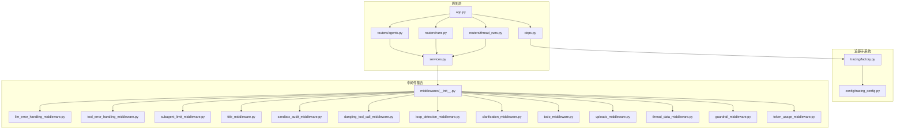
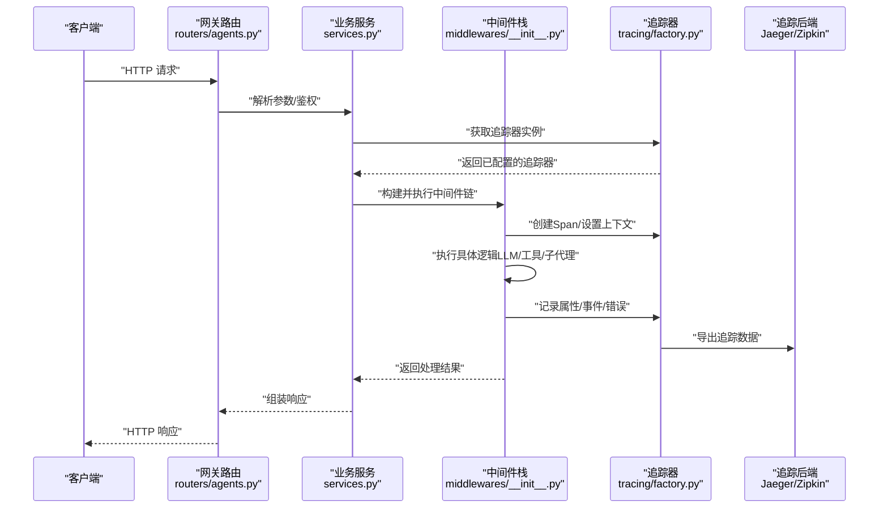
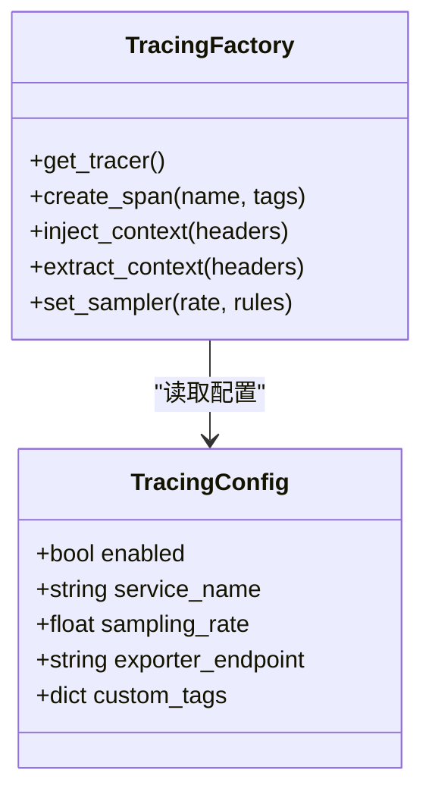
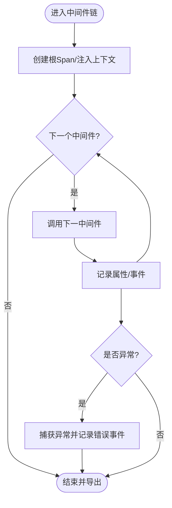
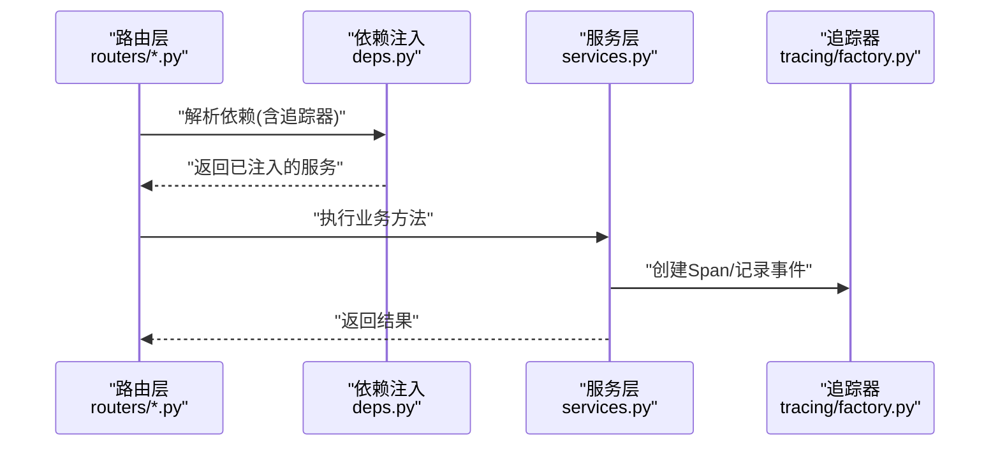
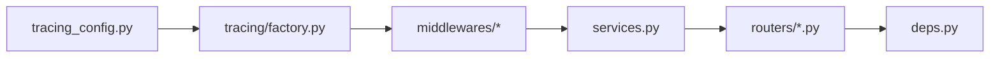

# 分布式追踪

<cite>
**本文引用的文件**   
- [backend/packages/harness/deerflow/tracing/factory.py](file://backend/packages/harness/deerflow/tracing/factory.py)
- [backend/packages/harness/deerflow/config/tracing_config.py](file://backend/packages/harness/deerflow/config/tracing_config.py)
- [backend/app/gateway/routers/agents.py](file://backend/app/gateway/routers/agents.py)
- [backend/app/gateway/routers/runs.py](file://backend/app/gateway/routers/runs.py)
- [backend/app/gateway/routers/thread_runs.py](file://backend/app/gateway/routers/thread_runs.py)
- [backend/app/gateway/services.py](file://backend/app/gateway/services.py)
- [backend/app/gateway/deps.py](file://backend/app/gateway/deps.py)
- [backend/app/gateway/app.py](file://backend/app/gateway/app.py)
- [backend/packages/harness/deerflow/agents/middlewares/__init__.py](file://backend/packages/harness/deerflow/agents/middlewares/__init__.py)
- [backend/packages/harness/deerflow/agents/middlewares/llm_error_handling_middleware.py](file://backend/packages/harness/deerflow/agents/middlewares/llm_error_handling_middleware.py)
- [backend/packages/harness/deerflow/agents/middlewares/tool_error_handling_middleware.py](file://backend/packages/harness/deerflow/agents/middlewares/tool_error_handling_middleware.py)
- [backend/packages/harness/deerflow/agents/middlewares/subagent_limit_middleware.py](file://backend/packages/harness/deerflow/agents/middlewares/subagent_limit_middleware.py)
- [backend/packages/harness/deerflow/agents/middlewares/title_middleware.py](file://backend/packages/harness/deerflow/agents/middlewares/title_middleware.py)
- [backend/packages/harness/deerflow/agents/middlewares/sandbox_audit_middleware.py](file://backend/packages/harness/deerflow/agents/middlewares/sandbox_audit_middleware.py)
- [backend/packages/harness/deerflow/agents/middlewares/dangling_tool_call_middleware.py](file://backend/packages/harness/deerflow/agents/middlewares/dangling_tool_call_middleware.py)
- [backend/packages/harness/deerflow/agents/middlewares/loop_detection_middleware.py](file://backend/packages/harness/deerflow/agents/middlewares/loop_detection_middleware.py)
- [backend/packages/harness/deerflow/agents/middlewares/clarification_middleware.py](file://backend/packages/harness/deerflow/agents/middlewares/clarification_middleware.py)
- [backend/packages/harness/deerflow/agents/middlewares/todo_middleware.py](file://backend/packages/harness/deerflow/agents/middlewares/todo_middleware.py)
- [backend/packages/harness/deerflow/agents/middlewares/uploads_middleware.py](file://backend/packages/harness/deerflow/agents/middlewares/uploads_middleware.py)
- [backend/packages/harness/deerflow/agents/middlewares/thread_data_middleware.py](file://backend/packages/harness/deerflow/agents/middlewares/thread_data_middleware.py)
- [backend/packages/harness/deerflow/agents/middlewares/guardrail_middleware.py](file://backend/packages/harness/deerflow/agents/middlewares/guardrail_middleware.py)
- [backend/packages/harness/deerflow/agents/middlewares/token_usage_middleware.py](file://backend/packages/harness/deerflow/agents/middlewares/token_usage_middleware.py)
- [backend/tests/test_tracing_factory.py](file://backend/tests/test_tracing_factory.py)
- [backend/tests/test_tracing_config.py](file://backend/tests/test_tracing_config.py)
- [backend/docs/middleware-execution-flow.md](file://backend/docs/middleware-execution-flow.md)
</cite>

## 目录
1. [简介](#简介)
2. [项目结构](#项目结构)
3. [核心组件](#核心组件)
4. [架构总览](#架构总览)
5. [详细组件分析](#详细组件分析)
6. [依赖关系分析](#依赖关系分析)
7. [性能考虑](#性能考虑)
8. [故障排查指南](#故障排查指南)
9. [结论](#结论)
10. [附录](#附录)

## 简介
本文件面向 DeerFlow 分布式追踪系统，聚焦以下目标：
- 追踪工厂的实现原理与配置方法（初始化、上下文传播、采样策略）
- 追踪元数据的收集与传递机制（用户上下文、代理信息、执行环境）
- 追踪中间件的工作流程（请求拦截、追踪ID生成、结果记录）
- 与主流追踪系统的集成指南（Jaeger、Zipkin 等）
- 追踪数据分析与性能调优方法
- 故障定位与性能瓶颈分析的实战案例

## 项目结构
DeerFlow 的追踪能力集中在后端 harness 的 tracing 模块，并通过网关路由与中间件贯穿整个 Agent 执行链路。关键位置如下：
- 追踪工厂与配置：tracing/factory.py、config/tracing_config.py
- 网关入口与依赖注入：gateway/routers/*.py、gateway/deps.py、gateway/app.py
- 中间件体系：agents/middlewares/*（统一在 __init__.py 中注册）
- 测试用例：tests/test_tracing_factory.py、tests/test_tracing_config.py

图表来源
- [backend/app/gateway/app.py](file://backend/app/gateway/app.py)
- [backend/app/gateway/deps.py](file://backend/app/gateway/deps.py)
- [backend/app/gateway/routers/agents.py](file://backend/app/gateway/routers/agents.py)
- [backend/app/gateway/routers/runs.py](file://backend/app/gateway/routers/runs.py)
- [backend/app/gateway/routers/thread_runs.py](file://backend/app/gateway/routers/thread_runs.py)
- [backend/app/gateway/services.py](file://backend/app/gateway/services.py)
- [backend/packages/harness/deerflow/tracing/factory.py](file://backend/packages/harness/deerflow/tracing/factory.py)
- [backend/packages/harness/deerflow/config/tracing_config.py](file://backend/packages/harness/deerflow/config/tracing_config.py)
- [backend/packages/harness/deerflow/agents/middlewares/__init__.py](file://backend/packages/harness/deerflow/agents/middlewares/__init__.py)

章节来源
- [backend/app/gateway/app.py](file://backend/app/gateway/app.py)
- [backend/app/gateway/deps.py](file://backend/app/gateway/deps.py)
- [backend/app/gateway/routers/agents.py](file://backend/app/gateway/routers/agents.py)
- [backend/app/gateway/routers/runs.py](file://backend/app/gateway/routers/runs.py)
- [backend/app/gateway/routers/thread_runs.py](file://backend/app/gateway/routers/thread_runs.py)
- [backend/app/gateway/services.py](file://backend/app/gateway/services.py)
- [backend/packages/harness/deerflow/tracing/factory.py](file://backend/packages/harness/deerflow/tracing/factory.py)
- [backend/packages/harness/deerflow/config/tracing_config.py](file://backend/packages/harness/deerflow/config/tracing_config.py)
- [backend/packages/harness/deerflow/agents/middlewares/__init__.py](file://backend/packages/harness/deerflow/agents/middlewares/__init__.py)

## 核心组件
- 追踪工厂（Tracing Factory）
  - 负责创建并返回可插拔的追踪器实例；根据配置决定启用哪些后端（如 OpenTelemetry/Jaeger/Zipkin）。
  - 提供统一的 API 供上层调用，屏蔽不同后端的差异。
- 追踪配置（Tracing Config）
  - 定义追踪开关、采样率、服务名、端点地址、标签键值等参数。
  - 支持环境变量或配置文件驱动，便于多环境部署。
- 中间件体系（Middleware Stack）
  - 在 Agent 执行链路上以装饰器/包装器形式插入，完成请求拦截、上下文注入、指标采集、异常捕获与结果落盘。
  - 各中间件职责清晰，组合灵活，可按需开启或关闭。

章节来源
- [backend/packages/harness/deerflow/tracing/factory.py](file://backend/packages/harness/deerflow/tracing/factory.py)
- [backend/packages/harness/deerflow/config/tracing_config.py](file://backend/packages/harness/deerflow/config/tracing_config.py)
- [backend/packages/harness/deerflow/agents/middlewares/__init__.py](file://backend/packages/harness/deerflow/agents/middlewares/__init__.py)

## 架构总览
下图展示了从 HTTP 请求进入网关到 Agent 执行链路中的追踪数据如何被采集与传播。

图表来源
- [backend/app/gateway/routers/agents.py](file://backend/app/gateway/routers/agents.py)
- [backend/app/gateway/services.py](file://backend/app/gateway/services.py)
- [backend/packages/harness/deerflow/agents/middlewares/__init__.py](file://backend/packages/harness/deerflow/agents/middlewares/__init__.py)
- [backend/packages/harness/deerflow/tracing/factory.py](file://backend/packages/harness/deerflow/tracing/factory.py)

## 详细组件分析

### 追踪工厂与配置
- 初始化流程
  - 读取配置对象（服务名、采样率、后端地址等），按需初始化特定后端 SDK。
  - 暴露统一的“获取追踪器”接口，供网关与服务层使用。
- 上下文传播
  - 在入站请求处提取上游追踪头（如 traceparent/tracestate），恢复上下文。
  - 在出站调用时注入追踪头，确保跨进程/跨服务的链路连续性。
- 采样策略
  - 基于配置的全局采样率进行概率采样。
  - 支持按路径/操作名/错误状态码等条件采样（由配置项控制）。
- 元数据采集
  - 自动附加服务名、版本、主机信息等基础标签。
  - 允许业务侧追加自定义标签（如用户ID、租户、模型名称等）。

图表来源
- [backend/packages/harness/deerflow/config/tracing_config.py](file://backend/packages/harness/deerflow/config/tracing_config.py)
- [backend/packages/harness/deerflow/tracing/factory.py](file://backend/packages/harness/deerflow/tracing/factory.py)

章节来源
- [backend/packages/harness/deerflow/config/tracing_config.py](file://backend/packages/harness/deerflow/config/tracing_config.py)
- [backend/packages/harness/deerflow/tracing/factory.py](file://backend/packages/harness/deerflow/tracing/factory.py)
- [backend/tests/test_tracing_config.py](file://backend/tests/test_tracing_config.py)
- [backend/tests/test_tracing_factory.py](file://backend/tests/test_tracing_factory.py)

### 中间件工作流
- 请求拦截
  - 在网关或服务入口处创建根 Span，绑定请求标识（如 thread_id、run_id、user_id）。
- 追踪ID生成与传播
  - 若上游未携带追踪头，则生成新的 trace/span ID；否则复用上游上下文。
  - 将上下文注入到后续调用（包括内部函数调用、外部工具、子代理）。
- 结果记录
  - 成功路径：记录耗时、输入输出摘要、资源用量（如 token 使用量）。
  - 失败路径：记录异常类型、堆栈摘要、重试次数、降级策略。
- 典型中间件职责
  - LLM 错误处理：捕获模型调用异常，记录错误事件与回退逻辑。
  - 工具错误处理：捕获工具执行异常，记录工具名、参数摘要与错误码。
  - 子代理限制：统计并发与调用次数，超限快速失败并记录告警。
  - 标题生成：在合适时机生成会话标题，附带生成耗时与质量评分。
  - 沙箱审计：记录沙箱内命令、文件访问与资源消耗。
  - 悬挂工具调用检测：识别未闭合的工具调用，避免状态不一致。
  - 循环检测：检测 Agent 决策环路，触发终止与告警。
  - 澄清中间件：当意图不明确时发起澄清，记录交互轮次与用户反馈。
  - TODO 管理：维护任务清单，记录完成度与阻塞原因。
  - 上传处理：记录上传文件的数量、大小与校验结果。
  - 线程数据：持久化线程上下文，保证跨请求一致性。
  - 护栏：安全策略检查，拦截违规输入/输出。
  - Token 用量：汇总模型 token 消耗，用于计费与配额控制。

图表来源
- [backend/packages/harness/deerflow/agents/middlewares/__init__.py](file://backend/packages/harness/deerflow/agents/middlewares/__init__.py)
- [backend/packages/harness/deerflow/agents/middlewares/llm_error_handling_middleware.py](file://backend/packages/harness/deerflow/agents/middlewares/llm_error_handling_middleware.py)
- [backend/packages/harness/deerflow/agents/middlewares/tool_error_handling_middleware.py](file://backend/packages/harness/deerflow/agents/middlewares/tool_error_handling_middleware.py)
- [backend/packages/harness/deerflow/agents/middlewares/subagent_limit_middleware.py](file://backend/packages/harness/deerflow/agents/middlewares/subagent_limit_middleware.py)
- [backend/packages/harness/deerflow/agents/middlewares/title_middleware.py](file://backend/packages/harness/deerflow/agents/middlewares/title_middleware.py)
- [backend/packages/harness/deerflow/agents/middlewares/sandbox_audit_middleware.py](file://backend/packages/harness/deerflow/agents/middlewares/sandbox_audit_middleware.py)
- [backend/packages/harness/deerflow/agents/middlewares/dangling_tool_call_middleware.py](file://backend/packages/harness/deerflow/agents/middlewares/dangling_tool_call_middleware.py)
- [backend/packages/harness/deerflow/agents/middlewares/loop_detection_middleware.py](file://backend/packages/harness/deerflow/agents/middlewares/loop_detection_middleware.py)
- [backend/packages/harness/deerflow/agents/middlewares/clarification_middleware.py](file://backend/packages/harness/deerflow/agents/middlewares/clarification_middleware.py)
- [backend/packages/harness/deerflow/agents/middlewares/todo_middleware.py](file://backend/packages/harness/deerflow/agents/middlewares/todo_middleware.py)
- [backend/packages/harness/deerflow/agents/middlewares/uploads_middleware.py](file://backend/packages/harness/deerflow/agents/middlewares/uploads_middleware.py)
- [backend/packages/harness/deerflow/agents/middlewares/thread_data_middleware.py](file://backend/packages/harness/deerflow/agents/middlewares/thread_data_middleware.py)
- [backend/packages/harness/deerflow/agents/middlewares/guardrail_middleware.py](file://backend/packages/harness/deerflow/agents/middlewares/guardrail_middleware.py)
- [backend/packages/harness/deerflow/agents/middlewares/token_usage_middleware.py](file://backend/packages/harness/deerflow/agents/middlewares/token_usage_middleware.py)

章节来源
- [backend/packages/harness/deerflow/agents/middlewares/__init__.py](file://backend/packages/harness/deerflow/agents/middlewares/__init__.py)
- [backend/docs/middleware-execution-flow.md](file://backend/docs/middleware-execution-flow.md)

### 网关与依赖注入
- 依赖注入
  - deps.py 负责装配追踪器实例，并将其注入到路由与服务层。
- 路由层
  - agents.py、runs.py、thread_runs.py 作为入口，负责参数校验、权限检查与调用 services.py。
- 服务层
  - services.py 编排中间件链，协调追踪器与业务逻辑。

图表来源
- [backend/app/gateway/deps.py](file://backend/app/gateway/deps.py)
- [backend/app/gateway/routers/agents.py](file://backend/app/gateway/routers/agents.py)
- [backend/app/gateway/routers/runs.py](file://backend/app/gateway/routers/runs.py)
- [backend/app/gateway/routers/thread_runs.py](file://backend/app/gateway/routers/thread_runs.py)
- [backend/app/gateway/services.py](file://backend/app/gateway/services.py)
- [backend/packages/harness/deerflow/tracing/factory.py](file://backend/packages/harness/deerflow/tracing/factory.py)

章节来源
- [backend/app/gateway/deps.py](file://backend/app/gateway/deps.py)
- [backend/app/gateway/routers/agents.py](file://backend/app/gateway/routers/agents.py)
- [backend/app/gateway/routers/runs.py](file://backend/app/gateway/routers/runs.py)
- [backend/app/gateway/routers/thread_runs.py](file://backend/app/gateway/routers/thread_runs.py)
- [backend/app/gateway/services.py](file://backend/app/gateway/services.py)

## 依赖关系分析
- 组件耦合
  - 追踪工厂对配置强依赖，对外暴露稳定接口；中间件通过工厂获取追踪器，降低耦合。
  - 网关路由与服务层仅依赖追踪器的抽象，不感知具体后端实现。
- 外部依赖
  - 可选接入 Jaeger、Zipkin 等后端，通过配置切换。
- 潜在循环依赖
  - 当前分层清晰（配置→工厂→中间件→服务→路由），未发现直接循环导入。

图表来源
- [backend/packages/harness/deerflow/config/tracing_config.py](file://backend/packages/harness/deerflow/config/tracing_config.py)
- [backend/packages/harness/deerflow/tracing/factory.py](file://backend/packages/harness/deerflow/tracing/factory.py)
- [backend/packages/harness/deerflow/agents/middlewares/__init__.py](file://backend/packages/harness/deerflow/agents/middlewares/__init__.py)
- [backend/app/gateway/services.py](file://backend/app/gateway/services.py)
- [backend/app/gateway/routers/agents.py](file://backend/app/gateway/routers/agents.py)
- [backend/app/gateway/deps.py](file://backend/app/gateway/deps.py)

章节来源
- [backend/packages/harness/deerflow/config/tracing_config.py](file://backend/packages/harness/deerflow/config/tracing_config.py)
- [backend/packages/harness/deerflow/tracing/factory.py](file://backend/packages/harness/deerflow/tracing/factory.py)
- [backend/packages/harness/deerflow/agents/middlewares/__init__.py](file://backend/packages/harness/deerflow/agents/middlewares/__init__.py)
- [backend/app/gateway/services.py](file://backend/app/gateway/services.py)
- [backend/app/gateway/routers/agents.py](file://backend/app/gateway/routers/agents.py)
- [backend/app/gateway/deps.py](file://backend/app/gateway/deps.py)

## 性能考虑
- 采样与降采样
  - 合理设置全局采样率，结合热点路径的条件采样，平衡观测成本与覆盖率。
- 异步导出
  - 使用异步队列批量导出追踪数据，减少主链路延迟。
- 元数据裁剪
  - 避免记录大体积负载（如完整对话历史），仅保留摘要与必要字段。
- 中间件开销
  - 将高开销中间件（如沙箱审计）置于可配置开关，按需启用。
- 连接池与重试
  - 为追踪后端建立连接池，配合指数退避重试，提升稳定性。

[本节为通用指导，无需代码引用]

## 故障排查指南
- 常见问题
  - 追踪未生效：检查配置开关、采样率是否为 0、后端地址是否正确。
  - 上下文丢失：确认入站请求是否携带标准追踪头，出站调用是否注入。
  - 数据缺失：核对中间件是否按顺序执行，是否存在提前返回分支。
- 定位步骤
  - 在网关层打印根 Span ID，关联下游日志与追踪数据。
  - 逐步关闭中间件，观察问题是否复现，定位具体中间件。
  - 针对 LLM/工具错误中间件，查看错误事件与堆栈摘要。
- 实用技巧
  - 使用条件采样放大问题场景（如错误状态码路径）。
  - 增加关键标签（用户ID、模型名、工具名）以便聚合分析。

章节来源
- [backend/packages/harness/deerflow/agents/middlewares/llm_error_handling_middleware.py](file://backend/packages/harness/deerflow/agents/middlewares/llm_error_handling_middleware.py)
- [backend/packages/harness/deerflow/agents/middlewares/tool_error_handling_middleware.py](file://backend/packages/harness/deerflow/agents/middlewares/tool_error_handling_middleware.py)
- [backend/packages/harness/deerflow/agents/middlewares/subagent_limit_middleware.py](file://backend/packages/harness/deerflow/agents/middlewares/subagent_limit_middleware.py)
- [backend/packages/harness/deerflow/agents/middlewares/loop_detection_middleware.py](file://backend/packages/harness/deerflow/agents/middlewares/loop_detection_middleware.py)
- [backend/packages/harness/deerflow/agents/middlewares/token_usage_middleware.py](file://backend/packages/harness/deerflow/agents/middlewares/token_usage_middleware.py)

## 结论
DeerFlow 的分布式追踪以“配置驱动的工厂 + 可插拔中间件”为核心，实现了从网关到 Agent 全链路的可观测性。通过合理的采样策略、上下文传播与元数据采集，既能保障生产环境的低开销，又能满足复杂问题的定位需求。建议在生产环境中结合业务特征定制采样规则与标签集，并持续优化中间件执行顺序与导出策略。

[本节为总结，无需代码引用]

## 附录

### 与主流追踪系统集成指南
- 通用原则
  - 遵循 W3C Trace Context（traceparent/tracestate）进行上下文传播。
  - 使用标准化标签键（service.name、span.kind、error.message 等）。
- Jaeger
  - 配置导出端点与采样策略，启用 Zipkin/Jaeger 兼容模式。
  - 在网关层注入/提取头部，确保跨服务链路完整。
- Zipkin
  - 配置 Zipkin 上报地址与批次大小，调整采样率与压缩策略。
  - 利用 Zipkin UI 进行端到端时序分析与依赖图绘制。

[本节为概念性说明，无需代码引用]

### 追踪数据分析与性能调优
- 关键指标
  - P95/P99 延迟、错误率、Token 用量、工具调用成功率、子代理并发度。
- 分析方法
  - 按服务/操作维度聚合耗时分布，识别长尾与热点。
  - 对比不同采样率下的数据完整性与开销。
- 调优建议
  - 对慢路径添加细粒度 Span，定位具体瓶颈。
  - 对高频错误路径启用条件采样，增强诊断能力。

[本节为通用指导，无需代码引用]

### 实战案例：故障定位与性能瓶颈分析
- 案例一：LLM 调用超时
  - 现象：P99 延迟突增，错误率上升。
  - 定位：在 LLM 错误处理中间件中捕获超时事件，结合采样放大问题场景。
  - 解决：调整超时阈值与重试策略，增加熔断与降级。
- 案例二：工具调用风暴
  - 现象：CPU 飙升，外部依赖限流。
  - 定位：子代理限制中间件显示并发过高，工具调用无去重。
  - 解决：引入幂等键与缓存，限制并发与速率。
- 案例三：上下文丢失导致链路断裂
  - 现象：部分 Span 无法关联到根 Span。
  - 定位：网关出口未正确注入追踪头。
  - 解决：修复注入逻辑，补充单元测试覆盖。

章节来源
- [backend/packages/harness/deerflow/agents/middlewares/llm_error_handling_middleware.py](file://backend/packages/harness/deerflow/agents/middlewares/llm_error_handling_middleware.py)
- [backend/packages/harness/deerflow/agents/middlewares/tool_error_handling_middleware.py](file://backend/packages/harness/deerflow/agents/middlewares/tool_error_handling_middleware.py)
- [backend/packages/harness/deerflow/agents/middlewares/subagent_limit_middleware.py](file://backend/packages/harness/deerflow/agents/middlewares/subagent_limit_middleware.py)
- [backend/packages/harness/deerflow/agents/middlewares/token_usage_middleware.py](file://backend/packages/harness/deerflow/agents/middlewares/token_usage_middleware.py)