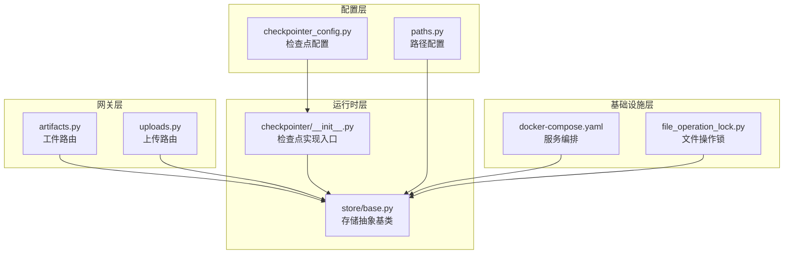
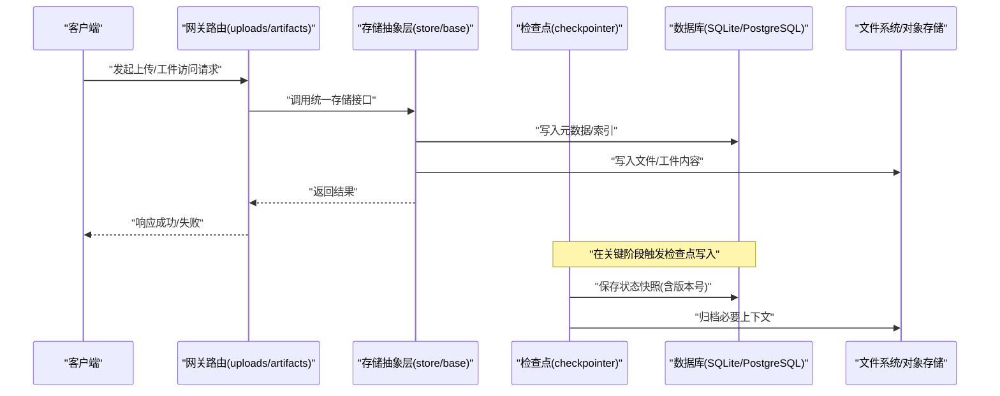
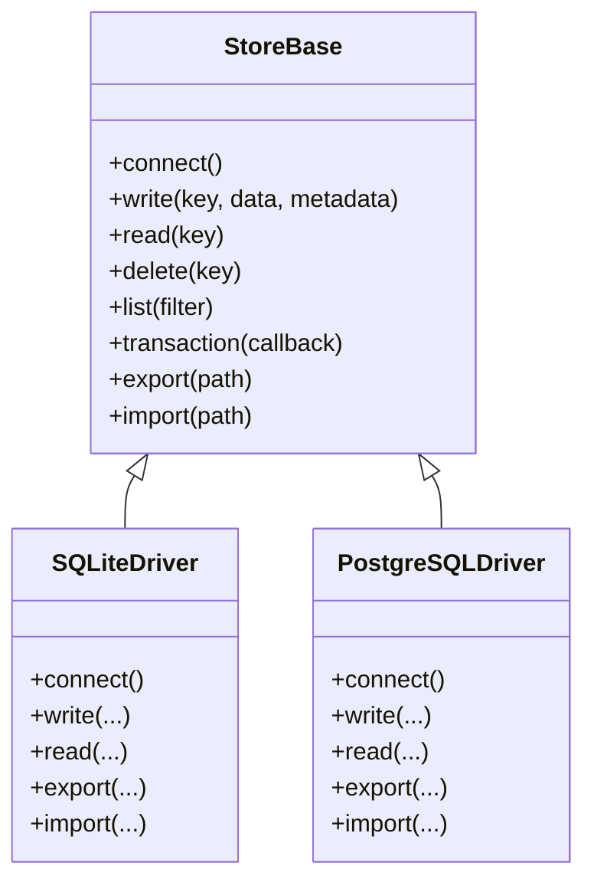
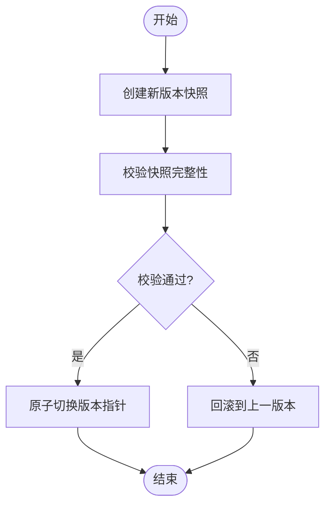
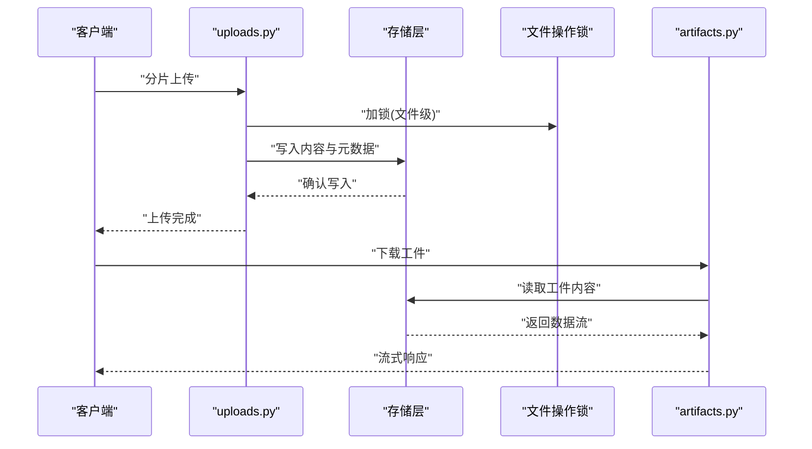
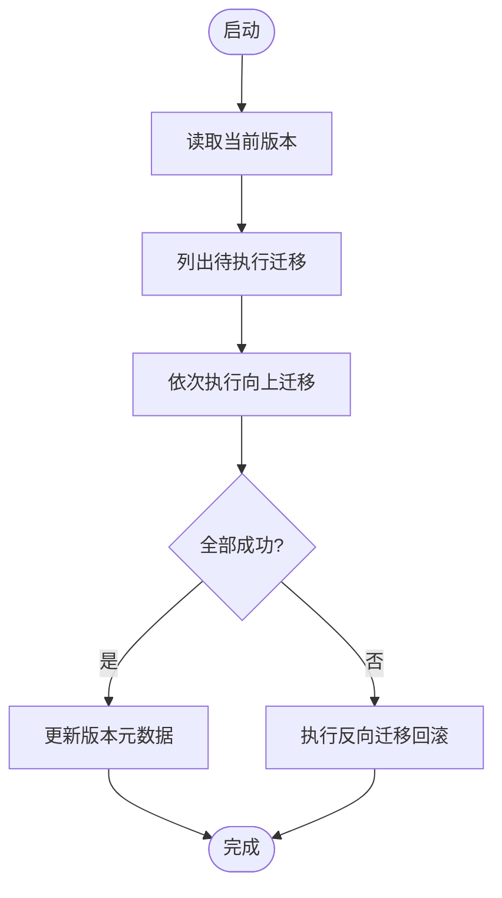
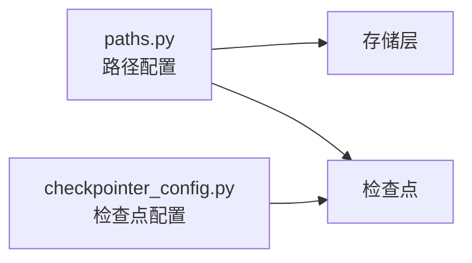
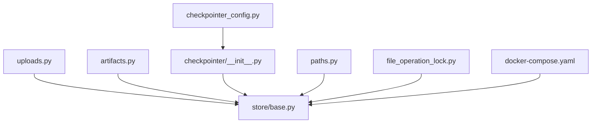

# 备份恢复和数据迁移

<cite>
**本文引用的文件**   
- [backend/app/gateway/routers/artifacts.py](file://backend/app/gateway/routers/artifacts.py)
- [backend/app/gateway/routers/uploads.py](file://backend/app/gateway/routers/uploads.py)
- [backend/packages/harness/deerflow/agents/checkpointer/__init__.py](file://backend/packages/harness/deerflow/agents/checkpointer/__init__.py)
- [backend/packages/harness/deerflow/runtime/store/base.py](file://backend/packages/harness/deerflow/runtime/store/base.py)
- [backend/packages/harness/deerflow/config/checkpointer_config.py](file://backend/packages/harness/deerflow/config/checkpointer_config.py)
- [backend/packages/harness/deerflow/config/paths.py](file://backend/packages/harness/deerflow/config/paths.py)
- [backend/packages/harness/deerflow/sandbox/file_operation_lock.py](file://backend/packages/harness/deerflow/sandbox/file_operation_lock.py)
- [docker/docker-compose.yaml](file://docker/docker-compose.yaml)
- [scripts/config-upgrade.sh](file://scripts/config-upgrade.sh)
</cite>

## 目录
1. [简介](#简介)
2. [项目结构](#项目结构)
3. [核心组件](#核心组件)
4. [架构总览](#架构总览)
5. [详细组件分析](#详细组件分析)
6. [依赖关系分析](#依赖关系分析)
7. [性能考虑](#性能考虑)
8. [故障排查指南](#故障排查指南)
9. [结论](#结论)
10. [附录](#附录)

## 简介
本文件面向DeerFlow的备份、恢复与数据迁移，聚焦以下目标：
- 数据库持久化层架构设计（SQLite与PostgreSQL适配）
- 迁移系统运行机制（版本管理、增量升级、回滚策略）
- 完整备份策略（全量、增量、实时同步）
- 数据恢复流程与灾难恢复预案
- 文件上传与工件的备份方法
- 数据迁移最佳实践与自动化脚本
- 数据一致性保证与完整性校验方法

## 项目结构
与备份恢复和迁移相关的代码主要分布在后端网关路由、运行时存储抽象、检查点配置与路径配置、沙箱文件操作锁以及部署编排文件中。整体组织方式采用“功能域+分层”模式：
- 网关层：暴露上传与工件访问接口
- 运行时层：提供统一的存储抽象与检查点机制
- 配置层：定义存储类型、路径与行为开关
- 基础设施层：通过Docker Compose编排外部服务（如数据库、对象存储等）

图表来源
- [backend/app/gateway/routers/artifacts.py](file://backend/app/gateway/routers/artifacts.py)
- [backend/app/gateway/routers/uploads.py](file://backend/app/gateway/routers/uploads.py)
- [backend/packages/harness/deerflow/runtime/store/base.py](file://backend/packages/harness/deerflow/runtime/store/base.py)
- [backend/packages/harness/deerflow/agents/checkpointer/__init__.py](file://backend/packages/harness/deerflow/agents/checkpointer/__init__.py)
- [backend/packages/harness/deerflow/config/checkpointer_config.py](file://backend/packages/harness/deerflow/config/checkpointer_config.py)
- [backend/packages/harness/deerflow/config/paths.py](file://backend/packages/harness/deerflow/config/paths.py)
- [docker/docker-compose.yaml](file://docker/docker-compose.yaml)
- [backend/packages/harness/deerflow/sandbox/file_operation_lock.py](file://backend/packages/harness/deerflow/sandbox/file_operation_lock.py)

章节来源
- [backend/app/gateway/routers/artifacts.py](file://backend/app/gateway/routers/artifacts.py)
- [backend/app/gateway/routers/uploads.py](file://backend/app/gateway/routers/uploads.py)
- [backend/packages/harness/deerflow/runtime/store/base.py](file://backend/packages/harness/deerflow/runtime/store/base.py)
- [backend/packages/harness/deerflow/agents/checkpointer/__init__.py](file://backend/packages/harness/deerflow/agents/checkpointer/__init__.py)
- [backend/packages/harness/deerflow/config/checkpointer_config.py](file://backend/packages/harness/deerflow/config/checkpointer_config.py)
- [backend/packages/harness/deerflow/config/paths.py](file://backend/packages/harness/deerflow/config/paths.py)
- [docker/docker-compose.yaml](file://docker/docker-compose.yaml)
- [backend/packages/harness/deerflow/sandbox/file_operation_lock.py](file://backend/packages/harness/deerflow/sandbox/file_operation_lock.py)

## 核心组件
- 存储抽象层（Store Base）
  - 职责：统一读写接口，屏蔽底层存储差异（文件系统、SQLite、PostgreSQL等）
  - 关键点：事务边界、幂等写入、错误分类、元数据记录
- 检查点（Checkpointer）
  - 职责：在关键业务节点保存状态快照，支持断点续跑与快速恢复
  - 关键点：版本标记、增量合并、冲突检测
- 配置与路径
  - 职责：集中管理存储类型、连接参数、数据目录、归档目录
  - 关键点：环境隔离、热重载、安全校验
- 网关路由（上传与工件）
  - 职责：对外暴露上传与工件访问API，协调存储层完成落盘与索引
  - 关键点：分片上传、并发控制、权限校验、审计日志
- 文件操作锁
  - 职责：避免多进程/多线程对同一文件的并发写导致损坏
  - 关键点：跨进程锁、超时与重试、死锁检测

章节来源
- [backend/packages/harness/deerflow/runtime/store/base.py](file://backend/packages/harness/deerflow/runtime/store/base.py)
- [backend/packages/harness/deerflow/agents/checkpointer/__init__.py](file://backend/packages/harness/deerflow/agents/checkpointer/__init__.py)
- [backend/packages/harness/deerflow/config/checkpointer_config.py](file://backend/packages/harness/deerflow/config/checkpointer_config.py)
- [backend/packages/harness/deerflow/config/paths.py](file://backend/packages/harness/deerflow/config/paths.py)
- [backend/app/gateway/routers/uploads.py](file://backend/app/gateway/routers/uploads.py)
- [backend/app/gateway/routers/artifacts.py](file://backend/app/gateway/routers/artifacts.py)
- [backend/packages/harness/deerflow/sandbox/file_operation_lock.py](file://backend/packages/harness/deerflow/sandbox/file_operation_lock.py)

## 架构总览
下图展示了从请求到持久化的端到端路径，以及备份与迁移的关键接入点。

图表来源
- [backend/app/gateway/routers/uploads.py](file://backend/app/gateway/routers/uploads.py)
- [backend/app/gateway/routers/artifacts.py](file://backend/app/gateway/routers/artifacts.py)
- [backend/packages/harness/deerflow/runtime/store/base.py](file://backend/packages/harness/deerflow/runtime/store/base.py)
- [backend/packages/harness/deerflow/agents/checkpointer/__init__.py](file://backend/packages/harness/deerflow/agents/checkpointer/__init__.py)

## 详细组件分析

### 存储抽象层（SQLite与PostgreSQL适配）
- 设计要点
  - 以抽象基类定义统一接口（读、写、事务、查询、分页、批量），具体驱动按需实现
  - SQLite用于单机/轻量场景；PostgreSQL用于高可用/分布式场景
  - 通过配置切换驱动，并在启动时进行连通性与兼容性自检
- 备份与迁移接入点
  - 提供导出/导入钩子，便于对接数据库原生工具（如pg_dump/pg_restore、sqlite3 .dump/.restore）
  - 在事务边界内执行批量写入，确保一致性
- 一致性保障
  - 使用外键约束、唯一索引、检查约束
  - 写入前进行幂等键校验，避免重复数据
  - 对大对象采用分块写入并附带校验和

图表来源
- [backend/packages/harness/deerflow/runtime/store/base.py](file://backend/packages/harness/deerflow/runtime/store/base.py)

章节来源
- [backend/packages/harness/deerflow/runtime/store/base.py](file://backend/packages/harness/deerflow/runtime/store/base.py)

### 检查点系统与版本管理
- 运行机制
  - 每次关键步骤完成后生成带时间戳与版本号的快照
  - 支持增量合并：仅记录变更部分，减少体积
  - 冲突检测：当检测到并发修改时，触发合并或拒绝写入
- 回滚策略
  - 基于版本链的回滚：按版本号倒序恢复到指定快照
  - 原子切换：新快照验证通过后，再切换指针，失败则保持旧版本
- 与存储层的协作
  - 检查点元数据写入数据库，实际内容可落盘至文件系统或对象存储

图表来源
- [backend/packages/harness/deerflow/agents/checkpointer/__init__.py](file://backend/packages/harness/deerflow/agents/checkpointer/__init__.py)
- [backend/packages/harness/deerflow/config/checkpointer_config.py](file://backend/packages/harness/deerflow/config/checkpointer_config.py)

章节来源
- [backend/packages/harness/deerflow/agents/checkpointer/__init__.py](file://backend/packages/harness/deerflow/agents/checkpointer/__init__.py)
- [backend/packages/harness/deerflow/config/checkpointer_config.py](file://backend/packages/harness/deerflow/config/checkpointer_config.py)

### 文件上传与工件备份
- 上传流程
  - 客户端分片上传，服务端聚合后落盘，并更新元数据索引
  - 上传过程中启用文件操作锁，防止并发写破坏
- 工件访问
  - 通过工件路由获取已归档产物，支持范围读取与缓存
- 备份建议
  - 对工件目录进行周期性快照（如每日全量+每小时增量）
  - 结合对象存储的版本控制特性，实现不可变备份

图表来源
- [backend/app/gateway/routers/uploads.py](file://backend/app/gateway/routers/uploads.py)
- [backend/app/gateway/routers/artifacts.py](file://backend/app/gateway/routers/artifacts.py)
- [backend/packages/harness/deerflow/sandbox/file_operation_lock.py](file://backend/packages/harness/deerflow/sandbox/file_operation_lock.py)

章节来源
- [backend/app/gateway/routers/uploads.py](file://backend/app/gateway/routers/uploads.py)
- [backend/app/gateway/routers/artifacts.py](file://backend/app/gateway/routers/artifacts.py)
- [backend/packages/harness/deerflow/sandbox/file_operation_lock.py](file://backend/packages/harness/deerflow/sandbox/file_operation_lock.py)

### 迁移系统与版本管理
- 版本管理
  - 维护迁移脚本清单与当前版本号，启动时比对并执行未应用的迁移
  - 每个迁移包含向上与向下脚本，支持回滚
- 增量升级
  - 只应用自上次版本以来的变更，降低停机窗口
- 回滚策略
  - 若新迁移执行失败，自动触发反向迁移并恢复至稳定版本
- 配置升级脚本
  - 提供命令行工具对配置文件进行格式升级与字段映射

图表来源
- [scripts/config-upgrade.sh](file://scripts/config-upgrade.sh)

章节来源
- [scripts/config-upgrade.sh](file://scripts/config-upgrade.sh)

### 路径与配置管理
- 路径配置
  - 集中定义数据目录、归档目录、临时目录、备份目录
  - 支持不同环境的覆盖与校验
- 检查点配置
  - 控制是否启用检查点、快照保留策略、最大版本数、压缩选项

图表来源
- [backend/packages/harness/deerflow/config/paths.py](file://backend/packages/harness/deerflow/config/paths.py)
- [backend/packages/harness/deerflow/config/checkpointer_config.py](file://backend/packages/harness/deerflow/config/checkpointer_config.py)

章节来源
- [backend/packages/harness/deerflow/config/paths.py](file://backend/packages/harness/deerflow/config/paths.py)
- [backend/packages/harness/deerflow/config/checkpointer_config.py](file://backend/packages/harness/deerflow/config/checkpointer_config.py)

## 依赖关系分析
- 组件耦合
  - 网关路由依赖存储抽象层，不直接感知底层驱动
  - 检查点依赖配置与路径，并通过存储层落盘
  - 文件操作锁为共享资源保护，被上传与工件模块共同使用
- 外部依赖
  - Docker Compose编排数据库与存储服务，便于本地与生产环境一致化

图表来源
- [backend/app/gateway/routers/uploads.py](file://backend/app/gateway/routers/uploads.py)
- [backend/app/gateway/routers/artifacts.py](file://backend/app/gateway/routers/artifacts.py)
- [backend/packages/harness/deerflow/runtime/store/base.py](file://backend/packages/harness/deerflow/runtime/store/base.py)
- [backend/packages/harness/deerflow/agents/checkpointer/__init__.py](file://backend/packages/harness/deerflow/agents/checkpointer/__init__.py)
- [backend/packages/harness/deerflow/config/checkpointer_config.py](file://backend/packages/harness/deerflow/config/checkpointer_config.py)
- [backend/packages/harness/deerflow/config/paths.py](file://backend/packages/harness/deerflow/config/paths.py)
- [backend/packages/harness/deerflow/sandbox/file_operation_lock.py](file://backend/packages/harness/deerflow/sandbox/file_operation_lock.py)
- [docker/docker-compose.yaml](file://docker/docker-compose.yaml)

章节来源
- [docker/docker-compose.yaml](file://docker/docker-compose.yaml)

## 性能考虑
- 数据库层面
  - 合理索引与分区策略，避免全表扫描
  - 批量写入与事务合并，减少IO次数
  - 连接池与超时配置，避免资源耗尽
- 文件与工件
  - 分片上传与并行校验，提升吞吐
  - 冷数据归档与压缩，降低存储成本
- 检查点
  - 增量快照与异步落盘，降低主路径延迟
  - 版本清理策略，控制历史快照数量

## 故障排查指南
- 常见问题定位
  - 上传失败：检查文件操作锁是否超时、磁盘空间是否充足、权限是否正确
  - 工件无法访问：核对工件索引与物理文件一致性，必要时重建索引
  - 迁移失败：查看迁移日志与版本元数据，必要时手动回滚
- 诊断手段
  - 启用详细日志与审计记录
  - 定期运行一致性校验任务，输出报告
  - 对关键路径添加健康检查探针

章节来源
- [backend/packages/harness/deerflow/sandbox/file_operation_lock.py](file://backend/packages/harness/deerflow/sandbox/file_operation_lock.py)

## 结论
DeerFlow通过统一的存储抽象、完善的检查点机制与清晰的配置管理，构建了可扩展且可靠的备份恢复与数据迁移基础能力。结合合理的备份策略、自动化迁移脚本与严格的校验流程，可在多种部署环境下保障数据一致性与可用性。

## 附录

### 备份策略建议
- 全量备份
  - 频率：每日一次
  - 内容：数据库快照、工件目录、检查点历史
  - 存储：异地对象存储，开启版本控制与加密
- 增量备份
  - 频率：每小时一次
  - 内容：自上次备份以来的变更集（数据库WAL/增量日志、文件变更）
- 实时同步
  - 适用场景：近零RPO要求
  - 方案：数据库主从复制+对象存储事件通知触发增量归档

### 数据恢复流程
- 单实例恢复
  - 停止服务 -> 恢复数据库 -> 恢复工件目录 -> 校验一致性 -> 启动服务
- 多实例恢复
  - 先恢复主库与中心工件存储 -> 再逐个节点拉取最新状态 -> 逐步上线
- 灾难恢复预案
  - 预置备用环境镜像与配置模板
  - 演练恢复流程，记录RTO/RPO指标

### 数据一致性保证与完整性校验
- 数据库
  - 外键约束、唯一性约束、检查约束
  - 迁移前后执行一致性校验脚本
- 文件与工件
  - 计算并存储校验和（如SHA-256），恢复后进行比对
  - 定期扫描异常文件并告警

### 自动化脚本与最佳实践
- 迁移脚本
  - 使用版本清单与幂等执行逻辑，失败自动回滚
  - 提供dry-run模式用于预演
- 备份脚本
  - 封装数据库导出、文件打包、校验和生成、上传远端
  - 支持并发与断点续传
- 最佳实践
  - 所有敏感信息通过环境变量注入
  - 备份与恢复过程全程留痕，便于审计与回溯