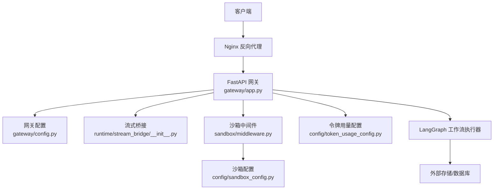
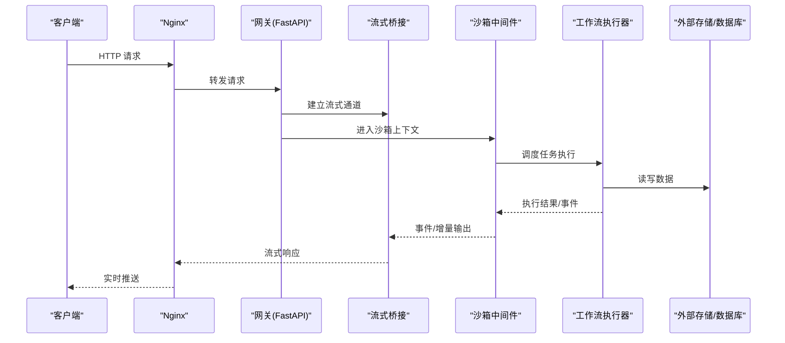
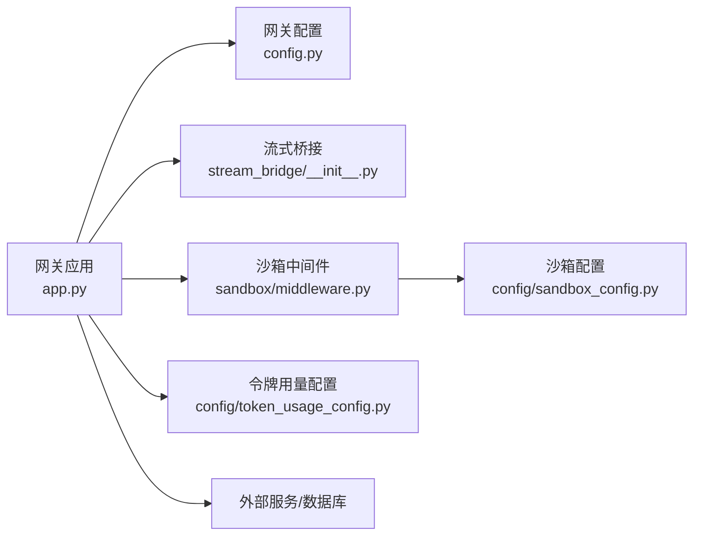

# 性能优化和调优

<cite>
**本文引用的文件**   
- [backend/app/gateway/config.py](file://backend/app/gateway/config.py)
- [backend/app/gateway/app.py](file://backend/app/gateway/app.py)
- [backend/packages/harness/deerflow/config/token_usage_config.py](file://backend/packages/harness/deerflow/config/token_usage_config.py)
- [backend/packages/harness/deerflow/config/sandbox_config.py](file://backend/packages/harness/deerflow/config/sandbox_config.py)
- [backend/packages/harness/deerflow/sandbox/middleware.py](file://backend/packages/harness/deerflow/sandbox/middleware.py)
- [backend/packages/harness/deerflow/runtime/stream_bridge/__init__.py](file://backend/packages/harness/deerflow/runtime/stream_bridge/__init__.py)
- [docker/docker-compose.yaml](file://docker/docker-compose.yaml)
- [docker/nginx/nginx.conf](file://docker/nginx/nginx.conf)
- [backend/Makefile](file://backend/Makefile)
- [scripts/run-with-git-bash.cmd](file://scripts/run-with-git-bash.cmd)
</cite>

## 目录
1. [简介](#简介)
2. [项目结构](#项目结构)
3. [核心组件](#核心组件)
4. [架构总览](#架构总览)
5. [详细组件分析](#详细组件分析)
6. [依赖关系分析](#依赖关系分析)
7. [性能考量](#性能考量)
8. [故障排查指南](#故障排查指南)
9. [结论](#结论)
10. [附录](#附录)

## 简介
本指南聚焦于 DeerFlow 的性能监控、运行时配置优化、沙箱内存分析与瓶颈识别、令牌使用监控与成本控制、数据库查询与索引优化建议、负载均衡与水平扩展配置，以及性能测试与基准测试方法。内容基于仓库中网关配置、流式桥接、沙箱中间件、Nginx 与 Docker Compose 等实际实现进行提炼，帮助读者在生产环境中稳定提升吞吐、降低延迟并控制成本。

## 项目结构
DeerFlow 后端采用 FastAPI 网关 + LangGraph 工作流执行的模式，关键性能相关位置如下：
- 网关配置与启动：gateway/config.py、gateway/app.py
- 令牌用量配置：harness/deerflow/config/token_usage_config.py
- 沙箱配置与审计中间件：harness/deerflow/config/sandbox_config.py、harness/deerflow/sandbox/middleware.py
- 流式输出桥接：harness/deerflow/runtime/stream_bridge/__init__.py
- 部署与反向代理：docker/docker-compose.yaml、docker/nginx/nginx.conf
- 构建与脚本：backend/Makefile、scripts/run-with-git-bash.cmd

图表来源
- [backend/app/gateway/app.py](file://backend/app/gateway/app.py)
- [backend/app/gateway/config.py](file://backend/app/gateway/config.py)
- [backend/packages/harness/deerflow/runtime/stream_bridge/__init__.py](file://backend/packages/harness/deerflow/runtime/stream_bridge/__init__.py)
- [backend/packages/harness/deerflow/sandbox/middleware.py](file://backend/packages/harness/deerflow/sandbox/middleware.py)
- [backend/packages/harness/deerflow/config/sandbox_config.py](file://backend/packages/harness/deerflow/config/sandbox_config.py)
- [backend/packages/harness/deerflow/config/token_usage_config.py](file://backend/packages/harness/deerflow/config/token_usage_config.py)

章节来源
- [backend/app/gateway/config.py](file://backend/app/gateway/config.py)
- [backend/app/gateway/app.py](file://backend/app/gateway/app.py)
- [backend/packages/harness/deerflow/config/token_usage_config.py](file://backend/packages/harness/deerflow/config/token_usage_config.py)
- [backend/packages/harness/deerflow/config/sandbox_config.py](file://backend/packages/harness/deerflow/config/sandbox_config.py)
- [backend/packages/harness/deerflow/sandbox/middleware.py](file://backend/packages/harness/deerflow/sandbox/middleware.py)
- [backend/packages/harness/deerflow/runtime/stream_bridge/__init__.py](file://backend/packages/harness/deerflow/runtime/stream_bridge/__init__.py)
- [docker/docker-compose.yaml](file://docker/docker-compose.yaml)
- [docker/nginx/nginx.conf](file://docker/nginx/nginx.conf)

## 核心组件
- 网关与配置
  - 负责接收请求、路由、鉴权、限流、日志与指标收集入口。可结合环境变量或配置文件调整并发、超时、连接池等参数。
- 流式桥接
  - 将工作流增量输出以 SSE/流式方式返回前端，减少首字节延迟，提升交互体验。
- 沙箱中间件与配置
  - 对代码执行环境进行资源限制、审计与隔离，避免异常进程拖垮主进程。
- 令牌用量配置
  - 统一采集模型调用 token 用量，支撑成本核算与配额控制。

章节来源
- [backend/app/gateway/config.py](file://backend/app/gateway/config.py)
- [backend/packages/harness/deerflow/runtime/stream_bridge/__init__.py](file://backend/packages/harness/deerflow/runtime/stream_bridge/__init__.py)
- [backend/packages/harness/deerflow/sandbox/middleware.py](file://backend/packages/harness/deerflow/sandbox/middleware.py)
- [backend/packages/harness/deerflow/config/sandbox_config.py](file://backend/packages/harness/deerflow/config/sandbox_config.py)
- [backend/packages/harness/deerflow/config/token_usage_config.py](file://backend/packages/harness/deerflow/config/token_usage_config.py)

## 架构总览
下图展示从客户端到工作流执行的端到端路径，标注了可用于性能优化的关键节点。

图表来源
- [backend/app/gateway/app.py](file://backend/app/gateway/app.py)
- [backend/packages/harness/deerflow/runtime/stream_bridge/__init__.py](file://backend/packages/harness/deerflow/runtime/stream_bridge/__init__.py)
- [backend/packages/harness/deerflow/sandbox/middleware.py](file://backend/packages/harness/deerflow/sandbox/middleware.py)
- [docker/nginx/nginx.conf](file://docker/nginx/nginx.conf)

## 详细组件分析

### 网关与运行时配置优化
- 并发与线程/进程模型
  - 通过多进程（uvicorn workers）与异步 I/O 提升吞吐；根据 CPU 核数与 IO 密集程度调节 worker 数量。
  - 合理设置请求超时、连接保持与 keep-alive，避免长尾请求占用资源。
- 连接池
  - 对外部服务（LLM、搜索、对象存储）与数据库的连接池大小应与并发度匹配，避免过多连接导致上下文切换开销。
- 缓存策略
  - 在网关层或上游服务启用热点数据缓存（如搜索结果、模板渲染），降低重复计算与网络往返。
- 指标与日志
  - 在网关入口埋点，记录 QPS、P95/P99 延迟、错误率、上游耗时，便于定位瓶颈。

章节来源
- [backend/app/gateway/config.py](file://backend/app/gateway/config.py)
- [backend/app/gateway/app.py](file://backend/app/gateway/app.py)

### 流式桥接与用户体验优化
- 流式输出
  - 使用流式桥接将工作流增量事件快速回推，显著降低首字节延迟，改善交互体验。
- 背压与节流
  - 当下游处理较慢时，适当限流或合并小事件，避免前端过载。
- 断线重连
  - 前端侧实现断线重连与幂等恢复，保障稳定性。

章节来源
- [backend/packages/harness/deerflow/runtime/stream_bridge/__init__.py](file://backend/packages/harness/deerflow/runtime/stream_bridge/__init__.py)

### 沙箱中间件与内存分析
- 资源限制
  - 为子进程/容器设置 CPU、内存上限，防止异常代码耗尽宿主资源。
- 审计与追踪
  - 记录沙箱内系统调用、文件访问、网络请求，辅助定位性能问题与安全边界。
- 内存分析工具
  - 在沙箱内集成轻量级内存分析（如分配统计、泄漏检测），定期生成报告，指导优化。
- 失败降级
  - 当沙箱资源不足或超限时，快速失败并返回友好提示，保护主进程。

章节来源
- [backend/packages/harness/deerflow/sandbox/middleware.py](file://backend/packages/harness/deerflow/sandbox/middleware.py)
- [backend/packages/harness/deerflow/config/sandbox_config.py](file://backend/packages/harness/deerflow/config/sandbox_config.py)

### 令牌使用监控与成本控制
- 用量采集
  - 统一在模型调用前后采集输入/输出 token 数，聚合至集中存储，用于成本核算与配额控制。
- 阈值与告警
  - 设定日/月用量阈值，触发告警或自动降级（切换到更便宜模型）。
- 效率提升
  - 压缩提示词、复用上下文、批量请求、缓存相似查询结果，降低无效 token 消耗。

章节来源
- [backend/packages/harness/deerflow/config/token_usage_config.py](file://backend/packages/harness/deerflow/config/token_usage_config.py)

### 数据库查询优化与索引设计
- 查询优化
  - 避免 N+1 查询，使用批量读取与分页；只选择必要字段，减少序列化与传输开销。
- 索引设计
  - 针对高频过滤、排序与关联键建立合适索引；覆盖索引可减少回表。
- 连接与事务
  - 合理设置连接池大小与事务粒度，避免长事务锁竞争。
- 读写分离与缓存
  - 读多写少场景下引入只读副本与缓存层，降低主库压力。

[本节为通用优化建议，不直接分析具体文件]

### 负载均衡与水平扩展
- 反向代理
  - 使用 Nginx 做四层/七层负载均衡，按权重与健康检查分发流量。
- 多实例部署
  - 通过 Docker Compose/Kubernetes 部署多个网关与工作流实例，配合无状态会话与共享存储。
- 弹性伸缩
  - 基于 CPU/内存/QPS 指标自动扩缩容，平滑应对峰值。

章节来源
- [docker/docker-compose.yaml](file://docker/docker-compose.yaml)
- [docker/nginx/nginx.conf](file://docker/nginx/nginx.conf)

### 性能测试方法与基准测试工具
- 压测工具
  - 使用 wrk、locust、k6 等工具模拟高并发，关注 P95/P99 延迟、吞吐与错误率。
- 基准场景
  - 短查询、长对话、大文件上传、流式输出、批量任务等典型场景分别建模。
- 指标采集
  - 结合 Prometheus/Grafana 可视化，对比优化前后差异。
- 回归验证
  - 将压测纳入 CI，确保变更不会退化性能。

章节来源
- [backend/Makefile](file://backend/Makefile)
- [scripts/run-with-git-bash.cmd](file://scripts/run-with-git-bash.cmd)

## 依赖关系分析
- 组件耦合
  - 网关依赖流式桥接与沙箱中间件；沙箱中间件依赖沙箱配置；令牌用量配置被上层调用方消费。
- 外部依赖
  - Nginx 作为反向代理；Docker Compose 编排服务；外部 LLM/数据库/对象存储。
- 潜在环依赖
  - 当前分层清晰，未见明显循环依赖；建议在新增模块时遵循单向依赖原则。

图表来源
- [backend/app/gateway/app.py](file://backend/app/gateway/app.py)
- [backend/app/gateway/config.py](file://backend/app/gateway/config.py)
- [backend/packages/harness/deerflow/runtime/stream_bridge/__init__.py](file://backend/packages/harness/deerflow/runtime/stream_bridge/__init__.py)
- [backend/packages/harness/deerflow/sandbox/middleware.py](file://backend/packages/harness/deerflow/sandbox/middleware.py)
- [backend/packages/harness/deerflow/config/sandbox_config.py](file://backend/packages/harness/deerflow/config/sandbox_config.py)
- [backend/packages/harness/deerflow/config/token_usage_config.py](file://backend/packages/harness/deerflow/config/token_usage_config.py)

## 性能考量
- CPU
  - 合理设置 uvicorn workers 数；避免阻塞型操作；将 CPU 密集型任务下沉至独立进程或队列。
- 内存
  - 控制消息体大小；及时释放大对象；在沙箱内限制内存上限；监控 RSS/堆增长。
- 磁盘 I/O
  - 使用 SSD；减少频繁小文件写入；批量落盘与异步写入。
- 网络
  - 启用连接复用与 Keep-Alive；压缩响应体；就近部署以减少跨域延迟。
- 流式与背压
  - 优先流式输出；对慢消费者实施背压，避免内存膨胀。
- 缓存
  - 多级缓存（本地/分布式）；设置合理的 TTL 与失效策略。
- 令牌成本
  - 精简提示词；复用上下文；批量与缓存；按需降级模型。

[本节提供通用指导，不直接分析具体文件]

## 故障排查指南
- 常见问题
  - 请求超时：检查网关超时、上游服务耗时与沙箱执行时间。
  - 内存溢出：查看沙箱内存限制与主进程 RSS；定位大对象与未释放资源。
  - 连接池耗尽：观察连接等待队列与最大连接数，扩容或优化查询。
  - 令牌用量突增：核对提示词长度与重复调用，启用用量告警。
- 诊断步骤
  - 开启详细日志与链路追踪；导出关键指标；复现最小用例；逐步缩小范围。
- 快速恢复
  - 熔断与降级；重启受影响的沙箱实例；临时放宽限制并尽快修复。

[本节为通用排障建议，不直接分析具体文件]

## 结论
通过对网关并发、流式输出、沙箱资源限制、令牌用量监控、数据库与缓存策略、负载均衡与弹性伸缩的系统性优化，可在保证稳定性的前提下显著提升 DeerFlow 的吞吐与响应速度，并有效控制运行成本。建议将上述实践纳入日常运维与发布流程，持续度量与迭代。

## 附录
- 常用命令与脚本
  - Makefile 中封装了构建、测试与部署相关命令，便于自动化流水线集成。
  - Windows 环境下可使用 run-with-git-bash.cmd 执行 Bash 脚本。

章节来源
- [backend/Makefile](file://backend/Makefile)
- [scripts/run-with-git-bash.cmd](file://scripts/run-with-git-bash.cmd)