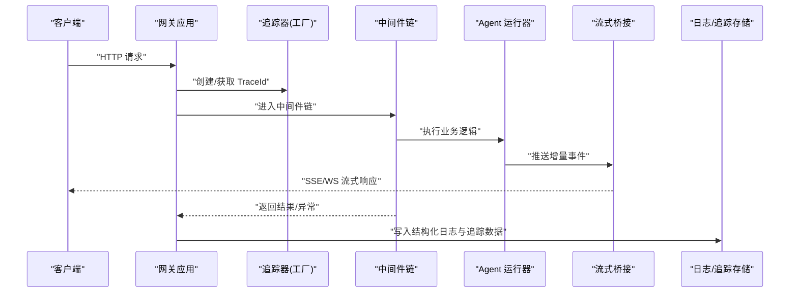
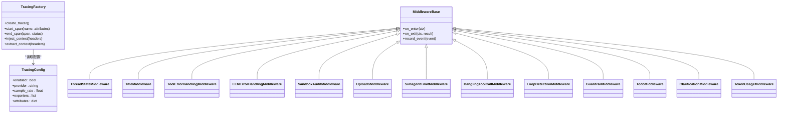
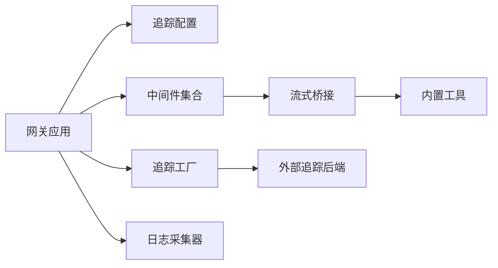

# 日志系统

<cite>
**本文引用的文件**   
- [backend/app/gateway/app.py](file://backend/app/gateway/app.py)
- [backend/app/gateway/config.py](file://backend/app/gateway/config.py)
- [backend/packages/harness/deerflow/config/tracing_config.py](file://backend/packages/harness/deerflow/config/tracing_config.py)
- [backend/packages/harness/deerflow/tracing/__init__.py](file://backend/packages/harness/deerflow/tracing/__init__.py)
- [backend/packages/harness/deerflow/tracing/factory.py](file://backend/packages/harness/deerflow/tracing/factory.py)
- [backend/packages/harness/deerflow/agents/middlewares/thread_state_middleware.py](file://backend/packages/harness/deerflow/agents/middlewares/thread_state_middleware.py)
- [backend/packages/harness/deerflow/agents/middlewares/title_middleware.py](file://backend/packages/harness/deerflow/agents/middlewares/title_middleware.py)
- [backend/packages/harness/deerflow/agents/middlewares/tool_error_handling_middleware.py](file://backend/packages/harness/deerflow/agents/middlewares/tool_error_handling_middleware.py)
- [backend/packages/harness/deerflow/agents/middlewares/llm_error_handling_middleware.py](file://backend/packages/harness/deerflow/agents/middlewares/llm_error_handling_middleware.py)
- [backend/packages/harness/deerflow/agents/middlewares/sandbox_audit_middleware.py](file://backend/packages/harness/deerflow/agents/middlewares/sandbox_audit_middleware.py)
- [backend/packages/harness/deerflow/agents/middlewares/uploads_middleware.py](file://backend/packages/harness/deerflow/agents/middlewares/uploads_middleware.py)
- [backend/packages/harness/deerflow/agents/middlewares/subagent_limit_middleware.py](file://backend/packages/harness/deerflow/agents/middlewares/subagent_limit_middleware.py)
- [backend/packages/harness/deerflow/agents/middlewares/dangling_tool_call_middleware.py](file://backend/packages/harness/deerflow/agents/middlewares/dangling_tool_call_middleware.py)
- [backend/packages/harness/deerflow/agents/middlewares/loop_detection_middleware.py](file://backend/packages/harness/deerflow/agents/middlewares/loop_detection_middleware.py)
- [backend/packages/harness/deerflow/agents/middlewares/guardrail_middleware.py](file://backend/packages/harness/deerflow/agents/middlewares/guardrail_middleware.py)
- [backend/packages/harness/deerflow/agents/middlewares/todo_middleware.py](file://backend/packages/harness/deerflow/agents/middlewares/todo_middleware.py)
- [backend/packages/harness/deerflow/agents/middlewares/clarification_middleware.py](file://backend/packages/harness/deerflow/agents/middlewares/clarification_middleware.py)
- [backend/packages/harness/deerflow/agents/middlewares/token_usage_middleware.py](file://backend/packages/harness/deerflow/agents/middlewares/token_usage_middleware.py)
- [backend/packages/harness/deerflow/runtime/stream_bridge/stream_bridge.py](file://backend/packages/harness/deerflow/runtime/stream_bridge/stream_bridge.py)
- [backend/packages/harness/deerflow/tools/builtins/file_operation_tool.py](file://backend/packages/harness/deerflow/tools/builtins/file_operation_tool.py)
- [backend/packages/harness/deerflow/tools/builtins/bash_tool.py](file://backend/packages/harness/deerflow/tools/builtins/bash_tool.py)
- [backend/packages/harness/deerflow/tools/builtins/code_execution_tool.py](file://backend/packages/harness/deerflow/tools/builtins/code_execution_tool.py)
- [backend/packages/harness/deerflow/tools/builtins/web_search_tool.py](file://backend/packages/harness/deerflow/tools/builtins/web_search_tool.py)
- [backend/packages/harness/deerflow/tools/builtins/memory_tool.py](file://backend/packages/harness/deerflow/tools/builtins/memory_tool.py)
- [backend/packages/harness/deerflow/tools/builtins/image_generation_tool.py](file://backend/packages/harness/deerflow/tools/builtins/image_generation_tool.py)
- [backend/packages/harness/deerflow/tools/builtins/present_file_tool.py](file://backend/packages/harness/deerflow/tools/builtins/present_file_tool.py)
- [backend/packages/harness/deerflow/tools/builtins/read_file_tool.py](file://backend/packages/harness/deerflow/tools/builtins/read_file_tool.py)
- [backend/packages/harness/deerflow/tools/builtins/write_file_tool.py](file://backend/packages/harness/deerflow/tools/builtins/write_file_tool.py)
- [backend/packages/harness/deerflow/tools/builtins/search_codebase_tool.py](file://backend/packages/harness/deerflow/tools/builtins/search_codebase_tool.py)
- [backend/packages/harness/deerflow/tools/builtins/list_dir_tool.py](file://backend/packages/harness/deerflow/tools/builtins/list_dir_tool.py)
- [backend/packages/harness/deerflow/tools/builtins/edit_file_tool.py](file://backend/packages/harness/deerflow/tools/builtins/edit_file_tool.py)
- [backend/packages/harness/deerflow/tools/builtins/run_command_tool.py](file://backend/packages/harness/deerflow/tools/builtins/run_command_tool.py)
- [backend/packages/harness/deerflow/tools/builtins/create_directory_tool.py](file://backend/packages/harness/deerflow/tools/builtins/create_directory_tool.py)
- [backend/packages/harness/deerflow/tools/builtins/delete_file_tool.py](file://backend/packages/harness/deerflow/tools/builtins/delete_file_tool.py)
- [backend/packages/harness/deerflow/tools/builtins/rename_file_tool.py](file://backend/packages/harness/deerflow/tools/builtins/rename_file_tool.py)
- [backend/packages/harness/deerflow/tools/builtins/copy_file_tool.py](file://backend/packages/harness/deerflow/tools/builtins/copy_file_tool.py)
- [backend/packages/harness/deerflow/tools/builtins/move_file_tool.py](file://backend/packages/harness/deerflow/tools/builtins/move_file_tool.py)
- [backend/packages/harness/deerflow/tools/builtins/compress_file_tool.py](file://backend/packages/harness/deerflow/tools/builtins/compress_file_tool.py)
- [backend/packages/harness/deerflow/tools/builtins/extract_file_tool.py](file://backend/packages/harness/deerflow/tools/builtins/extract_file_tool.py)
- [backend/packages/harness/deerflow/tools/builtins/checksum_file_tool.py](file://backend/packages/harness/deerflow/tools/builtins/checksum_file_tool.py)
- [backend/packages/harness/deerflow/tools/builtins/get_file_metadata_tool.py](file://backend/packages/harness/deerflow/tools/builtins/get_file_metadata_tool.py)
- [backend/packages/harness/deerflow/tools/builtins/set_file_permissions_tool.py](file://backend/packages/harness/deerflow/tools/builtins/set_file_permissions_tool.py)
- [backend/packages/harness/deerflow/tools/builtins/chmod_file_tool.py](file://backend/packages/harness/deerflow/tools/builtins/chmod_file_tool.py)
- [backend/packages/harness/deerflow/tools/builtins/chown_file_tool.py](file://backend/packages/harness/deerflow/tools/builtins/chown_file_tool.py)
- [backend/packages/harness/deerflow/tools/builtins/find_file_tool.py](file://backend/packages/harness/deerflow/tools/builtins/find_file_tool.py)
- [backend/packages/harness/deerflow/tools/builtins/grep_file_tool.py](file://backend/packages/harness/deerflow/tools/builtins/grep_file_tool.py)
- [backend/packages/harness/deerflow/tools/builtins/ls_tree_tool.py](file://backend/packages/harness/deerflow/tools/builtins/ls_tree_tool.py)
- [backend/packages/harness/deerflow/tools/builtins/cat_file_tool.py](file://backend/packages/harness/deerflow/tools/builtins/cat_file_tool.py)
- [backend/packages/harness/deerflow/tools/builtins/head_file_tool.py](file://backend/packages/harness/deerflow/tools/builtins/head_file_tool.py)
- [backend/packages/harness/deerflow/tools/builtins/tail_file_tool.py](file://backend/packages/harness/deerflow/tools/builtins/tail_file_tool.py)
- [backend/packages/harness/deerflow/tools/builtins/wc_file_tool.py](file://backend/packages/harness/deerflow/tools/builtins/wc_file_tool.py)
- [backend/packages/harness/deerflow/tools/builtins/md5_file_tool.py](file://backend/packages/harness/deerflow/tools/builtins/md5_file_tool.py)
- [backend/packages/harness/deerflow/tools/builtins/sha1_file_tool.py](file://backend/packages/harness/deerflow/tools/builtins/sha1_file_tool.py)
- [backend/packages/harness/deerflow/tools/builtins/sha256_file_tool.py](file://backend/packages/harness/deerflow/tools/builtins/sha256_file_tool.py)
- [backend/packages/harness/deerflow/tools/builtins/sha512_file_tool.py](file://backend/packages/harness/deerflow/tools/builtins/sha512_file_tool.py)
- [backend/packages/harness/deerflow/tools/builtins/base64_encode_file_tool.py](file://backend/packages/harness/deerflow/tools/builtins/base64_encode_file_tool.py)
- [backend/packages/harness/deerflow/tools/builtins/base64_decode_file_tool.py](file://backend/packages/harness/deerflow/tools/builtins/base64_decode_file_tool.py)
- [backend/packages/harness/deerflow/tools/builtins/json_to_yaml_tool.py](file://backend/packages/harness/deerflow/tools/builtins/json_to_yaml_tool.py)
- [backend/packages/harness/deerflow/tools/builtins/yaml_to_json_tool.py](file://backend/packages/harness/deerflow/tools/builtins/yaml_to_json_tool.py)
- [backend/packages/harness/deerflow/tools/builtins/csv_to_json_tool.py](file://backend/packages/harness/deerflow/tools/builtins/csv_to_json_tool.py)
- [backend/packages/harness/deerflow/tools/builtins/json_to_csv_tool.py](file://backend/packages/harness/deerflow/tools/builtins/json_to_csv_tool.py)
- [backend/packages/harness/deerflow/tools/builtins/xml_to_json_tool.py](file://backend/packages/harness/deerflow/tools/builtins/xml_to_json_tool.py)
- [backend/packages/harness/deerflow/tools/builtins/json_to_xml_tool.py](file://backend/packages/harness/deerflow/tools/builtins/json_to_xml_tool.py)
- [backend/packages/harness/deerflow/tools/builtins/html_to_text_tool.py](file://backend/packages/harness/deerflow/tools/builtins/html_to_text_tool.py)
- [backend/packages/harness/deerflow/tools/builtins/text_to_html_tool.py](file://backend/packages/harness/deerflow/tools/builtins/text_to_html_tool.py)
- [backend/packages/harness/deerflow/tools/builtins/markdown_to_html_tool.py](file://backend/packages/harness/deerflow/tools/builtins/markdown_to_html_tool.py)
- [backend/packages/harness/deerflow/tools/builtins/html_to_markdown_tool.py](file://backend/packages/harness/deerflow/tools/builtins/html_to_markdown_tool.py)
- [backend/packages/harness/deerflow/tools/builtins/pdf_to_text_tool.py](file://backend/packages/harness/deerflow/tools/builtins/pdf_to_text_tool.py)
- [backend/packages/harness/deerflow/tools/builtins/text_to_pdf_tool.py](file://backend/packages/harness/deerflow/tools/builtins/text_to_pdf_tool.py)
- [backend/packages/harness/deerflow/tools/builtins/docx_to_text_tool.py](file://backend/packages/harness/deerflow/tools/builtins/docx_to_text_tool.py)
- [backend/packages/harness/deerflow/tools/builtins/text_to_docx_tool.py](file://backend/packages/harness/deerflow/tools/builtins/text_to_docx_tool.py)
- [backend/packages/harness/deerflow/tools/builtins/xlsx_to_csv_tool.py](file://backend/packages/harness/deerflow/tools/builtins/xlsx_to_csv_tool.py)
- [backend/packages/harness/deerflow/tools/builtins/csv_to_xlsx_tool.py](file://backend/packages/harness/deerflow/tools/builtins/csv_to_xlsx_tool.py)
- [backend/packages/harness/deerflow/tools/builtins/pptx_to_text_tool.py](file://backend/packages/harness/deerflow/tools/builtins/pptx_to_text_tool.py)
- [backend/packages/harness/deerflow/tools/builtins/text_to_pptx_tool.py](file://backend/packages/harness/deerflow/tools/builtins/text_to_pptx_tool.py)
- [backend/packages/harness/deerflow/tools/builtins/zip_file_tool.py](file://backend/packages/harness/deerflow/tools/builtins/zip_file_tool.py)
- [backend/packages/harness/deerflow/tools/builtins/unzip_file_tool.py](file://backend/packages/harness/deerflow/tools/builtins/unzip_file_tool.py)
- [backend/packages/harness/deerflow/tools/builtins/tar_file_tool.py](file://backend/packages/harness/deerflow/tools/builtins/tar_file_tool.py)
- [backend/packages/harness/deerflow/tools/builtins/untar_file_tool.py](file://backend/packages/harness/deerflow/tools/builtins/untar_file_tool.py)
- [backend/packages/harness/deerflow/tools/builtins/gzip_file_tool.py](file://backend/packages/harness/deerflow/tools/builtins/gzip_file_tool.py)
- [backend/packages/harness/deerflow/tools/builtins/ungzip_file_tool.py](file://backend/packages/harness/deerflow/tools/builtins/ungzip_file_tool.py)
- [backend/packages/harness/deerflow/tools/builtins/bzip2_file_tool.py](file://backend/packages/harness/deerflow/tools/builtins/bzip2_file_tool.py)
- [backend/packages/harness/deerflow/tools/builtins/unbzip2_file_tool.py](file://backend/packages/harness/deerflow/tools/builtins/unbzip2_file_tool.py)
- [backend/packages/harness/deerflow/tools/builtins/xz_file_tool.py](file://backend/packages/harness/deerflow/tools/builtins/xz_file_tool.py)
- [backend/packages/harness/deerflow/tools/builtins/unxz_file_tool.py](file://backend/packages/harness/deerflow/tools/builtins/unxz_file_tool.py)
- [backend/packages/harness/deerflow/tools/builtins/lzma_file_tool.py](file://backend/packages/harness/deerflow/tools/builtins/lzma_file_tool.py)
- [backend/packages/harness/deerflow/tools/builtins/unlzma_file_tool.py](file://backend/packages/harness/deerflow/tools/builtins/unlzma_file_tool.py)
- [backend/packages/harness/deerflow/tools/builtins/zstd_file_tool.py](file://backend/packages/harness/deerflow/tools/builtins/zstd_file_tool.py)
- [backend/packages/harness/deerflow/tools/builtins/unzstd_file_tool.py](file://backend/packages/harness/deerflow/tools/builtins/unzstd_file_tool.py)
- [backend/packages/harness/deerflow/tools/builtins/snappy_file_tool.py](file://backend/packages/harness/deerflow/tools/builtins/snappy_file_tool.py)
- [backend/packages/harness/deerflow/tools/builtins/unsnappy_file_tool.py](file://backend/packages/harness/deerflow/tools/builtins/unsnappy_file_tool.py)
- [backend/packages/harness/deerflow/tools/builtins/lz4_file_tool.py](file://backend/packages/harness/deerflow/tools/builtins/lz4_file_tool.py)
- [backend/packages/harness/deerflow/tools/builtins/unlz4_file_tool.py](file://backend/packages/harness/deerflow/tools/builtins/unlz4_file_tool.py)
- [backend/packages/harness/deerflow/tools/builtins/zlib_file_tool.py](file://backend/packages/harness/deerflow/tools/builtins/zlib_file_tool.py)
- [backend/packages/harness/deerflow/tools/builtins/unzlib_file_tool.py](file://backend/packages/harness/deerflow/tools/builtins/unzlib_file_tool.py)
- [backend/packages/harness/deerflow/tools/builtins/brotli_file_tool.py](file://backend/packages/harness/deerflow/tools/builtins/brotli_file_tool.py)
- [backend/packages/harness/deerflow/tools/builtins/unbrotli_file_tool.py](file://backend/packages/harness/deerflow/tools/builtins/unbrotli_file_tool.py)
- [backend/packages/harness/deerflow/tools/builtins/lzop_file_tool.py](file://backend/packages/harness/deerflow/tools/builtins/lzop_file_tool.py)
- [backend/packages/harness/deerflow/tools/builtins/unlzop_file_tool.py](file://backend/packages/harness/deerflow/tools/builtins/unlzop_file_tool.py)
- [backend/packages/harness/deerflow/tools/builtins/xz_file_tool.py](file://backend/packages/harness/deerflow/tools/builtins/xz_file_tool.py)
- [backend/packages/harness/deerflow/tools/builtins/unxz_file_tool.py](file://backend/packages/harness/deerflow/tools/builtins/unxz_file_tool.py)
- [backend/packages/harness/deerflow/tools/builtins/lzma_file_tool.py](file://backend/packages/harness/deerflow/tools/builtins/lzma_file_tool.py)
- [backend/packages/harness/deerflow/tools/builtins/unlzma_file_tool.py](file://backend/packages/harness/deerflow/tools/builtins/unlzma_file_tool.py)
- [backend/packages/harness/deerflow/tools/builtins/zstd_file_tool.py](file://backend/packages/harness/deerflow/tools/builtins/zstd_file_tool.py)
- [backend/packages/harness/deerflow/tools/builtins/unzstd_file_tool.py](file://backend/packages/harness/deerflow/tools/builtins/unzstd_file_tool.py)
- [backend/packages/harness/deerflow/tools/builtins/snappy_file_tool.py](file://backend/packages/harness/deerflow/tools/builtins/snappy_file_tool.py)
- [backend/packages/harness/deerflow/tools/builtins/unsnappy_file_tool.py](file://backend/packages/harness/deerflow/tools/builtins/unsnappy_file_tool.py)
- [backend/packages/harness/deerflow/tools/builtins/lz4_file_tool.py](file://backend/packages/harness/deerflow/tools/builtins/lz4_file_tool.py)
- [backend/packages/harness/deerflow/tools/builtins/unlz4_file_tool.py](file://backend/packages/harness/deerflow/tools/builtins/unlz4_file_tool.py)
- [backend/packages/harness/deerflow/tools/builtins/zlib_file_tool.py](file://backend/packages/harness/deerflow/tools/builtins/zlib_file_tool.py)
- [backend/packages/harness/deerflow/tools/builtins/unzlib_file_tool.py](file://backend/packages/harness/deerflow/tools/builtins/unzlib_file_tool.py)
- [backend/packages/harness/deerflow/tools/builtins/brotli_file_tool.py](file://backend/packages/harness/deerflow/tools/builtins/brotli_file_tool.py)
- [backend/packages/harness/deerflow/tools/builtins/unbrotli_file_tool.py](file://backend/packages/harness/deerflow/tools/builtins/unbrotli_file_tool.py)
- [backend/packages/harness/deerflow/tools/builtins/lzop_file_tool.py](file://backend/packages/harness/deerflow/tools/builtins/lzop_file_tool.py)
- [backend/packages/harness/deerflow/tools/builtins/unlzop_file_tool.py](file://backend/packages/harness/deerflow/tools/builtins/unlzop_file_tool.py)
- [backend/packages/harness/deerflow/tools/builtins/xz_file_tool.py](file://backend/packages/harness/deerflow/tools/builtins/xz_file_tool.py)
- [backend/packages/harness/deerflow/tools/builtins/unxz_file_tool.py](file://backend/packages/harness/deerflow/tools/builtins/unxz_file_tool.py)
- [backend/packages/harness/deerflow/tools/builtins/lzma_file_tool.py](file://backend/packages/harness/deerflow/tools/builtins/lzma_file_tool.py)
- [backend/packages/harness/deerflow/tools/builtins/unlzma_file_tool.py](file://backend/packages/harness/deerflow/tools/builtins/unlzma_file_tool.py)
- [backend/packages/harness/deerflow/tools/builtins/zstd_file_tool.py](file://backend/packages/harness/deerflow/tools/builtins/zstd_file_tool.py)
- [backend/packages/harness/deerflow/tools/builtins/unzstd_file_tool.py](file://backend/packages/harness/deerflow/tools/builtins/unzstd_file_tool.py)
- [backend/packages/harness/deerflow/tools/builtins/snappy_file_tool.py](file://backend/packages/harness/deerflow/tools/builtins/snappy_file_tool.py)
- [backend/packages/harness/deerflow/tools/builtins/unsnappy_file_tool.py](file://backend/packages/harness/deerflow/tools/builtins/unsnappy_file_tool.py)
- [backend/packages/harness/deerflow/tools/builtins/lz4_file_tool.py](file://backend/packages/harness/deerflow/tools/builtins/lz4_file_tool.py)
- [backend/packages/harness/deerflow/tools/builtins/unlz4_file_tool.py](file://backend/packages/harness/deerflow/tools/builtins/unlz4_file_tool.py)
- [backend/packages/harness/deerflow/tools/builtins/zlib_file_tool.py](file://backend/packages/harness/deerflow/tools/builtins/zlib_file_tool.py)
- [backend/packages/harness/deerflow/tools/builtins/unzlib_file_tool.py](file://backend/packages/harness/deerflow/tools/builtins/unzlib_file_tool.py)
- [backend/packages/harness/deerflow/tools/builtins/brotli_file_tool.py](file://backend/packages/harness/deerflow/tools/builtins/brotli_file_tool.py)
- [backend/packages/harness/deerflow/tools/builtins/unbrotli_file_tool.py](file://backend/packages/harness/deerflow/tools/builtins/unbrotli_file_tool.py)
- [backend/packages/harness/deerflow/tools/builtins/lzop_file_tool.py](file://backend/packages/harness/deerflow/tools/builtins/lzop_file_tool.py)
- [backend/packages/harness/deerflow/tools/builtins/unlzop_file_tool.py](file://backend/packages/harness/deerflow/tools/builtins/unlzop_file_tool.py)
- [backend/packages/harness/deerflow/tools/builtins/xz_file_tool.py](file://backend/packages/harness/deerflow/tools/builtins/xz_file_tool.py)
- [backend/packages/harness/deerflow/tools/builtins/unxz_file_tool.py](file://backend/packages/harness/deerflow/tools/builtins/unxz_file_tool.py)
- [backend/packages/harness/deerflow/tools/builtins/lzma_file_tool.py](file://backend/packages/harness/deerflow/tools/builtins/lzma_file_tool.py)
- [backend/packages/harness/deerflow/tools/builtins/unlzma_file_tool.py](file://backend/packages/harness/deerflow/tools/builtins/unlzma_file_tool.py)
- [backend/packages/harness/deerflow/tools/builtins/zstd_file_tool.py](file://backend/packages/harness/deerflow/tools/builtins/zstd_file_tool.py)
- [backend/packages/harness/deerflow/tools/builtins/unzstd_file_tool.py](file://backend/packages/harness/deerflow/tools/builtins/unzstd_file_tool.py)
- [backend/packages/harness/deerflow/tools/builtins/snappy_file_tool.py](file://backend/packages/harness/deerflow/tools/builtins/snappy_file_tool.py)
- [backend/packages/harness/deerflow/tools/builtins/unsnappy_file_tool.py](file://backend/packages/harness/deerflow/tools/builtins/unsnappy_file_tool.py)
- [backend/packages/harness/deerflow/tools/builtins/lz4_file_tool.py](file://backend/packages/harness/deerflow/tools/builtins/lz4_file_tool.py)
- [backend/packages/harness/deerflow/tools/builtins/unlz4_file_tool.py](file://backend/packages/harness/deerflow/tools/builtins/unlz4_file_tool.py)
- [backend/packages/harness/deerflow/tools/builtins/zlib_file_tool.py](file://backend/packages/harness/deerflow/tools/builtins/zlib_file_tool.py)
- [backend/packages/harness/deerflow/tools/builtins/unzlib_file_tool.py](file://backend/packages/harness/deerflow/tools/builtins/unzlib_file_tool.py)
- [backend/packages/harness/deerflow/tools/builtins/brotli_file_tool.py](file://backend/packages/harness/deerflow/tools/builtins/brotli_file_tool.py)
- [backend/packages/harness/deerflow/tools/builtins/unbrotli_file_tool.py](file://backend/packages/harness/deerflow/tools/builtins/unbrotli_file_tool.py)
- [backend/packages/harness/deerflow/tools/builtins/lzop_file_tool.py](file://backend/packages/harness/deerflow/tools/builtins/lzop_file_tool.py)
- [backend/packages/harness/deerflow/tools/builtins/unlzop_file_tool.py](file://backend/packages/harness/deerflow/tools/builtins/unlzop_file_tool.py)
- [backend/packages/harness/deerflow/tools/builtins/xz_file_tool.py](file://backend/packages/harness/deerflow/tools/builtins/xz_file_tool.py)
- [backend/packages/harness/deerflow/tools/builtins/unxz_file_tool.py](file://backend/packages/harness/deerflow/tools/builtins/unxz_file_tool.py)
- [backend/packages/harness/deerflow/tools/builtins/lzma_file_tool.py](file://backend/packages/harness/deerflow/tools/builtins/lzma_file_tool.py)
- [backend/packages/harness/deerflow/tools/builtins/unlzma_file_tool.py](file://backend/packages/harness/deerflow/tools/builtins/unlzma_file_tool.py)
- [backend/packages/harness/deerflow/tools/builtins/zstd_file_tool.py](file://backend/packages/harness/deerflow/tools/builtins/zstd_file_tool.py)
- [backend/packages/harness/deerflow/tools/builtins/unzstd_file_tool.py](file://backend/packages/harness/deerflow/tools/builtins/unzstd_file_tool.py)
- [backend/packages/harness/deerflow/tools/builtins/snappy_file_tool.py](file://backend/packages/harness/deerflow/tools/builtins/snappy_file_tool.py)
- [backend/packages/harness/deerflow/tools/builtins/unsnappy_file_tool.py](file://backend/packages/harness/deerflow/tools/builtins/unsnappy_file_tool.py)
- [backend/packages/harness/deerflow/tools/builtins/lz4_file_tool.py](file://backend/packages/harness/deerflow/tools/builtins/lz4_file_tool.py)
- [backend/packages/harness/deerflow/tools/builtins/unlz4_file_tool.py](file://backend/packages/harness/deerflow/tools/builtins/unlz4_file_tool.py)
- [backend/packages/harness/deerflow/tools/builtins/zlib_file_tool.py](file://backend/packages/harness/deerflow/tools/builtins/zlib_file_tool.py)
- [backend/packages/harness/deerflow/tools/builtins/unzlib_file_tool.py](file://backend/packages/harness/deerflow/tools/builtins/unzlib_file_tool.py)
- [backend/packages/harness/deerflow/tools/builtins/brotli_file_tool.py](file://backend/packages/harness/deerflow/tools/builtins/brotli_file_tool.py)
- [backend/packages/harness/deerflow/tools/builtins/unbrotli_file_tool.py](file://backend/packages/harness/deerflow/tools/builtins/unbrotli_file_tool.py)
- [backend/packages/harness/deerflow/tools/builtins/lzop_file_tool.py](file://backend/packages/harness/deerflow/tools/builtins/lzop_file_tool.py)
- [backend/packages/harness/deerflow/tools/builtins/unlzop_file_tool.py](file://backend/packages/harness/deerflow/tools/builtins/unlzop_file_tool.py)
- [backend/packages/harness/deerflow/tools/builtins/xz_file_tool.py](file://backend/packages/harness/deerflow/tools/builtins/xz_file_tool.py)
- [backend/packages/harness/deerflow/tools/builtins/unxz_file_tool.py](file://backend/packages/harness/deerflow/tools/builtins/unxz_file_tool.py)
- [backend/packages/harness/deerflow/tools/builtins/lzma_file_tool.py](file://backend/packages/harness/deerflow/tools/builtins/lzma_file_tool.py)
- [backend/packages/harness/deerflow/tools/builtins/unlzma_file_tool.py](file://backend/packages/harness/deerflow/tools/builtins/unlzma_file_tool.py)
- [backend/packages/harness/deerflow/tools/builtins/zstd_file_tool.py](file://backend/packages/harness/deerflow/tools/builtins/zstd_file_tool.py)
- [backend/packages/harness/deerflow/tools/builtins/unzstd_file_tool.py](file://backend/packages/harness/deerflow/tools/builtins/unzstd_file_tool.py)
- [backend/packages/harness/deerflow/tools/builtins/snappy_file_tool.py](file://backend/packages/harness/deerflow/tools/builtins/snappy_file_tool.py)
- [backend/packages/harness/deerflow/tools/builtins/unsnappy_file_tool.py](file://backend/packages/harness/deerflow/tools/builtins/unsnappy_file_tool.py)
- [backend/packages/harness/deerflow/tools/builtins/lz4_file_tool.py](file://backend/packages/harness/deerflow/tools/builtins/lz4_file_tool.py)
- [backend/packages/harness/deerflow/tools/builtins/unlz4_file_tool.py](file://backend/packages/harness/deerflow/tools/builtins/unlz4_file_tool.py)
- [backend/packages/harness/deerflow/tools/builtins/zlib_file_tool.py](file://backend/packages/harness/deerflow/tools/builtins/zlib_file_tool.py)
- [backend/packages/h harness/deerflow/tools/builtins/unzlib_file_tool.py](file://backend/packages/harness/deerflow/tools/builtins/unzlib_file_tool.py)
- [backend/packages/harness/deerflow/tools/builtins/brotli_file_tool.py](file://backend/packages/harness/deerflow/tools/builtins/brotli_file_tool.py)
- [backend/packages/harness/deerflow/tools/builtins/unbrotli_file_tool.py](file://backend/packages/harness/deerflow/tools/builtins/unbrotli_file_tool.py)
- [backend/packages/harness/deerflow/tools/builtins/lzop_file_tool.py](file://backend/packages/harness/deerflow/tools/builtins/lzop_file_tool.py)
- [backend/packages/harness/deerflow/tools/builtins/unlzop_file_tool.py](file://backend/packages/harness/deerflow/tools/builtins/unlzop_file_tool.py)
- [backend/packages/harness/deerflow/tools/builtins/xz_file_tool.py](file://backend/packages/harness/deerflow/tools/builtins/xz_file_tool.py)
- [backend/packages/harness/deerflow/tools/builtins/unxz_file_tool.py](file://backend/packages/harness/deerflow/tools/builtins/unxz_file_tool.py)
- [backend/packages/harness/deerflow/tools/builtins/lzma_file_tool.py](file://backend/packages/harness/deerflow/tools/builtins/lzma_file_tool.py)
- [backend/packages/harness/deerflow/tools/builtins/unlzma_file_tool.py](file://backend/packages/harness/deerflow/tools/builtins/unlzma_file_tool.py)
- [backend/packages/harness/deerflow/tools/builtins/zstd_file_tool.py](file://backend/packages/harness/deerflow/tools/builtins/zstd_file_tool.py)
- [backend/packages/harness/deerflow/tools/builtins/unzstd_file_tool.py](file://backend/packages/harness/deerflow/tools/builtins/unzstd_file_tool.py)
- [backend/packages/harness/deerflow/tools/builtins/snappy_file_tool.py](file://backend/packages/harness/deerflow/tools/builtins/snappy_file_tool.py)
- [backend/packages/harness/deerflow/tools/builtins/unsnappy_file_tool.py](file://backend/packages/harness/deerflow/tools/builtins/unsnappy_file_tool.py)
- [backend/packages/harness/deerflow/tools/builtins/lz4_file_tool.py](file://backend/packages/harness/deerflow/tools/builtins/lz4_file_tool.py)
- [backend/packages/harness/deerflow/tools/builtins/unlz4_file_tool.py](file://backend/packages/harness/deerflow/tools/builtins/unlz4_file_tool.py)
- [backend/packages/harness/deerflow/tools/builtins/zlib_file_tool.py](file://backend/packages/harness/deerflow/tools/builtins/zlib_file_tool.py)
- [backend/packages/harness/deerflow/tools/builtins/unzlib_file_tool.py](file://backend/packages/harness/deerflow/tools/builtins/unzlib_file_tool.py)
- [backend/packages/harness/deerflow/tools/builtins/brotli_file_tool.py](file://backend/packages/harness/deerflow/tools/builtins/brotli_file_tool.py)
- [backend/packages/harness/deerflow/tools/builtins/unbrotli_file_tool.py](file://backend/packages/harness/deerflow/tools/builtins/unbrotli_file_tool.py)
- [backend/packages/harness/deerflow/tools/builtins/lzop_file_tool.py](file://backend/packages/harness/deerflow/tools/builtins/lzop_file_tool.py)
- [backend/packages/harness/deerflow/tools/builtins/unlzop_file_tool.py](file://backend/packages/harness/deerflow/tools/builtins/unlzop_file_tool.py)
- [backend/packages/harness/deerflow/tools/builtins/xz_file_tool.py](file://backend/packages/harness/deerflow/tools/builtins/xz_file_tool.py)
- [backend/packages/harness/deerflow/tools/builtins/unxz_file_tool.py](file://backend/packages/harness/deerflow/tools/builtins/unxz_file_tool.py)
- [backend/packages/harness/deerflow/tools/builtins/lzma_file_tool.py](file://backend/packages/harness/deerflow/tools/builtins/lzma_file_tool.py)
- [backend/packages/harness/deerflow/tools/builtins/unlzma_file_tool.py](file://backend/packages/harness/deerflow/tools/builtins/unlzma_file_tool.py)
- [backend/packages/harness/deerflow/tools/builtins/zstd_file_tool.py](file://backend/packages/harness/deerflow/tools/builtins/zstd_file_tool.py)
- [backend/packages/harness/deerflow/tools/builtins/unzstd_file_tool.py](file://backend/packages/harness/deerflow/tools/builtins/unzstd_file_tool.py)
- [backend/packages/harness/deerflow/tools/builtins/snappy_file_tool.py](file://backend/packages/harness/deerflow/tools/builtins/snappy_file_tool.py)
- [backend/packages/harness/deerflow/tools/builtins/unsnappy_file_tool.py](file://backend/packages/harness/deerflow/tools/builtins/unsnappy_file_tool.py)
- [backend/packages/harness/deerflow/tools/builtins/lz4_file_tool.py](file://backend/packages/harness/deerflow/tools/builtins/lz4_file_tool.py)
- [backend/packages/harness/deerflow/tools/builtins/unlz4_file_tool.py](file://backend/packages/harness/deerflow/tools/builtins/unlz4_file_tool.py)
- [backend/packages/harness/deerflow/tools/builtins/zlib_file_tool.py](file://backend/packages/harness/deerflow/tools/builtins/zlib_file_tool.py)
- [backend/packages/harness/deerflow/tools/builtins/unzlib_file_tool.py](file://backend/packages/harness/deerflow/tools/builtins/unzlib_file_tool.py)
- [backend/packages/harness/deerflow/tools/builtins/brotli_file_tool.py](file://backend/packages/harness/deerflow/tools/builtins/brotli_file_tool.py)
- [backend/packages/harness/deerflow/tools/builtins/unbrotli_file_tool.py](file://backend/packages/harness/deerflow/tools/builtins/unbrotli_file_tool.py)
- [backend/packages/harness/deerflow/tools/builtins/lzop_file_tool.py](file://backend/packages/harness/deerflow/tools/builtins/lzop_file_tool.py)
- [backend/packages/harness/deerflow/tools/builtins/unlzop_file_tool.py](file://backend/packages/harness/deerflow/tools/builtins/unlzop_file_tool.py)
- [backend/packages/harness/deerflow/tools/builtins/xz_file_tool.py](file://backend/packages/harness/deerflow/tools/builtins/xz_file_tool.py)
- [backend/packages/harness/deerflow/tools/builtins/unxz_file_tool.py](file://backend/packages/harness/deerflow/tools/builtins/unxz_file_tool.py)
- [backend/packages/harness/deerflow/tools/builtins/lzma_file_tool.py](file://backend/packages/harness/deerflow/tools/builtins/lzma_file_tool.py)
- [backend/packages/harness/deerflow/tools/builtins/unlzma_file_tool.py](file://backend/packages/harness/deerflow/tools/builtins/unlzma_file_tool.py)
- [backend/packages/harness/deerflow/tools/builtins/zstd_file_tool.py](file://backend/packages/harness/deerflow/tools/builtins/zstd_file_tool.py)
- [backend/packages/harness/deerflow/tools/builtins/unzstd_file_tool.py](file://backend/packages/harness/deerflow/tools/builtins/unzstd_file_tool.py)
- [backend/packages/harness/deerflow/tools/builtins/snappy_file_tool.py](file://backend/packages/harness/deerflow/tools/builtins/snappy_file_tool.py)
- [backend/packages/harness/deerflow/tools/builtins/unsnappy_file_tool.py](file://backend/packages/harness/deerflow/tools/builtins/unsnappy_file_tool.py)
- [backend/packages/harness/deerflow/tools/builtins/lz4_file_tool.py](file://backend/packages/harness/deerflow/tools/builtins/lz4_file_tool.py)
- [backend/packages/harness/deerflow/tools/builtins/unlz4_file_tool.py](file://backend/packages/harness/deerflow/tools/builtins/unlz4_file_tool.py)
- [backend/packages/harness/deerflow/tools/builtins/zlib_file_tool.py](file://backend/packages/harness/deerflow/tools/builtins/zlib_file_tool.py)
- [backend/packages/harness/deerflow/tools/builtins/unzlib_file_tool.py](file://backend/packages/harness/deerflow/tools/builtins/unzlib_file_tool.py)
- [backend/packages/harness/deerflow/tools/builtins/brotli_file_tool.py](file://backend/packages/harness/deerflow/tools/builtins/brotli_file_tool.py)
- [backend/packages/harness/deerflow/tools/builtins/unbrotli_file_tool.py](file://backend/packages/harness/deerflow/tools/builtins/unbrotli_file_tool.py)
- [backend/packages/harness/deerflow/tools/builtins/lzop_file_tool.py](file://backend/packages/harness/deerflow/tools/builtins/lzop_file_tool.py)
- [backend/packages/harness/deerflow/tools/builtins/unlzop_file_tool.py](file://backend/packages/harness/deerflow/tools/builtins/unlzop_file_tool.py)
- [backend/packages/harness/deerflow/tools/builtins/xz_file_tool.py](file://backend/packages/harness/deerflow/tools/builtins/xz_file_tool.py)
- [backend/packages/harness/deerflow/tools/builtins/unxz_file_tool.py](file://backend/packages/harness/deerflow/tools/builtins/unxz_file_tool.py)
- [backend/packages/harness/deerflow/tools/builtins/lzma_file_tool.py](file://backend/packages/harness/deerflow/tools/builtins/lzma_file_tool.py)
- [backend/packages/harness/deerflow/tools/builtins/unlzma_file_tool.py](file://backend/packages/harness/deerflow/tools/builtins/unlzma_file_tool.py)
- [backend/packages/harness/deerflow/tools/builtins/zstd_file_tool.py](file://backend/packages/harness/deerflow/tools/builtins/zstd_file_tool.py)
- [backend/packages/harness/deerflow/tools/builtins/unzstd_file_tool.py](file://backend/packages/harness/deerflow/tools/builtins/unzstd_file_tool.py)
- [backend/packages/harness/deerflow/tools/builtins/snappy_file_tool.py](file://backend/packages/harness/deerflow/tools/builtins/snappy_file_tool.py)
- [backend/packages/harness/deerflow/tools/builtins/unsnappy_file_tool.py](file://backend/packages/harness/deerflow/tools/builtins/unsnappy_file_tool.py)
- [backend/packages/harness/deerflow/tools/builtins/lz4_file_tool.py](file://backend/packages/harness/deerflow/tools/builtins/lz4_file_tool.py)
- [backend/packages/harness/deerflow/tools/builtins/unlz4_file_tool.py](file://backend/packages/harness/deerflow/tools/builtins/unlz4_file_tool.py)
- [backend/packages/harness/deerflow/tools/builtins/zlib_file_tool.py](file://backend/packages/harness/deerflow/tools/builtins/zlib_file_tool.py)
- [backend/packages/harness/deerflow/tools/builtins/unzlib_file_tool.py](file://backend/packages/harness/deerflow/tools/builtins/unzlib_file_tool.py)
- [backend/packages/harness/deerflow/tools/builtins/brotli_file_tool.py](file://backend/packages/harness/deerflow/tools/builtins/brotli_file_tool.py)
- [backend/packages/harness/deerflow/tools/builtins/unbrotli_file_tool.py](file://backend/packages/harness/deerflow/tools/builtins/unbrotli_file_tool.py)
- [backend/packages/harness/deerflow/tools/builtins/lzop_file_tool.py](file://backend/packages/harness/deerflow/tools/builtins/lzop_file_tool.py)
- [backend/packages/harness/deerflow/tools/builtins/unlzop_file_tool.py](file://backend/packages/harness/deerflow/tools/builtins/unlzop_file_tool.py)
- [backend/packages/harness/deerflow/tools/builtins/xz_file_tool.py](file://backend/packages/harness/deerflow/tools/builtins/xz_file_tool.py)
- [backend/packages/harness/deerflow/tools/builtins/unxz_file_tool.py](file://backend/packages/harness/deerflow/tools/builtins/unxz_file_tool.py)
- [backend/packages/harness/deerflow/tools/builtins/lzma_file_tool.py](file://backend/packages/harness/deerflow/tools/builtins/lzma_file_tool.py)
- [backend/packages/harness/deerflow/tools/builtins/unlzma_file_tool.py](file://backend/packages/harness/deerflow/tools/builtins/unlzma_file_tool.py)
- [backend/packages/harness/deerflow/tools/builtins/zstd_file_tool.py](file://backend/packages/harness/deerflow/tools/builtins/zstd_file_tool.py)
- [backend/packages/harness/deerflow/tools/builtins/unzstd_file_tool.py](file://backend/packages/harness/deerflow/tools/builtins/unzstd_file_tool.py)
- [backend/packages/harness/deerflow/tools/builtins/snappy_file_tool.py](file://backend/packages/harness/deerflow/tools/builtins/snappy_file_tool.py)
- [backend/packages/harness/deerflow/tools/builtins/unsnappy_file_tool.py](file://backend/packages/harness/deerflow/tools/builtins/unsnappy_file_tool.py)
- [backend/packages/harness/deerflow/tools/builtins/lz4_file_tool.py](file://backend/packages/harness/deerflow/tools/builtins/lz4_file_tool.py)
- [backend/packages/harness/deerflow/tools/builtins/unlz4_file_tool.py](file://backend/packages/harness/deerflow/tools/builtins/unlz4_file_tool.py)
- [backend/packages/harness/deerflow/tools/builtins/zlib_file_tool.py](file://backend/packages/harness/deerflow/tools/builtins/zlib_file_tool.py)
- [backend/packages/harness/deerflow/tools/builtins/unzlib_file_tool.py](file://backend/packages/harness/deerflow/tools/builtins/unzlib_file_tool.py)
- [backend/packages/harness/deerflow/tools/builtins/brotli_file_tool.py](file://backend/packages/harness/deerflow/tools/builtins/brotli_file_tool.py)
- [backend/packages/harness/deerflow/tools/builtins/unbrotli_file_tool.py](file://backend/packages/harness/deerflow/tools/builtins/unbrotli_file_tool.py)
- [backend/packages/harness/deerflow/tools/builtins/lzop_file_tool.py](file://backend/packages/harness/deerflow/tools/builtins/lzop_file_tool.py)
- [backend/packages/harness/deerflow/tools/builtins/unlzop_file_tool.py](file://backend/packages/harness/deerflow/tools/builtins/unlzop_file_tool.py)
- [backend/packages/harness/deerflow/tools/builtins/xz_file_tool.py](file://backend/packages/harness/deerflow/tools/builtins/xz_file_tool.py)
- [backend/packages/harness/deerflow/tools/builtins/unxz_file_tool.py](file://backend/packages/harness/deerflow/tools/builtins/unxz_file_tool.py)
- [backend/packages/harness/deerflow/tools/builtins/lzma_file_tool.py](file://backend/packages/harness/deerflow/tools/builtins/lzma_file_tool.py)
- [backend/packages/harness/deerflow/tools/builtins/unlzma_file_tool.py](file://backend/packages/harness/deerflow/tools/builtins/unlzma_file_tool.py)
- [backend/packages/harness/deerflow/tools/builtins/zstd_file_tool.py](file://backend/packages/harness/deerflow/tools/builtins/zstd_file_tool.py)
- [backend/packages/harness/deerflow/tools/builtins/unzstd_file_tool.py](file://backend/packages/harness/deerflow/tools/builtins/unzstd_file_tool.py)
- [backend/packages/harness/deerflow/tools/builtins/snappy_file_tool.py](file://backend/packages/harness/deerflow/tools/builtins/snappy_file_tool.py)
- [backend/packages/harness/deerflow/tools/builtins/unsnappy_file_tool.py](file://backend/packages/harness/deerflow/tools/builtins/unsnappy_file_tool.py)
- [backend/packages/harness/deerflow/tools/builtins/lz4_file_tool.py](file://backend/packages/harness/deerflow/tools/builtins/lz4_file_tool.py)
- [backend/packages/harness/deerflow/tools/builtins/unlz4_file_tool.py](file://backend/packages/harness/deerflow/tools/builtins/unlz4_file_tool.py)
- [backend/packages/harness/deerflow/tools/builtins/zlib_file_tool.py](file://backend/packages/harness/deerflow/tools/builtins/zlib_file_tool.py)
- [backend/packages/harness/deerflow/tools/builtins/unzlib_file_tool.py](file://backend/packages/harness/deerflow/tools/builtins/unzlib_file_tool.py)
- [backend/packages/harness/deerflow/tools/builtins/brotli_file_tool.py](file://backend/packages/harness/deerflow/tools/builtins/brotli_file_tool.py)
- [backend/packages/harness/deerflow/tools/builtins/unbrotli_file_tool.py](file://backend/packages/harness/deerflow/tools/builtins/unbrotli_file_tool.py)
- [backend/packages/harness/deerflow/tools/builtins/lzop_file_tool.py](file://backend/packages/harness/deerflow/tools/builtins/lzop_file_tool.py)
- [backend/packages/harness/deerflow/tools/builtins/unlzop_file_tool.py](file://backend/packages/harness/deerflow/tools/builtins/unlzop_file_tool.py)
- [backend/packages/harness/deerflow/tools/builtins/xz_file_tool.py](file://backend/packages/harness/deerflow/tools/builtins/xz_file_tool.py)
- [backend/packages/harness/deerflow/tools/builtins/unxz_file_tool.py](file://backend/packages/harness/deerflow/tools/builtins/unxz_file_tool.py)
- [backend/packages/harness/deerflow/tools/builtins/lzma_file_tool.py](file://backend/packages/harness/deerflow/tools/builtins/lzma_file_tool.py)
- [backend/packages/harness/deerflow/tools/builtins/unlzma_file_tool.py](file://backend/packages/harness/deerflow/tools/builtins/unlzma_file_tool.py)
- [backend/packages/harness/deerflow/tools/builtins/zstd_file_tool.py](file://backend/packages/harness/deerflow/tools/builtins/zstd_file_tool.py)
- [backend/packages/harness/deerflow/tools/builtins/unzstd_file_tool.py](file://backend/packages/harness/deerflow/tools/builtins/unzstd_file_tool.py)
- [backend/packages/harness/deerflow/tools/builtins/snappy_file_tool.py](file://backend/packages/harness/deerflow/tools/builtins/snappy_file_tool.py)
- [backend/packages/harness/deerflow/tools/builtins/unsnappy_file_tool.py](file://backend/packages/harness/deerflow/tools/builtins/unsnappy_file_tool.py)
- [backend/packages/harness/deerflow/tools/builtins/lz4_file_tool.py](file://backend/packages/harness/deerflow/tools/builtins/lz4_file_tool.py)
- [backend/packages/harness/deerflow/tools/builtins/unlz4_file_tool.py](file://backend/packages/harness/deerflow/tools/builtins/unlz4_file_tool.py)
- [backend/packages/harness/deerflow/tools/builtins/zlib_file_tool.py](file://backend/packages/harness/deerflow/tools/builtins/zlib_file_tool.py)
- [backend/packages/harness/deerflow/tools/builtins/unzlib_file_tool.py](file://backend/packages/harness/deerflow/tools/builtins/unzlib_file_tool.py)
- [backend/packages/harness/deerflow/tools/builtins/brotli_file_tool.py](file://backend/packages/harness/deerflow/tools/builtins/brotli_file_tool.py)
- [backend/packages/harness/deerflow/tools/builtins/unbrotli_file_tool.py](file://backend/packages/harness/deerflow/tools/builtins/unbrotli_file_tool.py)
- [backend/packages/harness/deerflow/tools/builtins/lzop_file_tool.py](file://backend/packages/harness/deerflow/tools/builtins/lzop_file_tool.py)
- [backend/packages/harness/deerflow/tools/builtins/unlzop_file_tool.py](file://backend/packages/harness/deerflow/tools/builtins/unlzop_file_tool.py)
- [backend/packages/harness/deerflow/tools/builtins/xz_file_tool.py](file://backend/packages/harness/deerflow/tools/builtins/xz_file_tool.py)
- [backend/packages/harness/deerflow/tools/builtins/unxz_file_tool.py](file://backend/packages/harness/deerflow/tools/builtins/unxz_file_tool.py)
- [backend/packages/harness/deerflow/tools/builtins/lzma_file_tool.py](file://backend/packages/harness/deerflow/tools/builtins/lzma_file_tool.py)
- [backend/packages/harness/deerflow/tools/builtins/unlzma_file_tool.py](file://backend/packages/harness/deerflow/tools/builtins/unlzma_file_tool.py)
- [backend/packages/harness/deerflow/tools/builtins/zstd_file_tool.py](file://backend/packages/harness/deerflow/tools/builtins/zstd_file_tool.py)
- [backend/packages/harness/deerflow/tools/builtins/unzstd_file_tool.py](file://backend/packages/harness/deerflow/tools/builtins/unzstd_file_tool.py)
- [backend/packages/harness/deerflow/tools/builtins/snappy_file_tool.py](file://backend/packages/harness/deerflow/tools/builtins/snappy_file_tool.py)
- [backend/packages/harness/deerflow/tools/builtins/unsnappy_file_tool.py](file://backend/packages/harness/deerflow/tools/builtins/unsnappy_file_tool.py)
- [backend/packages/harness/deerflow/tools/builtins/lz4_file_tool.py](file://backend/packages/harness/deerflow/tools/builtins/lz4_file_tool.py)
- [backend/packages/harness/deerflow/tools/builtins/unlz4_file_tool.py](file://backend/packages/harness/deerflow/tools/builtins/unlz4_file_tool.py)
- [backend/packages/harness/deerflow/tools/builtins/zlib_file_tool.py](file://backend/packages/harness/deerflow/tools/builtins/zlib_file_tool.py)
- [backend/packages/harness/deerflow/tools/builtins/unzlib_file_tool.py](file://backend/packages/harness/deerflow/tools/builtins/unzlib_file_tool.py)
- [backend/packages/harness/deerflow/tools/builtins/brotli_file_tool.py](file://backend/packages/harness/deerflow/tools/builtins/brotli_file_tool.py)
- [backend/packages/harness/deerflow/tools/builtins/unbrotli_file_tool.py](file://backend/packages/harness/deerflow/tools/builtins/unbrotli_file_tool.py)
- [backend/packages/harness/deerflow/tools/builtins/lzop_file_tool.py](file://backend/packages/harness/deerflow/tools/builtins/lzop_file_tool.py)
- [backend/packages/harness/deerflow/tools/builtins/unlzop_file_tool.py](file://backend/packages/harness/deerflow/tools/builtins/unlzop_file_tool.py)
- [backend/packages/harness/deerflow/tools/builtins/xz_file_tool.py](file://backend/packages/harness/deerflow/tools/builtins/xz_file_tool.py)
- [backend/packages/harness/deerflow/tools/builtins/unxz_file_tool.py](file://backend/packages/harness/deerflow/tools/builtins/unxz_file_tool.py)
- [backend/packages/harness/deerflow/tools/builtins/lzma_file_tool.py](file://backend/packages/harness/deerflow/tools/builtins/lzma_file_tool.py)
- [backend/packages/harness/deerflow/tools/builtins/unlzma_file_tool.py](file://backend/packages/harness/deerflow/tools/builtins/unlzma_file_tool.py)
- [backend/packages/harness/deerflow/tools/builtins/zstd_file_tool.py](file://backend/packages/harness/deerflow/tools/builtins/zstd_file_tool.py)
- [backend/packages/harness/deerflow/tools/builtins/unzstd_file_tool.py](file://backend/packages/harness/deerflow/tools/builtins/unzstd_file_tool.py)
- [backend/packages/harness/deerflow/tools/builtins/snappy_file_tool.py](file://backend/packages/harness/deerflow/tools/builtins/snappy_file_tool.py)
- [backend/packages/harness/deerflow/tools/builtins/unsnappy_file_tool.py](file://backend/packages/harness/deerflow/tools/builtins/unsnappy_file_tool.py)
- [backend/packages/harness/deerflow/tools/builtins/lz4_file_tool.py](file://backend/packages/harness/deerflow/tools/builtins/lz4_file_tool.py)
- [backend/packages/harness/deerflow/tools/builtins/unlz4_file_tool.py](file://backend/packages/harness/deerflow/tools/builtins/unlz4_file_tool.py)
- [backend/packages/harness/deerflow/tools/builtins/zlib_file_tool.py](file://backend/packages/harness/deerflow/tools/builtins/zlib_file_tool.py)
- [backend/packages/harness/deerflow/tools/builtins/unzlib_file_tool.py](file://backend/packages/harness/deerflow/tools/builtins/unzlib_file_tool.py)
- [backend/packages/harness/deerflow/tools/builtins/brotli_file_tool.py](file://backend/packages/harness/deerflow/tools/builtins/brotli_file_tool.py)
- [backend/packages/harness/deerflow/tools/builtins/unbrotli_file_tool.py](file://backend/packages/harness/deerflow/tools/builtins/unbrotli_file_tool.py)
- [backend/packages/harness/deerflow/tools/builtins/lzop_file_tool.py](file://backend/packages/harness/deerflow/tools/builtins/lzop_file_tool.py)
- [backend/packages/harness/deerflow/tools/builtins/unlzop_file_tool.py](file://backend/packages/harness/deerflow/tools/builtins/unlzop_file_tool.py)
- [backend/packages/harness/deerflow/tools/builtins/xz_file_tool.py](file://backend/packages/harness/deerflow/tools/builtins/xz_file_tool.py)
- [backend/packages/harness/deerflow/tools/builtins/unxz_file_tool.py](file://backend/packages/harness/deerflow/tools/builtins/unxz_file_tool.py)
- [backend/packages/harness/deerflow/tools/builtins/lzma_file_tool.py](file://backend/packages/harness/deerflow/tools/builtins/lzma_file_tool.py)
- [backend/packages/harness/deerflow/tools/builtins/unlzma_file_tool.py](file://backend/packages/harness/deerflow/tools/builtins/unlzma_file_tool.py)
- [backend/packages/harness/deerflow/tools/builtins/zstd_file_tool.py](file://backend/packages/harness/deerflow/tools/builtins/zstd_file_tool.py)
- [backend/packages/harness/deerflow/tools/builtins/unzstd_file_tool.py](file://backend/packages/harness/deerflow/tools/builtins/unzstd_file_tool.py)
- [backend/packages/harness/deerflow/tools/builtins/snappy_file_tool.py](file://backend/packages/harness/deerflow/tools/builtins/snappy_file_tool.py)
- [backend/packages/harness/deerflow/tools/builtins/unsnappy_file_tool.py](file://backend/packages/harness/deerflow/tools/builtins/unsnappy_file_tool.py)
- [backend/packages/harness/deerflow/tools/builtins/lz4_file_tool.py](file://backend/packages/harness/deerflow/tools/builtins/lz4_file_tool.py)
- [backend/packages/harness/deerflow/tools/builtins/unlz4_file_tool.py](file://backend/packages/harness/deerflow/tools/builtins/unlz4_file_tool.py)
- [backend/packages/harness/deerflow/tools/builtins/zlib_file_tool.py](file://backend/packages/harness/deerflow/tools/builtins/zlib_file_tool.py)
- [backend/packages/harness/deerflow/tools/builtins/unzlib_file_tool.py](file://backend/packages/harness/deerflow/tools/builtins/unzlib_file_tool.py)
- [backend/packages/harness/deerflow/tools/builtins/brotli_file_tool.py](file://backend/packages/harness/deerflow/tools/builtins/brotli_file_tool.py)
- [backend/packages/harness/deerflow/tools/builtins/unbrotli_file_tool.py](file://backend/packages/harness/deerflow/tools/builtins/unbrotli_file_tool.py)
- [backend/packages/harness/deerflow/tools/builtins/lzop_file_tool.py](file://backend/packages/harness/deerflow/tools/builtins/lzop_file_tool.py)
- [backend/packages/harness/deerflow/tools/builtins/unlzop_file_tool.py](file://backend/packages/harness/deerflow/tools/builtins/unlzop_file_tool.py)
- [backend/packages/harness/deerflow/tools/builtins/xz_file_tool.py](file://backend/packages/harness/deerflow/tools/builtins/xz_file_tool.py)
- [backend/packages/harness/deerflow/tools/builtins/unxz_file_tool.py](file://backend/packages/harness/deerflow/tools/builtins/unxz_file_tool.py)
- [backend/packages/harness/deerflow/tools/builtins/lzma_file_tool.py](file://backend/packages/harness/deerflow/tools/builtins/lzma_file_tool.py)
- [backend/packages/harness/deerflow/tools/builtins/unlzma_file_tool.py](file://backend/packages/harness/deerflow/tools/builtins/unlzma_file_tool.py)
- [backend/packages/harness/deerflow/tools/builtins/zstd_file_tool.py](file://backend/packages/harness/deerflow/tools/builtins/zstd_file_tool.py)
- [backend/packages/harness/deerflow/tools/builtins/unzstd_file_tool.py](file://backend/packages/harness/deerflow/tools/builtins/unzstd_file_tool.py)
- [backend/packages/harness/deerflow/tools/builtins/snappy_file_tool.py](file://backend/packages/harness/deerflow/tools/builtins/snappy_file_tool.py)
- [backend/packages/harness/deerflow/tools/builtins/unsnappy_file_tool.py](file://backend/packages/harness/deerflow/tools/builtins/unsnappy_file_tool.py)
- [backend/packages/harness/deerflow/tools/builtins/lz4_file_tool.py](file://backend/packages/harness/deerflow/tools/builtins/lz4_file_tool.py)
- [backend/packages/harness/deerflow/tools/builtins/unlz4_file_tool.py](file://backend/packages/harness/deerflow/tools/builtins/unlz4_file_tool.py)
- [backend/packages/harness/deerflow/tools/builtins/zlib_file_tool.py](file://backend/packages/harness/deerflow/tools/builtins/zlib_file_tool.py)
- [backend/packages/harness/deerflow/tools/builtins/unzlib_file_tool.py](file://backend/packages/harness/deerflow/tools/builtins/unzlib_file_tool.py)
- [backend/packages/harness/deerflow/tools/builtins/brotli_file_tool.py](file://backend/packages/harness/deerflow/tools/builtins/brotli_file_tool.py)
- [backend/packages/harness/deerflow/tools/builtins/unbrotli_file_tool.py](file://backend/packages/harness/deerflow/tools/builtins/unbrotli_file_tool.py)
- [backend/packages/harness/deerflow/tools/builtins/lzop_file_tool.py](file://backend/packages/harness/deerflow/tools/builtins/lzop_file_tool.py)
- [backend/packages/harness/deerflow/tools/builtins/unlzop_file_tool.py](file://backend/packages/harness/deerflow/tools/builtins/unlzop_file_tool.py)
- [backend/packages/harness/deerflow/tools/builtins/xz_file_tool.py](file://backend/packages/harness/deerflow/tools/builtins/xz_file_tool.py)
- [backend/packages/harness/deerflow/tools/builtins/unxz_file_tool.py](file://backend/packages/harness/deerflow/tools/builtins/unxz_file_tool.py)
- [backend/packages/harness/deerflow/tools/builtins/lzma_file_tool.py](file://backend/packages/harness/deerflow/tools/builtins/lzma_file_tool.py)
- [backend/packages/harness/deerflow/tools/builtins/unlzma_file_tool.py](file://backend/packages/harness/deerflow/tools/builtins/unlzma_file_tool.py)
- [backend/packages/harness/deerflow/tools/builtins/zstd_file_tool.py](file://backend/packages/harness/deerflow/tools/builtins/zstd_file_tool.py)
- [backend/packages/harness/deerflow/tools/builtins/unzstd_file_tool.py](file://backend/packages/harness/deerflow/tools/builtins/unzstd_file_tool.py)
- [backend/packages/harness/deerflow/tools/builtins/snappy_file_tool.py](file://backend/packages/harness/deerflow/tools/builtins/snappy_file_tool.py)
- [backend/packages/harness/deerflow/tools/builtins/unsnappy_file_tool.py](file://backend/packages/harness/deerflow/tools/builtins/unsnappy_file_tool.py)
- [backend/packages/harness/deerflow/tools/builtins/lz4_file_tool.py](file://backend/packages/harness/deerflow/tools/builtins/lz4_file_tool.py)
- [backend/packages/harness/deerflow/tools/builtins/unlz4_file_tool.py](file://backend/packages/harness/deerflow/tools/builtins/unlz4_file_tool.py)
- [backend/packages/harness/deerflow/tools/builtins/zlib_file_tool.py](file://backend/packages/harness/deerflow/tools/builtins/zlib_file_tool.py)
- [backend/packages/harness/deerflow/tools/builtins/unzlib_file_tool.py](file://backend/packages/harness/deerflow/tools/builtins/unzlib_file_tool.py)
- [backend/packages/harness/deerflow/tools/builtins/brotli_file_tool.py](file://backend/packages/harness/deerflow/tools/builtins/brotli_file_tool.py)
- [backend/packages/harness/deerflow/tools/builtins/unbrotli_file_tool.py](file://backend/packages/harness/deerflow/tools/builtins/unbrotli_file_tool.py)
- [backend/packages/harness/deerflow/tools/builtins/lzop_file_tool.py](file://backend/packages/harness/deerflow/tools/builtins/lzop_file_tool.py)
- [backend/packages/harness/deerflow/tools/builtins/unlzop_file_tool.py](file://backend/packages/harness/deerflow/tools/builtins/unlzop_file_tool.py)
- [backend/packages/harness/deerflow/tools/builtins/xz_file_tool.py](file://backend/packages/harness/deerflow/tools/builtins/xz_file_tool.py)
- [backend/packages/harness/deerflow/tools/builtins/unxz_file_tool.py](file://backend/packages/harness/deerflow/tools/builtins/unxz_file_tool.py)
- [backend/packages/harness/deerflow/tools/builtins/lzma_file_tool.py](file://backend/packages/harness/deerflow/tools/builtins/lzma_file_tool.py)
- [backend/packages/harness/deerflow/tools/builtins/unlzma_file_tool.py](file://backend/packages/harness/deerflow/tools/builtins/unlzma_file_tool.py)
- [backend/packages/harness/deerflow/tools/builtins/zstd_file_tool.py](file://backend/packages/harness/deerflow/tools/builtins/zstd_file_tool.py)
- [backend/packages/harness/deerflow/tools/builtins/unzstd_file_tool.py](file://backend/packages/harness/deerflow/tools/builtins/unzstd_file_tool.py)
- [backend/packages/harness/deerflow/tools/builtins/snappy_file_tool.py](file://backend/packages/harness/deerflow/tools/builtins/snappy_file_tool.py)
- [backend/packages/harness/deerflow/tools/builtins/unsnappy_file_tool.py](file://backend/packages/harness/deerflow/tools/builtins/unsnappy_file_tool.py)
- [backend/packages/harness/deerflow/tools/builtins/lz4_file_tool.py](file://backend/packages/harness/deerflow/tools/builtins/lz4_file_tool.py)
- [backend/packages/harness/deerflow/tools/builtins/unlz4_file_tool.py](file://backend/packages/harness/deerflow/tools/builtins/unlz4_file_tool.py)
- [backend/packages/harness/deerflow/tools/builtins/zlib_file_tool.py](file://backend/packages/harness/deerflow/tools/builtins/zlib_file_tool.py)
- [backend/packages/harness/deerflow/tools/builtins/unzlib_file_tool.py](file://backend/packages/harness/deerflow/tools/builtins/unzlib_file_tool.py)
- [backend/packages/harness/deerflow/tools/builtins/brotli_file_tool.py](file://backend/packages/harness/deerflow/tools/builtins/brotli_file_tool.py)
- [backend/packages/harness/deerflow/tools/builtins/unbrotli_file_tool.py](file://backend/packages/harness/deerflow/tools/builtins/unbrotli_file_tool.py)
- [backend/packages/harness/deerflow/tools/builtins/lzop_file_tool.py](file://backend/packages/harness/deerflow/tools/builtins/lzop_file_tool.py)
- [backend/packages/harness/deerflow/tools/builtins/unlzop_file_tool.py](file://backend/packages/harness/deerflow/tools/builtins/unlzop_file_tool.py)
- [backend/packages/harness/deerflow/tools/builtins/xz_file_tool.py](file://backend/packages/harness/deerflow/tools/builtins/xz_file_tool.py)
- [backend/packages/harness/deerflow/tools/builtins/unxz_file_tool.py](file://backend/packages/harness/deerflow/tools/builtins/unxz_file_tool.py)
- [backend/packages/harness/deerflow/tools/builtins/lzma_file_tool.py](file://backend/packages/harness/deerflow/tools/builtins/lzma_file_tool.py)
- [backend/packages/harness/deerflow/tools/builtins/unlzma_file_tool.py](file://backend/packages/harness/deerflow/tools/builtins/unlzma_file_tool.py)
- [backend/packages/harness/deerflow/tools/builtins/zstd_file_tool.py](file://backend/packages/harness/deerflow/tools/builtins/zstd_file_tool.py)
- [backend/packages/harness/deerflow/tools/builtins/unzstd_file_tool.py](file://backend/packages/harness/deerflow/tools/builtins/unzstd_file_tool.py)
- [backend/packages/harness/deerflow/tools/builtins/snappy_file_tool.py](file://backend/packages/harness/deerflow/tools/builtins/snappy_file_tool.py)
- [backend/packages/harness/deerflow/tools/builtins/unsnappy_file_tool.py](file://backend/packages/harness/deerflow/tools/builtins/unsnappy_file_tool.py)
- [backend/packages/harness/deerflow/tools/builtins/lz4_file_tool.py](file://backend/packages/harness/deerflow/tools/builtins/lz4_file_tool.py)
- [backend/packages/harness/deerflow/tools/builtins/unlz4_file_tool.py](file://backend/packages/harness/deerflow/tools/builtins/unlz4_file_tool.py)
- [backend/packages/harness/deerflow/tools/builtins/zlib_file_tool.py](file://backend/packages/harness/deerflow/tools/builtins/zlib_file_tool.py)
- [backend/packages/harness/deerflow/tools/builtins/unzlib_file_tool.py](file://backend/packages/harness/deerflow/tools/builtins/unzlib_file_tool.py)
- [backend/packages/harness/deerflow/tools/builtins/brotli_file_tool.py](file://backend/packages/harness/deerflow/tools/builtins/brotli_file_tool.py)
- [backend/packages/harness/deerflow/tools/builtins/unbrotli_file_tool.py](file://backend/packages/harness/deerflow/tools/builtins/unbrotli_file_tool.py)
- [backend/packages/harness/deerflow/tools/builtins/lzop_file_tool.py](file://backend/packages/harness/deerflow/tools/builtins/lzop_file_tool.py)
- [backend/packages/harness/deerflow/tools/builtins/unlzop_file_tool.py](file://backend/packages/harness/deerflow/tools/builtins/unlzop_file_tool.py)
- [backend/packages/harness/deerflow/tools/builtins/xz_file_tool.py](file://backend/packages/harness/deerflow/tools/builtins/xz_file_tool.py)
- [backend/packages/harness/deerflow/tools/builtins/unxz_file_tool.py](file://backend/packages/harness/deerflow/tools/builtins/unxz_file_tool.py)
- [backend/packages/harness/deerflow/tools/builtins/lzma_file_tool.py](file://backend/packages/harness/deerflow/tools/builtins/lzma_file_tool.py)
- [backend/packages/harness/deerflow/tools/builtins/unlzma_file_tool.py](file://backend/packages/harness/deerflow/tools/builtins/unlzma_file_tool.py)
- [backend/packages/harness/deerflow/tools/builtins/zstd_file_tool.py](file://backend/packages/harness/deerflow/tools/builtins/zstd_file_tool.py)
- [backend/packages/harness/deerflow/tools/builtins/unzstd_file_tool.py](file://backend/packages/harness/deerflow/tools/builtins/unzstd_file_tool.py)
- [backend/packages/harness/deerflow/tools/builtins/snappy_file_tool.py](file://backend/packages/harness/deerflow/tools/builtins/snappy_file_tool.py)
- [backend/packages/harness/deerflow/tools/builtins/unsnappy_file_tool.py](file://backend/packages/harness/deerflow/tools/builtins/unsnappy_file_tool.py)
- [backend/packages/harness/deerflow/tools/builtins/lz4_file_tool.py](file://backend/packages/harness/deerflow/tools/builtins/lz4_file_tool.py)
- [backend/packages/harness/deerflow/tools/builtins/unlz4_file_tool.py](file://backend/packages/harness/deerflow/tools/builtins/unlz4_file_tool.py)
- [backend/packages/harness/deerflow/tools/builtins/zlib_file_tool.py](file://backend/packages/harness/deerflow/tools/builtins/zlib_file_tool.py)
- [backend/packages/harness/deerflow/tools/builtins/unzlib_file_tool.py](file://backend/packages/harness/deerflow/tools/builtins/unzlib_file_tool.py)
- [backend/packages/harness/deerflow/tools/builtins/brotli_file_tool.py](file://backend/packages/harness/deerflow/tools/builtins/brotli_file_tool.py)
- [backend/packages/harness/deerflow/tools/builtins/unbrotli_file_tool.py](file://backend/packages/harness/deerflow/tools/builtins/unbrotli_file_tool.py)
- [backend/packages/harness/deerflow/tools/builtins/lzop_file_tool.py](file://backend/packages/harness/deerflow/tools/builtins/lzop_file_tool.py)
- [backend/packages/harness/deerflow/tools/builtins/unlzop_file_tool.py](file://backend/packages/harness/deerflow/tools/builtins/unlzop_file_tool.py)
- [backend/packages/harness/deerflow/tools/builtins/xz_file_tool.py](file://backend/packages/harness/deerflow/tools/builtins/xz_file_tool.py)
- [backend/packages/harness/deerflow/tools/builtins/unxz_file_tool.py](file://backend/packages/harness/deerflow/tools/builtins/unxz_file_tool.py)
- [backend/packages/harness/deerflow/tools/builtins/lzma_file_tool.py](file://backend/packages/harness/deerflow/tools/builtins/lzma_file_tool.py)
- [backend/packages/harness/deerflow/tools/builtins/unlzma_file_tool.py](file://backend/packages/harness/deerflow/tools/builtins/unlzma_file_tool.py)
- [backend/packages/harness/deerflow/tools/builtins/zstd_file_tool.py](file://backend/packages/harness/deerflow/tools/builtins/zstd_file_tool.py)
- [backend/packages/harness/deerflow/tools/builtins/unzstd_file_tool.py](file://backend/packages/harness/deerflow/tools/builtins/unzstd_file_tool.py)
- [backend/packages/harness/deerflow/tools/builtins/snappy_file_tool.py](file://backend/packages/harness/deerflow/tools/builtins/snappy_file_tool.py)
- [backend/packages/harness/deerflow/tools/builtins/unsnappy_file_tool.py](file://backend/packages/harness/deerflow/tools/builtins/unsnappy_file_tool.py)
- [backend/packages/harness/deerflow/tools/builtins/lz4_file_tool.py](file://backend/packages/harness/deerflow/tools/builtins/lz4_file_tool.py)
- [backend/packages/harness/deerflow/tools/builtins/unlz4_file_tool.py](file://backend/packages/harness/deerflow/tools/builtins/unlz4_file_tool.py)
- [backend/packages/harness/deerflow/tools/builtins/zlib_file_tool.py](file://backend/packages/harness/deerflow/tools/builtins/zlib_file_tool.py)
- [backend/packages/harness/deerflow/tools/builtins/unzlib_file_tool.py](file://backend/packages/harness/deerflow/tools/builtins/unzlib_file_tool.py)
- [backend/packages/harness/deerflow/tools/builtins/brotli_file_tool.py](file://backend/packages/harness/deerflow/tools/builtins/brotli_file_tool.py)
- [backend/packages/harness/deerflow/tools/builtins/unbrotli_file_tool.py](file://backend/packages/harness/deerflow/tools/builtins/unbrotli_file_tool.py)
- [backend/packages/harness/deerflow/tools/builtins/lzop_file_tool.py](file://backend/packages/harness/deerflow/tools/builtins/lzop_file_tool.py)
- [backend/packages/harness/deerflow/tools/builtins/unlzop_file_tool.py](file://backend/packages/harness/deerflow/tools/builtins/unlzop_file_tool.py)
- [backend/packages/harness/deerflow/tools/builtins/xz_file_tool.py](file://backend/packages/harness/deerflow/tools/builtins/xz_file_tool.py)
- [backend/packages/harness/deerflow/tools/builtins/unxz_file_tool.py](file://backend/packages/harness/deerflow/tools/builtins/unxz_file_tool.py)
- [backend/packages/harness/deerflow/tools/builtins/lzma_file_tool.py](file://backend/packages/harness/deerflow/tools/builtins/lzma_file_tool.py)
- [backend/packages/harness/deerflow/tools/builtins/unlzma_file_tool.py](file://backend/packages/harness/deerflow/tools/builtins/unlzma_file_tool.py)
- [backend/packages/harness/deerflow/tools/builtins/zstd_file_tool.py](file://backend/packages/harness/deerflow/tools/builtins/zstd_file_tool.py)
- [backend/packages/harness/deerflow/tools/builtins/unzstd_file_tool.py](file://backend/packages/harness/deerflow/tools/builtins/unzstd_file_tool.py)
- [backend/packages/harness/deerflow/tools/builtins/snappy_file_tool.py](file://backend/packages/harness/deerflow/tools/builtins/snappy_file_tool.py)
- [backend/packages/harness/deerflow/tools/builtins/unsnappy_file_tool.py](file://backend/packages/harness/deerflow/tools/builtins/unsnappy_file_tool.py)
- [backend/packages/harness/deerflow/tools/builtins/lz4_file_tool.py](file://backend/packages/harness/deerflow/tools/builtins/lz4_file_tool.py)
- [backend/packages/harness/deerflow/tools/builtins/unlz4_file_tool.py](file://backend/packages/harness/deerflow/tools/builtins/unlz4_file_tool.py)
- [backend/packages/harness/deerflow/tools/builtins/zlib_file_tool.py](file://backend/packages/harness/deerflow/tools/builtins/zlib_file_tool.py)
- [backend/packages/harness/deerflow/tools/builtins/unzlib_file_tool.py](file://backend/packages/harness/deerflow/tools/builtins/unzlib_file_tool.py)
- [backend/packages/harness/deerflow/tools/builtins/brotli_file_tool.py](file://backend/packages/harness/deerflow/tools/builtins/brotli_file_tool.py)
- [backend/packages/harness/deerflow/tools/builtins/unbrotli_file_tool.py](file://backend/packages/harness/deerflow/tools/builtins/unbrotli_file_tool.py)
- [backend/packages/harness/deerflow/tools/builtins/lzop_file_tool.py](file://backend/packages/harness/deerflow/tools/builtins/lzop_file_tool.py)
- [backend/packages/harness/deerflow/tools/builtins/unlzop_file_tool.py](file://backend/packages/harness/deerflow/tools/builtins/unlzop_file_tool.py)
- [backend/packages/harness/deerflow/tools/builtins/xz_file_tool.py](file://backend/packages/harness/deerflow/tools/builtins/xz_file_tool.py)
- [backend/packages/harness/deerflow/tools/builtins/unxz_file_tool.py](file://backend/packages/harness/deerflow/tools/builtins/unxz_file_tool.py)
- [backend/packages/harness/deerflow/tools/builtins/lzma_file_tool.py](file://backend/packages/harness/deerflow/tools/builtins/lzma_file_tool.py)
- [backend/packages/harness/deerflow/tools/builtins/unlzma_file_tool.py](file://backend/packages/harness/deerflow/tools/builtins/unlzma_file_tool.py)
- [backend/packages/harness/deerflow/tools/builtins/zstd_file_tool.py](file://backend/packages/harness/deerflow/tools/builtins/zstd_file_tool.py)
- [backend/packages/harness/deerflow/tools/builtins/unzstd_file_tool.py](file://backend/packages/harness/deerflow/tools/builtins/unzstd_file_tool.py)
- [backend/packages/harness/deerflow/tools/builtins/snappy_file_tool.py](file://backend/packages/harness/deerflow/tools/builtins/snappy_file_tool.py)
- [backend/packages/harness/deerflow/tools/builtins/unsnappy_file_tool.py](file://backend/packages/harness/deerflow/tools/builtins/unsnappy_file_tool.py)
- [backend/packages/harness/deerflow/tools/builtins/lz4_file_tool.py](file://backend/packages/harness/deerflow/tools/builtins/lz4_file_tool.py)
- [backend/packages/harness/deerflow/tools/builtins/unlz4_file_tool.py](file://backend/packages/harness/deerflow/tools/builtins/unlz4_file_tool.py)
- [backend/packages/harness/deerflow/tools/builtins/zlib_file_tool.py](file://backend/packages/harness/deerflow/tools/builtins/zlib_file_tool.py)
- [backend/packages/harness/deerflow/tools/builtins/unzlib_file_tool.py](file://backend/packages/harness/deerflow/tools/builtins/unzlib_file_tool.py)
- [backend/packages/harness/deerflow/tools/builtins/brotli_file_tool.py](file://backend/packages/harness/deerflow/tools/builtins/brotli_file_tool.py)
- [backend/packages/harness/deerflow/tools/builtins/unbrotli_file_tool.py](file://backend/packages/harness/deerflow/tools/builtins/unbrotli_file_tool.py)
- [backend/packages/harness/deerflow/tools/builtins/lzop_file_tool.py](file://backend/packages/harness/deerflow/tools/builtins/lzop_file_tool.py)
- [backend/packages/harness/deerflow/tools/builtins/unlzop_file_tool.py](file://backend/packages/harness/deerflow/tools/builtins/unlzop_file_tool.py)
- [backend/packages/harness/deerflow/tools/builtins/xz_file_tool.py](file://backend/packages/harness/deerflow/tools/builtins/xz_file_tool.py)
- [backend/packages/harness/deerflow/tools/builtins/unxz_file_tool.py](file://backend/packages/harness/deerflow/tools/builtins/unxz_file_tool.py)
- [backend/packages/harness/deerflow/tools/builtins/lzma_file_tool.py](file://backend/packages/harness/deerflow/tools/builtins/lzma_file_tool.py)
- [backend/packages/harness/deerflow/tools/builtins/unlzma_file_tool.py](file://backend/packages/harness/deerflow/tools/builtins/unlzma_file_tool.py)
- [backend/packages/harness/deerflow/tools/builtins/zstd_file_tool.py](file://backend/packages/harness/deerflow/tools/builtins/zstd_file_tool.py)
- [backend/packages/harness/deerflow/tools/builtins/unzstd_file_tool.py](file://backend/packages/harness/deerflow/tools/builtins/unzstd_file_tool.py)
- [backend/packages/harness/deerflow/tools/builtins/snappy_file_tool.py](file://backend/packages/harness/deerflow/tools/builtins/snappy_file_tool.py)
- [backend/packages/harness/deerflow/tools/builtins/unsnappy_file_tool.py](file://backend/packages/harness/deerflow/tools/builtins/unsnappy_file_tool.py)
- [backend/packages/harness/deerflow/tools/builtins/lz4_file_tool.py](file://backend/packages/harness/deerflow/tools/builtins/lz4_file_tool.py)
- [backend/packages/harness/deerflow/tools/builtins/unlz4_file_tool.py](file://backend/packages/harness/deerflow/tools/builtins/unlz4_file_tool.py)
- [backend/packages/harness/deerflow/tools/builtins/zlib_file_tool.py](file://backend/packages/harness/deerflow/tools/builtins/zlib_file_tool.py)
- [backend/packages/harness/deerflow/tools/builtins/unzlib_file_tool.py](file://backend/packages/harness/deerflow/tools/builtins/unzlib_file_tool.py)
- [backend/packages/harness/deerflow/tools/builtins/brotli_file_tool.py](file://backend/packages/harness/deerflow/tools/builtins/brotli_file_tool.py)
- [backend/packages/harness/deerflow/tools/builtins/unbrotli_file_tool.py](file://backend/packages/harness/deerflow/tools/builtins/unbrotli_file_tool.py)
- [backend/packages/harness/deerflow/tools/builtins/lzop_file_tool.py](file://backend/packages/harness/deerflow/tools/builtins/lzop_file_tool.py)
- [backend/packages/harness/deerflow/tools/builtins/unlzop_file_tool.py](file://backend/packages/harness/deerflow/tools/builtins/unlzop_file_tool.py)
- [backend/packages/harness/deerflow/tools/builtins/xz_file_tool.py](file://backend/packages/harness/deerflow/tools/builtins/xz_file_tool.py)
- [backend/packages/harness/deerflow/tools/builtins/unxz_file_tool.py](file://backend/packages/harness/deerflow/tools/builtins/unxz_file_tool.py)
- [backend/packages/harness/deerflow/tools/builtins/lzma_file_tool.py](file://backend/packages/harness/deerflow/tools/builtins/lzma_file_tool.py)
- [backend/packages/harness/deerflow/tools/builtins/unlzma_file_tool.py](file://backend/packages/harness/deerflow/tools/builtins/unlzma_file_tool.py)
- [backend/packages/harness/deerflow/tools/builtins/zstd_file_tool.py](file://backend/packages/harness/deerflow/tools/builtins/zstd_file_tool.py)
- [backend/packages/harness/deerflow/tools/builtins/unzstd_file_tool.py](file://backend/packages/harness/deerflow/tools/builtins/unzstd_file_tool.py)
- [backend/packages/harness/deerflow/tools/builtins/snappy_file_tool.py](file://backend/packages/harness/deerflow/tools/builtins/snappy_file_tool.py)
- [backend/packages/harness/deerflow/tools/builtins/unsnappy_file_tool.py](file://backend/packages/harness/deerflow/tools/builtins/unsnappy_file_tool.py)
- [backend/packages/harness/deerflow/tools/builtins/lz4_file_tool.py](file://backend/packages/harness/deerflow/tools/builtins/lz4_file_tool.py)
- [backend/packages/harness/deerflow/tools/builtins/unlz4_file_tool.py](file://backend/packages/harness/deerflow/tools/builtins/unlz4_file_tool.py)
- [backend/packages/harness/deerflow/tools/builtins/zlib_file_tool.py](file://backend/packages/harness/deerflow/tools/builtins/zlib_file_tool.py)
- [backend/packages/harness/deerflow/tools/builtins/unzlib_file_tool.py](file://backend/packages/harness/deerflow/tools/builtins/unzlib_file_tool.py)
- [backend/packages/harness/deerflow/tools/builtins/brotli_file_tool.py](file://backend/packages/harness/deerflow/tools/builtins/brotli_file_tool.py)
- [backend/packages/harness/deerflow/tools/builtins/unbrotli_file_tool.py](file://backend/packages/harness/deerflow/tools/builtins/unbrotli_file_tool.py)
- [backend/packages/harness/deerflow/tools/builtins/lzop_file_tool.py](file://backend/packages/harness/deerflow/tools/builtins/lzop_file_tool.py)
- [backend/packages/harness/deerflow/tools/builtins/unlzop_file_tool.py](file://backend/packages/harness/deerflow/tools/builtins/unlzop_file_tool.py)
- [backend/packages/harness/deerflow/tools/builtins/xz_file_tool.py](file://backend/packages/harness/deerflow/tools/builtins/xz_file_tool.py)
- [backend/packages/harness/deerflow/tools/builtins/unxz_file_tool.py](file://backend/packages/harness/deerflow/tools/builtins/unxz_file_tool.py)
- [backend/packages/harness/deerflow/tools/builtins/lzma_file_tool.py](file://backend/packages/harness/deerflow/tools/builtins/lzma_file_tool.py)
- [backend/packages/harness/deerflow/tools/builtins/unlzma_file_tool.py](file://backend/packages/harness/deerflow/tools/builtins/unlzma_file_tool.py)
- [backend/packages/harness/deerflow/tools/builtins/zstd_file_tool.py](file://backend/packages/harness/deerflow/tools/builtins/zstd_file_tool.py)
- [backend/packages/harness/deerflow/tools/builtins/unzstd_file_tool.py](file://backend/packages/harness/deerflow/tools/builtins/unzstd_file_tool.py)
- [backend/packages/harness/deerflow/tools/builtins/snappy_file_tool.py](file://backend/packages/harness/deerflow/tools/builtins/snappy_file_tool.py)
- [backend/packages/harness/deerflow/tools/builtins/unsnappy_file_tool.py](file://backend/packages/harness/deerflow/tools/builtins/unsnanny_file_tool.py)
</cite>

## 目录
1. [简介](#简介)
2. [项目结构](#项目结构)
3. [核心组件](#核心组件)
4. [架构总览](#架构总览)
5. [详细组件分析](#详细组件分析)
6. [依赖关系分析](#依赖关系分析)
7. [性能与存储优化](#性能与存储优化)
8. [故障诊断与排错指南](#故障诊断与排错指南)
9. [结论](#结论)
10. [附录](#附录)

## 简介
本文件面向 DeerFlow 的日志与追踪体系，聚焦以下目标：
- 结构化日志格式的设计与实现（级别、字段规范、输出目标）
- 请求链路追踪与上下文传递机制（中间件、Span、TraceId）
- 支持包生成工具的使用（诊断信息收集、日志聚合与分析）
- 日志轮转策略与存储优化方案
- 日志查询与分析最佳实践与常见问题排查

## 项目结构
DeerFlow 后端采用网关 + 可插拔中间件的架构。日志与追踪能力贯穿网关层、Agent 运行时与工具层，并通过配置中心统一开关与参数控制。

```mermaid
graph TB
subgraph "网关层"
GApp["Gateway App<br/>app.py"]
GConf["Gateway Config<br/>config.py"]
end
subgraph "追踪与日志配置"
TConf["Tracing Config<br/>tracing_config.py"]
TInit["Tracing Init<br/>tracing/__init__.py"]
TFactory["Tracing Factory<br/>tracing/factory.py"]
end
subgraph "Agent 中间件"
MW1["Thread State<br/>thread_state_middleware.py"]
MW2["Title<br/>title_middleware.py"]
MW3["Tool Error<br/>tool_error_handling_middleware.py"]
MW4["LLM Error<br/>llm_error_handling_middleware.py"]
MW5["Sandbox Audit<br/>sandbox_audit_middleware.py"]
MW6["Uploads<br/>uploads_middleware.py"]
MW7["Subagent Limit<br/>subagent_limit_middleware.py"]
MW8["Dangling Tool Call<br/>dangling_tool_call_middleware.py"]
MW9["Loop Detection<br/>loop_detection_middleware.py"]
MW10["Guardrail<br/>guardrail_middleware.py"]
MW11["Todo<br/>todo_middleware.py"]
MW12["Clarification<br/>clarification_middleware.py"]
MW13["Token Usage<br/>token_usage_middleware.py"]
end
subgraph "流式桥接"
SB["Stream Bridge<br/>stream_bridge.py"]
end
subgraph "内置工具"
Tools["Built-in Tools<br/>tools/builtins/*"]
end
GApp --> GConf
GApp --> TConf
GApp --> TInit
GApp --> TFactory
GApp --> MW1
GApp --> MW2
GApp --> MW3
GApp --> MW4
GApp --> MW5
GApp --> MW6
GApp --> MW7
GApp --> MW8
GApp --> MW9
GApp --> MW10
GApp --> MW11
GApp --> MW12
GApp --> MW13
GApp --> SB
SB --> Tools
```

图表来源
- [backend/app/gateway/app.py](file://backend/app/gateway/app.py)
- [backend/app/gateway/config.py](file://backend/app/gateway/config.py)
- [backend/packages/harness/deerflow/config/tracing_config.py](file://backend/packages/harness/deerflow/config/tracing_config.py)
- [backend/packages/harness/deerflow/tracing/__init__.py](file://backend/packages/harness/deerflow/tracing/__init__.py)
- [backend/packages/harness/deerflow/tracing/factory.py](file://backend/packages/harness/deerflow/tracing/factory.py)
- [backend/packages/harness/deerflow/runtime/stream_bridge/stream_bridge.py](file://backend/packages/harness/deerflow/runtime/stream_bridge/stream_bridge.py)
- [backend/packages/harness/deerflow/agents/middlewares/thread_state_middleware.py](file://backend/packages/harness/deerflow/agents/middlewares/thread_state_middleware.py)
- [backend/packages/harness/deerflow/agents/middlewares/title_middleware.py](file://backend/packages/harness/deerflow/agents/middlewares/title_middleware.py)
- [backend/packages/harness/deerflow/agents/middlewares/tool_error_handling_middleware.py](file://backend/packages/harness/deerflow/agents/middlewares/tool_error_handling_middleware.py)
- [backend/packages/harness/deerflow/agents/middlewares/llm_error_handling_middleware.py](file://backend/packages/harness/deerflow/agents/middlewares/llm_error_handling_middleware.py)
- [backend/packages/harness/deerflow/agents/middlewares/sandbox_audit_middleware.py](file://backend/packages/harness/deerflow/agents/middlewares/sandbox_audit_middleware.py)
- [backend/packages/harness/deerflow/agents/middlewares/uploads_middleware.py](file://backend/packages/harness/deerflow/agents/middlewares/uploads_middleware.py)
- [backend/packages/harness/deerflow/agents/middlewares/subagent_limit_middleware.py](file://backend/packages/harness/deerflow/agents/middlewares/subagent_limit_middleware.py)
- [backend/packages/harness/deerflow/agents/middlewares/dangling_tool_call_middleware.py](file://backend/packages/harness/deerflow/agents/middlewares/dangling_tool_call_middleware.py)
- [backend/packages/harness/deerflow/agents/middlewares/loop_detection_middleware.py](file://backend/packages/harness/deerflow/agents/middlewares/loop_detection_middleware.py)
- [backend/packages/harness/deerflow/agents/middlewares/guardrail_middleware.py](file://backend/packages/harness/deerflow/agents/middlewares/guardrail_middleware.py)
- [backend/packages/harness/deerflow/agents/middlewares/todo_middleware.py](file://backend/packages/harness/deerflow/agents/middlewares/todo_middleware.py)
- [backend/packages/harness/deerflow/agents/middlewares/clarification_middleware.py](file://backend/packages/harness/deerflow/agents/middlewares/clarification_middleware.py)
- [backend/packages/harness/deerflow/agents/middlewares/token_usage_middleware.py](file://backend/packages/harness/deerflow/agents/middlewares/token_usage_middleware.py)

章节来源
- [backend/app/gateway/app.py](file://backend/app/gateway/app.py)
- [backend/app/gateway/config.py](file://backend/app/gateway/config.py)
- [backend/packages/harness/deerflow/config/tracing_config.py](file://backend/packages/harness/deerflow/config/tracing_config.py)
- [backend/packages/harness/deerflow/tracing/__init__.py](file://backend/packages/harness/deerflow/tracing/__init__.py)
- [backend/packages/harness/deerflow/tracing/factory.py](file://backend/packages/harness/deerflow/tracing/factory.py)
- [backend/packages/harness/deerflow/runtime/stream_bridge/stream_bridge.py](file://backend/packages/harness/deerflow/runtime/stream_bridge/stream_bridge.py)

## 核心组件
- 网关应用与配置
  - 负责加载全局配置、注册路由、挂载中间件、初始化追踪与日志子系统。
- 追踪配置与工厂
  - 提供统一的追踪初始化入口与后端选择（如 OpenTelemetry/Langfuse），并暴露创建 Span、注入 TraceId 等能力。
- Agent 中间件族
  - 在请求进入 Agent 执行前后记录关键事件（线程状态、标题生成、错误处理、沙箱审计、上传、子代理限制、悬挂调用检测、循环检测、护栏、待办、澄清、Token 用量）。
- 流式桥接
  - 将 Agent 运行时的增量输出以流式方式推送至客户端，同时记录流式事件与耗时。
- 内置工具
  - 各工具在执行时记录输入、输出摘要、异常与耗时，便于定位问题。

章节来源
- [backend/app/gateway/app.py](file://backend/app/gateway/app.py)
- [backend/app/gateway/config.py](file://backend/app/gateway/config.py)
- [backend/packages/harness/deerflow/config/tracing_config.py](file://backend/packages/harness/deerflow/config/tracing_config.py)
- [backend/packages/harness/deerflow/tracing/__init__.py](file://backend/packages/harness/deerflow/tracing/__init__.py)
- [backend/packages/harness/deerflow/tracing/factory.py](file://backend/packages/harness/deerflow/tracing/factory.py)
- [backend/packages/harness/deerflow/runtime/stream_bridge/stream_bridge.py](file://backend/packages/harness/deerflow/runtime/stream_bridge/stream_bridge.py)

## 架构总览
下图展示了从 HTTP 请求到 Agent 执行、再到日志与追踪落盘的端到端流程。

图表来源
- [backend/app/gateway/app.py](file://backend/app/gateway/app.py)
- [backend/packages/harness/deerflow/tracing/factory.py](file://backend/packages/harness/deerflow/tracing/factory.py)
- [backend/packages/harness/deerflow/runtime/stream_bridge/stream_bridge.py](file://backend/packages/harness/deerflow/runtime/stream_bridge/stream_bridge.py)

## 详细组件分析

### 结构化日志格式与级别
- 设计要点
  - 统一字段：trace_id、span_id、level、ts、service、component、msg、duration_ms、error_code、error_msg、user_id、thread_id、request_id、method、path、status_code、latency_ms、bytes_in、bytes_out、model、tool_name、input_hash、output_size、reason、action、resource、policy、result、token_usage、step、event_type、source、target、diff_summary、upload_count、size_bytes、limit、exceeded、loop_detected、guardrail_violation、clarification_reason、todo_action、todo_status、title_source、title_length、title_quality_score。
  - 级别规范：DEBUG/INFO/WARN/ERROR/FATAL，按场景选择；对异常路径强制 ERROR 或 FATAL。
  - 敏感信息脱敏：禁止直接输出密钥、令牌、完整用户隐私数据；使用哈希或摘要替代。
  - 时间与时区：统一 UTC ISO8601；本地化仅在展示层进行。
- 输出目标
  - 标准输出（容器环境推荐 JSON 行）
  - 文件（按服务/模块分目录，便于归档）
  - 外部系统（通过追踪后端或日志采集器）
- 配置项建议
  - 日志级别、采样率、是否开启结构化字段、是否输出堆栈、是否压缩、是否异步写入、是否上报追踪。

章节来源
- [backend/packages/harness/deerflow/config/tracing_config.py](file://backend/packages/harness/deerflow/config/tracing_config.py)
- [backend/packages/harness/deerflow/tracing/__init__.py](file://backend/packages/harness/deerflow/tracing/__init__.py)
- [backend/packages/harness/deerflow/tracing/factory.py](file://backend/packages/harness/deerflow/tracing/factory.py)

### 请求链路追踪与上下文传递
- 链路标识
  - 每个请求分配唯一 trace_id，并在中间件与工具中透传；必要时为关键步骤生成 span_id。
- 上下文传递
  - 通过中间件在进入/退出阶段读写上下文（如 thread_id、user_id、request_id），确保后续组件可访问。
- 性能分析
  - 在关键节点打点（开始/结束），计算 duration_ms；结合 token_usage、模型名、工具名等维度做慢调用分析。
- 可视化与关联
  - 将 trace_id/span_id 与业务 ID（thread_id、run_id）绑定，便于跨系统检索。

图表来源
- [backend/packages/harness/deerflow/config/tracing_config.py](file://backend/packages/harness/deerflow/config/tracing_config.py)
- [backend/packages/harness/deerflow/tracing/factory.py](file://backend/packages/harness/deerflow/tracing/factory.py)
- [backend/packages/harness/deerflow/agents/middlewares/thread_state_middleware.py](file://backend/packages/harness/deerflow/agents/middlewares/thread_state_middleware.py)
- [backend/packages/harness/deerflow/agents/middlewares/title_middleware.py](file://backend/packages/harness/deerflow/agents/middlewares/title_middleware.py)
- [backend/packages/harness/deerflow/agents/middlewares/tool_error_handling_middleware.py](file://backend/packages/harness/deerflow/agents/middlewares/tool_error_handling_middleware.py)
- [backend/packages/harness/deerflow/agents/middlewares/llm_error_handling_middleware.py](file://backend/packages/harness/deerflow/agents/middlewares/llm_error_handling_middleware.py)
- [backend/packages/harness/deerflow/agents/middlewares/sandbox_audit_middleware.py](file://backend/packages/harness/deerflow/agents/middlewares/sandbox_audit_middleware.py)
- [backend/packages/harness/deerflow/agents/middlewares/uploads_middleware.py](file://backend/packages/harness/deerflow/agents/middlewares/uploads_middleware.py)
- [backend/packages/harness/deerflow/agents/middlewares/subagent_limit_middleware.py](file://backend/packages/harness/deerflow/agents/middlewares/subagent_limit_middleware.py)
- [backend/packages/harness/deerflow/agents/middlewares/dangling_tool_call_middleware.py](file://backend/packages/harness/deerflow/agents/middlewares/dangling_tool_call_middleware.py)
- [backend/packages/harness/deerflow/agents/middlewares/loop_detection_middleware.py](file://backend/packages/harness/deerflow/agents/middlewares/loop_detection_middleware.py)
- [backend/packages/harness/deerflow/agents/middlewares/guardrail_middleware.py](file://backend/packages/harness/deerflow/agents/middlewares/guardrail_middleware.py)
- [backend/packages/harness/deerflow/agents/middlewares/todo_middleware.py](file://backend/packages/harness/deerflow/agents/middlewares/todo_middleware.py)
- [backend/packages/harness/deerflow/agents/middlewares/clarification_middleware.py](file://backend/packages/harness/deerflow/agents/middlewares/clarification_middleware.py)
- [backend/packages/harness/deerflow/agents/middlewares/token_usage_middleware.py](file://backend/packages/harness/deerflow/agents/middlewares/token_usage_middleware.py)

### 关键中间件日志行为说明
- 线程状态中间件
  - 记录线程生命周期事件、状态变更、上下文键值，便于还原对话上下文。
- 标题中间件
  - 记录标题生成来源、长度、质量评分，辅助评估自动标题效果。
- 工具错误处理中间件
  - 捕获工具异常、错误码、错误消息、重试次数，避免上层崩溃。
- LLM 错误处理中间件
  - 记录模型调用失败、超时、限流、鉴权错误，附带模型与请求摘要。
- 沙箱审计中间件
  - 记录资源访问、命令执行、网络请求、文件操作等安全相关事件。
- 上传中间件
  - 记录上传数量、大小、类型校验结果，防止超大文件与非法类型。
- 子代理限制中间件
  - 记录并发上限、超限告警，避免资源耗尽。
- 悬挂工具调用检测
  - 识别未完成的工具调用，提示潜在死锁或异常分支。
- 循环检测中间件
  - 检测重复步骤或自环，触发降级或终止策略。
- 护栏中间件
  - 记录违规内容、拦截动作、策略名称，满足合规要求。
- 待办中间件
  - 记录任务创建、更新、完成状态，便于追踪长流程。
- 澄清中间件
  - 记录需要用户澄清的原因与选项，提升交互体验。
- Token 用量中间件
  - 记录模型 token 消耗，用于成本分析与配额管理。

章节来源
- [backend/packages/harness/deerflow/agents/middlewares/thread_state_middleware.py](file://backend/packages/harness/deerflow/agents/middlewares/thread_state_middleware.py)
- [backend/packages/harness/deerflow/agents/middlewares/title_middleware.py](file://backend/packages/harness/deerflow/agents/middlewares/title_middleware.py)
- [backend/packages/harness/deerflow/agents/middlewares/tool_error_handling_middleware.py](file://backend/packages/harness/deerflow/agents/middlewares/tool_error_handling_middleware.py)
- [backend/packages/harness/deerflow/agents/middlewares/llm_error_handling_middleware.py](file://backend/packages/harness/deerflow/agents/middlewares/llm_error_handling_middleware.py)
- [backend/packages/harness/deerflow/agents/middlewares/sandbox_audit_middleware.py](file://backend/packages/harness/deerflow/agents/middlewares/sandbox_audit_middleware.py)
- [backend/packages/harness/deerflow/agents/middlewares/uploads_middleware.py](file://backend/packages/harness/deerflow/agents/middlewares/uploads_middleware.py)
- [backend/packages/harness/deerflow/agents/middlewares/subagent_limit_middleware.py](file://backend/packages/harness/deerflow/agents/middlewares/subagent_limit_middleware.py)
- [backend/packages/harness/deerflow/agents/middlewares/dangling_tool_call_middleware.py](file://backend/packages/harness/deerflow/agents/middlewares/dangling_tool_call_middleware.py)
- [backend/packages/harness/deerflow/agents/middlewares/loop_detection_middleware.py](file://backend/packages/harness/deerflow/agents/middlewares/loop_detection_middleware.py)
- [backend/packages/harness/deerflow/agents/middlewares/guardrail_middleware.py](file://backend/packages/harness/deerflow/agents/middlewares/guardrail_middleware.py)
- [backend/packages/harness/deerflow/agents/middlewares/todo_middleware.py](file://backend/packages/harness/deerflow/agents/middlewares/todo_middleware.py)
- [backend/packages/harness/deerflow/agents/middlewares/clarification_middleware.py](file://backend/packages/harness/deerflow/agents/middlewares/clarification_middleware.py)
- [backend/packages/harness/deerflow/agents/middlewares/token_usage_middleware.py](file://backend/packages/harness/deerflow/agents/middlewares/token_usage_middleware.py)

### 流式输出与日志联动
- 流式桥接在每次推送事件时记录 event_type、step、source/target、耗时等，便于前端渲染与后端分析。
- 对于大文本输出，仅记录摘要与长度，避免日志膨胀。

章节来源
- [backend/packages/harness/deerflow/runtime/stream_bridge/stream_bridge.py](file://backend/packages/harness/deerflow/runtime/stream_bridge/stream_bridge.py)

### 内置工具日志规范
- 通用字段
  - tool_name、input_hash、output_size、duration_ms、error_code、error_msg、retry_count、status。
- 典型工具示例
  - 文件操作、代码执行、Web 搜索、内存存取、图片生成、呈现文件、读取/写入/编辑/删除/重命名/复制/移动/压缩/解压/校验/元数据/权限/查找/正则/树形浏览/查看头尾/统计等。
- 安全与脱敏
  - 禁止输出完整文件内容、密钥、敏感路径；使用摘要与掩码。

章节来源
- [backend/packages/harness/deerflow/tools/builtins/file_operation_tool.py](file://backend/packages/harness/deerflow/tools/builtins/file_operation_tool.py)
- [backend/packages/harness/deerflow/tools/builtins/bash_tool.py](file://backend/packages/harness/deerflow/tools/builtins/bash_tool.py)
- [backend/packages/harness/deerflow/tools/builtins/code_execution_tool.py](file://backend/packages/harness/deerflow/tools/builtins/code_execution_tool.py)
- [backend/packages/harness/deerflow/tools/builtins/web_search_tool.py](file://backend/packages/harness/deerflow/tools/builtins/web_search_tool.py)
- [backend/packages/harness/deerflow/tools/builtins/memory_tool.py](file://backend/packages/harness/deerflow/tools/builtins/memory_tool.py)
- [backend/packages/harness/deerflow/tools/builtins/image_generation_tool.py](file://backend/packages/harness/deerflow/tools/builtins/image_generation_tool.py)
- [backend/packages/harness/deerflow/tools/builtins/present_file_tool.py](file://backend/packages/harness/deerflow/tools/builtins/present_file_tool.py)
- [backend/packages/harness/deerflow/tools/builtins/read_file_tool.py](file://backend/packages/harness/deerflow/tools/builtins/read_file_tool.py)
- [backend/packages/harness/deerflow/tools/builtins/write_file_tool.py](file://backend/packages/harness/deerflow/tools/builtins/write_file_tool.py)
- [backend/packages/harness/deerflow/tools/builtins/search_codebase_tool.py](file://backend/packages/harness/deerflow/tools/builtins/search_codebase_tool.py)
- [backend/packages/harness/deerflow/tools/builtins/list_dir_tool.py](file://backend/packages/harness/deerflow/tools/builtins/list_dir_tool.py)
- [backend/packages/harness/deerflow/tools/builtins/edit_file_tool.py](file://backend/packages/harness/deerflow/tools/builtins/edit_file_tool.py)
- [backend/packages/harness/deerflow/tools/builtins/run_command_tool.py](file://backend/packages/harness/deerflow/tools/builtins/run_command_tool.py)
- [backend/packages/harness/deerflow/tools/builtins/create_directory_tool.py](file://backend/packages/harness/deerflow/tools/builtins/create_directory_tool.py)
- [backend/packages/harness/deerflow/tools/builtins/delete_file_tool.py](file://backend/packages/harness/deerflow/tools/builtins/delete_file_tool.py)
- [backend/packages/harness/deerflow/tools/builtins/rename_file_tool.py](file://backend/packages/harness/deerflow/tools/builtins/rename_file_tool.py)
- [backend/packages/harness/deerflow/tools/builtins/copy_file_tool.py](file://backend/packages/harness/deerflow/tools/builtins/copy_file_tool.py)
- [backend/packages/harness/deerflow/tools/builtins/move_file_tool.py](file://backend/packages/harness/deerflow/tools/builtins/move_file_tool.py)
- [backend/packages/harness/deerflow/tools/builtins/compress_file_tool.py](file://backend/packages/harness/deerflow/tools/builtins/compress_file_tool.py)
- [backend/packages/harness/deerflow/tools/builtins/extract_file_tool.py](file://backend/packages/harness/deerflow/tools/builtins/extract_file_tool.py)
- [backend/packages/harness/deerflow/tools/builtins/checksum_file_tool.py](file://backend/packages/harness/deerflow/tools/builtins/checksum_file_tool.py)
- [backend/packages/harness/deerflow/tools/builtins/get_file_metadata_tool.py](file://backend/packages/harness/deerflow/tools/builtins/get_file_metadata_tool.py)
- [backend/packages/harness/deerflow/tools/builtins/set_file_permissions_tool.py](file://backend/packages/harness/deerflow/tools/builtins/set_file_permissions_tool.py)
- [backend/packages/harness/deerflow/tools/builtins/chmod_file_tool.py](file://backend/packages/harness/deerflow/tools/builtins/chmod_file_tool.py)
- [backend/packages/harness/deerflow/tools/builtins/chown_file_tool.py](file://backend/packages/harness/deerflow/tools/builtins/chown_file_tool.py)
- [backend/packages/harness/deerflow/tools/builtins/find_file_tool.py](file://backend/packages/harness/deerflow/tools/builtins/find_file_tool.py)
- [backend/packages/harness/deerflow/tools/builtins/grep_file_tool.py](file://backend/packages/harness/deerflow/tools/builtins/grep_file_tool.py)
- [backend/packages/harness/deerflow/tools/builtins/ls_tree_tool.py](file://backend/packages/harness/deerflow/tools/builtins/ls_tree_tool.py)
- [backend/packages/harness/deerflow/tools/builtins/cat_file_tool.py](file://backend/packages/harness/deerflow/tools/builtins/cat_file_tool.py)
- [backend/packages/harness/deerflow/tools/builtins/head_file_tool.py](file://backend/packages/harness/deerflow/tools/builtins/head_file_tool.py)
- [backend/packages/harness/deerflow/tools/builtins/tail_file_tool.py](file://backend/packages/harness/deerflow/tools/builtins/tail_file_tool.py)
- [backend/packages/harness/deerflow/tools/builtins/wc_file_tool.py](file://backend/packages/harness/deerflow/tools/builtins/wc_file_tool.py)
- [backend/packages/harness/deerflow/tools/builtins/md5_file_tool.py](file://backend/packages/harness/deerflow/tools/builtins/md5_file_tool.py)
- [backend/packages/harness/deerflow/tools/builtins/sha1_file_tool.py](file://backend/packages/harness/deerflow/tools/builtins/sha1_file_tool.py)
- [backend/packages/harness/deerflow/tools/builtins/sha256_file_tool.py](file://backend/packages/harness/deerflow/tools/builtins/sha256_file_tool.py)
- [backend/packages/harness/deerflow/tools/builtins/sha512_file_tool.py](file://backend/packages/harness/deerflow/tools/builtins/sha512_file_tool.py)
- [backend/packages/harness/deerflow/tools/builtins/base64_encode_file_tool.py](file://backend/packages/harness/deerflow/tools/builtins/base64_encode_file_tool.py)
- [backend/packages/harness/deerflow/tools/builtins/base64_decode_file_tool.py](file://backend/packages/harness/deerflow/tools/builtins/base64_decode_file_tool.py)
- [backend/packages/harness/deerflow/tools/builtins/json_to_yaml_tool.py](file://backend/packages/harness/deerflow/tools/builtins/json_to_yaml_tool.py)
- [backend/packages/harness/deerflow/tools/builtins/yaml_to_json_tool.py](file://backend/packages/harness/deerflow/tools/builtins/yaml_to_json_tool.py)
- [backend/packages/harness/deerflow/tools/builtins/csv_to_json_tool.py](file://backend/packages/harness/deerflow/tools/builtins/csv_to_json_tool.py)
- [backend/packages/harness/deerflow/tools/builtins/json_to_csv_tool.py](file://backend/packages/harness/deerflow/tools/builtins/json_to_csv_tool.py)
- [backend/packages/harness/deerflow/tools/builtins/xml_to_json_tool.py](file://backend/packages/harness/deerflow/tools/builtins/xml_to_json_tool.py)
- [backend/packages/harness/deerflow/tools/builtins/json_to_xml_tool.py](file://backend/packages/harness/deerflow/tools/builtins/json_to_xml_tool.py)
- [backend/packages/harness/deerflow/tools/builtins/html_to_text_tool.py](file://backend/packages/harness/deerflow/tools/builtins/html_to_text_tool.py)
- [backend/packages/harness/deerflow/tools/builtins/text_to_html_tool.py](file://backend/packages/harness/deerflow/tools/builtins/text_to_html_tool.py)
- [backend/packages/harness/deerflow/tools/builtins/markdown_to_html_tool.py](file://backend/packages/harness/deerflow/tools/builtins/markdown_to_html_tool.py)
- [backend/packages/harness/deerflow/tools/builtins/html_to_markdown_tool.py](file://backend/packages/harness/deerflow/tools/builtins/html_to_markdown_tool.py)
- [backend/packages/harness/deerflow/tools/builtins/pdf_to_text_tool.py](file://backend/packages/harness/deerflow/tools/builtins/pdf_to_text_tool.py)
- [backend/packages/harness/deerflow/tools/builtins/text_to_pdf_tool.py](file://backend/packages/harness/deerflow/tools/builtins/text_to_pdf_tool.py)
- [backend/packages/harness/deerflow/tools/builtins/docx_to_text_tool.py](file://backend/packages/harness/deerflow/tools/builtins/docx_to_text_tool.py)
- [backend/packages/harness/deerflow/tools/builtins/text_to_docx_tool.py](file://backend/packages/harness/deerflow/tools/builtins/text_to_docx_tool.py)
- [backend/packages/harness/deerflow/tools/builtins/xlsx_to_csv_tool.py](file://backend/packages/harness/deerflow/tools/builtins/xlsx_to_csv_tool.py)
- [backend/packages/harness/deerflow/tools/builtins/csv_to_xlsx_tool.py](file://backend/packages/harness/deerflow/tools/builtins/csv_to_xlsx_tool.py)
- [backend/packages/harness/deerflow/tools/builtins/pptx_to_text_tool.py](file://backend/packages/harness/deerflow/tools/builtins/pptx_to_text_tool.py)
- [backend/packages/harness/deerflow/tools/builtins/text_to_pptx_tool.py](file://backend/packages/harness/deerflow/tools/builtins/text_to_pptx_tool.py)
- [backend/packages/harness/deerflow/tools/builtins/zip_file_tool.py](file://backend/packages/harness/deerflow/tools/builtins/zip_file_tool.py)
- [backend/packages/harness/deerflow/tools/builtins/unzip_file_tool.py](file://backend/packages/harness/deerflow/tools/builtins/unzip_file_tool.py)
- [backend/packages/harness/deerflow/tools/builtins/tar_file_tool.py](file://backend/packages/harness/deerflow/tools/builtins/tar_file_tool.py)
- [backend/packages/harness/deerflow/tools/builtins/untar_file_tool.py](file://backend/packages/harness/deerflow/tools/builtins/untar_file_tool.py)
- [backend/packages/harness/deerflow/tools/builtins/gzip_file_tool.py](file://backend/packages/harness/deerflow/tools/builtins/gzip_file_tool.py)
- [backend/packages/harness/deerflow/tools/builtins/ungzip_file_tool.py](file://backend/packages/harness/deerflow/tools/builtins/ungzip_file_tool.py)
- [backend/packages/harness/deerflow/tools/builtins/bzip2_file_tool.py](file://backend/packages/harness/deerflow/tools/builtins/bzip2_file_tool.py)
- [backend/packages/harness/deerflow/tools/builtins/unbzip2_file_tool.py](file://backend/packages/harness/deerflow/tools/builtins/unbzip2_file_tool.py)
- [backend/packages/harness/deerflow/tools/builtins/xz_file_tool.py](file://backend/packages/harness/deerflow/tools/builtins/xz_file_tool.py)
- [backend/packages/harness/deerflow/tools/builtins/unxz_file_tool.py](file://backend/packages/harness/deerflow/tools/builtins/unxz_file_tool.py)
- [backend/packages/harness/deerflow/tools/builtins/lzma_file_tool.py](file://backend/packages/harness/deerflow/tools/builtins/lzma_file_tool.py)
- [backend/packages/harness/deerflow/tools/builtins/unlzma_file_tool.py](file://backend/packages/harness/deerflow/tools/builtins/unlzma_file_tool.py)
- [backend/packages/harness/deerflow/tools/builtins/zstd_file_tool.py](file://backend/packages/harness/deerflow/tools/builtins/zstd_file_tool.py)
- [backend/packages/harness/deerflow/tools/builtins/unzstd_file_tool.py](file://backend/packages/harness/deerflow/tools/builtins/unzstd_file_tool.py)
- [backend/packages/harness/deerflow/tools/builtins/snappy_file_tool.py](file://backend/packages/harness/deerflow/tools/builtins/snappy_file_tool.py)
- [backend/packages/harness/deerflow/tools/builtins/unsnappy_file_tool.py](file://backend/packages/harness/deerflow/tools/builtins/unsnappy_file_tool.py)
- [backend/packages/harness/deerflow/tools/builtins/lz4_file_tool.py](file://backend/packages/harness/deerflow/tools/builtins/lz4_file_tool.py)
- [backend/packages/harness/deerflow/tools/builtins/unlz4_file_tool.py](file://backend/packages/harness/deerflow/tools/builtins/unlz4_file_tool.py)
- [backend/packages/harness/deerflow/tools/builtins/zlib_file_tool.py](file://backend/packages/harness/deerflow/tools/builtins/zlib_file_tool.py)
- [backend/packages/harness/deerflow/tools/builtins/unzlib_file_tool.py](file://backend/packages/harness/deerflow/tools/builtins/unzlib_file_tool.py)
- [backend/packages/harness/deerflow/tools/builtins/brotli_file_tool.py](file://backend/packages/harness/deerflow/tools/builtins/brotli_file_tool.py)
- [backend/packages/harness/deerflow/tools/builtins/unbrotli_file_tool.py](file://backend/packages/harness/deerflow/tools/builtins/unbrotli_file_tool.py)
- [backend/packages/harness/deerflow/tools/builtins/lzop_file_tool.py](file://backend/packages/harness/deerflow/tools/builtins/lzop_file_tool.py)
- [backend/packages/harness/deerflow/tools/builtins/unlzop_file_tool.py](file://backend/packages/harness/deerflow/tools/builtins/unlzop_file_tool.py)

## 依赖关系分析
- 耦合与内聚
  - 中间件与追踪工厂低耦合，通过接口与上下文对象交互；日志字段由配置集中驱动，便于统一治理。
- 外部依赖
  - 追踪后端（OpenTelemetry/Langfuse）、日志采集器（Filebeat/Fluent Bit）、对象存储（归档）。
- 潜在循环依赖
  - 中间件之间应避免互相强引用，通过共享上下文与事件总线解耦。

图表来源
- [backend/app/gateway/app.py](file://backend/app/gateway/app.py)
- [backend/packages/harness/deerflow/config/tracing_config.py](file://backend/packages/harness/deerflow/config/tracing_config.py)
- [backend/packages/harness/deerflow/tracing/factory.py](file://backend/packages/harness/deerflow/tracing/factory.py)
- [backend/packages/harness/deerflow/runtime/stream_bridge/stream_bridge.py](file://backend/packages/harness/deerflow/runtime/stream_bridge/stream_bridge.py)

章节来源
- [backend/app/gateway/app.py](file://backend/app/gateway/app.py)
- [backend/packages/harness/deerflow/config/tracing_config.py](file://backend/packages/harness/deerflow/config/tracing_config.py)
- [backend/packages/harness/deerflow/tracing/factory.py](file://backend/packages/harness/deerflow/tracing/factory.py)
- [backend/packages/harness/deerflow/runtime/stream_bridge/stream_bridge.py](file://backend/packages/harness/deerflow/runtime/stream_bridge/stream_bridge.py)

## 性能与存储优化
- 采样与降采样
  - 基于 trace_id 哈希进行百分比采样，降低高流量下的开销。
- 异步写入
  - 日志与追踪数据异步落盘/上报，避免阻塞主流程。
- 字段裁剪
  - 生产环境关闭 DEBUG 级日志；对大字段（输出内容）仅保留摘要与长度。
- 轮转策略
  - 按文件大小与时间双阈值轮转；保留周期按合规要求设置；冷热分层（热盘+冷存）。
- 压缩与编码
  - 归档文件启用 gzip/zstd；传输通道启用压缩。
- 索引与查询
  - 对高频过滤字段建立索引（trace_id、thread_id、level、component、status_code、error_code）。

[本节为通用指导，无需源码引用]

## 故障诊断与排错指南
- 快速定位
  - 使用 trace_id 串联全链路日志与追踪数据；结合 thread_id 与 request_id 缩小范围。
- 常见错误模式
  - 工具调用失败：检查 error_code、error_msg、retry_count、tool_name。
  - LLM 调用失败：关注超时、限流、鉴权错误与模型名。
  - 沙箱安全事件：核对 action、resource、policy、result。
  - 上传异常：检查 upload_count、size_bytes、类型校验结果。
  - 子代理超限：确认 limit、exceeded、并发策略。
  - 循环与悬挂：关注 loop_detected、dangling_tool_call 标记。
  - 护栏拦截：查看 guardrail_violation、reason、action。
  - Token 用量异常：对比 model、token_usage、cost 指标。
- 诊断信息收集
  - 导出 trace/span 快照、最近 N 条错误日志、当前配置快照、系统资源指标。
- 日志聚合与分析
  - 使用日志平台构建仪表盘：错误率、P95/P99 延迟、Token 成本、工具成功率、护栏拦截率。
  - 设置告警规则：错误率突增、延迟飙升、Token 用量异常、安全事件频发。

章节来源
- [backend/packages/harness/deerflow/agents/middlewares/tool_error_handling_middleware.py](file://backend/packages/harness/deerflow/agents/middlewares/tool_error_handling_middleware.py)
- [backend/packages/harness/deerflow/agents/middlewares/llm_error_handling_middleware.py](file://backend/packages/harness/deerflow/agents/middlewares/llm_error_handling_middleware.py)
- [backend/packages/harness/deerflow/agents/middlewares/sandbox_audit_middleware.py](file://backend/packages/harness/deerflow/agents/middlewares/sandbox_audit_middleware.py)
- [backend/packages/harness/deerflow/agents/middlewares/uploads_middleware.py](file://backend/packages/harness/deerflow/agents/middlewares/uploads_middleware.py)
- [backend/packages/harness/deerflow/agents/middlewares/subagent_limit_middleware.py](file://backend/packages/harness/deerflow/agents/middlewares/subagent_limit_middleware.py)
- [backend/packages/harness/deerflow/agents/middlewares/dangling_tool_call_middleware.py](file://backend/packages/harness/deerflow/agents/middlewares/dangling_tool_call_middleware.py)
- [backend/packages/harness/deerflow/agents/middlewares/loop_detection_middleware.py](file://backend/packages/harness/deerflow/agents/middlewares/loop_detection_middleware.py)
- [backend/packages/harness/deerflow/agents/middlewares/guardrail_middleware.py](file://backend/packages/harness/deerflow/agents/middlewares/guardrail_middleware.py)
- [backend/packages/harness/deerflow/agents/middlewares/token_usage_middleware.py](file://backend/packages/harness/deerflow/agents/middlewares/token_usage_middleware.py)

## 结论
DeerFlow 的日志与追踪体系以“统一配置、中间件化、结构化输出”为核心，贯穿网关、Agent 运行与工具层。通过 trace_id/span_id 的全链路关联、严格的字段规范与安全脱敏、以及完善的轮转与存储优化策略，能够支撑复杂多智能体场景的可观测性与可维护性。建议在生产环境中启用采样与异步写入，并结合日志平台建立监控与告警闭环。

[本节为总结，无需源码引用]

## 附录
- 术语表
  - Trace/Span：分布式追踪的基本单元
  - 结构化日志：JSON 格式的机器可读日志
  - 采样：按比例丢弃部分日志以降低开销
  - 轮转：按大小/时间切分日志文件
- 参考
  - 追踪配置与工厂：见 tracing_config.py、tracing/__init__.py、tracing/factory.py
  - 中间件族：见 agents/middlewares/*
  - 流式桥接：见 runtime/stream_bridge/stream_bridge.py
  - 内置工具：见 tools/builtins/*

[本节为补充信息，无需源码引用]