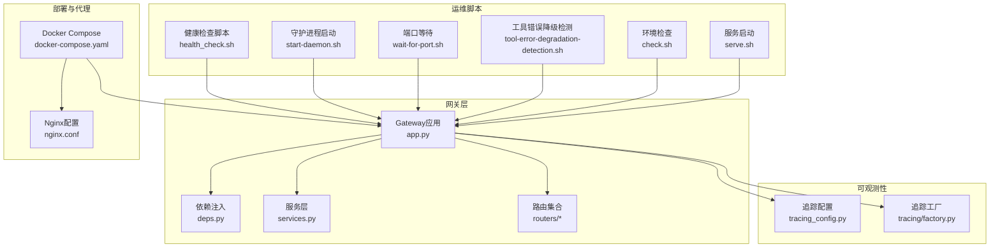
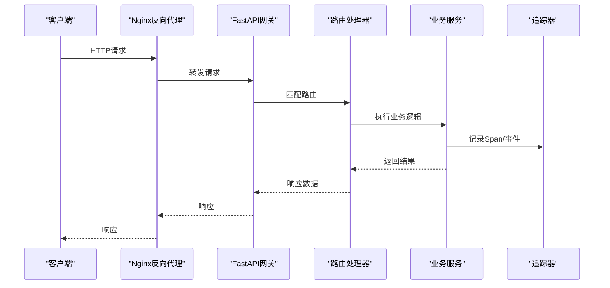
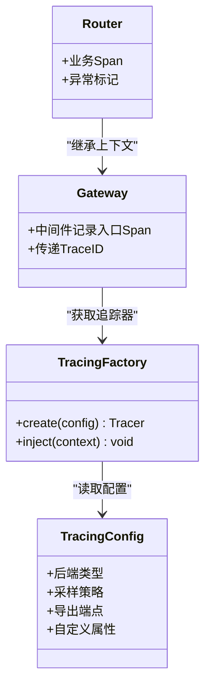
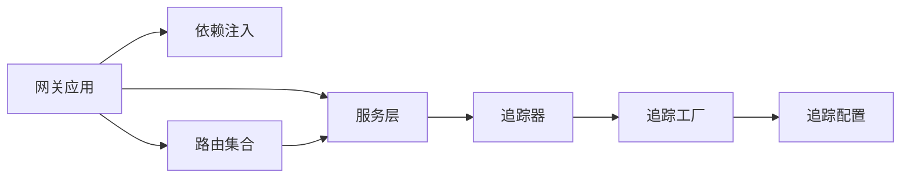

# 监控和运维

<cite>
**本文引用的文件**   
- [backend/app/gateway/app.py](file://backend/app/gateway/app.py)
- [backend/app/gateway/config.py](file://backend/app/gateway/config.py)
- [backend/app/gateway/deps.py](file://backend/app/gateway/deps.py)
- [backend/app/gateway/services.py](file://backend/app/gateway/services.py)
- [backend/app/gateway/routers/agents.py](file://backend/app/gateway/routers/agents.py)
- [backend/app/gateway/routers/runs.py](file://backend/app/gateway/routers/runs.py)
- [backend/app/gateway/routers/threads.py](file://backend/app/gateway/routers/threads.py)
- [backend/app/gateway/routers/artifacts.py](file://backend/app/gateway/routers/artifacts.py)
- [backend/app/gateway/routers/uploads.py](file://backend/app/gateway/routers/uploads.py)
- [backend/app/gateway/routers/mcp.py](file://backend/app/gateway/routers/mcp.py)
- [backend/app/gateway/routers/suggestions.py](file://backend/app/gateway/routers/suggestions.py)
- [backend/app/gateway/routers/models.py](file://backend/app/gateway/routers/models.py)
- [backend/app/gateway/routers/channels.py](file://backend/app/gateway/routers/channels.py)
- [backend/app/gateway/routers/memory.py](file://backend/app/gateway/routers/memory.py)
- [backend/app/gateway/routers/thread_runs.py](file://backend/app/gateway/routers/thread_runs.py)
- [backend/app/gateway/routers/skills.py](file://backend/app/gateway/routers/skills.py)
- [backend/packages/harness/deerflow/config/tracing_config.py](file://backend/packages/harness/deerflow/config/tracing_config.py)
- [backend/packages/harness/deerflow/tracing/factory.py](file://backend/packages/harness/deerflow/tracing/factory.py)
- [docker/docker-compose.yaml](file://docker/docker-compose.yaml)
- [docker/nginx/nginx.conf](file://docker/nginx/nginx.conf)
- [.agent/skills/smoke-test/scripts/health_check.sh](file://.agent/skills/smoke-test/scripts/health_check.sh)
- [scripts/start-daemon.sh](file://scripts/start-daemon.sh)
- [scripts/wait-for-port.sh](file://scripts/wait-for-port.sh)
- [scripts/tool-error-degradation-detection.sh](file://scripts/tool-error-degradation-detection.sh)
- [scripts/check.sh](file://scripts/check.sh)
- [scripts/serve.sh](file://scripts/serve.sh)
- [backend/docs/ARCHITECTURE.md](file://backend/docs/ARCHITECTURE.md)
- [backend/docs/STREAMING.md](file://backend/docs/STREAMING.md)
- [backend/docs/MEMORY_SETTINGS_REVIEW.md](file://backend/docs/MEMORY_SETTINGS_REVIEW.md)
- [backend/tests/test_tracing_config.py](file://backend/tests/test_tracing_config.py)
- [backend/tests/test_tracing_factory.py](file://backend/tests/test_tracing_factory.py)
</cite>

## 目录
1. [简介](#简介)
2. [项目结构](#项目结构)
3. [核心组件](#核心组件)
4. [架构总览](#架构总览)
5. [详细组件分析](#详细组件分析)
6. [依赖关系分析](#依赖关系分析)
7. [性能考虑](#性能考虑)
8. [故障排查指南](#故障排查指南)
9. [结论](#结论)
10. [附录](#附录)

## 简介
本章节面向DeerFlow的运维与监控，聚焦以下目标：
- 日志收集与分析：结构化日志格式、级别配置与轮转策略
- 性能监控指标：CPU、内存、磁盘、网络等资源使用情况的采集与展示
- 健康检查接口：实现方式与告警配置建议
- 分布式追踪：链路追踪、性能分析与故障定位
- 部署监控方案：Prometheus、Grafana等工具集成
- 备份恢复与数据迁移：策略与方法
- 故障排查与常见问题：快速定位与解决
- 运维自动化脚本与最佳实践

## 项目结构
后端采用FastAPI网关（Gateway）组织路由与服务，Tracing通过配置工厂进行初始化；前端为Next.js应用；容器编排使用Docker Compose，Nginx作为反向代理。

图表来源
- [backend/app/gateway/app.py](file://backend/app/gateway/app.py)
- [backend/app/gateway/deps.py](file://backend/app/gateway/deps.py)
- [backend/app/gateway/services.py](file://backend/app/gateway/services.py)
- [backend/app/gateway/routers/agents.py](file://backend/app/gateway/routers/agents.py)
- [backend/app/gateway/routers/runs.py](file://backend/app/gateway/routers/runs.py)
- [backend/app/gateway/routers/threads.py](file://backend/app/gateway/routers/threads.py)
- [backend/app/gateway/routers/artifacts.py](file://backend/app/gateway/routers/artifacts.py)
- [backend/app/gateway/routers/uploads.py](file://backend/app/gateway/routers/uploads.py)
- [backend/app/gateway/routers/mcp.py](file://backend/app/gateway/routers/mcp.py)
- [backend/app/gateway/routers/suggestions.py](file://backend/app/gateway/routers/suggestions.py)
- [backend/app/gateway/routers/models.py](file://backend/app/gateway/routers/models.py)
- [backend/app/gateway/routers/channels.py](file://backend/app/gateway/routers/channels.py)
- [backend/app/gateway/routers/memory.py](file://backend/app/gateway/routers/memory.py)
- [backend/app/gateway/routers/thread_runs.py](file://backend/app/gateway/routers/thread_runs.py)
- [backend/app/gateway/routers/skills.py](file://backend/app/gateway/routers/skills.py)
- [backend/packages/harness/deerflow/config/tracing_config.py](file://backend/packages/harness/deerflow/config/tracing_config.py)
- [backend/packages/harness/deerflow/tracing/factory.py](file://backend/packages/harness/deerflow/tracing/factory.py)
- [docker/docker-compose.yaml](file://docker/docker-compose.yaml)
- [docker/nginx/nginx.conf](file://docker/nginx/nginx.conf)
- [.agent/skills/smoke-test/scripts/health_check.sh](file://.agent/skills/smoke-test/scripts/health_check.sh)
- [scripts/start-daemon.sh](file://scripts/start-daemon.sh)
- [scripts/wait-for-port.sh](file://scripts/wait-for-port.sh)
- [scripts/tool-error-degradation-detection.sh](file://scripts/tool-error-degradation-detection.sh)
- [scripts/check.sh](file://scripts/check.sh)
- [scripts/serve.sh](file://scripts/serve.sh)

章节来源
- [backend/app/gateway/app.py](file://backend/app/gateway/app.py)
- [backend/app/gateway/deps.py](file://backend/app/gateway/deps.py)
- [backend/app/gateway/services.py](file://backend/app/gateway/services.py)
- [backend/packages/harness/deerflow/config/tracing_config.py](file://backend/packages/harness/deerflow/config/tracing_config.py)
- [backend/packages/harness/deerflow/tracing/factory.py](file://backend/packages/harness/deerflow/tracing/factory.py)
- [docker/docker-compose.yaml](file://docker/docker-compose.yaml)
- [docker/nginx/nginx.conf](file://docker/nginx/nginx.conf)

## 核心组件
- 网关应用与中间件：负责请求生命周期管理、跨域、压缩、超时、限流、访问日志、异常处理、健康检查等
- 路由层：按功能划分（Agent、Run、Thread、Artifact、Upload、MCP、Suggestion、Model、Channel、Memory、Skill等）
- 依赖注入：统一提供数据库、缓存、外部客户端、追踪实例等
- 追踪系统：基于配置的工厂模式创建并注入追踪器，支持多后端
- 部署与代理：Docker Compose编排，Nginx反向代理与静态资源加速
- 运维脚本：健康检查、守护进程、端口等待、错误降级检测、环境检查、服务启动

章节来源
- [backend/app/gateway/app.py](file://backend/app/gateway/app.py)
- [backend/app/gateway/deps.py](file://backend/app/gateway/deps.py)
- [backend/app/gateway/services.py](file://backend/app/gateway/services.py)
- [backend/packages/harness/deerflow/config/tracing_config.py](file://backend/packages/harness/deerflow/config/tracing_config.py)
- [backend/packages/harness/deerflow/tracing/factory.py](file://backend/packages/harness/deerflow/tracing/factory.py)
- [docker/docker-compose.yaml](file://docker/docker-compose.yaml)
- [docker/nginx/nginx.conf](file://docker/nginx/nginx.conf)

## 架构总览
下图展示了从客户端到网关、路由、服务与追踪系统的整体交互，以及Nginx与Compose在部署中的作用。

图表来源
- [docker/nginx/nginx.conf](file://docker/nginx/nginx.conf)
- [backend/app/gateway/app.py](file://backend/app/gateway/app.py)
- [backend/app/gateway/routers/agents.py](file://backend/app/gateway/routers/agents.py)
- [backend/app/gateway/routers/runs.py](file://backend/app/gateway/routers/runs.py)
- [backend/app/gateway/routers/threads.py](file://backend/app/gateway/routers/threads.py)
- [backend/packages/harness/deerflow/tracing/factory.py](file://backend/packages/harness/deerflow/tracing/factory.py)

## 详细组件分析

### 日志收集与分析
- 结构化日志格式
  - 建议在网关中间件中统一输出JSON格式，包含字段：时间戳、级别、模块、请求ID、用户标识、方法、路径、状态码、耗时、错误信息、追踪ID等
  - 将HTTP访问日志与业务日志分离，便于分别接入不同存储与检索引擎
- 日志级别配置
  - 开发环境：DEBUG/INFO，便于调试
  - 预发/生产：INFO/WARN/ERROR，降低噪音
  - 关键路径（模型调用、工具执行、持久化）使用WARN/ERROR，并附带上下文
- 日志轮转策略
  - 按大小或时间切分，保留周期根据合规要求设置
  - 对大体积日志（如上传、流式输出）单独归档
  - 结合容器日志驱动（json-file）或外部日志采集（Filebeat/Fluent Bit）集中收集
- 接入建议
  - 将结构化日志输出至标准输出，由容器运行时统一收集
  - 对接ELK/Loki等日志平台，建立索引与告警规则

章节来源
- [backend/app/gateway/app.py](file://backend/app/gateway/app.py)
- [backend/docs/STREAMING.md](file://backend/docs/STREAMING.md)

### 性能监控指标
- 指标分类
  - 资源类：CPU、内存、磁盘I/O、网络带宽、连接数
  - 应用类：QPS、延迟分布（P50/P95/P99）、错误率、线程池/队列长度、GC停顿
  - 业务类：Agent运行时长、工具调用次数、模型Token用量、上传文件大小与成功率
- 采集方式
  - 进程级指标：Python内置统计与第三方库（如psutil）暴露
  - 容器指标：Docker Stats或cAdvisor导出
  - 外部依赖：数据库、缓存、对象存储的监控
- 展示与告警
  - Prometheus抓取指标，Grafana可视化
  - 针对关键阈值（错误率、延迟、资源占用）配置告警规则

章节来源
- [backend/docs/ARCHITECTURE.md](file://backend/docs/ARCHITECTURE.md)

### 健康检查接口
- 实现要点
  - 提供轻量GET接口，返回服务状态、依赖可用性（数据库、缓存、外部服务）
  - 区分存活探针（Liveness）与就绪探针（Readiness），前者关注进程是否存活，后者关注依赖是否可用
- 监控与告警
  - 编排层周期性调用健康接口，失败触发重启或摘除流量
  - 对外暴露只读状态，避免泄露敏感信息

章节来源
- [.agent/skills/smoke-test/scripts/health_check.sh](file://.agent/skills/smoke-test/scripts/health_check.sh)

### 分布式追踪系统
- 配置与工厂
  - 通过追踪配置加载后端（如OpenTelemetry、Jaeger、Langfuse等）
  - 工厂模式创建追踪器实例，并在网关或服务中注入
- 链路追踪
  - 在网关入口生成TraceID，贯穿路由与服务调用
  - 在关键节点（模型调用、工具执行、持久化）记录Span与属性
- 性能分析与故障定位
  - 聚合各Span耗时，识别慢调用链
  - 关联日志与追踪ID，快速定位问题根因

图表来源
- [backend/packages/harness/deerflow/config/tracing_config.py](file://backend/packages/harness/deerflow/config/tracing_config.py)
- [backend/packages/harness/deerflow/tracing/factory.py](file://backend/packages/harness/deerflow/tracing/factory.py)
- [backend/app/gateway/app.py](file://backend/app/gateway/app.py)
- [backend/app/gateway/routers/agents.py](file://backend/app/gateway/routers/agents.py)
- [backend/app/gateway/routers/runs.py](file://backend/app/gateway/routers/runs.py)
- [backend/app/gateway/routers/threads.py](file://backend/app/gateway/routers/threads.py)

章节来源
- [backend/packages/harness/deerflow/config/tracing_config.py](file://backend/packages/harness/deerflow/config/tracing_config.py)
- [backend/packages/harness/deerflow/tracing/factory.py](file://backend/packages/harness/deerflow/tracing/factory.py)
- [backend/tests/test_tracing_config.py](file://backend/tests/test_tracing_config.py)
- [backend/tests/test_tracing_factory.py](file://backend/tests/test_tracing_factory.py)

### 部署监控方案（Prometheus/Grafana）
- 指标暴露
  - 在网关或服务中暴露Prometheus指标端点
  - 使用容器侧边车或独立Exporter采集系统与应用指标
- 抓取与存储
  - Prometheus定期抓取指标，持久化存储
- 可视化与告警
  - Grafana构建仪表盘，展示资源、延迟、错误率、业务指标
  - 配置Alertmanager发送告警通知（邮件、IM等）

章节来源
- [docker/docker-compose.yaml](file://docker/docker-compose.yaml)
- [docker/nginx/nginx.conf](file://docker/nginx/nginx.conf)

### 备份恢复策略与数据迁移
- 备份范围
  - 数据库快照、对象存储中的上传文件、会话与检查点、配置与密钥
- 恢复流程
  - 先恢复配置与密钥，再恢复数据，最后验证健康检查与关键接口
- 数据迁移
  - 版本兼容的迁移脚本，灰度发布与回滚策略
  - 迁移前后一致性校验与回退预案

章节来源
- [backend/docs/MEMORY_SETTINGS_REVIEW.md](file://backend/docs/MEMORY_SETTINGS_REVIEW.md)

### 运维自动化脚本与最佳实践
- 健康检查脚本：周期性探测服务可用性
- 守护进程启动：确保服务崩溃后自动重启
- 端口等待：依赖服务就绪后再启动主服务
- 工具错误降级检测：监控工具调用失败率并触发降级
- 环境检查：启动前校验依赖与配置
- 服务启动：标准化启动流程与环境变量注入

章节来源
- [.agent/skills/smoke-test/scripts/health_check.sh](file://.agent/skills/smoke-test/scripts/health_check.sh)
- [scripts/start-daemon.sh](file://scripts/start-daemon.sh)
- [scripts/wait-for-port.sh](file://scripts/wait-for-port.sh)
- [scripts/tool-error-degradation-detection.sh](file://scripts/tool-error-degradation-detection.sh)
- [scripts/check.sh](file://scripts/check.sh)
- [scripts/serve.sh](file://scripts/serve.sh)

## 依赖关系分析
- 组件耦合
  - 网关依赖路由与服务，服务依赖追踪器与外部客户端
  - 追踪器通过工厂创建，配置集中管理
- 外部依赖
  - Nginx反向代理、Docker Compose编排、可能的日志与追踪后端
- 潜在循环依赖
  - 路由与服务之间应避免直接相互引用，通过依赖注入解耦

图表来源
- [backend/app/gateway/app.py](file://backend/app/gateway/app.py)
- [backend/app/gateway/deps.py](file://backend/app/gateway/deps.py)
- [backend/app/gateway/services.py](file://backend/app/gateway/services.py)
- [backend/packages/harness/deerflow/config/tracing_config.py](file://backend/packages/harness/deerflow/config/tracing_config.py)
- [backend/packages/harness/deerflow/tracing/factory.py](file://backend/packages/harness/deerflow/tracing/factory.py)

章节来源
- [backend/app/gateway/app.py](file://backend/app/gateway/app.py)
- [backend/app/gateway/deps.py](file://backend/app/gateway/deps.py)
- [backend/app/gateway/services.py](file://backend/app/gateway/services.py)
- [backend/packages/harness/deerflow/config/tracing_config.py](file://backend/packages/harness/deerflow/config/tracing_config.py)
- [backend/packages/harness/deerflow/tracing/factory.py](file://backend/packages/harness/deerflow/tracing/factory.py)

## 性能考虑
- 网关层
  - 启用压缩、合理设置超时与并发限制
  - 使用连接池与缓存减少外部依赖压力
- 追踪开销
  - 调整采样率，避免高负载下追踪带来的额外开销
  - 仅对关键路径记录详细Span
- 资源隔离
  - 容器资源限制与配额，防止单实例影响整体稳定性
- 水平扩展
  - 无状态设计，配合负载均衡横向扩展

[本节为通用指导，不直接分析具体文件]

## 故障排查指南
- 快速定位
  - 通过健康检查脚本确认服务状态
  - 查看网关访问日志与错误日志，结合追踪ID定位链路
- 常见现象
  - 高延迟：检查模型调用与工具执行耗时，查看追踪Span
  - 错误率上升：关注工具错误降级检测脚本的输出与告警
  - 资源耗尽：检查容器资源使用与连接数
- 处置步骤
  - 临时扩容或降级非关键功能
  - 清理过期数据与临时文件
  - 重启受影响的实例或滚动更新

章节来源
- [.agent/skills/smoke-test/scripts/health_check.sh](file://.agent/skills/smoke-test/scripts/health_check.sh)
- [scripts/tool-error-degradation-detection.sh](file://scripts/tool-error-degradation-detection.sh)
- [backend/docs/STREAMING.md](file://backend/docs/STREAMING.md)

## 结论
通过对网关、路由、服务与追踪系统的梳理，结合部署与运维脚本，可以构建完善的监控与运维体系。建议优先落地结构化日志、健康检查与分布式追踪，逐步完善指标采集与可视化，形成闭环的故障发现与定位能力。

[本节为总结性内容，不直接分析具体文件]

## 附录
- 参考文档
  - 架构说明：[backend/docs/ARCHITECTURE.md](file://backend/docs/ARCHITECTURE.md)
  - 流式输出说明：[backend/docs/STREAMING.md](file://backend/docs/STREAMING.md)
  - 记忆设置回顾：[backend/docs/MEMORY_SETTINGS_REVIEW.md](file://backend/docs/MEMORY_SETTINGS_REVIEW.md)
- 测试用例
  - 追踪配置测试：[backend/tests/test_tracing_config.py](file://backend/tests/test_tracing_config.py)
  - 追踪工厂测试：[backend/tests/test_tracing_factory.py](file://backend/tests/test_tracing_factory.py)