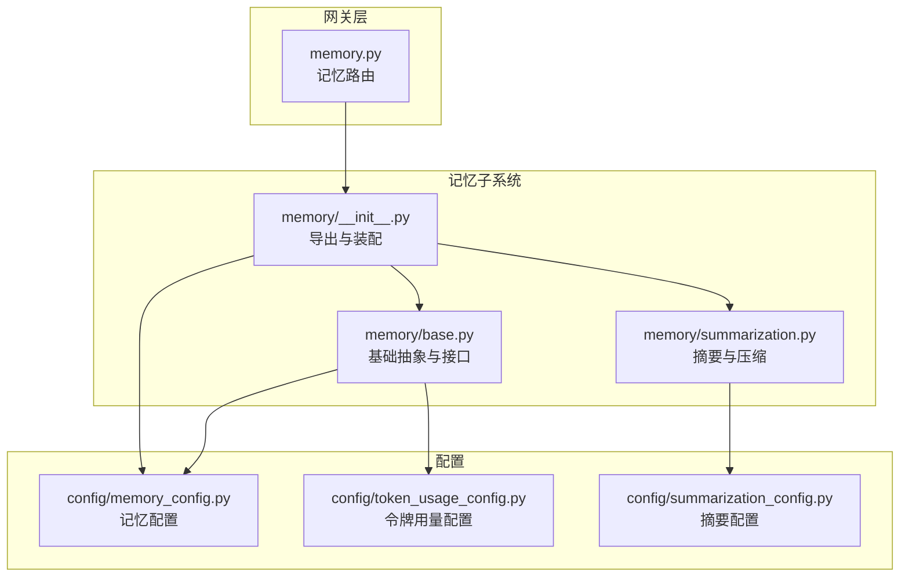
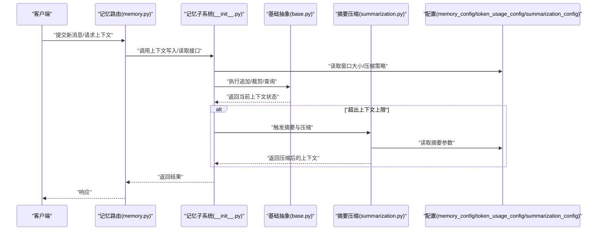
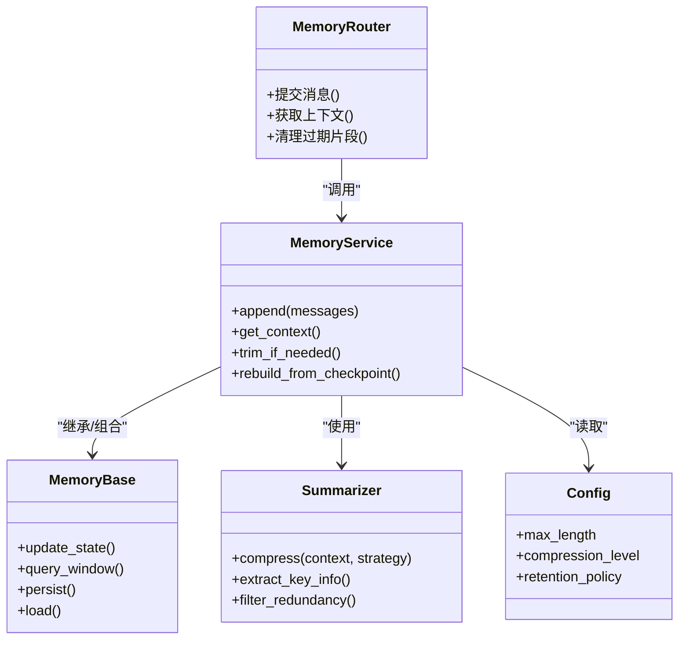
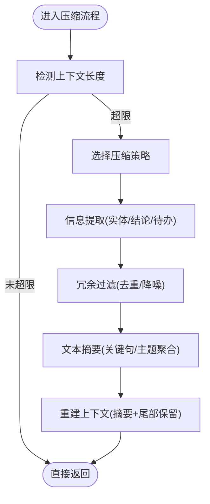
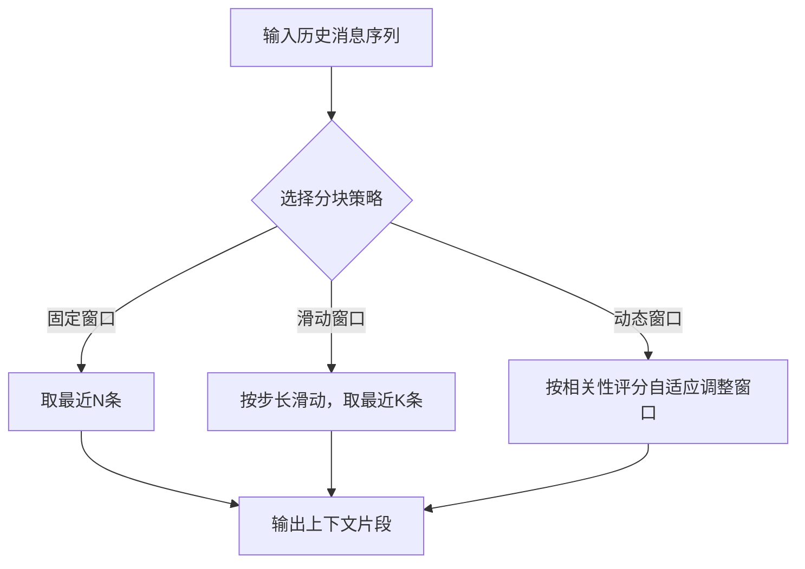
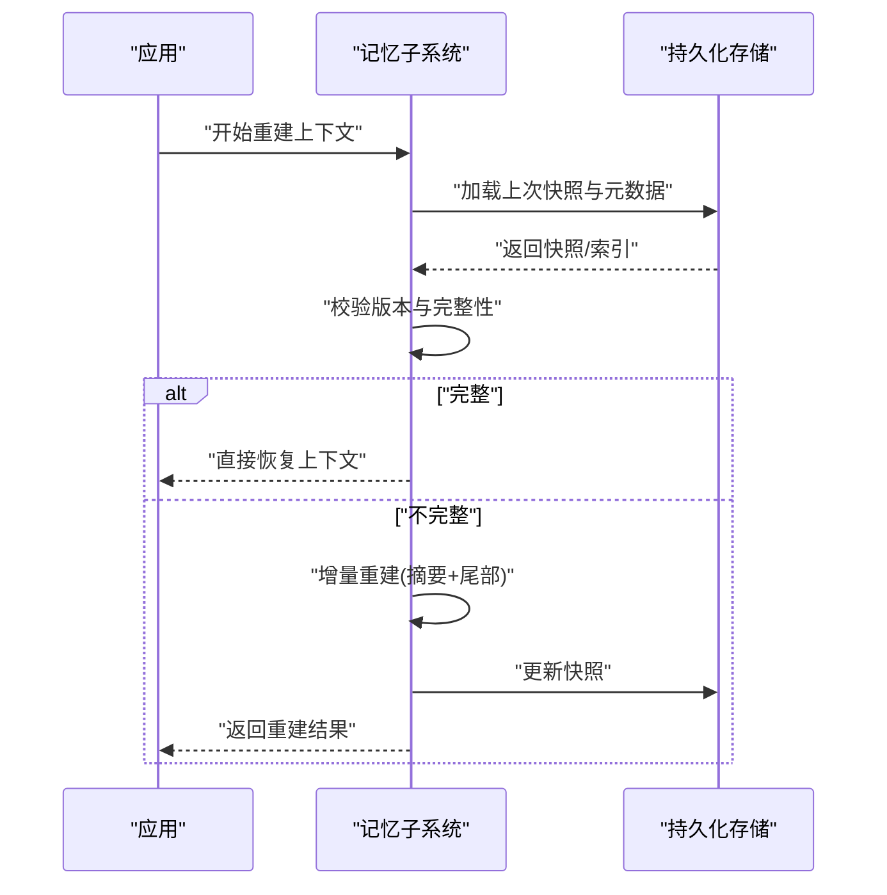
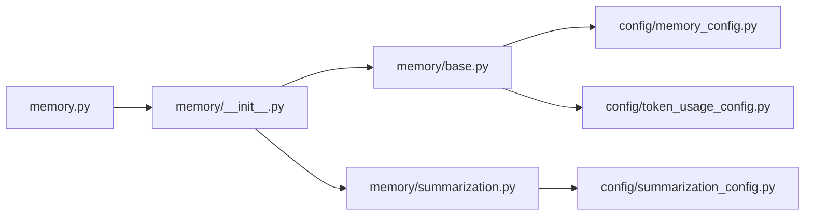

# 上下文窗口管理

<cite>
**本文引用的文件**
- [backend/app/gateway/routers/memory.py](file://backend/app/gateway/routers/memory.py)
- [backend/packages/harness/deerflow/agents/memory/__init__.py](file://backend/packages/harness/deerflow/agents/memory/__init__.py)
- [backend/packages/harness/deerflow/agents/memory/base.py](file://backend/packages/harness/deerflow/agents/memory/base.py)
- [backend/packages/harness/deerflow/agents/memory/summarization.py](file://backend/packages/harness/deerflow/agents/memory/summarization.py)
- [backend/packages/harness/deerflow/config/memory_config.py](file://backend/packages/harness/deerflow/config/memory_config.py)
- [backend/packages/harness/deerflow/config/token_usage_config.py](file://backend/packages/harness/deerflow/config/token_usage_config.py)
- [backend/packages/harness/deerflow/config/summarization_config.py](file://backend/packages/harness/deerflow/config/summarization_config.py)
- [backend/docs/MEMORY_IMPROVEMENTS.md](file://backend/docs/MEMORY_IMPROVEMENTS.md)
- [backend/docs/MEMORY_SETTINGS_REVIEW.md](file://backend/docs/MEMORY_SETTINGS_REVIEW.md)
- [backend/docs/summarization.md](file://backend/docs/summarization.md)
</cite>

## 目录
1. [简介](#简介)
2. [项目结构](#项目结构)
3. [核心组件](#核心组件)
4. [架构总览](#架构总览)
5. [详细组件分析](#详细组件分析)
6. [依赖关系分析](#依赖关系分析)
7. [性能考量](#性能考量)
8. [故障排查指南](#故障排查指南)
9. [结论](#结论)
10. [附录](#附录)

## 简介
本文件围绕“上下文窗口管理”展开，聚焦于如何在长对话与复杂任务中，通过压缩、分块、重建与恢复等手段，将历史消息控制在模型上下文长度限制内，同时尽可能保留关键信息。文档涵盖：
- 上下文窗口的概念与重要性（token限制、上下文长度约束）
- 上下文压缩算法（文本摘要、信息提取、冗余过滤）
- 重要信息识别机制（关键词提取、语义分析、相关性评分）
- 上下文分块策略（滑动窗口、固定窗口、动态窗口）
- 上下文重建与恢复（断点续传、状态同步）
- 配置项说明（最大长度、压缩级别、保留策略）
- 使用场景最佳实践（长对话、复杂任务分解、多轮推理优化）

## 项目结构
与上下文窗口管理相关的后端实现主要位于以下位置：
- 网关路由层：提供记忆/上下文相关API入口
- 记忆子系统：封装上下文窗口管理、压缩、分块、重建等能力
- 配置模块：集中定义上下文长度、压缩策略、令牌用量等参数
- 文档：记录改进思路与使用说明

图表来源
- [backend/app/gateway/routers/memory.py](file://backend/app/gateway/routers/memory.py)
- [backend/packages/harness/deerflow/agents/memory/__init__.py](file://backend/packages/harness/deerflow/agents/memory/__init__.py)
- [backend/packages/harness/deerflow/agents/memory/base.py](file://backend/packages/harness/deerflow/agents/memory/base.py)
- [backend/packages/harness/deerflow/agents/memory/summarization.py](file://backend/packages/harness/deerflow/agents/memory/summarization.py)
- [backend/packages/harness/deerflow/config/memory_config.py](file://backend/packages/harness/deerflow/config/memory_config.py)
- [backend/packages/harness/deerflow/config/token_usage_config.py](file://backend/packages/harness/deerflow/config/token_usage_config.py)
- [backend/packages/harness/deerflow/config/summarization_config.py](file://backend/packages/harness/deerflow/config/summarization_config.py)

章节来源
- [backend/app/gateway/routers/memory.py](file://backend/app/gateway/routers/memory.py)
- [backend/packages/harness/deerflow/agents/memory/__init__.py](file://backend/packages/harness/deerflow/agents/memory/__init__.py)
- [backend/packages/harness/deerflow/agents/memory/base.py](file://backend/packages/harness/deerflow/agents/memory/base.py)
- [backend/packages/harness/deerflow/agents/memory/summarization.py](file://backend/packages/harness/deerflow/agents/memory/summarization.py)
- [backend/packages/harness/deerflow/config/memory_config.py](file://backend/packages/harness/deerflow/config/memory_config.py)
- [backend/packages/harness/deerflow/config/token_usage_config.py](file://backend/packages/harness/deerflow/config/token_usage_config.py)
- [backend/packages/harness/deerflow/config/summarization_config.py](file://backend/packages/harness/deerflow/config/summarization_config.py)

## 核心组件
- 记忆路由（Gateway Router）
  - 职责：暴露上下文/记忆相关HTTP接口，接收请求并委派给记忆子系统处理。
  - 关键点：统一鉴权、参数校验、错误码映射、流式响应支持（如适用）。
- 记忆子系统（Memory Subsystem）
  - 基础抽象（base）：定义上下文窗口操作接口（追加、裁剪、查询、重建、持久化等）。
  - 摘要与压缩（summarization）：在接近或超过上下文上限时触发压缩，生成摘要以替换旧片段。
  - 装配与导出（__init__）：组合各子模块，提供对外服务类。
- 配置模块（Config）
  - memory_config：上下文窗口大小、保留策略、滚动窗口步长等。
  - token_usage_config：模型token统计、配额与告警阈值。
  - summarization_config：摘要粒度、压缩级别、是否启用、回退策略。

章节来源
- [backend/app/gateway/routers/memory.py](file://backend/app/gateway/routers/memory.py)
- [backend/packages/harness/deerflow/agents/memory/__init__.py](file://backend/packages/harness/deerflow/agents/memory/__init__.py)
- [backend/packages/harness/deerflow/agents/memory/base.py](file://backend/packages/harness/deerflow/agents/memory/base.py)
- [backend/packages/harness/deerflow/agents/memory/summarization.py](file://backend/packages/harness/deerflow/agents/memory/summarization.py)
- [backend/packages/harness/deerflow/config/memory_config.py](file://backend/packages/harness/deerflow/config/memory_config.py)
- [backend/packages/harness/deerflow/config/token_usage_config.py](file://backend/packages/harness/deerflow/config/token_usage_config.py)
- [backend/packages/harness/deerflow/config/summarization_config.py](file://backend/packages/harness/deerflow/config/summarization_config.py)

## 架构总览
下图展示了从网关到记忆子系统再到配置的调用链路，以及上下文窗口管理的核心流程。

图表来源
- [backend/app/gateway/routers/memory.py](file://backend/app/gateway/routers/memory.py)
- [backend/packages/harness/deerflow/agents/memory/__init__.py](file://backend/packages/harness/deerflow/agents/memory/__init__.py)
- [backend/packages/harness/deerflow/agents/memory/base.py](file://backend/packages/harness/deerflow/agents/memory/base.py)
- [backend/packages/harness/deerflow/agents/memory/summarization.py](file://backend/packages/harness/deerflow/agents/memory/summarization.py)
- [backend/packages/harness/deerflow/config/memory_config.py](file://backend/packages/harness/deerflow/config/memory_config.py)
- [backend/packages/harness/deerflow/config/token_usage_config.py](file://backend/packages/harness/deerflow/config/token_usage_config.py)
- [backend/packages/harness/deerflow/config/summarization_config.py](file://backend/packages/harness/deerflow/config/summarization_config.py)

## 详细组件分析

### 记忆子系统（Memory Subsystem）
- 设计要点
  - 分层清晰：路由层仅负责协议与编排，业务逻辑下沉至记忆子系统。
  - 可插拔：通过配置切换不同压缩策略与窗口算法。
  - 可扩展：新增分块策略或摘要方法无需改动上层路由。
- 关键流程
  - 写入路径：接收消息 -> 计算预估token -> 判断是否超限 -> 若超限则触发压缩 -> 更新上下文 -> 持久化/缓存。
  - 读取路径：按策略选择最近N条或摘要+尾段 -> 组装提示词 -> 返回。
- 异常与降级
  - 压缩失败：回退为固定窗口裁剪。
  - 配置缺失：采用默认窗口大小与压缩级别。

图表来源
- [backend/packages/harness/deerflow/agents/memory/__init__.py](file://backend/packages/harness/deerflow/agents/memory/__init__.py)
- [backend/packages/harness/deerflow/agents/memory/base.py](file://backend/packages/harness/deerflow/agents/memory/base.py)
- [backend/packages/harness/deerflow/agents/memory/summarization.py](file://backend/packages/harness/deerflow/agents/memory/summarization.py)
- [backend/packages/harness/deerflow/config/memory_config.py](file://backend/packages/harness/deerflow/config/memory_config.py)

章节来源
- [backend/packages/harness/deerflow/agents/memory/__init__.py](file://backend/packages/harness/deerflow/agents/memory/__init__.py)
- [backend/packages/harness/deerflow/agents/memory/base.py](file://backend/packages/harness/deerflow/agents/memory/base.py)
- [backend/packages/harness/deerflow/agents/memory/summarization.py](file://backend/packages/harness/deerflow/agents/memory/summarization.py)
- [backend/packages/harness/deerflow/config/memory_config.py](file://backend/packages/harness/deerflow/config/memory_config.py)

### 上下文压缩算法（摘要、信息提取、冗余过滤）
- 文本摘要
  - 目标：用更短的表述保留原意，降低后续token消耗。
  - 策略：按时间衰减权重、主题聚类、关键句抽取。
- 信息提取
  - 目标：从长段落中提取实体、决策、结论、待办等结构化信息。
  - 输出：键值对或轻量JSON片段，便于后续检索与重建。
- 冗余内容过滤
  - 目标：去除重复、寒暄、无关背景，提升信噪比。
  - 方法：相似度去重、停用词过滤、主题一致性检查。

图表来源
- [backend/packages/harness/deerflow/agents/memory/summarization.py](file://backend/packages/harness/deerflow/agents/memory/summarization.py)
- [backend/packages/harness/deerflow/config/summarization_config.py](file://backend/packages/harness/deerflow/config/summarization_config.py)

章节来源
- [backend/packages/harness/deerflow/agents/memory/summarization.py](file://backend/packages/harness/deerflow/agents/memory/summarization.py)
- [backend/packages/harness/deerflow/config/summarization_config.py](file://backend/packages/harness/deerflow/config/summarization_config.py)

### 重要信息识别机制（关键词、语义分析、相关性评分）
- 关键词提取
  - 基于词频/TF-IDF或领域词典，结合用户意图进行加权。
- 语义分析
  - 利用嵌入向量或轻量分类器，识别主题漂移与关键转折。
- 相关性评分
  - 将当前问题与历史片段做相似度匹配，优先保留高相关片段。
- 应用方式
  - 在压缩前对片段打分，决定保留比例与摘要粒度。
  - 在重建阶段按分数排序拼接，确保关键信息不丢失。

章节来源
- [backend/packages/harness/deerflow/agents/memory/summarization.py](file://backend/packages/harness/deerflow/agents/memory/summarization.py)
- [backend/packages/harness/deerflow/config/memory_config.py](file://backend/packages/harness/deerflow/config/memory_config.py)

### 上下文分块策略（滑动窗口、固定窗口、动态窗口）
- 固定窗口
  - 规则：始终保留最近N条消息。
  - 优点：简单稳定；缺点：可能丢失早期关键信息。
- 滑动窗口
  - 规则：每次移动固定步长，保留最近K条。
  - 优点：平滑过渡；缺点：仍可能遗漏重要早期信息。
- 动态窗口
  - 规则：根据相关性评分与主题变化自适应调整窗口大小。
  - 优点：兼顾时效性与重要性；缺点：计算开销较高。

图表来源
- [backend/packages/harness/deerflow/agents/memory/base.py](file://backend/packages/harness/deerflow/agents/memory/base.py)
- [backend/packages/harness/deerflow/config/memory_config.py](file://backend/packages/harness/deerflow/config/memory_config.py)

章节来源
- [backend/packages/harness/deerflow/agents/memory/base.py](file://backend/packages/harness/deerflow/agents/memory/base.py)
- [backend/packages/harness/deerflow/config/memory_config.py](file://backend/packages/harness/deerflow/config/memory_config.py)

### 上下文重建与恢复（断点续传、状态同步）
- 断点续传
  - 在压缩或分块过程中保存中间状态（如摘要草稿、索引），以便中断后继续。
- 状态同步
  - 将上下文快照与元数据（时间戳、版本、压缩标记）持久化，重启后可恢复。
- 一致性保障
  - 使用幂等操作与版本号控制，避免重复压缩或覆盖。

图表来源
- [backend/packages/harness/deerflow/agents/memory/base.py](file://backend/packages/harness/deerflow/agents/memory/base.py)
- [backend/packages/harness/deerflow/agents/memory/summarization.py](file://backend/packages/harness/deerflow/agents/memory/summarization.py)

章节来源
- [backend/packages/harness/deerflow/agents/memory/base.py](file://backend/packages/harness/deerflow/agents/memory/base.py)
- [backend/packages/harness/deerflow/agents/memory/summarization.py](file://backend/packages/harness/deerflow/agents/memory/summarization.py)

### 配置选项（最大长度、压缩级别、保留策略）
- 最大长度
  - 描述：上下文窗口最大token数或消息条数。
  - 影响：触发压缩的阈值与分块策略的选择。
- 压缩级别
  - 描述：摘要强度与冗余过滤力度。
  - 影响：压缩耗时与信息保留度之间的权衡。
- 保留策略
  - 描述：固定/滑动/动态窗口策略及步长、窗口大小。
  - 影响：上下文的历史覆盖范围与关键信息命中率。
- 令牌用量配置
  - 描述：统计与配额控制，用于监控与告警。

章节来源
- [backend/packages/harness/deerflow/config/memory_config.py](file://backend/packages/harness/deerflow/config/memory_config.py)
- [backend/packages/harness/deerflow/config/token_usage_config.py](file://backend/packages/harness/deerflow/config/token_usage_config.py)
- [backend/packages/harness/deerflow/config/summarization_config.py](file://backend/packages/harness/deerflow/config/summarization_config.py)

### 使用场景最佳实践
- 长对话处理
  - 建议：启用动态窗口+中等压缩级别；定期保存快照；关注令牌用量告警。
- 复杂任务分解
  - 建议：在子任务边界处强制压缩；提取任务状态与结论作为结构化片段；重建时优先保留计划与里程碑。
- 多轮推理优化
  - 建议：提高相关性评分权重；对关键假设与证据进行显式标注；压缩时保留推理链的关键节点。

章节来源
- [backend/docs/MEMORY_IMPROVEMENTS.md](file://backend/docs/MEMORY_IMPROVEMENTS.md)
- [backend/docs/MEMORY_SETTINGS_REVIEW.md](file://backend/docs/MEMORY_SETTINGS_REVIEW.md)
- [backend/docs/summarization.md](file://backend/docs/summarization.md)

## 依赖关系分析
- 组件耦合
  - 路由层仅依赖记忆子系统接口，低耦合易替换。
  - 记忆子系统依赖配置模块，策略可热切换。
- 外部依赖
  - 模型提供方（OpenAI/Claude等）的token计数与上下文长度限制由配置与运行时环境共同决定。
- 潜在循环依赖
  - 当前结构无循环导入风险；若扩展需保持单向依赖（路由->记忆->配置）。

图表来源
- [backend/app/gateway/routers/memory.py](file://backend/app/gateway/routers/memory.py)
- [backend/packages/harness/deerflow/agents/memory/__init__.py](file://backend/packages/harness/deerflow/agents/memory/__init__.py)
- [backend/packages/harness/deerflow/agents/memory/base.py](file://backend/packages/harness/deerflow/agents/memory/base.py)
- [backend/packages/harness/deerflow/agents/memory/summarization.py](file://backend/packages/harness/deerflow/agents/memory/summarization.py)
- [backend/packages/harness/deerflow/config/memory_config.py](file://backend/packages/harness/deerflow/config/memory_config.py)
- [backend/packages/harness/deerflow/config/token_usage_config.py](file://backend/packages/harness/deerflow/config/token_usage_config.py)
- [backend/packages/harness/deerflow/config/summarization_config.py](file://backend/packages/harness/deerflow/config/summarization_config.py)

章节来源
- [backend/app/gateway/routers/memory.py](file://backend/app/gateway/routers/memory.py)
- [backend/packages/harness/deerflow/agents/memory/__init__.py](file://backend/packages/harness/deerflow/agents/memory/__init__.py)
- [backend/packages/harness/deerflow/agents/memory/base.py](file://backend/packages/harness/deerflow/agents/memory/base.py)
- [backend/packages/harness/deerflow/agents/memory/summarization.py](file://backend/packages/harness/deerflow/agents/memory/summarization.py)
- [backend/packages/harness/deerflow/config/memory_config.py](file://backend/packages/harness/deerflow/config/memory_config.py)
- [backend/packages/harness/deerflow/config/token_usage_config.py](file://backend/packages/harness/deerflow/config/token_usage_config.py)
- [backend/packages/harness/deerflow/config/summarization_config.py](file://backend/packages/harness/deerflow/config/summarization_config.py)

## 性能考量
- 压缩时机
  - 在写入路径中尽早检测长度，避免多次无效追加。
- 摘要成本
  - 动态窗口与深度摘要会增加CPU与I/O开销，应结合负载与延迟SLA调参。
- 缓存与复用
  - 对高频片段与摘要结果进行短期缓存，减少重复计算。
- 令牌统计
  - 实时统计token用量，设置阈值告警，防止超额消费。

[本节为通用指导，不涉及具体文件分析]

## 故障排查指南
- 常见问题
  - 上下文未压缩：检查最大长度配置与触发条件。
  - 摘要质量差：调整压缩级别与相关性评分权重。
  - 重建失败：确认快照完整性与版本号一致性。
- 定位步骤
  - 查看日志中的压缩与重建事件。
  - 核对配置项与实际运行参数是否一致。
  - 回放快照，验证重建前后上下文差异。

章节来源
- [backend/docs/MEMORY_IMPROVEMENTS.md](file://backend/docs/MEMORY_IMPROVEMENTS.md)
- [backend/docs/MEMORY_SETTINGS_REVIEW.md](file://backend/docs/MEMORY_SETTINGS_REVIEW.md)

## 结论
通过分层清晰的记忆子系统、可插拔的压缩与分块策略、完善的配置与监控，本项目实现了稳健的上下文窗口管理。合理选择策略与参数可在保证模型可用性的前提下，显著提升长对话与复杂任务的体验与效率。

[本节为总结性内容，不涉及具体文件分析]

## 附录
- 术语
  - 上下文窗口：模型一次推理可处理的token总量。
  - 压缩：在不显著损失信息的前提下缩短上下文长度。
  - 分块：将上下文切分为若干片段，按策略选取。
  - 重建：从快照与索引恢复上下文状态。

[本节为概念性内容，不涉及具体文件分析]