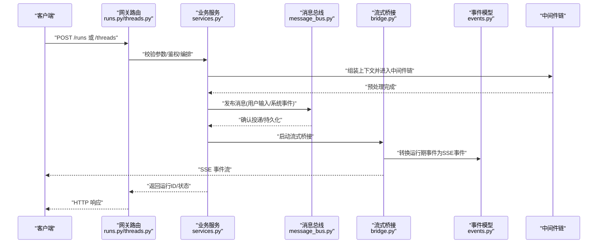
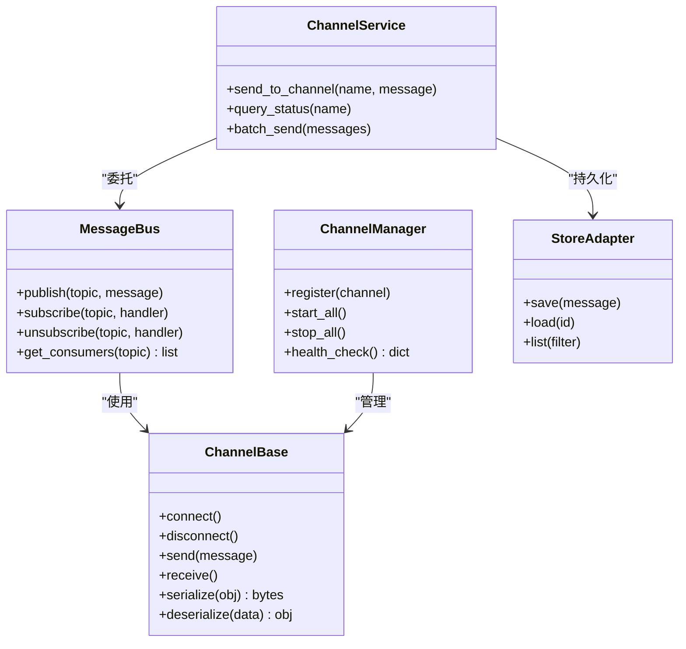
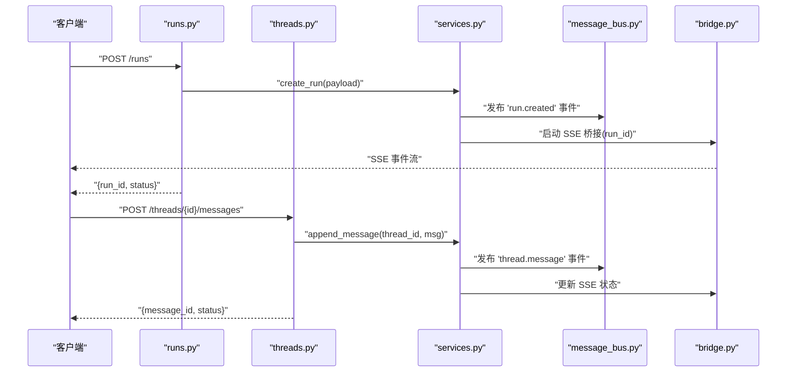
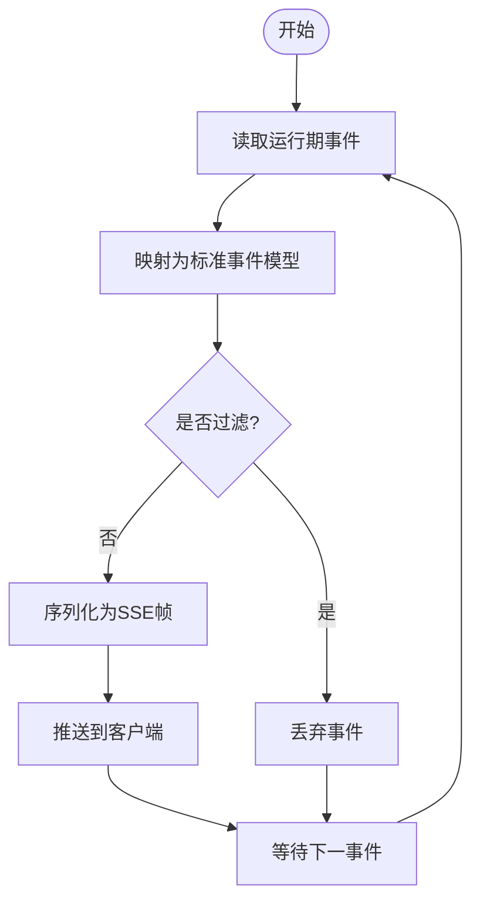
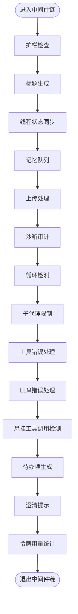
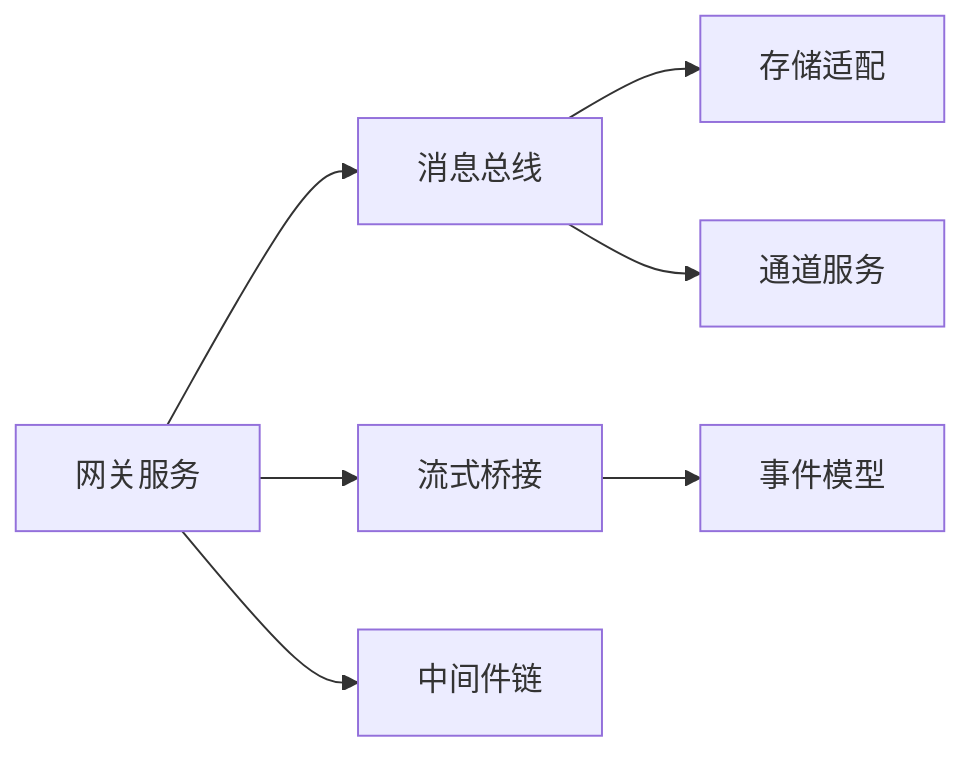

# 消息处理机制

<cite>
**本文引用的文件**   
- [backend/app/channels/message_bus.py](file://backend/app/channels/message_bus.py)
- [backend/app/channels/base.py](file://backend/app/channels/base.py)
- [backend/app/channels/manager.py](file://backend/app/channels/manager.py)
- [backend/app/channels/store.py](file://backend/app/channels/store.py)
- [backend/app/channels/service.py](file://backend/app/channels/service.py)
- [backend/app/channels/commands.py](file://backend/app/channels/commands.py)
- [backend/app/gateway/routers/runs.py](file://backend/app/gateway/routers/runs.py)
- [backend/app/gateway/routers/threads.py](file://backend/app/gateway/routers/threads.py)
- [backend/app/gateway/services.py](file://backend/app/gateway/services.py)
- [backend/app/gateway/deps.py](file://backend/app/gateway/deps.py)
- [backend/app/gateway/app.py](file://backend/app/gateway/app.py)
- [backend/packages/harness/deerflow/runtime/stream_bridge/__init__.py](file://backend/packages/harness/deerflow/runtime/stream_bridge/__init__.py)
- [backend/packages/harness/deerflow/runtime/stream_bridge/config.py](file://backend/packages/harness/deerflow/runtime/stream_bridge/config.py)
- [backend/packages/harness/deerflow/runtime/stream_bridge/bridge.py](file://backend/packages/harness/deerflow/runtime/stream_bridge/bridge.py)
- [backend/packages/harness/deerflow/runtime/stream_bridge/events.py](file://backend/packages/harness/deerflow/runtime/stream_bridge/events.py)
- [backend/packages/harness/deerflow/agents/middlewares/llm_error_handling_middleware.py](file://backend/packages/harness/deerflow/agents/middlewares/llm_error_handling_middleware.py)
- [backend/packages/harness/deerflow/agents/middlewares/tool_error_handling_middleware.py](file://backend/packages/harness/deerflow/agents/middlewares/tool_error_handling_middleware.py)
- [backend/packages/harness/deerflow/agents/middlewares/dangling_tool_call_middleware.py](file://backend/packages/harness/deerflow/agents/middlewares/dangling_tool_call_middleware.py)
- [backend/packages/harness/deerflow/agents/middlewares/subagent_limit_middleware.py](file://backend/packages/harness/deerflow/agents/middlewares/subagent_limit_middleware.py)
- [backend/packages/harness/deerflow/agents/middlewares/title_middleware.py](file://backend/packages/harness/deerflow/agents/middlewares/title_middleware.py)
- [backend/packages/harness/deerflow/agents/middlewares/thread_state_middleware.py](file://backend/packages/harness/deerflow/agents/middlewares/thread_state_middleware.py)
- [backend/packages/harness/deerflow/agents/middlewares/memory_queue_middleware.py](file://backend/packages/harness/deerflow/agents/middlewares/memory_queue_middleware.py)
- [backend/packages/harness/deerflow/agents/middlewares/sandbox_audit_middleware.py](file://backend/packages/harness/deerflow/agents/middlewares/sandbox_audit_middleware.py)
- [backend/packages/harness/deerflow/agents/middlewares/loop_detection_middleware.py](file://backend/packages/harness/deerflow/agents/middlewares/loop_detection_middleware.py)
- [backend/packages/harness/deerflow/agents/middlewares/uploads_middleware.py](file://backend/packages/harness/deerflow/agents/middlewares/uploads_middleware.py)
- [backend/packages/harness/deerflow/agents/middlewares/todo_middleware.py](file://backend/packages/harness/deerflow/agents/middlewares/todo_middleware.py)
- [backend/packages/harness/deerflow/agents/middlewares/clarification_middleware.py](file://backend/packages/harness/deerflow/agents/middlewares/clarification_middleware.py)
- [backend/packages/harness/deerflow/agents/middlewares/guardrail_middleware.py](file://backend/packages/harness/deerflow/agents/middlewares/guardrail_middleware.py)
- [backend/packages/harness/deerflow/agents/middlewares/token_usage_middleware.py](file://backend/packages/harness/deerflow/agents/middlewares/token_usage_middleware.py)
</cite>

## 目录
1. [简介](#简介)
2. [项目结构](#项目结构)
3. [核心组件](#核心组件)
4. [架构总览](#架构总览)
5. [详细组件分析](#详细组件分析)
6. [依赖关系分析](#依赖关系分析)
7. [性能考量](#性能考量)
8. [故障排查指南](#故障排查指南)
9. [结论](#结论)
10. [附录](#附录)

## 简介
本文件系统化阐述 Deer-Flow 后端的消息处理机制，覆盖从消息接收、解析、验证到分发的完整链路；解释用户输入、系统事件与工具调用等消息类型的差异化处理策略；说明优先级与调度设计、格式转换与数据映射、错误处理与异常恢复（重试与补偿）；并提供性能优化建议、监控指标以及自定义处理器示例路径。目标是帮助开发者快速理解并扩展消息处理子系统。

## 项目结构
消息处理相关代码主要分布在以下模块：
- 通道与消息总线：负责跨进程/跨服务的事件分发与持久化
- 网关路由与服务：HTTP/SSE 入口、请求校验、编排与响应
- 流式桥接：将 LangGraph 运行期事件转换为前端可消费的 SSE 事件
- 中间件链：在 Agent 执行前后对消息进行增强、校验、限流、审计与错误降级

```mermaid
graph TB
subgraph "网关层"
R["runs.py<br/>线程运行路由"]
T["threads.py<br/>线程路由"]
S["services.py<br/>业务服务"]
D["deps.py<br/>依赖注入"]
A["app.py<br/>应用装配"]
end
subgraph "通道与消息总线"
MB["message_bus.py<br/>消息总线"]
BASE["base.py<br/>通道基类"]
MGR["manager.py<br/>通道管理器"]
ST["store.py<br/>存储适配"]
SVC["service.py<br/>通道服务"]
CMD["commands.py<br/>命令定义"]
end
subgraph "运行时与流式桥接"
SB_INIT["stream_bridge/__init__.py"]
SB_CFG["stream_bridge/config.py"]
SB_BR["stream_bridge/bridge.py"]
SB_EVT["stream_bridge/events.py"]
end
subgraph "Agent 中间件链"
MW_ERR["llm_error_handling_middleware.py"]
MW_TOOL["tool_error_handling_middleware.py"]
MW_DAN["dangling_tool_call_middleware.py"]
MW_SUB["subagent_limit_middleware.py"]
MW_TITLE["title_middleware.py"]
MW_STATE["thread_state_middleware.py"]
MW_MEMQ["memory_queue_middleware.py"]
MW_SANDB["sandbox_audit_middleware.py"]
MW_LOOP["loop_detection_middleware.py"]
MW_UP["uploads_middleware.py"]
MW_TODO["todo_middleware.py"]
MW_CLAR["clarification_middleware.py"]
MW_GUARD["guardrail_middleware.py"]
MW_TOKEN["token_usage_middleware.py"]
end
R --> S
T --> S
S --> MB
MB --> ST
MB --> SVC
MB --> MGR
S --> SB_BR
SB_BR --> SB_EVT
S --> MW_ERR
S --> MW_TOOL
S --> MW_DAN
S --> MW_SUB
S --> MW_TITLE
S --> MW_STATE
S --> MW_MEMQ
S --> MW_SANDB
S --> MW_LOOP
S --> MW_UP
S --> MW_TODO
S --> MW_CLAR
S --> MW_GUARD
S --> MW_TOKEN
A --> R
A --> T
```

图表来源
- [backend/app/gateway/routers/runs.py](file://backend/app/gateway/routers/runs.py)
- [backend/app/gateway/routers/threads.py](file://backend/app/gateway/routers/threads.py)
- [backend/app/gateway/services.py](file://backend/app/gateway/services.py)
- [backend/app/gateway/deps.py](file://backend/app/gateway/deps.py)
- [backend/app/gateway/app.py](file://backend/app/gateway/app.py)
- [backend/app/channels/message_bus.py](file://backend/app/channels/message_bus.py)
- [backend/app/channels/base.py](file://backend/app/channels/base.py)
- [backend/app/channels/manager.py](file://backend/app/channels/manager.py)
- [backend/app/channels/store.py](file://backend/app/channels/store.py)
- [backend/app/channels/service.py](file://backend/app/channels/service.py)
- [backend/app/channels/commands.py](file://backend/app/channels/commands.py)
- [backend/packages/harness/deerflow/runtime/stream_bridge/__init__.py](file://backend/packages/harness/deerflow/runtime/stream_bridge/__init__.py)
- [backend/packages/harness/deerflow/runtime/stream_bridge/config.py](file://backend/packages/harness/deerflow/runtime/stream_bridge/config.py)
- [backend/packages/harness/deerflow/runtime/stream_bridge/bridge.py](file://backend/packages/harness/deerflow/runtime/stream_bridge/bridge.py)
- [backend/packages/harness/deerflow/runtime/stream_bridge/events.py](file://backend/packages/harness/deerflow/runtime/stream_bridge/events.py)

章节来源
- [backend/app/gateway/app.py](file://backend/app/gateway/app.py)
- [backend/app/gateway/routers/runs.py](file://backend/app/gateway/routers/runs.py)
- [backend/app/gateway/routers/threads.py](file://backend/app/gateway/routers/threads.py)
- [backend/app/gateway/services.py](file://backend/app/gateway/services.py)
- [backend/app/channels/message_bus.py](file://backend/app/channels/message_bus.py)
- [backend/app/channels/base.py](file://backend/app/channels/base.py)
- [backend/app/channels/manager.py](file://backend/app/channels/manager.py)
- [backend/app/channels/store.py](file://backend/app/channels/store.py)
- [backend/app/channels/service.py](file://backend/app/channels/service.py)
- [backend/app/channels/commands.py](file://backend/app/channels/commands.py)
- [backend/packages/harness/deerflow/runtime/stream_bridge/__init__.py](file://backend/packages/harness/deerflow/runtime/stream_bridge/__init__.py)
- [backend/packages/harness/deerflow/runtime/stream_bridge/config.py](file://backend/packages/harness/deerflow/runtime/stream_bridge/config.py)
- [backend/packages/harness/deerflow/runtime/stream_bridge/bridge.py](file://backend/packages/harness/deerflow/runtime/stream_bridge/bridge.py)
- [backend/packages/harness/deerflow/runtime/stream_bridge/events.py](file://backend/packages/harness/deerflow/runtime/stream_bridge/events.py)

## 核心组件
- 消息总线（MessageBus）：提供统一的消息发布/订阅接口，支持同步与异步投递，内部维护主题路由与消费者注册表。
- 通道抽象（Channel Base）：定义消息的入站/出站协议、序列化/反序列化、连接生命周期与重连策略。
- 通道管理器（Channel Manager）：管理多通道实例的生命周期、健康检查与动态扩缩容。
- 存储适配（Store）：消息落盘与回溯能力，用于幂等、重试与审计。
- 通道服务（Service）：面向上层 API 的通道能力封装，如发送、查询状态、批量操作。
- 命令定义（Commands）：标准化命令字面量与参数结构，确保跨组件一致性。
- 网关路由与服务：HTTP/SSE 入口，负责鉴权、参数校验、编排调用与结果返回。
- 流式桥接（Stream Bridge）：将 LangGraph 运行期事件转换为 SSE 事件，实现前端实时渲染。
- 中间件链：在 Agent 执行前后插入横切关注点（错误处理、限流、审计、标题生成、上传处理、待办项、澄清、护栏、令牌用量统计等）。

章节来源
- [backend/app/channels/message_bus.py](file://backend/app/channels/message_bus.py)
- [backend/app/channels/base.py](file://backend/app/channels/base.py)
- [backend/app/channels/manager.py](file://backend/app/channels/manager.py)
- [backend/app/channels/store.py](file://backend/app/channels/store.py)
- [backend/app/channels/service.py](file://backend/app/channels/service.py)
- [backend/app/channels/commands.py](file://backend/app/channels/commands.py)
- [backend/app/gateway/services.py](file://backend/app/gateway/services.py)
- [backend/packages/harness/deerflow/runtime/stream_bridge/bridge.py](file://backend/packages/harness/deerflow/runtime/stream_bridge/bridge.py)
- [backend/packages/harness/deerflow/runtime/stream_bridge/events.py](file://backend/packages/harness/deerflow/runtime/stream_bridge/events.py)

## 架构总览
下图展示一次“用户提交消息”的端到端流程：从 HTTP 请求进入网关，经服务编排，写入消息总线，再由运行期桥接为 SSE 推送至前端；同时中间件链对消息进行增强与保护。

图表来源
- [backend/app/gateway/routers/runs.py](file://backend/app/gateway/routers/runs.py)
- [backend/app/gateway/routers/threads.py](file://backend/app/gateway/routers/threads.py)
- [backend/app/gateway/services.py](file://backend/app/gateway/services.py)
- [backend/app/channels/message_bus.py](file://backend/app/channels/message_bus.py)
- [backend/packages/harness/deerflow/runtime/stream_bridge/bridge.py](file://backend/packages/harness/deerflow/runtime/stream_bridge/bridge.py)
- [backend/packages/harness/deerflow/runtime/stream_bridge/events.py](file://backend/packages/harness/deerflow/runtime/stream_bridge/events.py)

## 详细组件分析

### 消息总线与通道
- 消息总线
  - 职责：统一发布/订阅、主题路由、消费者注册、失败重试与持久化。
  - 关键行为：按主题分发、批量投递、顺序保证（可选）、幂等键。
- 通道基类
  - 职责：定义入站/出站接口、序列化/反序列化、连接管理与重连。
  - 可扩展性：新增通道类型只需实现基类方法。
- 通道管理器
  - 职责：通道实例生命周期、健康检查、动态启停。
- 存储适配
  - 职责：消息落盘、回溯、审计日志。
- 通道服务
  - 职责：对外暴露发送、查询、批量操作等能力。

图表来源
- [backend/app/channels/message_bus.py](file://backend/app/channels/message_bus.py)
- [backend/app/channels/base.py](file://backend/app/channels/base.py)
- [backend/app/channels/manager.py](file://backend/app/channels/manager.py)
- [backend/app/channels/store.py](file://backend/app/channels/store.py)
- [backend/app/channels/service.py](file://backend/app/channels/service.py)

章节来源
- [backend/app/channels/message_bus.py](file://backend/app/channels/message_bus.py)
- [backend/app/channels/base.py](file://backend/app/channels/base.py)
- [backend/app/channels/manager.py](file://backend/app/channels/manager.py)
- [backend/app/channels/store.py](file://backend/app/channels/store.py)
- [backend/app/channels/service.py](file://backend/app/channels/service.py)

### 网关路由与服务编排
- 路由层
  - runs.py：创建/查询/停止运行，返回运行 ID 与 SSE 流。
  - threads.py：线程级消息收发、历史查询、状态同步。
- 服务层
  - services.py：聚合业务逻辑，协调消息总线、流式桥接与中间件链。
- 依赖注入
  - deps.py：提供共享依赖（配置、存储、总线实例）。

图表来源
- [backend/app/gateway/routers/runs.py](file://backend/app/gateway/routers/runs.py)
- [backend/app/gateway/routers/threads.py](file://backend/app/gateway/routers/threads.py)
- [backend/app/gateway/services.py](file://backend/app/gateway/services.py)
- [backend/app/channels/message_bus.py](file://backend/app/channels/message_bus.py)
- [backend/packages/harness/deerflow/runtime/stream_bridge/bridge.py](file://backend/packages/harness/deerflow/runtime/stream_bridge/bridge.py)

章节来源
- [backend/app/gateway/routers/runs.py](file://backend/app/gateway/routers/runs.py)
- [backend/app/gateway/routers/threads.py](file://backend/app/gateway/routers/threads.py)
- [backend/app/gateway/services.py](file://backend/app/gateway/services.py)
- [backend/app/gateway/deps.py](file://backend/app/gateway/deps.py)

### 流式桥接与事件模型
- 桥接器
  - 将 LangGraph 运行期事件转换为 SSE 事件，支持断线重连与增量更新。
- 事件模型
  - 定义标准事件字段（类型、时间戳、关联ID、负载），便于前端渲染与回放。
- 配置
  - 控制缓冲大小、超时、最大并发与压缩策略。

图表来源
- [backend/packages/harness/deerflow/runtime/stream_bridge/bridge.py](file://backend/packages/harness/deerflow/runtime/stream_bridge/bridge.py)
- [backend/packages/harness/deerflow/runtime/stream_bridge/events.py](file://backend/packages/harness/deerflow/runtime/stream_bridge/events.py)
- [backend/packages/harness/deerflow/runtime/stream_bridge/config.py](file://backend/packages/harness/deerflow/runtime/stream_bridge/config.py)

章节来源
- [backend/packages/harness/deerflow/runtime/stream_bridge/__init__.py](file://backend/packages/harness/deerflow/runtime/stream_bridge/__init__.py)
- [backend/packages/harness/deerflow/runtime/stream_bridge/config.py](file://backend/packages/harness/deerflow/runtime/stream_bridge/config.py)
- [backend/packages/harness/deerflow/runtime/stream_bridge/bridge.py](file://backend/packages/harness/deerflow/runtime/stream_bridge/bridge.py)
- [backend/packages/harness/deerflow/runtime/stream_bridge/events.py](file://backend/packages/harness/deerflow/runtime/stream_bridge/events.py)

### 中间件链与消息增强
中间件链在 Agent 执行前后对消息进行增强与保护，常见场景包括：
- 错误处理与降级：LLM 错误、工具调用错误、悬挂工具调用检测
- 资源与安全：子代理限制、沙箱审计、上传安全扫描
- 体验增强：标题自动生成、待办项生成、澄清提示
- 合规与观测：护栏检查、令牌用量统计、线程状态同步、记忆队列

图表来源
- [backend/packages/harness/deerflow/agents/middlewares/guardrail_middleware.py](file://backend/packages/harness/deerflow/agents/middlewares/guardrail_middleware.py)
- [backend/packages/harness/deerflow/agents/middlewares/title_middleware.py](file://backend/packages/harness/deerflow/agents/middlewares/title_middleware.py)
- [backend/packages/harness/deerflow/agents/middlewares/thread_state_middleware.py](file://backend/packages/harness/deerflow/agents/middlewares/thread_state_middleware.py)
- [backend/packages/harness/deerflow/agents/middlewares/memory_queue_middleware.py](file://backend/packages/harness/deerflow/agents/middlewares/memory_queue_middleware.py)
- [backend/packages/harness/deerflow/agents/middlewares/uploads_middleware.py](file://backend/packages/harness/deerflow/agents/middlewares/uploads_middleware.py)
- [backend/packages/harness/deerflow/agents/middlewares/sandbox_audit_middleware.py](file://backend/packages/harness/deerflow/agents/middlewares/sandbox_audit_middleware.py)
- [backend/packages/harness/deerflow/agents/middlewares/loop_detection_middleware.py](file://backend/packages/harness/deerflow/agents/middlewares/loop_detection_middleware.py)
- [backend/packages/harness/deerflow/agents/middlewares/subagent_limit_middleware.py](file://backend/packages/harness/deerflow/agents/middlewares/subagent_limit_middleware.py)
- [backend/packages/harness/deerflow/agents/middlewares/tool_error_handling_middleware.py](file://backend/packages/harness/deerflow/agents/middlewares/tool_error_handling_middleware.py)
- [backend/packages/harness/deerflow/agents/middlewares/llm_error_handling_middleware.py](file://backend/packages/harness/deerflow/agents/middlewares/llm_error_handling_middleware.py)
- [backend/packages/harness/deerflow/agents/middlewares/dangling_tool_call_middleware.py](file://backend/packages/harness/deerflow/agents/middlewares/dangling_tool_call_middleware.py)
- [backend/packages/harness/deerflow/agents/middlewares/todo_middleware.py](file://backend/packages/harness/deerflow/agents/middlewares/todo_middleware.py)
- [backend/packages/harness/deerflow/agents/middlewares/clarification_middleware.py](file://backend/packages/harness/deerflow/agents/middlewares/clarification_middleware.py)
- [backend/packages/harness/deerflow/agents/middlewares/token_usage_middleware.py](file://backend/packages/harness/deerflow/agents/middlewares/token_usage_middleware.py)

章节来源
- [backend/packages/harness/deerflow/agents/middlewares/llm_error_handling_middleware.py](file://backend/packages/harness/deerflow/agents/middlewares/llm_error_handling_middleware.py)
- [backend/packages/harness/deerflow/agents/middlewares/tool_error_handling_middleware.py](file://backend/packages/harness/deerflow/agents/middlewares/tool_error_handling_middleware.py)
- [backend/packages/harness/deerflow/agents/middlewares/dangling_tool_call_middleware.py](file://backend/packages/harness/deerflow/agents/middlewares/dangling_tool_call_middleware.py)
- [backend/packages/harness/deerflow/agents/middlewares/subagent_limit_middleware.py](file://backend/packages/harness/deerflow/agents/middlewares/subagent_limit_middleware.py)
- [backend/packages/harness/deerflow/agents/middlewares/title_middleware.py](file://backend/packages/harness/deerflow/agents/middlewares/title_middleware.py)
- [backend/packages/harness/deerflow/agents/middlewares/thread_state_middleware.py](file://backend/packages/harness/deerflow/agents/middlewares/thread_state_middleware.py)
- [backend/packages/harness/deerflow/agents/middlewares/memory_queue_middleware.py](file://backend/packages/harness/deerflow/agents/middlewares/memory_queue_middleware.py)
- [backend/packages/harness/deerflow/agents/middlewares/sandbox_audit_middleware.py](file://backend/packages/harness/deerflow/agents/middlewares/sandbox_audit_middleware.py)
- [backend/packages/harness/deerflow/agents/middlewares/loop_detection_middleware.py](file://backend/packages/harness/deerflow/agents/middlewares/loop_detection_middleware.py)
- [backend/packages/harness/deerflow/agents/middlewares/uploads_middleware.py](file://backend/packages/harness/deerflow/agents/middlewares/uploads_middleware.py)
- [backend/packages/harness/deerflow/agents/middlewares/todo_middleware.py](file://backend/packages/harness/deerflow/agents/middlewares/todo_middleware.py)
- [backend/packages/harness/deerflow/agents/middlewares/clarification_middleware.py](file://backend/packages/harness/deerflow/agents/middlewares/clarification_middleware.py)
- [backend/packages/harness/deerflow/agents/middlewares/guardrail_middleware.py](file://backend/packages/harness/deerflow/agents/middlewares/guardrail_middleware.py)
- [backend/packages/harness/deerflow/agents/middlewares/token_usage_middleware.py](file://backend/packages/harness/deerflow/agents/middlewares/token_usage_middleware.py)

### 消息类型与处理策略
- 用户输入消息
  - 来源：前端聊天框、外部渠道（Discord/Slack/Telegram/飞书/微信等）
  - 处理：参数校验、内容清洗、权限检查、写入线程上下文、触发 Agent 执行
- 系统消息
  - 来源：定时任务、健康检查、配置变更、外部回调
  - 处理：低延迟优先、幂等处理、审计记录
- 工具调用消息
  - 来源：Agent 决策、子代理、MCP 工具
  - 处理：参数校验、沙箱隔离、结果截断、错误降级与重试

章节来源
- [backend/app/channels/commands.py](file://backend/app/channels/commands.py)
- [backend/app/gateway/services.py](file://backend/app/gateway/services.py)
- [backend/packages/harness/deerflow/agents/middlewares/tool_error_handling_middleware.py](file://backend/packages/harness/deerflow/agents/middlewares/tool_error_handling_middleware.py)
- [backend/packages/harness/deerflow/agents/middlewares/sandbox_audit_middleware.py](file://backend/packages/harness/deerflow/agents/middlewares/sandbox_audit_middleware.py)

### 优先级排序与调度算法
- 优先级分层
  - 高优先级：系统心跳、告警、用户在线状态
  - 普通优先级：用户输入、工具输出
  - 低优先级：审计日志、统计上报
- 调度策略
  - 基于主题的优先级队列，高优先级先出队
  - 批处理与合并：相同主题短时间窗口内合并以减少抖动
  - 背压控制：当消费者慢时，上游限速或丢弃低优先级消息
- 快速通道
  - 针对关键事件（如用户取消、紧急指令）走专用主题与独立消费者组

[本节为概念性说明，不直接分析具体文件]

### 格式转换与数据映射
- 入站格式
  - HTTP JSON、SSE 事件、通道二进制/文本
- 出站格式
  - SSE 帧、JSON 文档、通道协议
- 映射规则
  - 统一事件模型：type、timestamp、trace_id、payload
  - 字段别名与版本兼容：通过转换器在不同版本间保持兼容
  - 大对象裁剪：图片/文件以引用形式传递，避免阻塞

章节来源
- [backend/packages/harness/deerflow/runtime/stream_bridge/events.py](file://backend/packages/harness/deerflow/runtime/stream_bridge/events.py)
- [backend/packages/harness/deerflow/runtime/stream_bridge/bridge.py](file://backend/packages/harness/deerflow/runtime/stream_bridge/bridge.py)

### 错误处理与异常恢复
- 错误分类
  - 网络/通道错误：重连、退避、切换备用通道
  - 业务错误：参数校验失败、权限不足、资源不可用
  - 下游错误：LLM/工具调用失败、超时、限流
- 恢复策略
  - 指数退避重试：带抖动与上限
  - 死信队列：失败消息持久化，供人工干预与回放
  - 降级与熔断：关键路径失败时返回缓存或默认值
  - 补偿动作：部分成功时回滚副作用（如撤销临时文件）

章节来源
- [backend/packages/harness/deerflow/agents/middlewares/llm_error_handling_middleware.py](file://backend/packages/harness/deerflow/agents/middlewares/llm_error_handling_middleware.py)
- [backend/packages/harness/deerflow/agents/middlewares/tool_error_handling_middleware.py](file://backend/packages/harness/deerflow/agents/middlewares/tool_error_handling_middleware.py)
- [backend/packages/harness/deerflow/agents/middlewares/dangling_tool_call_middleware.py](file://backend/packages/harness/deerflow/agents/middlewares/dangling_tool_call_middleware.py)

### 自定义消息处理器与特殊场景
- 自定义通道处理器
  - 步骤：继承通道基类，实现 send/receive/serialize/deserialize；在管理器中注册；通过服务暴露 API。
  - 参考路径：
    - [backend/app/channels/base.py](file://backend/app/channels/base.py)
    - [backend/app/channels/manager.py](file://backend/app/channels/manager.py)
    - [backend/app/channels/service.py](file://backend/app/channels/service.py)
- 自定义中间件
  - 步骤：实现中间件函数，包装 Agent 调用，捕获/转换异常，注入上下文。
  - 参考路径：
    - [backend/packages/harness/deerflow/agents/middlewares/...](file://backend/packages/harness/deerflow/agents/middlewares/)
- 特殊场景
  - 大文件上传：分片上传、断点续传、病毒扫描
      - 参考：[backend/packages/harness/deerflow/agents/middlewares/uploads_middleware.py](file://backend/packages/harness/deerflow/agents/middlewares/uploads_middleware.py)
  - 长耗时任务：后台队列+进度事件
      - 参考：[backend/packages/harness/deerflow/runtime/stream_bridge/bridge.py](file://backend/packages/harness/deerflow/runtime/stream_bridge/bridge.py)
  - 敏感内容拦截：关键词/正则/模型审核
      - 参考：[backend/packages/harness/deerflow/agents/middlewares/guardrail_middleware.py](file://backend/packages/harness/deerflow/agents/middlewares/guardrail_middleware.py)

章节来源
- [backend/app/channels/base.py](file://backend/app/channels/base.py)
- [backend/app/channels/manager.py](file://backend/app/channels/manager.py)
- [backend/app/channels/service.py](file://backend/app/channels/service.py)
- [backend/packages/harness/deerflow/agents/middlewares/uploads_middleware.py](file://backend/packages/harness/deerflow/agents/middlewares/uploads_middleware.py)
- [backend/packages/harness/deerflow/agents/middlewares/guardrail_middleware.py](file://backend/packages/harness/deerflow/agents/middlewares/guardrail_middleware.py)
- [backend/packages/harness/deerflow/runtime/stream_bridge/bridge.py](file://backend/packages/harness/deerflow/runtime/stream_bridge/bridge.py)

## 依赖关系分析
- 组件耦合
  - 网关服务依赖消息总线与流式桥接，松耦合通过接口与依赖注入
  - 中间件链横向切入，降低与业务逻辑的耦合度
- 外部依赖
  - 通道适配器（如 Discord/Slack/Telegram/飞书/微信）
  - 存储与追踪（持久化、审计、分布式追踪）
- 潜在环依赖
  - 通过依赖注入与接口解耦避免循环导入

图表来源
- [backend/app/gateway/services.py](file://backend/app/gateway/services.py)
- [backend/app/channels/message_bus.py](file://backend/app/channels/message_bus.py)
- [backend/packages/harness/deerflow/runtime/stream_bridge/bridge.py](file://backend/packages/harness/deerflow/runtime/stream_bridge/bridge.py)
- [backend/packages/harness/deerflow/runtime/stream_bridge/events.py](file://backend/packages/harness/deerflow/runtime/stream_bridge/events.py)

章节来源
- [backend/app/gateway/services.py](file://backend/app/gateway/services.py)
- [backend/app/channels/message_bus.py](file://backend/app/channels/message_bus.py)
- [backend/packages/harness/deerflow/runtime/stream_bridge/bridge.py](file://backend/packages/harness/deerflow/runtime/stream_bridge/bridge.py)

## 性能考量
- 吞吐与延迟
  - 使用无阻塞 I/O 与异步消费者
  - 批处理与合并减少锁竞争与序列化开销
- 内存与背压
  - 限制队列长度，超限时丢弃低优先级消息
  - 大对象裁剪与分页拉取
- 缓存与幂等
  - 热点结果缓存（短 TTL）
  - 幂等键避免重复处理
- 监控与可观测性
  - 指标：入队/出队速率、P95/P99 延迟、错误率、重试次数、死信数量
  - 追踪：trace_id 贯穿全链路，SSE 事件携带 trace_id

[本节为通用指导，不直接分析具体文件]

## 故障排查指南
- 常见问题
  - 消息丢失：检查存储适配与死信队列
  - 重复消费：确认幂等键与去重逻辑
  - 延迟升高：观察消费者堆积与背压策略
  - SSE 断流：检查桥接器缓冲与客户端重连
- 定位手段
  - 启用详细日志与追踪
  - 回放死信消息复现问题
  - 对比不同中间件的耗时

章节来源
- [backend/packages/harness/deerflow/agents/middlewares/llm_error_handling_middleware.py](file://backend/packages/harness/deerflow/agents/middlewares/llm_error_handling_middleware.py)
- [backend/packages/harness/deerflow/agents/middlewares/tool_error_handling_middleware.py](file://backend/packages/harness/deerflow/agents/middlewares/tool_error_handling_middleware.py)
- [backend/packages/harness/deerflow/runtime/stream_bridge/bridge.py](file://backend/packages/harness/deerflow/runtime/stream_bridge/bridge.py)

## 结论
Deer-Flow 的消息处理机制以“网关—服务—总线—桥接—中间件”的分层架构为核心，结合通道抽象与中间件链实现了高内聚、低耦合的可扩展体系。通过统一的命令与事件模型、完善的错误恢复与监控能力，系统能够稳定支撑多种消息类型与复杂场景。建议在上线前完善监控指标与回放能力，并根据业务特性调整优先级与背压策略。

## 附录
- 术语
  - 消息总线：统一的消息分发中枢
  - 通道：入站/出站协议的抽象
  - 中间件链：在执行前后插入的横切逻辑
  - 流式桥接：将运行期事件转为 SSE 事件
- 最佳实践
  - 始终设置幂等键
  - 合理划分主题与优先级
  - 对大对象采用引用与裁剪
  - 为关键路径配置快速通道与独立消费者

[本节为补充信息，不直接分析具体文件]