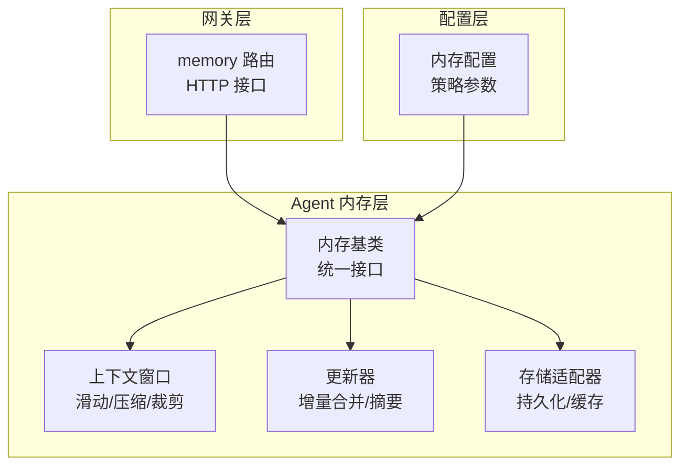
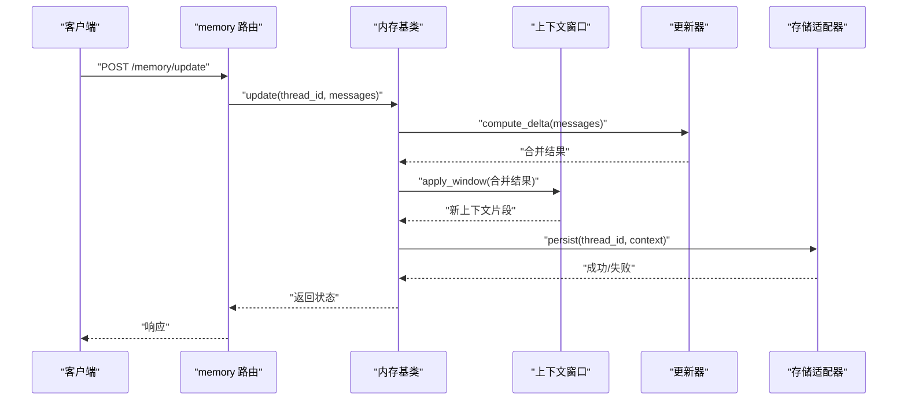
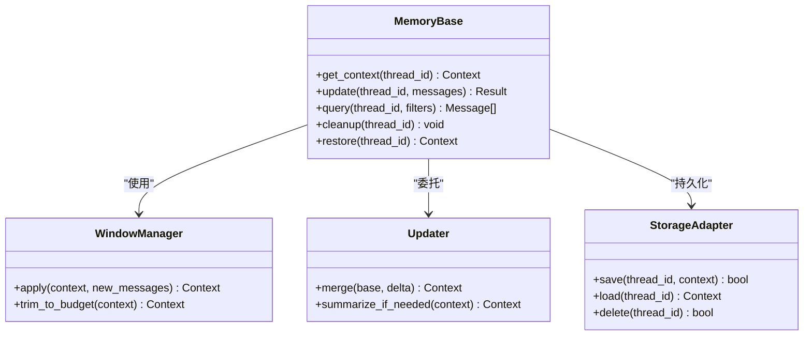
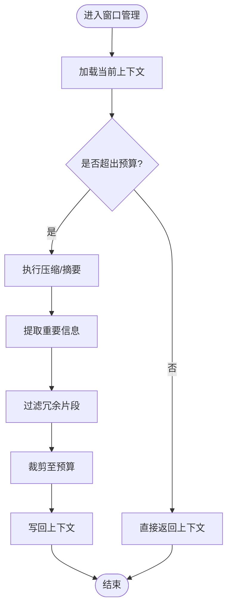
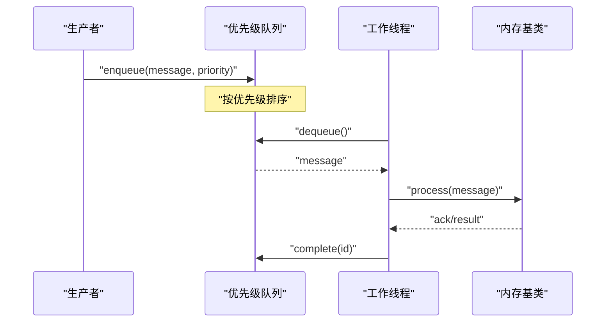
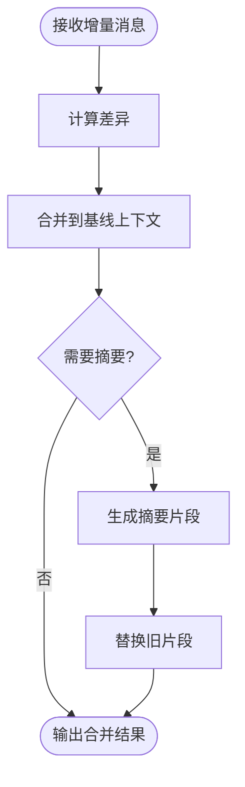
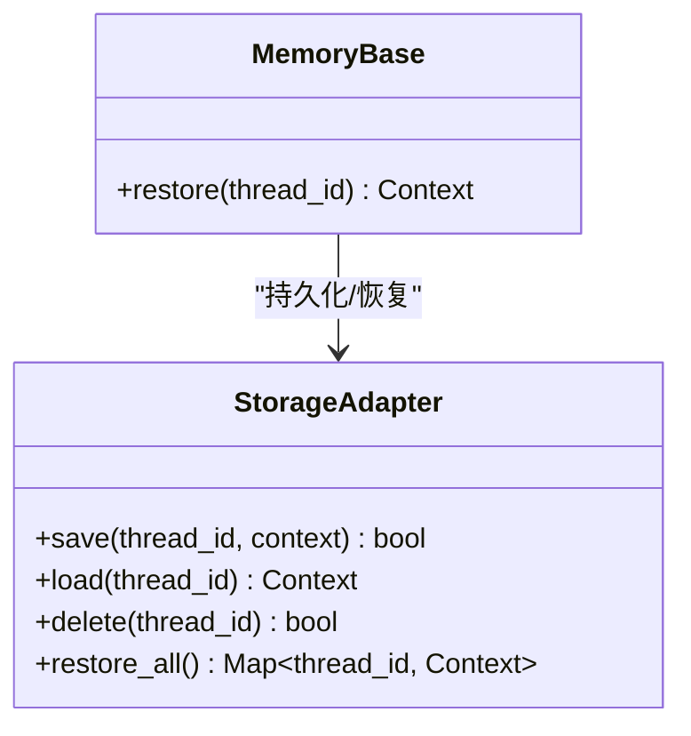
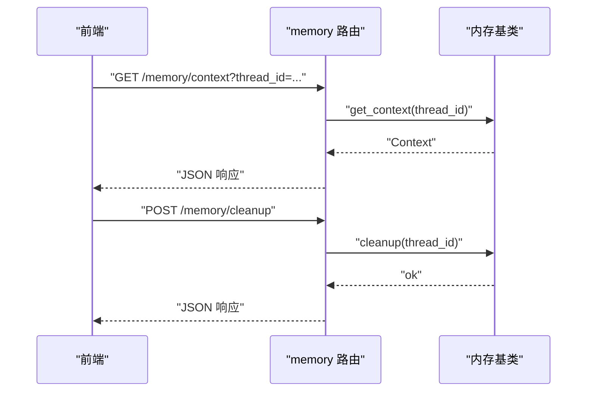
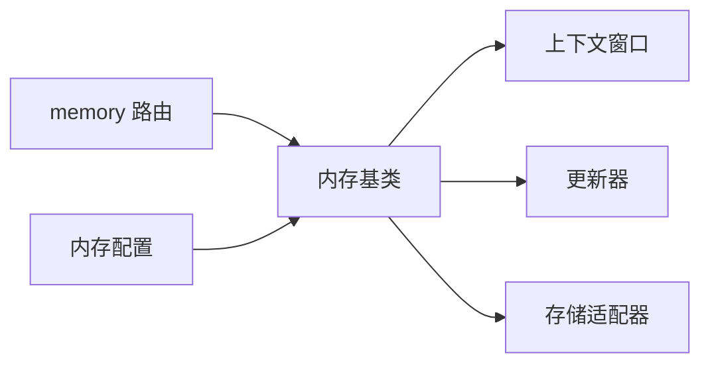

# 短期记忆管理

<cite>
**本文引用的文件**   
- [backend/app/gateway/routers/memory.py](file://backend/app/gateway/routers/memory.py)
- [backend/packages/harness/deerflow/agents/memory/__init__.py](file://backend/packages/harness/deerflow/agents/memory/__init__.py)
- [backend/packages/harness/deerflow/agents/memory/base.py](file://backend/packages/harness/deerflow/agents/memory/base.py)
- [backend/packages/harness/deerflow/agents/memory/window.py](file://backend/packages/harness/deerflow/agents/memory/window.py)
- [backend/packages/harness/deerflow/agents/memory/updater.py](file://backend/packages/harness/deerflow/agents/memory/updater.py)
- [backend/packages/harness/deerflow/agents/memory/storage.py](file://backend/packages/harness/deerflow/agents/memory/storage.py)
- [backend/packages/harness/deerflow/config/memory_config.py](file://backend/packages/harness/deerflow/config/memory_config.py)
- [backend/docs/MEMORY_IMPROVEMENTS.md](file://backend/docs/MEMORY_IMPROVEMENTS.md)
- [backend/docs/MEMORY_SETTINGS_REVIEW.md](file://backend/docs/MEMORY_SETTINGS_REVIEW.md)
- [backend/tests/test_memory_queue.py](file://backend/tests/test_memory_queue.py)
- [backend/tests/test_memory_storage.py](file://backend/tests/test_memory_storage.py)
- [backend/tests/test_memory_updater.py](file://backend/tests/test_memory_updater.py)
</cite>

## 目录
1. [简介](#简介)
2. [项目结构](#项目结构)
3. [核心组件](#核心组件)
4. [架构总览](#架构总览)
5. [详细组件分析](#详细组件分析)
6. [依赖关系分析](#依赖关系分析)
7. [性能考量](#性能考量)
8. [故障排查指南](#故障排查指南)
9. [结论](#结论)
10. [附录](#附录)

## 简介
本文件围绕“短期记忆管理”展开，聚焦对话上下文的维护与管理策略、消息处理队列（入队/出队与优先级调度）、上下文窗口管理（压缩、重要信息提取、冗余过滤）、线程状态管理与持久化恢复、消息生命周期与过期清理、配置项与性能调优，以及最佳实践与常见问题解决方案。文档以代码仓库中的内存子系统为核心依据，结合测试与文档材料进行系统化说明。

## 项目结构
短期记忆相关能力主要分布在后端网关路由与 Agent 内存模块中：
- 网关层提供对外 HTTP 接口，用于查询、更新与清理会话记忆。
- Agent 层实现内存抽象、窗口管理、更新策略与存储适配。
- 配置层提供可插拔的内存策略参数。
- 测试覆盖队列、存储与更新器行为。

图表来源
- [backend/app/gateway/routers/memory.py](file://backend/app/gateway/routers/memory.py)
- [backend/packages/harness/deerflow/agents/memory/__init__.py](file://backend/packages/harness/deerflow/agents/memory/__init__.py)
- [backend/packages/harness/deerflow/agents/memory/base.py](file://backend/packages/harness/deerflow/agents/memory/base.py)
- [backend/packages/harness/deerflow/agents/memory/window.py](file://backend/packages/harness/deerflow/agents/memory/window.py)
- [backend/packages/harness/deerflow/agents/memory/updater.py](file://backend/packages/harness/deerflow/agents/memory/updater.py)
- [backend/packages/harness/deerflow/agents/memory/storage.py](file://backend/packages/harness/deerflow/agents/memory/storage.py)
- [backend/packages/harness/deerflow/config/memory_config.py](file://backend/packages/harness/deerflow/config/memory_config.py)

章节来源
- [backend/app/gateway/routers/memory.py](file://backend/app/gateway/routers/memory.py)
- [backend/packages/harness/deerflow/agents/memory/__init__.py](file://backend/packages/harness/deerflow/agents/memory/__init__.py)
- [backend/packages/harness/deerflow/config/memory_config.py](file://backend/packages/harness/deerflow/config/memory_config.py)

## 核心组件
- 内存基类：定义统一的会话记忆读写、查询与更新接口，屏蔽底层存储差异。
- 上下文窗口：维护最近 N 条消息或固定 token 预算，支持滑动窗口、压缩与裁剪。
- 更新器：负责将新消息合并到现有上下文，执行摘要、去重与重要性评估。
- 存储适配器：提供持久化与缓存能力，支持本地内存、磁盘或外部 KV 存储。
- 网关路由：暴露 REST 接口，供前端或外部系统访问记忆能力。
- 配置：集中管理窗口大小、压缩阈值、过期时间、优先级等策略参数。

章节来源
- [backend/packages/harness/deerflow/agents/memory/base.py](file://backend/packages/harness/deerflow/agents/memory/base.py)
- [backend/packages/harness/deerflow/agents/memory/window.py](file://backend/packages/harness/deerflow/agents/memory/window.py)
- [backend/packages/harness/deerflow/agents/memory/updater.py](file://backend/packages/harness/deerflow/agents/memory/updater.py)
- [backend/packages/harness/deerflow/agents/memory/storage.py](file://backend/packages/harness/deerflow/agents/memory/storage.py)
- [backend/app/gateway/routers/memory.py](file://backend/app/gateway/routers/memory.py)
- [backend/packages/harness/deerflow/config/memory_config.py](file://backend/packages/harness/deerflow/config/memory_config.py)

## 架构总览
短期记忆在请求链路中的位置如下：客户端通过网关路由发起操作，路由调用内存基类；内存基类协调窗口、更新器与存储完成上下文构建与持久化。

图表来源
- [backend/app/gateway/routers/memory.py](file://backend/app/gateway/routers/memory.py)
- [backend/packages/harness/deerflow/agents/memory/base.py](file://backend/packages/harness/deerflow/agents/memory/base.py)
- [backend/packages/harness/deerflow/agents/memory/window.py](file://backend/packages/harness/deerflow/agents/memory/window.py)
- [backend/packages/harness/deerflow/agents/memory/updater.py](file://backend/packages/harness/deerflow/agents/memory/updater.py)
- [backend/packages/harness/deerflow/agents/memory/storage.py](file://backend/packages/harness/deerflow/agents/memory/storage.py)

## 详细组件分析

### 组件一：内存基类与接口契约
- 职责：封装会话记忆的增删改查、批量更新、快照与恢复。
- 关键方法：
  - 读取当前上下文
  - 写入新消息并触发更新
  - 按条件检索历史片段
  - 清理过期条目
- 设计要点：
  - 面向接口编程，便于替换不同存储实现
  - 对上层隐藏窗口与更新细节，保持 API 稳定

图表来源
- [backend/packages/harness/deerflow/agents/memory/base.py](file://backend/packages/harness/deerflow/agents/memory/base.py)
- [backend/packages/harness/deerflow/agents/memory/window.py](file://backend/packages/harness/deerflow/agents/memory/window.py)
- [backend/packages/harness/deerflow/agents/memory/updater.py](file://backend/packages/harness/deerflow/agents/memory/updater.py)
- [backend/packages/harness/deerflow/agents/memory/storage.py](file://backend/packages/harness/deerflow/agents/memory/storage.py)

章节来源
- [backend/packages/harness/deerflow/agents/memory/base.py](file://backend/packages/harness/deerflow/agents/memory/base.py)

### 组件二：上下文窗口管理（压缩、提取与过滤）
- 目标：在有限预算内保留高价值信息，避免上下文膨胀导致模型输入过长或成本上升。
- 机制：
  - 滑动窗口：仅保留最近 N 条消息或固定 token 预算。
  - 压缩算法：对长段落进行摘要或抽取式压缩。
  - 重要信息提取：基于规则或启发式评分保留关键实体、决策点与结论。
  - 冗余过滤：去除重复、无关或低置信度片段。
- 复杂度：
  - 窗口裁剪通常为 O(N) 或 O(logN)（若使用堆/索引）。
  - 压缩与提取可能引入额外计算开销，需权衡延迟与质量。

图表来源
- [backend/packages/harness/deerflow/agents/memory/window.py](file://backend/packages/harness/deerflow/agents/memory/window.py)

章节来源
- [backend/packages/harness/deerflow/agents/memory/window.py](file://backend/packages/harness/deerflow/agents/memory/window.py)

### 组件三：消息处理队列（入队、出队与优先级调度）
- 入队：将用户消息或系统事件加入队列，附带优先级与元数据。
- 出队：按优先级与到达顺序消费消息，保证关键任务优先处理。
- 调度策略：
  - 优先级队列：支持多级优先级（如紧急、普通、低）。
  - 公平性：防止低优先级消息饥饿。
  - 背压控制：当队列长度超过阈值时拒绝或降级。
- 并发安全：在多消费者场景下确保原子性与幂等性。

图表来源
- [backend/tests/test_memory_queue.py](file://backend/tests/test_memory_queue.py)

章节来源
- [backend/tests/test_memory_queue.py](file://backend/tests/test_memory_queue.py)

### 组件四：更新器（增量合并与摘要）
- 职责：将新消息与现有上下文合并，必要时生成摘要以保持上下文紧凑。
- 流程：
  - 计算增量：识别新增、修改与删除的消息。
  - 冲突解决：基于时间戳与来源优先级消解冲突。
  - 摘要触发：当上下文接近预算上限时触发摘要。
- 输出：稳定的上下文片段，供窗口管理器进一步裁剪。

图表来源
- [backend/packages/harness/deerflow/agents/memory/updater.py](file://backend/packages/harness/deerflow/agents/memory/updater.py)

章节来源
- [backend/packages/harness/deerflow/agents/memory/updater.py](file://backend/packages/harness/deerflow/agents/memory/updater.py)

### 组件五：存储适配器（持久化与恢复）
- 功能：
  - 保存会话上下文到持久化介质（内存、磁盘、KV 存储）。
  - 支持按会话 ID 加载与删除。
  - 提供事务性或幂等写入保障。
- 恢复机制：
  - 启动时扫描未完成的会话，尝试从存储恢复上下文。
  - 校验完整性与一致性，必要时回滚或重建。

图表来源
- [backend/packages/harness/deerflow/agents/memory/storage.py](file://backend/packages/harness/deerflow/agents/memory/storage.py)
- [backend/packages/harness/deerflow/agents/memory/base.py](file://backend/packages/harness/deerflow/agents/memory/base.py)

章节来源
- [backend/packages/harness/deerflow/agents/memory/storage.py](file://backend/packages/harness/deerflow/agents/memory/storage.py)
- [backend/tests/test_memory_storage.py](file://backend/tests/test_memory_storage.py)

### 组件六：网关路由（HTTP 接口）
- 能力：
  - 查询会话上下文
  - 更新会话记忆
  - 清理过期条目
- 设计：
  - 路由薄封装，转发到内存基类。
  - 错误码与响应体规范化，便于前端集成。

图表来源
- [backend/app/gateway/routers/memory.py](file://backend/app/gateway/routers/memory.py)

章节来源
- [backend/app/gateway/routers/memory.py](file://backend/app/gateway/routers/memory.py)

## 依赖关系分析
- 耦合与内聚：
  - 内存基类作为门面，降低上层对窗口、更新器与存储的直接依赖。
  - 窗口与更新器相对独立，便于替换策略。
- 外部依赖：
  - 存储适配器可能依赖外部 KV 或文件系统。
  - 网关路由依赖 Web 框架与序列化库。
- 循环依赖：
  - 通过接口分层避免循环引用。

图表来源
- [backend/app/gateway/routers/memory.py](file://backend/app/gateway/routers/memory.py)
- [backend/packages/harness/deerflow/agents/memory/base.py](file://backend/packages/harness/deerflow/agents/memory/base.py)
- [backend/packages/harness/deerflow/agents/memory/window.py](file://backend/packages/harness/deerflow/agents/memory/window.py)
- [backend/packages/harness/deerflow/agents/memory/updater.py](file://backend/packages/harness/deerflow/agents/memory/updater.py)
- [backend/packages/harness/deerflow/agents/memory/storage.py](file://backend/packages/harness/deerflow/agents/memory/storage.py)
- [backend/packages/harness/deerflow/config/memory_config.py](file://backend/packages/harness/deerflow/config/memory_config.py)

章节来源
- [backend/packages/harness/deerflow/config/memory_config.py](file://backend/packages/harness/deerflow/config/memory_config.py)

## 性能考量
- 窗口预算与压缩频率：
  - 合理设置预算上限，避免频繁压缩造成延迟抖动。
  - 采用惰性压缩与批处理策略提升吞吐。
- 队列优先级与背压：
  - 为高优先级消息预留配额，防止被低优先级阻塞。
  - 监控队列长度与消费速率，动态调整消费者数量。
- 存储 I/O：
  - 使用异步写入与批量落盘减少锁竞争。
  - 热点会话启用本地缓存，降低远程存储压力。
- 资源回收：
  - 定期清理过期会话与中间态数据，释放内存与磁盘空间。

[本节为通用指导，不直接分析具体文件]

## 故障排查指南
- 常见问题：
  - 上下文丢失：检查存储适配器的持久化与恢复逻辑是否一致。
  - 更新异常：确认更新器的合并与摘要触发条件是否正确。
  - 队列积压：观察优先级与消费者数量，必要时扩容。
  - 超时与重试：为网络与存储调用增加超时与退避策略。
- 定位手段：
  - 查看路由日志与错误码，快速定位问题阶段。
  - 使用测试用例复现边界情况，验证修复效果。

章节来源
- [backend/tests/test_memory_updater.py](file://backend/tests/test_memory_updater.py)
- [backend/tests/test_memory_storage.py](file://backend/tests/test_memory_storage.py)
- [backend/tests/test_memory_queue.py](file://backend/tests/test_memory_queue.py)

## 结论
短期记忆管理通过清晰的组件分层与可插拔策略，实现了高效的对话上下文维护。窗口管理、更新器与存储适配器的协作确保了上下文的质量与稳定性；网关路由提供了易用的外部接口。配合合理的配置与性能调优，可在复杂场景中保持低延迟与高可用性。

[本节为总结性内容，不直接分析具体文件]

## 附录

### 配置选项与调优建议
- 窗口大小与预算：根据模型上下文限制与业务需求设定。
- 压缩阈值与摘要策略：平衡上下文质量与计算开销。
- 过期时间与清理周期：依据会话活跃度与存储容量调整。
- 队列优先级与消费者数：根据负载特征动态调优。

章节来源
- [backend/packages/harness/deerflow/config/memory_config.py](file://backend/packages/harness/deerflow/config/memory_config.py)
- [backend/docs/MEMORY_SETTINGS_REVIEW.md](file://backend/docs/MEMORY_SETTINGS_REVIEW.md)
- [backend/docs/MEMORY_IMPROVEMENTS.md](file://backend/docs/MEMORY_IMPROVEMENTS.md)

### 最佳实践
- 明确会话边界：每个 thread_id 对应独立上下文，避免交叉污染。
- 渐进式压缩：先做冗余过滤，再进行摘要，减少信息损失。
- 幂等更新：确保多次提交同一消息不会产生副作用。
- 监控与告警：对队列长度、压缩耗时与存储错误率设置阈值。

[本节为通用指导，不直接分析具体文件]