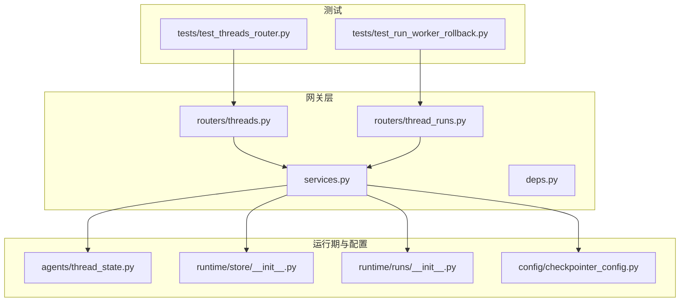
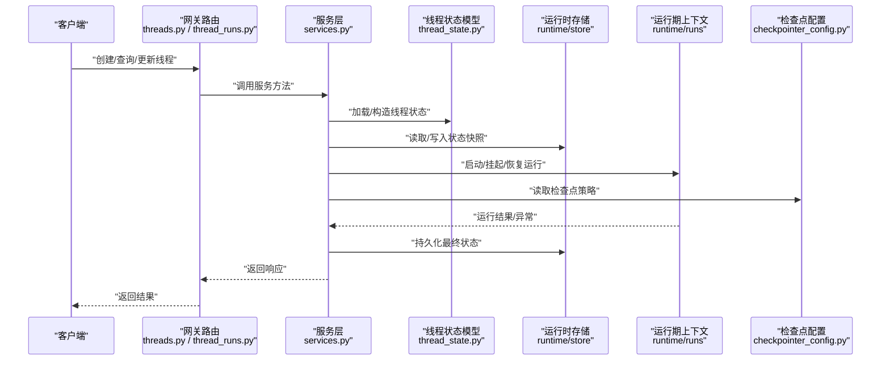
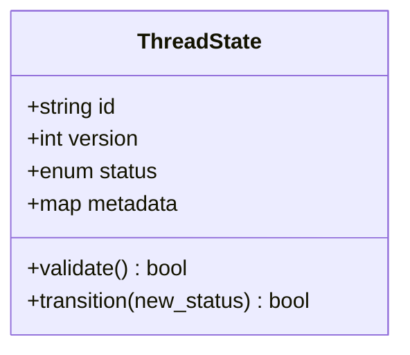
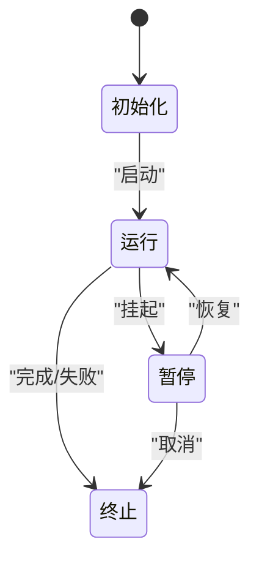
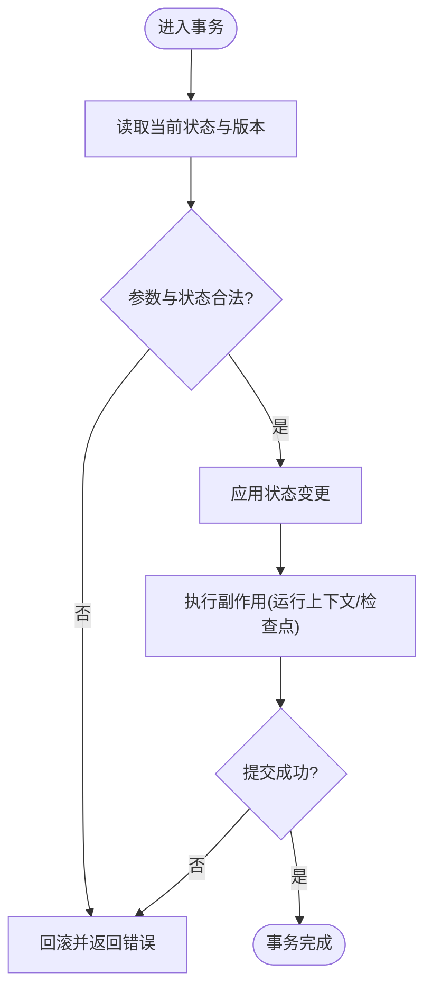
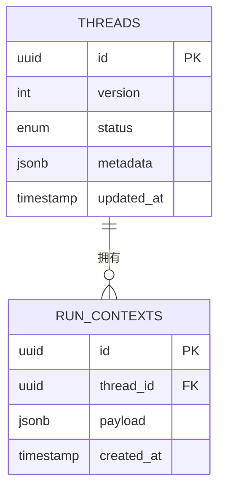
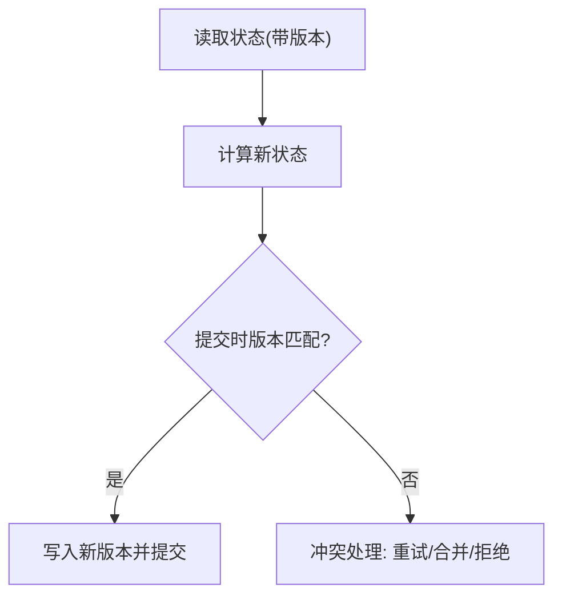
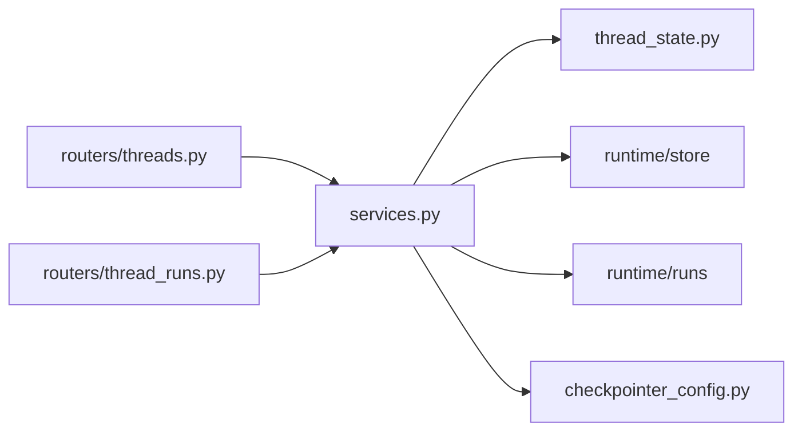

# 线程状态管理

<cite>
**本文引用的文件**   
- [backend/app/gateway/routers/threads.py](file://backend/app/gateway/routers/threads.py)
- [backend/app/gateway/routers/thread_runs.py](file://backend/app/gateway/routers/thread_runs.py)
- [backend/app/gateway/services.py](file://backend/app/gateway/services.py)
- [backend/app/gateway/deps.py](file://backend/app/gateway/deps.py)
- [backend/packages/harness/deerflow/agents/thread_state.py](file://backend/packages/harness/deerflow/agents/thread_state.py)
- [backend/packages/harness/deerflow/runtime/store/__init__.py](file://backend/packages/harness/deerflow/runtime/store/__init__.py)
- [backend/packages/harness/deerflow/runtime/runs/__init__.py](file://backend/packages/harness/deerflow/runtime/runs/__init__.py)
- [backend/packages/harness/deerflow/config/checkpointer_config.py](file://backend/packages/harness/deerflow/config/checkpointer_config.py)
- [backend/tests/test_threads_router.py](file://backend/tests/test_threads_router.py)
- [backend/tests/test_run_worker_rollback.py](file://backend/tests/test_run_worker_rollback.py)
</cite>

## 目录
1. [简介](#简介)
2. [项目结构](#项目结构)
3. [核心组件](#核心组件)
4. [架构总览](#架构总览)
5. [详细组件分析](#详细组件分析)
6. [依赖关系分析](#依赖关系分析)
7. [性能考虑](#性能考虑)
8. [故障排查指南](#故障排查指南)
9. [结论](#结论)
10. [附录](#附录)

## 简介
本文件围绕“线程状态管理”展开，聚焦于线程（对话会话）在其生命周期中的状态建模、变更原子性、持久化存储、并发访问控制、迁移与升级、以及监控调试与一致性维护。文档面向不同技术背景的读者，既提供高层概念说明，也给出与代码实现对应的可视化图示和定位路径，帮助快速理解并落地实践。

## 项目结构
后端采用分层架构：网关路由层负责对外暴露接口；服务层编排业务逻辑；运行时与检查点配置负责状态持久化与恢复；测试覆盖关键流程与回滚策略。

图表来源
- [backend/app/gateway/routers/threads.py](file://backend/app/gateway/routers/threads.py)
- [backend/app/gateway/routers/thread_runs.py](file://backend/app/gateway/routers/thread_runs.py)
- [backend/app/gateway/services.py](file://backend/app/gateway/services.py)
- [backend/app/gateway/deps.py](file://backend/app/gateway/deps.py)
- [backend/packages/harness/deerflow/agents/thread_state.py](file://backend/packages/harness/deerflow/agents/thread_state.py)
- [backend/packages/harness/deerflow/runtime/store/__init__.py](file://backend/packages/harness/deerflow/runtime/store/__init__.py)
- [backend/packages/harness/deerflow/runtime/runs/__init__.py](file://backend/packages/harness/deerflow/runtime/runs/__init__.py)
- [backend/packages/harness/deerflow/config/checkpointer_config.py](file://backend/packages/harness/deerflow/config/checkpointer_config.py)
- [backend/tests/test_threads_router.py](file://backend/tests/test_threads_router.py)
- [backend/tests/test_run_worker_rollback.py](file://backend/tests/test_run_worker_rollback.py)

章节来源
- [backend/app/gateway/routers/threads.py](file://backend/app/gateway/routers/threads.py)
- [backend/app/gateway/routers/thread_runs.py](file://backend/app/gateway/routers/thread_runs.py)
- [backend/app/gateway/services.py](file://backend/app/gateway/services.py)
- [backend/packages/harness/deerflow/agents/thread_state.py](file://backend/packages/harness/deerflow/agents/thread_state.py)
- [backend/packages/harness/deerflow/runtime/store/__init__.py](file://backend/packages/harness/deerflow/runtime/store/__init__.py)
- [backend/packages/harness/deerflow/runtime/runs/__init__.py](file://backend/packages/harness/deerflow/runtime/runs/__init__.py)
- [backend/packages/harness/deerflow/config/checkpointer_config.py](file://backend/packages/harness/deerflow/config/checkpointer_config.py)
- [backend/tests/test_threads_router.py](file://backend/tests/test_threads_router.py)
- [backend/tests/test_run_worker_rollback.py](file://backend/tests/test_run_worker_rollback.py)

## 核心组件
- 线程状态模型：定义线程的标识、版本、当前状态、元数据等字段，约束类型与取值范围，确保向后兼容。
- 状态机与生命周期：初始化、运行、暂停、恢复、终止等状态的转换规则与触发条件。
- 事务与原子性：状态变更在单条或跨资源操作中的原子提交与回滚策略。
- 持久化与索引：基于检查点/存储后端的表结构与索引设计，查询优化与分页策略。
- 并发控制：乐观锁与悲观锁的选择与实现要点，避免脏写与丢失更新。
- 迁移与升级：版本演进、兼容性策略与数据迁移脚本。
- 监控与调试：日志、指标、断点与一致性校验工具。

章节来源
- [backend/packages/harness/deerflow/agents/thread_state.py](file://backend/packages/harness/deerflow/agents/thread_state.py)
- [backend/packages/harness/deerflow/runtime/store/__init__.py](file://backend/packages/harness/deerflow/runtime/store/__init__.py)
- [backend/packages/harness/deerflow/runtime/runs/__init__.py](file://backend/packages/harness/deerflow/runtime/runs/__init__.py)
- [backend/packages/harness/deerflow/config/checkpointer_config.py](file://backend/packages/harness/deerflow/config/checkpointer_config.py)

## 架构总览
下图展示了从网关到运行时与存储的关键交互，体现状态读取、变更、持久化与回滚的整体流程。

图表来源
- [backend/app/gateway/routers/threads.py](file://backend/app/gateway/routers/threads.py)
- [backend/app/gateway/routers/thread_runs.py](file://backend/app/gateway/routers/thread_runs.py)
- [backend/app/gateway/services.py](file://backend/app/gateway/services.py)
- [backend/packages/harness/deerflow/agents/thread_state.py](file://backend/packages/harness/deerflow/agents/thread_state.py)
- [backend/packages/harness/deerflow/runtime/store/__init__.py](file://backend/packages/harness/deerflow/runtime/store/__init__.py)
- [backend/packages/harness/deerflow/runtime/runs/__init__.py](file://backend/packages/harness/deerflow/runtime/runs/__init__.py)
- [backend/packages/harness/deerflow/config/checkpointer_config.py](file://backend/packages/harness/deerflow/config/checkpointer_config.py)

## 详细组件分析

### 线程状态模型与数据结构
- 字段设计
  - 标识与版本：用于唯一识别与乐观锁比较。
  - 状态枚举：包含初始化、运行、暂停、恢复、终止等。
  - 元数据：创建时间、更新时间、扩展字段等。
- 类型约束与校验
  - 使用强类型定义与可选字段，保证新增字段不破坏旧客户端。
  - 对状态值进行白名单校验，防止非法转移。
- 版本兼容
  - 通过版本号与向后兼容策略，允许渐进式升级。
  - 对历史数据提供默认值与迁移钩子。

图表来源
- [backend/packages/harness/deerflow/agents/thread_state.py](file://backend/packages/harness/deerflow/agents/thread_state.py)

章节来源
- [backend/packages/harness/deerflow/agents/thread_state.py](file://backend/packages/harness/deerflow/agents/thread_state.py)

### 状态机与生命周期
- 状态集合
  - 初始化：线程刚创建，尚未开始执行。
  - 运行：正在执行任务。
  - 暂停：被外部请求或内部策略挂起。
  - 恢复：从暂停继续执行。
  - 终止：完成或失败结束。
- 转换规则
  - 仅允许合法边跳转，非法跳转应拒绝并记录审计信息。
  - 某些转换需要前置条件（如存在有效运行上下文）。

章节来源
- [backend/packages/harness/deerflow/agents/thread_state.py](file://backend/packages/harness/deerflow/agents/thread_state.py)

### 原子性与事务处理
- 事务边界
  - 将状态变更与相关副作用（如运行上下文更新）纳入同一事务。
- 回滚策略
  - 任何一步失败均触发回滚，保持状态一致。
  - 对于幂等操作，重试前需先读取最新状态。
- 补偿机制
  - 针对不可回滚的外部副作用，提供补偿动作以恢复一致性。

章节来源
- [backend/app/gateway/services.py](file://backend/app/gateway/services.py)
- [backend/packages/harness/deerflow/runtime/store/__init__.py](file://backend/packages/harness/deerflow/runtime/store/__init__.py)
- [backend/packages/harness/deerflow/runtime/runs/__init__.py](file://backend/packages/harness/deerflow/runtime/runs/__init__.py)

### 持久化存储与索引设计
- 存储后端
  - 通过检查点配置选择具体存储实现（内存、文件、数据库等）。
- 表结构与索引
  - 主键：线程ID。
  - 唯一索引：版本+状态组合，避免重复提交。
  - 查询索引：按更新时间、状态、租户/用户维度建立索引，支持分页与过滤。
- 查询优化
  - 只读路径优先命中索引，避免全表扫描。
  - 大对象分片存储，主表仅保留引用。

图表来源
- [backend/packages/harness/deerflow/runtime/store/__init__.py](file://backend/packages/harness/deerflow/runtime/store/__init__.py)
- [backend/packages/harness/deerflow/config/checkpointer_config.py](file://backend/packages/harness/deerflow/config/checkpointer_config.py)

章节来源
- [backend/packages/harness/deerflow/runtime/store/__init__.py](file://backend/packages/harness/deerflow/runtime/store/__init__.py)
- [backend/packages/harness/deerflow/config/checkpointer_config.py](file://backend/packages/harness/deerflow/config/checkpointer_config.py)

### 并发访问控制
- 乐观锁
  - 基于版本号比较，提交时校验版本是否变化，冲突则重试或拒绝。
- 悲观锁
  - 对热点线程加行级锁，适用于高冲突场景但可能降低吞吐。
- 选择建议
  - 低冲突优先乐观锁；高冲突或强一致性要求时使用悲观锁或两者结合。

章节来源
- [backend/packages/harness/deerflow/agents/thread_state.py](file://backend/packages/harness/deerflow/agents/thread_state.py)
- [backend/app/gateway/services.py](file://backend/app/gateway/services.py)

### 迁移与升级机制
- 版本策略
  - 状态模型与存储版本分离，逐步推进。
- 兼容性
  - 新增字段可空并提供默认值；废弃字段保留一段时间并打标记。
- 迁移脚本
  - 提供增量迁移脚本，支持幂等执行与回滚。

章节来源
- [backend/packages/harness/deerflow/agents/thread_state.py](file://backend/packages/harness/deerflow/agents/thread_state.py)
- [backend/packages/harness/deerflow/config/checkpointer_config.py](file://backend/packages/harness/deerflow/config/checkpointer_config.py)

### 监控与调试工具
- 日志与指标
  - 记录状态变更事件、耗时、错误码与堆栈摘要。
- 一致性检查
  - 定期比对内存状态与持久化快照，发现漂移及时修复。
- 调试能力
  - 提供查看线程快照、运行上下文与最近变更的工具入口。

章节来源
- [backend/app/gateway/routers/threads.py](file://backend/app/gateway/routers/threads.py)
- [backend/app/gateway/routers/thread_runs.py](file://backend/app/gateway/routers/thread_runs.py)
- [backend/app/gateway/services.py](file://backend/app/gateway/services.py)

## 依赖关系分析
- 耦合与内聚
  - 网关路由与服务层解耦，服务层聚合状态模型、运行时与存储。
- 外部依赖
  - 检查点配置决定存储后端，运行时上下文驱动状态流转。
- 循环依赖
  - 通过接口抽象与依赖注入避免循环。

图表来源
- [backend/app/gateway/routers/threads.py](file://backend/app/gateway/routers/threads.py)
- [backend/app/gateway/routers/thread_runs.py](file://backend/app/gateway/routers/thread_runs.py)
- [backend/app/gateway/services.py](file://backend/app/gateway/services.py)
- [backend/packages/harness/deerflow/agents/thread_state.py](file://backend/packages/harness/deerflow/agents/thread_state.py)
- [backend/packages/harness/deerflow/runtime/store/__init__.py](file://backend/packages/harness/deerflow/runtime/store/__init__.py)
- [backend/packages/harness/deerflow/runtime/runs/__init__.py](file://backend/packages/harness/deerflow/runtime/runs/__init__.py)
- [backend/packages/harness/deerflow/config/checkpointer_config.py](file://backend/packages/harness/deerflow/config/checkpointer_config.py)

章节来源
- [backend/app/gateway/routers/threads.py](file://backend/app/gateway/routers/threads.py)
- [backend/app/gateway/routers/thread_runs.py](file://backend/app/gateway/routers/thread_runs.py)
- [backend/app/gateway/services.py](file://backend/app/gateway/services.py)
- [backend/packages/harness/deerflow/agents/thread_state.py](file://backend/packages/harness/deerflow/agents/thread_state.py)
- [backend/packages/harness/deerflow/runtime/store/__init__.py](file://backend/packages/harness/deerflow/runtime/store/__init__.py)
- [backend/packages/harness/deerflow/runtime/runs/__init__.py](file://backend/packages/harness/deerflow/runtime/runs/__init__.py)
- [backend/packages/harness/deerflow/config/checkpointer_config.py](file://backend/packages/harness/deerflow/config/checkpointer_config.py)

## 性能考虑
- 读写分离
  - 读多写少场景下，缓存只读快照，减少热路径压力。
- 批量与分页
  - 列表查询使用游标分页，避免深度翻页。
- 索引优化
  - 为高频过滤字段建立复合索引，覆盖常见查询模式。
- 超时与限流
  - 对长耗时操作设置超时与重试上限，保护系统稳定性。

[本节为通用指导，无需源码引用]

## 故障排查指南
- 常见问题
  - 状态不一致：检查事务边界与回滚路径，确认是否有未补偿的副作用。
  - 并发冲突：观察版本号冲突日志，评估是否需要调整锁策略。
  - 持久化失败：核对存储后端健康与权限，验证索引与约束。
- 诊断步骤
  - 拉取线程快照与运行上下文，对比最近一次成功状态。
  - 启用更详细的日志级别，复现问题并收集堆栈。
  - 运行一致性检查工具，定位漂移并自动修复。

章节来源
- [backend/tests/test_run_worker_rollback.py](file://backend/tests/test_run_worker_rollback.py)
- [backend/app/gateway/services.py](file://backend/app/gateway/services.py)

## 结论
线程状态管理贯穿整个运行生命周期，关键在于清晰的状态机、严格的原子性保障、合理的持久化与索引设计、稳健的并发控制、平滑的迁移升级以及完善的监控调试体系。通过上述设计与实践，可在复杂并发环境下维持高可用与强一致性的平衡。

[本节为总结，无需源码引用]

## 附录
- 参考测试用例
  - 线程路由行为与边界条件验证。
  - 运行工作器回滚与一致性保障验证。

章节来源
- [backend/tests/test_threads_router.py](file://backend/tests/test_threads_router.py)
- [backend/tests/test_run_worker_rollback.py](file://backend/tests/test_run_worker_rollback.py)