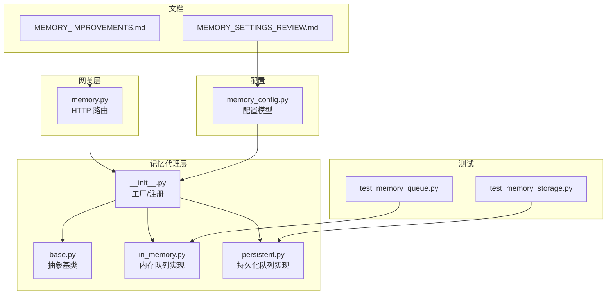
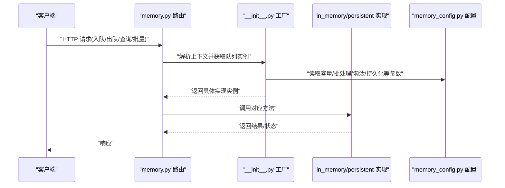
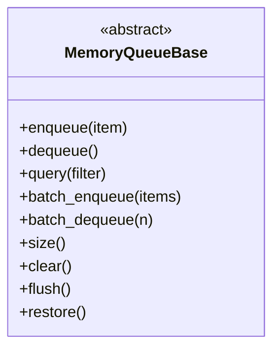
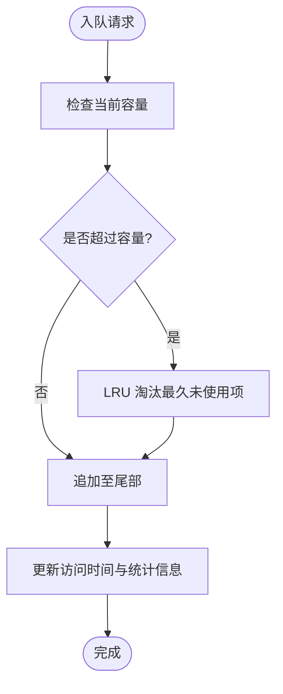
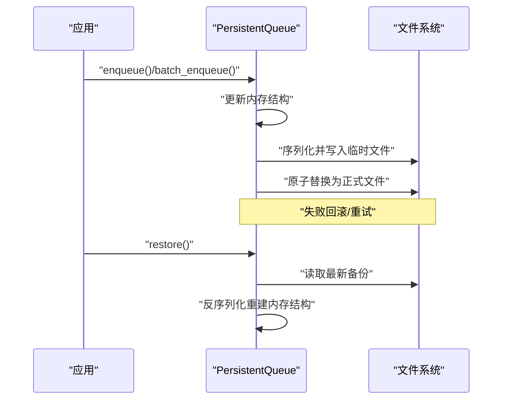
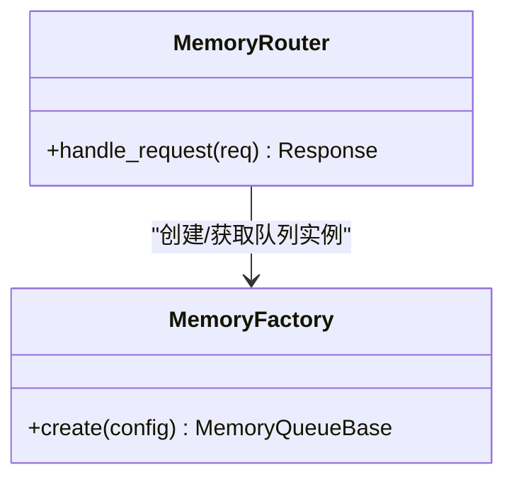
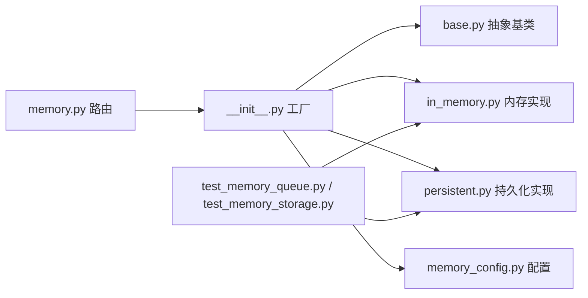

# 记忆队列管理

<cite>
**本文引用的文件**   
- [backend/app/gateway/routers/memory.py](file://backend/app/gateway/routers/memory.py)
- [backend/packages/harness/deerflow/agents/memory/__init__.py](file://backend/packages/harness/deerflow/agents/memory/__init__.py)
- [backend/packages/harness/deerflow/agents/memory/base.py](file://backend/packages/harness/deerflow/agents/memory/base.py)
- [backend/packages/harness/deerflow/agents/memory/in_memory.py](file://backend/packages/harness/deerflow/agents/memory/in_memory.py)
- [backend/packages/harness/deerflow/agents/memory/persistent.py](file://backend/packages/harness/deerflow/agents/memory/persistent.py)
- [backend/packages/harness/deerflow/config/memory_config.py](file://backend/packages/harness/deerflow/config/memory_config.py)
- [backend/tests/test_memory_queue.py](file://backend/tests/test_memory_queue.py)
- [backend/tests/test_memory_storage.py](file://backend/tests/test_memory_storage.py)
- [backend/docs/MEMORY_IMPROVEMENTS.md](file://backend/docs/MEMORY_IMPROVEMENTS.md)
- [backend/docs/MEMORY_SETTINGS_REVIEW.md](file://backend/docs/MEMORY_SETTINGS_REVIEW.md)
</cite>

## 目录
1. [简介](#简介)
2. [项目结构](#项目结构)
3. [核心组件](#核心组件)
4. [架构总览](#架构总览)
5. [详细组件分析](#详细组件分析)
6. [依赖关系分析](#依赖关系分析)
7. [性能考虑](#性能考虑)
8. [故障排查指南](#故障排查指南)
9. [结论](#结论)
10. [附录](#附录)

## 简介
本文件面向“记忆队列”子系统，系统性梳理其数据结构、并发控制、容量与溢出策略、持久化机制、性能调优参数以及监控调试方法。文档同时覆盖内存队列与持久化队列的实现差异，并给出入队、出队、查询与批量操作的接口说明与调用流程。

## 项目结构
记忆队列相关代码主要位于后端 harness 的 agents.memory 模块，并通过网关路由对外暴露 API；配置集中在 memory_config；测试用例覆盖队列行为与存储实现。

图示来源
- [backend/app/gateway/routers/memory.py](file://backend/app/gateway/routers/memory.py)
- [backend/packages/harness/deerflow/agents/memory/__init__.py](file://backend/packages/harness/deerflow/agents/memory/__init__.py)
- [backend/packages/harness/deerflow/agents/memory/base.py](file://backend/packages/harness/deerflow/agents/memory/base.py)
- [backend/packages/harness/deerflow/agents/memory/in_memory.py](file://backend/packages/harness/deerflow/agents/memory/in_memory.py)
- [backend/packages/harness/deerflow/agents/memory/persistent.py](file://backend/packages/harness/deerflow/agents/memory/persistent.py)
- [backend/packages/harness/deerflow/config/memory_config.py](file://backend/packages/harness/deerflow/config/memory_config.py)
- [backend/tests/test_memory_queue.py](file://backend/tests/test_memory_queue.py)
- [backend/tests/test_memory_storage.py](file://backend/tests/test_memory_storage.py)
- [backend/docs/MEMORY_IMPROVEMENTS.md](file://backend/docs/MEMORY_IMPROVEMENTS.md)
- [backend/docs/MEMORY_SETTINGS_REVIEW.md](file://backend/docs/MEMORY_SETTINGS_REVIEW.md)

章节来源
- [backend/app/gateway/routers/memory.py](file://backend/app/gateway/routers/memory.py)
- [backend/packages/harness/deerflow/agents/memory/__init__.py](file://backend/packages/harness/deerflow/agents/memory/__init__.py)
- [backend/packages/harness/deerflow/config/memory_config.py](file://backend/packages/harness/deerflow/config/memory_config.py)

## 核心组件
- 抽象基类：定义队列统一接口（入队、出队、查询、批量操作、状态统计等），屏蔽底层实现差异。
- 内存队列：基于进程内数据结构的高吞吐实现，适合单进程或短生命周期任务。
- 持久化队列：在内存基础上增加数据序列化与落盘能力，支持服务重启恢复与跨进程共享。
- 配置模型：集中管理队列容量、批处理大小、淘汰策略、持久化路径等关键参数。
- 网关路由：将 HTTP 请求映射到队列操作，提供外部可观测性与集成点。

章节来源
- [backend/packages/harness/deerflow/agents/memory/base.py](file://backend/packages/harness/deerflow/agents/memory/base.py)
- [backend/packages/harness/deerflow/agents/memory/in_memory.py](file://backend/packages/harness/deerflow/agents/memory/in_memory.py)
- [backend/packages/harness/deerflow/agents/memory/persistent.py](file://backend/packages/harness/deerflow/agents/memory/persistent.py)
- [backend/packages/harness/deerflow/config/memory_config.py](file://backend/packages/harness/deerflow/config/memory_config.py)
- [backend/app/gateway/routers/memory.py](file://backend/app/gateway/routers/memory.py)

## 架构总览
下图展示从 HTTP 入口到具体队列实现的调用链，以及配置注入与测试验证位置。

图示来源
- [backend/app/gateway/routers/memory.py](file://backend/app/gateway/routers/memory.py)
- [backend/packages/harness/deerflow/agents/memory/__init__.py](file://backend/packages/harness/deerflow/agents/memory/__init__.py)
- [backend/packages/harness/deerflow/agents/memory/in_memory.py](file://backend/packages/harness/deerflow/agents/memory/in_memory.py)
- [backend/packages/harness/deerflow/agents/memory/persistent.py](file://backend/packages/harness/deerflow/agents/memory/persistent.py)
- [backend/packages/harness/deerflow/config/memory_config.py](file://backend/packages/harness/deerflow/config/memory_config.py)

## 详细组件分析

### 抽象基类与接口契约
- 职责：定义统一的队列操作语义，包括入队、出队、按条件查询、批量入队/出队、长度与状态统计、清理与重置等。
- 设计要点：
  - 通过抽象方法强制子类实现，保证扩展性。
  - 对异常进行规范化封装，便于上层路由统一处理。
  - 为持久化实现预留钩子（如 flush、restore）。

图示来源
- [backend/packages/harness/deerflow/agents/memory/base.py](file://backend/packages/harness/deerflow/agents/memory/base.py)

章节来源
- [backend/packages/harness/deerflow/agents/memory/base.py](file://backend/packages/harness/deerflow/agents/memory/base.py)

### 内存队列实现
- 数据结构：使用进程内高效容器维护有序序列，支持 O(1) 入队与近似 O(1) 出队。
- 并发安全：采用线程锁保护临界区，确保多线程访问一致性。
- 容量与溢出：
  - 当达到最大容量时触发 LRU 淘汰策略，移除最久未使用的项以维持上限。
  - 内存压力检测可触发降级（如拒绝新入队或提前淘汰）。
- 性能特征：高吞吐、低延迟，适合短时任务与本地开发环境。

图示来源
- [backend/packages/harness/deerflow/agents/memory/in_memory.py](file://backend/packages/harness/deerflow/agents/memory/in_memory.py)
- [backend/packages/harness/deerflow/config/memory_config.py](file://backend/packages/harness/deerflow/config/memory_config.py)

章节来源
- [backend/packages/harness/deerflow/agents/memory/in_memory.py](file://backend/packages/harness/deerflow/agents/memory/in_memory.py)
- [backend/packages/harness/deerflow/config/memory_config.py](file://backend/packages/harness/deerflow/config/memory_config.py)

### 持久化队列实现
- 数据结构：在内存结构之上增加持久化层，支持序列化写入磁盘与启动恢复。
- 持久化机制：
  - 增量落盘：周期性或阈值触发将内存快照序列化到文件。
  - 备份与恢复：支持多版本备份与冷启动恢复，保证幂等与一致性。
- 并发与一致性：
  - 读写分离与写锁串行化，避免并发写入导致的数据损坏。
  - 事务式提交（先写临时文件再原子替换）提升可靠性。
- 适用场景：需要跨进程共享、服务重启不丢数据的场景。

图示来源
- [backend/packages/harness/deerflow/agents/memory/persistent.py](file://backend/packages/harness/deerflow/agents/memory/persistent.py)

章节来源
- [backend/packages/harness/deerflow/agents/memory/persistent.py](file://backend/packages/harness/deerflow/agents/memory/persistent.py)

### 工厂与路由集成
- 工厂：根据配置与环境选择内存或持久化实现，注入配置参数。
- 路由：将 HTTP 请求映射到队列方法，负责参数校验、错误码与日志记录。

图示来源
- [backend/packages/harness/deerflow/agents/memory/__init__.py](file://backend/packages/harness/deerflow/agents/memory/__init__.py)
- [backend/app/gateway/routers/memory.py](file://backend/app/gateway/routers/memory.py)

章节来源
- [backend/packages/harness/deerflow/agents/memory/__init__.py](file://backend/packages/harness/deerflow/agents/memory/__init__.py)
- [backend/app/gateway/routers/memory.py](file://backend/app/gateway/routers/memory.py)

### 配置模型与关键参数
- 容量与批处理：
  - max_size：队列最大容量，影响内存占用与吞吐。
  - batch_size：批量操作大小，平衡 I/O 次数与单次处理开销。
- 淘汰与压力：
  - eviction_policy：淘汰策略（如 LRU）。
  - pressure_threshold：内存压力阈值，触发降级或拒绝。
- 持久化：
  - storage_path：持久化目录。
  - flush_interval / flush_on_batch：落盘时机。
  - backup_count：保留备份数量。

章节来源
- [backend/packages/harness/deerflow/config/memory_config.py](file://backend/packages/harness/deerflow/config/memory_config.py)
- [backend/docs/MEMORY_SETTINGS_REVIEW.md](file://backend/docs/MEMORY_SETTINGS_REVIEW.md)

## 依赖关系分析
- 耦合度：
  - 路由仅依赖工厂与抽象接口，降低与具体实现的耦合。
  - 持久化实现依赖文件系统与序列化逻辑，需关注 I/O 稳定性。
- 外部依赖：
  - 配置系统注入运行时参数。
  - 测试套件覆盖关键路径，保障行为正确性。

图示来源
- [backend/app/gateway/routers/memory.py](file://backend/app/gateway/routers/memory.py)
- [backend/packages/harness/deerflow/agents/memory/__init__.py](file://backend/packages/harness/deerflow/agents/memory/__init__.py)
- [backend/packages/harness/deerflow/agents/memory/base.py](file://backend/packages/harness/deerflow/agents/memory/base.py)
- [backend/packages/harness/deerflow/agents/memory/in_memory.py](file://backend/packages/harness/deerflow/agents/memory/in_memory.py)
- [backend/packages/harness/deerflow/agents/memory/persistent.py](file://backend/packages/harness/deerflow/agents/memory/persistent.py)
- [backend/packages/harness/deerflow/config/memory_config.py](file://backend/packages/harness/deerflow/config/memory_config.py)
- [backend/tests/test_memory_queue.py](file://backend/tests/test_memory_queue.py)
- [backend/tests/test_memory_storage.py](file://backend/tests/test_memory_storage.py)

章节来源
- [backend/tests/test_memory_queue.py](file://backend/tests/test_memory_queue.py)
- [backend/tests/test_memory_storage.py](file://backend/tests/test_memory_storage.py)

## 性能考虑
- 吞吐量与延迟：
  - 增大 batch_size 可减少系统调用次数，但会提高单次处理延迟。
  - 合理设置 max_size 以避免频繁淘汰带来的额外开销。
- 内存压力：
  - 结合 pressure_threshold 与 eviction_policy 动态调整，防止 OOM。
- 持久化 I/O：
  - 选择合适的 flush 策略（定时 vs 阈值），避免阻塞主流程。
  - 使用原子替换与备份轮转，减少停机时间。
- 并发控制：
  - 在高并发下优先使用持久化实现，配合写锁串行化与读优化。

章节来源
- [backend/docs/MEMORY_IMPROVEMENTS.md](file://backend/docs/MEMORY_IMPROVEMENTS.md)
- [backend/docs/MEMORY_SETTINGS_REVIEW.md](file://backend/docs/MEMORY_SETTINGS_REVIEW.md)

## 故障排查指南
- 常见问题定位：
  - 入队失败：检查容量限制与淘汰策略，确认是否触发拒绝或异常。
  - 出队为空：确认是否有消费者竞争或批次大小过大导致空窗期。
  - 持久化不一致：查看备份文件完整性与恢复流程日志。
- 诊断手段：
  - 启用路由层日志，记录请求参数与耗时。
  - 使用测试用例复现边界条件（满队列、并发竞争、I/O 失败）。
  - 观察内存指标与 GC 行为，评估压力阈值是否合理。
- 修复建议：
  - 调整批处理大小与淘汰策略，平衡吞吐与延迟。
  - 优化持久化路径权限与磁盘空间，避免写入失败。
  - 引入重试与退避机制，增强健壮性。

章节来源
- [backend/tests/test_memory_queue.py](file://backend/tests/test_memory_queue.py)
- [backend/tests/test_memory_storage.py](file://backend/tests/test_memory_storage.py)
- [backend/docs/MEMORY_IMPROVEMENTS.md](file://backend/docs/MEMORY_IMPROVEMENTS.md)

## 结论
记忆队列通过抽象接口统一了内存与持久化两种实现，提供了稳定的入队、出队、查询与批量操作能力。结合合理的容量与淘汰策略、可靠的持久化机制与完善的监控调试手段，可在不同负载与部署环境下保持高性能与高可用。

## 附录
- 术语
  - LRU：最近最少使用淘汰算法。
  - 原子替换：先写临时文件再替换目标文件，保证一致性。
- 参考
  - 改进与回顾文档用于理解历史演进与配置建议。