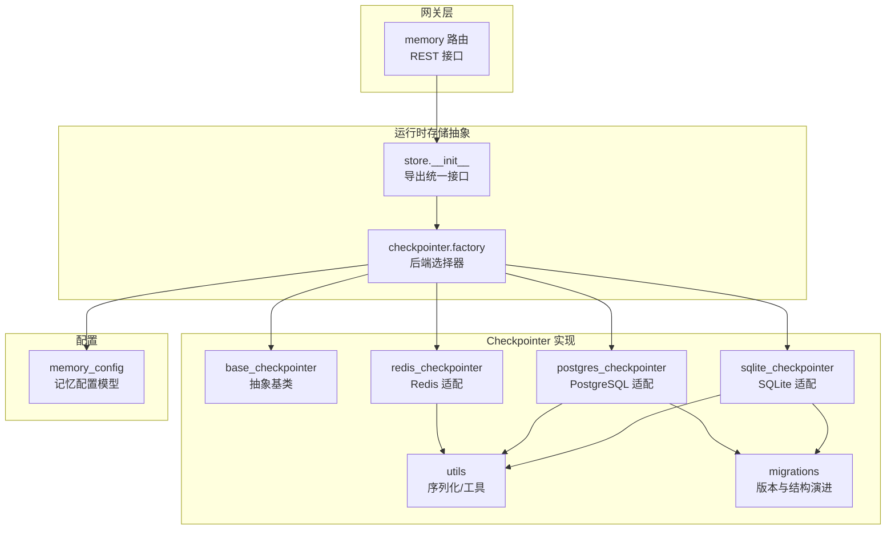
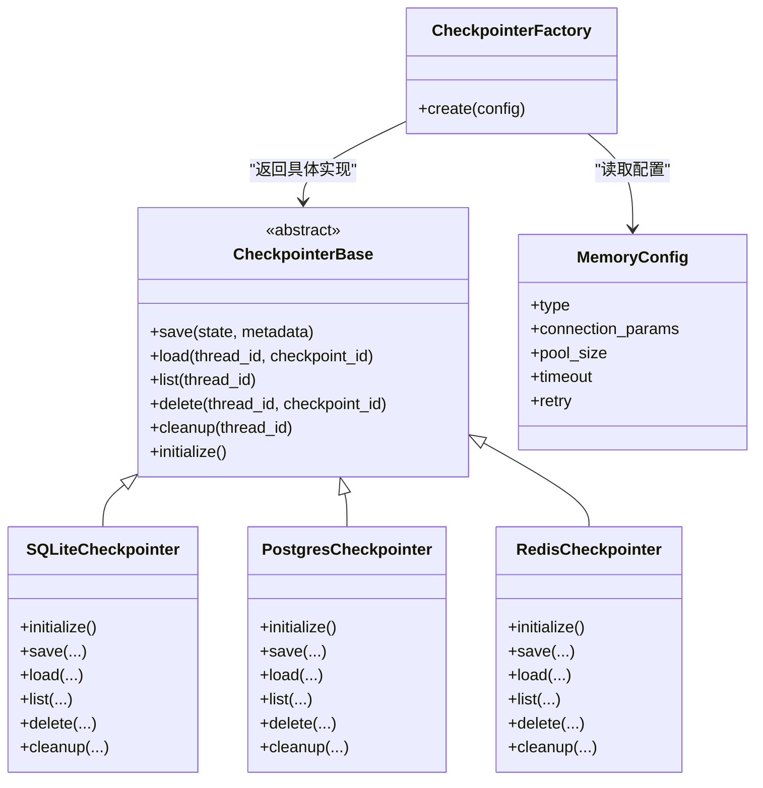
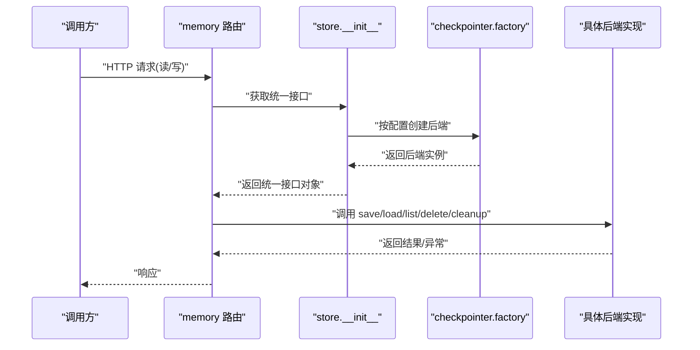
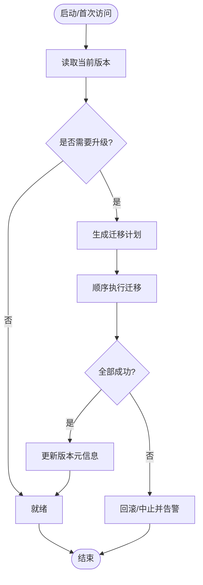
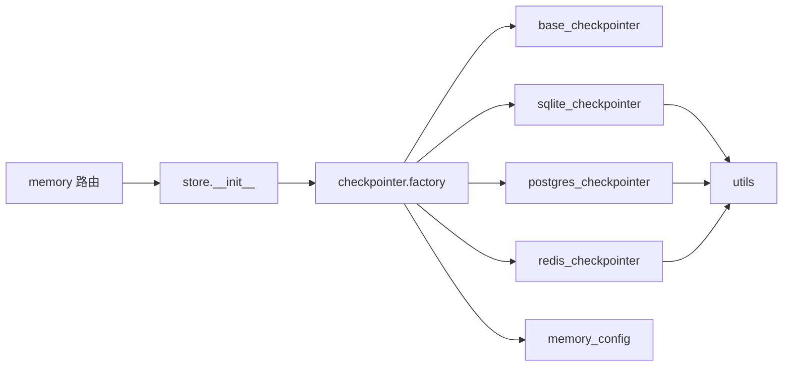

# 记忆存储后端

<cite>
**本文引用的文件**   
- [backend/app/gateway/routers/memory.py](file://backend/app/gateway/routers/memory.py)
- [backend/packages/harness/deerflow/runtime/store/__init__.py](file://backend/packages/harness/deerflow/runtime/store/__init__.py)
- [backend/packages/harness/deerflow/config/memory_config.py](file://backend/packages/harness/deerflow/config/memory_config.py)
- [backend/packages/harness/deerflow/agents/checkpointer/__init__.py](file://backend/packages/harness/deerflow/agents/checkpointer/__init__.py)
- [backend/packages/harness/deerflow/agents/checkpointer/sqlite_checkpointer.py](file://backend/packages/harness/deerflow/agents/checkpointer/sqlite_checkpointer.py)
- [backend/packages/harness/deerflow/agents/checkpointer/postgres_checkpointer.py](file://backend/packages/harness/deerflow/agents/checkpointer/postgres_checkpointer.py)
- [backend/packages/harness/deerflow/agents/checkpointer/redis_checkpointer.py](file://backend/packages/harness/deerflow/agents/checkpointer/redis_checkpointer.py)
- [backend/packages/harness/deerflow/agents/checkpointer/base_checkpointer.py](file://backend/packages/harness/deerflow/agents/checkpointer/base_checkpointer.py)
- [backend/packages/harness/deerflow/agents/checkpointer/factory.py](file://backend/packages/harness/deerflow/agents/checkpointer/factory.py)
- [backend/packages/harness/deerflow/agents/checkpointer/migrations.py](file://backend/packages/harness/deerflow/agents/checkpointer/migrations.py)
- [backend/packages/harness/deerflow/agents/checkpointer/utils.py](file://backend/packages/harness/deerflow/agents/checkpointer/utils.py)
- [backend/tests/test_memory_storage.py](file://backend/tests/test_memory_storage.py)
- [backend/docs/MEMORY_IMPROVEMENTS.md](file://backend/docs/MEMORY_IMPROVEMENTS.md)
- [backend/docs/MEMORY_SETTINGS_REVIEW.md](file://backend/docs/MEMORY_SETTINGS_REVIEW.md)
- [config.example.yaml](file://config.example.yaml)
</cite>

## 目录
1. [简介](#简介)
2. [项目结构](#项目结构)
3. [核心组件](#核心组件)
4. [架构总览](#架构总览)
5. [详细组件分析](#详细组件分析)
6. [依赖关系分析](#依赖关系分析)
7. [性能与缓存](#性能与缓存)
8. [配置与部署](#配置与部署)
9. [监控与故障排查](#监控与故障排查)
10. [结论](#结论)
11. [附录](#附录)

## 简介
本文件面向“记忆存储后端”，系统性阐述其支持的存储后端类型（SQLite、PostgreSQL、Redis）、抽象层设计与统一接口、持久化策略（事务、并发、一致性）、迁移机制（版本管理与结构演进）、缓存与性能优化（连接池、查询缓存）、不同后端的配置示例与部署指南，以及监控指标与故障排查方法。文档以代码仓库中的实际实现为依据，帮助读者快速理解并正确集成记忆存储能力。

## 项目结构
记忆存储相关代码主要分布在以下位置：
- 网关路由层：对外暴露记忆读写 API
- 运行时存储抽象：统一的存储接口与工厂
- Checkpointer 子系统：检查点/状态持久化的具体后端实现与迁移
- 配置模块：记忆存储的运行时配置项
- 测试与文档：覆盖用例与改进说明

图表来源
- [backend/app/gateway/routers/memory.py](file://backend/app/gateway/routers/memory.py)
- [backend/packages/harness/deerflow/runtime/store/__init__.py](file://backend/packages/harness/deerflow/runtime/store/__init__.py)
- [backend/packages/harness/deerflow/agents/checkpointer/factory.py](file://backend/packages/harness/deerflow/agents/checkpointer/factory.py)
- [backend/packages/harness/deerflow/agents/checkpointer/base_checkpointer.py](file://backend/packages/harness/deerflow/agents/checkpointer/base_checkpointer.py)
- [backend/packages/harness/deerflow/agents/checkpointer/sqlite_checkpointer.py](file://backend/packages/harness/deerflow/agents/checkpointer/sqlite_checkpointer.py)
- [backend/packages/harness/deerflow/agents/checkpointer/postgres_checkpointer.py](file://backend/packages/harness/deerflow/agents/checkpointer/postgres_checkpointer.py)
- [backend/packages/harness/deerflow/agents/checkpointer/redis_checkpointer.py](file://backend/packages/harness/deerflow/agents/checkpointer/redis_checkpointer.py)
- [backend/packages/harness/deerflow/agents/checkpointer/utils.py](file://backend/packages/harness/deerflow/agents/checkpointer/utils.py)
- [backend/packages/harness/deerflow/agents/checkpointer/migrations.py](file://backend/packages/harness/deerflow/agents/checkpointer/migrations.py)
- [backend/packages/harness/deerflow/config/memory_config.py](file://backend/packages/harness/deerflow/config/memory_config.py)

章节来源
- [backend/app/gateway/routers/memory.py](file://backend/app/gateway/routers/memory.py)
- [backend/packages/harness/deerflow/runtime/store/__init__.py](file://backend/packages/harness/deerflow/runtime/store/__init__.py)
- [backend/packages/harness/deerflow/agents/checkpointer/factory.py](file://backend/packages/harness/deerflow/agents/checkpointer/factory.py)
- [backend/packages/harness/deerflow/agents/checkpointer/base_checkpointer.py](file://backend/packages/harness/deerflow/agents/checkpointer/base_checkpointer.py)
- [backend/packages/harness/deerflow/agents/checkpointer/sqlite_checkpointer.py](file://backend/packages/harness/deerflow/agents/checkpointer/sqlite_checkpointer.py)
- [backend/packages/harness/deerflow/agents/checkpointer/postgres_checkpointer.py](file://backend/packages/harness/deerflow/agents/checkpointer/postgres_checkpointer.py)
- [backend/packages/harness/deerflow/agents/checkpointer/redis_checkpointer.py](file://backend/packages/harness/deerflow/agents/checkpointer/redis_checkpointer.py)
- [backend/packages/harness/deerflow/agents/checkpointer/utils.py](file://backend/packages/harness/deerflow/agents/checkpointer/utils.py)
- [backend/packages/harness/deerflow/agents/checkpointer/migrations.py](file://backend/packages/harness/deerflow/agents/checkpointer/migrations.py)
- [backend/packages/harness/deerflow/config/memory_config.py](file://backend/packages/harness/deerflow/config/memory_config.py)

## 核心组件
- 统一存储接口与工厂
  - 通过运行时 store 初始化入口导出统一接口，供上层调用
  - checkpointer factory 根据配置动态选择具体后端（SQLite/PostgreSQL/Redis）
- 抽象基类与具体实现
  - base_checkpointer 定义统一契约（保存/读取/删除/列表/清理等）
  - sqlite_checkpointer、postgres_checkpointer、redis_checkpointer 分别实现对应数据库语义
- 迁移与工具
  - migrations 负责版本管理与结构演进
  - utils 提供序列化、键空间组织、错误封装等通用能力
- 配置
  - memory_config 提供记忆存储的配置模型（如后端类型、连接参数、超时、重试等）

章节来源
- [backend/packages/harness/deerflow/runtime/store/__init__.py](file://backend/packages/harness/deerflow/runtime/store/__init__.py)
- [backend/packages/harness/deerflow/agents/checkpointer/factory.py](file://backend/packages/harness/deerflow/agents/checkpointer/factory.py)
- [backend/packages/harness/deerflow/agents/checkpointer/base_checkpointer.py](file://backend/packages/harness/deerflow/agents/checkpointer/base_checkpointer.py)
- [backend/packages/harness/deerflow/agents/checkpointer/sqlite_checkpointer.py](file://backend/packages/harness/deerflow/agents/checkpointer/sqlite_checkpointer.py)
- [backend/packages/harness/deerflow/agents/checkpointer/postgres_checkpointer.py](file://backend/packages/harness/deerflow/agents/checkpointer/postgres_checkpointer.py)
- [backend/packages/harness/deerflow/agents/checkpointer/redis_checkpointer.py](file://backend/packages/harness/deerflow/agents/checkpointer/redis_checkpointer.py)
- [backend/packages/harness/deerflow/agents/checkpointer/migrations.py](file://backend/packages/harness/deerflow/agents/checkpointer/migrations.py)
- [backend/packages/harness/deerflow/agents/checkpointer/utils.py](file://backend/packages/harness/deerflow/agents/checkpointer/utils.py)
- [backend/packages/harness/deerflow/config/memory_config.py](file://backend/packages/harness/deerflow/config/memory_config.py)

## 架构总览
记忆存储后端采用“接口抽象 + 多后端实现 + 工厂装配”的分层设计：
- 网关层仅依赖统一接口，不感知具体后端
- 工厂依据配置创建具体后端实例
- 各后端在自身范围内处理连接、事务、并发与一致性细节
- 迁移模块在启动或首次访问时确保数据结构与版本一致

图表来源
- [backend/packages/harness/deerflow/agents/checkpointer/base_checkpointer.py](file://backend/packages/harness/deerflow/agents/checkpointer/base_checkpointer.py)
- [backend/packages/harness/deerflow/agents/checkpointer/sqlite_checkpointer.py](file://backend/packages/harness/deerflow/agents/checkpointer/sqlite_checkpointer.py)
- [backend/packages/harness/deerflow/agents/checkpointer/postgres_checkpointer.py](file://backend/packages/harness/deerflow/agents/checkpointer/postgres_checkpointer.py)
- [backend/packages/harness/deerflow/agents/checkpointer/redis_checkpointer.py](file://backend/packages/harness/deerflow/agents/checkpointer/redis_checkpointer.py)
- [backend/packages/harness/deerflow/agents/checkpointer/factory.py](file://backend/packages/harness/deerflow/agents/checkpointer/factory.py)
- [backend/packages/harness/deerflow/config/memory_config.py](file://backend/packages/harness/deerflow/config/memory_config.py)

## 详细组件分析

### 统一接口与工厂装配
- 统一接口
  - 由抽象基类定义标准方法族，包括保存、加载、列举、删除、清理与初始化
  - 所有后端必须遵循该契约，保证上层调用一致性
- 工厂装配
  - 根据配置的后端类型选择具体实现
  - 支持扩展新后端时仅需新增实现并在工厂注册

图表来源
- [backend/app/gateway/routers/memory.py](file://backend/app/gateway/routers/memory.py)
- [backend/packages/harness/deerflow/runtime/store/__init__.py](file://backend/packages/harness/deerflow/runtime/store/__init__.py)
- [backend/packages/harness/deerflow/agents/checkpointer/factory.py](file://backend/packages/harness/deerflow/agents/checkpointer/factory.py)

章节来源
- [backend/packages/harness/deerflow/agents/checkpointer/base_checkpointer.py](file://backend/packages/harness/deerflow/agents/checkpointer/base_checkpointer.py)
- [backend/packages/harness/deerflow/agents/checkpointer/factory.py](file://backend/packages/harness/deerflow/agents/checkpointer/factory.py)
- [backend/packages/harness/deerflow/runtime/store/__init__.py](file://backend/packages/harness/deerflow/runtime/store/__init__.py)
- [backend/app/gateway/routers/memory.py](file://backend/app/gateway/routers/memory.py)

### SQLite 后端
- 特点
  - 单进程文件型数据库，适合单机与轻量场景
  - 天然支持 ACID 事务，写入串行化程度高
- 关键实现要点
  - 初始化阶段执行建表/索引与版本校验
  - 使用本地连接与事务包裹写操作，避免并发写入冲突
  - 读路径可复用只读连接以提升吞吐
- 适用场景
  - 开发调试、小规模部署、边缘节点

章节来源
- [backend/packages/harness/deerflow/agents/checkpointer/sqlite_checkpointer.py](file://backend/packages/harness/deerflow/agents/checkpointer/sqlite_checkpointer.py)
- [backend/packages/harness/deerflow/agents/checkpointer/migrations.py](file://backend/packages/harness/deerflow/agents/checkpointer/migrations.py)

### PostgreSQL 后端
- 特点
  - 强一致、高可用、可扩展的分布式关系数据库
  - 支持连接池、并行查询、高级索引与分区
- 关键实现要点
  - 使用连接池管理连接生命周期
  - 写操作在事务中执行，必要时使用行级锁保障一致性
  - 针对高频查询字段建立合适索引
- 适用场景
  - 生产环境、多副本/集群部署、高并发与大数据量

章节来源
- [backend/packages/harness/deerflow/agents/checkpointer/postgres_checkpointer.py](file://backend/packages/harness/deerflow/agents/checkpointer/postgres_checkpointer.py)
- [backend/packages/harness/deerflow/agents/checkpointer/migrations.py](file://backend/packages/harness/deerflow/agents/checkpointer/migrations.py)

### Redis 后端
- 特点
  - 内存 KV 存储，极低延迟，适合热点数据与短期记忆
  - 支持原子操作、过期策略与简单事务
- 关键实现要点
  - 使用 Pipeline 批量命令减少往返开销
  - 利用 TTL 控制数据生命周期，避免无限增长
  - 注意内存上限与淘汰策略配置
- 适用场景
  - 会话态、短时上下文、热路径加速

章节来源
- [backend/packages/harness/deerflow/agents/checkpointer/redis_checkpointer.py](file://backend/packages/harness/deerflow/agents/checkpointer/redis_checkpointer.py)

### 迁移机制（版本管理与结构演进）
- 目标
  - 确保不同版本间的数据结构平滑演进
  - 启动或首次访问时自动检测并应用必要变更
- 流程概览
  - 读取当前版本元信息
  - 对比期望版本，生成并顺序执行迁移脚本
  - 记录新版本号，失败则回滚或中止
- 注意事项
  - 迁移脚本需幂等且可重入
  - 大表变更建议分批执行，避免长时间锁表

图表来源
- [backend/packages/harness/deerflow/agents/checkpointer/migrations.py](file://backend/packages/harness/deerflow/agents/checkpointer/migrations.py)

章节来源
- [backend/packages/harness/deerflow/agents/checkpointer/migrations.py](file://backend/packages/harness/deerflow/agents/checkpointer/migrations.py)

### 工具与序列化
- 作用
  - 提供跨后端一致的序列化/反序列化工具
  - 规范化键空间命名与元数据组织
  - 封装常见错误类型与日志上下文
- 价值
  - 降低后端差异带来的耦合度
  - 提升可测试性与可维护性

章节来源
- [backend/packages/harness/deerflow/agents/checkpointer/utils.py](file://backend/packages/harness/deerflow/agents/checkpointer/utils.py)

## 依赖关系分析
- 组件内聚与耦合
  - 抽象基类与具体实现之间为松耦合，通过工厂装配
  - 路由层仅依赖统一接口，对后端透明
- 外部依赖
  - SQLite：内置库，零外部依赖
  - PostgreSQL：驱动与连接池库
  - Redis：客户端库与连接池
- 潜在循环依赖
  - 当前分层清晰，未见循环导入；新增后端时应保持单向依赖

图表来源
- [backend/app/gateway/routers/memory.py](file://backend/app/gateway/routers/memory.py)
- [backend/packages/harness/deerflow/runtime/store/__init__.py](file://backend/packages/harness/deerflow/runtime/store/__init__.py)
- [backend/packages/harness/deerflow/agents/checkpointer/factory.py](file://backend/packages/harness/deerflow/agents/checkpointer/factory.py)
- [backend/packages/harness/deerflow/agents/checkpointer/base_checkpointer.py](file://backend/packages/harness/deerflow/agents/checkpointer/base_checkpointer.py)
- [backend/packages/harness/deerflow/agents/checkpointer/sqlite_checkpointer.py](file://backend/packages/harness/deerflow/agents/checkpointer/sqlite_checkpointer.py)
- [backend/packages/harness/deerflow/agents/checkpointer/postgres_checkpointer.py](file://backend/packages/harness/deerflow/agents/checkpointer/postgres_checkpointer.py)
- [backend/packages/harness/deerflow/agents/checkpointer/redis_checkpointer.py](file://backend/packages/harness/deerflow/agents/checkpointer/redis_checkpointer.py)
- [backend/packages/harness/deerflow/agents/checkpointer/utils.py](file://backend/packages/harness/deerflow/agents/checkpointer/utils.py)
- [backend/packages/harness/deerflow/config/memory_config.py](file://backend/packages/harness/deerflow/config/memory_config.py)

章节来源
- [backend/packages/harness/deerflow/agents/checkpointer/factory.py](file://backend/packages/harness/deerflow/agents/checkpointer/factory.py)
- [backend/packages/harness/deerflow/config/memory_config.py](file://backend/packages/harness/deerflow/config/memory_config.py)

## 性能与缓存
- 连接池管理
  - PostgreSQL/Redis 建议使用连接池，合理设置最大连接数与空闲回收
  - SQLite 在并发写场景下应限制并发度或使用 WAL 模式
- 查询缓存
  - 对热点读路径可在应用层引入本地缓存（如内存字典/缓存中间件），结合失效策略
  - Redis 作为后端时，可利用其 TTL 与原子操作实现轻量缓存
- 批处理与流水线
  - 批量写入/读取时使用 Pipeline 或批量语句，减少网络往返
- 索引与分片
  - 针对高频过滤条件建立索引
  - 数据量大时可考虑按时间或租户维度分表/分库
- 事务与锁粒度
  - 尽量缩小事务范围，避免长事务
  - 使用行级锁或乐观锁减少竞争

[本节为通用性能指导，不直接分析具体文件]

## 配置与部署
- 配置项
  - 后端类型：选择 SQLite/PostgreSQL/Redis
  - 连接参数：主机、端口、数据库名、用户名、密码、SSL/TLS 等
  - 连接池大小、超时、重试次数与退避策略
  - 迁移开关与版本策略
- 示例
  - 参考配置文件模板，按需调整各项参数
- 部署建议
  - SQLite：将数据文件置于持久化卷，定期备份
  - PostgreSQL：启用主从复制与自动故障转移，开启慢查询日志
  - Redis：配置持久化（AOF/RDB）与内存淘汰策略，监控内存使用率

章节来源
- [backend/packages/harness/deerflow/config/memory_config.py](file://backend/packages/harness/deerflow/config/memory_config.py)
- [config.example.yaml](file://config.example.yaml)

## 监控与故障排查
- 监控指标
  - 连接池使用率、活跃连接数、等待队列长度
  - 读写延迟分布（P50/P95/P99）、QPS、错误率
  - 事务提交/回滚比率、锁等待时长
  - 迁移执行耗时与失败次数
- 日志与追踪
  - 关键路径打点：初始化、迁移、连接获取、事务边界、异常堆栈
  - 关联 ID 贯穿请求链路，便于定位问题
- 常见问题
  - 连接泄漏：检查连接归还逻辑与异常分支
  - 死锁/长事务：缩短事务范围，优化 SQL/键空间设计
  - 迁移失败：确认幂等性与回滚策略，查看版本元数据
  - 缓存穿透/雪崩：增加空值缓存、随机过期、限流降级

章节来源
- [backend/packages/harness/deerflow/agents/checkpointer/migrations.py](file://backend/packages/harness/deerflow/agents/checkpointer/migrations.py)
- [backend/packages/harness/deerflow/agents/checkpointer/utils.py](file://backend/packages/harness/deerflow/agents/checkpointer/utils.py)

## 结论
记忆存储后端通过清晰的抽象层与工厂装配，实现了 SQLite、PostgreSQL、Redis 等多后端的统一接入。配合完善的迁移机制、合理的连接池与缓存策略，能够在不同规模与场景下稳定运行。建议在上线前完善监控与告警，制定容量规划与灾备方案，持续优化性能与可靠性。

[本节为总结性内容，不直接分析具体文件]

## 附录
- 相关文档与改进记录
  - 记忆改进与设置评审文档可作为功能背景与演进参考
- 测试覆盖
  - 单元测试覆盖核心路径，有助于回归验证

章节来源
- [backend/docs/MEMORY_IMPROVEMENTS.md](file://backend/docs/MEMORY_IMPROVEMENTS.md)
- [backend/docs/MEMORY_SETTINGS_REVIEW.md](file://backend/docs/MEMORY_SETTINGS_REVIEW.md)
- [backend/tests/test_memory_storage.py](file://backend/tests/test_memory_storage.py)