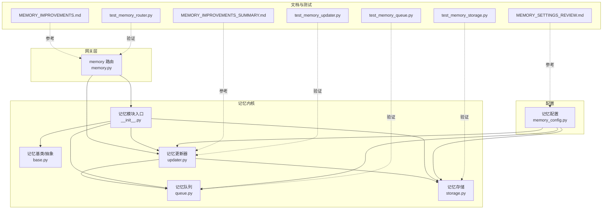
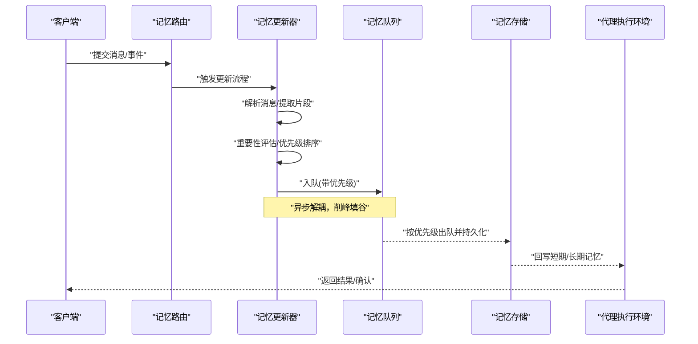
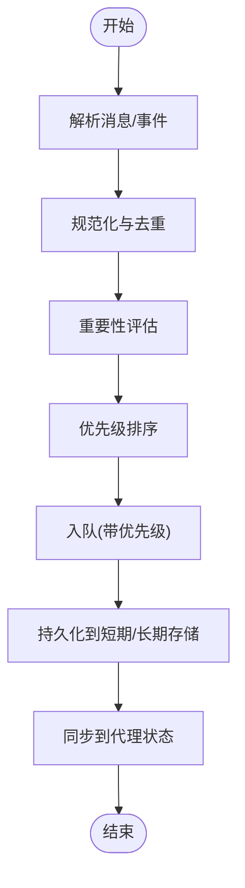
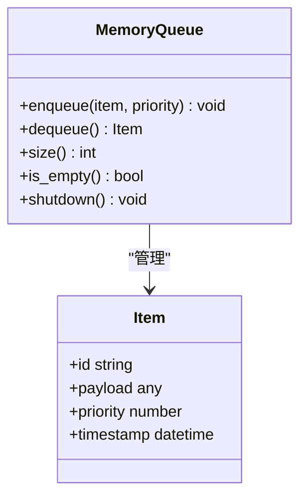
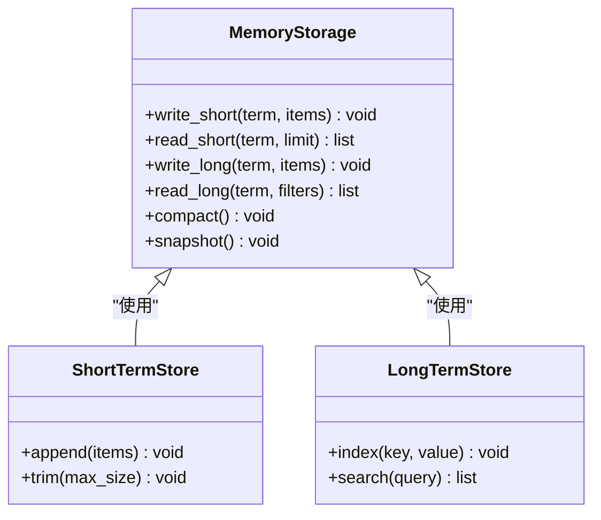
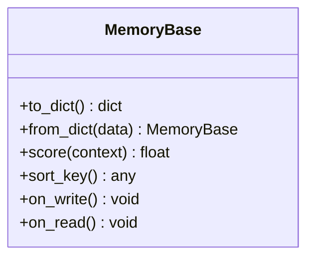
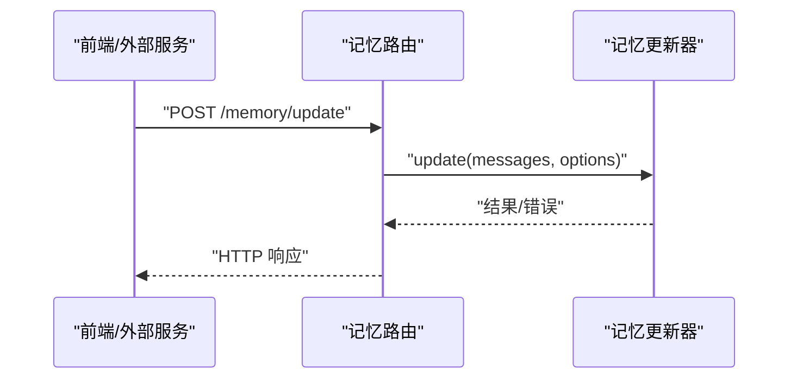
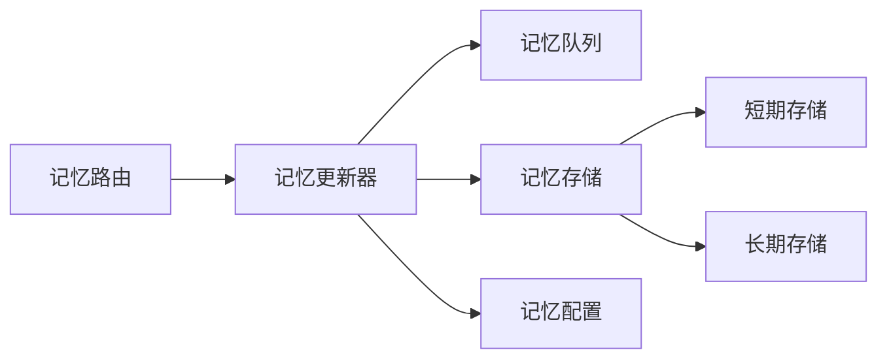

# 记忆架构设计

<cite>
**本文引用的文件**   
- [backend/app/gateway/routers/memory.py](file://backend/app/gateway/routers/memory.py)
- [backend/packages/harness/deerflow/agents/memory/__init__.py](file://backend/packages/harness/deerflow/agents/memory/__init__.py)
- [backend/packages/harness/deerflow/agents/memory/base.py](file://backend/packages/harness/deerflow/agents/memory/base.py)
- [backend/packages/harness/deerflow/agents/memory/updater.py](file://backend/packages/harness/deerflow/agents/memory/updater.py)
- [backend/packages/harness/deerflow/agents/memory/storage.py](file://backend/packages/harness/deerflow/agents/memory/storage.py)
- [backend/packages/harness/deerflow/agents/memory/queue.py](file://backend/packages/harness/deerflow/agents/memory/queue.py)
- [backend/packages/harness/deerflow/config/memory_config.py](file://backend/packages/harness/deerflow/config/memory_config.py)
- [backend/docs/MEMORY_IMPROVEMENTS.md](file://backend/docs/MEMORY_IMPROVEMENTS.md)
- [backend/docs/MEMORY_IMPROVEMENTS_SUMMARY.md](file://backend/docs/MEMORY_IMPROVEMENTS_SUMMARY.md)
- [backend/docs/MEMORY_SETTINGS_REVIEW.md](file://backend/docs/MEMORY_SETTINGS_REVIEW.md)
- [backend/tests/test_memory_queue.py](file://backend/tests/test_memory_queue.py)
- [backend/tests/test_memory_storage.py](file://backend/tests/test_memory_storage.py)
- [backend/tests/test_memory_updater.py](file://backend/tests/test_memory_updater.py)
- [backend/tests/test_memory_router.py](file://backend/tests/test_memory_router.py)
</cite>

## 目录
1. [简介](#简介)
2. [项目结构](#项目结构)
3. [核心组件](#核心组件)
4. [架构总览](#架构总览)
5. [详细组件分析](#详细组件分析)
6. [依赖关系分析](#依赖关系分析)
7. [性能考量](#性能考量)
8. [故障排查指南](#故障排查指南)
9. [结论](#结论)
10. [附录](#附录)

## 简介
本文件系统化阐述 DeerFlow 的记忆架构设计，重点覆盖以下方面：
- 短期记忆与长期记忆的分离原则与职责边界
- 从消息输入到记忆存储的完整数据流与处理管道
- 记忆层次结构设计：上下文窗口管理、重要性评估与优先级排序
- 与代理执行环境的集成方式：状态同步与一致性保证
- 关键组件架构图与数据流图
- 扩展点与自定义接口设计

## 项目结构
记忆系统主要位于后端 harness 的 agents.memory 模块以及网关路由 memory 中，配套配置在 config.memory_config，文档与测试分别位于 docs 与 tests。

图表来源
- [backend/app/gateway/routers/memory.py](file://backend/app/gateway/routers/memory.py)
- [backend/packages/harness/deerflow/agents/memory/__init__.py](file://backend/packages/harness/deerflow/agents/memory/__init__.py)
- [backend/packages/harness/deerflow/agents/memory/base.py](file://backend/packages/harness/deerflow/agents/memory/base.py)
- [backend/packages/harness/deerflow/agents/memory/updater.py](file://backend/packages/harness/deerflow/agents/memory/updater.py)
- [backend/packages/harness/deerflow/agents/memory/queue.py](file://backend/packages/harness/deerflow/agents/memory/queue.py)
- [backend/packages/harness/deerflow/agents/memory/storage.py](file://backend/packages/harness/deerflow/agents/memory/storage.py)
- [backend/packages/harness/deerflow/config/memory_config.py](file://backend/packages/harness/deerflow/config/memory_config.py)
- [backend/docs/MEMORY_IMPROVEMENTS.md](file://backend/docs/MEMORY_IMPROVEMENTS.md)
- [backend/docs/MEMORY_IMPROVEMENTS_SUMMARY.md](file://backend/docs/MEMORY_IMPROVEMENTS_SUMMARY.md)
- [backend/docs/MEMORY_SETTINGS_REVIEW.md](file://backend/docs/MEMORY_SETTINGS_REVIEW.md)
- [backend/tests/test_memory_queue.py](file://backend/tests/test_memory_queue.py)
- [backend/tests/test_memory_storage.py](file://backend/tests/test_memory_storage.py)
- [backend/tests/test_memory_updater.py](file://backend/tests/test_memory_updater.py)
- [backend/tests/test_memory_router.py](file://backend/tests/test_memory_router.py)

章节来源
- [backend/app/gateway/routers/memory.py](file://backend/app/gateway/routers/memory.py)
- [backend/packages/harness/deerflow/agents/memory/__init__.py](file://backend/packages/harness/deerflow/agents/memory/__init__.py)
- [backend/packages/harness/deerflow/agents/memory/base.py](file://backend/packages/harness/deerflow/agents/memory/base.py)
- [backend/packages/harness/deerflow/agents/memory/updater.py](file://backend/packages/harness/deerflow/agents/memory/updater.py)
- [backend/packages/harness/deerflow/agents/memory/queue.py](file://backend/packages/harness/deerflow/agents/memory/queue.py)
- [backend/packages/harness/deerflow/agents/memory/storage.py](file://backend/packages/harness/deerflow/agents/memory/storage.py)
- [backend/packages/harness/deerflow/config/memory_config.py](file://backend/packages/harness/deerflow/config/memory_config.py)
- [backend/docs/MEMORY_IMPROVEMENTS.md](file://backend/docs/MEMORY_IMPROVEMENTS.md)
- [backend/docs/MEMORY_IMPROVEMENTS_SUMMARY.md](file://backend/docs/MEMORY_IMPROVEMENTS_SUMMARY.md)
- [backend/docs/MEMORY_SETTINGS_REVIEW.md](file://backend/docs/MEMORY_SETTINGS_REVIEW.md)
- [backend/tests/test_memory_queue.py](file://backend/tests/test_memory_queue.py)
- [backend/tests/test_memory_storage.py](file://backend/tests/test_memory_storage.py)
- [backend/tests/test_memory_updater.py](file://backend/tests/test_memory_updater.py)
- [backend/tests/test_memory_router.py](file://backend/tests/test_memory_router.py)

## 核心组件
- 记忆路由（Gateway Memory Router）
  - 负责暴露记忆相关的 HTTP 接口，接收外部请求并委派给记忆更新器。
- 记忆更新器（Memory Updater）
  - 记忆系统的编排者：消费消息、计算重要性、入队、持久化、回写状态。
- 记忆队列（Memory Queue）
  - 异步缓冲与优先级调度，解耦写入与持久化，提升吞吐与稳定性。
- 记忆存储（Memory Storage）
  - 提供短期/长期记忆的统一读写接口，封装底层存储细节。
- 记忆基类（Memory Base）
  - 定义统一的数据模型、生命周期钩子与扩展点。
- 记忆配置（Memory Config）
  - 集中管理窗口大小、阈值、策略开关等参数。

章节来源
- [backend/app/gateway/routers/memory.py](file://backend/app/gateway/routers/memory.py)
- [backend/packages/harness/deerflow/agents/memory/updater.py](file://backend/packages/harness/deerflow/agents/memory/updater.py)
- [backend/packages/harness/deerflow/agents/memory/queue.py](file://backend/packages/harness/deerflow/agents/memory/queue.py)
- [backend/packages/harness/deerflow/agents/memory/storage.py](file://backend/packages/harness/deerflow/agents/memory/storage.py)
- [backend/packages/harness/deerflow/agents/memory/base.py](file://backend/packages/harness/deerflow/agents/memory/base.py)
- [backend/packages/harness/deerflow/config/memory_config.py](file://backend/packages/harness/deerflow/config/memory_config.py)

## 架构总览
DeerFlow 记忆系统采用“短/长记忆分离 + 异步队列 + 可插拔存储”的分层架构。消息进入后由更新器进行重要性评估与优先级排序，随后入队并由后台任务持久化至短期或长期存储；同时通过检查点机制与代理执行环境保持状态一致。

图表来源
- [backend/app/gateway/routers/memory.py](file://backend/app/gateway/routers/memory.py)
- [backend/packages/harness/deerflow/agents/memory/updater.py](file://backend/packages/harness/deerflow/agents/memory/updater.py)
- [backend/packages/harness/deerflow/agents/memory/queue.py](file://backend/packages/harness/deerflow/agents/memory/queue.py)
- [backend/packages/harness/deerflow/agents/memory/storage.py](file://backend/packages/harness/deerflow/agents/memory/storage.py)

## 详细组件分析

### 记忆更新器（Memory Updater）
- 职责
  - 接收消息，进行清洗与分片，调用重要性评估与优先级排序，将条目入队。
  - 协调短期/长期记忆的策略切换与合并。
- 关键流程
  - 输入校验与规范化
  - 片段抽取与去重
  - 重要性评分与优先级计算
  - 入队与批量持久化
- 错误处理
  - 对不可恢复错误进行降级与重试，记录诊断信息。

图表来源
- [backend/packages/harness/deerflow/agents/memory/updater.py](file://backend/packages/harness/deerflow/agents/memory/updater.py)

章节来源
- [backend/packages/harness/deerflow/agents/memory/updater.py](file://backend/packages/harness/deerflow/agents/memory/updater.py)
- [backend/tests/test_memory_updater.py](file://backend/tests/test_memory_updater.py)

### 记忆队列（Memory Queue）
- 职责
  - 提供带优先级的有界队列，支持异步消费与背压控制。
  - 保障高并发下的顺序性与幂等性。
- 特性
  - 优先级调度、容量限制、失败重试、监控指标上报。
- 复杂度
  - 入队/出队通常为 O(log n)，n 为队列长度。

图表来源
- [backend/packages/harness/deerflow/agents/memory/queue.py](file://backend/packages/harness/deerflow/agents/memory/queue.py)

章节来源
- [backend/packages/harness/deerflow/agents/memory/queue.py](file://backend/packages/harness/deerflow/agents/memory/queue.py)
- [backend/tests/test_memory_queue.py](file://backend/tests/test_memory_queue.py)

### 记忆存储（Memory Storage）
- 职责
  - 提供统一的短期/长期记忆读写接口，屏蔽底层实现差异。
  - 维护索引、版本与一致性标记。
- 能力
  - 批量写入、范围查询、过期清理、快照与回滚。
- 一致性
  - 通过事务或原子操作确保同一会话内的一致性视图。

图表来源
- [backend/packages/harness/deerflow/agents/memory/storage.py](file://backend/packages/harness/deerflow/agents/memory/storage.py)

章节来源
- [backend/packages/harness/deerflow/agents/memory/storage.py](file://backend/packages/harness/deerflow/agents/memory/storage.py)
- [backend/tests/test_memory_storage.py](file://backend/tests/test_memory_storage.py)

### 记忆基类（Memory Base）
- 职责
  - 定义记忆项数据结构、生命周期钩子与通用工具方法。
  - 提供可扩展的评估与排序接口，便于替换策略。
- 扩展点
  - 自定义重要性函数、优先级规则、序列化/反序列化逻辑。

图表来源
- [backend/packages/harness/deerflow/agents/memory/base.py](file://backend/packages/harness/deerflow/agents/memory/base.py)

章节来源
- [backend/packages/harness/deerflow/agents/memory/base.py](file://backend/packages/harness/deerflow/agents/memory/base.py)

### 记忆路由（Gateway Memory Router）
- 职责
  - 暴露 REST 接口，接收前端或外部服务提交的记忆相关请求。
  - 鉴权、限流、日志与错误码标准化。
- 集成
  - 调用记忆更新器完成一次完整的写入流程。

图表来源
- [backend/app/gateway/routers/memory.py](file://backend/app/gateway/routers/memory.py)

章节来源
- [backend/app/gateway/routers/memory.py](file://backend/app/gateway/routers/memory.py)
- [backend/tests/test_memory_router.py](file://backend/tests/test_memory_router.py)

### 记忆配置（Memory Config）
- 职责
  - 集中管理短期/长期记忆的参数：窗口大小、阈值、策略开关、超时与重试次数。
- 典型键
  - 短期窗口上限、长期压缩阈值、优先级权重、最大入队数、持久化批大小。

章节来源
- [backend/packages/harness/deerflow/config/memory_config.py](file://backend/packages/harness/deerflow/config/memory_config.py)
- [backend/docs/MEMORY_SETTINGS_REVIEW.md](file://backend/docs/MEMORY_SETTINGS_REVIEW.md)

## 依赖关系分析
- 耦合与内聚
  - 更新器强依赖队列与存储，但通过基类与配置降低硬编码耦合。
  - 路由仅依赖更新器，保持薄控制器风格。
- 外部依赖
  - 存储可能对接文件系统、对象存储或数据库，具体实现由 storage 抽象。
- 循环依赖
  - 当前分层清晰，未见循环导入风险。

图表来源
- [backend/app/gateway/routers/memory.py](file://backend/app/gateway/routers/memory.py)
- [backend/packages/harness/deerflow/agents/memory/updater.py](file://backend/packages/harness/deerflow/agents/memory/updater.py)
- [backend/packages/harness/deerflow/agents/memory/queue.py](file://backend/packages/harness/deerflow/agents/memory/queue.py)
- [backend/packages/harness/deerflow/agents/memory/storage.py](file://backend/packages/harness/deerflow/agents/memory/storage.py)
- [backend/packages/harness/deerflow/config/memory_config.py](file://backend/packages/harness/deerflow/config/memory_config.py)

章节来源
- [backend/app/gateway/routers/memory.py](file://backend/app/gateway/routers/memory.py)
- [backend/packages/harness/deerflow/agents/memory/updater.py](file://backend/packages/harness/deerflow/agents/memory/updater.py)
- [backend/packages/harness/deerflow/agents/memory/queue.py](file://backend/packages/harness/deerflow/agents/memory/queue.py)
- [backend/packages/harness/deerflow/agents/memory/storage.py](file://backend/packages/harness/deerflow/agents/memory/storage.py)
- [backend/packages/harness/deerflow/config/memory_config.py](file://backend/packages/harness/deerflow/config/memory_config.py)

## 性能考量
- 异步队列削峰
  - 通过优先级队列解耦写入与持久化，避免峰值阻塞。
- 批量持久化
  - 存储端采用批量写入减少 I/O 次数。
- 窗口裁剪与压缩
  - 短期记忆按窗口上限裁剪，长期记忆定期压缩以控制体积。
- 优先级与公平性
  - 基于重要性与时效性综合打分，兼顾热点与冷数据。
- 监控与可观测性
  - 建议暴露队列长度、入队/出队速率、持久化延迟等指标。

[本节为通用指导，不直接分析具体文件]

## 故障排查指南
- 常见问题定位
  - 入队失败：检查队列容量与优先级字段是否合法。
  - 持久化异常：查看存储后端连通性与权限。
  - 状态不一致：核对检查点与回写流程是否成功。
- 测试用例参考
  - 队列行为、存储读写、更新器流程与路由接口的单测可作为回归依据。

章节来源
- [backend/tests/test_memory_queue.py](file://backend/tests/test_memory_queue.py)
- [backend/tests/test_memory_storage.py](file://backend/tests/test_memory_storage.py)
- [backend/tests/test_memory_updater.py](file://backend/tests/test_memory_updater.py)
- [backend/tests/test_memory_router.py](file://backend/tests/test_memory_router.py)

## 结论
DeerFlow 的记忆架构通过短/长记忆分离、异步优先级队列与可插拔存储，实现了高吞吐、低延迟且可扩展的记忆体系。结合配置化的策略与完善的测试覆盖，系统在复杂场景下仍能保持稳定与可维护性。

[本节为总结性内容，不直接分析具体文件]

## 附录
- 设计决策参考
  - 短期记忆用于近邻上下文，强调时效与快速访问。
  - 长期记忆用于跨会话知识沉淀，强调检索与压缩。
  - 重要性评估与优先级排序是平衡质量与成本的关键。
- 扩展与定制
  - 通过基类与配置注入自定义评分器、排序器与存储后端。
  - 可在更新器中接入新的预处理/后处理阶段。

章节来源
- [backend/docs/MEMORY_IMPROVEMENTS.md](file://backend/docs/MEMORY_IMPROVEMENTS.md)
- [backend/docs/MEMORY_IMPROVEMENTS_SUMMARY.md](file://backend/docs/MEMORY_IMPROVEMENTS_SUMMARY.md)
- [backend/docs/MEMORY_SETTINGS_REVIEW.md](file://backend/docs/MEMORY_SETTINGS_REVIEW.md)