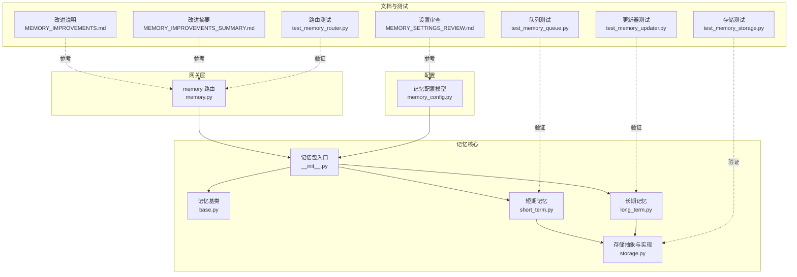
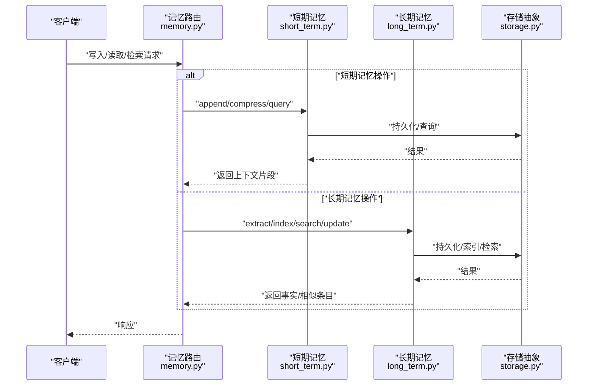
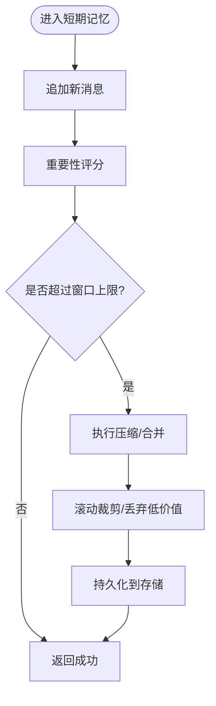
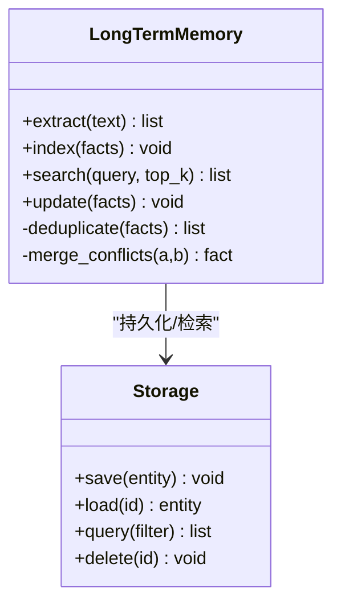
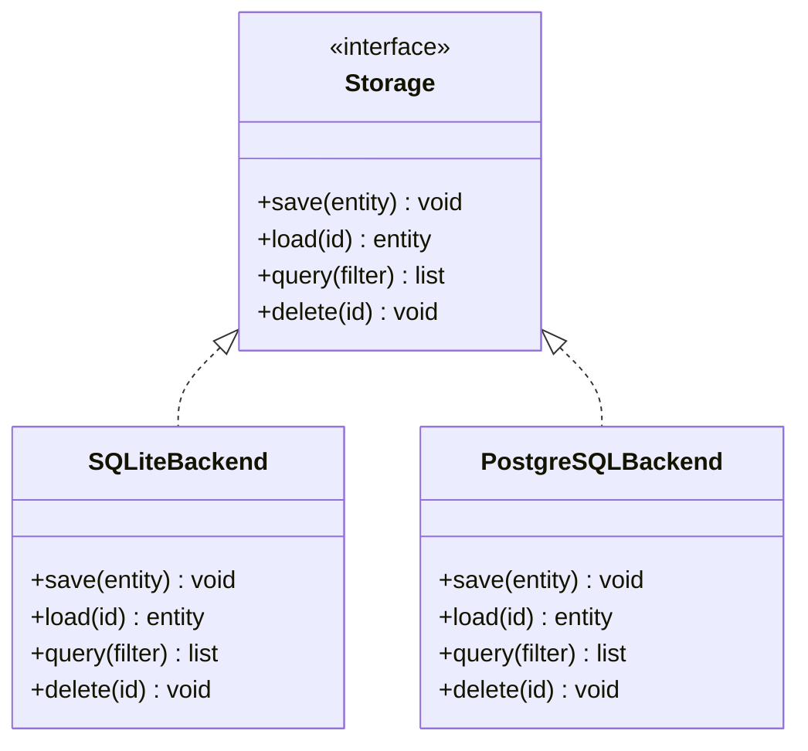
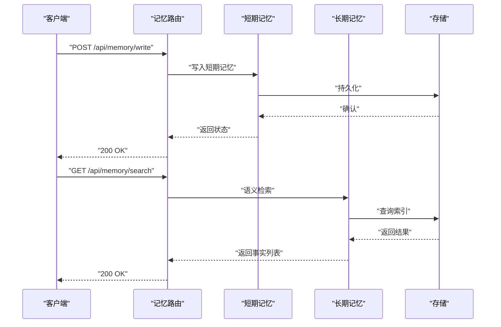
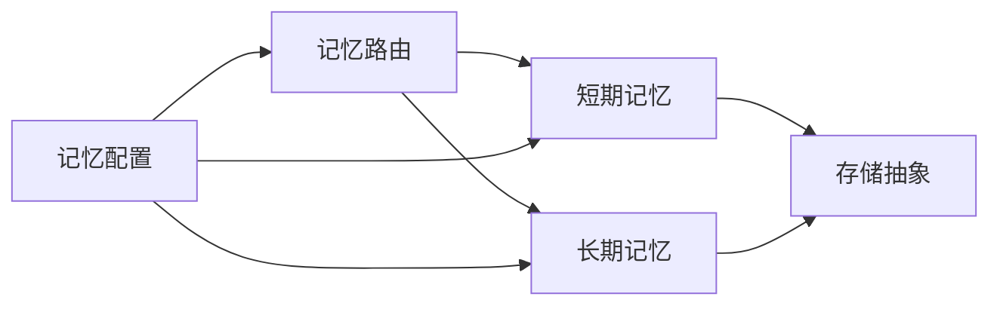

# 记忆系统

<cite>
**本文引用的文件**   
- [backend/app/gateway/routers/memory.py](file://backend/app/gateway/routers/memory.py)
- [backend/packages/harness/deerflow/agents/memory/__init__.py](file://backend/packages/harness/deerflow/agents/memory/__init__.py)
- [backend/packages/harness/deerflow/agents/memory/base.py](file://backend/packages/harness/deerflow/agents/memory/base.py)
- [backend/packages/harness/deerflow/agents/memory/short_term.py](file://backend/packages/harness/deerflow/agents/memory/short_term.py)
- [backend/packages/harness/deerflow/agents/memory/long_term.py](file://backend/packages/harness/deerflow/agents/memory/long_term.py)
- [backend/packages/harness/deerflow/agents/memory/storage.py](file://backend/packages/harness/deerflow/agents/memory/storage.py)
- [backend/packages/harness/deerflow/config/memory_config.py](file://backend/packages/harness/deerflow/config/memory_config.py)
- [backend/docs/MEMORY_IMPROVEMENTS.md](file://backend/docs/MEMORY_IMPROVEMENTS.md)
- [backend/docs/MEMORY_IMPROVEMENTS_SUMMARY.md](file://backend/docs/MEMORY_IMPROVEMENTS_SUMMARY.md)
- [backend/docs/MEMORY_SETTINGS_REVIEW.md](file://backend/docs/MEMORY_SETTINGS_REVIEW.md)
- [backend/tests/test_memory_storage.py](file://backend/tests/test_memory_storage.py)
- [backend/tests/test_memory_updater.py](file://backend/tests/test_memory_updater.py)
- [backend/tests/test_memory_queue.py](file://backend/tests/test_memory_queue.py)
- [backend/tests/test_memory_router.py](file://backend/tests/test_memory_router.py)
</cite>

## 目录
1. [简介](#简介)
2. [项目结构](#项目结构)
3. [核心组件](#核心组件)
4. [架构总览](#架构总览)
5. [详细组件分析](#详细组件分析)
6. [依赖关系分析](#依赖关系分析)
7. [性能考量](#性能考量)
8. [故障排查指南](#故障排查指南)
9. [结论](#结论)
10. [附录](#附录)

## 简介
本文件系统性梳理 DeerFlow 的记忆系统，围绕短期记忆与长期记忆的职责划分、存储策略、更新与清理机制、持久化后端、配置项与优化建议、监控调试方法以及工程最佳实践展开。目标是帮助开发者快速理解并高效使用记忆子系统，同时为后续扩展与维护提供清晰的技术蓝图。

## 项目结构
记忆系统主要位于后端 harness 的 agents.memory 模块中，并通过网关路由对外暴露 API；相关文档与测试覆盖在 docs 与 tests 目录下。

图表来源
- [backend/app/gateway/routers/memory.py](file://backend/app/gateway/routers/memory.py)
- [backend/packages/harness/deerflow/agents/memory/__init__.py](file://backend/packages/harness/deerflow/agents/memory/__init__.py)
- [backend/packages/harness/deerflow/agents/memory/base.py](file://backend/packages/harness/deerflow/agents/memory/base.py)
- [backend/packages/harness/deerflow/agents/memory/short_term.py](file://backend/packages/harness/deerflow/agents/memory/short_term.py)
- [backend/packages/harness/deerflow/agents/memory/long_term.py](file://backend/packages/harness/deerflow/agents/memory/long_term.py)
- [backend/packages/harness/deerflow/agents/memory/storage.py](file://backend/packages/harness/deerflow/agents/memory/storage.py)
- [backend/packages/harness/deerflow/config/memory_config.py](file://backend/packages/harness/deerflow/config/memory_config.py)
- [backend/docs/MEMORY_IMPROVEMENTS.md](file://backend/docs/MEMORY_IMPROVEMENTS.md)
- [backend/docs/MEMORY_IMPROVEMENTS_SUMMARY.md](file://backend/docs/MEMORY_IMPROVEMENTS_SUMMARY.md)
- [backend/docs/MEMORY_SETTINGS_REVIEW.md](file://backend/docs/MEMORY_SETTINGS_REVIEW.md)
- [backend/tests/test_memory_storage.py](file://backend/tests/test_memory_storage.py)
- [backend/tests/test_memory_updater.py](file://backend/tests/test_memory_updater.py)
- [backend/tests/test_memory_queue.py](file://backend/tests/test_memory_queue.py)
- [backend/tests/test_memory_router.py](file://backend/tests/test_memory_router.py)

章节来源
- [backend/app/gateway/routers/memory.py](file://backend/app/gateway/routers/memory.py)
- [backend/packages/harness/deerflow/agents/memory/__init__.py](file://backend/packages/harness/deerflow/agents/memory/__init__.py)
- [backend/packages/harness/deerflow/agents/memory/base.py](file://backend/packages/harness/deerflow/agents/memory/base.py)
- [backend/packages/harness/deerflow/agents/memory/short_term.py](file://backend/packages/harness/deerflow/agents/memory/short_term.py)
- [backend/packages/harness/deerflow/agents/memory/long_term.py](file://backend/packages/harness/deerflow/agents/memory/long_term.py)
- [backend/packages/harness/deerflow/agents/memory/storage.py](file://backend/packages/harness/deerflow/agents/memory/storage.py)
- [backend/packages/harness/deerflow/config/memory_config.py](file://backend/packages/harness/deerflow/config/memory_config.py)
- [backend/docs/MEMORY_IMPROVEMENTS.md](file://backend/docs/MEMORY_IMPROVEMENTS.md)
- [backend/docs/MEMORY_IMPROVEMENTS_SUMMARY.md](file://backend/docs/MEMORY_IMPROVEMENTS_SUMMARY.md)
- [backend/docs/MEMORY_SETTINGS_REVIEW.md](file://backend/docs/MEMORY_SETTINGS_REVIEW.md)
- [backend/tests/test_memory_storage.py](file://backend/tests/test_memory_storage.py)
- [backend/tests/test_memory_updater.py](file://backend/tests/test_memory_updater.py)
- [backend/tests/test_memory_queue.py](file://backend/tests/test_memory_queue.py)
- [backend/tests/test_memory_router.py](file://backend/tests/test_memory_router.py)

## 核心组件
- 记忆基类：定义统一的读写接口、生命周期钩子与通用能力（如序列化、错误处理）。
- 短期记忆：面向会话上下文窗口，负责消息压缩、重要性评估与滚动裁剪，确保在有限窗口内保留高价值信息。
- 长期记忆：面向跨会话事实与知识，负责事实提取、语义索引与检索，支持增量更新与去重合并。
- 存储抽象：统一持久化接口，屏蔽底层差异，支持 SQLite、PostgreSQL 等后端。
- 配置模型：集中管理记忆系统的开关、阈值、容量、索引策略与后端参数。

章节来源
- [backend/packages/harness/deerflow/agents/memory/base.py](file://backend/packages/harness/deerflow/agents/memory/base.py)
- [backend/packages/harness/deerflow/agents/memory/short_term.py](file://backend/packages/harness/deerflow/agents/memory/short_term.py)
- [backend/packages/harness/deerflow/agents/memory/long_term.py](file://backend/packages/harness/deerflow/agents/memory/long_term.py)
- [backend/packages/harness/deerflow/agents/memory/storage.py](file://backend/packages/harness/deerflow/agents/memory/storage.py)
- [backend/packages/harness/deerflow/config/memory_config.py](file://backend/packages/harness/deerflow/config/memory_config.py)

## 架构总览
整体采用“网关路由 + 记忆服务 + 存储抽象”的分层设计。网关暴露 REST 接口，调用记忆服务完成读写与检索；短期与长期记忆共享存储抽象，便于替换与扩展。

图表来源
- [backend/app/gateway/routers/memory.py](file://backend/app/gateway/routers/memory.py)
- [backend/packages/harness/deerflow/agents/memory/short_term.py](file://backend/packages/harness/deerflow/agents/memory/short_term.py)
- [backend/packages/harness/deerflow/agents/memory/long_term.py](file://backend/packages/harness/deerflow/agents/memory/long_term.py)
- [backend/packages/harness/deerflow/agents/memory/storage.py](file://backend/packages/harness/deerflow/agents/memory/storage.py)

## 详细组件分析

### 短期记忆（Short-Term Memory）
职责与特性
- 维护当前会话的上下文窗口，控制消息数量与长度，避免超出模型上下文限制。
- 对历史消息进行重要性评估与压缩，保留关键对话要点与决策依据。
- 支持滚动裁剪与选择性丢弃，保证低延迟与稳定吞吐。

关键流程
- 写入：接收新消息，计算重要性分数，必要时触发压缩或裁剪。
- 压缩：基于相似度与重要性合并相邻消息，减少冗余。
- 检索：按时间顺序与相关性混合排序，返回适合当前上下文的片段。

图表来源
- [backend/packages/harness/deerflow/agents/memory/short_term.py](file://backend/packages/harness/deerflow/agents/memory/short_term.py)
- [backend/packages/harness/deerflow/agents/memory/storage.py](file://backend/packages/harness/deerflow/agents/memory/storage.py)

章节来源
- [backend/packages/harness/deerflow/agents/memory/short_term.py](file://backend/packages/harness/deerflow/agents/memory/short_term.py)
- [backend/tests/test_memory_queue.py](file://backend/tests/test_memory_queue.py)

### 长期记忆（Long-Term Memory）
职责与特性
- 从对话中提取可复用的事实与知识，形成结构化条目。
- 构建语义索引，支持向量检索与关键词匹配，提高召回质量。
- 支持增量更新、去重合并与版本演进，保持知识库一致性。

关键流程
- 提取：识别实体、关系与断言，生成事实三元组或结构化记录。
- 索引：将文本向量化并建立倒排/向量索引，提升检索效率。
- 检索：根据查询意图进行语义匹配与过滤，返回最相关的事实集合。
- 更新：合并重复事实，修正过时信息，记录变更历史。

图表来源
- [backend/packages/harness/deerflow/agents/memory/long_term.py](file://backend/packages/harness/deerflow/agents/memory/long_term.py)
- [backend/packages/harness/deerflow/agents/memory/storage.py](file://backend/packages/harness/deerflow/agents/memory/storage.py)

章节来源
- [backend/packages/harness/deerflow/agents/memory/long_term.py](file://backend/packages/harness/deerflow/agents/memory/long_term.py)
- [backend/tests/test_memory_updater.py](file://backend/tests/test_memory_updater.py)

### 存储抽象与持久化（Storage Abstraction）
职责与特性
- 定义统一的保存、加载、查询与删除接口，屏蔽不同数据库的差异。
- 支持多种后端（如 SQLite、PostgreSQL），通过配置切换。
- 提供事务与重试保障，增强可靠性与一致性。

图表来源
- [backend/packages/harness/deerflow/agents/memory/storage.py](file://backend/packages/harness/deerflow/agents/memory/storage.py)
- [backend/tests/test_memory_storage.py](file://backend/tests/test_memory_storage.py)

章节来源
- [backend/packages/harness/deerflow/agents/memory/storage.py](file://backend/packages/harness/deerflow/agents/memory/storage.py)
- [backend/tests/test_memory_storage.py](file://backend/tests/test_memory_storage.py)

### 网关路由（Gateway Router）
职责与特性
- 暴露记忆相关的 HTTP 接口，包括写入、读取、检索与批量操作。
- 校验请求参数，转发至短期/长期记忆服务，封装统一响应格式。
- 集成鉴权、限流与日志追踪，便于运维监控。

图表来源
- [backend/app/gateway/routers/memory.py](file://backend/app/gateway/routers/memory.py)
- [backend/packages/harness/deerflow/agents/memory/short_term.py](file://backend/packages/harness/deerflow/agents/memory/short_term.py)
- [backend/packages/harness/deerflow/agents/memory/long_term.py](file://backend/packages/harness/deerflow/agents/memory/long_term.py)
- [backend/packages/harness/deerflow/agents/memory/storage.py](file://backend/packages/harness/deerflow/agents/memory/storage.py)

章节来源
- [backend/app/gateway/routers/memory.py](file://backend/app/gateway/routers/memory.py)
- [backend/tests/test_memory_router.py](file://backend/tests/test_memory_router.py)

### 配置模型（Memory Configuration）
职责与特性
- 集中管理短期/长期记忆的开关、容量、阈值、索引策略与后端连接参数。
- 提供默认值与环境变量覆盖，便于多环境部署与动态调整。
- 包含监控与调试选项，如日志级别、采样率与指标上报。

章节来源
- [backend/packages/harness/deerflow/config/memory_config.py](file://backend/packages/harness/deerflow/config/memory_config.py)
- [backend/docs/MEMORY_SETTINGS_REVIEW.md](file://backend/docs/MEMORY_SETTINGS_REVIEW.md)

## 依赖关系分析
- 路由层依赖记忆服务，记忆服务依赖存储抽象。
- 短期记忆与长期记忆共享存储抽象，降低耦合度。
- 配置模型贯穿各层，影响行为与性能。

图表来源
- [backend/app/gateway/routers/memory.py](file://backend/app/gateway/routers/memory.py)
- [backend/packages/harness/deerflow/agents/memory/short_term.py](file://backend/packages/harness/deerflow/agents/memory/short_term.py)
- [backend/packages/harness/deerflow/agents/memory/long_term.py](file://backend/packages/harness/deerflow/agents/memory/long_term.py)
- [backend/packages/harness/deerflow/agents/memory/storage.py](file://backend/packages/harness/deerflow/agents/memory/storage.py)
- [backend/packages/harness/deerflow/config/memory_config.py](file://backend/packages/harness/deerflow/config/memory_config.py)

章节来源
- [backend/app/gateway/routers/memory.py](file://backend/app/gateway/routers/memory.py)
- [backend/packages/harness/deerflow/agents/memory/short_term.py](file://backend/packages/harness/deerflow/agents/memory/short_term.py)
- [backend/packages/harness/deerflow/agents/memory/long_term.py](file://backend/packages/harness/deerflow/agents/memory/long_term.py)
- [backend/packages/harness/deerflow/agents/memory/storage.py](file://backend/packages/harness/deerflow/agents/memory/storage.py)
- [backend/packages/harness/deerflow/config/memory_config.py](file://backend/packages/harness/deerflow/config/memory_config.py)

## 性能考量
- 短期记忆
  - 合理设置窗口大小与压缩阈值，避免频繁压缩导致额外开销。
  - 重要性评分算法应轻量且可并行，减少阻塞。
  - 对高频读路径引入缓存，降低存储压力。
- 长期记忆
  - 索引构建与更新应异步化，避免影响主流程。
  - 向量维度与相似度阈值需权衡召回率与延迟。
  - 定期去重与合并，控制知识库膨胀。
- 存储后端
  - 选择合适的数据库与连接池大小，避免连接耗尽。
  - 对热点数据启用本地缓存，减少远程 I/O。
  - 监控慢查询与锁竞争，及时优化索引与查询计划。

[本节为通用指导，不直接分析具体文件]

## 故障排查指南
- 常见问题定位
  - 写入失败：检查存储连接、权限与事务回滚原因。
  - 检索不准：调整索引策略、相似度阈值与过滤条件。
  - 上下文溢出：调小窗口或提高压缩强度，观察效果。
- 诊断手段
  - 开启详细日志与追踪，记录关键步骤耗时与错误堆栈。
  - 使用测试用例复现问题，逐步缩小范围。
  - 导出快照与样本数据，离线分析索引与查询计划。

章节来源
- [backend/tests/test_memory_storage.py](file://backend/tests/test_memory_storage.py)
- [backend/tests/test_memory_updater.py](file://backend/tests/test_memory_updater.py)
- [backend/tests/test_memory_queue.py](file://backend/tests/test_memory_queue.py)
- [backend/tests/test_memory_router.py](file://backend/tests/test_memory_router.py)

## 结论
DeerFlow 记忆系统通过清晰的短期/长期分离、统一的存储抽象与完善的配置体系，实现了可扩展、高性能与易维护的知识管理方案。结合合理的压缩与索引策略、异步更新与监控调试手段，可在复杂业务场景中稳定运行并提供高质量上下文与知识检索能力。

[本节为总结性内容，不直接分析具体文件]

## 附录
- 改进与回顾
  - 阅读改进说明与摘要，了解近期优化点与迁移注意事项。
  - 参考设置审查文档，掌握关键配置项的影响与推荐值。

章节来源
- [backend/docs/MEMORY_IMPROVEMENTS.md](file://backend/docs/MEMORY_IMPROVEMENTS.md)
- [backend/docs/MEMORY_IMPROVEMENTS_SUMMARY.md](file://backend/docs/MEMORY_IMPROVEMENTS_SUMMARY.md)
- [backend/docs/MEMORY_SETTINGS_REVIEW.md](file://backend/docs/MEMORY_SETTINGS_REVIEW.md)