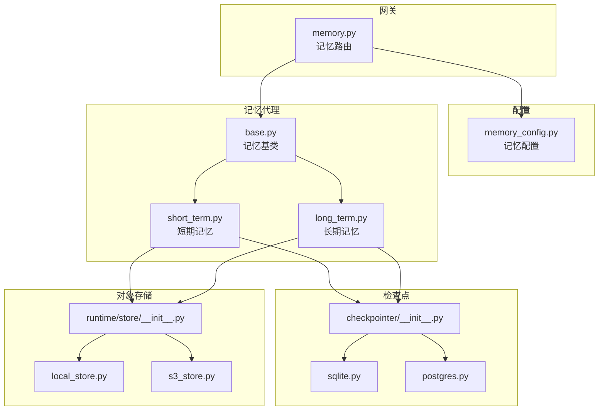
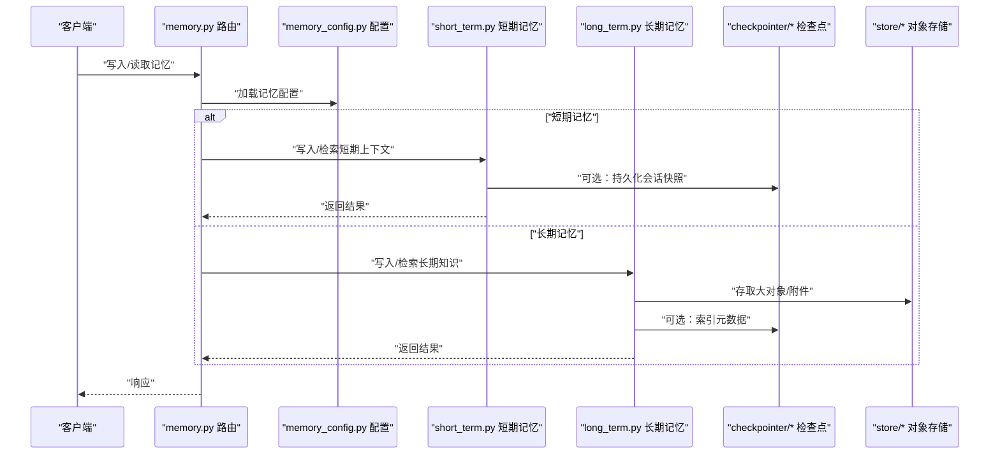
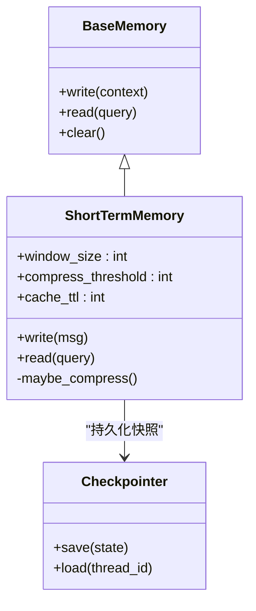
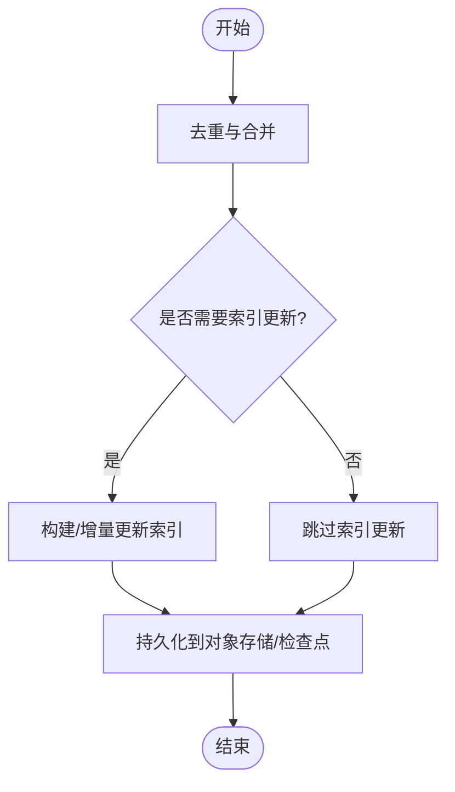
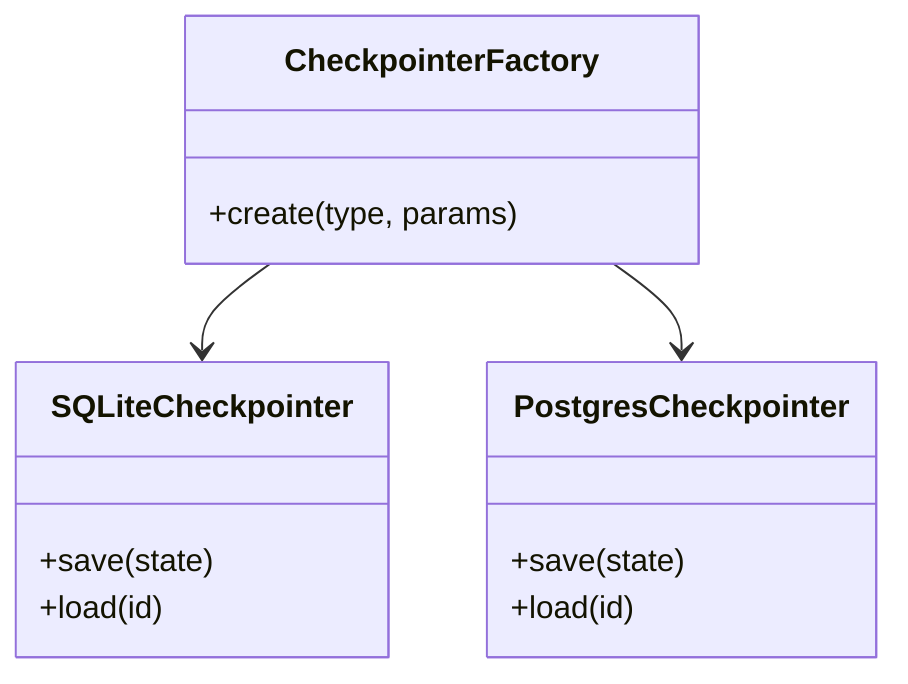
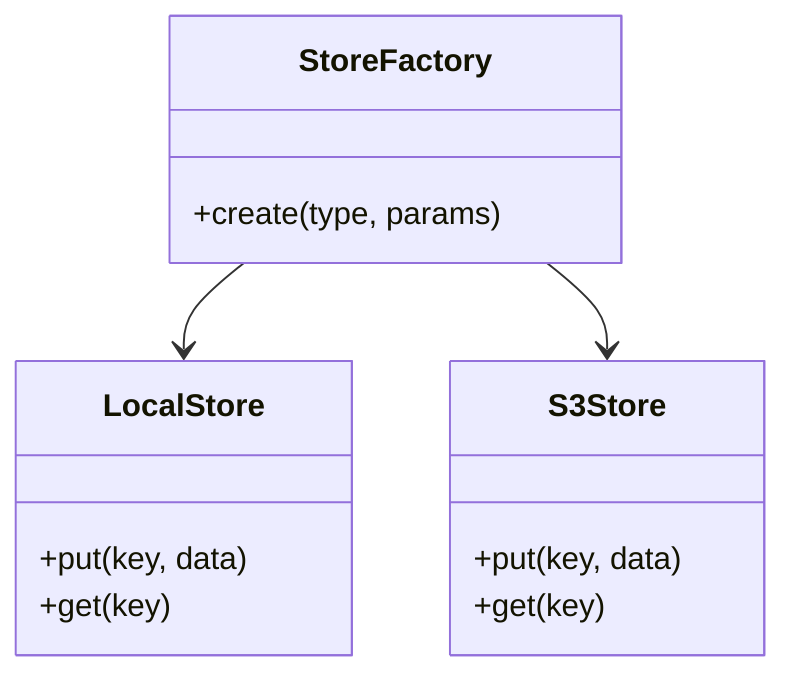
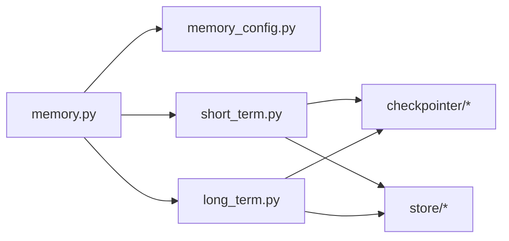

# 记忆配置与优化

<cite>
**本文引用的文件**
- [backend/app/gateway/routers/memory.py](file://backend/app/gateway/routers/memory.py)
- [backend/packages/harness/deerflow/config/memory_config.py](file://backend/packages/harness/deerflow/config/memory_config.py)
- [backend/packages/harness/deerflow/agents/memory/__init__.py](file://backend/packages/harness/deerflow/agents/memory/__init__.py)
- [backend/packages/harness/deerflow/agents/memory/base.py](file://backend/packages/harness/deerflow/agents/memory/base.py)
- [backend/packages/harness/deerflow/agents/memory/short_term.py](file://backend/packages/harness/deerflow/agents/memory/short_term.py)
- [backend/packages/harness/deerflow/agents/memory/long_term.py](file://backend/packages/harness/deerflow/agents/memory/long_term.py)
- [backend/packages/harness/deerflow/agents/checkpointer/__init__.py](file://backend/packages/harness/deerflow/agents/checkpointer/__init__.py)
- [backend/packages/harness/deerflow/agents/checkpointer/sqlite.py](file://backend/packages/harness/deerflow/agents/checkpointer/sqlite.py)
- [backend/packages/harness/deerflow/agents/checkpointer/postgres.py](file://backend/packages/harness/deerflow/agents/checkpointer/postgres.py)
- [backend/packages/harness/deerflow/runtime/store/__init__.py](file://backend/packages/harness/deerflow/runtime/store/__init__.py)
- [backend/packages/harness/deerflow/runtime/store/local_store.py](file://backend/packages/harness/deerflow/runtime/store/local_store.py)
- [backend/packages/harness/deerflow/runtime/store/s3_store.py](file://backend/packages/harness/deerflow/runtime/store/s3_store.py)
- [backend/docs/MEMORY_IMPROVEMENTS.md](file://backend/docs/MEMORY_IMPROVEMENTS.md)
- [backend/docs/MEMORY_SETTINGS_REVIEW.md](file://backend/docs/MEMORY_SETTINGS_REVIEW.md)
- [backend/docs/memory-settings-sample.json](file://backend/docs/memory-settings-sample.json)
- [backend/tests/test_memory_storage.py](file://backend/tests/test_memory_storage.py)
- [backend/tests/test_memory_queue.py](file://backend/tests/test_memory_queue.py)
- [backend/tests/test_memory_router.py](file://backend/tests/test_memory_router.py)
</cite>

## 目录
1. [简介](#简介)
2. [项目结构](#项目结构)
3. [核心组件](#核心组件)
4. [架构总览](#架构总览)
5. [详细组件分析](#详细组件分析)
6. [依赖关系分析](#依赖关系分析)
7. [性能考虑](#性能考虑)
8. [故障排查指南](#故障排查指南)
9. [结论](#结论)
10. [附录](#附录)

## 简介
本文件聚焦于“记忆系统”的配置与优化，覆盖短期记忆、长期记忆与存储后端的配置项；内存使用优化（垃圾回收、内存限制、泄漏检测）；性能调优（批量操作、查询优化、索引策略）；资源管理（连接池、超时、重试）；不同环境的推荐配置模板；以及监控指标与诊断工具的使用方法与常见问题排查。

## 项目结构
记忆相关代码主要分布在后端网关路由、记忆配置、记忆代理实现、检查点（持久化状态）与运行时对象存储等模块中：
- 网关层：提供记忆读写接口
- 配置层：统一加载并校验记忆参数
- 代理层：短期/长期记忆的具体实现
- 检查点层：会话状态的持久化后端
- 存储层：本地/S3 等对象存储后端

图表来源
- [backend/app/gateway/routers/memory.py](file://backend/app/gateway/routers/memory.py)
- [backend/packages/harness/deerflow/config/memory_config.py](file://backend/packages/harness/deerflow/config/memory_config.py)
- [backend/packages/harness/deerflow/agents/memory/base.py](file://backend/packages/harness/deerflow/agents/memory/base.py)
- [backend/packages/harness/deerflow/agents/memory/short_term.py](file://backend/packages/harness/deerflow/agents/memory/short_term.py)
- [backend/packages/harness/deerflow/agents/memory/long_term.py](file://backend/packages/harness/deerflow/agents/memory/long_term.py)
- [backend/packages/harness/deerflow/agents/checkpointer/__init__.py](file://backend/packages/harness/deerflow/agents/checkpointer/__init__.py)
- [backend/packages/harness/deerflow/agents/checkpointer/sqlite.py](file://backend/packages/harness/deerflow/agents/checkpointer/sqlite.py)
- [backend/packages/harness/deerflow/agents/checkpointer/postgres.py](file://backend/packages/harness/deerflow/agents/checkpointer/postgres.py)
- [backend/packages/harness/deerflow/runtime/store/__init__.py](file://backend/packages/harness/deerflow/runtime/store/__init__.py)
- [backend/packages/harness/deerflow/runtime/store/local_store.py](file://backend/packages/harness/deerflow/runtime/store/local_store.py)
- [backend/packages/harness/deerflow/runtime/store/s3_store.py](file://backend/packages/harness/deerflow/runtime/store/s3_store.py)

章节来源
- [backend/app/gateway/routers/memory.py](file://backend/app/gateway/routers/memory.py)
- [backend/packages/harness/deerflow/config/memory_config.py](file://backend/packages/harness/deerflow/config/memory_config.py)
- [backend/packages/harness/deerflow/agents/memory/base.py](file://backend/packages/harness/deerflow/agents/memory/base.py)
- [backend/packages/harness/deerflow/agents/memory/short_term.py](file://backend/packages/harness/deerflow/agents/memory/short_term.py)
- [backend/packages/harness/deerflow/agents/memory/long_term.py](file://backend/packages/harness/deerflow/agents/memory/long_term.py)
- [backend/packages/harness/deerflow/agents/checkpointer/__init__.py](file://backend/packages/harness/deerflow/agents/checkpointer/__init__.py)
- [backend/packages/harness/deerflow/agents/checkpointer/sqlite.py](file://backend/packages/harness/deerflow/agents/checkpointer/sqlite.py)
- [backend/packages/harness/deerflow/agents/checkpointer/postgres.py](file://backend/packages/harness/deerflow/agents/checkpointer/postgres.py)
- [backend/packages/harness/deerflow/runtime/store/__init__.py](file://backend/packages/harness/deerflow/runtime/store/__init__.py)
- [backend/packages/harness/deerflow/runtime/store/local_store.py](file://backend/packages/harness/deerflow/runtime/store/local_store.py)
- [backend/packages/harness/deerflow/runtime/store/s3_store.py](file://backend/packages/harness/deerflow/runtime/store/s3_store.py)

## 核心组件
- 记忆配置中心：集中定义短期/长期记忆参数、存储后端选择、批处理与检索阈值等，供网关与代理读取。
- 短期记忆：面向会话上下文窗口，控制消息数量、滑动窗口大小、压缩/摘要策略与缓存命中率。
- 长期记忆：面向跨会话知识沉淀，包含索引构建、检索召回、去重与过期清理。
- 检查点（Checkpointer）：用于保存 Agent 运行状态，支持 SQLite/PostgreSQL 等后端。
- 对象存储：用于大对象或附件的持久化，支持本地文件系统与 S3。

章节来源
- [backend/packages/harness/deerflow/config/memory_config.py](file://backend/packages/harness/deerflow/config/memory_config.py)
- [backend/packages/harness/deerflow/agents/memory/short_term.py](file://backend/packages/harness/deerflow/agents/memory/short_term.py)
- [backend/packages/harness/deerflow/agents/memory/long_term.py](file://backend/packages/harness/deerflow/agents/memory/long_term.py)
- [backend/packages/harness/deerflow/agents/checkpointer/__init__.py](file://backend/packages/harness/deerflow/agents/checkpointer/__init__.py)
- [backend/packages/harness/deerflow/runtime/store/__init__.py](file://backend/packages/harness/deerflow/runtime/store/__init__.py)

## 架构总览
记忆系统在请求路径中的交互如下：网关接收记忆读写请求，解析配置，调用短期/长期记忆代理，必要时通过检查点持久化状态，并通过对象存储存取大对象。

图表来源
- [backend/app/gateway/routers/memory.py](file://backend/app/gateway/routers/memory.py)
- [backend/packages/harness/deerflow/config/memory_config.py](file://backend/packages/harness/deerflow/config/memory_config.py)
- [backend/packages/harness/deerflow/agents/memory/short_term.py](file://backend/packages/harness/deerflow/agents/memory/short_term.py)
- [backend/packages/harness/deerflow/agents/memory/long_term.py](file://backend/packages/harness/deerflow/agents/memory/long_term.py)
- [backend/packages/harness/deerflow/agents/checkpointer/__init__.py](file://backend/packages/harness/deerflow/agents/checkpointer/__init__.py)
- [backend/packages/harness/deerflow/runtime/store/__init__.py](file://backend/packages/harness/deerflow/runtime/store/__init__.py)

## 详细组件分析

### 短期记忆（Short-term Memory）
- 职责：维护当前会话的上下文窗口，控制消息数量、滑动窗口、压缩/摘要策略，提升响应速度与上下文相关性。
- 关键配置维度：
  - 窗口大小与保留条数
  - 压缩/摘要开关与触发阈值
  - 缓存命中与失效策略
  - 与检查点的同步频率
- 典型流程：写入时按阈值判断是否触发压缩；读取时优先命中缓存，未命中则从检查点恢复。

图表来源
- [backend/packages/harness/deerflow/agents/memory/base.py](file://backend/packages/harness/deerflow/agents/memory/base.py)
- [backend/packages/harness/deerflow/agents/memory/short_term.py](file://backend/packages/harness/deerflow/agents/memory/short_term.py)
- [backend/packages/harness/deerflow/agents/checkpointer/__init__.py](file://backend/packages/harness/deerflow/agents/checkpointer/__init__.py)

章节来源
- [backend/packages/harness/deerflow/agents/memory/base.py](file://backend/packages/harness/deerflow/agents/memory/base.py)
- [backend/packages/harness/deerflow/agents/memory/short_term.py](file://backend/packages/harness/deerflow/agents/memory/short_term.py)
- [backend/packages/harness/deerflow/agents/checkpointer/__init__.py](file://backend/packages/harness/deerflow/agents/checkpointer/__init__.py)

### 长期记忆（Long-term Memory）
- 职责：跨会话的知识沉淀，包括索引构建、检索召回、去重与过期清理。
- 关键配置维度：
  - 索引更新策略（增量/全量）
  - 检索召回数量与相似度阈值
  - 去重策略与过期时间
  - 对象存储分片大小与并发
- 典型流程：写入时进行去重与索引更新；读取时先检索候选集，再结合短期记忆做二次排序。

图表来源
- [backend/packages/harness/deerflow/agents/memory/long_term.py](file://backend/packages/harness/deerflow/agents/memory/long_term.py)
- [backend/packages/harness/deerflow/runtime/store/__init__.py](file://backend/packages/harness/deerflow/runtime/store/__init__.py)

章节来源
- [backend/packages/harness/deerflow/agents/memory/long_term.py](file://backend/packages/harness/deerflow/agents/memory/long_term.py)
- [backend/packages/harness/deerflow/runtime/store/__init__.py](file://backend/packages/harness/deerflow/runtime/store/__init__.py)

### 检查点（Checkpointer）
- 职责：保存 Agent 运行状态，支持多后端（SQLite/PostgreSQL）。
- 关键配置维度：
  - 后端类型与连接参数
  - 事务与回滚策略
  - 写入频率与批量提交
- 建议：生产环境优先使用 PostgreSQL，以获得更好的并发与可靠性。

图表来源
- [backend/packages/harness/deerflow/agents/checkpointer/__init__.py](file://backend/packages/harness/deerflow/agents/checkpointer/__init__.py)
- [backend/packages/harness/deerflow/agents/checkpointer/sqlite.py](file://backend/packages/harness/deerflow/agents/checkpointer/sqlite.py)
- [backend/packages/harness/deerflow/agents/checkpointer/postgres.py](file://backend/packages/harness/deerflow/agents/checkpointer/postgres.py)

章节来源
- [backend/packages/harness/deerflow/agents/checkpointer/__init__.py](file://backend/packages/harness/deerflow/agents/checkpointer/__init__.py)
- [backend/packages/harness/deerflow/agents/checkpointer/sqlite.py](file://backend/packages/harness/deerflow/agents/checkpointer/sqlite.py)
- [backend/packages/harness/deerflow/agents/checkpointer/postgres.py](file://backend/packages/harness/deerflow/agents/checkpointer/postgres.py)

### 对象存储（Object Store）
- 职责：持久化大对象与附件，支持本地文件系统与 S3。
- 关键配置维度：
  - 分片大小与并发上传
  - 重试与退避策略
  - 访问权限与加密
- 建议：生产环境使用 S3，配合 CDN 加速读取。

图表来源
- [backend/packages/harness/deerflow/runtime/store/__init__.py](file://backend/packages/harness/deerflow/runtime/store/__init__.py)
- [backend/packages/harness/deerflow/runtime/store/local_store.py](file://backend/packages/harness/deerflow/runtime/store/local_store.py)
- [backend/packages/harness/deerflow/runtime/store/s3_store.py](file://backend/packages/harness/deerflow/runtime/store/s3_store.py)

章节来源
- [backend/packages/harness/deerflow/runtime/store/__init__.py](file://backend/packages/harness/deerflow/runtime/store/__init__.py)
- [backend/packages/harness/deerflow/runtime/store/local_store.py](file://backend/packages/harness/deerflow/runtime/store/local_store.py)
- [backend/packages/harness/deerflow/runtime/store/s3_store.py](file://backend/packages/harness/deerflow/runtime/store/s3_store.py)

## 依赖关系分析
- 耦合度：
  - 网关对配置与记忆代理存在直接依赖，便于快速切换策略。
  - 短期/长期记忆均依赖检查点与对象存储，但通过工厂模式解耦具体实现。
- 外部依赖：
  - 数据库驱动（SQLite/PostgreSQL）
  - 云存储 SDK（S3）
- 潜在循环依赖：
  - 通过分层与工厂模式避免循环引用。

图表来源
- [backend/app/gateway/routers/memory.py](file://backend/app/gateway/routers/memory.py)
- [backend/packages/harness/deerflow/config/memory_config.py](file://backend/packages/harness/deerflow/config/memory_config.py)
- [backend/packages/harness/deerflow/agents/memory/short_term.py](file://backend/packages/harness/deerflow/agents/memory/short_term.py)
- [backend/packages/harness/deerflow/agents/memory/long_term.py](file://backend/packages/harness/deerflow/agents/memory/long_term.py)
- [backend/packages/harness/deerflow/agents/checkpointer/__init__.py](file://backend/packages/harness/deerflow/agents/checkpointer/__init__.py)
- [backend/packages/harness/deerflow/runtime/store/__init__.py](file://backend/packages/harness/deerflow/runtime/store/__init__.py)

章节来源
- [backend/app/gateway/routers/memory.py](file://backend/app/gateway/routers/memory.py)
- [backend/packages/harness/deerflow/config/memory_config.py](file://backend/packages/harness/deerflow/config/memory_config.py)
- [backend/packages/harness/deerflow/agents/memory/short_term.py](file://backend/packages/harness/deerflow/agents/memory/short_term.py)
- [backend/packages/harness/deerflow/agents/memory/long_term.py](file://backend/packages/harness/deerflow/agents/memory/long_term.py)
- [backend/packages/harness/deerflow/agents/checkpointer/__init__.py](file://backend/packages/harness/deerflow/agents/checkpointer/__init__.py)
- [backend/packages/harness/deerflow/runtime/store/__init__.py](file://backend/packages/harness/deerflow/runtime/store/__init__.py)

## 性能考虑
- 内存使用优化
  - 合理设置短期记忆窗口大小与压缩阈值，避免上下文膨胀导致内存峰值过高。
  - 启用对象存储的分片上传与流式读取，减少单次内存占用。
  - 调整检查点写入频率，避免频繁小写导致的 GC 压力。
- 垃圾回收与内存限制
  - 在容器环境中设置合理的内存上限，并结合进程级监控观察 GC 行为。
  - 针对长会话场景，定期触发短期记忆的压缩与归档。
- 泄漏检测
  - 关注对象存储与数据库连接的释放情况，确保异常路径也能正确关闭资源。
  - 使用测试用例覆盖长时间运行的场景，定位潜在的句柄泄漏。
- 批量操作优化
  - 将多次写入合并为批量提交，降低 I/O 次数。
  - 对长期记忆的索引更新采用增量方式，避免全量重建。
- 查询优化与索引策略
  - 调整检索召回数量与相似度阈值，平衡准确率与延迟。
  - 为常用检索字段建立合适索引，避免全表扫描。
- 资源管理
  - 连接池大小根据并发与数据库能力调优。
  - 设置合理的超时与重试退避策略，避免雪崩效应。

[本节为通用指导，不直接分析具体文件]

## 故障排查指南
- 常见问题
  - 短期记忆溢出：表现为上下文过大导致响应缓慢或 OOM。应减小窗口大小或提高压缩阈值。
  - 长期记忆检索慢：检查索引是否及时更新，确认相似度阈值与召回数量是否合理。
  - 检查点写入失败：验证数据库连接与权限，查看事务日志与错误码。
  - 对象存储上传失败：检查网络连通性、分片大小与重试策略。
- 诊断工具与测试
  - 使用单元测试覆盖记忆读写路径，复现问题并回归验证。
  - 借助网关日志与中间件埋点，定位瓶颈环节。
- 参考文档与示例
  - 阅读改进总结与设置审查文档，了解历史优化点与最佳实践。
  - 参考记忆设置样例，对齐生产配置。

章节来源
- [backend/docs/MEMORY_IMPROVEMENTS.md](file://backend/docs/MEMORY_IMPROVEMENTS.md)
- [backend/docs/MEMORY_SETTINGS_REVIEW.md](file://backend/docs/MEMORY_SETTINGS_REVIEW.md)
- [backend/docs/memory-settings-sample.json](file://backend/docs/memory-settings-sample.json)
- [backend/tests/test_memory_storage.py](file://backend/tests/test_memory_storage.py)
- [backend/tests/test_memory_queue.py](file://backend/tests/test_memory_queue.py)
- [backend/tests/test_memory_router.py](file://backend/tests/test_memory_router.py)

## 结论
通过统一的记忆配置中心与分层实现（短期/长期记忆、检查点、对象存储），系统可在不同环境下灵活调优。生产环境建议采用高可靠的后端（PostgreSQL、S3），并配合合理的窗口大小、索引策略与资源管理参数，以获得稳定且高性能的记忆服务。

[本节为总结性内容，不直接分析具体文件]

## 附录

### 配置选项清单（概念性）
- 短期记忆
  - 窗口大小、压缩阈值、缓存 TTL、检查点同步频率
- 长期记忆
  - 索引更新策略、召回数量、相似度阈值、去重策略、过期时间
- 检查点
  - 后端类型、连接参数、事务策略、批量提交大小
- 对象存储
  - 后端类型、分片大小、并发度、重试与退避、加密与权限

[本节为概念性说明，不直接分析具体文件]

### 不同环境推荐配置模板（概念性）
- 开发环境
  - 短期窗口较小，压缩阈值较低；检查点使用 SQLite；对象存储使用本地文件系统。
- 测试环境
  - 短期窗口适中，开启索引增量更新；检查点使用 SQLite 或轻量 PostgreSQL；对象存储使用本地或测试桶。
- 生产环境
  - 短期窗口按业务峰值设定，压缩阈值较高；检查点使用 PostgreSQL；对象存储使用 S3，开启分片与重试。

[本节为概念性说明，不直接分析具体文件]

### 监控指标与诊断要点（概念性）
- 短期记忆
  - 上下文长度分布、压缩触发率、缓存命中率、写入/读取延迟
- 长期记忆
  - 索引构建耗时、检索召回数量、相似度分布、去重率
- 检查点
  - 写入成功率、事务回滚率、平均写入延迟
- 对象存储
  - 上传/下载吞吐、失败率、重试次数、分片大小分布

[本节为概念性说明，不直接分析具体文件]