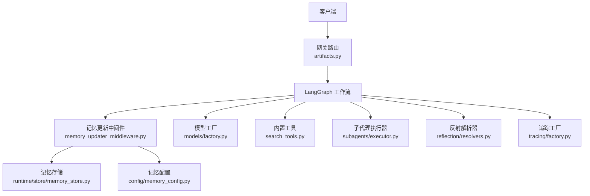
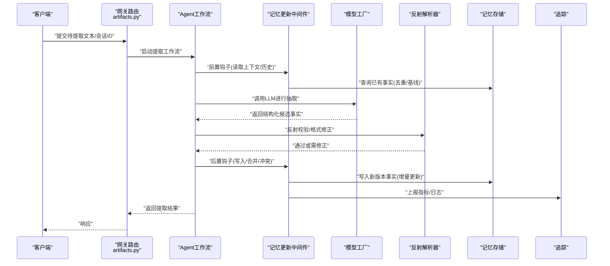
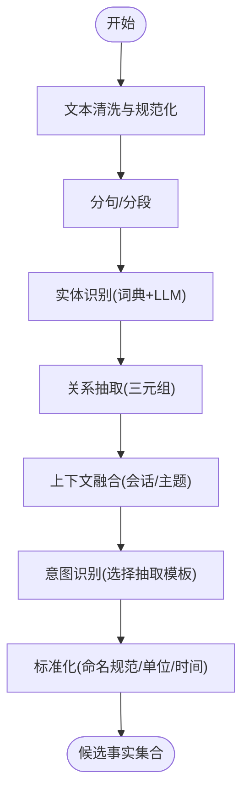
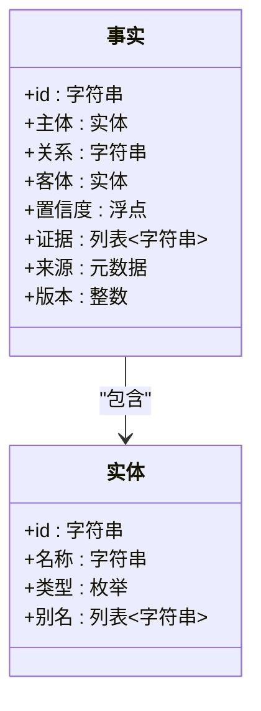
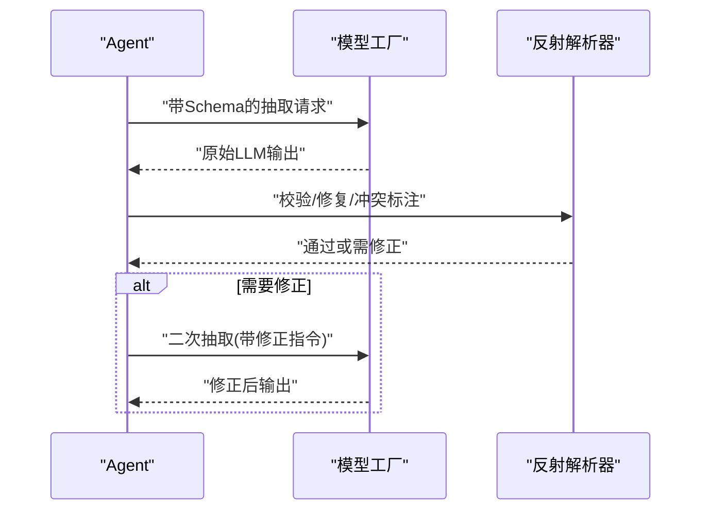
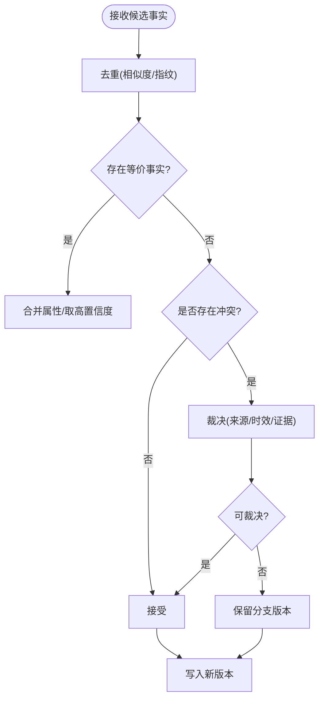
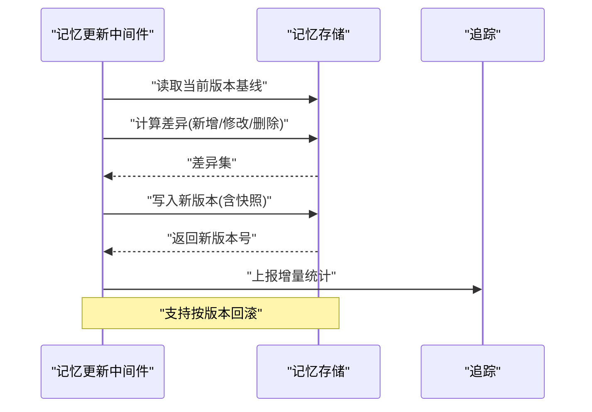
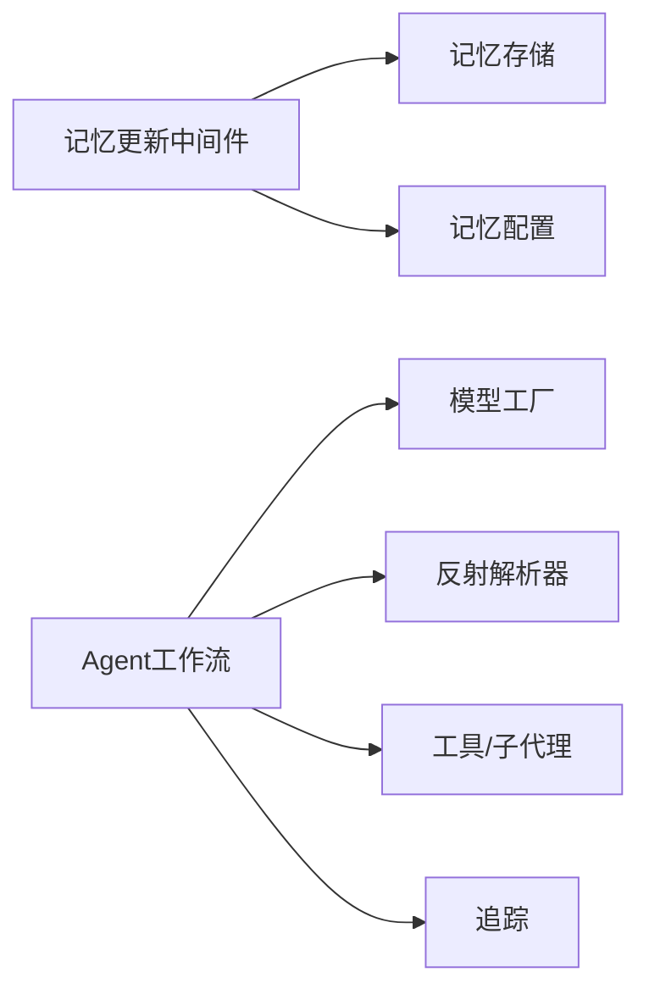

# 事实提取引擎

<cite>
**本文引用的文件**   
- [backend/app/gateway/routers/artifacts.py](file://backend/app/gateway/routers/artifacts.py)
- [backend/packages/harness/deerflow/agents/middlewares/memory_updater_middleware.py](file://backend/packages/harness/deerflow/agents/middlewares/memory_updater_middleware.py)
- [backend/packages/harness/deerflow/runtime/store/memory_store.py](file://backend/packages/harness/deerflow/runtime/store/memory_store.py)
- [backend/packages/harness/deerflow/config/memory_config.py](file://backend/packages/harness/deerflow/config/memory_config.py)
- [backend/packages/harness/deerflow/models/factory.py](file://backend/packages/harness/deerflow/models/factory.py)
- [backend/packages/harness/deerflow/tools/builtins/search_tools.py](file://backend/packages/harness/deerflow/tools/builtins/search_tools.py)
- [backend/packages/harness/deerflow/subagents/executor.py](file://backend/packages/harness/deerflow/subagents/executor.py)
- [backend/packages/harness/deerflow/reflection/resolvers.py](file://backend/packages/harness/deerflow/reflection/resolvers.py)
- [backend/packages/harness/deerflow/tracing/factory.py](file://backend/packages/harness/deerflow/tracing/factory.py)
- [backend/tests/test_memory_updater.py](file://backend/tests/test_memory_updater.py)
- [backend/tests/test_run_worker_rollback.py](file://backend/tests/test_run_worker_rollback.py)
</cite>

## 目录
1. [简介](#简介)
2. [项目结构](#项目结构)
3. [核心组件](#核心组件)
4. [架构总览](#架构总览)
5. [详细组件分析](#详细组件分析)
6. [依赖关系分析](#依赖关系分析)
7. [性能考量](#性能考量)
8. [故障排查指南](#故障排查指南)
9. [结论](#结论)
10. [附录](#附录)

## 简介
本文件面向“事实提取引擎”的技术文档，聚焦于从自然语言文本中抽取结构化事实的端到端流程。内容覆盖：
- 文本预处理、实体识别与关系抽取
- 语义分析（上下文理解、意图识别、知识表示）
- 事实标准化（去重、合并、冲突解决）
- LLM驱动的提取机制（提示词工程、输出格式化、质量控制）
- 增量更新（变化检测、版本管理、回滚）
- 质量评估方法与调优参数
- 性能监控与错误处理策略

该引擎以LangGraph工作流为核心编排器，结合记忆存储、模型工厂、工具与子代理、反射解析与可观测性设施，形成可扩展、可观测、可回滚的事实抽取流水线。

## 项目结构
与事实提取相关的关键位置：
- 网关路由层：对外暴露与“工件/记忆”相关的接口，触发提取流程
- 中间件层：在Agent执行前后注入记忆更新、校验、追踪等能力
- 运行时存储：持久化与检索记忆（事实）
- 配置中心：记忆、模型、工具、子代理等配置项
- 模型工厂：统一加载与调用不同LLM后端
- 工具与子代理：搜索、代码执行、外部服务集成
- 反射解析：对LLM输出的结构化结果进行校验与修正
- 追踪：全链路指标与日志采集

图表来源
- [backend/app/gateway/routers/artifacts.py](file://backend/app/gateway/routers/artifacts.py)
- [backend/packages/harness/deerflow/agents/middlewares/memory_updater_middleware.py](file://backend/packages/harness/deerflow/agents/middlewares/memory_updater_middleware.py)
- [backend/packages/harness/deerflow/runtime/store/memory_store.py](file://backend/packages/harness/deerflow/runtime/store/memory_store.py)
- [backend/packages/harness/deerflow/config/memory_config.py](file://backend/packages/harness/deerflow/config/memory_config.py)
- [backend/packages/harness/deerflow/models/factory.py](file://backend/packages/harness/deerflow/models/factory.py)
- [backend/packages/harness/deerflow/tools/builtins/search_tools.py](file://backend/packages/harness/deerflow/tools/builtins/search_tools.py)
- [backend/packages/harness/deerflow/subagents/executor.py](file://backend/packages/harness/deerflow/subagents/executor.py)
- [backend/packages/harness/deerflow/reflection/resolvers.py](file://backend/packages/harness/deerflow/reflection/resolvers.py)
- [backend/packages/harness/deerflow/tracing/factory.py](file://backend/packages/harness/deerflow/tracing/factory.py)

章节来源
- [backend/app/gateway/routers/artifacts.py](file://backend/app/gateway/routers/artifacts.py)
- [backend/packages/harness/deerflow/agents/middlewares/memory_updater_middleware.py](file://backend/packages/harness/deerflow/agents/middlewares/memory_updater_middleware.py)
- [backend/packages/harness/deerflow/runtime/store/memory_store.py](file://backend/packages/harness/deerflow/runtime/store/memory_store.py)
- [backend/packages/harness/deerflow/config/memory_config.py](file://backend/packages/harness/deerflow/config/memory_config.py)
- [backend/packages/harness/deerflow/models/factory.py](file://backend/packages/harness/deerflow/models/factory.py)
- [backend/packages/harness/deerflow/tools/builtins/search_tools.py](file://backend/packages/harness/deerflow/tools/builtins/search_tools.py)
- [backend/packages/harness/deerflow/subagents/executor.py](file://backend/packages/harness/deerflow/subagents/executor.py)
- [backend/packages/harness/deerflow/reflection/resolvers.py](file://backend/packages/harness/deerflow/reflection/resolvers.py)
- [backend/packages/harness/deerflow/tracing/factory.py](file://backend/packages/harness/deerflow/tracing/factory.py)

## 核心组件
- 记忆更新中间件：在Agent执行前后拦截状态，负责将新抽取的事实写入记忆存储，并参与增量更新与冲突处理。
- 记忆存储：提供事实的增删改查、版本化与快照能力，支撑去重、合并与回滚。
- 模型工厂：统一封装多模型接入，支持温度、最大令牌、重试等参数，为提取任务提供稳定推理能力。
- 反射解析器：对LLM返回的结构化事实进行模式校验、字段补全与冲突标注，提升输出稳定性。
- 工具与子代理：按需扩展搜索、网页抓取、代码执行等能力，辅助事实抽取的数据获取与验证。
- 追踪工厂：记录关键步骤耗时、Token用量、错误码与异常堆栈，便于性能分析与问题定位。

章节来源
- [backend/packages/harness/deerflow/agents/middlewares/memory_updater_middleware.py](file://backend/packages/harness/deerflow/agents/middlewares/memory_updater_middleware.py)
- [backend/packages/harness/deerflow/runtime/store/memory_store.py](file://backend/packages/harness/deerflow/runtime/store/memory_store.py)
- [backend/packages/harness/deerflow/models/factory.py](file://backend/packages/harness/deerflow/models/factory.py)
- [backend/packages/harness/deerflow/reflection/resolvers.py](file://backend/packages/harness/deerflow/reflection/resolvers.py)
- [backend/packages/harness/deerflow/tools/builtins/search_tools.py](file://backend/packages/harness/deerflow/tools/builtins/search_tools.py)
- [backend/packages/harness/deerflow/subagents/executor.py](file://backend/packages/harness/deerflow/subagents/executor.py)
- [backend/packages/harness/deerflow/tracing/factory.py](file://backend/packages/harness/deerflow/tracing/factory.py)

## 架构总览
下图展示了从请求进入网关到事实落库的全链路交互，包括中间件拦截、模型调用、反射校验与记忆写入。

图表来源
- [backend/app/gateway/routers/artifacts.py](file://backend/app/gateway/routers/artifacts.py)
- [backend/packages/harness/deerflow/agents/middlewares/memory_updater_middleware.py](file://backend/packages/harness/deerflow/agents/middlewares/memory_updater_middleware.py)
- [backend/packages/harness/deerflow/runtime/store/memory_store.py](file://backend/packages/harness/deerflow/runtime/store/memory_store.py)
- [backend/packages/harness/deerflow/models/factory.py](file://backend/packages/harness/deerflow/models/factory.py)
- [backend/packages/harness/deerflow/reflection/resolvers.py](file://backend/packages/harness/deerflow/reflection/resolvers.py)
- [backend/packages/harness/deerflow/tracing/factory.py](file://backend/packages/harness/deerflow/tracing/factory.py)

## 详细组件分析

### 文本预处理与实体/关系抽取
- 文本预处理：清洗噪声、分句分段、规范化标点与编码，确保输入稳定。
- 实体识别：基于领域词典与LLM联合抽取，产出标准化实体（名称、类型、别名）。
- 关系抽取：在句子/段落粒度上识别主谓宾三元组，必要时引入依存句法辅助消歧。
- 上下文理解：利用会话历史与主题摘要作为上下文，减少跨段指代歧义。
- 意图识别：根据用户目标（如“对比两家公司的营收”）选择抽取模板与约束。

[本节为概念说明，不直接分析具体文件]

### 语义分析与知识表示
- 语义归一：同义词映射、数值/时间/度量单位统一、实体对齐。
- 知识表示：采用图/三元组形式表达事实，便于后续合并与冲突检测。
- 置信度建模：为每条事实附加来源、置信度与证据片段，用于排序与回溯。

[本节为概念说明，不直接分析具体文件]

### LLM驱动提取机制（提示词工程、输出格式化、质量控制）
- 提示词工程：明确抽取目标、字段定义、示例与负例；限定输出JSON Schema。
- 输出格式化：强制结构化输出，失败时自动重试与降级策略。
- 质量控制：反射解析器进行Schema校验、缺失字段修复、冲突标记；必要时触发二次抽取。

图表来源
- [backend/packages/harness/deerflow/models/factory.py](file://backend/packages/harness/deerflow/models/factory.py)
- [backend/packages/harness/deerflow/reflection/resolvers.py](file://backend/packages/harness/deerflow/reflection/resolvers.py)

章节来源
- [backend/packages/harness/deerflow/models/factory.py](file://backend/packages/harness/deerflow/models/factory.py)
- [backend/packages/harness/deerflow/reflection/resolvers.py](file://backend/packages/harness/deerflow/reflection/resolvers.py)

### 事实标准化（去重、合并、冲突解决）
- 去重：基于实体对齐与关系指纹计算相似度，阈值判定是否重复。
- 合并：对等价事实合并属性，保留最高置信度与最新证据。
- 冲突解决：当同一键值出现矛盾时，依据来源可信度、时效性与证据强度裁决；无法裁决则保留分支版本。

章节来源
- [backend/packages/harness/deerflow/agents/middlewares/memory_updater_middleware.py](file://backend/packages/harness/deerflow/agents/middlewares/memory_updater_middleware.py)
- [backend/packages/harness/deerflow/runtime/store/memory_store.py](file://backend/packages/harness/deerflow/runtime/store/memory_store.py)

### 增量更新算法（变化检测、版本管理、回滚）
- 变化检测：比较新旧事实集合的差异（新增、修改、删除），生成变更集。
- 版本管理：每次写入递增版本号，保留历史快照，支持按时间或版本查询。
- 回滚机制：基于快照快速恢复到指定版本；支持部分回滚（仅特定实体/关系）。

图表来源
- [backend/packages/harness/deerflow/agents/middlewares/memory_updater_middleware.py](file://backend/packages/harness/deerflow/agents/middlewares/memory_updater_middleware.py)
- [backend/packages/harness/deerflow/runtime/store/memory_store.py](file://backend/packages/harness/deerflow/runtime/store/memory_store.py)

章节来源
- [backend/packages/harness/deerflow/agents/middlewares/memory_updater_middleware.py](file://backend/packages/harness/deerflow/agents/middlewares/memory_updater_middleware.py)
- [backend/packages/harness/deerflow/runtime/store/memory_store.py](file://backend/packages/harness/deerflow/runtime/store/memory_store.py)

### 工具与子代理协同
- 搜索工具：补充外部信息，增强事实准确性与时效性。
- 子代理：并行执行复杂任务（如批量抽取、交叉验证），提高吞吐。
- 安全沙箱：隔离不可信代码执行，保障系统稳定。

章节来源
- [backend/packages/harness/deerflow/tools/builtins/search_tools.py](file://backend/packages/harness/deerflow/tools/builtins/search_tools.py)
- [backend/packages/harness/deerflow/subagents/executor.py](file://backend/packages/harness/deerflow/subagents/executor.py)

### 可观测性与追踪
- 指标采集：延迟、吞吐、Token用量、错误率、重试次数。
- 日志记录：关键步骤入参/出参、异常堆栈、版本变更摘要。
- 追踪关联：贯穿网关、中间件、模型、存储，便于端到端排障。

章节来源
- [backend/packages/harness/deerflow/tracing/factory.py](file://backend/packages/harness/deerflow/tracing/factory.py)

## 依赖关系分析
- 低耦合：中间件与存储解耦，通过配置与接口约定协作。
- 可替换：模型工厂屏蔽后端差异，便于切换供应商或本地部署。
- 可扩展：工具与子代理注册式扩展，不影响主线流程。
- 风险点：反射解析器强依赖Schema一致性；记忆存储需保证幂等写入与并发安全。

图表来源
- [backend/packages/harness/deerflow/agents/middlewares/memory_updater_middleware.py](file://backend/packages/harness/deerflow/agents/middlewares/memory_updater_middleware.py)
- [backend/packages/harness/deerflow/runtime/store/memory_store.py](file://backend/packages/harness/deerflow/runtime/store/memory_store.py)
- [backend/packages/harness/deerflow/config/memory_config.py](file://backend/packages/harness/deerflow/config/memory_config.py)
- [backend/packages/harness/deerflow/models/factory.py](file://backend/packages/harness/deerflow/models/factory.py)
- [backend/packages/harness/deerflow/reflection/resolvers.py](file://backend/packages/harness/deerflow/reflection/resolvers.py)
- [backend/packages/harness/deerflow/tools/builtins/search_tools.py](file://backend/packages/harness/deerflow/tools/builtins/search_tools.py)
- [backend/packages/harness/deerflow/subagents/executor.py](file://backend/packages/harness/deerflow/subagents/executor.py)
- [backend/packages/harness/deerflow/tracing/factory.py](file://backend/packages/harness/deerflow/tracing/factory.py)

章节来源
- [backend/packages/harness/deerflow/agents/middlewares/memory_updater_middleware.py](file://backend/packages/harness/deerflow/agents/middlewares/memory_updater_middleware.py)
- [backend/packages/harness/deerflow/runtime/store/memory_store.py](file://backend/packages/harness/deerflow/runtime/store/memory_store.py)
- [backend/packages/harness/deerflow/config/memory_config.py](file://backend/packages/harness/deerflow/config/memory_config.py)
- [backend/packages/harness/deerflow/models/factory.py](file://backend/packages/harness/deerflow/models/factory.py)
- [backend/packages/harness/deerflow/reflection/resolvers.py](file://backend/packages/harness/deerflow/reflection/resolvers.py)
- [backend/packages/harness/deerflow/tools/builtins/search_tools.py](file://backend/packages/harness/deerflow/tools/builtins/search_tools.py)
- [backend/packages/harness/deerflow/subagents/executor.py](file://backend/packages/harness/deerflow/subagents/executor.py)
- [backend/packages/harness/deerflow/tracing/factory.py](file://backend/packages/harness/deerflow/tracing/factory.py)

## 性能考量
- 批处理与缓存：对相似查询与频繁访问的事实建立缓存，降低重复抽取成本。
- 并发控制：子代理与工具调用限流与熔断，避免雪崩。
- 增量优先：优先使用增量更新与差异计算，减少全量扫描。
- 模型参数调优：温度、Top-p、最大令牌与重试策略平衡质量与延迟。
- 资源隔离：沙箱与内存限制防止异常占用影响整体服务。

[本节为通用指导，不直接分析具体文件]

## 故障排查指南
- 常见问题
  - 抽取失败：检查模型工厂超时与重试配置、网络连通性与鉴权。
  - 输出非法：确认反射解析器的Schema与提示词一致，查看修复日志。
  - 写入冲突：核对记忆存储的并发写入锁与幂等键设计。
  - 回滚异常：验证快照完整性与版本连续性。
- 诊断手段
  - 追踪链路：通过追踪ID串联网关、中间件、模型与存储调用。
  - 指标看板：关注错误率、P95/P99延迟、Token消耗与重试次数。
  - 单元测试：参考测试用例复现边界条件与回归问题。

章节来源
- [backend/tests/test_memory_updater.py](file://backend/tests/test_memory_updater.py)
- [backend/tests/test_run_worker_rollback.py](file://backend/tests/test_run_worker_rollback.py)

## 结论
本事实提取引擎以中间件与存储为核心，结合LLM抽取、反射校验与增量更新，实现了高质量、可观测、可回滚的事实抽取流水线。通过模块化设计与可插拔工具/子代理，系统具备良好的扩展性与鲁棒性。建议在生产环境持续完善Schema治理、指标告警与灰度发布策略，进一步提升稳定性与可维护性。

[本节为总结性内容，不直接分析具体文件]

## 附录
- 配置要点
  - 记忆配置：开启增量更新、设置去重阈值与冲突裁决策略。
  - 模型配置：合理设置温度、最大令牌与重试上限。
  - 追踪配置：启用关键路径埋点与采样策略。
- 最佳实践
  - 提示词模板化与版本化，配合反射解析器严格校验。
  - 对高频实体建立别名与同义词表，提升去重准确率。
  - 定期评估与回放，优化冲突裁决规则与权重。

[本节为补充信息，不直接分析具体文件]