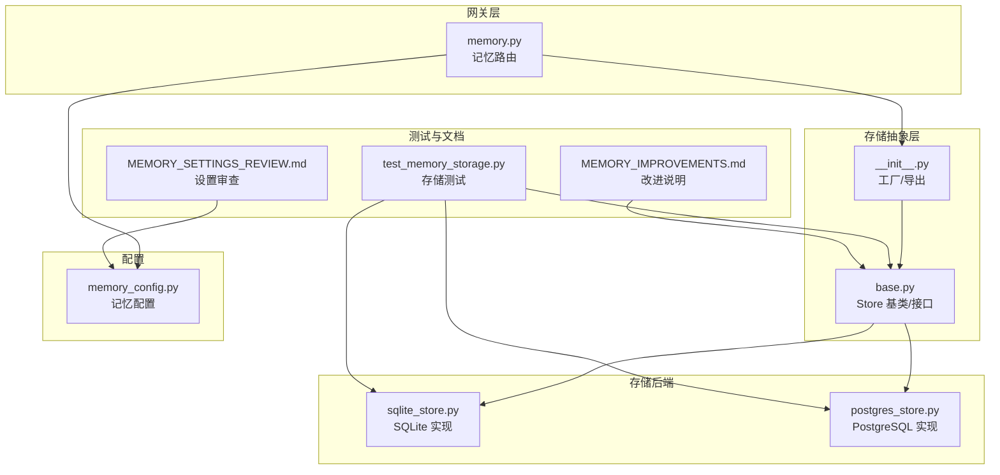
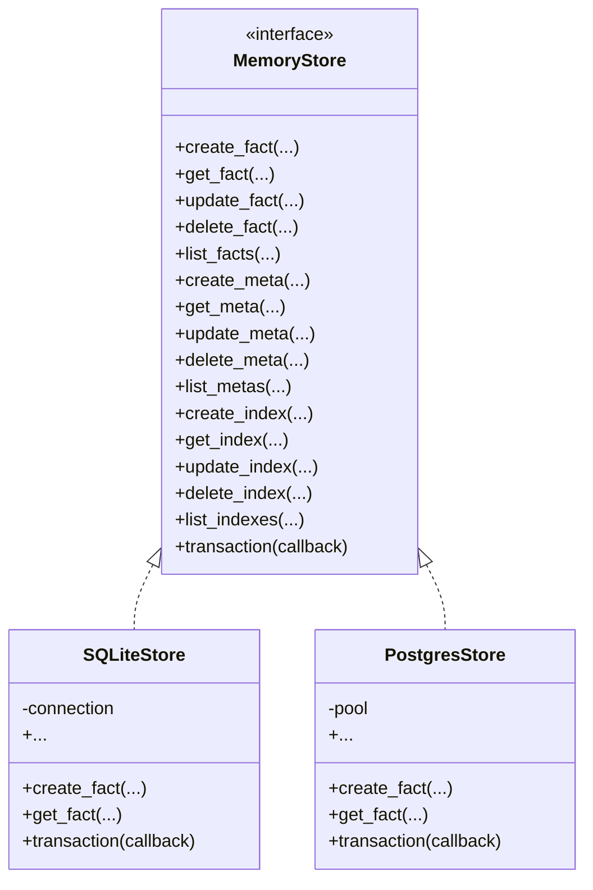
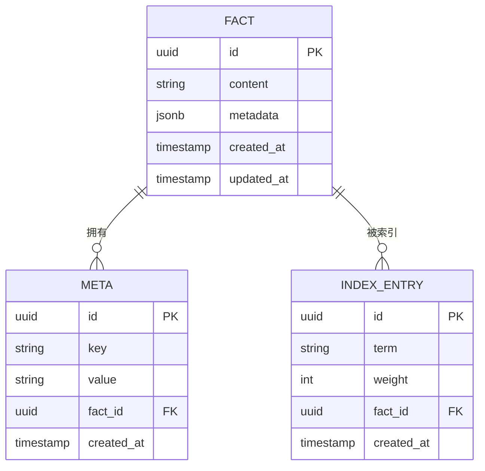
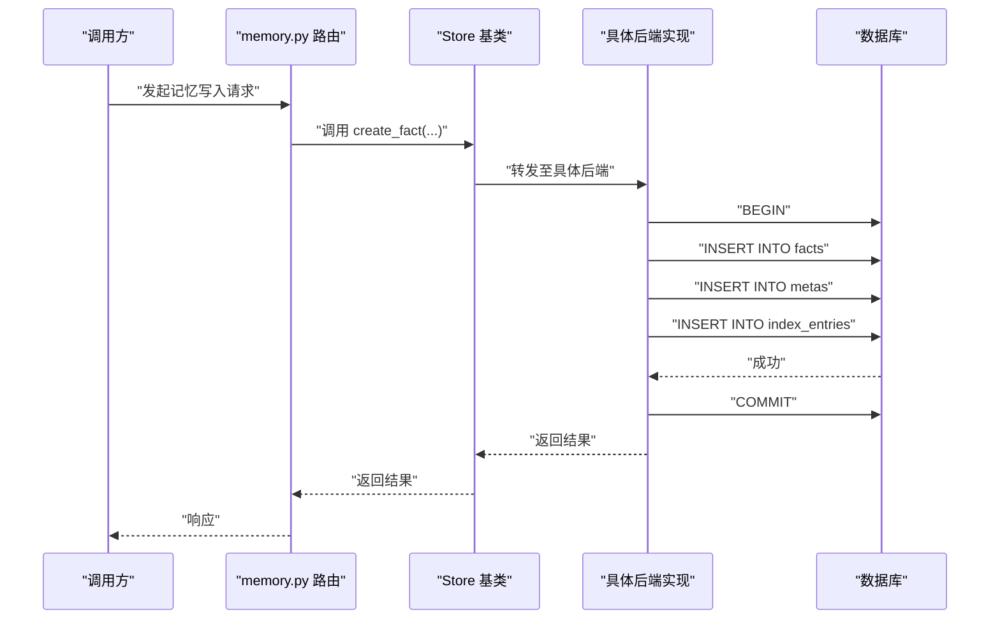
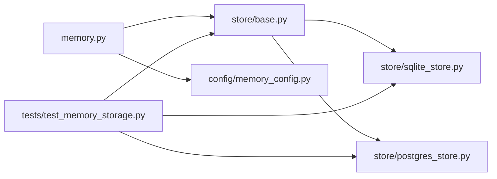

# 存储架构设计

<cite>
**本文引用的文件**   
- [backend/app/gateway/routers/memory.py](file://backend/app/gateway/routers/memory.py)
- [backend/packages/harness/deerflow/runtime/store/__init__.py](file://backend/packages/harness/deerflow/runtime/store/__init__.py)
- [backend/packages/harness/deerflow/runtime/store/base.py](file://backend/packages/harness/deerflow/runtime/store/base.py)
- [backend/packages/harness/deerflow/runtime/store/sqlite_store.py](file://backend/packages/harness/deerflow/runtime/store/sqlite_store.py)
- [backend/packages/harness/deerflow/runtime/store/postgres_store.py](file://backend/packages/harness/deerflow/runtime/store/postgres_store.py)
- [backend/packages/harness/deerflow/config/memory_config.py](file://backend/packages/harness/deerflow/config/memory_config.py)
- [backend/tests/test_memory_storage.py](file://backend/tests/test_memory_storage.py)
- [backend/docs/MEMORY_IMPROVEMENTS.md](file://backend/docs/MEMORY_IMPROVEMENTS.md)
- [backend/docs/MEMORY_SETTINGS_REVIEW.md](file://backend/docs/MEMORY_SETTINGS_REVIEW.md)
</cite>

## 目录
1. [简介](#简介)
2. [项目结构](#项目结构)
3. [核心组件](#核心组件)
4. [架构总览](#架构总览)
5. [详细组件分析](#详细组件分析)
6. [依赖关系分析](#依赖关系分析)
7. [性能考虑](#性能考虑)
8. [故障排查指南](#故障排查指南)
9. [结论](#结论)
10. [附录](#附录)

## 简介
本文件面向长期记忆存储子系统，系统性阐述其高层设计与实现细节。内容覆盖：
- 数据模型抽象与实体关系（事实 Fact、元数据 Meta、索引 Index）
- 存储后端接口与持久化策略
- SQLite 与 PostgreSQL 两种后端的差异与选择
- 数据访问层抽象（CRUD 封装、事务管理）
- 性能优化（索引、查询、缓存）
- 配置项与扩展新后端的开发指南
- 监控指标与故障排查方法

## 项目结构
长期记忆存储相关代码主要位于后端运行时模块的 store 子包中，并通过网关路由对外暴露 API。测试与文档提供了使用示例与设计说明。

图表来源
- [backend/app/gateway/routers/memory.py](file://backend/app/gateway/routers/memory.py)
- [backend/packages/harness/deerflow/runtime/store/__init__.py](file://backend/packages/harness/deerflow/runtime/store/__init__.py)
- [backend/packages/harness/deerflow/runtime/store/base.py](file://backend/packages/harness/deerflow/runtime/store/base.py)
- [backend/packages/harness/deerflow/runtime/store/sqlite_store.py](file://backend/packages/harness/deerflow/runtime/store/sqlite_store.py)
- [backend/packages/harness/deerflow/runtime/store/postgres_store.py](file://backend/packages/harness/deerflow/runtime/store/postgres_store.py)
- [backend/packages/harness/deerflow/config/memory_config.py](file://backend/packages/harness/deerflow/config/memory_config.py)
- [backend/tests/test_memory_storage.py](file://backend/tests/test_memory_storage.py)
- [backend/docs/MEMORY_IMPROVEMENTS.md](file://backend/docs/MEMORY_IMPROVEMENTS.md)
- [backend/docs/MEMORY_SETTINGS_REVIEW.md](file://backend/docs/MEMORY_SETTINGS_REVIEW.md)

章节来源
- [backend/app/gateway/routers/memory.py](file://backend/app/gateway/routers/memory.py)
- [backend/packages/harness/deerflow/runtime/store/__init__.py](file://backend/packages/harness/deerflow/runtime/store/__init__.py)
- [backend/packages/harness/deerflow/runtime/store/base.py](file://backend/packages/harness/deerflow/runtime/store/base.py)
- [backend/packages/harness/deerflow/runtime/store/sqlite_store.py](file://backend/packages/harness/deerflow/runtime/store/sqlite_store.py)
- [backend/packages/harness/deerflow/runtime/store/postgres_store.py](file://backend/packages/harness/deerflow/runtime/store/postgres_store.py)
- [backend/packages/harness/deerflow/config/memory_config.py](file://backend/packages/harness/deerflow/config/memory_config.py)
- [backend/tests/test_memory_storage.py](file://backend/tests/test_memory_storage.py)
- [backend/docs/MEMORY_IMPROVEMENTS.md](file://backend/docs/MEMORY_IMPROVEMENTS.md)
- [backend/docs/MEMORY_SETTINGS_REVIEW.md](file://backend/docs/MEMORY_SETTINGS_REVIEW.md)

## 核心组件
- 存储抽象接口：定义统一的 CRUD 与事务边界，屏蔽底层数据库差异。
- 具体后端实现：提供 SQLite 与 PostgreSQL 两套实现，分别适配不同部署场景。
- 配置模块：集中管理连接参数、池大小、超时等关键选项。
- 路由层：将外部请求映射到存储操作，负责参数校验与结果序列化。
- 测试套件：覆盖常见读写路径、错误分支与跨后端一致性验证。

章节来源
- [backend/packages/harness/deerflow/runtime/store/base.py](file://backend/packages/harness/deerflow/runtime/store/base.py)
- [backend/packages/harness/deerflow/runtime/store/sqlite_store.py](file://backend/packages/harness/deerflow/runtime/store/sqlite_store.py)
- [backend/packages/harness/deerflow/runtime/store/postgres_store.py](file://backend/packages/harness/deerflow/runtime/store/postgres_store.py)
- [backend/packages/harness/deerflow/config/memory_config.py](file://backend/packages/harness/deerflow/config/memory_config.py)
- [backend/app/gateway/routers/memory.py](file://backend/app/gateway/routers/memory.py)
- [backend/tests/test_memory_storage.py](file://backend/tests/test_memory_storage.py)

## 架构总览
整体采用“接口 + 多实现”的分层设计：上层通过统一接口进行数据访问，下层按环境选择合适后端。配置驱动后端实例化，路由层作为对外入口。

图表来源
- [backend/packages/harness/deerflow/runtime/store/base.py](file://backend/packages/harness/deerflow/runtime/store/base.py)
- [backend/packages/harness/deerflow/runtime/store/sqlite_store.py](file://backend/packages/harness/deerflow/runtime/store/sqlite_store.py)
- [backend/packages/harness/deerflow/runtime/store/postgres_store.py](file://backend/packages/harness/deerflow/runtime/store/postgres_store.py)

## 详细组件分析

### 数据模型与实体关系
长期记忆围绕三类核心实体组织：
- 事实（Fact）：可检索的最小语义单元，包含文本内容与关联标识。
- 元数据（Meta）：附加在事实上的键值对或结构化描述，便于过滤与聚合。
- 索引（Index）：面向查询优化的倒排或辅助索引，加速检索与范围扫描。

说明
- 主键均为 UUID，便于分布式拼接与去重。
- 元数据以键值形式解耦，避免事实表膨胀。
- 索引项支持权重与时间戳，利于排序与时效性控制。

章节来源
- [backend/packages/harness/deerflow/runtime/store/base.py](file://backend/packages/harness/deerflow/runtime/store/base.py)
- [backend/packages/harness/deerflow/runtime/store/sqlite_store.py](file://backend/packages/harness/deerflow/runtime/store/sqlite_store.py)
- [backend/packages/harness/deerflow/runtime/store/postgres_store.py](file://backend/packages/harness/deerflow/runtime/store/postgres_store.py)

### 存储后端接口与持久化策略
- 统一接口：所有后端需实现一致的 CRUD 方法与事务回调，确保上层调用无感知切换。
- 持久化策略：
  - 写路径：先写入事实，再批量落盘元数据与索引；失败时回滚。
  - 读路径：优先命中缓存（若启用），否则走数据库并回填缓存。
  - 更新路径：基于版本或时间戳做幂等更新，避免并发覆盖。
  - 删除路径：软删除标记 + 异步清理索引，保证查询一致性。

章节来源
- [backend/packages/harness/deerflow/runtime/store/base.py](file://backend/packages/harness/deerflow/runtime/store/base.py)
- [backend/packages/harness/deerflow/runtime/store/sqlite_store.py](file://backend/packages/harness/deerflow/runtime/store/sqlite_store.py)
- [backend/packages/harness/deerflow/runtime/store/postgres_store.py](file://backend/packages/harness/deerflow/runtime/store/postgres_store.py)

### SQLite 与 PostgreSQL 实现差异
- 连接与并发
  - SQLite：单进程文件锁，适合单机与轻量场景；并发写受限，建议只读副本或队列合并写。
  - PostgreSQL：连接池与行级锁，适合高并发与多进程部署。
- 数据类型与函数
  - SQLite：JSON 能力有限，复杂查询需借助应用层处理。
  - PostgreSQL：原生 JSONB、GIN 索引、全文搜索等，利于高性能检索。
- 事务与一致性
  - SQLite：语句级事务，简单可靠。
  - PostgreSQL：支持更丰富的隔离级别与保存点，适合复杂业务事务。
- 运维与扩展
  - SQLite：零运维，备份即拷贝文件。
  - PostgreSQL：需要独立服务与备份策略，但具备更好的水平扩展能力。

章节来源
- [backend/packages/harness/deerflow/runtime/store/sqlite_store.py](file://backend/packages/harness/deerflow/runtime/store/sqlite_store.py)
- [backend/packages/harness/deerflow/runtime/store/postgres_store.py](file://backend/packages/harness/deerflow/runtime/store/postgres_store.py)

### 数据访问层抽象与事务管理
- 抽象设计
  - 通过基类定义标准方法签名，子类仅关注 SQL/ORM 差异。
  - 提供事务上下文管理器，确保复合操作的原子性与回滚。
- 事务流程
  - 开启事务 -> 执行多条写操作 -> 提交或根据异常回滚。
  - 支持嵌套事务（保存点）以细化错误边界。

图表来源
- [backend/app/gateway/routers/memory.py](file://backend/app/gateway/routers/memory.py)
- [backend/packages/harness/deerflow/runtime/store/base.py](file://backend/packages/harness/deerflow/runtime/store/base.py)
- [backend/packages/harness/deerflow/runtime/store/sqlite_store.py](file://backend/packages/harness/deerflow/runtime/store/sqlite_store.py)
- [backend/packages/harness/deerflow/runtime/store/postgres_store.py](file://backend/packages/harness/deerflow/runtime/store/postgres_store.py)

章节来源
- [backend/packages/harness/deerflow/runtime/store/base.py](file://backend/packages/harness/deerflow/runtime/store/base.py)
- [backend/app/gateway/routers/memory.py](file://backend/app/gateway/routers/memory.py)

### 配置项与扩展指南
- 配置项要点
  - 后端类型选择（sqlite/postgres）
  - 连接参数（路径/URL、用户名、密码、端口、数据库名）
  - 连接池大小、超时、重试次数
  - 是否启用缓存、缓存容量与过期策略
- 扩展新后端步骤
  - 新建实现类，继承自存储基类，实现全部抽象方法。
  - 在工厂/初始化处注册新后端类型。
  - 补充单元测试，覆盖正常路径与异常分支。
  - 更新配置加载逻辑，使新类型可被识别。

章节来源
- [backend/packages/harness/deerflow/config/memory_config.py](file://backend/packages/harness/deerflow/config/memory_config.py)
- [backend/packages/harness/deerflow/runtime/store/__init__.py](file://backend/packages/harness/deerflow/runtime/store/__init__.py)
- [backend/tests/test_memory_storage.py](file://backend/tests/test_memory_storage.py)

## 依赖关系分析
- 耦合度
  - 路由层仅依赖抽象接口，不感知具体后端，降低耦合。
  - 配置模块集中注入后端实例，避免散落的 if/else。
- 外部依赖
  - SQLite：内置库，无需额外安装。
  - PostgreSQL：需第三方驱动与运行中的数据库服务。
- 循环依赖
  - 当前分层清晰，未见循环导入风险。

图表来源
- [backend/app/gateway/routers/memory.py](file://backend/app/gateway/routers/memory.py)
- [backend/packages/harness/deerflow/runtime/store/base.py](file://backend/packages/harness/deerflow/runtime/store/base.py)
- [backend/packages/harness/deerflow/runtime/store/sqlite_store.py](file://backend/packages/harness/deerflow/runtime/store/sqlite_store.py)
- [backend/packages/harness/deerflow/runtime/store/postgres_store.py](file://backend/packages/harness/deerflow/runtime/store/postgres_store.py)
- [backend/packages/harness/deerflow/config/memory_config.py](file://backend/packages/harness/deerflow/config/memory_config.py)
- [backend/tests/test_memory_storage.py](file://backend/tests/test_memory_storage.py)

章节来源
- [backend/app/gateway/routers/memory.py](file://backend/app/gateway/routers/memory.py)
- [backend/packages/harness/deerflow/runtime/store/base.py](file://backend/packages/harness/deerflow/runtime/store/base.py)
- [backend/packages/harness/deerflow/runtime/store/sqlite_store.py](file://backend/packages/harness/deerflow/runtime/store/sqlite_store.py)
- [backend/packages/harness/deerflow/runtime/store/postgres_store.py](file://backend/packages/harness/deerflow/runtime/store/postgres_store.py)
- [backend/packages/harness/deerflow/config/memory_config.py](file://backend/packages/harness/deerflow/config/memory_config.py)
- [backend/tests/test_memory_storage.py](file://backend/tests/test_memory_storage.py)

## 性能考虑
- 索引设计
  - 为高频过滤字段建立索引（如 fact_id、key、term）。
  - 针对范围查询与排序字段建立复合索引。
  - PostgreSQL 下可使用 GIN/GiST 索引加速 JSONB 与全文检索。
- 查询优化
  - 分页与游标式读取，避免一次性拉取大量数据。
  - 选择性投影，减少网络与序列化开销。
  - 预编译语句与批处理写入，降低往返次数。
- 缓存机制
  - 热点事实与元数据可加入内存缓存，设置合理 TTL。
  - 写穿透或失效策略需与事务一致，避免脏读。
- 事务与锁
  - 尽量缩小事务范围，减少长事务持有锁的时间。
  - 在高并发写场景下，考虑写队列与合并写入。

[本节为通用性能指导，不直接分析具体文件]

## 故障排查指南
- 常见问题定位
  - 连接失败：检查连接字符串、权限与网络可达性。
  - 死锁/超时：缩短事务、拆分大事务、调整隔离级别。
  - 索引未生效：确认统计信息更新与查询计划。
  - 缓存不一致：核对失效策略与并发写入顺序。
- 日志与指标
  - 记录关键操作的耗时、错误码与堆栈。
  - 暴露 QPS、延迟分位、错误率、连接池利用率等指标。
- 回归与复现
  - 使用测试套件快速复现问题，必要时增加断言与快照。

章节来源
- [backend/tests/test_memory_storage.py](file://backend/tests/test_memory_storage.py)
- [backend/docs/MEMORY_IMPROVEMENTS.md](file://backend/docs/MEMORY_IMPROVEMENTS.md)
- [backend/docs/MEMORY_SETTINGS_REVIEW.md](file://backend/docs/MEMORY_SETTINGS_REVIEW.md)

## 结论
该存储架构通过清晰的接口抽象与多后端实现，兼顾了灵活性与可维护性。SQLite 适用于轻量与单机场景，PostgreSQL 适用于高并发与生产环境。配合合理的索引、事务与缓存策略，可在保证一致性的同时获得良好性能。扩展新后端只需遵循统一接口并在配置中注册即可。

[本节为总结性内容，不直接分析具体文件]

## 附录
- 术语
  - 事实（Fact）：最小可检索语义单元
  - 元数据（Meta）：附加的结构化描述
  - 索引（Index）：用于加速检索的辅助结构
- 参考
  - 记忆改进说明与设置审查文档可用于理解演进背景与最佳实践

[本节为补充信息，不直接分析具体文件]