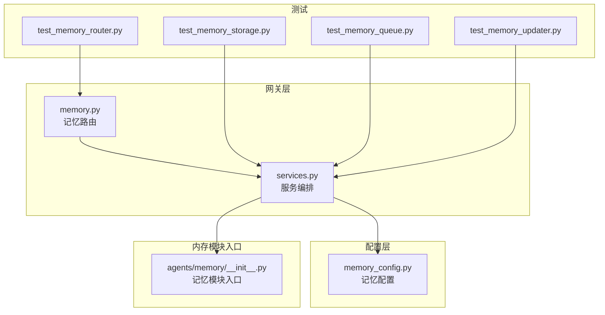
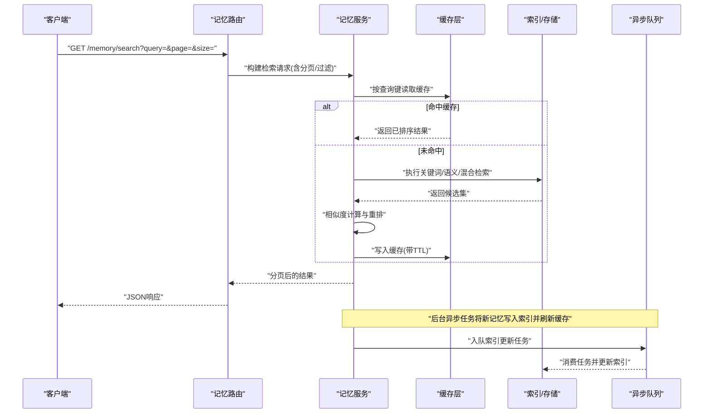
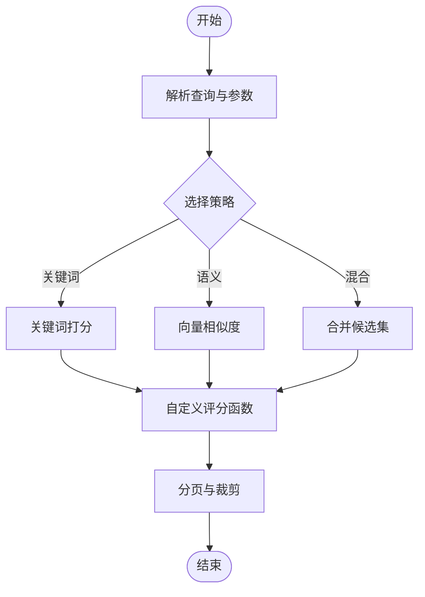
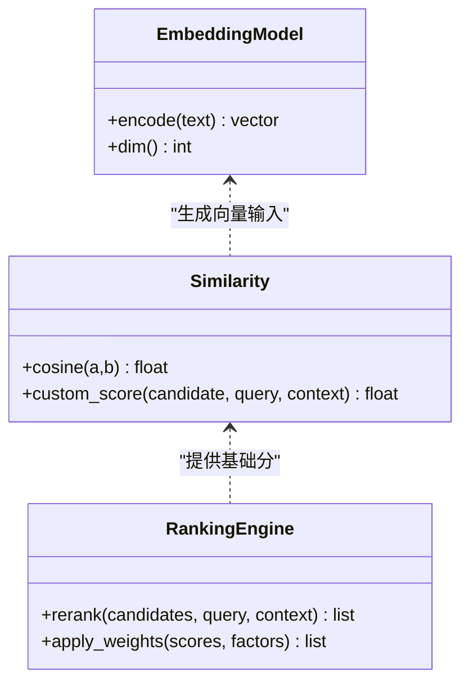
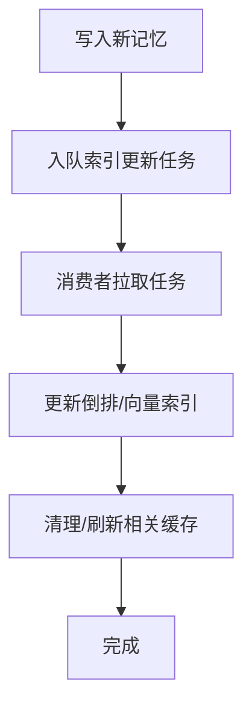
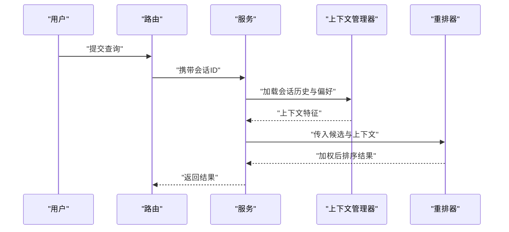
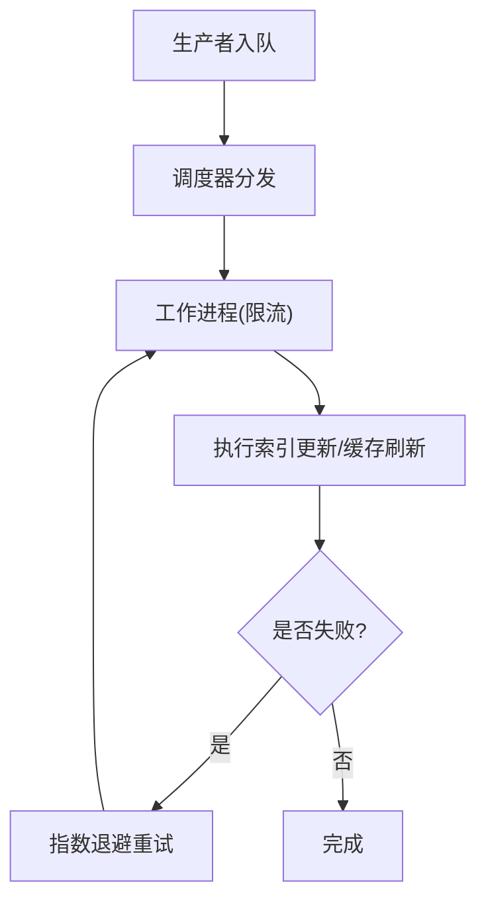
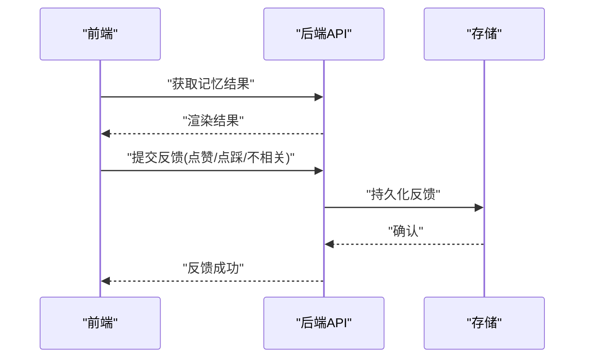
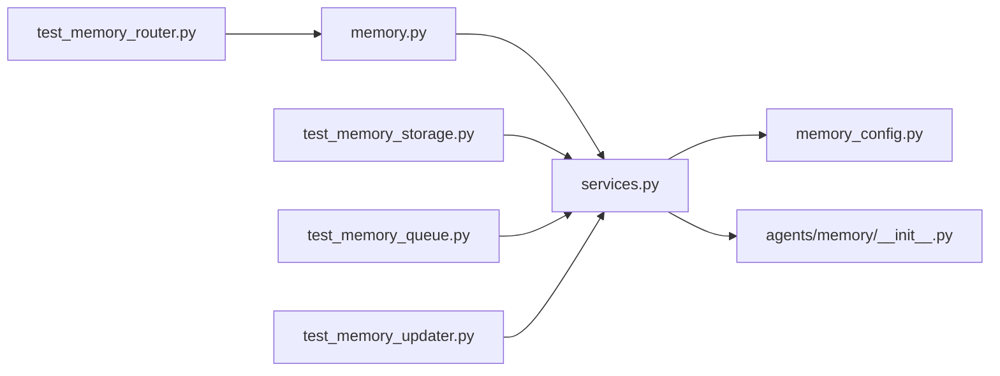

# 记忆检索系统

<cite>
**本文引用的文件**   
- [backend/app/gateway/routers/memory.py](file://backend/app/gateway/routers/memory.py)
- [backend/app/gateway/services.py](file://backend/app/gateway/services.py)
- [backend/packages/harness/deerflow/agents/memory/__init__.py](file://backend/packages/harness/deerflow/agents/memory/__init__.py)
- [backend/packages/harness/deerflow/config/memory_config.py](file://backend/packages/harness/deerflow/config/memory_config.py)
- [backend/tests/test_memory_router.py](file://backend/tests/test_memory_router.py)
- [backend/tests/test_memory_storage.py](file://backend/tests/test_memory_storage.py)
- [backend/tests/test_memory_queue.py](file://backend/tests/test_memory_queue.py)
- [backend/tests/test_memory_updater.py](file://backend/tests/test_memory_updater.py)
- [backend/docs/MEMORY_IMPROVEMENTS.md](file://backend/docs/MEMORY_IMPROVEMENTS.md)
- [backend/docs/MEMORY_SETTINGS_REVIEW.md](file://backend/docs/MEMORY_SETTINGS_REVIEW.md)
- [backend/docs/memory-settings-sample.json](file://backend/docs/memory-settings-sample.json)
</cite>

## 目录
1. [简介](#简介)
2. [项目结构](#项目结构)
3. [核心组件](#核心组件)
4. [架构总览](#架构总览)
5. [详细组件分析](#详细组件分析)
6. [依赖关系分析](#依赖关系分析)
7. [性能考虑](#性能考虑)
8. [故障排查指南](#故障排查指南)
9. [结论](#结论)
10. [附录](#附录)

## 简介
本文件面向“记忆检索系统”的检索策略、相似度计算、索引与缓存优化、上下文感知检索、异步队列、性能调优以及结果可视化与反馈收集等方面，提供系统化、可落地的技术文档。内容基于仓库中后端网关路由、服务层、配置与测试用例进行归纳与提炼，帮助读者快速理解并扩展该系统的检索能力。

## 项目结构
记忆检索相关代码主要分布在以下位置：
- 网关路由层：对外暴露记忆检索接口
- 服务层：编排检索流程、调用存储与更新器
- 配置层：记忆检索参数、模型与嵌入配置
- 测试用例：覆盖路由、存储、队列与更新器等关键路径

图表来源
- [backend/app/gateway/routers/memory.py](file://backend/app/gateway/routers/memory.py)
- [backend/app/gateway/services.py](file://backend/app/gateway/services.py)
- [backend/packages/harness/deerflow/config/memory_config.py](file://backend/packages/harness/deerflow/config/memory_config.py)
- [backend/packages/harness/deerflow/agents/memory/__init__.py](file://backend/packages/harness/deerflow/agents/memory/__init__.py)
- [backend/tests/test_memory_router.py](file://backend/tests/test_memory_router.py)
- [backend/tests/test_memory_storage.py](file://backend/tests/test_memory_storage.py)
- [backend/tests/test_memory_queue.py](file://backend/tests/test_memory_queue.py)
- [backend/tests/test_memory_updater.py](file://backend/tests/test_memory_updater.py)

章节来源
- [backend/app/gateway/routers/memory.py](file://backend/app/gateway/routers/memory.py)
- [backend/app/gateway/services.py](file://backend/app/gateway/services.py)
- [backend/packages/harness/deerflow/config/memory_config.py](file://backend/packages/harness/deerflow/config/memory_config.py)
- [backend/packages/harness/deerflow/agents/memory/__init__.py](file://backend/packages/harness/deerflow/agents/memory/__init__.py)
- [backend/tests/test_memory_router.py](file://backend/tests/test_memory_router.py)
- [backend/tests/test_memory_storage.py](file://backend/tests/test_memory_storage.py)
- [backend/tests/test_memory_queue.py](file://backend/tests/test_memory_queue.py)
- [backend/tests/test_memory_updater.py](file://backend/tests/test_memory_updater.py)

## 核心组件
- 记忆路由（REST）：接收查询请求，解析分页、过滤与排序参数，转发至服务层。
- 记忆服务：编排检索流程，协调关键词匹配、语义搜索与混合评分；管理缓存与分页。
- 记忆配置：集中管理检索策略开关、向量维度、相似度阈值、分页大小等。
- 记忆模块入口：聚合记忆相关能力，供上层调用。
- 测试套件：对路由、存储、队列与更新器进行端到端与单元级验证。

章节来源
- [backend/app/gateway/routers/memory.py](file://backend/app/gateway/routers/memory.py)
- [backend/app/gateway/services.py](file://backend/app/gateway/services.py)
- [backend/packages/harness/deerflow/config/memory_config.py](file://backend/packages/harness/deerflow/config/memory_config.py)
- [backend/packages/harness/deerflow/agents/memory/__init__.py](file://backend/packages/harness/deerflow/agents/memory/__init__.py)

## 架构总览
记忆检索系统采用“路由-服务-存储/索引-缓存-队列”的分层架构。路由负责协议适配与参数校验；服务负责策略编排与结果融合；存储/索引负责持久化与检索；缓存用于热点加速；队列用于异步写入与更新。

图表来源
- [backend/app/gateway/routers/memory.py](file://backend/app/gateway/routers/memory.py)
- [backend/app/gateway/services.py](file://backend/app/gateway/services.py)
- [backend/tests/test_memory_queue.py](file://backend/tests/test_memory_queue.py)

## 详细组件分析

### 检索策略设计
- 关键词匹配：基于倒排或文本匹配的快速召回，适合精确词命中与短查询。
- 语义搜索：通过向量嵌入与相似度度量实现概念级匹配，适合长尾与模糊查询。
- 混合检索：将关键词与语义召回结果合并，使用自定义评分函数进行重排，平衡精度与召回。

章节来源
- [backend/app/gateway/services.py](file://backend/app/gateway/services.py)
- [backend/packages/harness/deerflow/config/memory_config.py](file://backend/packages/harness/deerflow/config/memory_config.py)

### 相似度计算机制
- 向量嵌入：将文本映射为固定维度的稠密向量，便于语义比较。
- 余弦相似度：衡量两个向量方向一致性，常用于语义检索。
- 自定义评分函数：在基础相似度之上叠加权重因子（如时间衰减、用户偏好、来源可信度），得到最终排序分数。

图表来源
- [backend/packages/harness/deerflow/config/memory_config.py](file://backend/packages/harness/deerflow/config/memory_config.py)
- [backend/app/gateway/services.py](file://backend/app/gateway/services.py)

章节来源
- [backend/packages/harness/deerflow/config/memory_config.py](file://backend/packages/harness/deerflow/config/memory_config.py)
- [backend/app/gateway/services.py](file://backend/app/gateway/services.py)

### 检索优化技术
- 索引构建：增量构建与全量重建相结合，支持热更新与离线批处理。
- 缓存策略：按查询指纹缓存结果，设置合理TTL，避免重复计算。
- 分页查询：服务端分页与游标式分页结合，降低大结果集传输成本。

图表来源
- [backend/tests/test_memory_queue.py](file://backend/tests/test_memory_queue.py)
- [backend/app/gateway/services.py](file://backend/app/gateway/services.py)

章节来源
- [backend/tests/test_memory_queue.py](file://backend/tests/test_memory_queue.py)
- [backend/app/gateway/services.py](file://backend/app/gateway/services.py)

### 上下文感知检索
- 会话历史融合：将最近对话摘要作为查询上下文，提升相关性。
- 用户偏好学习：根据历史点击、收藏与停留时长调整权重。
- 相关性排序：在最终评分中引入上下文因子，动态调节排序。

图表来源
- [backend/app/gateway/services.py](file://backend/app/gateway/services.py)

章节来源
- [backend/app/gateway/services.py](file://backend/app/gateway/services.py)

### 异步检索队列
- 任务调度：将索引更新、缓存失效等耗时操作放入队列，避免阻塞主流程。
- 并发控制：限制消费者数量与重试次数，保障稳定性。
- 错误重试：失败任务指数退避重试，记录日志以便追踪。

图表来源
- [backend/tests/test_memory_queue.py](file://backend/tests/test_memory_queue.py)

章节来源
- [backend/tests/test_memory_queue.py](file://backend/tests/test_memory_queue.py)

### 结果可视化与用户反馈
- 可视化展示：前端以卡片/列表形式呈现检索结果，支持高亮关键词与来源链接。
- 反馈收集：用户对结果点赞/点踩、标记不相关，数据回传用于后续重排与偏好学习。

图表来源
- [backend/app/gateway/routers/memory.py](file://backend/app/gateway/routers/memory.py)
- [backend/app/gateway/services.py](file://backend/app/gateway/services.py)

章节来源
- [backend/app/gateway/routers/memory.py](file://backend/app/gateway/routers/memory.py)
- [backend/app/gateway/services.py](file://backend/app/gateway/services.py)

## 依赖关系分析
- 路由依赖服务：路由仅做参数校验与转发，业务逻辑集中在服务层。
- 服务依赖配置：检索策略、阈值、分页大小等由配置驱动。
- 测试覆盖关键路径：路由、存储、队列与更新器均有对应测试用例。

图表来源
- [backend/app/gateway/routers/memory.py](file://backend/app/gateway/routers/memory.py)
- [backend/app/gateway/services.py](file://backend/app/gateway/services.py)
- [backend/packages/harness/deerflow/config/memory_config.py](file://backend/packages/harness/deerflow/config/memory_config.py)
- [backend/packages/harness/deerflow/agents/memory/__init__.py](file://backend/packages/harness/deerflow/agents/memory/__init__.py)
- [backend/tests/test_memory_router.py](file://backend/tests/test_memory_router.py)
- [backend/tests/test_memory_storage.py](file://backend/tests/test_memory_storage.py)
- [backend/tests/test_memory_queue.py](file://backend/tests/test_memory_queue.py)
- [backend/tests/test_memory_updater.py](file://backend/tests/test_memory_updater.py)

章节来源
- [backend/app/gateway/routers/memory.py](file://backend/app/gateway/routers/memory.py)
- [backend/app/gateway/services.py](file://backend/app/gateway/services.py)
- [backend/packages/harness/deerflow/config/memory_config.py](file://backend/packages/harness/deerflow/config/memory_config.py)
- [backend/packages/harness/deerflow/agents/memory/__init__.py](file://backend/packages/harness/deerflow/agents/memory/__init__.py)
- [backend/tests/test_memory_router.py](file://backend/tests/test_memory_router.py)
- [backend/tests/test_memory_storage.py](file://backend/tests/test_memory_storage.py)
- [backend/tests/test_memory_queue.py](file://backend/tests/test_memory_queue.py)
- [backend/tests/test_memory_updater.py](file://backend/tests/test_memory_updater.py)

## 性能考虑
- 索引参数配置：根据数据规模与查询延迟目标调整索引粒度、分片与压缩级别。
- 查询优化建议：优先使用缓存命中；对高频查询建立预计算视图；限制最大返回条数。
- 并发与限流：控制消费者并发度，避免下游存储过载；对慢查询设置超时与熔断。
- 缓存命中率：按查询指纹与上下文哈希缓存结果，合理设置TTL与失效策略。
- 监控与观测：记录P95/P99延迟、QPS、缓存命中率与错误率，持续优化。

[本节为通用指导，无需特定文件引用]

## 故障排查指南
- 路由层问题：检查请求参数合法性、分页边界与鉴权头。
- 服务层问题：查看异常堆栈与日志，定位相似度计算与重排阶段。
- 存储/索引问题：核对索引版本与一致性，必要时触发重建。
- 队列问题：观察消费者堆积与重试次数，调整并发与退避策略。
- 配置问题：对照样例配置逐项核对，确保阈值与开关符合预期。

章节来源
- [backend/tests/test_memory_router.py](file://backend/tests/test_memory_router.py)
- [backend/tests/test_memory_storage.py](file://backend/tests/test_memory_storage.py)
- [backend/tests/test_memory_queue.py](file://backend/tests/test_memory_queue.py)
- [backend/tests/test_memory_updater.py](file://backend/tests/test_memory_updater.py)
- [backend/docs/MEMORY_SETTINGS_REVIEW.md](file://backend/docs/MEMORY_SETTINGS_REVIEW.md)
- [backend/docs/memory-settings-sample.json](file://backend/docs/memory-settings-sample.json)

## 结论
本记忆检索系统通过“关键词+语义+混合”的多策略检索、上下文感知与异步队列，实现了高可用与高性能的检索体验。配合合理的索引与缓存策略、完善的测试与监控，可在不同数据规模下稳定运行。建议在生产环境持续采集反馈与指标，迭代优化评分函数与重排策略。

[本节为总结性内容，无需特定文件引用]

## 附录
- 配置参考：参见记忆配置与样例文件，了解各项参数的含义与默认值。
- 改进说明：参见记忆改进文档，了解近期优化点与迁移注意事项。

章节来源
- [backend/packages/harness/deerflow/config/memory_config.py](file://backend/packages/harness/deerflow/config/memory_config.py)
- [backend/docs/memory-settings-sample.json](file://backend/docs/memory-settings-sample.json)
- [backend/docs/MEMORY_IMPROVEMENTS.md](file://backend/docs/MEMORY_IMPROVEMENTS.md)
- [backend/docs/MEMORY_SETTINGS_REVIEW.md](file://backend/docs/MEMORY_SETTINGS_REVIEW.md)