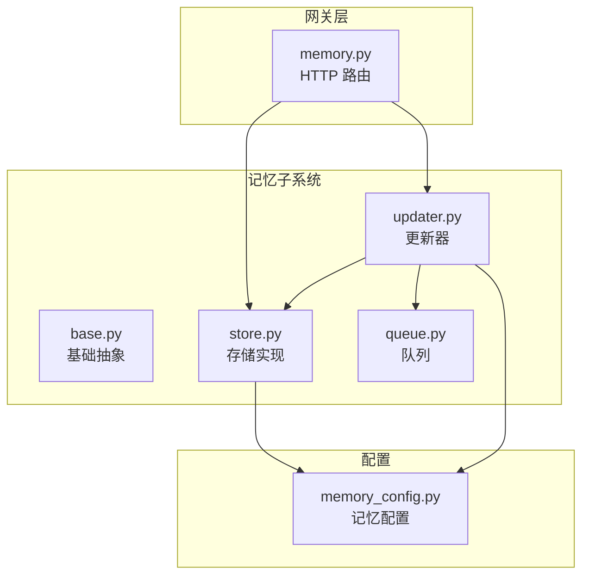
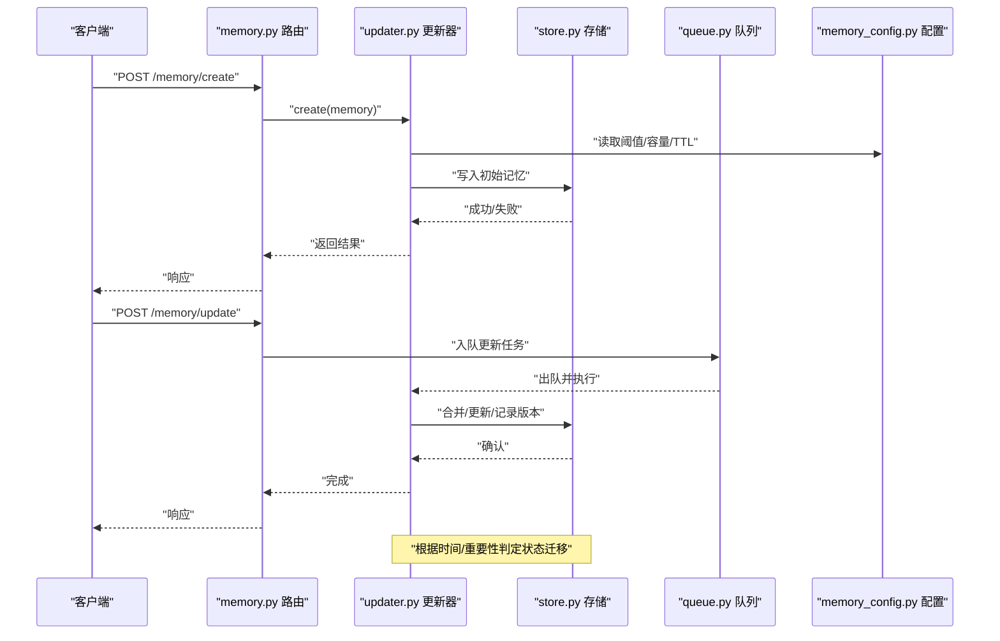
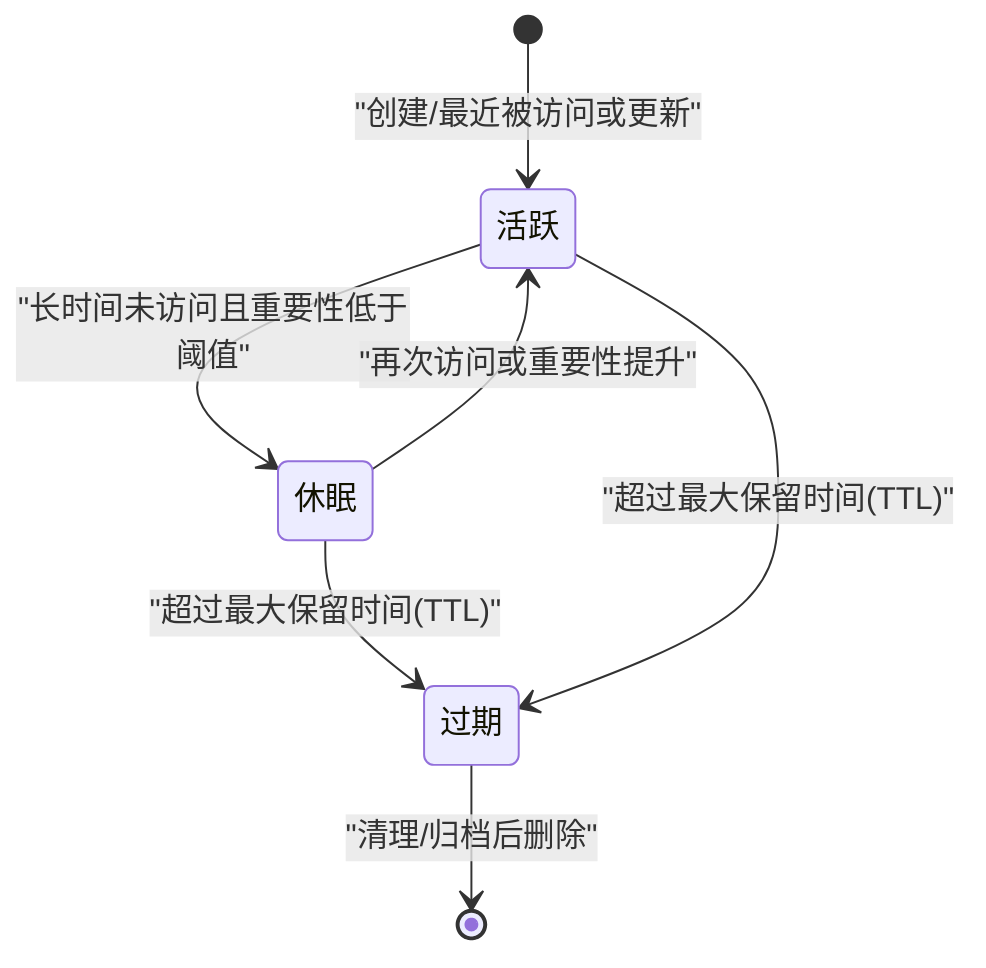
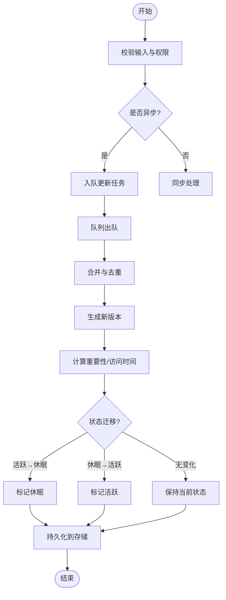
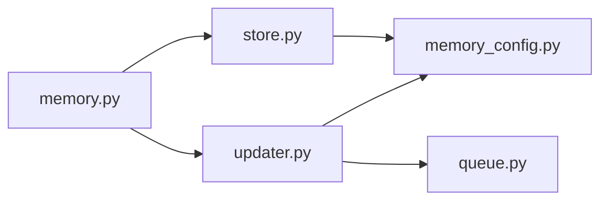

# 记忆生命周期管理

<cite>
**本文引用的文件**   
- [backend/app/gateway/routers/memory.py](file://backend/app/gateway/routers/memory.py)
- [backend/packages/harness/deerflow/agents/memory/__init__.py](file://backend/packages/harness/deerflow/agents/memory/__init__.py)
- [backend/packages/harness/deerflow/agents/memory/base.py](file://backend/packages/harness/deerflow/agents/memory/base.py)
- [backend/packages/harness/deerflow/agents/memory/store.py](file://backend/packages/harness/deerflow/agents/memory/store.py)
- [backend/packages/harness/deerflow/agents/memory/updater.py](file://backend/packages/harness/deerflow/agents/memory/updater.py)
- [backend/packages/harness/deerflow/agents/memory/queue.py](file://backend/packages/harness/deerflow/agents/memory/queue.py)
- [backend/packages/harness/deerflow/config/memory_config.py](file://backend/packages/harness/deerflow/config/memory_config.py)
- [backend/docs/MEMORY_IMPROVEMENTS.md](file://backend/docs/MEMORY_IMPROVEMENTS.md)
- [backend/docs/MEMORY_SETTINGS_REVIEW.md](file://backend/docs/MEMORY_SETTINGS_REVIEW.md)
- [backend/tests/test_memory_router.py](file://backend/tests/test_memory_router.py)
- [backend/tests/test_memory_storage.py](file://backend/tests/test_memory_storage.py)
- [backend/tests/test_memory_updater.py](file://backend/tests/test_memory_updater.py)
- [backend/tests/test_memory_queue.py](file://backend/tests/test_memory_queue.py)
</cite>

## 目录
1. [简介](#简介)
2. [项目结构](#项目结构)
3. [核心组件](#核心组件)
4. [架构总览](#架构总览)
5. [详细组件分析](#详细组件分析)
6. [依赖分析](#依赖分析)
7. [性能考虑](#性能考虑)
8. [故障排查指南](#故障排查指南)
9. [结论](#结论)
10. [附录](#附录)

## 简介
本文件围绕“记忆”在系统中的完整生命周期进行系统化说明，覆盖创建、更新、归档与删除等阶段；阐述活跃、休眠、过期三种状态及其转换规则；给出基于时间与重要性的清理策略与存储空间优化建议；介绍备份与恢复（增量/全量/迁移）、版本控制（变更追踪/差异比较/回滚）以及健康检查工具（完整性验证/性能监控/异常检测）。文档同时提供最佳实践与故障恢复指南，帮助读者在生产环境中稳定运行并高效运维。

## 项目结构
记忆相关能力主要分布在网关路由层、记忆子系统与配置层：
- 网关路由层：对外暴露记忆管理的 HTTP API，负责请求校验、参数解析与响应封装。
- 记忆子系统：包含基础抽象、存储实现、更新器与队列等模块，承担记忆的读写、合并、持久化与异步处理。
- 配置层：提供记忆相关的可配置项，如阈值、容量、保留策略等。

图表来源
- [backend/app/gateway/routers/memory.py](file://backend/app/gateway/routers/memory.py)
- [backend/packages/harness/deerflow/agents/memory/base.py](file://backend/packages/harness/deerflow/agents/memory/base.py)
- [backend/packages/harness/deerflow/agents/memory/store.py](file://backend/packages/harness/deerflow/agents/memory/store.py)
- [backend/packages/harness/deerflow/agents/memory/updater.py](file://backend/packages/harness/deerflow/agents/memory/updater.py)
- [backend/packages/harness/deerflow/agents/memory/queue.py](file://backend/packages/harness/deerflow/agents/memory/queue.py)
- [backend/packages/harness/deerflow/config/memory_config.py](file://backend/packages/harness/deerflow/config/memory_config.py)

章节来源
- [backend/app/gateway/routers/memory.py](file://backend/app/gateway/routers/memory.py)
- [backend/packages/harness/deerflow/agents/memory/__init__.py](file://backend/packages/harness/deerflow/agents/memory/__init__.py)
- [backend/packages/harness/deerflow/config/memory_config.py](file://backend/packages/harness/deerflow/config/memory_config.py)

## 核心组件
- 记忆基础抽象：定义记忆实体、状态枚举、接口契约（创建/读取/更新/删除/查询/归档/清理），为不同存储后端提供统一接入点。
- 存储实现：负责将记忆持久化到具体介质（内存/磁盘/对象存储等），并提供索引、检索与批量操作能力。
- 更新器：聚合新信息、合并冲突、触发状态迁移（活跃→休眠→过期），并记录变更历史以支持版本控制。
- 队列：对高并发写入进行缓冲与削峰，保证更新操作的顺序性与一致性。
- 配置：集中管理记忆容量、TTL、重要性阈值、清理周期、备份策略等可调参数。

章节来源
- [backend/packages/harness/deerflow/agents/memory/base.py](file://backend/packages/harness/deerflow/agents/memory/base.py)
- [backend/packages/harness/deerflow/agents/memory/store.py](file://backend/packages/harness/deerflow/agents/memory/store.py)
- [backend/packages/harness/deerflow/agents/memory/updater.py](file://backend/packages/harness/deerflow/agents/memory/updater.py)
- [backend/packages/harness/deerflow/agents/memory/queue.py](file://backend/packages/harness/deerflow/agents/memory/queue.py)
- [backend/packages/harness/deerflow/config/memory_config.py](file://backend/packages/harness/deerflow/config/memory_config.py)

## 架构总览
下图展示从外部请求到内部处理的端到端流程，包括创建、更新、归档与删除的生命周期路径。

图表来源
- [backend/app/gateway/routers/memory.py](file://backend/app/gateway/routers/memory.py)
- [backend/packages/harness/deerflow/agents/memory/updater.py](file://backend/packages/harness/deerflow/agents/memory/updater.py)
- [backend/packages/harness/deerflow/agents/memory/store.py](file://backend/packages/harness/deerflow/agents/memory/store.py)
- [backend/packages/harness/deerflow/agents/memory/queue.py](file://backend/packages/harness/deerflow/agents/memory/queue.py)
- [backend/packages/harness/deerflow/config/memory_config.py](file://backend/packages/harness/deerflow/config/memory_config.py)

## 详细组件分析

### 状态机与转换规则
记忆具备三类状态：活跃、休眠、过期。状态转换由更新器依据时间与重要性综合判定，并通过存储层记录版本与审计日志。

图表来源
- [backend/packages/harness/deerflow/agents/memory/updater.py](file://backend/packages/harness/deerflow/agents/memory/updater.py)
- [backend/packages/harness/deerflow/agents/memory/store.py](file://backend/packages/harness/deerflow/agents/memory/store.py)
- [backend/packages/harness/deerflow/config/memory_config.py](file://backend/packages/harness/deerflow/config/memory_config.py)

章节来源
- [backend/packages/harness/deerflow/agents/memory/updater.py](file://backend/packages/harness/deerflow/agents/memory/updater.py)
- [backend/packages/harness/deerflow/agents/memory/store.py](file://backend/packages/harness/deerflow/agents/memory/store.py)
- [backend/packages/harness/deerflow/config/memory_config.py](file://backend/packages/harness/deerflow/config/memory_config.py)

### 创建阶段
- 入口：通过网关路由接收创建请求，校验输入并调用更新器执行创建逻辑。
- 关键行为：初始化记忆元数据（标识、时间戳、重要性初值、版本号），写入存储层，并生成首个版本记录。
- 错误处理：对重复创建、非法输入、存储不可用等情况进行明确返回码与提示。

章节来源
- [backend/app/gateway/routers/memory.py](file://backend/app/gateway/routers/memory.py)
- [backend/packages/harness/deerflow/agents/memory/updater.py](file://backend/packages/harness/deerflow/agents/memory/updater.py)
- [backend/packages/harness/deerflow/agents/memory/store.py](file://backend/packages/harness/deerflow/agents/memory/store.py)

### 更新阶段
- 入口：通过网关路由接收更新请求，优先入队异步处理，避免阻塞主线程。
- 关键行为：
  - 合并策略：按时间窗口与内容相似度进行去重与摘要，减少冗余。
  - 版本控制：每次更新生成新版本，记录变更摘要与影响范围。
  - 状态迁移：根据访问频率、最后更新时间与重要性评分评估是否进入休眠或保持活跃。
- 并发控制：队列保证同一记忆键的更新顺序性，避免竞态条件。

图表来源
- [backend/packages/harness/deerflow/agents/memory/updater.py](file://backend/packages/harness/deerflow/agents/memory/updater.py)
- [backend/packages/harness/deerflow/agents/memory/queue.py](file://backend/packages/harness/deerflow/agents/memory/queue.py)
- [backend/packages/harness/deerflow/agents/memory/store.py](file://backend/packages/harness/deerflow/agents/memory/store.py)

章节来源
- [backend/packages/harness/deerflow/agents/memory/updater.py](file://backend/packages/harness/deerflow/agents/memory/updater.py)
- [backend/packages/harness/deerflow/agents/memory/queue.py](file://backend/packages/harness/deerflow/agents/memory/queue.py)
- [backend/packages/harness/deerflow/agents/memory/store.py](file://backend/packages/harness/deerflow/agents/memory/store.py)

### 归档阶段
- 触发条件：达到最大保留时间或长期处于休眠状态且重要性持续偏低。
- 处理方式：将记忆移动到归档区（独立命名空间或分区），降低热路径压力，保留历史可追溯性。
- 资源回收：归档后可释放部分索引与缓存，仅保留必要元数据用于检索与恢复。

章节来源
- [backend/packages/harness/deerflow/agents/memory/updater.py](file://backend/packages/harness/deerflow/agents/memory/updater.py)
- [backend/packages/harness/deerflow/agents/memory/store.py](file://backend/packages/harness/deerflow/agents/memory/store.py)

### 删除阶段
- 触发条件：用户显式删除、归档后超过冷保留期、或系统清理策略触发。
- 处理方式：软删除（标记已删除）与硬删除（物理移除）两种模式，默认采用软删除以便审计与回滚。
- 幂等性：删除操作需保证幂等，重复删除不报错。

章节来源
- [backend/packages/harness/deerflow/agents/memory/updater.py](file://backend/packages/harness/deerflow/agents/memory/updater.py)
- [backend/packages/harness/deerflow/agents/memory/store.py](file://backend/packages/harness/deerflow/agents/memory/store.py)

### 清理策略
- 基于时间的清理：
  - TTL 控制：为每条记忆设置存活时间，到期自动进入归档或删除流程。
  - 定期任务：周期性扫描过期条目，批量清理以减少碎片。
- 基于重要性的筛选：
  - 重要性评分：结合访问频率、内容新颖度、关联度等指标动态调整。
  - 阈值策略：低于阈值的记忆优先进入休眠或归档。
- 存储空间优化：
  - 压缩与去重：对相似内容进行摘要与去重，减少体积。
  - 冷热分层：热数据驻留内存/SSD，冷数据下沉至低成本存储。

章节来源
- [backend/packages/harness/deerflow/agents/memory/updater.py](file://backend/packages/harness/deerflow/agents/memory/updater.py)
- [backend/packages/harness/deerflow/agents/memory/store.py](file://backend/packages/harness/deerflow/agents/memory/store.py)
- [backend/packages/harness/deerflow/config/memory_config.py](file://backend/packages/harness/deerflow/config/memory_config.py)

### 备份与恢复机制
- 全量备份：
  - 定时快照：对全部记忆进行一致性快照，便于灾难恢复。
  - 导出格式：结构化导出，包含元数据、版本链与索引映射。
- 增量备份：
  - 变更捕获：基于版本号的增量收集，仅备份新增与修改部分。
  - 合并策略：恢复时按版本号顺序应用增量，确保最终一致。
- 数据迁移：
  - 跨存储迁移：支持在不同存储后端之间迁移，保持版本链与索引完整。
  - 兼容性检查：迁移前进行 schema 与字段兼容性校验，失败则回滚。

章节来源
- [backend/packages/harness/deerflow/agents/memory/store.py](file://backend/packages/harness/deerflow/agents/memory/store.py)
- [backend/packages/harness/deerflow/agents/memory/updater.py](file://backend/packages/harness/deerflow/agents/memory/updater.py)

### 版本控制
- 变更追踪：
  - 版本编号：单调递增的版本号，记录每次更新的摘要与时间戳。
  - 审计日志：记录操作者、来源与变更影响范围。
- 差异比较：
  - 内容差异：对比相邻版本的差异，支持文本/结构化数据的 diff。
  - 影响面分析：识别受影响的下游依赖与上下文。
- 回滚操作：
  - 指定版本回滚：恢复到任意历史版本，生成新的版本节点以保持线性历史。
  - 事务性：回滚过程具备原子性，失败则回退中间状态。

章节来源
- [backend/packages/harness/deerflow/agents/memory/updater.py](file://backend/packages/harness/deerflow/agents/memory/updater.py)
- [backend/packages/harness/deerflow/agents/memory/store.py](file://backend/packages/harness/deerflow/agents/memory/store.py)

### 健康检查工具
- 完整性验证：
  - 索引一致性：校验索引与数据的一致性，修复断裂链接。
  - 版本链完整性：检查版本链是否连续，缺失则尝试重建。
- 性能监控：
  - 延迟与吞吐：监控读写延迟、队列积压与吞吐指标。
  - 资源使用：监控内存、磁盘与 I/O 占用，设置告警阈值。
- 异常检测：
  - 写入失败率：统计失败比例，定位热点失败原因。
  - 状态异常：检测长时间处于休眠或过期的异常聚集。

章节来源
- [backend/packages/harness/deerflow/agents/memory/store.py](file://backend/packages/harness/deerflow/agents/memory/store.py)
- [backend/packages/harness/deerflow/agents/memory/updater.py](file://backend/packages/harness/deerflow/agents/memory/updater.py)

### 最佳实践
- 合理设置 TTL 与重要性阈值，平衡活跃度与存储成本。
- 启用异步更新与队列削峰，避免高峰期阻塞。
- 定期执行全量备份与增量备份，制定恢复演练计划。
- 对关键记忆开启强一致写入与审计日志，便于问题溯源。
- 监控健康指标，建立告警与自愈策略（如自动扩容、降级）。

[本节为通用指导，无需特定文件引用]

### 故障恢复指南
- 常见故障：
  - 写入超时：检查队列长度与存储后端负载，必要时扩容或限流。
  - 版本不一致：运行完整性校验并修复版本链。
  - 归档堆积：调整归档策略与清理周期，释放空间。
- 恢复步骤：
  - 停止写入：暂停更新任务，防止状态进一步恶化。
  - 恢复快照：从最近的全量快照恢复，再应用增量备份。
  - 验证一致性：执行健康检查，确认索引与版本链正常。
  - 逐步恢复：先恢复只读服务，再逐步放开写入。

章节来源
- [backend/packages/harness/deerflow/agents/memory/store.py](file://backend/packages/harness/deerflow/agents/memory/store.py)
- [backend/packages/harness/deerflow/agents/memory/updater.py](file://backend/packages/harness/deerflow/agents/memory/updater.py)

## 依赖分析
记忆子系统内部依赖关系如下：
- 路由层依赖更新器与存储层，负责编排与响应。
- 更新器依赖配置与队列，协调状态迁移与版本控制。
- 存储层依赖配置，提供持久化与检索能力。

图表来源
- [backend/app/gateway/routers/memory.py](file://backend/app/gateway/routers/memory.py)
- [backend/packages/harness/deerflow/agents/memory/updater.py](file://backend/packages/harness/deerflow/agents/memory/updater.py)
- [backend/packages/harness/deerflow/agents/memory/store.py](file://backend/packages/harness/deerflow/agents/memory/store.py)
- [backend/packages/harness/deerflow/agents/memory/queue.py](file://backend/packages/harness/deerflow/agents/memory/queue.py)
- [backend/packages/harness/deerflow/config/memory_config.py](file://backend/packages/harness/deerflow/config/memory_config.py)

章节来源
- [backend/app/gateway/routers/memory.py](file://backend/app/gateway/routers/memory.py)
- [backend/packages/harness/deerflow/agents/memory/updater.py](file://backend/packages/harness/deerflow/agents/memory/updater.py)
- [backend/packages/harness/deerflow/agents/memory/store.py](file://backend/packages/harness/deerflow/agents/memory/store.py)
- [backend/packages/harness/deerflow/agents/memory/queue.py](file://backend/packages/harness/deerflow/agents/memory/queue.py)
- [backend/packages/harness/deerflow/config/memory_config.py](file://backend/packages/harness/deerflow/config/memory_config.py)

## 性能考虑
- 写入路径优化：
  - 使用队列进行批处理与合并，降低频繁小写带来的开销。
  - 对热点记忆建立局部缓存，提高读取性能。
- 读取路径优化：
  - 索引预加载与分页查询，避免一次性加载大量数据。
  - 冷热分层读取，冷数据按需拉取。
- 存储优化：
  - 压缩与去重，减少磁盘占用。
  - 分片与分区，提升并行处理能力。
- 监控与调优：
  - 关注 P95/P99 延迟与吞吐，结合业务峰值进行容量规划。
  - 定期压测，评估清理与归档策略的效果。

[本节为通用指导，无需特定文件引用]

## 故障排查指南
- 快速定位：
  - 查看路由层日志，确认请求是否到达更新器与存储层。
  - 检查队列积压情况，判断是否为瓶颈。
- 常见问题：
  - 状态未迁移：核对 TTL 与重要性阈值配置是否正确。
  - 版本丢失：运行完整性校验，修复版本链。
  - 备份失败：检查存储权限与空间，重试并记录失败原因。
- 诊断工具：
  - 健康检查接口：输出索引一致性、版本链完整性与资源使用概况。
  - 慢查询分析：定位耗时较长的读写操作，优化索引与查询条件。

章节来源
- [backend/app/gateway/routers/memory.py](file://backend/app/gateway/routers/memory.py)
- [backend/packages/harness/deerflow/agents/memory/updater.py](file://backend/packages/harness/deerflow/agents/memory/updater.py)
- [backend/packages/harness/deerflow/agents/memory/store.py](file://backend/packages/harness/deerflow/agents/memory/store.py)

## 结论
记忆生命周期管理通过清晰的状态机、严格的版本控制与完善的清理策略，实现了高可用、可扩展的记忆系统。配合备份恢复与健康检查工具，可在复杂生产环境中保障数据一致性与系统稳定性。建议在实践中持续监控与调优，结合业务特性定制阈值与策略，以获得最佳性能与成本平衡。

[本节为总结性内容，无需特定文件引用]

## 附录
- 参考文档：
  - 记忆改进说明与设置评审，有助于理解设计动机与演进方向。
- 测试用例：
  - 路由、存储、更新器与队列的单元测试与集成测试，可作为行为契约参考。

章节来源
- [backend/docs/MEMORY_IMPROVEMENTS.md](file://backend/docs/MEMORY_IMPROVEMENTS.md)
- [backend/docs/MEMORY_SETTINGS_REVIEW.md](file://backend/docs/MEMORY_SETTINGS_REVIEW.md)
- [backend/tests/test_memory_router.py](file://backend/tests/test_memory_router.py)
- [backend/tests/test_memory_storage.py](file://backend/tests/test_memory_storage.py)
- [backend/tests/test_memory_updater.py](file://backend/tests/test_memory_updater.py)
- [backend/tests/test_memory_queue.py](file://backend/tests/test_memory_queue.py)