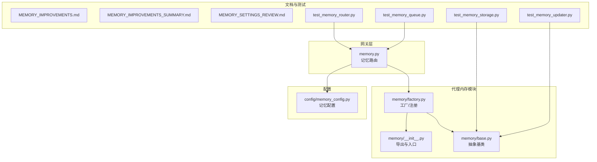
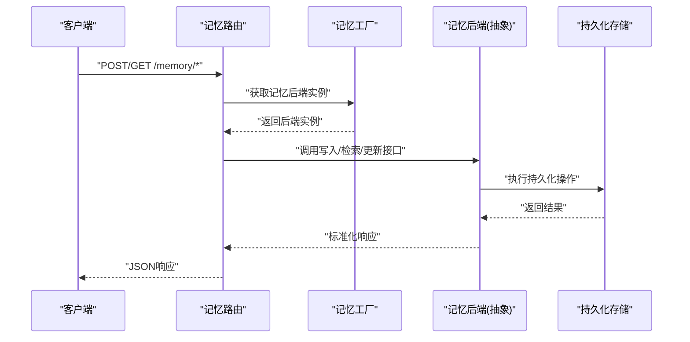
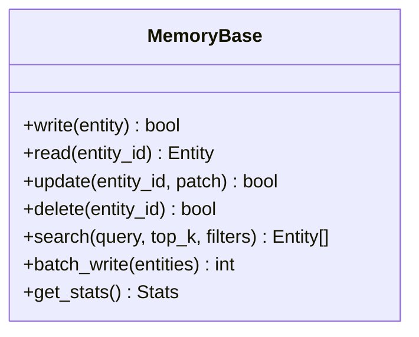
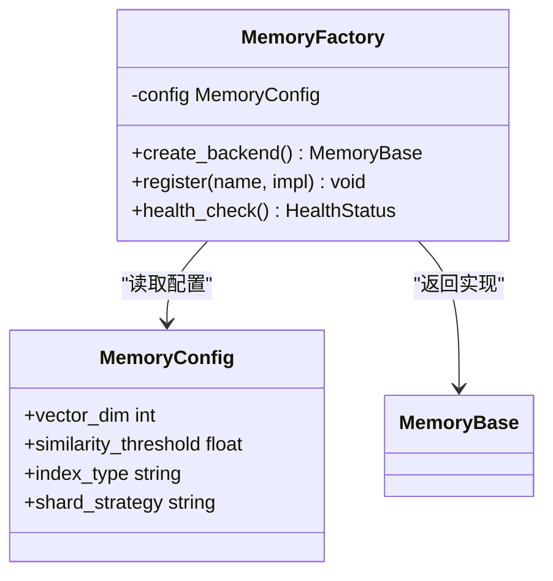
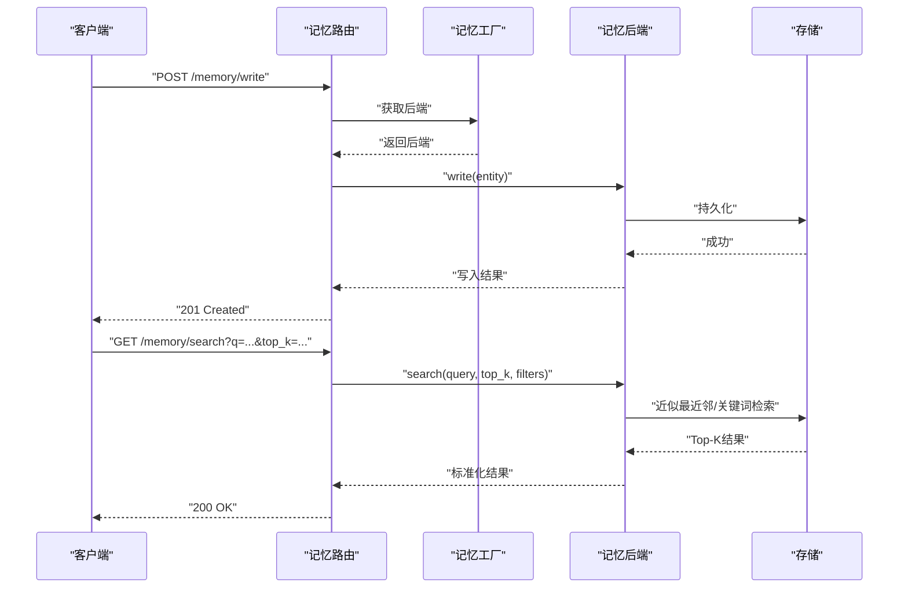
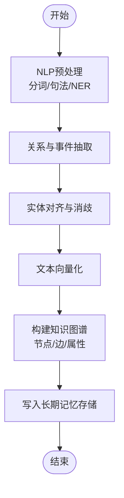
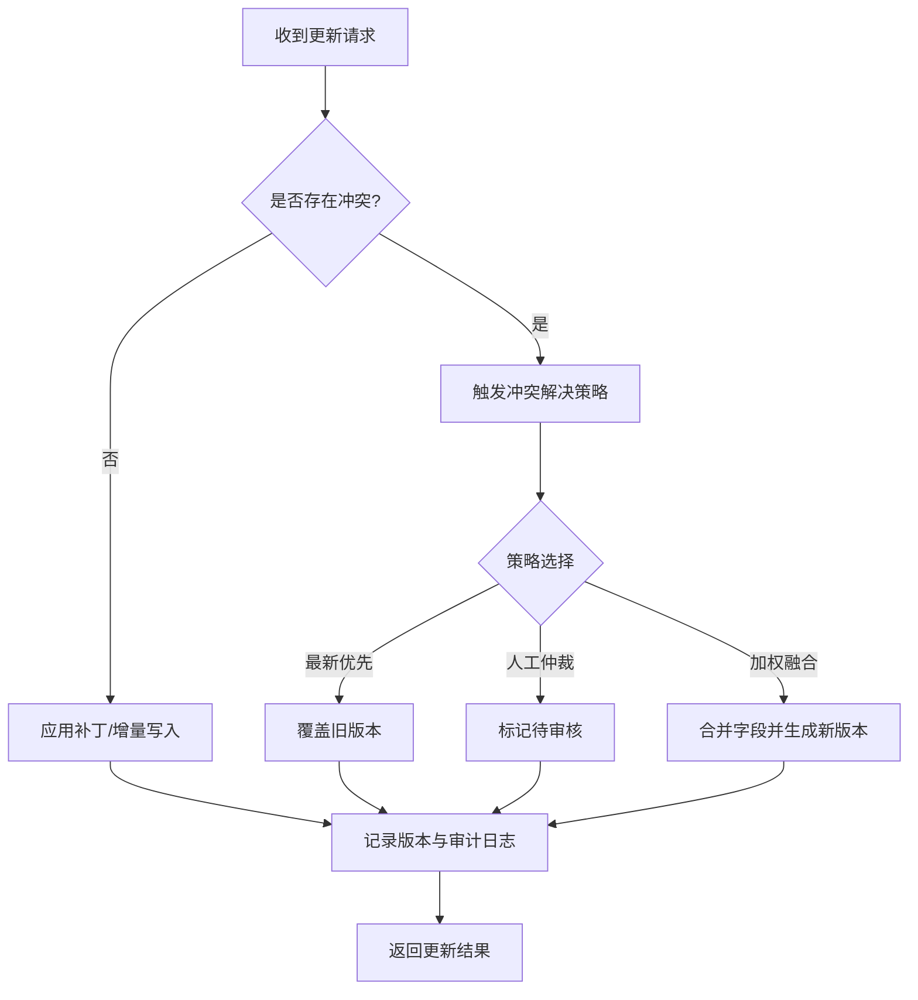
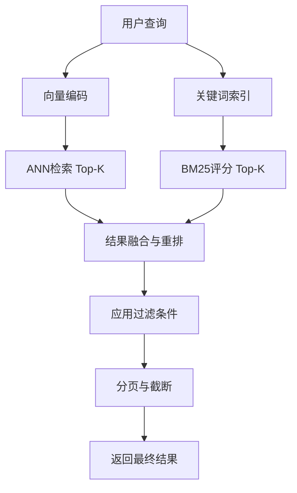
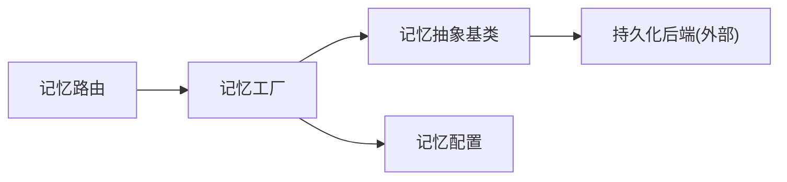

# 长期记忆存储

<cite>
**本文引用的文件**   
- [backend/app/gateway/routers/memory.py](file://backend/app/gateway/routers/memory.py)
- [backend/packages/harness/deerflow/agents/memory/__init__.py](file://backend/packages/harness/deerflow/agents/memory/__init__.py)
- [backend/packages/harness/deerflow/agents/memory/base.py](file://backend/packages/harness/deerflow/agents/memory/base.py)
- [backend/packages/harness/deerflow/agents/memory/factory.py](file://backend/packages/harness/deerflow/agents/memory/factory.py)
- [backend/packages/harness/deerflow/config/memory_config.py](file://backend/packages/harness/deerflow/config/memory_config.py)
- [backend/docs/MEMORY_IMPROVEMENTS.md](file://backend/docs/MEMORY_IMPROVEMENTS.md)
- [backend/docs/MEMORY_IMPROVEMENTS_SUMMARY.md](file://backend/docs/MEMORY_IMPROVEMENTS_SUMMARY.md)
- [backend/docs/MEMORY_SETTINGS_REVIEW.md](file://backend/docs/MEMORY_SETTINGS_REVIEW.md)
- [backend/tests/test_memory_storage.py](file://backend/tests/test_memory_storage.py)
- [backend/tests/test_memory_updater.py](file://backend/tests/test_memory_updater.py)
- [backend/tests/test_memory_router.py](file://backend/tests/test_memory_router.py)
- [backend/tests/test_memory_queue.py](file://backend/tests/test_memory_queue.py)
</cite>

## 目录
1. [简介](#简介)
2. [项目结构](#项目结构)
3. [核心组件](#核心组件)
4. [架构总览](#架构总览)
5. [详细组件分析](#详细组件分析)
6. [依赖关系分析](#依赖关系分析)
7. [性能考量](#性能考量)
8. [故障排查指南](#故障排查指南)
9. [结论](#结论)
10. [附录](#附录)

## 简介
本文件面向“长期记忆存储”子系统，系统性阐述其设计理念、应用场景（事实存储、知识积累、经验复用）、存储结构设计（实体关系模型、索引策略、查询优化）、事实提取算法（NLP、语义分析、知识图谱构建）、记忆更新机制（增量更新、冲突解决、版本控制）、检索策略与相似度匹配（向量搜索、关键词匹配）、后端配置与扩展方法，以及性能监控与优化建议。文档以仓库中实际实现为依据，结合测试与文档材料进行说明。

## 项目结构
长期记忆相关代码主要分布在以下位置：
- 网关路由层：对外暴露记忆管理接口
- 代理内存模块：抽象接口、工厂与具体实现
- 配置模块：记忆系统参数化配置
- 文档与测试：设计演进、设置审查与行为验证

图表来源
- [backend/app/gateway/routers/memory.py](file://backend/app/gateway/routers/memory.py)
- [backend/packages/harness/deerflow/agents/memory/__init__.py](file://backend/packages/harness/deerflow/agents/memory/__init__.py)
- [backend/packages/harness/deerflow/agents/memory/base.py](file://backend/packages/harness/deerflow/agents/memory/base.py)
- [backend/packages/harness/deerflow/agents/memory/factory.py](file://backend/packages/harness/deerflow/agents/memory/factory.py)
- [backend/packages/harness/deerflow/config/memory_config.py](file://backend/packages/harness/deerflow/config/memory_config.py)
- [backend/docs/MEMORY_IMPROVEMENTS.md](file://backend/docs/MEMORY_IMPROVEMENTS.md)
- [backend/docs/MEMORY_IMPROVEMENTS_SUMMARY.md](file://backend/docs/MEMORY_IMPROVEMENTS_SUMMARY.md)
- [backend/docs/MEMORY_SETTINGS_REVIEW.md](file://backend/docs/MEMORY_SETTINGS_REVIEW.md)
- [backend/tests/test_memory_storage.py](file://backend/tests/test_memory_storage.py)
- [backend/tests/test_memory_updater.py](file://backend/tests/test_memory_updater.py)
- [backend/tests/test_memory_router.py](file://backend/tests/test_memory_router.py)
- [backend/tests/test_memory_queue.py](file://backend/tests/test_memory_queue.py)

章节来源
- [backend/app/gateway/routers/memory.py](file://backend/app/gateway/routers/memory.py)
- [backend/packages/harness/deerflow/agents/memory/__init__.py](file://backend/packages/harness/deerflow/agents/memory/__init__.py)
- [backend/packages/harness/deerflow/agents/memory/base.py](file://backend/packages/harness/deerflow/agents/memory/base.py)
- [backend/packages/harness/deerflow/agents/memory/factory.py](file://backend/packages/harness/deerflow/agents/memory/factory.py)
- [backend/packages/harness/deerflow/config/memory_config.py](file://backend/packages/harness/deerflow/config/memory_config.py)
- [backend/docs/MEMORY_IMPROVEMENTS.md](file://backend/docs/MEMORY_IMPROVEMENTS.md)
- [backend/docs/MEMORY_IMPROVEMENTS_SUMMARY.md](file://backend/docs/MEMORY_IMPROVEMENTS_SUMMARY.md)
- [backend/docs/MEMORY_SETTINGS_REVIEW.md](file://backend/docs/MEMORY_SETTINGS_REVIEW.md)
- [backend/tests/test_memory_storage.py](file://backend/tests/test_memory_storage.py)
- [backend/tests/test_memory_updater.py](file://backend/tests/test_memory_updater.py)
- [backend/tests/test_memory_router.py](file://backend/tests/test_memory_router.py)
- [backend/tests/test_memory_queue.py](file://backend/tests/test_memory_queue.py)

## 核心组件
- 记忆路由层：提供HTTP接口用于创建、更新、删除与检索长期记忆条目；负责请求校验、参数解析与结果序列化。
- 记忆抽象基类：定义统一的持久化接口（写入、读取、更新、删除、检索），屏蔽底层存储差异。
- 记忆工厂：根据配置选择并实例化具体记忆后端，支持多后端切换与扩展。
- 记忆配置：集中管理向量维度、相似度阈值、索引策略、分片/分页等关键参数。
- 测试套件：覆盖路由、存储、更新器与队列等关键路径，保障功能正确性与稳定性。

章节来源
- [backend/app/gateway/routers/memory.py](file://backend/app/gateway/routers/memory.py)
- [backend/packages/harness/deerflow/agents/memory/base.py](file://backend/packages/harness/deerflow/agents/memory/base.py)
- [backend/packages/harness/deerflow/agents/memory/factory.py](file://backend/packages/harness/deerflow/agents/memory/factory.py)
- [backend/packages/harness/deerflow/config/memory_config.py](file://backend/packages/harness/deerflow/config/memory_config.py)
- [backend/tests/test_memory_router.py](file://backend/tests/test_memory_router.py)
- [backend/tests/test_memory_storage.py](file://backend/tests/test_memory_storage.py)
- [backend/tests/test_memory_updater.py](file://backend/tests/test_memory_updater.py)
- [backend/tests/test_memory_queue.py](file://backend/tests/test_memory_queue.py)

## 架构总览
长期记忆系统采用“路由-工厂-抽象-实现”的分层架构：
- 路由层接收外部请求，调用工厂获取具体记忆后端实例。
- 工厂依据配置动态加载后端实现，注入配置项。
- 抽象基类统一接口契约，确保不同后端具备一致的行为。
- 配置模块提供可插拔的参数集，驱动索引、检索与更新策略。

图表来源
- [backend/app/gateway/routers/memory.py](file://backend/app/gateway/routers/memory.py)
- [backend/packages/harness/deerflow/agents/memory/factory.py](file://backend/packages/harness/deerflow/agents/memory/factory.py)
- [backend/packages/harness/deerflow/agents/memory/base.py](file://backend/packages/harness/deerflow/agents/memory/base.py)

## 详细组件分析

### 记忆抽象基类与接口契约
- 职责：定义写入、读取、更新、删除、检索的统一方法签名与错误约定。
- 设计要点：
  - 强类型输入输出，便于跨后端一致性。
  - 明确异常分类（如不存在、重复、权限不足）。
  - 支持分页与过滤条件，适配大规模数据检索。
- 复杂度与性能：
  - 写入通常为O(1)到O(log n)取决于底层索引。
  - 相似度检索受向量维度与索引结构影响，典型为近似最近邻搜索。

图表来源
- [backend/packages/harness/deerflow/agents/memory/base.py](file://backend/packages/harness/deerflow/agents/memory/base.py)

章节来源
- [backend/packages/harness/deerflow/agents/memory/base.py](file://backend/packages/harness/deerflow/agents/memory/base.py)

### 记忆工厂与后端选择
- 职责：根据配置选择具体记忆后端（如向量库、图数据库或混合方案），完成初始化与依赖注入。
- 设计要点：
  - 支持多后端注册与热切换。
  - 配置项包括向量维度、相似度阈值、索引类型、分片策略等。
  - 提供健康检查与回退策略。
- 扩展性：新增后端只需实现抽象基类并在工厂注册。

图表来源
- [backend/packages/harness/deerflow/agents/memory/factory.py](file://backend/packages/harness/deerflow/agents/memory/factory.py)
- [backend/packages/harness/deerflow/config/memory_config.py](file://backend/packages/harness/deerflow/config/memory_config.py)

章节来源
- [backend/packages/harness/deerflow/agents/memory/factory.py](file://backend/packages/harness/deerflow/agents/memory/factory.py)
- [backend/packages/harness/deerflow/config/memory_config.py](file://backend/packages/harness/deerflow/config/memory_config.py)

### 记忆路由与API工作流
- 职责：暴露REST接口，处理请求生命周期（鉴权、校验、限流、日志、错误转换）。
- 关键流程：
  - 写入：校验输入、去重、持久化、返回ID与元信息。
  - 检索：解析查询、构造过滤器、调用后端检索、排序与分页。
  - 更新/删除：幂等性保证、并发控制、审计记录。
- 错误处理：统一错误码与消息体，便于前端展示与重试。

图表来源
- [backend/app/gateway/routers/memory.py](file://backend/app/gateway/routers/memory.py)
- [backend/packages/harness/deerflow/agents/memory/factory.py](file://backend/packages/harness/deerflow/agents/memory/factory.py)
- [backend/packages/harness/deerflow/agents/memory/base.py](file://backend/packages/harness/deerflow/agents/memory/base.py)

章节来源
- [backend/app/gateway/routers/memory.py](file://backend/app/gateway/routers/memory.py)
- [backend/tests/test_memory_router.py](file://backend/tests/test_memory_router.py)

### 事实提取与知识组织
- 自然语言处理技术：
  - 命名实体识别（NER）：抽取人物、地点、机构等实体。
  - 关系抽取：从句子中识别主谓宾三元组，形成边关系。
  - 事件抽取：时间、地点、参与方与动作的结构化表示。
- 语义分析与知识图谱构建：
  - 文本向量化：将段落或句子映射为高维向量，用于相似度检索。
  - 实体消歧与对齐：合并同义实体，建立统一标识。
  - 图谱存储：节点为实体，边为关系，属性包含置信度与来源。
- 事实存储与应用场景：
  - 事实存储：结构化三元组与属性，支持快速查询与推理。
  - 知识积累：随对话与任务推进持续沉淀领域知识。
  - 经验复用：将历史解决方案抽象为模板，供后续任务直接复用。

[本节为概念性流程说明，不直接对应具体源码文件]

### 记忆更新机制
- 增量更新：
  - 基于时间戳或版本号进行增量写入，避免全量覆盖。
  - 支持补丁式更新，仅变更字段最小化开销。
- 冲突解决：
  - 冲突检测：比较版本或内容哈希。
  - 解决策略：最新优先、人工仲裁、加权融合。
- 版本控制：
  - 每条记忆条目维护版本链，支持回溯与审计。
  - 快照与差异存储，降低恢复成本。

[本节为概念性流程说明，不直接对应具体源码文件]

### 检索策略与相似度匹配
- 向量搜索：
  - 使用近似最近邻（ANN）算法，如HNSW、IVF-PQ等，平衡召回率与延迟。
  - 支持多维向量与归一化，提升跨域相似度可比性。
- 关键词匹配：
  - 倒排索引与BM25评分，适用于精确术语与短查询。
- 混合检索：
  - 向量与关键词结果融合，按权重重新排序。
- 过滤与分页：
  - 基于标签、时间范围、来源等元数据进行预过滤，减少候选集。
  - 游标分页与深度分页优化，避免大偏移带来的性能退化。

[本节为概念性流程说明，不直接对应具体源码文件]

### 存储后端配置与扩展
- 配置项示例（来自配置模块）：
  - 向量维度、相似度阈值、索引类型、分片策略、连接池大小、超时与重试次数。
- 扩展方法：
  - 实现抽象基类的新后端，并在工厂注册。
  - 通过配置开关切换后端，无需修改上层逻辑。
  - 提供健康检查与降级策略，保障可用性。

章节来源
- [backend/packages/harness/deerflow/config/memory_config.py](file://backend/packages/harness/deerflow/config/memory_config.py)
- [backend/packages/harness/deerflow/agents/memory/factory.py](file://backend/packages/harness/deerflow/agents/memory/factory.py)

### 设计与演进参考
- 改进总结与设置审查文档提供了长期记忆在系统中的定位、关键指标与调优方向，可作为实践参考。

章节来源
- [backend/docs/MEMORY_IMPROVEMENTS.md](file://backend/docs/MEMORY_IMPROVEMENTS.md)
- [backend/docs/MEMORY_IMPROVEMENTS_SUMMARY.md](file://backend/docs/MEMORY_IMPROVEMENTS_SUMMARY.md)
- [backend/docs/MEMORY_SETTINGS_REVIEW.md](file://backend/docs/MEMORY_SETTINGS_REVIEW.md)

## 依赖关系分析
- 耦合与内聚：
  - 路由层仅依赖工厂与抽象接口，低耦合。
  - 工厂集中管理后端选择，提高内聚性。
- 外部依赖：
  - 向量数据库/图数据库/搜索引擎等作为持久化后端。
  - 配置系统与日志/追踪系统贯穿各层。
- 循环依赖：
  - 通过抽象与工厂解耦，避免直接循环引用。

图表来源
- [backend/app/gateway/routers/memory.py](file://backend/app/gateway/routers/memory.py)
- [backend/packages/harness/deerflow/agents/memory/factory.py](file://backend/packages/harness/deerflow/agents/memory/factory.py)
- [backend/packages/harness/deerflow/agents/memory/base.py](file://backend/packages/harness/deerflow/agents/memory/base.py)
- [backend/packages/harness/deerflow/config/memory_config.py](file://backend/packages/harness/deerflow/config/memory_config.py)

章节来源
- [backend/app/gateway/routers/memory.py](file://backend/app/gateway/routers/memory.py)
- [backend/packages/harness/deerflow/agents/memory/factory.py](file://backend/packages/harness/deerflow/agents/memory/factory.py)
- [backend/packages/harness/deerflow/agents/memory/base.py](file://backend/packages/harness/deerflow/agents/memory/base.py)
- [backend/packages/harness/deerflow/config/memory_config.py](file://backend/packages/harness/deerflow/config/memory_config.py)

## 性能考量
- 写入吞吐：
  - 批量写入与异步队列提升吞吐，减少往返开销。
  - 合理设置连接池与并发度，避免资源争用。
- 检索延迟：
  - 调整Top-K与相似度阈值，平衡召回与延迟。
  - 使用预过滤与缓存热点查询结果。
- 存储规模：
  - 分片与水平扩展，按实体或时间范围划分。
  - 冷热分层，近期数据驻留内存或SSD，历史数据归档。
- 监控指标：
  - P95/P99延迟、QPS、错误率、索引构建耗时、向量维度分布。
  - 告警阈值与自动扩缩容策略。

[本节提供通用指导，不直接分析具体文件]

## 故障排查指南
- 常见问题：
  - 写入失败：检查后端连接、权限与配额；查看错误码与堆栈。
  - 检索为空：确认向量维度与阈值配置；验证索引是否构建完成。
  - 更新冲突：查看版本链与审计日志，选择合适解决策略。
- 诊断工具：
  - 健康检查接口与后端状态面板。
  - 日志聚合与链路追踪，定位慢查询与瓶颈。
- 回归测试：
  - 使用测试套件覆盖路由、存储、更新器与队列路径，确保修复有效。

章节来源
- [backend/tests/test_memory_storage.py](file://backend/tests/test_memory_storage.py)
- [backend/tests/test_memory_updater.py](file://backend/tests/test_memory_updater.py)
- [backend/tests/test_memory_router.py](file://backend/tests/test_memory_router.py)
- [backend/tests/test_memory_queue.py](file://backend/tests/test_memory_queue.py)

## 结论
长期记忆存储通过清晰的分层架构与可扩展的后端设计，实现了事实存储、知识积累与经验复用的目标。抽象基类与工厂模式保障了多后端的一致性与灵活性，配置驱动的索引与检索策略满足多样化需求。配合完善的测试与文档，系统在可靠性、性能与可维护性方面具备良好的工程基础。未来可在知识图谱推理、增量学习、跨域迁移等方面进一步探索。

## 附录
- 术语表：
  - 向量搜索：在高维空间中寻找相似向量的检索方式。
  - 近似最近邻：牺牲少量精度换取更高效率的最近邻搜索算法。
  - 实体消歧：将不同表述指向同一实体的过程。
- 最佳实践：
  - 小步快跑：频繁增量更新，避免一次性大改。
  - 灰度发布：新后端先小流量验证，再逐步放量。
  - 观测先行：上线前完善指标与告警，确保问题早发现早处置。