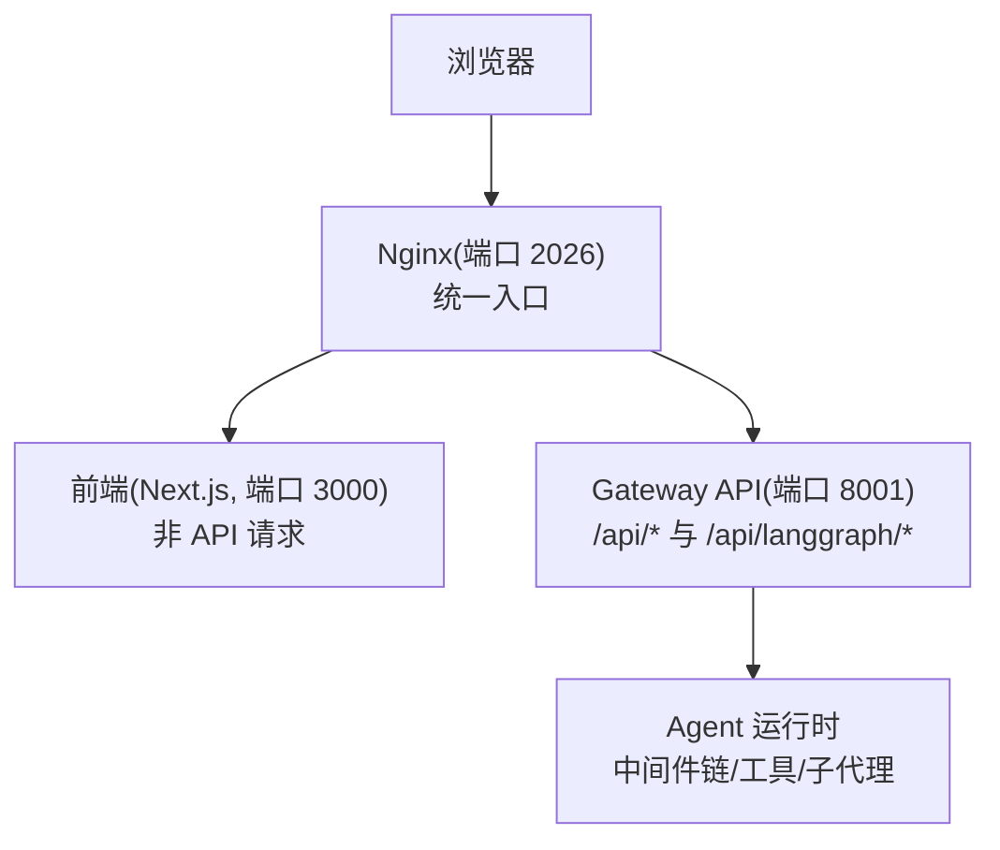
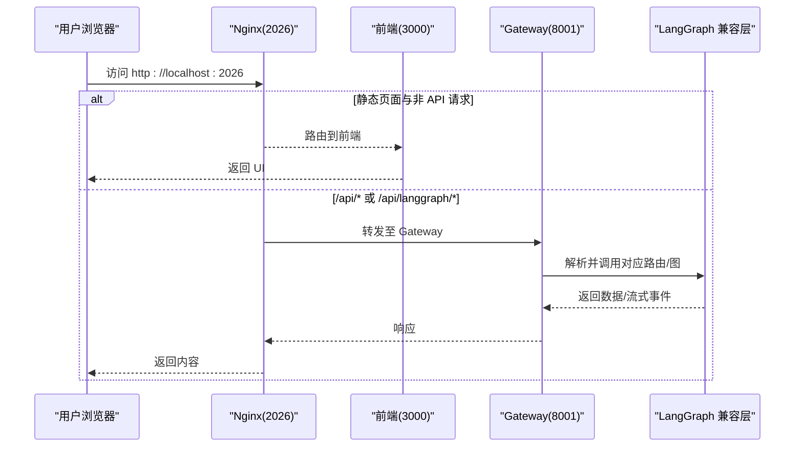
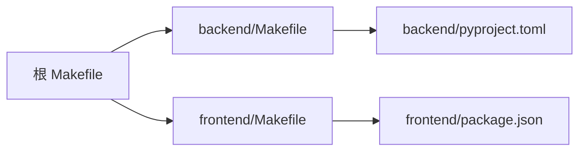

# 贡献指南

<cite>
**本文引用的文件**   
- [CONTRIBUTING.md](file://CONTRIBUTING.md)
- [backend/CONTRIBUTING.md](file://backend/CONTRIBUTING.md)
- [README.md](file://README.md)
- [backend/README.md](file://backend/README.md)
- [frontend/README.md](file://frontend/README.md)
- [Makefile](file://Makefile)
- [backend/Makefile](file://backend/Makefile)
- [frontend/Makefile](file://frontend/Makefile)
- [config.example.yaml](file://config.example.yaml)
- [extensions_config.example.json](file://extensions_config.example.json)
- [.github/pull_request_template.md](file://.github/pull_request_template.md)
- [backend/pyproject.toml](file://backend/pyproject.toml)
- [frontend/package.json](file://frontend/package.json)
- [frontend/eslint.config.js](file://frontend/eslint.config.js)
</cite>

## 目录
1. [简介](#简介)
2. [项目结构](#项目结构)
3. [核心组件](#核心组件)
4. [架构总览](#架构总览)
5. [详细组件分析](#详细组件分析)
6. [依赖分析](#依赖分析)
7. [性能考虑](#性能考虑)
8. [故障排查指南](#故障排查指南)
9. [结论](#结论)
10. [附录](#附录)

## 简介
本指南面向 DeerFlow 的新老贡献者，覆盖从环境搭建、代码规范、测试到 Pull Request 提交流程的完整开发路径。我们推荐优先使用 Docker 进行本地开发以获得一致且低摩擦的体验；也提供本地直跑方案。文档同时给出后端与前端各自的规范、命令与最佳实践，帮助你在最短时间进入高效贡献状态。

## 项目结构
DeerFlow 采用前后端分离与多模块组织：
- 根目录提供统一的 Makefile 与配置模板，便于一键初始化、安装、启动与打包。
- backend 包含 FastAPI Gateway、LangGraph 运行时、沙箱、工具、技能、持久化等核心能力。
- frontend 基于 Next.js 构建 Web 界面，集成 AI Elements 与 LangGraph SDK。
- docker 与 scripts 提供容器化与运维脚本。
- skills 为可插拔的技能包集合。

图表来源
- [backend/README.md:9-30](file://backend/README.md#L9-L30)
- [backend/README.md:32-36](file://backend/README.md#L32-L36)

章节来源
- [CONTRIBUTING.md:218-245](file://CONTRIBUTING.md#L218-L245)
- [backend/README.md:220-265](file://backend/README.md#L220-L265)
- [frontend/README.md:91-125](file://frontend/README.md#L91-L125)

## 核心组件
- Gateway API：FastAPI 应用，暴露模型、MCP、技能、记忆、上传、线程、运行、流式事件等接口。
- Agent 运行时：以 lead_agent 为入口，组合动态模型选择、中间件链、工具系统、子代理委派与系统提示注入。
- 中间件链：按严格顺序执行，涵盖线程隔离、上传注入、沙箱获取、上下文摘要、待办跟踪、标题生成、记忆队列、图像注入与澄清拦截。
- 沙箱系统：提供 per-thread 隔离执行环境，支持本地与容器化（AioSandboxProvider），虚拟路径映射与文件写入安全策略。
- 子代理系统：异步任务委派，并发执行与结果聚合。
- 记忆系统：对话级持久化上下文抽取与结构化存储。
- 工具生态：内置工具、社区工具、MCP 服务与技能注入。

章节来源
- [backend/README.md:39-133](file://backend/README.md#L39-L133)

## 架构总览
下图展示了从浏览器到 Nginx、前端与 Gateway 的请求路由关系，以及 Gateway 内部对 LangGraph 兼容 API 的转发。

图表来源
- [backend/README.md:9-36](file://backend/README.md#L9-L36)

章节来源
- [backend/README.md:9-36](file://backend/README.md#L9-L36)

## 详细组件分析

### 开发环境与启动
- 推荐方式：Docker 开发
  - 先复制配置模板并设置密钥，再执行初始化与启动命令。
  - 所有服务默认启用热重载，修改后自动生效。
  - 通过 localhost:2026 访问 Web 与 API。
- 备选方式：本地开发
  - 检查前置工具（Node.js 22+、pnpm、uv、nginx）。
  - 安装依赖并启动全部服务（含 nginx）。
  - 也可分别启动后端（Gateway）、前端与 nginx。

关键命令参考：
- 初始化与启动（Docker）：make docker-init、make docker-start
- 本地全栈：make dev
- 仅 Gateway：cd backend && make dev
- 仅前端：cd frontend && pnpm dev
- 仅 Nginx：make nginx

章节来源
- [CONTRIBUTING.md:9-125](file://CONTRIBUTING.md#L9-L125)
- [CONTRIBUTING.md:146-217](file://CONTRIBUTING.md#L146-L217)
- [Makefile:101-124](file://Makefile#L101-L124)
- [backend/Makefile:4-8](file://backend/Makefile#L4-L8)
- [frontend/Makefile:7-8](file://frontend/Makefile#L7-L8)

### 配置与环境
- 主配置：config.yaml（支持环境变量引用 $VAR）
- 扩展配置：extensions_config.json（MCP 服务器与技能开关）
- 常用环境变量：DEER_FLOW_CONFIG_PATH、DEER_FLOW_HOME、DEER_FLOW_SKILLS_PATH 等
- 建议：首次使用可通过交互式向导生成最小可用配置

章节来源
- [config.example.yaml:1-18](file://config.example.yaml#L1-L18)
- [extensions_config.example.json:1-35](file://extensions_config.example.json#L1-L35)
- [backend/README.md:273-333](file://backend/README.md#L273-L333)

### 代码规范与风格
- 后端（Python）
  - 使用 ruff 进行 lint 与格式化，行宽上限 240，双引号，4 空格缩进，函数签名需类型提示。
  - 公共函数/类需提供 docstring。
- 前端（TypeScript/React）
  - ESLint + Prettier，遵循 next/core-web-vitals 与 TypeScript 推荐规则集。
  - 导入分组与排序、类型导入风格、未使用变量告警等均有明确规则。
- CI 会拒绝未格式化的代码，提交前务必运行格式化与检查。

章节来源
- [CONTRIBUTING.md:329-333](file://CONTRIBUTING.md#L329-L333)
- [backend/CONTRIBUTING.md:102-144](file://backend/CONTRIBUTING.md#L102-L144)
- [frontend/eslint.config.js:1-98](file://frontend/eslint.config.js#L1-L98)

### Git 工作流与分支管理
- 分支命名：feature/xxx、fix/xxx、docs/xxx、refactor/xxx
- 提交信息：feat/fix/docs/refactor/test/chore 前缀，描述变更动机与范围
- 提交前：格式化、lint、单测通过
- PR 模板：必须填写“AI 辅助”部分，说明使用的工具与人工审阅责任

章节来源
- [backend/CONTRIBUTING.md:148-176](file://backend/CONTRIBUTING.md#L148-L176)
- [CONTRIBUTING.md:257-303](file://CONTRIBUTING.md#L257-L303)
- [.github/pull_request_template.md:63-76](file://.github/pull_request_template.md#L63-L76)

### 测试指南
- 后端单元测试：在 backend 目录下执行测试目标
- 前端单元测试：在 frontend 目录下执行测试目标
- 前端端到端测试：Playwright + Chromium，需先安装浏览器
- 回归检查：PR 触发后端单元、前端单元与前端 E2E 测试（当前端文件变更时）

章节来源
- [CONTRIBUTING.md:305-328](file://CONTRIBUTING.md#L305-L328)
- [backend/Makefile:10-14](file://backend/Makefile#L10-L14)
- [frontend/Makefile:10-14](file://frontend/Makefile#L10-L14)
- [frontend/README.md:54-67](file://frontend/README.md#L54-L67)

### Pull Request 提交流程
- 创建功能分支并提交变更
- 确保本地格式化、lint、类型检查与测试通过
- 根据 PR 模板完善“变更原因/影响面/验证步骤/AI 辅助披露”
- 推送并发起 PR，等待 CI 与审查通过后合并

章节来源
- [CONTRIBUTING.md:257-303](file://CONTRIBUTING.md#L257-L303)
- [.github/pull_request_template.md:1-62](file://.github/pull_request_template.md#L1-L62)

### 新贡献者入门清单
- 克隆仓库并复制配置模板
- 选择 Docker 或本地方式完成环境初始化
- 运行一次 doctor 与支持包生成，确认环境健康
- 阅读后端与前端 README，了解核心结构与命令
- 尝试运行一次最小用例（如聊天/线程），熟悉交互流程

章节来源
- [README.md:95-131](file://README.md#L95-L131)
- [backend/README.md:136-217](file://backend/README.md#L136-L217)
- [frontend/README.md:11-36](file://frontend/README.md#L11-L36)

## 依赖分析
后端与前端各自维护依赖声明与脚本命令，顶层 Makefile 提供统一入口。

图表来源
- [Makefile:1-51](file://Makefile#L1-L51)
- [backend/Makefile:1-36](file://backend/Makefile#L1-L36)
- [frontend/Makefile:1-25](file://frontend/Makefile#L1-L25)
- [backend/pyproject.toml:1-63](file://backend/pyproject.toml#L1-L63)
- [frontend/package.json:1-120](file://frontend/package.json#L1-L120)

章节来源
- [backend/pyproject.toml:32-46](file://backend/pyproject.toml#L32-L46)
- [frontend/package.json:95-114](file://frontend/package.json#L95-L114)

## 性能考虑
- 资源建议：开发与评审环境建议至少 4 vCPU/8 GB RAM，推荐 8 vCPU/16 GB RAM；共享 Linux 测试机建议更高规格。
- 生产部署：Gateway 默认单 worker，Redis 桥接用于 SSE 分发与 Last-Event-ID 回放；提升并发需谨慎评估跨 worker 一致性。
- 沙箱模式：容器化沙箱更利于隔离与稳定性；本地模式默认禁用 host bash，避免安全风险。
- 日志与追踪：可选开启请求追踪关联与 LangSmith/Langfuse 观测，注意凭证与性能开销。

章节来源
- [CONTRIBUTING.md:80-91](file://CONTRIBUTING.md#L80-L91)
- [README.md:217-268](file://README.md#L217-L268)
- [backend/README.md:67-106](file://backend/README.md#L67-L106)

## 故障排查指南
- 诊断与收集：
  - 运行 doctor 检查环境与健康度
  - 生成支持包（脱敏摘要、AI 草稿与证据压缩包），便于问题定位
- 常见问题：
  - Linux 下 Docker 权限不足：将当前用户加入 docker 组并重新登录
  - 网络镜像慢：设置 UV_INDEX_URL/NPM_REGISTRY 等环境变量加速
  - 端口冲突或服务未启动：使用 stop/clean 清理后再启动
- 日志查看：
  - Docker 开发日志：docker-logs、docker-logs-frontend、docker-logs-gateway

章节来源
- [CONTRIBUTING.md:341-365](file://CONTRIBUTING.md#L341-L365)
- [CONTRIBUTING.md:92-125](file://CONTRIBUTING.md#L92-L125)
- [Makefile:152-162](file://Makefile#L152-L162)

## 结论
遵循本指南的环境搭建、代码规范、测试与 PR 流程，可以显著提升协作效率与交付质量。建议在每次提交前运行格式化与检查，并在必要时生成支持包以便快速定位问题。对于复杂变更，先在讨论中对齐范围与方案，再落地实现与测试。

## 附录
- 常用命令速查
  - 根目录：make setup、make install、make dev、make docker-init、make docker-start、make up、make down
  - 后端：cd backend && make install、make dev、make test、make format、make lint
  - 前端：cd frontend && pnpm install、pnpm dev、pnpm test、pnpm test:e2e、pnpm format:write、pnpm lint
- 配置文件位置
  - 主配置：config.yaml（由 config.example.yaml 生成）
  - 扩展配置：extensions_config.json（由 extensions_config.example.json 生成）

章节来源
- [Makefile:19-51](file://Makefile#L19-L51)
- [backend/Makefile:1-36](file://backend/Makefile#L1-L36)
- [frontend/Makefile:1-25](file://frontend/Makefile#L1-L25)
- [config.example.yaml:1-18](file://config.example.yaml#L1-L18)
- [extensions_config.example.json:1-35](file://extensions_config.example.json#L1-L35)