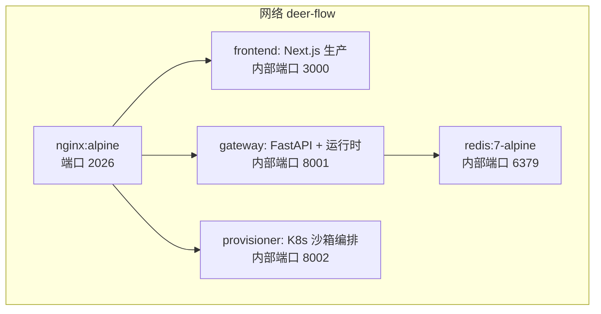
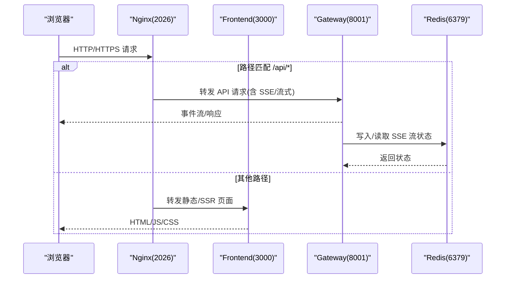
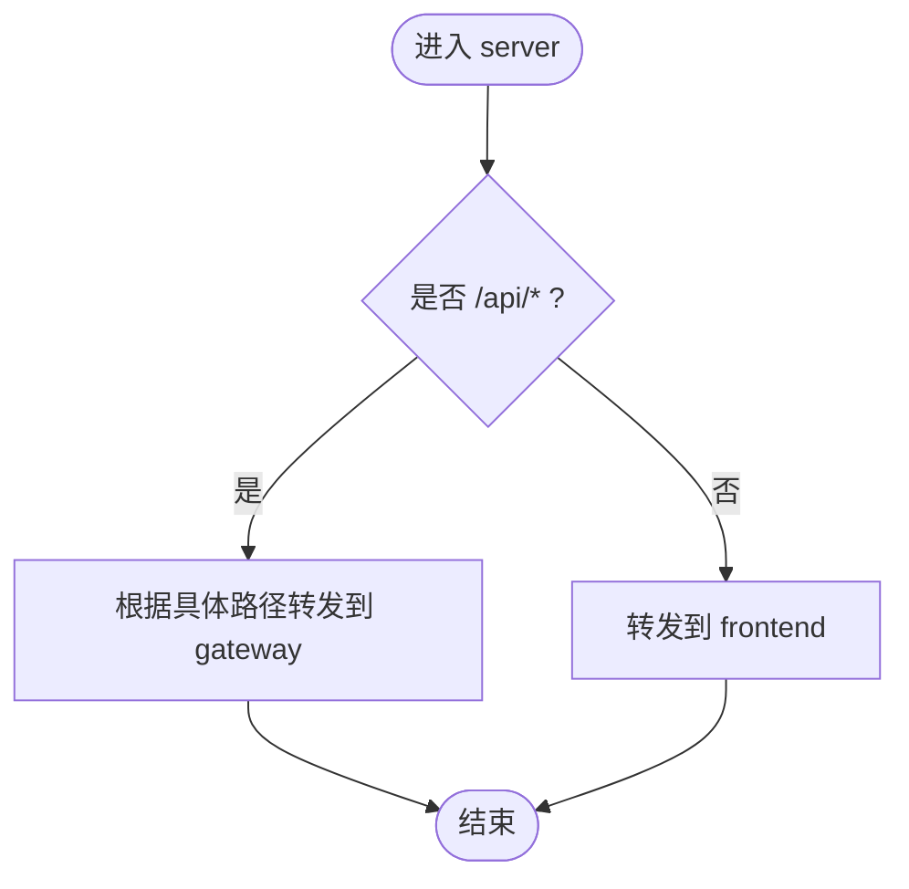
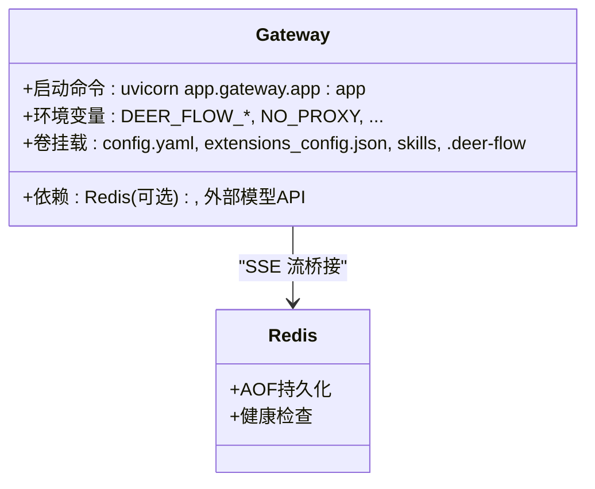
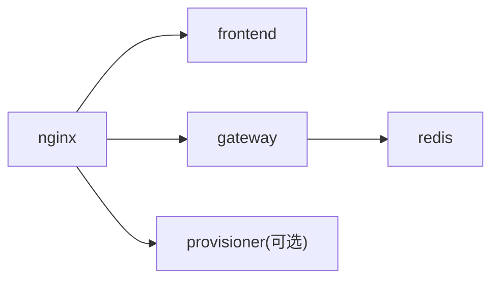

# Docker 容器化部署

<cite>
**本文引用的文件**   
- [docker/docker-compose.yaml](file://docker/docker-compose.yaml)
- [docker/docker-compose-dev.yaml](file://docker/docker-compose-dev.yaml)
- [docker/docker-compose.cli-auth.yaml](file://docker/docker-compose.cli-auth.yaml)
- [docker/docker-compose.dood.yaml](file://docker/docker-compose.dood.yaml)
- [docker/nginx/nginx.conf](file://docker/nginx/nginx.conf)
- [backend/Dockerfile](file://backend/Dockerfile)
- [frontend/Dockerfile](file://frontend/Dockerfile)
- [docker/provisioner/Dockerfile](file://docker/provisioner/Dockerfile)
- [config.example.yaml](file://config.example.yaml)
- [backend/docs/CONFIGURATION.md](file://backend/docs/CONFIGURATION.md)
</cite>

## 目录
1. [简介](#简介)
2. [项目结构](#项目结构)
3. [核心组件](#核心组件)
4. [架构总览](#架构总览)
5. [详细组件分析](#详细组件分析)
6. [依赖关系分析](#依赖关系分析)
7. [性能与构建优化](#性能与构建优化)
8. [部署场景指南](#部署场景指南)
9. [数据持久化与日志](#数据持久化与日志)
10. [安全配置最佳实践](#安全配置最佳实践)
11. [故障排查](#故障排查)
12. [结论](#结论)

## 简介
本文件面向 DeerFlow 的容器化部署，围绕 Docker Compose 编排、镜像构建、多环境配置、数据持久化与安全加固提供完整说明。系统包含以下关键服务：
- Nginx 反向代理：统一入口、路径路由、SSE/流式支持、跨域与协议透传
- Frontend 前端：Next.js 生产镜像，静态资源与 SSR 运行
- Gateway 网关：FastAPI + LangGraph 运行时，承载会话、工具执行、沙箱调度等
- Redis：作为跨 Worker 的 SSE 流桥接后端（可选）
- Provisioner（可选）：Kubernetes 模式下的沙箱 Pod 生命周期管理

## 项目结构
Docker 相关核心文件位于 docker 目录，前后端各自维护独立 Dockerfile；Nginx 配置集中管理；Compose 提供生产与开发两套编排。

**图表来源** 
- [docker/docker-compose.yaml:27-182](file://docker/docker-compose.yaml#L27-L182)
- [docker/nginx/nginx.conf:1-254](file://docker/nginx/nginx.conf#L1-L254)

**章节来源**
- [docker/docker-compose.yaml:1-182](file://docker/docker-compose.yaml#L1-L182)
- [docker/docker-compose-dev.yaml:1-221](file://docker/docker-compose-dev.yaml#L1-L221)

## 核心组件
- Nginx 反向代理
  - 对外暴露 2026 端口，按路径将 /api/* 路由到 gateway，其余请求转发到 frontend
  - 为 SSE/长连接设置超时与缓冲策略，透传 X-Forwarded-* 头以兼容上游 TLS 终止
- Frontend 前端
  - 基于 Node 22 Alpine，使用 pnpm 安装依赖并构建产物，生产镜像仅包含运行期
- Gateway 网关
  - Python 3.12 slim 基础镜像，通过 uv 同步依赖，默认单 worker，可通过环境变量扩展
  - 挂载配置文件、skills、运行时数据目录，连接 Redis 做跨 worker 的 SSE 桥接
- Redis
  - 启用 AOF 持久化，提供健康检查
- Provisioner（可选）
  - 轻量 Python 服务，负责在宿主 Kubernetes 集群中创建/销毁沙箱 Pod

**章节来源**
- [docker/docker-compose.yaml:27-182](file://docker/docker-compose.yaml#L27-L182)
- [docker/nginx/nginx.conf:1-254](file://docker/nginx/nginx.conf#L1-L254)
- [backend/Dockerfile:1-117](file://backend/Dockerfile#L1-L117)
- [frontend/Dockerfile:1-51](file://frontend/Dockerfile#L1-L51)
- [docker/provisioner/Dockerfile:1-30](file://docker/provisioner/Dockerfile#L1-L30)

## 架构总览
下图展示了从浏览器到各服务的请求链路以及关键配置点。

**图表来源** 
- [docker/nginx/nginx.conf:34-254](file://docker/nginx/nginx.conf#L34-L254)
- [docker/docker-compose.yaml:44-143](file://docker/docker-compose.yaml#L44-L143)

## 详细组件分析

### Nginx 反向代理
- 监听 2026 端口，解析 Docker 服务名避免重启后 IP 失效
- 对 /api/langgraph/* 进行重写后转发至 gateway
- 针对上传与大文件路径关闭缓冲，提升稳定性
- 透传 X-Forwarded-Proto 以兼容上游 TLS 终止场景，避免认证失败

**图表来源** 
- [docker/nginx/nginx.conf:34-254](file://docker/nginx/nginx.conf#L34-L254)

**章节来源**
- [docker/nginx/nginx.conf:1-254](file://docker/nginx/nginx.conf#L1-L254)

### Frontend 前端服务
- 多阶段构建：dev 目标仅安装依赖，prod 目标预构建产物
- 通过环境变量注入后端地址与认证密钥
- 生产镜像最小化，仅包含 Node 运行时与构建产物

**章节来源**
- [frontend/Dockerfile:1-51](file://frontend/Dockerfile#L1-L51)
- [docker/docker-compose.yaml:62-79](file://docker/docker-compose.yaml#L62-L79)

### Gateway 网关服务
- 多阶段构建：builder/dev/runtime 三阶段，runtime 不含编译工具链，体积更小
- 通过 uv 缓存加速依赖安装，支持 UV_EXTRAS 按需安装可选依赖
- 默认单 worker，配合 Redis 实现跨 worker 的 SSE 流桥接
- 挂载 config.yaml、extensions_config.json、skills 与运行时数据目录

**图表来源** 
- [backend/Dockerfile:1-117](file://backend/Dockerfile#L1-L117)
- [docker/docker-compose.yaml:81-143](file://docker/docker-compose.yaml#L81-L143)

**章节来源**
- [backend/Dockerfile:1-117](file://backend/Dockerfile#L1-L117)
- [docker/docker-compose.yaml:81-143](file://docker/docker-compose.yaml#L81-L143)

### Redis 缓存服务
- 使用 redis:7-alpine，开启 appendonly 持久化
- 提供健康检查，供 gateway 依赖等待

**章节来源**
- [docker/docker-compose.yaml:27-43](file://docker/docker-compose.yaml#L27-L43)

### Provisioner（可选）
- 用于 Kubernetes 模式，通过 K8s API 管理沙箱 Pod 生命周期
- 需要挂载 kubeconfig，并通过 extra_hosts 访问 host.docker.internal

**章节来源**
- [docker/provisioner/Dockerfile:1-30](file://docker/provisioner/Dockerfile#L1-L30)
- [docker/docker-compose.yaml:145-176](file://docker/docker-compose.yaml#L145-L176)

## 依赖关系分析
- 服务间依赖
  - nginx 依赖 frontend 与 gateway
  - gateway 依赖 redis（健康检查）
  - provisioner 可选，独立于主链路
- 网络隔离
  - 所有服务加入 deer-flow 自定义 bridge 网络
- 外部依赖
  - 模型 API（OpenAI、Anthropic 等）、搜索/抓取服务等通过环境变量或配置注入

**图表来源** 
- [docker/docker-compose.yaml:27-182](file://docker/docker-compose.yaml#L27-L182)

**章节来源**
- [docker/docker-compose.yaml:27-182](file://docker/docker-compose.yaml#L27-L182)

## 性能与构建优化
- 多阶段构建
  - backend：builder 安装编译工具链与 Node，runtime 仅拷贝必要二进制与虚拟环境，显著减小镜像体积
  - frontend：dev 仅安装依赖，prod 预构建产物，减少启动时间
- 依赖缓存
  - backend 使用 --mount=type=cache 缓存 uv 包索引与下载
  - frontend 使用 pnpm store 目录缓存
- 镜像源与镜像替换
  - 支持 APT_MIRROR、UV_IMAGE、UV_INDEX_URL、NPM_REGISTRY 等构建参数，适配受限网络
- 运行时精简
  - runtime 镜像移除 build-essential，保留 Node/npm/npx 与 uv，降低攻击面

**章节来源**
- [backend/Dockerfile:1-117](file://backend/Dockerfile#L1-L117)
- [frontend/Dockerfile:1-51](file://frontend/Dockerfile#L1-L51)

## 部署场景指南

### 单机部署（推荐）
- 使用生产编排：docker compose up -d
- 对外端口 2026，访问 http://localhost:2026
- 通过 .env 注入敏感信息（如 BETTER_AUTH_SECRET、AUTH_JWT_SECRET、模型密钥等）

**章节来源**
- [docker/docker-compose.yaml:1-26](file://docker/docker-compose.yaml#L1-L26)
- [docker/docker-compose.yaml:44-79](file://docker/docker-compose.yaml#L44-L79)

### 开发环境
- 使用开发编排：docker compose -f docker/docker-compose-dev.yaml up --build
- 特点：
  - 源码热重载（bind mount src/public/next.config.js）
  - 独立的 venv 与 uv 缓存卷，避免每次重建
  - 可附加 DooD 或 CLI Auth 覆盖层

**章节来源**
- [docker/docker-compose-dev.yaml:1-221](file://docker/docker-compose-dev.yaml#L1-L221)

### 多实例部署
- 网关多 worker：设置 GATEWAY_WORKERS > 1，需启用 Redis 流桥接
- 注意：取消、去重与 IM 通道状态仍为 worker 本地，建议单 worker 或配合粘性路由
- 前端与 Nginx 可按常规方式水平扩展，共享同一 Redis 与后端 API

**章节来源**
- [docker/docker-compose.yaml:92-98](file://docker/docker-compose.yaml#L92-L98)
- [README_zh.md:247-247](file://README_zh.md#L247-L247)

### Kubernetes 集群部署
- 启用 provisioner 模式：sandbox.use 指向 aio_sandbox 并提供 provisioner_url
- 通过 Nginx Ingress 暴露 2026 端口，将 /api/* 转发到 gateway Service
- 使用 PVC 持久化 .deer-flow 与 uploads，使用 ConfigMap/Secret 注入配置与密钥

**章节来源**
- [backend/docs/CONFIGURATION.md:371-383](file://backend/docs/CONFIGURATION.md#L371-L383)
- [docker/docker-compose.yaml:145-176](file://docker/docker-compose.yaml#L145-L176)

## 数据持久化与日志

### 数据卷
- Redis 数据：redis-data:/data（AOF 持久化）
- 运行时数据：DEER_FLOW_HOME 映射到宿主机目录（默认 .deer-flow），保存会话、JWT 密钥等
- Skills 目录：只读挂载 skills 目录
- 配置文件：config.yaml 与 extensions_config.json 只读挂载

**章节来源**
- [docker/docker-compose.yaml:27-43](file://docker/docker-compose.yaml#L27-L43)
- [docker/docker-compose.yaml:99-115](file://docker/docker-compose.yaml#L99-L115)

### 用户文件存储
- 上传与输出通常落在 .deer-flow 下对应线程目录，或通过 sandbox.mounts 映射到固定路径
- 生产环境建议使用外部存储（对象存储/NFS/PVC）替代本地卷

**章节来源**
- [backend/docs/CONFIGURATION.md:435-454](file://backend/docs/CONFIGURATION.md#L435-L454)

### 日志收集
- Nginx 访问/错误日志输出到 stdout/stderr，便于容器日志采集
- Gateway 日志遵循 Python 标准输出，结合容器编排平台统一收集

**章节来源**
- [docker/nginx/nginx.conf:13-15](file://docker/nginx/nginx.conf#L13-L15)

## 安全配置最佳实践

### 网络隔离
- 使用自定义 bridge 网络 deer-flow，限制服务间直接访问
- 对外仅暴露 Nginx 端口，禁止直接访问 gateway/frontend/redis

**章节来源**
- [docker/docker-compose.yaml:179-182](file://docker/docker-compose.yaml#L179-L182)

### 权限控制
- 配置文件与技能目录只读挂载
- 避免在生产环境挂载宿主 Docker socket（DooD 模式需显式叠加 overlay）

**章节来源**
- [docker/docker-compose.yaml:99-115](file://docker/docker-compose.yaml#L99-L115)
- [docker/docker-compose.dood.yaml:1-27](file://docker/docker-compose.dood.yaml#L1-L27)

### 敏感信息管理
- 使用 .env 或 Secret 注入密钥（BETTER_AUTH_SECRET、AUTH_JWT_SECRET、模型 API Key 等）
- 避免将 ~/.claude 与 ~/.codex 整体挂载，优先使用环境变量传递令牌

**章节来源**
- [docker/docker-compose.cli-auth.yaml:1-37](file://docker/docker-compose.cli-auth.yaml#L1-L37)
- [backend/docs/CONFIGURATION.md:650-678](file://backend/docs/CONFIGURATION.md#L650-L678)

### 认证与会话
- 生产环境务必设置 AUTH_JWT_SECRET，否则每次重启会生成临时密钥导致旧会话失效
- 若部署在上游 TLS 终止代理之后，确保 X-Forwarded-Proto 正确透传

**章节来源**
- [backend/app/gateway/auth/config.py:47-74](file://backend/app/gateway/auth/config.py#L47-L74)
- [docker/nginx/nginx.conf:20-31](file://docker/nginx/nginx.conf#L20-L31)

## 故障排查
- 无法访问 /api/*
  - 检查 Nginx 路径规则与 upstream 变量是否正确
  - 确认 gateway 已启动且端口可达
- SSE/流式中断
  - 检查 Nginx 超时与缓冲设置
  - 确认 Redis 可用且 URL 配置正确
- 登录失败或会话丢失
  - 检查 AUTH_JWT_SECRET 是否设置
  - 检查上游代理是否透传 X-Forwarded-Proto
- 沙箱无法启动
  - 确认 sandbox.use 与 provisioner_url 配置一致
  - 检查 Kubeconfig 与 K8s API Server 可达性

**章节来源**
- [docker/nginx/nginx.conf:44-78](file://docker/nginx/nginx.conf#L44-L78)
- [docker/docker-compose.yaml:116-143](file://docker/docker-compose.yaml#L116-L143)
- [backend/docs/CONFIGURATION.md:371-383](file://backend/docs/CONFIGURATION.md#L371-L383)

## 结论
DeerFlow 的容器化方案以 Nginx 为统一入口，Frontend 与 Gateway 解耦，Redis 提供跨 worker 的流式能力，Provisioner 支持 Kubernetes 沙箱模式。通过多阶段构建与缓存策略，镜像体积与构建速度得到优化。生产部署应重视网络隔离、最小权限挂载与敏感信息管理，并结合日志与监控体系保障稳定性与可观测性。