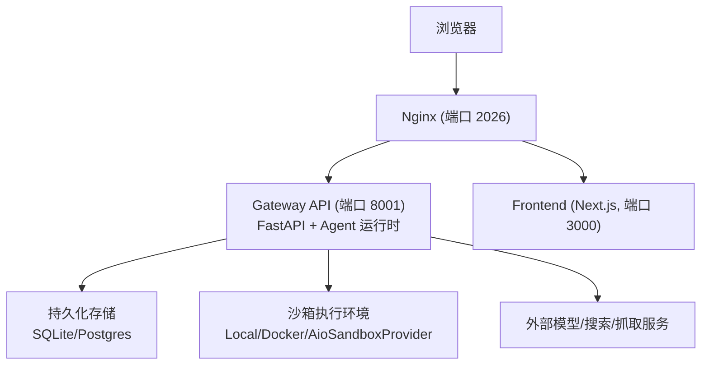
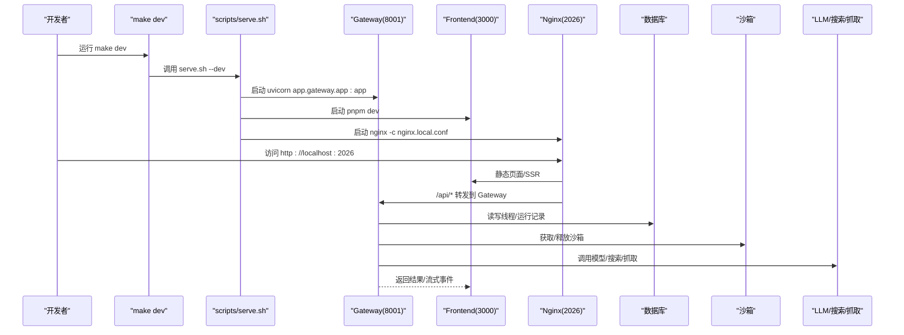
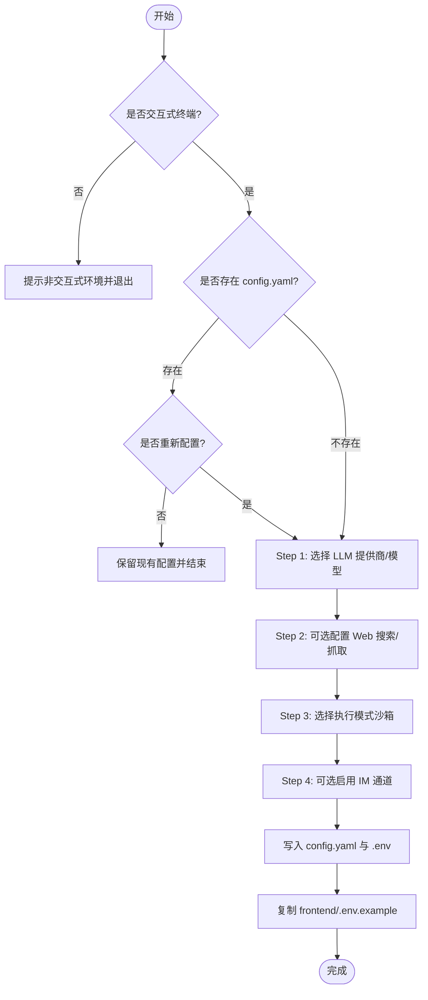
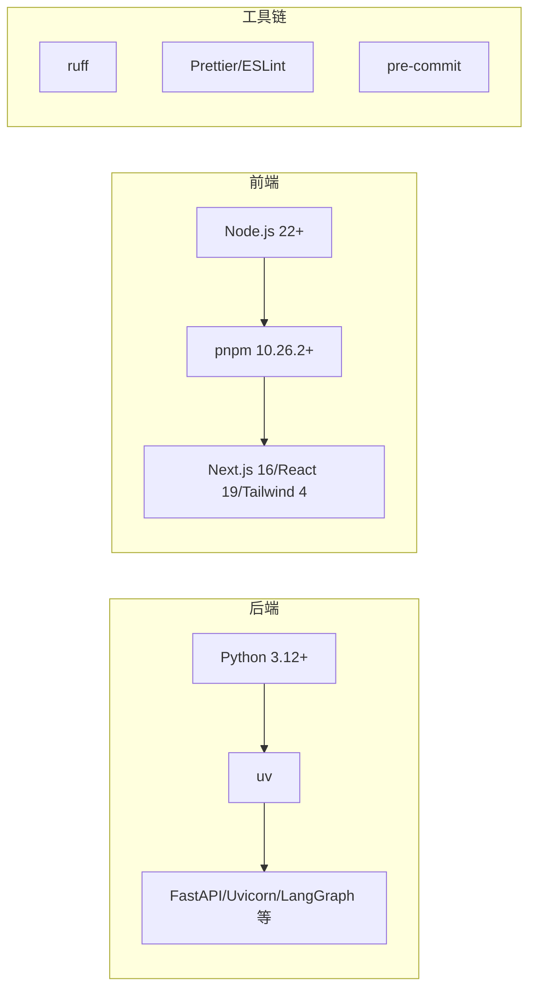

# 开发环境搭建

<cite>
**本文引用的文件**   
- [README.md](file://README.md)
- [backend/README.md](file://backend/README.md)
- [frontend/README.md](file://frontend/README.md)
- [Makefile](file://Makefile)
- [backend/Makefile](file://backend/Makefile)
- [frontend/Makefile](file://frontend/Makefile)
- [scripts/setup_wizard.py](file://scripts/setup_wizard.py)
- [scripts/configure.py](file://scripts/configure.py)
- [scripts/doctor.py](file://scripts/doctor.py)
- [scripts/check.py](file://scripts/check.py)
- [scripts/serve.sh](file://scripts/serve.sh)
- [scripts/docker.sh](file://scripts/docker.sh)
- [config.example.yaml](file://config.example.yaml)
- [.env.example](file://.env.example)
- [frontend/.env.example](file://frontend/.env.example)
- [backend/pyproject.toml](file://backend/pyproject.toml)
- [frontend/package.json](file://frontend/package.json)
</cite>

## 目录
1. [简介](#简介)
2. [项目结构](#项目结构)
3. [核心组件](#核心组件)
4. [架构总览](#架构总览)
5. [详细组件分析](#详细组件分析)
6. [依赖关系分析](#依赖关系分析)
7. [性能与资源建议](#性能与资源建议)
8. [故障排查指南](#故障排查指南)
9. [结论](#结论)
10. [附录](#附录)

## 简介
本文件面向 DeerFlow 本地开发者，提供从零开始的完整开发环境搭建指南。内容涵盖：
- 基础依赖安装（Python 3.12+、Node.js 22+、pnpm、uv、nginx）
- 项目初始化流程（交互式配置向导、环境变量、数据库与沙箱模式选择）
- 多种启动方式（前端开发服务器、后端 API 服务、TUI 终端界面、Docker 开发/生产）
- 开发工具配置（IDE、调试、代码格式化）
- 常见问题排查与解决方案

## 项目结构
DeerFlow 采用前后端分离 + Nginx 统一入口的架构：
- 根目录 Makefile 提供统一的开发命令入口
- backend 为 FastAPI Gateway 与 Agent 运行时
- frontend 为 Next.js Web 界面
- scripts 包含一键启动、Docker 管理、健康检查等脚本
- config.example.yaml 与 .env.example 提供配置模板与环境变量参考

图表来源
- [backend/README.md:10-36](file://backend/README.md#L10-L36)
- [scripts/serve.sh:455-489](file://scripts/serve.sh#L455-L489)

章节来源
- [README.md:95-131](file://README.md#L95-L131)
- [backend/README.md:10-36](file://backend/README.md#L10-L36)
- [frontend/README.md:11-36](file://frontend/README.md#L11-L36)

## 核心组件
- 统一入口与命令集：根 Makefile 聚合了安装、检查、配置、启动、停止、Docker 管理等常用操作
- 交互式配置向导：scripts/setup_wizard.py 引导选择 LLM 提供商、搜索/抓取工具、执行模式（沙箱）、IM 通道等，并生成 config.yaml 与 .env
- 健康检查与诊断：scripts/doctor.py 检查系统要求、配置完整性、LLM 包与密钥、Web 能力、沙箱可用性等
- 依赖预检：scripts/check.py 校验 Node.js、pnpm、uv、nginx 是否满足最低版本
- 服务编排：scripts/serve.sh 负责启动 Gateway、Frontend、Nginx，支持前台/后台、开发/生产模式
- Docker 开发：scripts/docker.sh 基于 docker-compose-dev.yaml 拉起容器，自动检测沙箱模式并决定是否挂载宿主机 Docker socket

章节来源
- [Makefile:19-51](file://Makefile#L19-L51)
- [scripts/setup_wizard.py:21-167](file://scripts/setup_wizard.py#L21-L167)
- [scripts/doctor.py:685-776](file://scripts/doctor.py#L685-L776)
- [scripts/check.py:60-166](file://scripts/check.py#L60-L166)
- [scripts/serve.sh:455-489](file://scripts/serve.sh#L455-L489)
- [scripts/docker.sh:176-280](file://scripts/docker.sh#L176-L280)

## 架构总览
下图展示了本地开发时各组件的交互关系与数据流向。

图表来源
- [scripts/serve.sh:455-489](file://scripts/serve.sh#L455-L489)
- [backend/README.md:10-36](file://backend/README.md#L10-L36)

## 详细组件分析

### 前置依赖与安装
- Python 3.12+：后端与向导脚本运行环境
- Node.js 22+：前端构建与开发
- pnpm 10.26.2+：前端包管理器
- uv：Python 包管理与工作区同步
- nginx：本地反向代理（可选，也可使用 Docker 模式）

推荐安装步骤
- 在仓库根目录执行依赖检查：make check
- 安装全部依赖（后端 + 前端 + pre-commit）：make install
- 可选：预拉取沙箱镜像（若使用容器沙箱）：make setup-sandbox

章节来源
- [scripts/check.py:60-166](file://scripts/check.py#L60-L166)
- [Makefile:78-96](file://Makefile#L78-L96)
- [backend/pyproject.toml:1-10](file://backend/pyproject.toml#L1-L10)
- [frontend/package.json:118-119](file://frontend/package.json#L118-L119)

### 项目初始化与配置
- 交互式向导：make setup 会运行 scripts/setup_wizard.py，引导你完成以下配置：
  - 选择 LLM 提供商与模型
  - 可选配置 Web 搜索/抓取工具
  - 选择执行模式（LocalSandboxProvider 或 AioSandboxProvider）
  - 可选启用 IM 通道
  - 自动生成 config.yaml 与 .env，并复制 frontend/.env.example
- 手动模板：make config 仅复制模板文件（不会覆盖已有配置）
- 配置升级：make config-upgrade 将新字段合并进现有 config.yaml

配置文件与环境变量
- 主配置：config.yaml（示例见 config.example.yaml）
- 环境变量：.env.example（含各类 API Key、数据库 URL、CORS 等）
- 前端环境变量：frontend/.env.example（默认通过 Nginx 代理，无需额外设置）

数据库初始化
- 应用表由 Alembic 管理，Gateway 启动时自动执行 schema 迁移（upgrade head），无需手动运行 alembic
- 支持的数据库后端：sqlite、postgres（在 config.yaml 中指定 database.backend）

章节来源
- [scripts/setup_wizard.py:21-167](file://scripts/setup_wizard.py#L21-L167)
- [scripts/configure.py:20-54](file://scripts/configure.py#L20-L54)
- [config.example.yaml:1-18](file://config.example.yaml#L1-L18)
- [.env.example:1-102](file://.env.example#L1-L102)
- [frontend/.env.example:1-23](file://frontend/.env.example#L1-L23)
- [backend/README.md:391-416](file://backend/README.md#L391-L416)

### 启动方式与组合
- 一键启动（推荐）：make dev（前台热重载）或 make dev-daemon（后台守护）
- 生产模式：make start 或 make start-daemon
- 仅 Gateway：cd backend && make gateway（端口 8001）
- 仅 Frontend：cd frontend && pnpm dev（端口 3000）
- 仅 Nginx：make nginx（使用本地开发配置）
- TUI 终端界面：uv pip install 'deerflow-harness[tui]' 后运行 deerflow（无需 Gateway/Frontend/Nginx/Docker）
- Docker 开发：make docker-init（拉取沙箱镜像）→ make docker-start（根据 config.yaml 自动检测沙箱模式）

端口说明
- Nginx：2026（统一入口）
- Gateway：8001（REST API + Agent 运行时）
- Frontend：3000（Next.js 开发服务器）

路由说明
- /api/langgraph/* → Gateway LangGraph 兼容接口
- /api/*（其他）→ Gateway REST API
- /（非 API）→ Frontend

章节来源
- [Makefile:101-134](file://Makefile#L101-L134)
- [backend/Makefile:4-8](file://backend/Makefile#L4-L8)
- [frontend/Makefile:7-8](file://frontend/Makefile#L7-L8)
- [scripts/serve.sh:455-489](file://scripts/serve.sh#L455-L489)
- [backend/README.md:187-217](file://backend/README.md#L187-L217)
- [README.md:307-321](file://README.md#L307-L321)

### 开发工具与 IDE 配置
- 代码风格与格式化
  - Python：ruff（行宽 240，双引号，4 空格缩进）
  - 前端：Prettier + ESLint + TypeScript 类型检查
- 提交前钩子：pre-commit（make install 已自动安装）
- 调试
  - 后端：使用 uvicorn 的 --reload 进行热重载；IDE 可附加到 uvicorn 进程
  - 前端：pnpm dev 使用 Turbopack 加速；VS Code 可配置 Chrome 调试器
- 日志位置
  - logs/gateway.log、logs/frontend.log、logs/nginx.log

章节来源
- [backend/README.md:417-424](file://backend/README.md#L417-L424)
- [frontend/README.md:127-142](file://frontend/README.md#L127-L142)
- [scripts/serve.sh:475-489](file://scripts/serve.sh#L475-L489)

### 配置向导流程图

图表来源
- [scripts/setup_wizard.py:21-167](file://scripts/setup_wizard.py#L21-L167)

## 依赖关系分析
- 后端依赖
  - Python >= 3.12
  - FastAPI、Uvicorn、LangGraph SDK、HTTP 客户端、IM 集成库等
  - 可选 extras：postgres、redis、discord
- 前端依赖
  - Node.js 22+
  - pnpm 10.26.2+
  - Next.js 16、React 19、Tailwind CSS 4、Shadcn UI 等
- 工具链
  - ruff（Python 格式/检查）
  - Prettier + ESLint（前端）
  - pre-commit（提交前钩子）

图表来源
- [backend/pyproject.toml:1-10](file://backend/pyproject.toml#L1-L10)
- [frontend/package.json:118-119](file://frontend/package.json#L118-L119)
- [backend/README.md:417-424](file://backend/README.md#L417-L424)
- [frontend/README.md:127-142](file://frontend/README.md#L127-L142)

章节来源
- [backend/pyproject.toml:1-63](file://backend/pyproject.toml#L1-L63)
- [frontend/package.json:1-120](file://frontend/package.json#L1-L120)

## 性能与资源建议
- 本地评估/开发：建议 8 vCPU、16 GB RAM，SSD 剩余空间充足
- Docker 开发：需要更多内存与磁盘（镜像构建、bind mounts、沙箱容器）
- 长期运行服务：建议更高规格 CPU/内存与更大磁盘
- 若 CPU/内存持续满载，优先降低并发运行数，再考虑升级规格

章节来源
- [README.md:217-229](file://README.md#L217-L229)

## 故障排查指南
- 依赖缺失或版本不匹配
  - 使用 make check 快速定位 Node.js、pnpm、uv、nginx 问题
  - 使用 make doctor 进行更全面的配置与运行时检查
- 配置未生效或未找到
  - 确认 config.yaml 存在且可通过 AppConfig 加载
  - 使用 make config-upgrade 合并新字段
- 端口占用或服务无法启动
  - 使用 make stop 清理旧进程与端口
  - 查看 logs/{gateway,frontend,nginx}.log 定位错误
- Docker 相关
  - Linux 下 Docker socket 权限不足：将用户加入 docker 组并重登
  - AioSandboxProvider 需宿主 Docker socket，仅在必要场景挂载
- 数据库迁移
  - Gateway 启动会自动执行迁移，无需手动运行 alembic
- 追踪与诊断
  - 使用 make support-bundle 生成问题摘要与证据包，便于提 Issue

章节来源
- [scripts/check.py:60-166](file://scripts/check.py#L60-L166)
- [scripts/doctor.py:685-776](file://scripts/doctor.py#L685-L776)
- [scripts/serve.sh:250-269](file://scripts/serve.sh#L250-L269)
- [README.md:246-248](file://README.md#L246-L248)
- [backend/README.md:391-416](file://backend/README.md#L391-L416)

## 结论
通过以上步骤，你可以在本地快速搭建 DeerFlow 的开发环境，并根据需要选择独立或组合启动方式。借助向导与诊断工具，能高效完成配置与排障。建议在开发中使用 Docker 模式以获得一致的沙箱体验，并在生产部署时遵循安全与资源配置建议。

## 附录
- 常用命令速查
  - make check / make install / make setup / make config / make config-upgrade
  - make dev / make start / make stop / make clean
  - make docker-init / make docker-start / make docker-stop / make docker-logs
  - cd backend && make gateway / cd frontend && pnpm dev
  - deerflow（TUI 终端界面）

章节来源
- [Makefile:19-51](file://Makefile#L19-L51)
- [backend/Makefile:4-8](file://backend/Makefile#L4-L8)
- [frontend/Makefile:7-8](file://frontend/Makefile#L7-L8)
- [backend/README.md:187-217](file://backend/README.md#L187-L217)